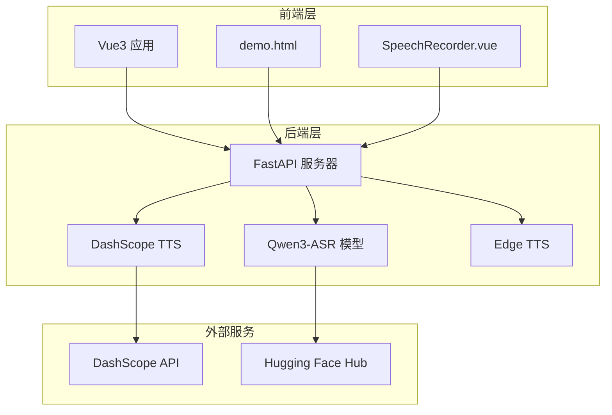
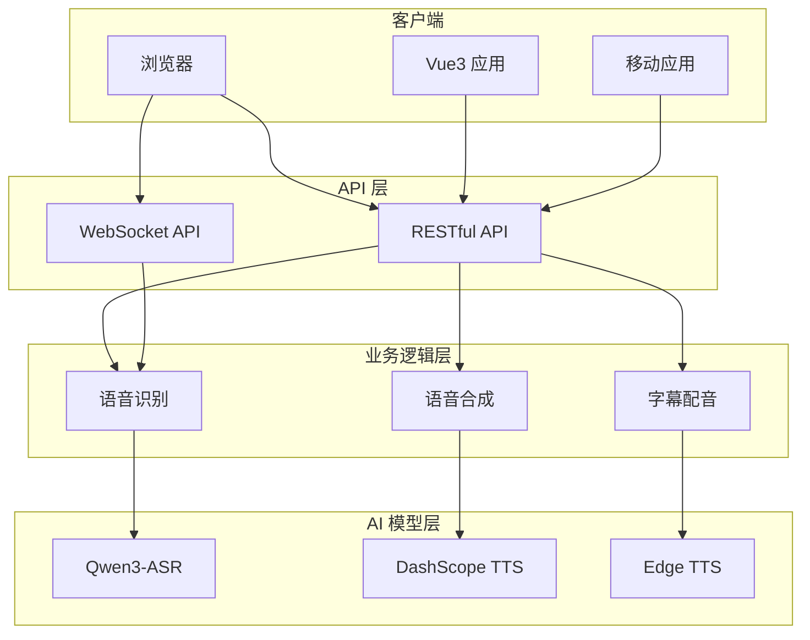
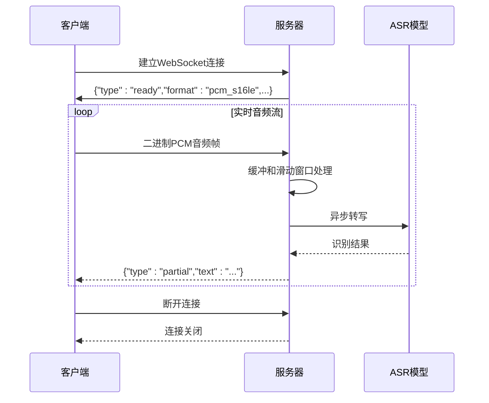
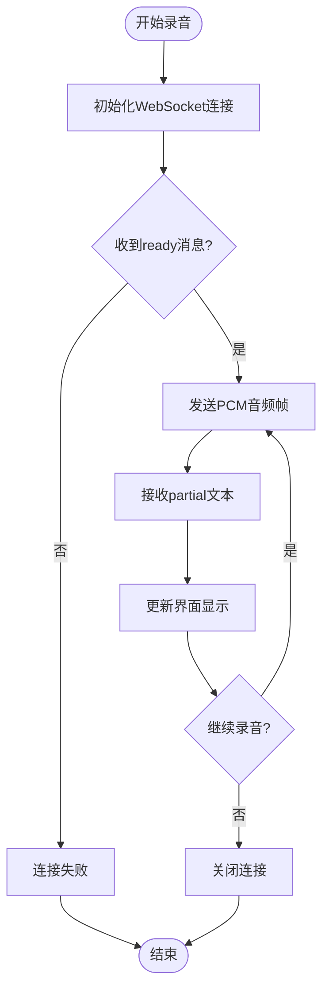
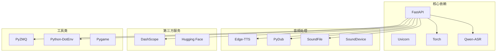
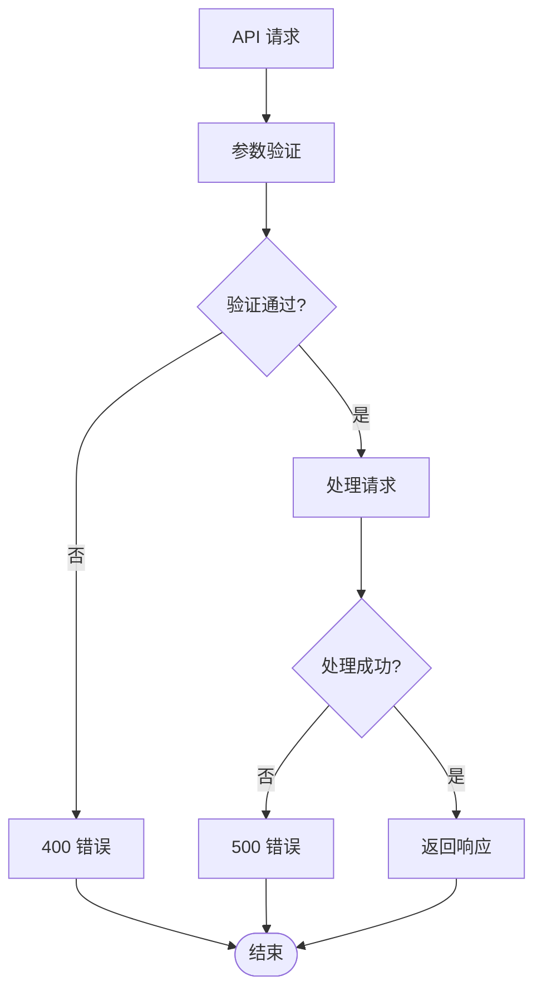

# API接口参考

<cite>
**本文档引用的文件**
- [server.py](file://server.py)
- [demo.html](file://demo.html)
- [SpeechRecorder.vue](file://SpeechRecorder.vue)
- [README.md](file://README.md)
- [requirements.txt](file://requirements.txt)
- [tts_voices_catalog.json](file://tts_voices_catalog.json)
- [qwen3stream.py](file://qwen3stream.py)
- [zmqserver.py](file://zmqserver.py)
- [qwen-flash.json](file://qwen-flash.json)
</cite>

## 目录
1. [简介](#简介)
2. [项目结构](#项目结构)
3. [核心组件](#核心组件)
4. [架构概览](#架构概览)
5. [详细组件分析](#详细组件分析)
6. [依赖关系分析](#依赖关系分析)
7. [性能考虑](#性能考虑)
8. [故障排除指南](#故障排除指南)
9. [结论](#结论)

## 简介

Vue3Speech 是一个基于 Vue3 和 FastAPI 构建的语音处理应用，提供了完整的语音识别（ASR）和语音合成（TTS）解决方案。该项目集成了 Qwen3-ASR 1.7B 模型进行语音识别，支持实时 WebSocket 流式识别，以及通过 DashScope API 进行语音合成。

## 项目结构



**图表来源**
- [server.py:67-95](file://server.py#L67-L95)
- [README.md:8-18](file://README.md#L8-L18)

**章节来源**
- [README.md:5-18](file://README.md#L5-L18)
- [requirements.txt:1-13](file://requirements.txt#L1-L13)

## 核心组件

### FastAPI 服务器
项目的核心是基于 FastAPI 构建的 Web 服务器，提供了 RESTful API 和 WebSocket 接口。

### ASR 模型集成
集成了 Qwen3-ASR 1.7B 模型，支持多种音频格式的语音识别。

### TTS 语音合成
通过 DashScope API 提供高质量的语音合成服务，支持多种音色和语言。

### WebSocket 实时识别
实现了基于 WebSocket 的实时语音识别，支持流式音频传输和实时文本输出。

**章节来源**
- [server.py:67-95](file://server.py#L67-L95)
- [server.py:124-196](file://server.py#L124-L196)

## 架构概览



**图表来源**
- [server.py:124-196](file://server.py#L124-L196)
- [server.py:212-247](file://server.py#L212-L247)

## 详细组件分析

### RESTful API 接口

#### 健康检查接口
- **URL**: GET /
- **描述**: 健康检查端点
- **响应**: `{"message": "Qwen ASR backend is running"}`

**章节来源**
- [server.py:199-201](file://server.py#L199-L201)

#### 演示页面接口
- **URL**: GET /demo
- **描述**: 返回演示页面 HTML
- **响应**: HTML 页面内容

**章节来源**
- [server.py:204-209](file://server.py#L204-L209)

#### 语音识别接口
- **URL**: POST /transcribe
- **内容类型**: multipart/form-data
- **参数**: file (音频文件)
- **支持格式**: WAV, MP3, M4A, OGG, WEBM, FLAC
- **响应**: `{ "language": "...", "text": "..." }`

**章节来源**
- [server.py:367-424](file://server.py#L367-L424)
- [README.md:114-118](file://README.md#L114-L118)

#### 语音合成接口
- **URL**: POST /tts
- **内容类型**: application/json
- **请求体**: `{ "text": "...", "voice": "Cherry" }`
- **响应**: DashScope API 原始响应（通常包含 `output.audio.url` 或 `output.audio.data`）

**章节来源**
- [server.py:212-247](file://server.py#L212-L247)
- [README.md:139-145](file://README.md#L139-L145)

#### 语音列表接口
- **URL**: GET /tts/voices
- **描述**: 返回支持的语音列表
- **响应**: 来自 `tts_voices_catalog.json` 的数据

**章节来源**
- [server.py:250-253](file://server.py#L250-L253)
- [README.md:130-137](file://README.md#L130-L137)

#### Edge TTS 语音查询接口
- **URL**: GET /tts/edge-voices
- **查询参数**: 
  - locale: 可选，按区域过滤
  - gender: 可选，Female 或 Male
- **响应**: 包含语音列表和计数

**章节来源**
- [server.py:256-297](file://server.py#L256-L297)

#### Edge 字幕配音接口
- **URL**: POST /tts/edge-subtitle-voiceover
- **内容类型**: application/json
- **请求体**: 字幕时间轴数据
- **响应**: MP3 文件

**章节来源**
- [server.py:300-321](file://server.py#L300-L321)

#### Edge 字幕配音链接接口
- **URL**: POST /tts/edge-subtitle-voiceover/link
- **内容类型**: application/json
- **请求体**: 字幕时间轴数据
- **响应**: 包含文件路径和 URL 的 JSON

**章节来源**
- [server.py:324-345](file://server.py#L324-L345)

#### Edge 配音文件获取接口
- **URL**: GET /tts/edge-voiceover-files/{file_id}
- **路径参数**: file_id (文件标识符)
- **响应**: MP3 文件

**章节来源**
- [server.py:348-360](file://server.py#L348-L360)

### WebSocket 接口

#### 实时语音识别 WebSocket
- **URL**: ws://host/ws/asr 或 wss://host/ws/asr
- **入站数据**: 二进制帧，16kHz、单声道、16bit 小端 PCM
- **出站数据**: JSON 文本帧
  - `{ "type": "ready", ... }` - 连接就绪
  - `{ "type": "partial", "language": "...", "text": "..." }` - 部分识别结果
  - `{ "type": "error", "message": "..." }` - 错误信息

**章节来源**
- [server.py:124-196](file://server.py#L124-L196)
- [README.md:120-128](file://README.md#L120-L128)

### WebSocket 消息格式



**图表来源**
- [server.py:124-196](file://server.py#L124-L196)

### 客户端集成示例

#### JavaScript 客户端
```javascript
// 语音识别上传
const fd = new FormData();
fd.append('file', audioFile);
const r = await fetch('/transcribe', { method: 'POST', body: fd });
const { text, language } = await r.json();

// TTS 合成
const r = await fetch('/tts', {
  method: 'POST',
  headers: { 'Content-Type': 'application/json' },
  body: JSON.stringify({ text: '你好', voice: 'Vivian' }),
});
const data = await r.json();
const url = data.output?.audio?.url;
```

**章节来源**
- [README.md:155-176](file://README.md#L155-L176)
- [demo.html:333-382](file://demo.html#L333-L382)

#### Vue.js 集成
```vue
<template>
    <div class="speech-recorder">
        <button @click="toggleRecording">
            {{ isRecording ? '停止录音' : '开始录音' }}
        </button>
        <p v-if="transcription">识别结果：{{ transcription }}</p>
        <p v-if="error" class="error">错误：{{ error }}</p>
    </div>
</template>

<script setup>
// Vue3 录音组件集成
</script>
```

**章节来源**
- [SpeechRecorder.vue:1-90](file://SpeechRecorder.vue#L1-L90)

### WebSocket 客户端实现



**图表来源**
- [demo.html:486-564](file://demo.html#L486-L564)

**章节来源**
- [demo.html:486-564](file://demo.html#L486-L564)

## 依赖关系分析

### 外部依赖



**图表来源**
- [requirements.txt:1-13](file://requirements.txt#L1-L13)

### 环境变量配置

| 环境变量 | 类型 | 默认值 | 描述 |
|---------|------|--------|------|
| DASHSCOPE_API_KEY | 字符串 | 无 | DashScope API 密钥 |
| ASR_MODEL_PATH | 字符串 | Qwen3-ASR-1.7B | ASR 模型本地路径 |
| UVICORN_HOST | 字符串 | 0.0.0.0 | 服务器绑定地址 |
| UVICORN_PORT | 整数 | 8000 | 服务器端口号 |
| ASR_WS_DECODE_INTERVAL_S | 浮点数 | 1.2 | WebSocket 解码间隔（秒） |
| ASR_WS_MAX_WINDOW_S | 浮点数 | 12 | 最大音频窗口（秒） |
| FFMPEG_PATH | 字符串 | 无 | FFmpeg 可执行文件路径 |

**章节来源**
- [README.md:48-66](file://README.md#L48-L66)
- [README.md:68-76](file://README.md#L68-L76)
- [README.md:77-82](file://README.md#L77-L82)

## 性能考虑

### WebSocket 实时识别优化
- **滑动窗口**: 使用 12 秒最大窗口，平衡延迟和准确性
- **解码间隔**: 1.2 秒解码间隔，减少计算负载
- **音频格式**: 16kHz 单声道 PCM，降低传输和处理开销

### ASR 模型优化
- **设备选择**: 自动检测 CUDA 设备，优先使用 GPU
- **批量推理**: 支持最大 32 的推理批量大小
- **内存管理**: 及时清理临时文件和音频缓冲区

### CORS 配置
- **跨域支持**: 默认允许所有来源、方法和头部
- **生产环境建议**: 限制到特定域名，提高安全性

**章节来源**
- [server.py:78-95](file://server.py#L78-L95)
- [server.py:136-137](file://server.py#L136-L137)
- [server.py:69-76](file://server.py#L69-L76)

## 故障排除指南

### 常见问题及解决方案

| 症状 | 可能原因 | 解决方案 |
|------|----------|----------|
| 连接 huggingface.co 超时 | 网络问题 | 配置本地 ASR 模型路径 |
| torchvision::nms 版本错误 | 依赖版本不匹配 | 卸载不匹配的 torchvision |
| DashScope API 调用失败 | 缺少 API Key | 检查 .env 文件配置 |
| WebSocket 连接失败 | 网络或防火墙 | 检查服务器可达性和端口开放 |
| 音频格式识别失败 | 缺少 FFmpeg | 安装 FFmpeg 并配置环境变量 |

### 错误处理机制



**图表来源**
- [server.py:367-424](file://server.py#L367-L424)

**章节来源**
- [README.md:194-204](file://README.md#L194-L204)

## 结论

Vue3Speech 提供了一个完整且高效的语音处理解决方案，集成了先进的 ASR 和 TTS 技术。项目具有以下特点：

1. **完整的 API 生态**: 提供 RESTful API 和 WebSocket 接口
2. **高性能实现**: 优化的实时识别和音频处理
3. **易于集成**: 提供多种客户端集成示例
4. **灵活配置**: 支持多种环境变量和部署选项

该系统适用于需要语音识别和合成功能的各种应用场景，包括教育、娱乐、企业服务等领域。