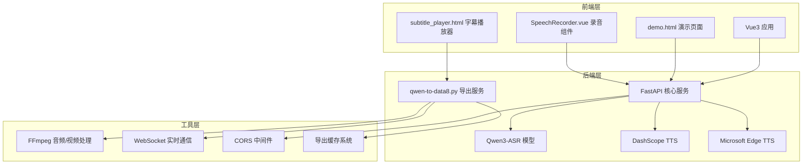
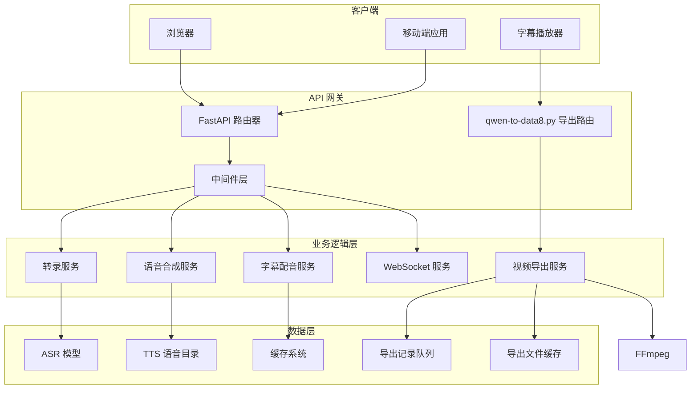
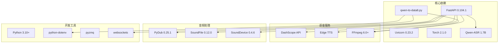
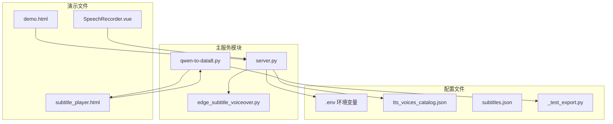

# HTTP RESTful API端点

<cite>
**本文档引用的文件**
- [server.py](file://server.py)
- [edge_subtitle_voiceover.py](file://edge_subtitle_voiceover.py)
- [tts_voices_catalog.json](file://tts_voices_catalog.json)
- [demo.html](file://demo.html)
- [README.md](file://README.md)
- [requirements.txt](file://requirements.txt)
- [subtitles.json](file://subtitles.json)
- [qwen-to-data8.py](file://qwen-to-data8.py)
- [subtitle_player.html](file://subtitle_player.html)
- [_test_export.py](file://_test_export.py)
</cite>

## 更新摘要
**变更内容**
- 新增 /api/inject_test 端点用于测试记录注入
- 新增 /api/export 端点用于视频导出功能
- 增强 WebSocket 服务以支持视频导出的实时反馈
- 更新视频导出流程和相关API交互

## 目录
1. [简介](#简介)
2. [项目结构](#项目结构)
3. [核心组件](#核心组件)
4. [架构概览](#架构概览)
5. [详细端点文档](#详细端点文档)
6. [依赖分析](#依赖分析)
7. [性能考虑](#性能考虑)
8. [故障排除指南](#故障排除指南)
9. [结论](#结论)

## 简介

Vue3 Speech 是一个基于 Vue3 和 FastAPI 构建的语音应用，集成了语音识别（ASR）和语音合成（TTS）功能。该项目提供了完整的语音处理解决方案，包括实时语音识别、批量音频转录、语音合成以及字幕配音生成等功能。**更新**：新增了视频导出功能，支持将音频片段和字幕合成到视频中。

## 项目结构



**图表来源**
- [server.py:67-76](file://server.py#L67-L76)
- [qwen-to-data8.py:284-401](file://qwen-to-data8.py#L284-L401)
- [requirements.txt:1-13](file://requirements.txt#L1-L13)

**章节来源**
- [README.md:5-19](file://README.md#L5-L19)
- [requirements.txt:1-13](file://requirements.txt#L1-L13)

## 核心组件

### 语音识别组件
- **Qwen3-ASR 模型**：用于音频转文字的深度学习模型
- **实时识别**：通过 WebSocket 提供准实时语音识别
- **批量转录**：支持上传音频文件进行批量转录

### 语音合成组件
- **DashScope TTS**：阿里云语音合成服务
- **Edge TTS**：Microsoft Edge 语音合成服务
- **字幕配音**：基于时间轴的字幕同步配音生成

### 视频导出组件
- **导出服务**：基于 qwen-to-data8.py 的视频导出功能
- **音频拼接**：将多个音频片段按时间顺序拼接
- **字幕嵌入**：生成SRT字幕并嵌入到视频中
- **实时反馈**：通过WebSocket提供导出进度和状态

### 辅助组件
- **FFmpeg**：音频格式转换和视频处理
- **WebSocket**：实时音频流传输和导出状态反馈
- **CORS**：跨域资源共享支持

**章节来源**
- [README.md:21-27](file://README.md#L21-L27)
- [server.py:88-95](file://server.py#L88-L95)
- [qwen-to-data8.py:76-267](file://qwen-to-data8.py#L76-L267)

## 架构概览



**图表来源**
- [server.py:67-95](file://server.py#L67-L95)
- [server.py:124-197](file://server.py#L124-L197)
- [qwen-to-data8.py:284-401](file://qwen-to-data8.py#L284-L401)

## 详细端点文档

### 健康检查端点

#### GET /
**描述**：系统健康检查端点，用于验证服务是否正常运行

**请求参数**：
- 无参数

**响应格式**：
```json
{
  "message": "Qwen ASR backend is running"
}
```

**状态码**：
- 200 OK：服务正常运行

**请求示例**：
```bash
curl -X GET http://localhost:8000/
```

**响应示例**：
```json
{
  "message": "Qwen ASR backend is running"
}
```

**章节来源**
- [server.py:199-201](file://server.py#L199-L201)
- [README.md:102-108](file://README.md#L102-L108)

### 演示页面端点

#### GET /demo
**描述**：返回演示页面，包含录音、实时识别和语音合成功能

**请求参数**：
- 无参数

**响应格式**：HTML 页面内容

**状态码**：
- 200 OK：成功返回演示页面
- 404 Not Found：demo.html 文件不存在

**请求示例**：
```bash
curl -X GET http://localhost:8000/demo
```

**响应示例**：
```html
<!DOCTYPE html>
<html>
<head>
    <title>麦克风语音识别演示</title>
    <!-- HTML 内容 -->
</head>
<body>
    <!-- 页面内容 -->
</body>
</html>
```

**章节来源**
- [server.py:204-209](file://server.py#L204-L209)
- [README.md:110-112](file://README.md#L110-L112)

### 实时语音识别端点

#### WebSocket /ws/asr
**描述**：通过 WebSocket 提供实时语音识别服务

**连接参数**：
- 无查询参数

**消息格式**：

**入站消息**（客户端发送）：
- 类型：二进制帧
- 格式：16kHz、单声道、16bit 小端 PCM（pcm_s16le）

**出站消息**（服务器发送）：
- `{ "type": "ready", "format": "pcm_s16le", "sample_rate": 16000, "channels": 1, "decode_interval_s": 1.2, "max_window_s": 12 }`
- `{ "type": "partial", "language": "...", "text": "..." }`
- `{ "type": "error", "message": "..." }`

**状态码**：
- 101 Switching Protocols：WebSocket 连接建立
- 500 Internal Server Error：服务器内部错误

**连接示例**：
```javascript
const ws = new WebSocket('ws://localhost:8000/ws/asr');
ws.onmessage = function(event) {
    const message = JSON.parse(event.data);
    if (message.type === 'partial') {
        console.log('识别结果:', message.text);
    }
};
```

**章节来源**
- [server.py:124-197](file://server.py#L124-L197)
- [README.md:120-128](file://README.md#L120-L128)

### 音频转录端点

#### POST /transcribe
**描述**：上传音频文件进行转录，支持多种音频格式

**请求参数**：
- Content-Type: multipart/form-data
- 字段：file（必需）- 音频文件

**支持的音频格式**：
- WAV（推荐）
- MP3
- M4A
- OGG
- WEBM
- FLAC

**响应格式**：
```json
{
  "language": "zh-CN",
  "text": "这是转录后的文本内容"
}
```

**状态码**：
- 200 OK：转录成功
- 400 Bad Request：文件名缺失或文件为空
- 400 Bad Request：不支持的音频格式
- 400 Bad Request：无法解码 webm/ogg（缺少 ffmpeg）
- 500 Internal Server Error：转录失败或 ffmpeg 转码失败

**请求示例**：
```bash
curl -X POST http://localhost:8000/transcribe \
  -H "Content-Type: multipart/form-data" \
  -F "file=@audio.wav"
```

**响应示例**：
```json
{
  "language": "zh-CN",
  "text": "你好，世界"
}
```

**章节来源**
- [server.py:367-425](file://server.py#L367-L425)
- [README.md:114-118](file://README.md#L114-L118)

### 语音合成端点

#### POST /tts
**描述**：调用 DashScope 语音合成服务生成音频

**请求参数**：
- Content-Type: application/json
- 请求体：JSON 对象

**请求体参数**：
- text (string, 必需)：要合成的文本内容
- voice (string, 可选)：语音名称，默认值：Ethan
- instruction (string, 可选)：指令说明，默认值：空字符串
- instructions (string, 可选)：多个指令，默认值：空字符串

**响应格式**：
```json
{
  "output": {
    "audio": {
      "url": "https://example.com/audio.wav",
      "data": "base64编码的音频数据"
    }
  }
}
```

**状态码**：
- 200 OK：合成成功
- 400 Bad Request：缺少 DASHSCOPE_API_KEY 环境变量
- 500 Internal Server Error：DashScope API 调用失败

**请求示例**：
```bash
curl -X POST http://localhost:8000/tts \
  -H "Content-Type: application/json" \
  -d '{
    "text": "你好，世界",
    "voice": "Cherry"
  }'
```

**响应示例**：
```json
{
  "output": {
    "audio": {
      "url": "https://dashscope-result-url.wav"
    }
  }
}
```

**章节来源**
- [server.py:212-247](file://server.py#L212-L247)
- [README.md:139-147](file://README.md#L139-L147)

### TTS 语音列表端点

#### GET /tts/voices
**描述**：获取 DashScope TTS 支持的语音列表

**请求参数**：
- 无参数

**响应格式**：
```json
{
  "version": "2026-01",
  "voices": [
    {
      "voice": "Cherry",
      "name": "芊悦",
      "description": "阳光积极、亲切自然小姐姐（女性）",
      "languages": "中文（普通话）、英语、法语、德语、俄语、意大利语、西班牙语、葡萄牙语、日语、韩语",
      "supported_models": {
        "qwen3_tts_instruct_flash": ["qwen3-tts-instruct-flash", "qwen3-tts-instruct-flash-2026-01-26"],
        "qwen3_tts_flash": ["qwen3-tts-flash", "qwen3-tts-flash-2025-11-27", "qwen3-tts-flash-2025-09-18"]
      }
    }
  ]
}
```

**状态码**：
- 200 OK：成功获取语音列表
- 500 Internal Server Error：语音目录文件加载失败

**请求示例**：
```bash
curl -X GET http://localhost:8000/tts/voices
```

**响应示例**：
```json
{
  "version": "2026-01",
  "voices": [
    {
      "voice": "Cherry",
      "name": "芊悦",
      "description": "阳光积极、亲切自然小姐姐（女性）",
      "languages": "中文（普通话）、英语、法语、德语、俄语、意大利语、西班牙语、葡萄牙语、日语、韩语",
      "supported_models": {
        "qwen3_tts_instruct_flash": ["qwen3-tts-instruct-flash", "qwen3-tts-instruct-flash-2026-01-26"],
        "qwen3_tts_flash": ["qwen3-tts-flash", "qwen3-tts-flash-2025-11-27", "qwen3-tts-flash-2025-09-18"]
      }
    }
  ]
}
```

**章节来源**
- [server.py:250-253](file://server.py#L250-L253)
- [README.md:130-137](file://README.md#L130-L137)

### Edge TTS 语音列表端点

#### GET /tts/edge-voices
**描述**：获取 Microsoft Edge TTS 支持的语音列表

**请求参数**：
- locale (string, 可选)：按区域过滤，不区分大小写
- gender (string, 可选)：Female 或 Male

**响应格式**：
```json
{
  "count": 42,
  "voices": [
    {
      "Locale": "zh-CN",
      "ShortName": "zh-CN-YunxiNeural",
      "Gender": "Male",
      "Name": "zh-CN-YunxiNeural"
    }
  ]
}
```

**状态码**：
- 200 OK：成功获取语音列表
- 400 Bad Request：gender 参数无效
- 502 Bad Gateway：拉取 Edge TTS 语音列表失败

**请求示例**：
```bash
curl -X GET "http://localhost:8000/tts/edge-voices?locale=zh-CN&gender=Female"
```

**响应示例**：
```json
{
  "count": 42,
  "voices": [
    {
      "Locale": "zh-CN",
      "ShortName": "zh-CN-YunxiNeural",
      "Gender": "Male",
      "Name": "zh-CN-YunxiNeural"
    }
  ]
}
```

**章节来源**
- [server.py:256-297](file://server.py#L256-L297)

### 字幕配音生成端点

#### POST /tts/edge-subtitle-voiceover
**描述**：按字幕时间轴生成 Edge-TTS 配音，返回 MP3 文件

**请求参数**：
- Content-Type: application/json
- 请求体：JSON 对象

**请求体参数**：
- voice (string, 可选)：Edge TTS 语音名称，默认值：zh-CN-YunxiNeural
- subtitles (array, 必需)：字幕数组，至少包含一个元素

**字幕项参数**：
- id (integer, 必需)：字幕唯一标识
- start_time (integer, 必需)：开始时间（毫秒）
- end_time (integer, 可选)：结束时间（毫秒），省略时表示按自然时长输出
- content (string, 必需)：字幕内容

**响应格式**：MP3 文件流

**状态码**：
- 200 OK：成功生成配音
- 400 Bad Request：字幕验证失败或内容为空
- 500 Internal Server Error：合成过程中的错误

**请求示例**：
```bash
curl -X POST http://localhost:8000/tts/edge-subtitle-voiceover \
  -H "Content-Type: application/json" \
  -d '{
    "voice": "zh-CN-YunxiNeural",
    "subtitles": [
      {
        "id": 1,
        "start_time": 1000,
        "end_time": 5000,
        "content": "大家要学习的内容是字幕一键生成配音"
      }
    ]
  }'
```

**响应示例**：
```bash
# 返回 MP3 文件流
```

**章节来源**
- [server.py:300-321](file://server.py#L300-L321)
- [edge_subtitle_voiceover.py:36-41](file://edge_subtitle_voiceover.py#L36-L41)

### 字幕配音链接生成端点

#### POST /tts/edge-subtitle-voiceover/link
**描述**：与 `/tts/edge-subtitle-voiceover` 相同的合成逻辑，但将 MP3 保存到服务端缓存目录，返回可直接使用的 URL 和路径

**请求参数**：
- Content-Type: application/json
- 请求体：与 `/tts/edge-subtitle-voiceover` 相同

**响应格式**：
```json
{
  "path": "/tts/edge-voiceover-files/1234567890abcdef1234567890abcdef.mp3",
  "url": "http://localhost:8000/tts/edge-voiceover-files/1234567890abcdef1234567890abcdef.mp3",
  "file_id": "1234567890abcdef1234567890abcdef"
}
```

**状态码**：
- 200 OK：成功生成并保存文件
- 400 Bad Request：字幕验证失败或内容为空
- 500 Internal Server Error：保存过程中的错误

**请求示例**：
```bash
curl -X POST http://localhost:8000/tts/edge-subtitle-voiceover/link \
  -H "Content-Type: application/json" \
  -d '{
    "voice": "zh-CN-YunxiNeural",
    "subtitles": [
      {
        "id": 1,
        "start_time": 1000,
        "end_time": 5000,
        "content": "大家要学习的内容是字幕一键生成配音"
      }
    ]
  }'
```

**响应示例**：
```json
{
  "path": "/tts/edge-voiceover-files/1234567890abcdef1234567890abcdef.mp3",
  "url": "http://localhost:8000/tts/edge-voiceover-files/1234567890abcdef1234567890abcdef.mp3",
  "file_id": "1234567890abcdef1234567890abcdef"
}
```

**章节来源**
- [server.py:324-345](file://server.py#L324-L345)

### 字幕配音文件获取端点

#### GET /tts/edge-voiceover-files/{file_id}
**描述**：获取由 `/tts/edge-subtitle-voiceover/link` 生成的 MP3 文件

**请求参数**：
- file_id (string, 必需)：文件 ID，格式为 32 位十六进制字符串

**响应格式**：MP3 文件流

**状态码**：
- 200 OK：成功获取文件
- 404 Not Found：文件不存在或路径非法

**请求示例**：
```bash
curl -X GET http://localhost:8000/tts/edge-voiceover-files/1234567890abcdef1234567890abcdef
```

**响应示例**：
```bash
# 返回 MP3 文件流
```

**章节来源**
- [server.py:348-360](file://server.py#L348-L360)

### 测试记录注入端点

#### POST /api/inject_test
**描述**：用于测试目的的记录注入端点，向导出队列添加测试音频记录

**请求参数**：
- Content-Type: application/json
- 请求体：JSON 对象

**请求体参数**：
- records (array, 必需)：测试记录数组

**记录参数**：
- wav (string, 必需)：WAV音频文件的绝对路径
- text (string, 可选)：对应的解说文本
- batch_index (integer, 可选)：批次索引，用于排序

**响应格式**：
```json
{
  "ok": true,
  "count": 4
}
```

**状态码**：
- 200 OK：注入成功
- 500 Internal Server Error：注入过程中发生异常

**请求示例**：
```bash
curl -X POST http://localhost:8000/api/inject_test \
  -H "Content-Type: application/json" \
  -d '{
    "records": [
      {
        "wav": "/absolute/path/to/audio1.wav",
        "text": "测试音频1",
        "batch_index": 0
      }
    ]
  }'
```

**响应示例**：
```json
{
  "ok": true,
  "count": 1
}
```

**章节来源**
- [qwen-to-data8.py:336-355](file://qwen-to-data8.py#L336-L355)
- [_test_export.py:24-46](file://_test_export.py#L24-L46)

### 视频导出端点

#### POST /api/export
**描述**：触发视频导出功能，将音频片段和字幕合成到视频中

**请求参数**：
- Content-Type: application/json
- 请求体：空对象

**响应格式**：
```json
{
  "url": "/exports/export_20260520_174634.mp4",
  "filename": "export_20260520_174634.mp4"
}
```

**状态码**：
- 200 OK：导出成功
- 500 Internal Server Error：导出过程中发生错误

**请求示例**：
```bash
curl -X POST http://localhost:8000/api/export
```

**响应示例**：
```json
{
  "url": "/exports/export_20260520_174634.mp4",
  "filename": "export_20260520_174634.mp4"
}
```

**章节来源**
- [qwen-to-data8.py:356-371](file://qwen-to-data8.py#L356-L371)
- [subtitle_player.html:286-314](file://subtitle_player.html#L286-L314)

### 字幕播放器端点

#### GET /subtitle_player.html
**描述**：返回字幕播放器页面，支持实时字幕显示和视频导出功能

**请求参数**：
- 无参数

**响应格式**：HTML 页面内容

**状态码**：
- 200 OK：成功返回播放器页面
- 404 Not Found：subtitle_player.html 文件不存在

**请求示例**：
```bash
curl -X GET http://localhost:8000/subtitle_player.html
```

**响应示例**：
```html
<!DOCTYPE html>
<html>
<head>
    <title>字幕播放器</title>
    <!-- HTML 内容 -->
</head>
<body>
    <!-- 播放器界面 -->
</body>
</html>
```

**章节来源**
- [qwen-to-data8.py:316-334](file://qwen-to-data8.py#L316-L334)
- [subtitle_player.html:1-501](file://subtitle_player.html#L1-L501)

## 依赖分析

### 外部依赖



**图表来源**
- [requirements.txt:1-13](file://requirements.txt#L1-L13)
- [qwen-to-data8.py:59-64](file://qwen-to-data8.py#L59-L64)

### 内部模块依赖



**图表来源**
- [server.py:24-31](file://server.py#L24-L31)
- [tts_voices_catalog.json:1-54](file://tts_voices_catalog.json#L1-L54)
- [qwen-to-data8.py:402-408](file://qwen-to-data8.py#L402-L408)

**章节来源**
- [requirements.txt:1-13](file://requirements.txt#L1-L13)
- [README.md:48-66](file://README.md#L48-L66)

## 性能考虑

### 实时识别优化
- **滑动窗口机制**：使用 12 秒滑动窗口，每 1.2 秒进行一次识别
- **音频缓冲**：支持最大 12 秒音频缓冲，确保识别准确性
- **采样率适配**：自动将输入音频转换为 16kHz 单声道 PCM

### 文件转录优化
- **格式支持**：支持多种音频格式，自动选择最优处理方式
- **FFmpeg 集成**：使用 FFmpeg 进行高质量音频转换
- **内存管理**：及时清理临时文件，避免内存泄漏

### 语音合成优化
- **并发处理**：支持多用户并发语音合成请求
- **缓存策略**：字幕配音文件缓存，减少重复生成
- **资源池**：合理管理 DashScope API 调用频率

### 视频导出优化
- **并发导出**：支持多批次音频片段的并发处理
- **内存管理**：使用临时目录存储中间文件，完成后自动清理
- **FFmpeg 优化**：使用高效的音频拼接和视频合成算法
- **字幕生成**：自动生成SRT字幕文件，支持硬字幕嵌入

### 网络性能
- **CORS 配置**：允许跨域访问，便于前端集成
- **WebSocket 连接**：低延迟实时通信，支持导出状态反馈
- **静态文件服务**：高效提供演示页面和音频文件
- **ThreadingHTTPServer**：支持并发请求，避免大文件下载阻塞其他请求

## 故障排除指南

### 常见问题及解决方案

#### 1. ASR 模型加载失败
**现象**：启动时无法加载 Qwen3-ASR 模型
**原因**：
- Hugging Face 网络连接超时
- 本地模型目录不完整

**解决方案**：
```bash
# 方案1：配置本地模型路径
export ASR_MODEL_PATH=/absolute/path/to/Qwen3-ASR-1.7B

# 方案2：使用 Hugging Face CLI 下载模型
hf download Qwen/Qwen3-ASR-1.7B --local-dir ./Qwen3-ASR-1.7B
```

#### 2. DashScope API Key 缺失
**现象**：调用 `/tts` 端点时报错
**原因**：缺少 DASHSCOPE_API_KEY 环境变量

**解决方案**：
```bash
# 在 .env 文件中添加
DASHSCOPE_API_KEY=sk-xxxxxxxxxxxxxxxxxxxxxxxxxxxxxxxx
```

#### 3. FFmpeg 未找到
**现象**：上传 webm/ogg 文件时报错
**原因**：系统中未安装 FFmpeg 或 PATH 配置不正确

**解决方案**：
```bash
# 方案1：安装 FFmpeg 并加入 PATH
# 方案2：在 .env 中指定 FFmpeg 路径
FFMPEG_PATH=C:/ffmpeg/bin/ffmpeg.exe
```

#### 4. WebSocket 连接失败
**现象**：实时识别功能不可用
**原因**：
- 网络防火墙阻止 WebSocket 连接
- 服务器配置问题

**解决方案**：
```bash
# 检查服务器配置
export UVICORN_HOST=0.0.0.0
export UVICORN_PORT=8000
```

#### 5. CORS 跨域问题
**现象**：前端调用 API 时出现跨域错误
**原因**：CORS 配置过于严格

**解决方案**：
```python
# server.py 中的 CORS 配置
app.add_middleware(
    CORSMiddleware,
    allow_origins=["*"],  # 允许所有来源
    allow_credentials=True,
    allow_methods=["*"],  # 允许所有方法
    allow_headers=["*"],  # 允许所有头
)
```

#### 6. 视频导出失败
**现象**：调用 `/api/export` 端点时报错
**原因**：
- FFmpeg 未安装或不可用
- 导出记录为空
- 视频文件不存在

**解决方案**：
```bash
# 检查 FFmpeg 安装
ffmpeg -version

# 确保有导出记录
curl -X POST http://localhost:8000/api/inject_test -d '{"records": [...]}' -H "Content-Type: application/json"

# 检查视频文件是否存在
ls -la static/test.mp4
```

#### 7. WebSocket 导出状态反馈失败
**现象**：字幕播放器无法接收导出状态
**原因**：
- WebSocket 服务未启动
- 端口冲突
- 网络配置问题

**解决方案**：
```bash
# 检查 WebSocket 服务端口
netstat -an | grep 8765

# 检查 HTTP 服务端口
netstat -an | grep 8766

# 修改端口配置
export WS_PORT=8767
export HTTP_PORT=8768
```

### 错误代码对照表

| 状态码 | 错误类型 | 可能原因 | 解决方案 |
|--------|----------|----------|----------|
| 400 | Bad Request | 缺少必要参数或参数格式错误 | 检查请求参数格式和必填项 |
| 404 | Not Found | 文件或资源不存在 | 确认文件路径和资源标识符 |
| 500 | Internal Server Error | 服务器内部错误 | 检查日志文件，重启服务 |
| 502 | Bad Gateway | 外部服务连接失败 | 检查 DashScope API 或 Edge TTS 服务 |
| 503 | Service Unavailable | 服务暂时不可用 | 稍后重试或检查服务状态 |
| 504 | Gateway Timeout | 导出操作超时 | 检查 FFmpeg 安装和系统资源 |

**章节来源**
- [README.md:194-204](file://README.md#L194-L204)
- [server.py:215-217](file://server.py#L215-L217)
- [server.py:394-410](file://server.py#L394-L410)
- [qwen-to-data8.py:92-95](file://qwen-to-data8.py#L92-L95)

## 结论

Vue3 Speech 项目提供了一个完整的语音处理解决方案，涵盖了从语音识别到语音合成再到视频导出的全流程。通过 RESTful API 和 WebSocket 服务，开发者可以轻松集成语音功能到各种应用场景中。

### 主要优势
- **功能完整**：支持实时识别、批量转录、语音合成、字幕配音等多种功能
- **易于集成**：提供清晰的 API 接口和详细的文档说明
- **性能优化**：采用多种优化策略确保良好的用户体验
- **灵活部署**：支持本地部署和云端部署
- **扩展性强**：新增的视频导出功能为项目提供了更强大的媒体处理能力

### 技术特点
- 基于 FastAPI 的高性能后端服务
- 集成多种语音服务提供商
- 完善的错误处理和监控机制
- 良好的跨平台兼容性
- 实时导出状态反馈的WebSocket服务

### 未来发展方向
- 扩展更多语音服务提供商
- 增强实时识别的准确性和延迟
- 优化大规模并发处理能力
- 提供更丰富的语音合成选项
- 增强视频导出功能的定制化选项
- 支持更多视频格式和编码器