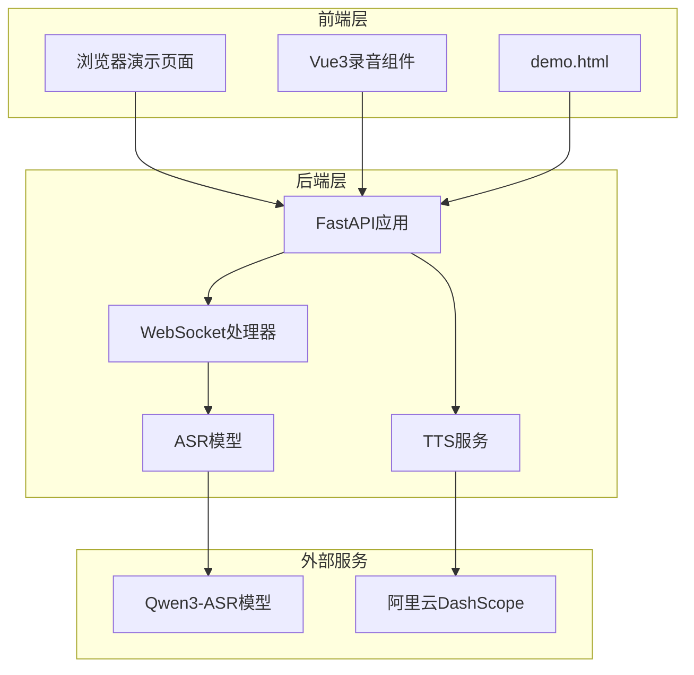
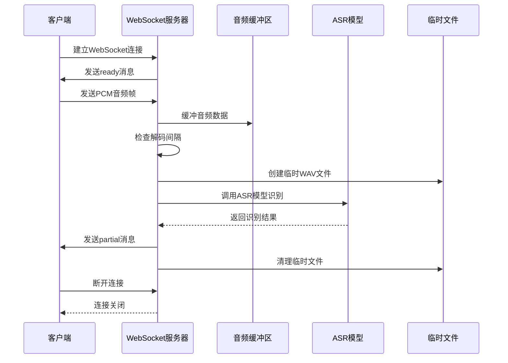
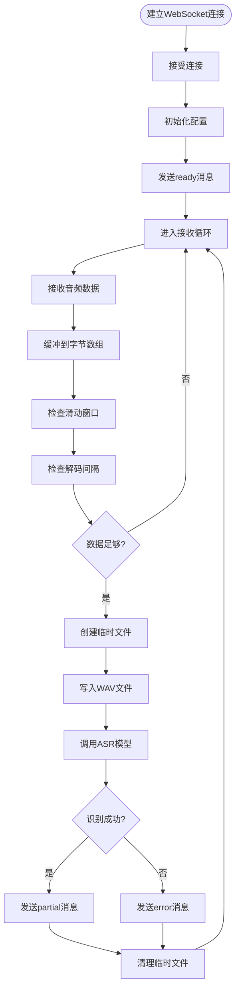
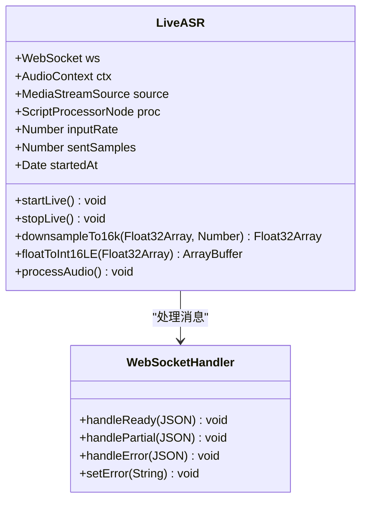

# WebSocket实时通信接口

<cite>
**本文档引用的文件**
- [server.py](file://server.py)
- [demo.html](file://demo.html)
- [README.md](file://README.md)
- [requirements.txt](file://requirements.txt)
- [index.py](file://index.py)
- [ttstest.py](file://ttstest.py)
</cite>

## 目录
1. [简介](#简介)
2. [项目结构](#项目结构)
3. [核心组件](#核心组件)
4. [架构概览](#架构概览)
5. [详细组件分析](#详细组件分析)
6. [依赖关系分析](#依赖关系分析)
7. [性能考虑](#性能考虑)
8. [故障排除指南](#故障排除指南)
9. [结论](#结论)

## 简介

本文档详细说明了基于FastAPI的WebSocket实时语音识别接口规范。该系统提供了实时语音转文字功能，支持浏览器端通过WebSocket连接进行语音流式传输，后端使用Qwen3-ASR模型进行语音识别。

主要特性：
- 实时语音识别（流式）
- 支持16kHz单声道PCM音频格式
- 滑动窗口+周期性识别的准实时方案
- 完整的错误处理和重连机制
- 跨平台支持（浏览器和Python客户端）

## 项目结构

项目采用前后端分离架构，主要包含以下组件：



**图表来源**
- [server.py:67-95](file://server.py#L67-L95)
- [demo.html:248-685](file://demo.html#L248-L685)

**章节来源**
- [README.md:5-19](file://README.md#L5-L19)
- [server.py:67-95](file://server.py#L67-L95)

## 核心组件

### WebSocket接口定义

系统提供了一个专门的WebSocket接口用于实时语音识别：

- **接口地址**: `/ws/asr`
- **协议**: WebSocket (ws:// 或 wss://)
- **认证**: 无需特殊认证，支持跨域访问

### 音频格式规范

客户端发送的音频数据必须符合以下规范：

- **采样率**: 16000 Hz
- **通道数**: 1 (单声道)
- **位深度**: 16 bit
- **字节序**: 小端序 (LE)
- **数据类型**: 有符号整数 (int16)
- **传输格式**: 二进制帧

### 消息格式定义

#### 服务器发送的消息格式

服务器通过JSON文本帧向客户端发送识别结果：

**ready消息** (连接建立时发送)
```json
{
  "type": "ready",
  "format": "pcm_s16le",
  "sample_rate": 16000,
  "channels": 1,
  "decode_interval_s": 1.2,
  "max_window_s": 12
}
```

**partial消息** (实时识别结果)
```json
{
  "type": "partial",
  "language": "zh-CN",
  "text": "这是一个测试语音"
}
```

**error消息** (错误情况)
```json
{
  "type": "error",
  "message": "识别失败：内存不足"
}
```

#### 客户端发送的数据格式

客户端通过二进制帧发送音频数据，每个帧包含连续的PCM音频样本。

**章节来源**
- [server.py:124-196](file://server.py#L124-L196)
- [demo.html:486-564](file://demo.html#L486-L564)

## 架构概览

系统采用异步架构设计，支持高并发的实时语音识别：



**图表来源**
- [server.py:124-196](file://server.py#L124-L196)
- [demo.html:486-564](file://demo.html#L486-L564)

## 详细组件分析

### WebSocket服务器实现

#### 连接建立流程

WebSocket服务器的实现包含完整的连接管理逻辑：



**图表来源**
- [server.py:124-196](file://server.py#L124-L196)

#### 音频缓冲管理

服务器实现了智能的音频缓冲管理机制：

- **滑动窗口**: 最大12秒的音频窗口，超过部分自动丢弃
- **解码间隔**: 默认1.2秒执行一次识别
- **内存保护**: 自动清理临时文件，防止内存泄漏

#### 错误处理机制

系统包含完善的错误处理逻辑：

- **异常捕获**: 捕获ASR识别过程中的所有异常
- **错误消息**: 将错误信息封装为标准化的JSON格式
- **连接维护**: 即使发生错误也保持连接活跃

**章节来源**
- [server.py:124-196](file://server.py#L124-L196)

### 前端实现分析

#### 浏览器端WebSocket客户端

浏览器端提供了完整的WebSocket客户端实现：



**图表来源**
- [demo.html:486-564](file://demo.html#L486-L564)
- [demo.html:498-516](file://demo.html#L498-L516)

#### 音频处理流程

前端实现了完整的音频处理管道：

1. **音频采集**: 使用Web Audio API获取麦克风音频流
2. **采样率转换**: 将音频转换为16kHz采样率
3. **格式转换**: 将浮点数转换为16位小端序整数
4. **实时传输**: 通过WebSocket实时发送音频数据

**章节来源**
- [demo.html:460-484](file://demo.html#L460-L484)
- [demo.html:486-564](file://demo.html#L486-L564)

### 配置参数详解

系统支持多个可配置的环境变量：

| 参数名 | 默认值 | 说明 |
|--------|--------|------|
| `ASR_WS_DECODE_INTERVAL_S` | 1.2 | 解码间隔（秒） |
| `ASR_WS_MAX_WINDOW_S` | 12 | 音频滑动窗口（秒） |
| `UVICORN_HOST` | 0.0.0.0 | 服务器绑定地址 |
| `UVICORN_PORT` | 8000 | 服务器端口号 |
| `DASHSCOPE_API_KEY` | 无 | 阿里云DashScope API密钥 |

**章节来源**
- [README.md:77-83](file://README.md#L77-L83)
- [server.py:434-451](file://server.py#L434-L451)

## 依赖关系分析

系统依赖关系图：

```mermaid
graph TB
subgraph "核心依赖"
FastAPI[FastAPI]
Torch[PyTorch]
ASR[Qwen-ASR]
end
subgraph "音频处理"
WebRTC[WebRTC]
AudioJS[Web Audio API]
SoundFile[SoundFile]
end
subgraph "外部服务"
DashScope[阿里云DashScope]
EdgeTTS[Microsoft Edge TTS]
end
subgraph "工具库"
Pydub[PyDub]
DotEnv[python-dotenv]
PyZMQ[pyzmq]
end
FastAPI --> ASR
FastAPI --> DashScope
FastAPI --> EdgeTTS
ASR --> Torch
Web Audio API --> FastAPI
DashScope --> Pydub
EdgeTTS --> PyZMQ
```

**图表来源**
- [requirements.txt:1-13](file://requirements.txt#L1-L13)
- [server.py:12-22](file://server.py#L12-L22)

**章节来源**
- [requirements.txt:1-13](file://requirements.txt#L1-L13)
- [server.py:12-22](file://server.py#L12-L22)

## 性能考虑

### 实时性能优化

系统采用了多项优化措施来确保实时性能：

1. **滑动窗口算法**: 限制音频缓冲大小，避免内存溢出
2. **异步处理**: 使用asyncio实现非阻塞的音频处理
3. **临时文件管理**: 自动清理临时WAV文件，释放磁盘空间
4. **锁机制**: 使用asyncio.Lock确保ASR调用的线程安全

### 内存管理

- **缓冲区限制**: 最大12秒音频数据，约48MB内存
- **及时清理**: 每次识别后立即删除临时文件
- **连接监控**: 自动检测断开连接并清理资源

### 网络优化

- **二进制传输**: 使用二进制帧减少带宽占用
- **批量发送**: 前端使用ScriptProcessorNode批量处理音频
- **连接复用**: 单个WebSocket连接支持多次识别会话

## 故障排除指南

### 常见问题及解决方案

#### WebSocket连接问题

**问题**: 连接被拒绝或超时
**原因**: 
- 端口被占用
- 防火墙阻止
- CORS配置问题

**解决方案**:
1. 检查端口是否被占用
2. 配置防火墙规则
3. 确认CORS设置

#### 音频识别问题

**问题**: 识别结果为空或不准确
**原因**:
- 音频质量差
- 采样率不匹配
- 网络延迟过高

**解决方案**:
1. 确保音频清晰度
2. 检查采样率设置
3. 优化网络环境

#### 性能问题

**问题**: 识别延迟过高
**原因**:
- 解码间隔过长
- 滑动窗口过大
- 系统资源不足

**解决方案**:
1. 调整解码间隔参数
2. 优化滑动窗口大小
3. 升级硬件配置

**章节来源**
- [README.md:194-204](file://README.md#L194-L204)

## 结论

本WebSocket实时语音识别系统提供了完整的端到端解决方案，具有以下优势：

1. **实时性强**: 采用滑动窗口+周期性识别的准实时方案
2. **易用性好**: 提供完整的前端演示和后端API
3. **可扩展性**: 支持多种配置参数和环境变量
4. **稳定性高**: 包含完善的错误处理和资源管理机制

系统适用于各种实时语音识别场景，包括会议记录、语音助手、语音搜索等应用。通过合理的参数配置和优化，可以满足大多数实时语音识别的需求。