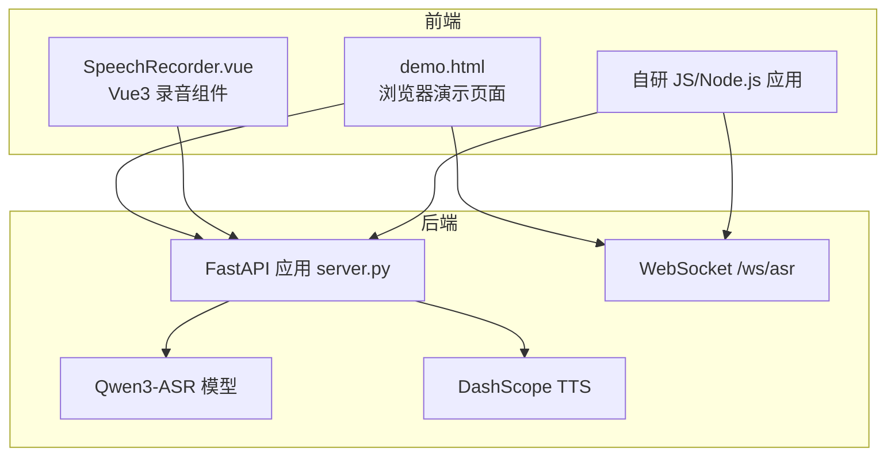
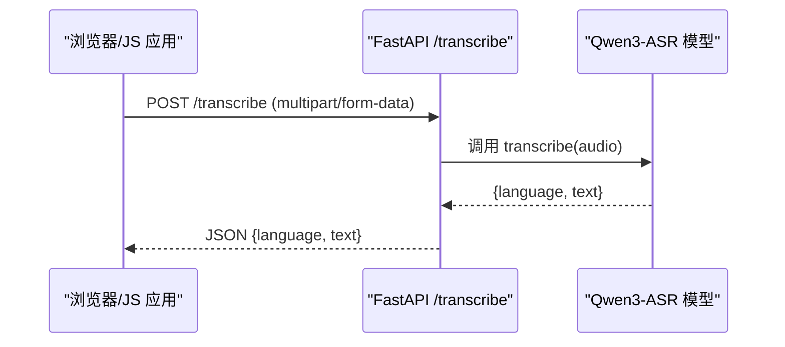
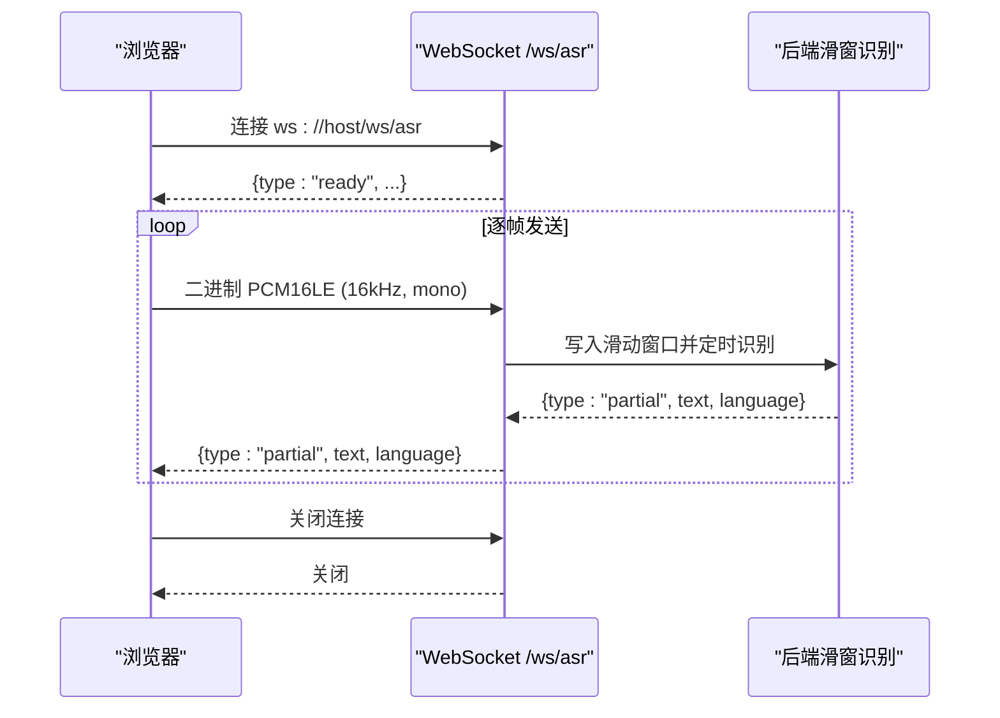
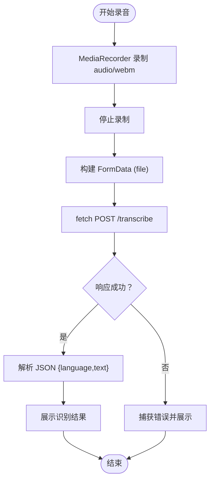
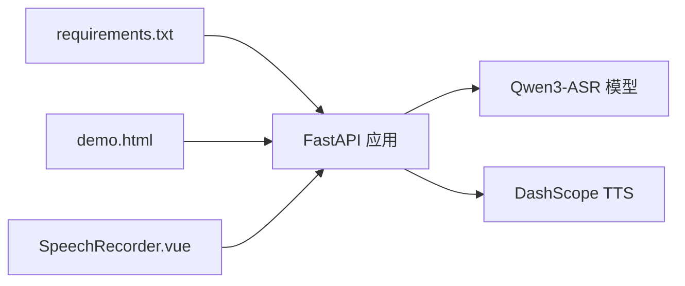

# 客户端集成示例

<cite>
**本文引用的文件**
- [README.md](file://README.md)
- [demo.html](file://demo.html)
- [SpeechRecorder.vue](file://SpeechRecorder.vue)
- [server.py](file://server.py)
- [requirements.txt](file://requirements.txt)
- [tts_voices_catalog.json](file://tts_voices_catalog.json)
- [ttstest.py](file://ttstest.py)
- [qwen3stream.py](file://qwen3stream.py)
- [index.py](file://index.py)
- [playvideo.py](file://playvideo.py)
</cite>

## 目录
1. [简介](#简介)
2. [项目结构](#项目结构)
3. [核心组件](#核心组件)
4. [架构总览](#架构总览)
5. [详细组件分析](#详细组件分析)
6. [依赖关系分析](#依赖关系分析)
7. [性能考虑](#性能考虑)
8. [故障排查指南](#故障排查指南)
9. [结论](#结论)
10. [附录](#附录)

## 简介
本文件面向希望在浏览器、Vue.js、Node.js 等前端环境中集成语音识别与语音合成能力的开发者，提供基于本仓库的完整客户端集成示例与最佳实践。内容涵盖：
- 使用原生 JavaScript 与 fetch/axios 的 RESTful API 调用示例
- 使用 WebSocket 的实时语音识别流程
- Vue3 组件 SpeechRecorder.vue 的集成与使用
- 错误处理、重试机制与性能优化建议
- 完整 HTML 演示页面 demo.html 的集成说明

## 项目结构
本项目采用前后端分离架构：后端为 FastAPI 服务，提供 /transcribe、/ws/asr、/tts 等接口；前端可直接使用 demo.html 或自研组件（如 SpeechRecorder.vue）对接。

图表来源
- [server.py:124-197](file://server.py#L124-L197)
- [demo.html:248-665](file://demo.html#L248-L665)
- [SpeechRecorder.vue:11-77](file://SpeechRecorder.vue#L11-L77)

章节来源
- [README.md:5-19](file://README.md#L5-L19)
- [server.py:67-77](file://server.py#L67-L77)

## 核心组件
- RESTful API
  - 上传识别：POST /transcribe（multipart/form-data，字段 file）
  - 语音合成：POST /tts（application/json，请求体包含 text、voice 等）
  - 语音列表：GET /tts/voices（返回 tts_voices_catalog.json 的内容）
- WebSocket 实时识别：/ws/asr（入站二进制 PCM16LE 单声道 16kHz，出站 JSON partial 文本）

章节来源
- [README.md:100-149](file://README.md#L100-L149)
- [server.py:124-197](file://server.py#L124-L197)
- [server.py:367-425](file://server.py#L367-L425)
- [server.py:212-247](file://server.py#L212-L247)
- [server.py:250-253](file://server.py#L250-L253)

## 架构总览
后端通过 FastAPI 提供统一入口，内部加载本地 Qwen3-ASR 模型用于离线识别，通过 DashScope 提供在线 TTS 合成。浏览器端可通过 fetch/axios 调用 REST 接口，或通过 WebSocket 进行实时流式识别。

图表来源
- [server.py:367-425](file://server.py#L367-L425)
- [index.py:13-19](file://index.py#L13-L19)

## 详细组件分析

### 浏览器端 REST API 示例（fetch/axios）
- 上传识别
  - 使用 FormData 附加音频文件，调用 /transcribe
  - 成功后解析 JSON，获取 language 与 text
- 语音合成
  - POST /tts，请求体包含 text 与 voice
  - 优先使用响应中的 output.audio.url；若仅有 output.audio.data，则本地解码为 Blob 播放
- 语音列表
  - GET /tts/voices，解析返回的 voices 列表填充下拉框

章节来源
- [README.md:153-179](file://README.md#L153-L179)
- [demo.html:272-382](file://demo.html#L272-L382)
- [demo.html:628-650](file://demo.html#L628-L650)
- [server.py:212-247](file://server.py#L212-L247)
- [server.py:250-253](file://server.py#L250-L253)

### WebSocket 实时语音识别
- 连接地址
  - 将 http/https 替换为 ws/wss，拼接 /ws/asr
- 数据格式
  - 入站：二进制帧，16kHz 单声道、16bit 小端 PCM（pcm_s16le）
  - 出站：JSON 文本帧，包含 ready/partial/error 等类型
- 浏览器实现要点
  - 使用 MediaRecorder 录制 audio/webm/ogg 等格式
  - 使用 AudioContext + ScriptProcessorNode 采样至 16kHz 并转为 Int16 小端 PCM
  - 按固定间隔发送二进制帧，监听 partial 文本更新界面
- 停止与资源释放
  - 断开 WebSocket、关闭 AudioContext、断开 ScriptProcessorNode

图表来源
- [demo.html:486-577](file://demo.html#L486-L577)
- [server.py:124-197](file://server.py#L124-L197)

章节来源
- [README.md:120-129](file://README.md#L120-L129)
- [demo.html:486-577](file://demo.html#L486-L577)
- [server.py:124-197](file://server.py#L124-L197)

### Vue3 组件集成：SpeechRecorder.vue
- 功能概述
  - 通过 MediaRecorder 录制 audio/webm
  - 录制结束后构造 FormData，调用 /transcribe
  - 展示识别结果与错误信息
- 集成步骤
  - 将组件引入到你的 Vue3 工程
  - 确保后端 CORS 已启用（默认允许跨域）
  - 在组件中根据需要调整请求地址与样式

图表来源
- [SpeechRecorder.vue:20-77](file://SpeechRecorder.vue#L20-L77)

章节来源
- [README.md:180-182](file://README.md#L180-L182)
- [SpeechRecorder.vue:11-77](file://SpeechRecorder.vue#L11-L77)

### Node.js 集成示例（概念性说明）
- REST API
  - 使用 axios/fetch 调用 /transcribe 与 /tts
  - 对于 /tts，优先使用响应中的 url；若仅有 data 则本地解码为 Buffer/Blob 播放
- WebSocket
  - 使用 ws 或 native WebSocket 连接 /ws/asr
  - 采集麦克风音频（如使用 node-record-lpcm16），按 16kHz 单声道 PCM 发送
- 注意事项
  - 确保网络可达后端地址
  - 处理跨域与证书（HTTPS/wss）问题
  - 对于音频格式，遵循后端支持的格式与转码要求

（本节为概念性说明，不直接分析具体文件）

### 错误处理与重试机制（最佳实践）
- 通用策略
  - 对 HTTP 请求设置超时与最大重试次数
  - 对于 /tts，若外链音频无法加载，可考虑后端代理下载或改用 base64 数据
  - WebSocket 断开后自动重连，指数退避
- 浏览器端示例参考
  - demo.html 中对 /tts 的错误提示与回退逻辑
  - WebSocket 的 onerror/onclose 处理与资源释放

章节来源
- [demo.html:323-382](file://demo.html#L323-L382)
- [demo.html:518-523](file://demo.html#L518-L523)

### 性能优化建议
- 识别延迟
  - WebSocket 实时识别采用滑动窗口 + 周期性识别，decode_interval_s 与 max_window_s 可通过环境变量调节
- 音频质量
  - 采样率统一为 16kHz 单声道，减少带宽与处理开销
- 资源管理
  - 录音与 WebSocket 连接结束后及时释放 AudioContext、ScriptProcessorNode、WebSocket
- 前端渲染
  - 实时 partial 文本采用覆盖而非追加，避免 DOM 抖动

章节来源
- [README.md:77-83](file://README.md#L77-L83)
- [demo.html:460-484](file://demo.html#L460-L484)
- [demo.html:566-577](file://demo.html#L566-L577)

## 依赖关系分析
- 运行时依赖
  - FastAPI、Uvicorn、torch、qwen-asr、dashscope、python-dotenv 等
- 前端依赖
  - 浏览器内置 Web API（MediaRecorder、AudioContext、WebSocket、fetch）
  - Vue3 生态（可选）

图表来源
- [requirements.txt:1-13](file://requirements.txt#L1-L13)
- [server.py:67-95](file://server.py#L67-L95)

章节来源
- [requirements.txt:1-13](file://requirements.txt#L1-L13)
- [server.py:67-95](file://server.py#L67-L95)

## 性能考虑
- 实时识别
  - decode_interval_s 控制识别周期，越短延迟越低但 CPU 占用越高
  - max_window_s 控制滑动窗口大小，影响上下文长度与内存占用
- 音频处理
  - 降采样与 PCM 转换在前端完成，确保与后端期望一致
- 网络传输
  - WebSocket 二进制帧体积小，适合实时流式传输
  - TTS 优先使用 url 播放，减少前端解码压力

章节来源
- [README.md:77-83](file://README.md#L77-L83)
- [demo.html:460-484](file://demo.html#L460-L484)

## 故障排查指南
- 本地模型加载
  - 确保 ASR_MODEL_PATH 指向包含完整权重的目录，避免频繁从 Hugging Face 拉取
- FFmpeg 转码
  - 上传 webm/ogg 时若报格式不识别，检查 FFMPEG_PATH 或将 ffmpeg 加入系统 PATH
- DashScope API Key
  - /tts 需要 DASHSCOPE_API_KEY，且注意地域一致性
- CORS 与跨域
  - 后端默认允许跨域，若自定义部署请确认代理层配置
- WebSocket 连接
  - 确认 ws/wss 地址正确，浏览器控制台查看网络面板与握手日志

章节来源
- [README.md:48-66](file://README.md#L48-L66)
- [README.md:194-204](file://README.md#L194-L204)
- [server.py:69-76](file://server.py#L69-L76)
- [server.py:388-410](file://server.py#L388-L410)

## 结论
本项目提供了从浏览器到 Vue3 组件的完整客户端集成示例，配合 FastAPI 后端与本地/云端语音能力，能够快速搭建语音识别与语音合成的应用场景。通过合理的错误处理、重试与性能优化策略，可在实际工程中稳定落地。

## 附录

### API 一览（路径/方法/说明）
- GET /
  - 健康检查
- GET /demo
  - 返回 demo.html
- POST /transcribe
  - 上传音频文件，返回识别结果
- WebSocket /ws/asr
  - 实时识别，入站 PCM16LE，出站 partial 文本
- GET /tts/voices
  - 返回可用音色列表
- POST /tts
  - 语音合成，返回音频 URL 或 base64 数据

章节来源
- [README.md:100-149](file://README.md#L100-L149)
- [server.py:199-247](file://server.py#L199-L247)
- [server.py:124-197](file://server.py#L124-L197)
- [server.py:250-253](file://server.py#L250-L253)

### TTS 语音列表数据结构
- version：版本号
- voices：数组，每项包含 voice、name、description、languages、supported_models 等

章节来源
- [tts_voices_catalog.json:1-54](file://tts_voices_catalog.json#L1-L54)

### 本地 ASR 测试脚本
- index.py 展示了如何加载 Qwen3ASRModel 并对本地音频进行转写

章节来源
- [index.py:1-19](file://index.py#L1-L19)

### DashScope TTS 调用示例
- ttstest.py 展示了通过 dashscope.MultiModalConversation 调用 TTS 的方式

章节来源
- [ttstest.py:1-27](file://ttstest.py#L1-L27)

### 实时 TTS 播放（本地）
- qwen3stream.py 展示了使用 DashScope 实时 TTS 的边收边播实现

章节来源
- [qwen3stream.py:1-196](file://qwen3stream.py#L1-L196)

### 音频播放辅助工具
- playvideo.py 提供了对本地文件与远程 URL 的播放策略（ffplay/mpv 优先，回退到下载后播放）

章节来源
- [playvideo.py:1-166](file://playvideo.py#L1-L166)