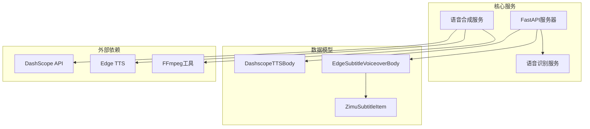
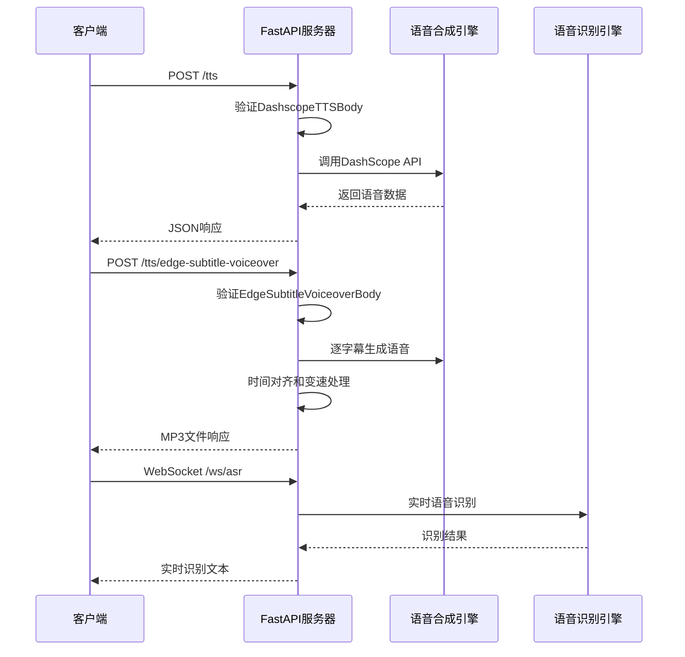
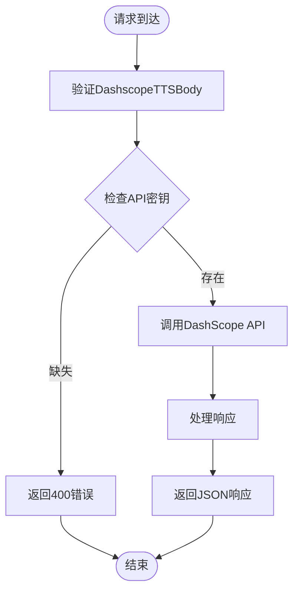
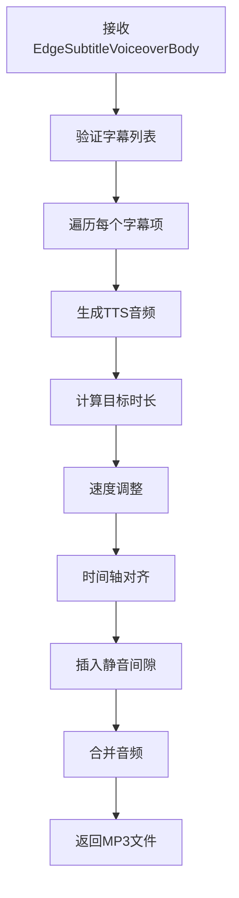
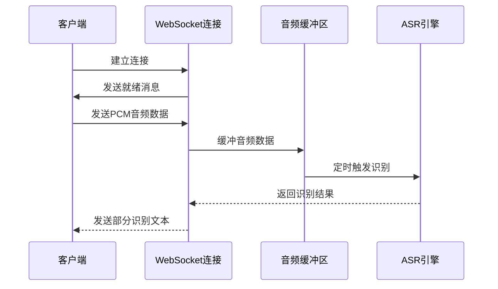
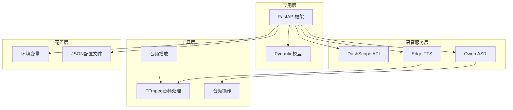

# 请求响应数据模型

<cite>
**本文档引用的文件**
- [server.py](file://server.py)
- [edge_subtitle_voiceover.py](file://edge_subtitle_voiceover.py)
- [zimutts.py](file://zimutts.py)
- [subtitles.json](file://subtitles.json)
- [tts_voices_catalog.json](file://tts_voices_catalog.json)
- [jsonschema.json](file://jsonschema.json)
- [qwen-flash.json](file://qwen-flash.json)
- [requirements.txt](file://requirements.txt)
</cite>

## 目录
1. [简介](#简介)
2. [项目结构](#项目结构)
3. [核心数据模型](#核心数据模型)
4. [架构概览](#架构概览)
5. [详细组件分析](#详细组件分析)
6. [依赖关系分析](#依赖关系分析)
7. [性能考虑](#性能考虑)
8. [故障排除指南](#故障排除指南)
9. [结论](#结论)

## 简介

本项目是一个集成了多种语音合成技术的多媒体处理系统，主要包含以下核心功能：
- DashScope语音合成服务集成
- Edge TTS字幕配音生成
- 实时语音识别（ASR）
- 多语言语音合成支持

本文档详细记录了所有Pydantic数据模型的字段定义、验证规则和使用方法，为开发者提供完整的API数据模型参考。

## 项目结构



**图表来源**
- [server.py:100-322](file://server.py#L100-L322)
- [edge_subtitle_voiceover.py:20-41](file://edge_subtitle_voiceover.py#L20-L41)

**章节来源**
- [server.py:1-452](file://server.py#L1-L452)
- [requirements.txt:1-13](file://requirements.txt#L1-L13)

## 核心数据模型

### DashscopeTTSBody 模型

DashscopeTTSBody 是用于DashScope语音合成服务的请求数据模型。

| 字段名 | 类型 | 是否必填 | 默认值 | 验证规则 | 描述 |
|--------|------|----------|--------|----------|------|
| text | str | 是 | - | - | 要合成的文本内容 |
| voice | str | 否 | "Ethan" | - | 语音角色名称 |
| instruction | str | 否 | "" | - | 具体指令内容 |
| instructions | str | 否 | "" | - | 指令集合 |

**验证规则**：
- 所有字段均为简单类型验证
- voice字段有默认值，其他字段可为空字符串

**JSON Schema示例**：
```json
{
  "type": "object",
  "required": ["text"],
  "properties": {
    "text": {"type": "string"},
    "voice": {"type": "string", "default": "Ethan"},
    "instruction": {"type": "string", "default": ""},
    "instructions": {"type": "string", "default": ""}
  }
}
```

### EdgeSubtitleVoiceoverBody 模型

EdgeSubtitleVoiceoverBody 是用于字幕配音生成的请求数据模型。

| 字段名 | 类型 | 是否必填 | 默认值 | 验证规则 | 描述 |
|--------|------|----------|--------|----------|------|
| voice | str | 否 | "zh-CN-YunxiNeural" | - | Edge TTS语音标识符 |
| subtitles | List[ZimuSubtitleItem] | 是 | - | min_length=1 | 字幕项目列表 |

**验证规则**：
- voice字段必须是有效的Edge TTS语音标识符
- subtitles列表至少包含一个元素
- 每个字幕项必须通过内部验证器检查

**JSON Schema示例**：
```json
{
  "type": "object",
  "required": ["subtitles"],
  "properties": {
    "voice": {"type": "string", "default": "zh-CN-YunxiNeural"},
    "subtitles": {
      "type": "array",
      "items": {"$ref": "#/definitions/ZimuSubtitleItem"},
      "minItems": 1
    }
  },
  "definitions": {
    "ZimuSubtitleItem": {
      "type": "object",
      "required": ["id", "start_time", "content"],
      "properties": {
        "id": {"type": "integer"},
        "start_time": {"type": "integer", "minimum": 0},
        "end_time": {"type": "integer", "minimum": 0},
        "content": {"type": "string"}
      }
    }
  }
}
```

### ZimuSubtitleItem 模型

ZimuSubtitleItem 是单个字幕项目的模型定义。

| 字段名 | 类型 | 是否必填 | 默认值 | 验证规则 | 描述 |
|--------|------|----------|--------|----------|------|
| id | int | 是 | - | - | 字幕唯一标识符 |
| start_time | int | 是 | - | ge=0 | 开始时间（毫秒） |
| end_time | int | 否 | None | ge=0 | 结束时间（毫秒），None表示按自然时长输出 |
| content | str | 是 | - | - | 字幕文本内容 |

**验证规则**：
- start_time必须大于等于0
- end_time必须大于等于0（当提供时）
- end_time必须大于start_time（当两者都提供时）
- content不能为空字符串

**JSON Schema示例**：
```json
{
  "type": "object",
  "required": ["id", "start_time", "content"],
  "properties": {
    "id": {"type": "integer"},
    "start_time": {"type": "integer", "minimum": 0},
    "end_time": {"type": "integer", "minimum": 0},
    "content": {"type": "string"}
  }
}
```

**章节来源**
- [server.py:100-107](file://server.py#L100-L107)
- [edge_subtitle_voiceover.py:36-41](file://edge_subtitle_voiceover.py#L36-L41)
- [edge_subtitle_voiceover.py:20-33](file://edge_subtitle_voiceover.py#L20-L33)

## 架构概览



**图表来源**
- [server.py:212-247](file://server.py#L212-L247)
- [server.py:300-321](file://server.py#L300-L321)
- [server.py:124-196](file://server.py#L124-L196)

## 详细组件分析

### 语音合成服务组件

#### DashScope TTS集成

DashScope TTS服务提供了高质量的多语言语音合成能力，支持多种语音风格和语言。

**支持的语音配置**：
- 声音角色：Cherry、Serena、Ethan、Chelsie等
- 语言支持：中文普通话、英语、法语、德语等10种语言
- 语音风格：标准普通话、阳光积极、温柔、二次元等

**API调用流程**：


**图表来源**
- [server.py:212-247](file://server.py#L212-L247)

#### Edge TTS字幕配音

Edge TTS字幕配音功能实现了精确的时间轴对齐和语音合成。

**核心处理流程**：


**图表来源**
- [edge_subtitle_voiceover.py:166-222](file://edge_subtitle_voiceover.py#L166-L222)

### 语音识别组件

#### 实时ASR WebSocket服务

系统提供了实时语音识别功能，支持WebSocket协议进行低延迟的语音转文字。

**WebSocket通信流程**：


**图表来源**
- [server.py:124-196](file://server.py#L124-L196)

**章节来源**
- [server.py:100-322](file://server.py#L100-L322)
- [edge_subtitle_voiceover.py:20-41](file://edge_subtitle_voiceover.py#L20-L41)

## 依赖关系分析



**图表来源**
- [requirements.txt:1-13](file://requirements.txt#L1-L13)
- [server.py:13-31](file://server.py#L13-L31)

**章节来源**
- [requirements.txt:1-13](file://requirements.txt#L1-L13)
- [server.py:1-452](file://server.py#L1-L452)

## 性能考虑

### 音频处理优化

1. **内存管理**：使用临时文件和后台任务确保音频文件及时清理
2. **并发处理**：利用异步I/O处理多个字幕项的并行合成
3. **音频格式转换**：通过FFmpeg进行高效的音频格式转换和变速处理

### 缓存策略

1. **语音列表缓存**：预加载DashScope语音配置到内存
2. **文件缓存**：支持将生成的MP3文件缓存到指定目录
3. **环境变量缓存**：减少重复的环境变量读取操作

### 错误处理机制

1. **输入验证**：严格的Pydantic模型验证确保数据完整性
2. **异常捕获**：全面的异常处理防止服务崩溃
3. **资源清理**：确保临时文件和音频资源得到正确清理

## 故障排除指南

### 常见问题及解决方案

**1. DashScope API密钥问题**
- 症状：返回400错误，提示缺少API密钥
- 解决方案：在.env文件中设置DASHSCOPE_API_KEY环境变量

**2. FFmpeg依赖问题**
- 症状：运行时抛出RuntimeError，提示ffmpeg not found
- 解决方案：设置FFMPEG_PATH环境变量指向ffmpeg可执行文件

**3. 字幕验证错误**
- 症状：返回400错误，提示字幕时间冲突
- 解决方案：确保end_time > start_time，且content不为空

**4. WebSocket连接问题**
- 症状：客户端无法建立ASR WebSocket连接
- 解决方案：检查网络连接和防火墙设置

**章节来源**
- [server.py:215-217](file://server.py#L215-L217)
- [edge_subtitle_voiceover.py:174-176](file://edge_subtitle_voiceover.py#L174-L176)

## 结论

本项目提供了完整的语音合成和语音识别解决方案，具有以下特点：

1. **模块化设计**：清晰的数据模型分离和功能模块划分
2. **严格验证**：基于Pydantic的完整数据验证体系
3. **高性能处理**：异步I/O和并发处理提升性能
4. **灵活配置**：支持多种语音服务和配置选项
5. **完整文档**：详细的API文档和使用示例

开发者可以基于这些数据模型快速集成语音功能，实现从文本到语音的完整转换流程。