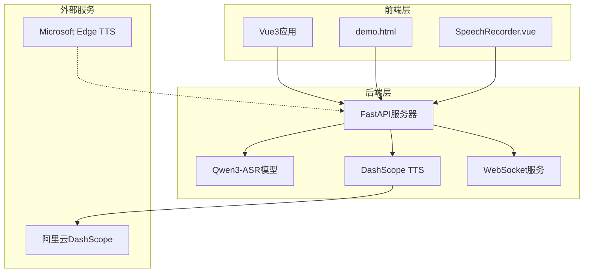
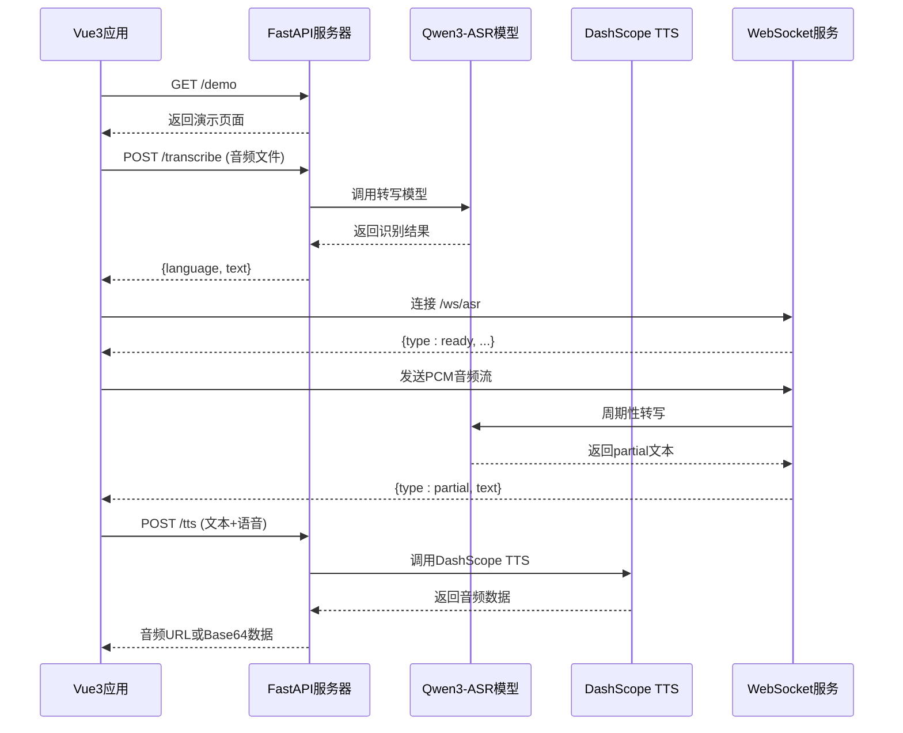
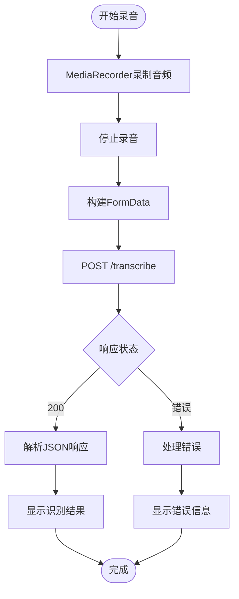
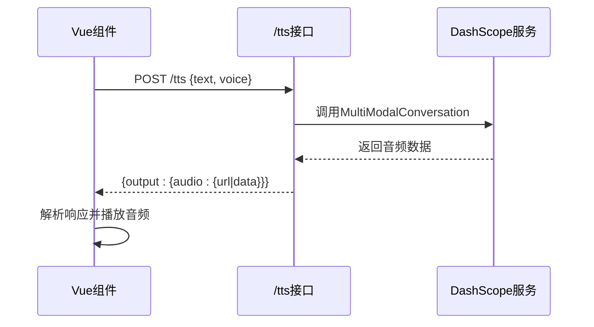
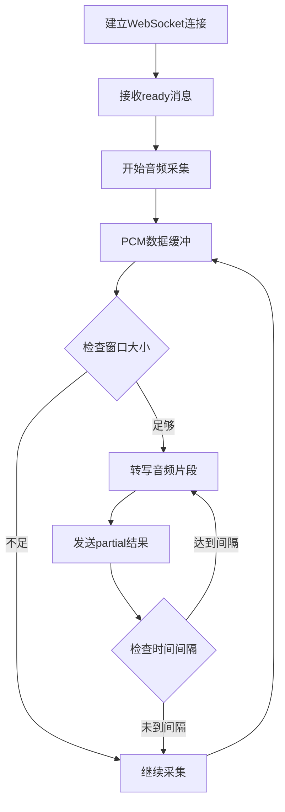
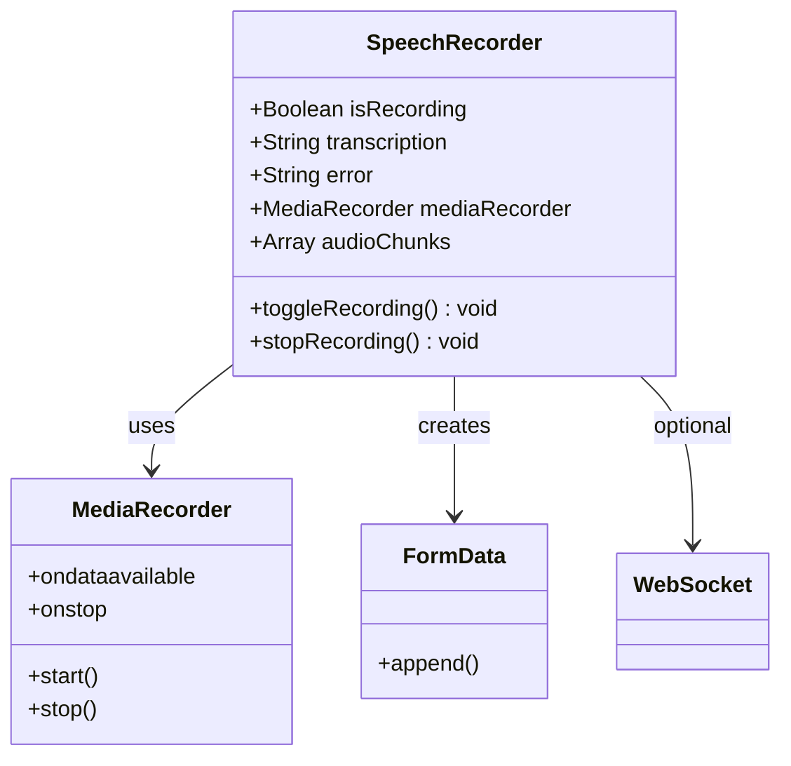
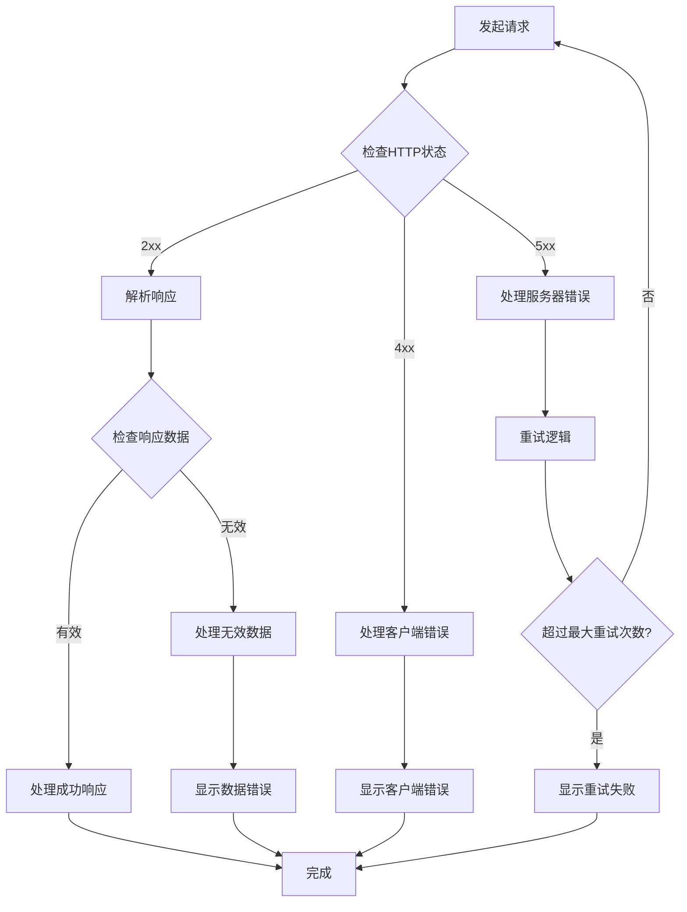
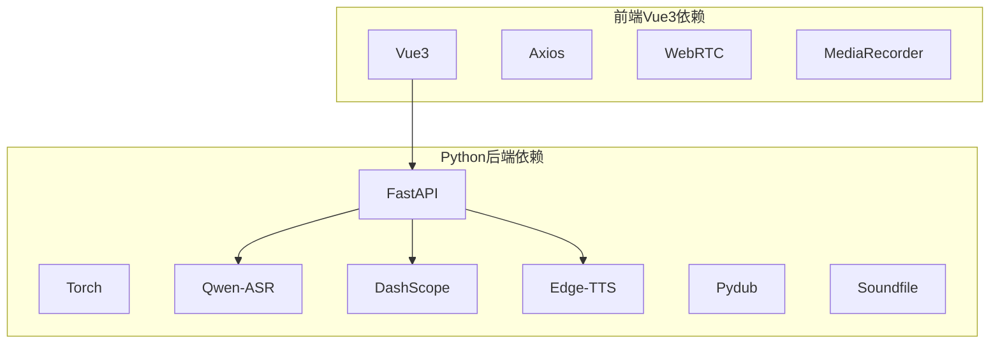
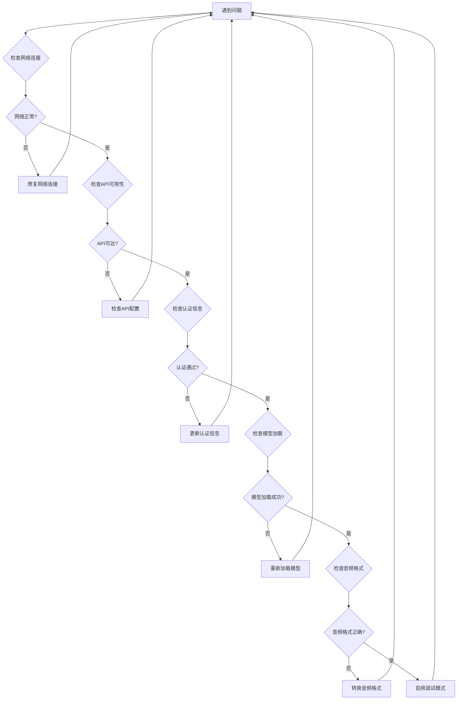

# API集成指南

<cite>
**本文档引用的文件**
- [README.md](file://README.md)
- [server.py](file://server.py)
- [SpeechRecorder.vue](file://SpeechRecorder.vue)
- [demo.html](file://demo.html)
- [requirements.txt](file://requirements.txt)
- [tts_voices_catalog.json](file://tts_voices_catalog.json)
- [ttstest.py](file://ttstest.py)
- [qwen3stream.py](file://qwen3stream.py)
- [index.py](file://index.py)
- [edge_subtitle_voiceover.py](file://edge_subtitle_voiceover.py)
</cite>

## 目录
1. [简介](#简介)
2. [项目结构](#项目结构)
3. [核心组件](#核心组件)
4. [架构概览](#架构概览)
5. [详细组件分析](#详细组件分析)
6. [依赖关系分析](#依赖关系分析)
7. [性能考虑](#性能考虑)
8. [故障排除指南](#故障排除指南)
9. [结论](#结论)
10. [附录](#附录)

## 简介

本指南面向Vue3开发者，提供完整的前端API集成方案，涵盖后端FastAPI提供的语音识别、实时WebSocket识别和TTS服务调用。项目基于Vue3/静态页面前端与FastAPI后端的语音应用，集成了本地Qwen3-ASR负责识别和阿里云DashScope（Qwen3 TTS）负责在线合成。

## 项目结构

**图表来源**
- [server.py:67-95](file://server.py#L67-L95)
- [README.md:8-18](file://README.md#L8-L18)

**章节来源**
- [README.md:5-18](file://README.md#L5-L18)
- [server.py:67-95](file://server.py#L67-L95)

## 核心组件

### API接口总览

项目提供以下核心API接口：

1. **健康检查**：`GET /` - 健康检查端点
2. **演示页面**：`GET /demo` - 返回静态演示HTML
3. **语音识别**：`POST /transcribe` - 上传音频文件进行转写
4. **实时识别**：`WebSocket /ws/asr` - 流式WebSocket识别
5. **TTS服务**：`POST /tts` - 文本转语音合成
6. **语音列表**：`GET /tts/voices` - 获取可用语音列表

### 语音识别组件

语音识别功能支持多种音频格式，包括WAV、MP3、M4A、OGG、WEBM、FLAC。

**章节来源**
- [README.md:23-26](file://README.md#L23-L26)
- [server.py:367-425](file://server.py#L367-L425)

## 架构概览

**图表来源**
- [server.py:124-197](file://server.py#L124-L197)
- [server.py:212-247](file://server.py#L212-L247)
- [demo.html:494-564](file://demo.html#L494-L564)

## 详细组件分析

### HTTP请求构建与响应处理

#### 语音识别API集成

**图表来源**
- [SpeechRecorder.vue:20-77](file://SpeechRecorder.vue#L20-L77)
- [demo.html:602-650](file://demo.html#L602-L650)

#### TTS服务集成

**图表来源**
- [server.py:212-247](file://server.py#L212-L247)
- [demo.html:323-382](file://demo.html#L323-L382)

**章节来源**
- [SpeechRecorder.vue:47-62](file://SpeechRecorder.vue#L47-L62)
- [demo.html:323-382](file://demo.html#L323-L382)

### WebSocket实时识别实现

WebSocket实时识别采用滑动窗口+周期性整段转写的准实时方案：

**图表来源**
- [server.py:124-197](file://server.py#L124-L197)
- [demo.html:486-564](file://demo.html#L486-L564)

**章节来源**
- [server.py:124-197](file://server.py#L124-L197)
- [demo.html:486-564](file://demo.html#L486-L564)

### Vue3组件集成模式

#### SpeechRecorder.vue组件分析

该组件提供了完整的录音-识别流程：

**图表来源**
- [SpeechRecorder.vue:11-77](file://SpeechRecorder.vue#L11-L77)

**章节来源**
- [SpeechRecorder.vue:11-77](file://SpeechRecorder.vue#L11-L77)

### 错误处理策略

系统实现了多层次的错误处理机制：

**图表来源**
- [demo.html:634-646](file://demo.html#L634-L646)
- [SpeechRecorder.vue:55-62](file://SpeechRecorder.vue#L55-L62)

**章节来源**
- [demo.html:634-646](file://demo.html#L634-L646)
- [SpeechRecorder.vue:55-62](file://SpeechRecorder.vue#L55-L62)

## 依赖关系分析

### 外部依赖关系

**图表来源**
- [requirements.txt:1-13](file://requirements.txt#L1-L13)

**章节来源**
- [requirements.txt:1-13](file://requirements.txt#L1-L13)

### 环境变量配置

系统支持多种环境变量配置：

| 变量名 | 类型 | 默认值 | 说明 |
|--------|------|--------|------|
| UVICORN_HOST | 字符串 | 0.0.0.0 | Uvicorn主机地址 |
| UVICORN_PORT | 整数 | 8000 | Uvicorn端口号 |
| UVICORN_RELOAD | 布尔 | false | 是否启用热重载 |
| UVICORN_LOG_LEVEL | 字符串 | info | 日志级别 |
| ASR_MODEL_PATH | 字符串 | Qwen3-ASR-1.7B | ASR模型路径 |
| DASHSCOPE_API_KEY | 字符串 | - | DashScope API密钥 |
| ASR_WS_DECODE_INTERVAL_S | 浮点数 | 1.2 | WebSocket解码间隔 |
| ASR_WS_MAX_WINDOW_S | 浮点数 | 12 | 最大音频窗口 |

**章节来源**
- [README.md:48-83](file://README.md#L48-L83)
- [server.py:83-89](file://server.py#L83-L89)

## 性能考虑

### WebSocket性能优化

1. **滑动窗口设计**：最大窗口12秒，避免内存溢出
2. **周期性转写**：默认1.2秒间隔，平衡延迟和资源消耗
3. **音频格式优化**：16kHz单声道16bit PCM，减少传输开销

### 响应处理优化

1. **流式响应**：WebSocket支持partial结果，提升用户体验
2. **缓存机制**：TTS音频文件缓存，避免重复生成
3. **并发控制**：ASR转写加锁，防止并发冲突

### 前端性能优化

1. **音频采样率转换**：实时降采样至16kHz
2. **缓冲区管理**：动态调整缓冲区大小
3. **错误恢复**：自动重连和状态恢复

## 故障排除指南

### 常见问题及解决方案

**图表来源**
- [README.md:194-204](file://README.md#L194-L204)

### 调试工具使用

1. **浏览器开发者工具**：监控网络请求和WebSocket连接
2. **后端日志**：查看Uvicorn访问日志
3. **API测试工具**：Postman或curl测试API接口
4. **音频分析工具**：检查PCM数据格式和采样率

**章节来源**
- [README.md:194-204](file://README.md#L194-L204)

## 结论

本指南提供了Vue3应用与FastAPI后端语音服务的完整集成方案。通过合理利用HTTP请求、WebSocket连接和错误处理机制，可以构建高性能的语音识别和合成应用。建议在生产环境中重点关注：

1. **安全性**：合理配置CORS和认证机制
2. **性能**：优化音频格式和传输策略
3. **可靠性**：实现完善的错误处理和重试机制
4. **可维护性**：保持代码结构清晰和文档完整

## 附录

### API接口规范

#### 健康检查
- **方法**：GET
- **路径**：/
- **响应**：`{"message": "Qwen ASR backend is running"}`

#### 语音识别
- **方法**：POST
- **路径**：/transcribe
- **内容类型**：multipart/form-data
- **参数**：file (音频文件)
- **响应**：`{"language": "...", "text": "..."}`

#### 实时识别
- **方法**：WebSocket
- **路径**：/ws/asr
- **入站**：二进制PCM音频流
- **出站**：JSON消息
  - `{"type": "ready", ...}`
  - `{"type": "partial", "language": "...", "text": "..."}`

#### TTS服务
- **方法**：POST
- **路径**：/tts
- **内容类型**：application/json
- **请求体**：`{"text": "...", "voice": "Cherry"}`
- **响应**：DashScope标准响应格式

### Vue3集成最佳实践

1. **组件化设计**：将音频功能封装为独立组件
2. **状态管理**：使用Vuex或Pinia管理音频状态
3. **错误处理**：统一的错误处理和用户反馈
4. **性能监控**：监控音频处理性能和用户体验
5. **安全考虑**：避免在前端暴露敏感信息