# Vue3语音录制组件

<cite>
**本文档引用的文件**
- [SpeechRecorder.vue](file://SpeechRecorder.vue)
- [demo.html](file://demo.html)
- [README.md](file://README.md)
- [requirements.txt](file://requirements.txt)
- [tts_voices_catalog.json](file://tts_voices_catalog.json)
- [jsonschema.json](file://jsonschema.json)
</cite>

## 目录
1. [简介](#简介)
2. [项目结构](#项目结构)
3. [核心组件](#核心组件)
4. [架构概览](#架构概览)
5. [详细组件分析](#详细组件分析)
6. [依赖关系分析](#依赖关系分析)
7. [性能考虑](#性能考虑)
8. [故障排除指南](#故障排除指南)
9. [结论](#结论)
10. [附录](#附录)

## 简介

Vue3语音录制组件是一个基于Vue3 Composition API构建的现代化语音识别组件，集成了Web Audio API和MediaRecorder API，提供了完整的语音录制、上传和实时识别功能。该组件支持麦克风权限管理、错误处理、用户交互反馈，并与后端FastAPI服务器无缝集成。

组件的核心特性包括：
- 响应式状态管理（Vue3 Ref）
- 媒体流获取和音频录制
- Blob数据转换和文件上传
- 实时识别和流式处理
- 完善的错误处理机制
- 用户友好的交互界面

## 项目结构

该项目采用前后端分离的架构设计，主要包含以下核心文件：

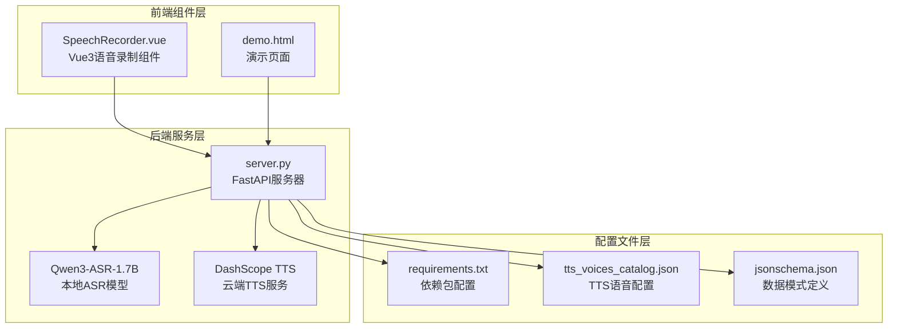

**图表来源**
- [SpeechRecorder.vue:1-90](file://SpeechRecorder.vue#L1-L90)
- [demo.html:1-685](file://demo.html#L1-L685)
- [README.md:1-287](file://README.md#L1-L287)

**章节来源**
- [README.md:5-19](file://README.md#L5-L19)
- [requirements.txt:1-13](file://requirements.txt#L1-L13)

## 核心组件

### 组件架构设计

SpeechRecorder.vue采用了Vue3 Composition API的现代化开发模式，实现了高度模块化的组件设计：

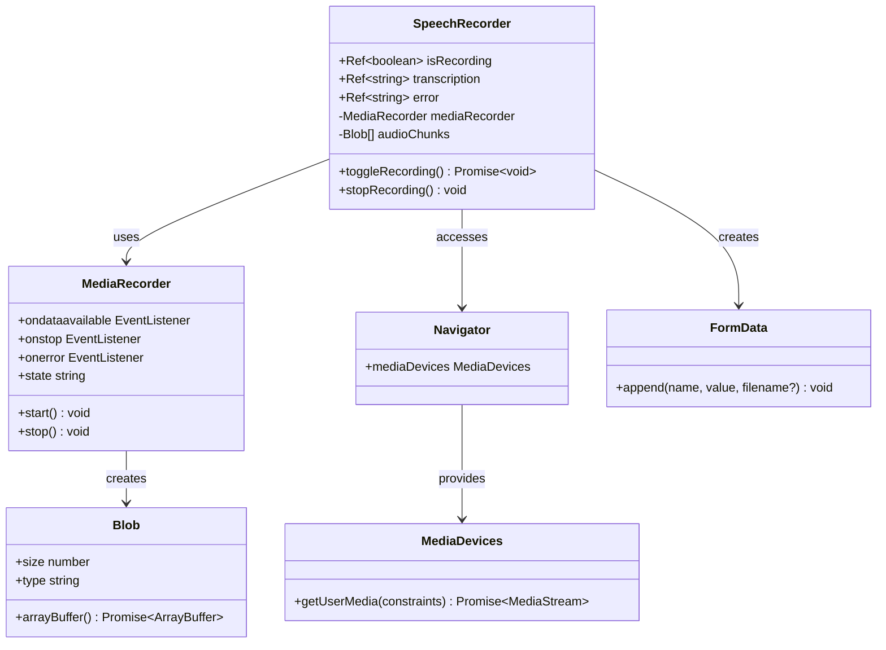

**图表来源**
- [SpeechRecorder.vue:11-78](file://SpeechRecorder.vue#L11-L78)

### 响应式状态管理

组件使用Vue3的响应式系统管理核心状态：

| 状态属性 | 类型 | 描述 | 默认值 |
|---------|------|------|--------|
| isRecording | boolean | 录音状态标志 | false |
| transcription | string | 语音识别结果 | '' |
| error | string | 错误信息 | '' |

这些响应式状态通过Vue的Ref系统实现，确保UI能够自动更新以反映组件状态的变化。

**章节来源**
- [SpeechRecorder.vue:14-18](file://SpeechRecorder.vue#L14-L18)

## 架构概览

### 系统架构图

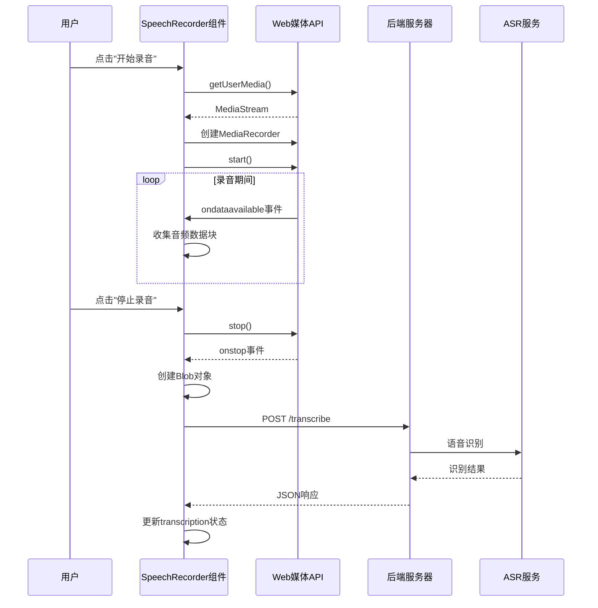

**图表来源**
- [SpeechRecorder.vue:20-70](file://SpeechRecorder.vue#L20-L70)
- [demo.html:602-650](file://demo.html#L602-L650)

### 数据流架构

组件的数据流遵循单向数据流原则，确保状态变更的可预测性和可追踪性：

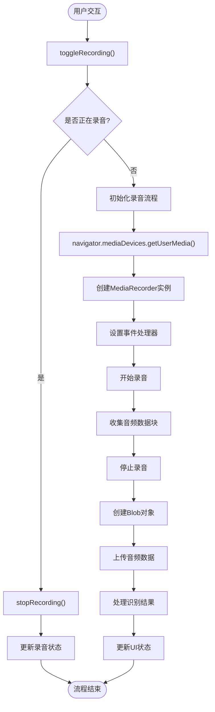

**图表来源**
- [SpeechRecorder.vue:20-77](file://SpeechRecorder.vue#L20-L77)

## 详细组件分析

### 组件生命周期和事件处理

#### 生命周期钩子

组件采用Vue3的组合式API，主要依赖于响应式状态的自动更新机制：

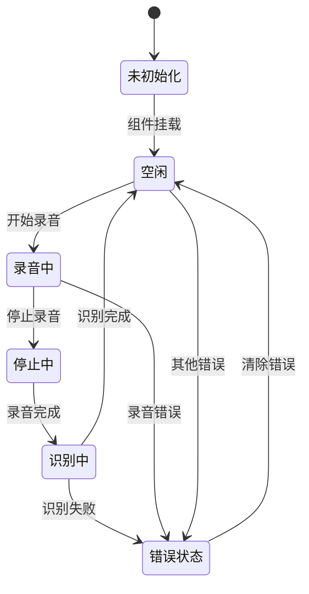

#### 事件处理机制

组件实现了完善的事件处理机制：

| 事件类型 | 触发条件 | 处理逻辑 | 状态更新 |
|---------|----------|----------|----------|
| ondataavailable | 新音频数据可用 | 收集音频数据块 | audioChunks数组 |
| onstop | 录音停止 | 创建Blob并上传 | isRecording=false |
| onerror | 录音错误 | 设置错误状态 | error消息 |
| 用户点击 | 按钮交互 | 切换录音状态 | isRecording切换 |

**章节来源**
- [SpeechRecorder.vue:20-77](file://SpeechRecorder.vue#L20-L77)

### MediaRecorder API封装实现

#### 音频流获取

组件使用现代Web API进行音频流获取：

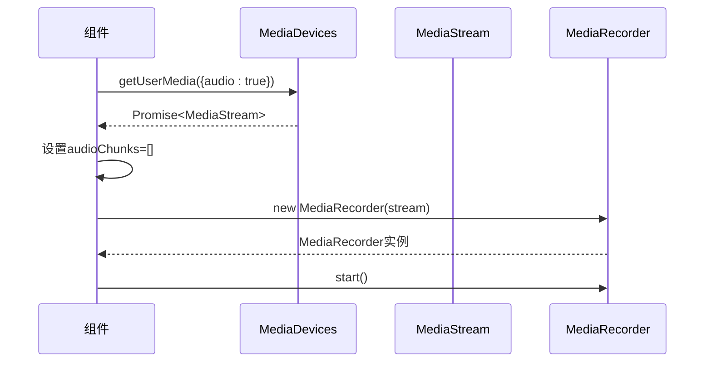

**图表来源**
- [SpeechRecorder.vue:30-34](file://SpeechRecorder.vue#L30-L34)

#### 数据收集和Blob转换

音频数据的收集和转换过程：

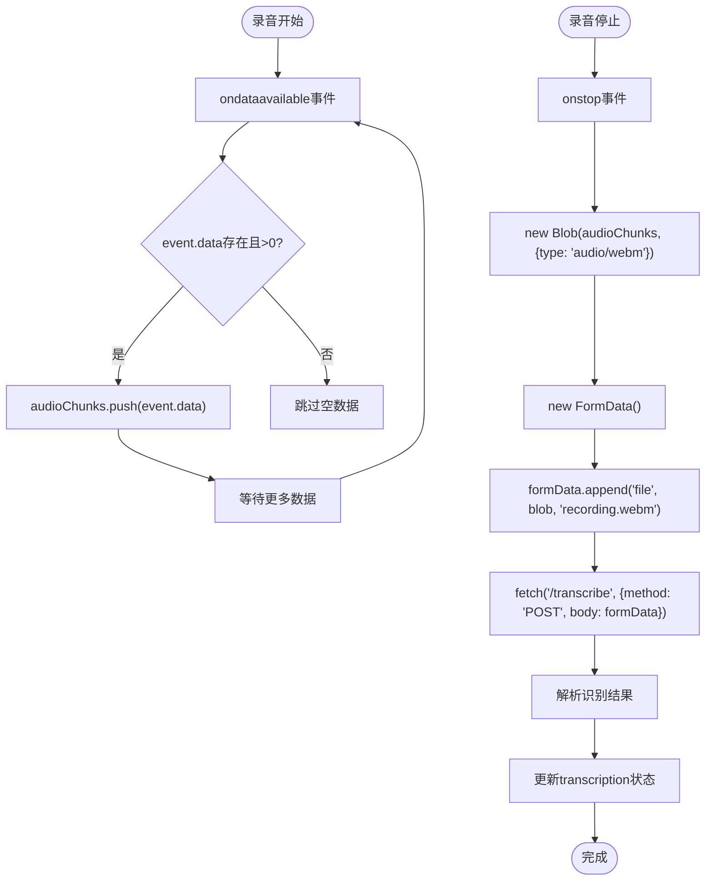

**图表来源**
- [SpeechRecorder.vue:36-63](file://SpeechRecorder.vue#L36-L63)

**章节来源**
- [SpeechRecorder.vue:29-63](file://SpeechRecorder.vue#L29-L63)

### 麦克风权限管理和错误处理

#### 权限管理流程

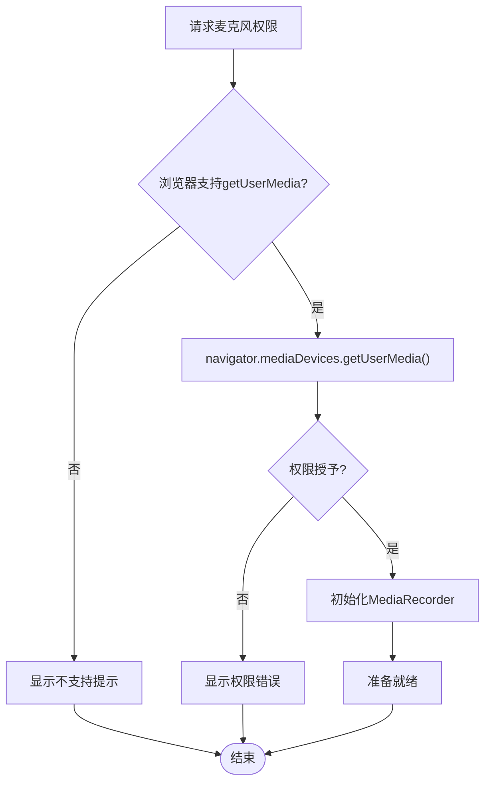

#### 错误处理策略

组件实现了多层次的错误处理机制：

| 错误类型 | 捕获位置 | 处理策略 | 用户反馈 |
|---------|----------|----------|----------|
| 权限错误 | getUserMedia | 显示权限请求 | 弹窗提示 |
| 设备错误 | MediaRecorder | 显示设备不可用 | 状态指示 |
| 网络错误 | fetch请求 | 显示网络异常 | 错误消息 |
| 识别错误 | 服务端响应 | 显示识别失败 | 错误状态 |

**章节来源**
- [SpeechRecorder.vue:29-69](file://SpeechRecorder.vue#L29-L69)

### 用户交互反馈机制

#### UI状态反馈

组件通过多种方式提供用户反馈：

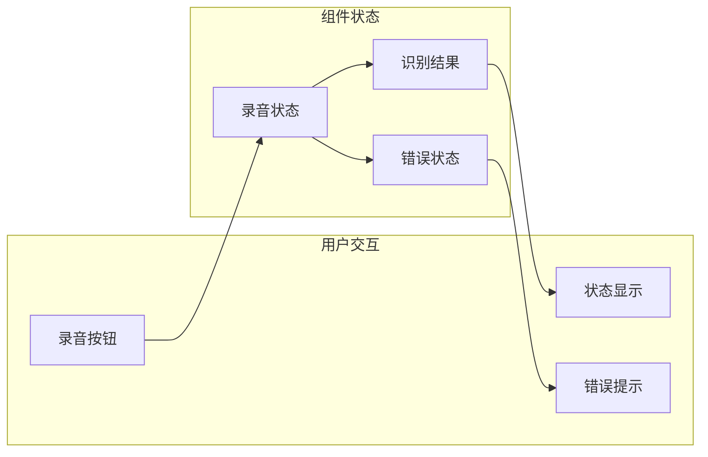

**图表来源**
- [SpeechRecorder.vue:3-7](file://SpeechRecorder.vue#L3-L7)

**章节来源**
- [SpeechRecorder.vue:3-7](file://SpeechRecorder.vue#L3-L7)

## 依赖关系分析

### 外部依赖

组件依赖于现代Web浏览器提供的API：

```mermaid
graph TB
subgraph "浏览器API"
MediaDevices[navigator.mediaDevices]
MediaRecorder[MediaRecorder API]
Blob[Blob API]
FormData[FormData API]
Fetch[Fetch API]
end
subgraph "Vue3框架"
Ref[Ref响应式系统]
Setup[Composition API]
end
subgraph "后端服务"
Transcribe[/transcribe API]
WebSocket[/ws/asr API]
TTSEndpoint[/tts API]
end
SpeechRecorder --> MediaDevices
SpeechRecorder --> MediaRecorder
SpeechRecorder --> Blob
SpeechRecorder --> FormData
SpeechRecorder --> Fetch
SpeechRecorder --> Ref
SpeechRecorder --> Setup
SpeechRecorder --> Transcribe
SpeechRecorder --> WebSocket
SpeechRecorder --> TTSEndpoint
```

**图表来源**
- [SpeechRecorder.vue:12-18](file://SpeechRecorder.vue#L12-L18)
- [README.md:21-27](file://README.md#L21-L27)

### 内部依赖关系

组件内部的依赖关系相对简单，主要围绕核心状态和方法：

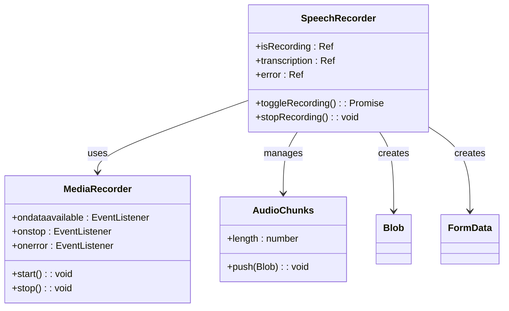

**图表来源**
- [SpeechRecorder.vue:14-18](file://SpeechRecorder.vue#L14-L18)
- [SpeechRecorder.vue:20-77](file://SpeechRecorder.vue#L20-L77)

**章节来源**
- [SpeechRecorder.vue:11-78](file://SpeechRecorder.vue#L11-L78)

## 性能考虑

### 性能优化策略

#### 内存管理

组件在设计时充分考虑了内存使用效率：

1. **及时释放资源**：录音结束后立即停止MediaRecorder并清理相关资源
2. **数据块管理**：使用数组收集音频数据块，避免一次性加载大量数据
3. **Blob对象优化**：合理设置Blob类型和大小，减少内存占用

#### 网络传输优化

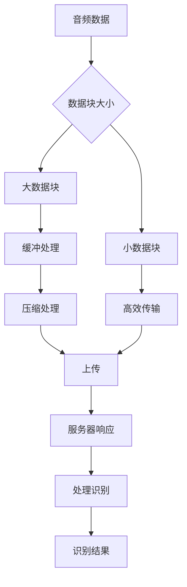

#### 并发处理

组件采用串行处理模式，避免了复杂的并发控制：

- 录音和识别过程串行执行
- 避免同时进行多个录音任务
- 统一的错误处理机制

### 最佳实践指南

#### 使用建议

1. **组件集成**：将SpeechRecorder.vue集成到Vue3项目中，确保正确导入Vue3的响应式系统
2. **样式定制**：根据项目需求调整组件样式，保持视觉一致性
3. **错误处理**：在父组件中监听和处理组件抛出的错误事件
4. **性能监控**：在生产环境中监控组件的内存使用和网络请求情况

#### 配置优化

| 配置项 | 建议值 | 说明 |
|-------|--------|------|
| 录音格式 | audio/webm | 现代浏览器支持良好 |
| 采样率 | 44100Hz | 标准音频质量 |
| 通道数 | 单声道 | 减少数据量 |
| 编码器 | Opus | 高效压缩算法 |

## 故障排除指南

### 常见问题及解决方案

#### 麦克风权限问题

**问题症状**：用户点击录音按钮无反应或显示权限错误

**解决方案**：
1. 确保网站使用HTTPS协议
2. 检查浏览器的麦克风权限设置
3. 提示用户手动授权麦克风访问

#### 浏览器兼容性问题

**问题症状**：组件在某些浏览器中无法正常工作

**解决方案**：
1. 检查浏览器是否支持Web Audio API和MediaRecorder API
2. 提供降级方案或兼容性提示
3. 使用polyfill增强兼容性

#### 网络连接问题

**问题症状**：录音完成后无法上传或识别失败

**解决方案**：
1. 检查网络连接状态
2. 验证后端服务的可用性
3. 实现重试机制和超时处理

#### 性能问题

**问题症状**：组件运行缓慢或内存占用过高

**解决方案**：
1. 优化音频数据块大小
2. 实现适当的垃圾回收机制
3. 减少不必要的DOM操作

**章节来源**
- [README.md:194-204](file://README.md#L194-L204)

## 结论

Vue3语音录制组件是一个功能完整、设计合理的现代化语音识别组件。它成功地结合了Vue3的响应式系统和现代Web API，提供了用户友好的语音录制和识别体验。

组件的主要优势包括：
- **简洁的架构**：基于Vue3 Composition API，代码结构清晰
- **完善的错误处理**：多层次的错误捕获和用户反馈机制
- **良好的可扩展性**：模块化设计便于功能扩展和定制
- **高效的性能**：合理的资源管理和内存使用策略

对于开发者而言，这个组件不仅可以直接集成到现有项目中，还可以作为学习Vue3和Web音频API的优秀示例。

## 附录

### API参考

#### 组件属性

| 属性名 | 类型 | 必需 | 描述 |
|-------|------|------|------|
| isRecording | boolean | 否 | 录音状态，只读 |
| transcription | string | 否 | 语音识别结果，只读 |
| error | string | 否 | 错误信息，只读 |

#### 组件方法

| 方法名 | 参数 | 返回值 | 描述 |
|-------|------|--------|------|
| toggleRecording | 无 | Promise<void> | 切换录音状态 |
| stopRecording | 无 | void | 停止录音 |

#### 事件

| 事件名 | 触发时机 | 参数 | 描述 |
|-------|----------|------|------|
| recording-start | 录音开始 | 无 | 录音开始事件 |
| recording-stop | 录音结束 | 无 | 录音结束事件 |
| transcription-update | 识别结果更新 | {text: string, language?: string} | 识别结果更新事件 |

### 配置选项

#### 环境配置

组件支持通过环境变量进行配置：

| 环境变量 | 类型 | 默认值 | 描述 |
|---------|------|--------|------|
| ASR_SERVER_URL | string | http://localhost:8000 | ASR服务地址 |
| AUDIO_FORMAT | string | audio/webm | 音频格式 |
| CHUNK_SIZE | number | 1000 | 数据块大小(ms) |

### 相关资源

- **Vue3文档**：https://v3.vuejs.org/
- **Web Audio API**：https://developer.mozilla.org/en-US/docs/Web/API/Web_Audio_API
- **MediaRecorder API**：https://developer.mozilla.org/en-US/docs/Web/API/MediaRecorder
- **FastAPI文档**：https://fastapi.tiangolo.com/