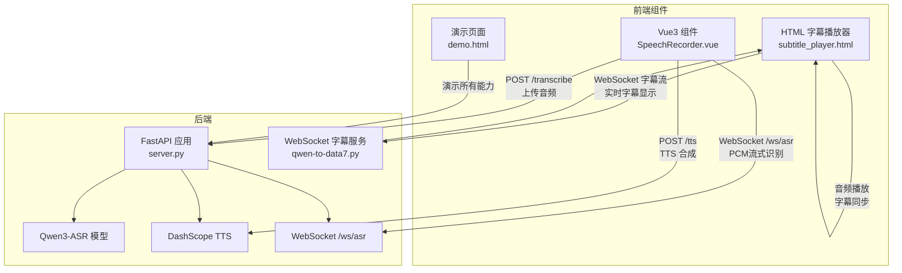
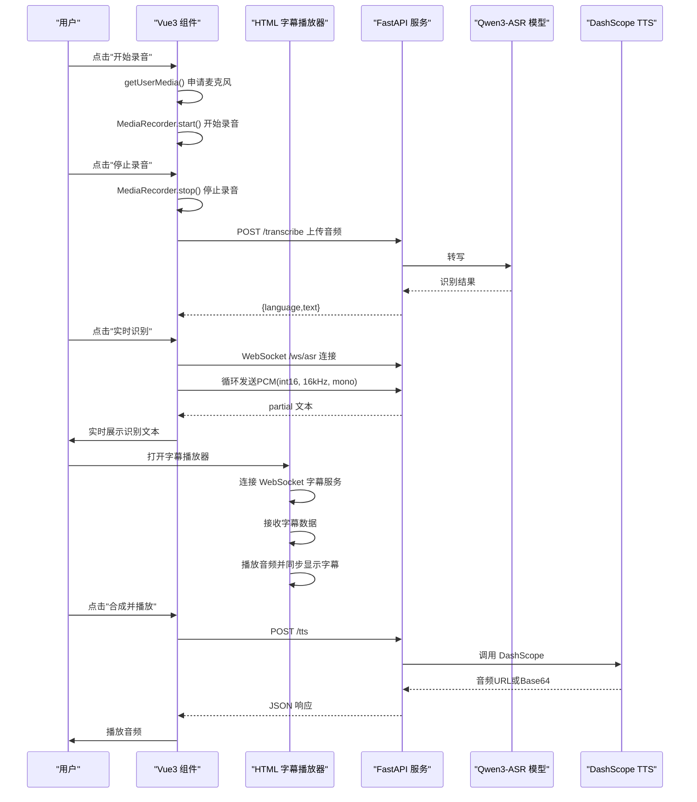
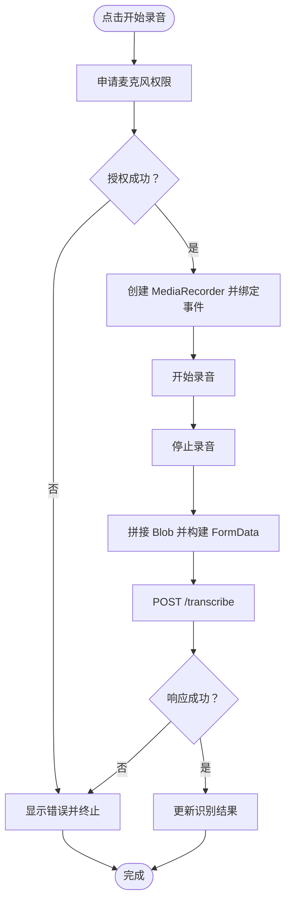
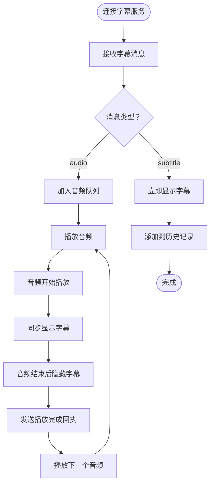
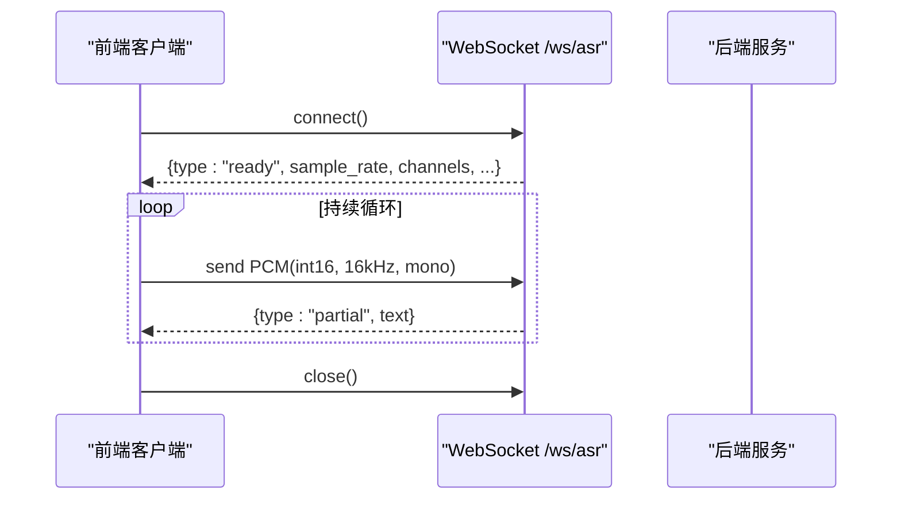
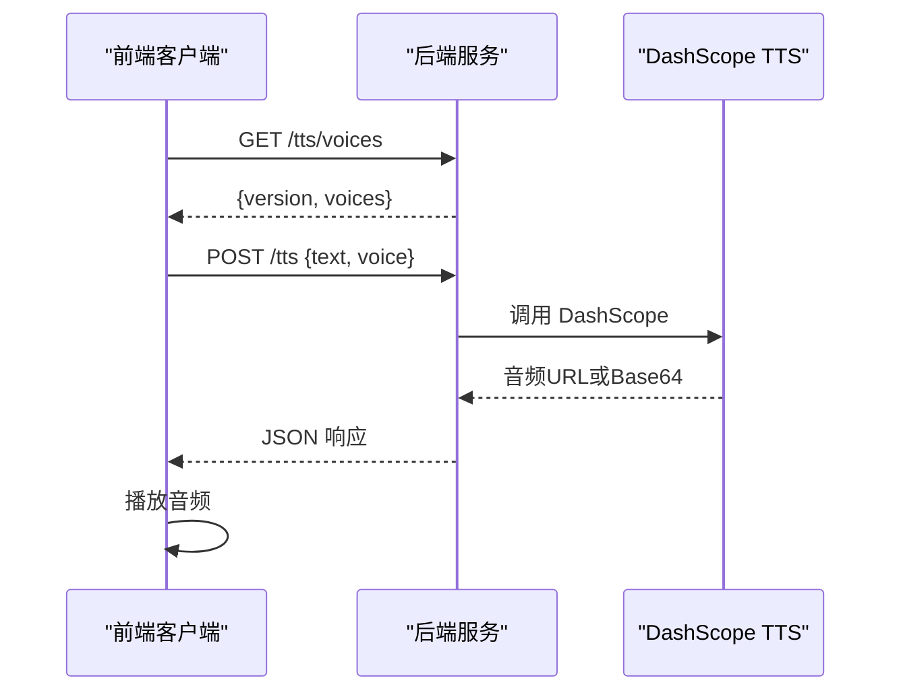
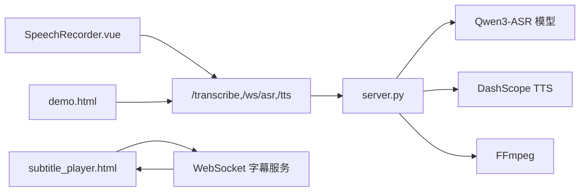

# 前端组件集成

<cite>
**本文引用的文件**
- [SpeechRecorder.vue](file://SpeechRecorder.vue)
- [subtitle_player.html](file://subtitle_player.html)
- [README.md](file://README.md)
- [server.py](file://server.py)
- [demo.html](file://demo.html)
- [requirements.txt](file://requirements.txt)
- [index.py](file://index.py)
- [qwen3stream.py](file://qwen3stream.py)
- [ttstest.py](file://ttstest.py)
- [tts_voices_catalog.json](file://tts_voices_catalog.json)
- [jsonschema.json](file://jsonschema.json)
- [edge_subtitle_voiceover.py](file://edge_subtitle_voiceover.py)
- [subtitles.json](file://subtitles.json)
- [qwen-to-data7.py](file://qwen-to-data7.py)
</cite>

## 目录
1. [简介](#简介)
2. [项目结构](#项目结构)
3. [核心组件](#核心组件)
4. [架构总览](#架构总览)
5. [详细组件分析](#详细组件分析)
6. [依赖关系分析](#依赖关系分析)
7. [性能考量](#性能考量)
8. [故障排查指南](#故障排查指南)
9. [结论](#结论)
10. [附录](#附录)

## 简介
本指南面向前端开发者，提供Vue3语音录制组件与HTML字幕播放器的完整集成与扩展方案。内容涵盖：
- 基于MediaRecorder API的录音封装与麦克风权限管理
- 实时音频采集与WebSocket流式识别的前端实现
- 批量识别与实时识别的API调用流程
- TTS服务调用与播放策略
- HTML字幕播放器：实时字幕显示与音频同步播放
- 错误处理、状态管理与用户体验优化
- 组件复用与自定义扩展最佳实践

## 项目结构
该项目采用"前端组件 + FastAPI后端"的分层设计，前端组件可独立集成到任意Vue3工程，后端提供ASR、WebSocket流式识别与TTS能力。新增的HTML字幕播放器提供独立的字幕显示与音频同步播放功能。

**更新** 新增HTML字幕播放器组件，提供独立的字幕显示与音频同步播放功能

图表来源
- [server.py:124-197](file://server.py#L124-L197)
- [SpeechRecorder.vue:20-77](file://SpeechRecorder.vue#L20-L77)
- [subtitle_player.html:137-325](file://subtitle_player.html#L137-L325)
- [demo.html:486-665](file://demo.html#L486-L665)
- [qwen-to-data7.py:83-154](file://qwen-to-data7.py#L83-L154)

章节来源
- [README.md:5-19](file://README.md#L5-L19)
- [requirements.txt:1-13](file://requirements.txt#L1-L13)

## 核心组件
- Vue3语音录制组件：封装MediaRecorder、权限申请、录音片段收集与上传识别
- HTML字幕播放器：独立的字幕显示与音频同步播放组件
- WebSocket客户端：实时音频流（16kHz、PCM、int16、单声道）发送与partial结果接收
- TTS客户端：调用后端/TTS接口，支持音色列表查询与音频播放

**更新** 新增HTML字幕播放器组件，提供独立的字幕显示与音频同步播放功能

章节来源
- [SpeechRecorder.vue:11-77](file://SpeechRecorder.vue#L11-L77)
- [subtitle_player.html:137-325](file://subtitle_player.html#L137-L325)
- [demo.html:486-665](file://demo.html#L486-L665)
- [server.py:212-247](file://server.py#L212-L247)

## 架构总览
前端通过HTTP与WebSocket与后端交互，后端加载本地Qwen3-ASR模型进行离线识别，同时对接DashScope进行TTS合成。新增的字幕播放器通过WebSocket接收字幕数据，实现字幕与音频的精确同步播放。

**更新** 新增字幕播放器的WebSocket连接与音频同步播放流程

图表来源
- [server.py:124-197](file://server.py#L124-L197)
- [server.py:367-425](file://server.py#L367-L425)
- [server.py:212-247](file://server.py#L212-L247)
- [SpeechRecorder.vue:20-77](file://SpeechRecorder.vue#L20-L77)
- [subtitle_player.html:265-297](file://subtitle_player.html#L265-L297)
- [demo.html:486-665](file://demo.html#L486-L665)

## 详细组件分析

### Vue3语音录制组件（SpeechRecorder.vue）
- 设计目标：最小化依赖，提供录音、上传识别、错误提示的基础能力
- 关键点
  - 权限申请：使用navigator.mediaDevices.getUserMedia获取音频流
  - 录音控制：MediaRecorder.start/stop，dataavailable收集Blob片段
  - 上传识别：FormData封装，multipart/form-data提交至/trascribe
  - 结果展示：识别成功更新text，失败捕获异常并显示错误

图表来源
- [SpeechRecorder.vue:20-77](file://SpeechRecorder.vue#L20-L77)

章节来源
- [SpeechRecorder.vue:11-77](file://SpeechRecorder.vue#L11-L77)

### HTML字幕播放器（subtitle_player.html）
- 设计目标：提供独立的字幕显示与音频同步播放功能
- 核心特性
  - WebSocket连接：自动推导WS地址并连接字幕服务
  - 字幕显示：居中显示、半透明背景、平滑过渡效果
  - 音频同步：音频播放时才显示字幕，播放完毕自动隐藏
  - 队列管理：音频播放队列，支持多批次音频顺序播放
  - 历史记录：显示字幕历史与播放状态
  - 状态监控：连接状态指示、音频播放状态显示

**新增** 完整的HTML字幕播放器组件分析

图表来源
- [subtitle_player.html:198-263](file://subtitle_player.html#L198-L263)
- [subtitle_player.html:265-297](file://subtitle_player.html#L265-L297)

章节来源
- [subtitle_player.html:137-325](file://subtitle_player.html#L137-L325)

### WebSocket流式识别（前端）
- 连接与格式
  - 连接地址：ws://host/ws/asr 或 wss://host/ws/asr
  - 入站：二进制PCM（16kHz、单声道、16bit、小端int16）
  - 出站：JSON文本帧，包含ready/partial/error
- 前端实现要点
  - 使用Web Audio API将麦克风输入下采样至16kHz并转为int16
  - 按固定节拍发送PCM片段，避免过载
  - 接收partial文本并更新UI

图表来源
- [server.py:124-197](file://server.py#L124-L197)
- [demo.html:486-665](file://demo.html#L486-L665)

章节来源
- [README.md:120-129](file://README.md#L120-L129)
- [demo.html:486-665](file://demo.html#L486-L665)

### TTS服务调用（前端）
- 接口：POST /tts，请求体包含text与voice
- 响应：优先使用url，其次使用base64 data，前端解析并播放
- 音色：GET /tts/voices返回音色列表，用于动态选择

图表来源
- [server.py:250-254](file://server.py#L250-L254)
- [server.py:212-247](file://server.py#L212-L247)
- [demo.html:323-382](file://demo.html#L323-L382)

章节来源
- [README.md:130-147](file://README.md#L130-L147)
- [demo.html:272-311](file://demo.html#L272-L311)

### 错误处理与状态管理
- 录音阶段
  - 权限拒绝、浏览器不支持、录音错误均通过error字段反馈
- 识别阶段
  - 上传识别：捕获HTTP错误与JSON解析异常
  - WebSocket：连接失败、服务端错误、格式不符等
- 字幕播放器
  - WebSocket连接状态监控
  - 音频播放队列管理
  - 自动重试与用户交互解锁
- 用户体验
  - 状态指示灯与文案切换，错误信息显式展示
  - 清空按钮与结果追加/覆盖策略

**更新** 新增字幕播放器的错误处理与状态管理

章节来源
- [SpeechRecorder.vue:20-77](file://SpeechRecorder.vue#L20-L77)
- [subtitle_player.html:191-196](file://subtitle_player.html#L191-L196)
- [subtitle_player.html:242-258](file://subtitle_player.html#L242-L258)
- [demo.html:399-411](file://demo.html#L399-L411)
- [demo.html:602-650](file://demo.html#L602-L650)

## 依赖关系分析
- 前端依赖
  - Vue3（组合式API）
  - 浏览器原生API：MediaRecorder、getUserMedia、WebSocket、Web Audio
  - HTML字幕播放器：独立的HTML/CSS/JavaScript组件
- 后端依赖
  - FastAPI、uvicorn
  - Qwen3-ASR模型（本地或HuggingFace）
  - DashScope SDK（TTS）
  - FFmpeg（音频转码）

**更新** 新增HTML字幕播放器的独立依赖关系

图表来源
- [requirements.txt:1-13](file://requirements.txt#L1-L13)
- [server.py:88-95](file://server.py#L88-L95)
- [qwen-to-data7.py:83-154](file://qwen-to-data7.py#L83-L154)

章节来源
- [requirements.txt:1-13](file://requirements.txt#L1-L13)
- [server.py:88-95](file://server.py#L88-L95)

## 性能考量
- 录音与转码
  - WebM/OGG在某些环境下可能需要FFmpeg转码，建议提前准备FFMPEG_PATH
- 实时识别
  - 服务端采用滑动窗口+周期性识别，避免模型过载
  - 前端按16kHz、单声道、int16发送，降低带宽与CPU压力
- 播放与内存
  - TTS优先使用URL播放，避免大体积Base64导致内存占用
  - 播放完成后及时释放ObjectURL
- 字幕播放器
  - 音频队列深度控制，避免过多音频堆积
  - 自动播放限制处理，等待用户交互解锁
  - WebSocket连接状态监控，断线重连机制

**更新** 新增字幕播放器的性能考量

章节来源
- [README.md:194-204](file://README.md#L194-L204)
- [subtitle_player.html:70-71](file://subtitle_player.html#L70-L71)
- [subtitle_player.html:249-257](file://subtitle_player.html#L249-L257)
- [demo.html:359-372](file://demo.html#L359-L372)

## 故障排查指南
- 本地模型加载失败
  - 确认ASR_MODEL_PATH指向包含权重的目录
- FFmpeg缺失或不可用
  - 安装FFmpeg并在.env设置FFMPEG_PATH
- TTS API Key缺失
  - 在.env中配置DASHSCOPE_API_KEY
- WebSocket连接失败
  - 检查CORS配置与反向代理设置
- 演示页音频无法播放
  - 优先使用url，或改用后端代理下载
- 字幕播放器连接问题
  - 检查WebSocket端口（默认8765）是否正确
  - 确认字幕服务已启动（qwen-to-data7.py）
  - 验证视频源URL是否有效

**更新** 新增字幕播放器的故障排查指南

章节来源
- [README.md:48-66](file://README.md#L48-L66)
- [README.md:194-204](file://README.md#L194-L204)
- [server.py:212-247](file://server.py#L212-L247)
- [qwen-to-data7.py:109-115](file://qwen-to-data7.py#L109-L115)

## 结论
本项目提供了从录音到识别再到TTS播放的完整前端集成方案。通过Vue3组件与WebSocket流式识别，可在浏览器内实现低延迟的语音识别体验；结合后端的本地ASR与云端TTS，兼顾性能与质量。新增的HTML字幕播放器提供了独立的字幕显示与音频同步播放功能，支持实时字幕流与音频队列管理。建议在生产环境中关注权限、转码、CORS与资源管理等关键环节，确保稳定与可维护性。

## 附录

### API集成示例（路径参考）
- 批量识别（上传文件）
  - 请求：POST /transcribe
  - 参数：multipart/form-data，字段file
  - 响应：{language,text}
  - 示例路径：[SpeechRecorder.vue:47-62](file://SpeechRecorder.vue#L47-L62)
- 实时识别（WebSocket）
  - 连接：ws://host/ws/asr 或 wss://host/ws/asr
  - 入站：二进制PCM（16kHz、mono、int16）
  - 出站：JSON {type:"ready|partial|error", ...}
  - 示例路径：[server.py:124-197](file://server.py#L124-L197)，[demo.html:486-665](file://demo.html#L486-L665)
- TTS服务
  - 查询音色：GET /tts/voices
  - 合成播放：POST /tts {text, voice}
  - 示例路径：[server.py:250-254](file://server.py#L250-L254)，[server.py:212-247](file://server.py#L212-L247)，[demo.html:323-382](file://demo.html#L323-L382)
- 字幕播放器（WebSocket）
  - 连接：ws://host:8765 或 wss://host:8765
  - 入站：JSON {type:"audio|subtitle", ...}
  - 出站：JSON {type:"audio_done", batch_index}
  - 示例路径：[subtitle_player.html:265-297](file://subtitle_player.html#L265-L297)，[qwen-to-data7.py:91-103](file://qwen-to-data7.py#L91-L103)

**更新** 新增字幕播放器的API集成示例

### 组件复用与扩展最佳实践
- 复用
  - 将SpeechRecorder.vue作为基础组件，注入props（如后端地址、音色列表、回调钩子）
  - 将WebSocket逻辑抽离为独立Hook，便于在多个页面共享
  - 字幕播放器可独立部署，通过WebSocket接收字幕数据
- 扩展
  - 支持多种音频格式与转码策略
  - 增加节流与断线重连机制
  - 提供更丰富的UI状态与提示
  - 将TTS音色列表与服务端同步，支持动态筛选与预览
  - 字幕播放器支持自定义样式与布局配置

**更新** 新增字幕播放器的组件复用与扩展建议

章节来源
- [README.md:151-183](file://README.md#L151-L183)
- [tts_voices_catalog.json:1-54](file://tts_voices_catalog.json#L1-L54)
- [subtitle_player.html:137-145](file://subtitle_player.html#L137-L145)
- [qwen-to-data7.py:142-153](file://qwen-to-data7.py#L142-L153)