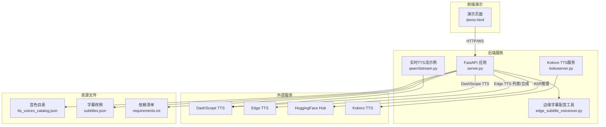
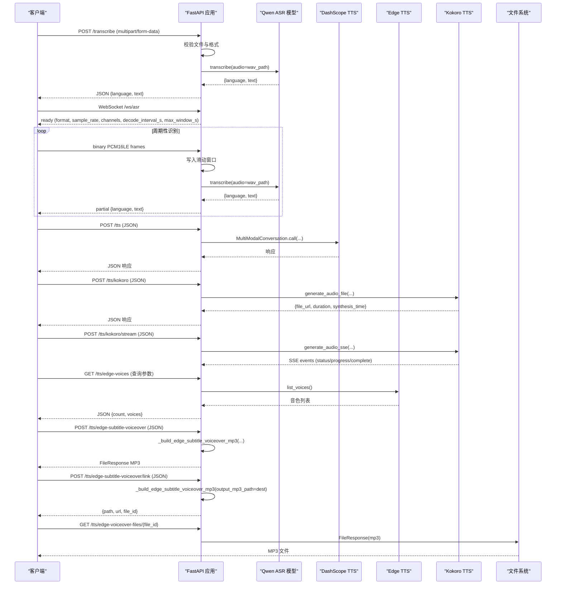
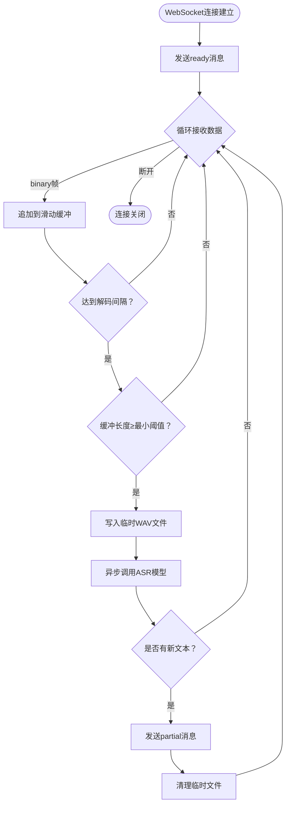
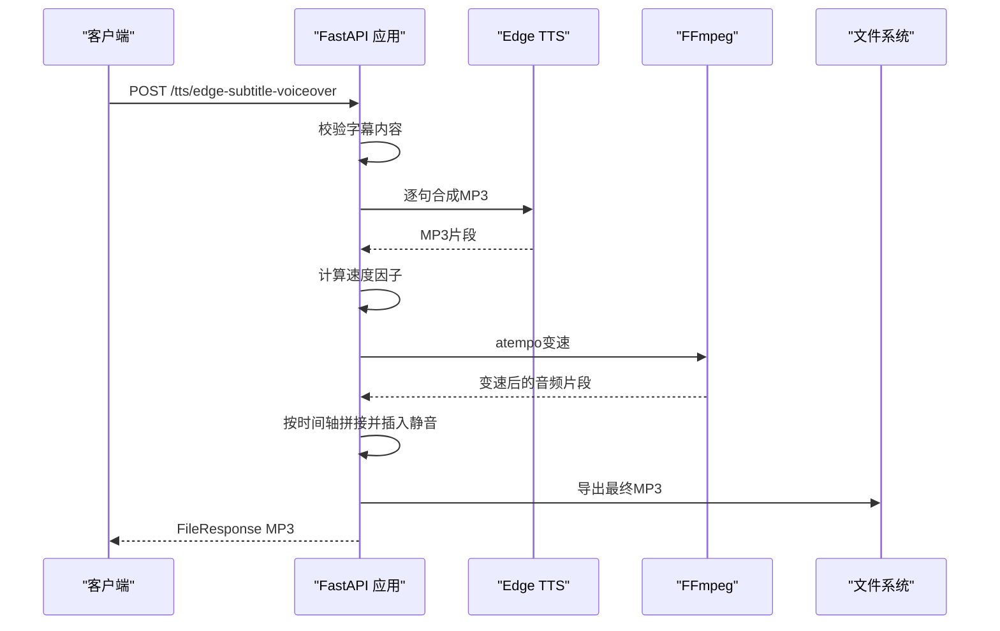
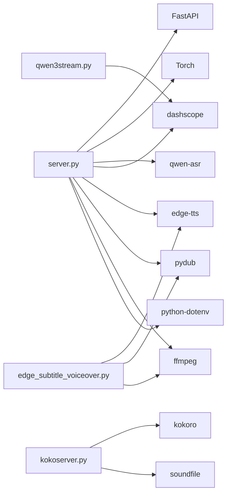

# API端点设计

<cite>
**本文档引用的文件**
- [server.py](file://server.py)
- [edge_subtitle_voiceover.py](file://edge_subtitle_voiceover.py)
- [qwen3stream.py](file://qwen3stream.py)
- [README.md](file://README.md)
- [demo.html](file://demo.html)
- [tts_voices_catalog.json](file://tts_voices_catalog.json)
- [subtitles.json](file://subtitles.json)
- [requirements.txt](file://requirements.txt)
- [ttstest.py](file://ttstest.py)
- [qwen-to-data7.py](file://qwen-to-data7.py)
- [kokoserver.py](file://kokoserver.py)
</cite>

## 目录
1. [简介](#简介)
2. [项目结构](#项目结构)
3. [核心组件](#核心组件)
4. [架构总览](#架构总览)
5. [详细组件分析](#详细组件分析)
6. [依赖分析](#依赖分析)
7. [性能考虑](#性能考虑)
8. [故障排除指南](#故障排除指南)
9. [结论](#结论)
10. [附录](#附录)

## 简介
本文件面向Vue3Speech项目的API端点设计，提供全面的接口文档，涵盖：
- 批量音频识别端点：文件上传、格式转换与错误处理
- WebSocket端点：连接协议、消息格式与状态管理
- 语音合成端点：DashScope、Edge TTS与Kokoro TTS的集成方式
- 字幕配音端点：时间轴处理、变速算法与输出格式
- 请求示例、响应格式与错误代码说明

## 项目结构
项目采用FastAPI作为后端框架，结合Qwen ASR模型与DashScope、Kokoro TTS能力，提供Web演示页面与多种API端点。

**图表来源**
- [server.py:1-452](file://server.py#L1-L452)
- [edge_subtitle_voiceover.py:1-223](file://edge_subtitle_voiceover.py#L1-L223)
- [qwen3stream.py:1-196](file://qwen3stream.py#L1-L196)
- [demo.html:1-685](file://demo.html#L1-L685)
- [kokoserver.py:1-240](file://kokoserver.py#L1-L240)

**章节来源**
- [README.md:1-287](file://README.md#L1-L287)
- [requirements.txt:1-13](file://requirements.txt#L1-L13)

## 核心组件
- FastAPI应用：提供REST API与WebSocket端点，集成CORS中间件，支持跨域访问
- Qwen ASR模型：本地或Hub加载，支持批量音频识别与WebSocket实时识别
- DashScope TTS：HTTP接口与实时WebSocket接口，支持多种音色与指令
- Edge TTS：音色查询与字幕配音生成，支持变速与静音对齐
- Kokoro TTS：本地化中文语音合成，支持同步与流式TTS
- 演示页面：浏览器端录音、实时识别与TTS播放

**章节来源**
- [server.py:67-95](file://server.py#L67-L95)
- [README.md:100-193](file://README.md#L100-L193)

## 架构总览
后端服务通过FastAPI暴露多个端点：
- GET /：健康检查
- GET /demo：返回演示页面
- POST /transcribe：批量音频识别
- WebSocket /ws/asr：实时音频识别
- POST /tts：DashScope TTS
- GET /tts/voices：音色目录
- GET /tts/edge-voices：Edge TTS音色查询
- POST /tts/edge-subtitle-voiceover：字幕配音生成（MP3）
- POST /tts/edge-subtitle-voiceover/link：字幕配音生成（服务端缓存+链接）
- GET /tts/edge-voiceover-files/{file_id}：获取缓存的MP3文件
- **新增** POST /tts/kokoro：Kokoro TTS同步合成
- **新增** POST /tts/kokoro/stream：Kokoro TTS流式合成

**图表来源**
- [server.py:124-197](file://server.py#L124-L197)
- [server.py:212-247](file://server.py#L212-L247)
- [server.py:256-297](file://server.py#L256-L297)
- [server.py:300-360](file://server.py#L300-L360)
- [server.py:367-425](file://server.py#L367-L425)
- [kokoserver.py:183-194](file://kokoserver.py#L183-L194)

## 详细组件分析

### 批量音频识别端点
- 端点：POST /transcribe
- 请求类型：multipart/form-data
- 请求字段：file（音频文件）
- 支持格式：WAV、MP3、M4A、OGG、WEBM、FLAC
- 处理流程：
  - 校验文件名与后缀
  - 对于WEBM/OGG/M4A/MP3/FLAC，优先尝试通过FFmpeg转码为16kHz单声道WAV
  - 对于WEBM/OGG，若未检测到FFmpeg，抛出400错误并提示配置FFMPEG_PATH
  - 使用Qwen ASR模型进行转写，返回语言与文本
- 错误处理：
  - 400：缺少文件名、空文件、格式不支持、FFmpeg转码失败
  - 500：转码异常、ASR推理失败

**请求示例**
- curl
  - curl -X POST "http://127.0.0.1:8000/transcribe" -F "file=@录音.webm"

**响应格式**
- 成功：{"language": "...", "text": "..."}

**章节来源**
- [server.py:367-425](file://server.py#L367-L425)
- [README.md:114-118](file://README.md#L114-L118)

### WebSocket实时识别端点
- 端点：WebSocket /ws/asr
- 握手：服务器接受连接后立即发送ready消息
- 入站数据：二进制帧，PCM16LE单声道，采样率16kHz
- 出站数据：JSON文本帧
  - ready：{"type": "ready", "format": "pcm_s16le", "sample_rate": 16000, "channels": 1, "decode_interval_s": N, "max_window_s": N}
  - partial：{"type": "partial", "language": "...", "text": "..."}
  - error：{"type": "error", "message": "..."}
- 状态管理：
  - 服务器维护滑动窗口（最大窗口秒数可配置）
  - 按固定间隔触发识别（解码间隔可配置）
  - 仅在文本变化时推送partial
- 环境变量：
  - ASR_WS_DECODE_INTERVAL_S：解码间隔（秒，默认1.2）
  - ASR_WS_MAX_WINDOW_S：最大窗口（秒，默认12）

**图表来源**
- [server.py:124-197](file://server.py#L124-L197)

**章节来源**
- [server.py:124-197](file://server.py#L124-L197)
- [README.md:120-128](file://README.md#L120-L128)

### DashScope语音合成端点
- 端点：POST /tts
- 请求类型：application/json
- 请求体：{"text": "...", "voice": "..."}
- 响应类型：application/json，结构与DashScope响应一致
- 集成方式：
  - 通过MultiModalConversation调用qwen3-tts-flash
  - 优先使用环境变量DASHSCOPE_API_KEY
  - 支持指令instruction（用于实时TTS场景）
- 错误处理：
  - 400：缺少API Key
  - 500：SDK调用异常

**请求示例**
- curl
  - curl -X POST "http://127.0.0.1:8000/tts" -H "Content-Type: application/json" -d '{"text":"你好","voice":"Cherry"}'

**响应格式**
- 成功：DashScope标准响应（通常包含output.audio.url或output.audio.data）

**章节来源**
- [server.py:212-247](file://server.py#L212-L247)
- [README.md:139-147](file://README.md#L139-L147)
- [ttstest.py:13-26](file://ttstest.py#L13-L26)

### Edge TTS音色查询端点
- 端点：GET /tts/edge-voices
- 查询参数：
  - locale：按区域过滤（不区分大小写，匹配Locale或ShortName子串）
  - gender：Female或Male
- 响应：{"count": N, "voices": [...]}
- 集成方式：实时调用edge-tts的list_voices()

**请求示例**
- curl
  - curl "http://127.0.0.1:8000/tts/edge-voices?locale=zh-CN&gender=Female"

**章节来源**
- [server.py:256-297](file://server.py#L256-L297)

### 字幕配音生成端点
- 端点：POST /tts/edge-subtitle-voiceover
- 请求类型：application/json
- 请求体：EdgeSubtitleVoiceoverBody
  - voice：Edge TTS音色（如zh-CN-YunxiNeural）
  - subtitles：字幕数组，每项包含id、start_time、end_time、content
- 处理流程：
  - 校验字幕内容非空
  - 逐句调用Edge TTS生成MP3
  - 计算目标时长与原始时长，计算速度因子
  - 使用FFmpeg atempo进行变速（尽量保持音高）
  - 按时间轴对齐，插入静音间隙
  - 导出最终MP3
- 错误处理：
  - 400：字幕内容为空、参数非法
  - 500：FFmpeg不可用、TTS合成失败、内部异常

**请求示例**
- curl
  - curl -X POST "http://127.0.0.1:8000/tts/edge-subtitle-voiceover" -H "Content-Type: application/json" -d '{"voice":"zh-CN-YunxiNeural","subtitles":[{"id":1,"start_time":1000,"end_time":5000,"content":"大家要学习的内容是字幕一键生成配音"}]}'

**响应格式**
- 成功：FileResponse（MP3）

**图表来源**
- [server.py:300-321](file://server.py#L300-L321)
- [edge_subtitle_voiceover.py:166-222](file://edge_subtitle_voiceover.py#L166-L222)

**章节来源**
- [server.py:300-321](file://server.py#L300-L321)
- [edge_subtitle_voiceover.py:166-222](file://edge_subtitle_voiceover.py#L166-L222)

### 字幕配音生成（服务端缓存+链接）
- 端点：POST /tts/edge-subtitle-voiceover/link
- 处理流程：
  - 与上述端点相同，但将MP3保存至服务端缓存目录
  - 返回{"path": "...", "url": "...", "file_id": "..."}
  - 通过GET /tts/edge-voiceover-files/{file_id}获取文件
- 环境变量：
  - PUBLIC_BASE_URL：用于生成绝对链接（反向代理部署时推荐设置）

**请求示例**
- curl
  - curl -X POST "http://127.0.0.1:8000/tts/edge-subtitle-voiceover/link" -H "Content-Type: application/json" -d '{"voice":"zh-CN-YunxiNeural","subtitles":[{"id":1,"start_time":1000,"end_time":5000,"content":"大家要学习的内容是字幕一键生成配音"}]}'

**章节来源**
- [server.py:324-345](file://server.py#L324-L345)
- [server.py:348-360](file://server.py#L348-L360)

### Edge TTS音色目录端点
- 端点：GET /tts/voices
- 响应：来自tts_voices_catalog.json的数据
- 用途：前端选择音色时的参考

**章节来源**
- [server.py:250-253](file://server.py#L250-L253)
- [tts_voices_catalog.json:1-54](file://tts_voices_catalog.json#L1-L54)

### Kokoro TTS同步合成端点
- 端点：POST /tts/kokoro
- 请求类型：application/json
- 请求体：TTSRequest
  - text：要合成的文本（必填）
  - voice：音色标识（默认："zm_yunxia"）
  - speed：语速倍数（默认：1.0）
- 响应类型：application/json，结构如下：
  - file_url：生成音频文件的访问URL
  - filename：文件名
  - duration：音频时长（秒）
  - synthesis_time：合成耗时（秒）
  - voice：使用的音色
- 集成方式：
  - 调用本地Kokoro TTS服务（kokoserver.py）
  - 支持本地模型与远程HuggingFace模型
  - 本地音色文件支持.pt格式或voices目录中的音色文件
- 错误处理：
  - 500：请求验证失败、模型加载失败、音频生成失败

**请求示例**
- curl
  - curl -X POST "http://127.0.0.1:8000/tts/kokoro" -H "Content-Type: application/json" -d '{"text":"你好世界","voice":"zm_yunxia","speed":1.0}'

**响应格式**
- 成功：{"file_url": "...", "filename": "...", "duration": 12.34, "synthesis_time": 5.67, "voice": "zm_yunxia"}

**新增** 章节来源
- [kokoserver.py:183-189](file://kokoserver.py#L183-L189)
- [qwen-to-data7.py:647-687](file://qwen-to-data7.py#L647-L687)

### Kokoro TTS流式合成端点
- 端点：POST /tts/kokoro/stream
- 请求类型：application/json
- 请求体：TTSRequest（与同步端点相同）
- 响应类型：text/event-stream（SSE）
- SSE事件类型：
  - status：状态更新
    - step：初始化阶段（initializing/pipeline/saved）
    - message：描述信息
  - progress：进度更新
    - index：片段索引
    - segment_samples：片段样本数
    - partial_duration：片段时长（秒）
    - message：描述信息
  - complete：合成完成
    - file_url：生成音频文件的访问URL
    - duration：音频总时长（秒）
    - synthesis_time：合成总耗时（秒）
  - error：错误信息
- 集成方式：
  - 与同步端点相同的Kokoro TTS服务
  - 实时流式返回合成进度
- 错误处理：
  - 500：请求验证失败、模型加载失败、音频生成失败

**请求示例**
- curl
  - curl -N -X POST "http://127.0.0.1:8000/tts/kokoro/stream" -H "Content-Type: application/json" -d '{"text":"你好世界","voice":"zm_yunxia","speed":1.0}'

**响应格式**
- 成功：SSE事件流，包含status、progress、complete事件

**新增** 章节来源
- [kokoserver.py:192-194](file://kokoserver.py#L192-L194)
- [kokoserver.py:106-155](file://kokoserver.py#L106-L155)

### 演示页面与前端集成要点
- 端点：GET /demo
- 功能：麦克风授权、录音上传识别、实时识别、TTS合成与播放
- 前端要点：
  - 上传文件到/trascribe
  - WebSocket连接/ws/asr发送PCM16LE帧
  - POST /tts获取DashScope音频URL并播放
  - **新增** POST /tts/kokoro获取Kokoro音频URL并播放

**章节来源**
- [server.py:199-209](file://server.py#L199-L209)
- [demo.html:1-685](file://demo.html#L1-L685)
- [README.md:151-182](file://README.md#L151-L182)

## 依赖分析
- FastAPI：提供路由、请求/响应模型、WebSocket支持
- Torch：加载Qwen ASR模型
- qwen-asr：ASR推理
- dashscope：DashScope TTS与实时TTS
- edge-tts：Edge TTS音色查询与合成
- kokoro：Kokoro TTS本地合成
- pydub：音频处理（变速、拼接）
- ffmpeg：音频转码与变速
- python-dotenv：加载.env环境变量

**图表来源**
- [requirements.txt:1-13](file://requirements.txt#L1-L13)
- [server.py:12-31](file://server.py#L12-L31)
- [edge_subtitle_voiceover.py:11-13](file://edge_subtitle_voiceover.py#L11-L13)
- [qwen3stream.py:5-7](file://qwen3stream.py#L5-L7)
- [kokoserver.py:14](file://kokoserver.py#L14)

**章节来源**
- [requirements.txt:1-13](file://requirements.txt#L1-L13)

## 性能考虑
- ASR模型加载：优先使用本地模型路径，避免网络延迟
- WebSocket识别：通过滑动窗口与解码间隔平衡实时性与准确性
- FFmpeg转码：在WEBM/OGG等格式上进行，确保统一输入格式
- 并发控制：ASR推理使用锁避免GPU内存竞争
- 音频变速：使用FFmpeg atempo，支持多级组合以达到目标速度
- **新增** Kokoro TTS：本地模型加载优化，支持多音色文件格式

## 故障排除指南
常见问题与处理：
- HuggingFace连接超时：配置ASR_MODEL_PATH指向本地模型目录
- torchvision/transformers版本不兼容：锁定与qwen-asr匹配的版本
- 缺少DashScope API Key：在.env中设置DASHSCOPE_API_KEY
- WEBM/OGG转码失败：在.env中设置FFMPEG_PATH指向ffmpeg.exe绝对路径
- CORS跨域问题：默认允许所有来源，可按需调整
- **新增** Kokoro TTS模型加载失败：检查KOKORO_LOCAL_MODEL_DIR目录结构和权限

**章节来源**
- [README.md:194-204](file://README.md#L194-L204)

## 结论
本API设计围绕语音识别与合成两大核心能力，提供REST与WebSocket两种交互模式，满足批量识别、实时流式识别、TTS合成与字幕配音等场景。通过环境变量与配置文件实现灵活部署，配合演示页面展示前端集成方式。新增的Kokoro TTS端点提供了本地化的中文语音合成能力，支持同步与流式两种模式，丰富了语音合成的选择。

## 附录

### 端点一览与规范
- GET /
  - 响应：{"message": "Qwen ASR backend is running"}
- GET /demo
  - 响应：demo.html
- POST /transcribe
  - Content-Type：multipart/form-data
  - Body：file（音频文件）
  - 响应：{"language": "...", "text": "..."}
- WebSocket /ws/asr
  - 入站：PCM16LE单声道，16kHz
  - 出站：ready/partial/error
- POST /tts
  - Content-Type：application/json
  - Body：{"text": "...", "voice": "..."}
  - 响应：DashScope标准JSON
- GET /tts/voices
  - 响应：tts_voices_catalog.json内容
- GET /tts/edge-voices
  - 查询参数：locale、gender
  - 响应：{"count": N, "voices": [...]}
- POST /tts/edge-subtitle-voiceover
  - Content-Type：application/json
  - Body：EdgeSubtitleVoiceoverBody
  - 响应：FileResponse（MP3）
- POST /tts/edge-subtitle-voiceover/link
  - Content-Type：application/json
  - Body：EdgeSubtitleVoiceoverBody
  - 响应：{"path": "...", "url": "...", "file_id": "..."}
- GET /tts/edge-voiceover-files/{file_id}
  - 响应：FileResponse（MP3）
- **新增** POST /tts/kokoro
  - Content-Type：application/json
  - Body：{"text": "...", "voice": "zm_yunxia", "speed": 1.0}
  - 响应：{"file_url": "...", "filename": "...", "duration": 12.34, "synthesis_time": 5.67, "voice": "..."}
- **新增** POST /tts/kokoro/stream
  - Content-Type：application/json
  - Body：{"text": "...", "voice": "zm_yunxia", "speed": 1.0}
  - 响应：SSE事件流（status/progress/complete）

**章节来源**
- [README.md:100-147](file://README.md#L100-L147)
- [server.py:124-197](file://server.py#L124-L197)
- [server.py:212-247](file://server.py#L212-L247)
- [server.py:256-297](file://server.py#L256-L297)
- [server.py:300-360](file://server.py#L300-L360)
- [kokoserver.py:183-194](file://kokoserver.py#L183-L194)