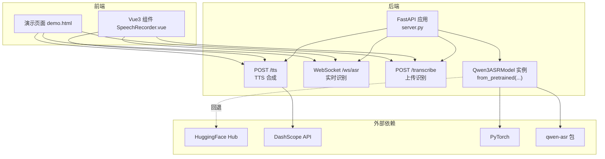
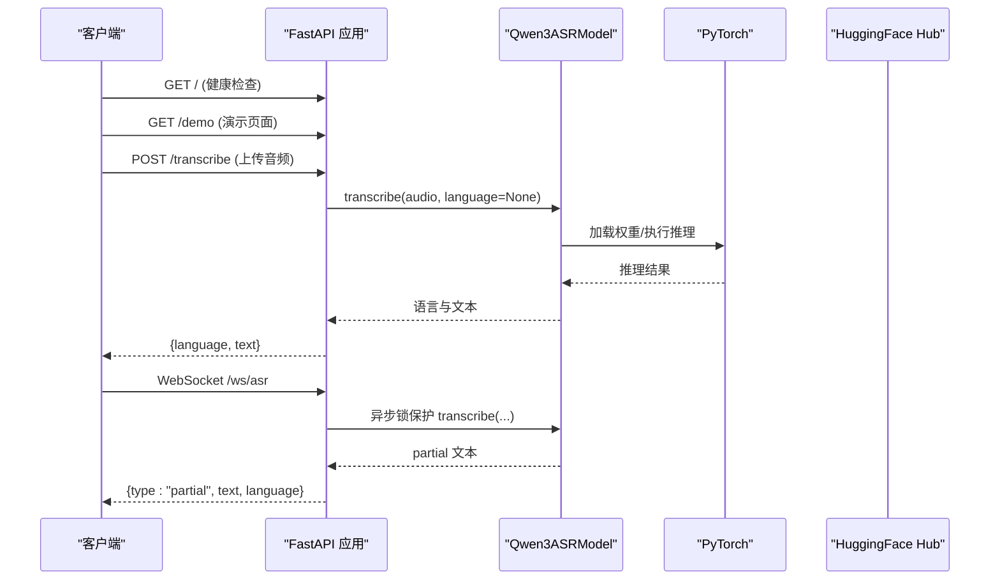
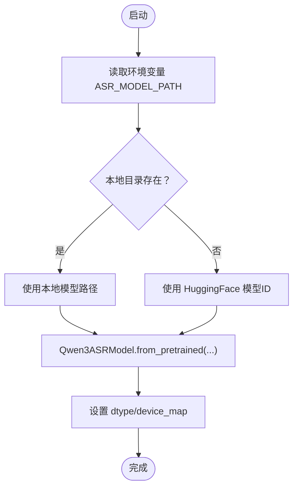
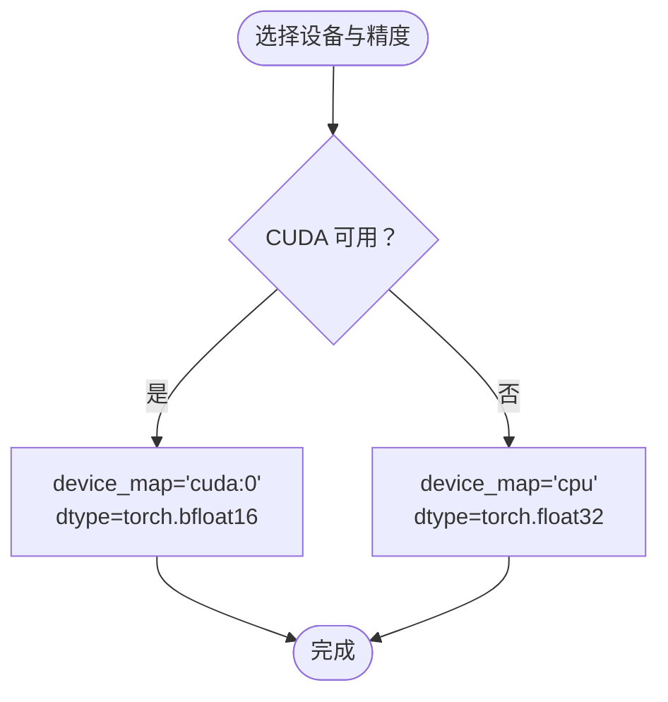
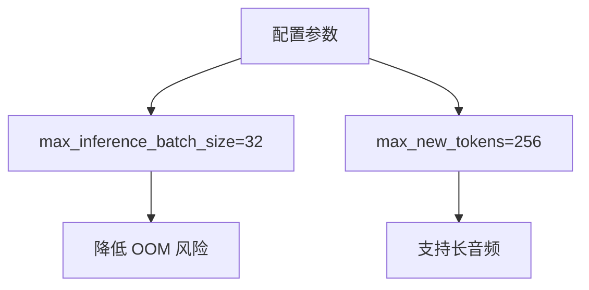
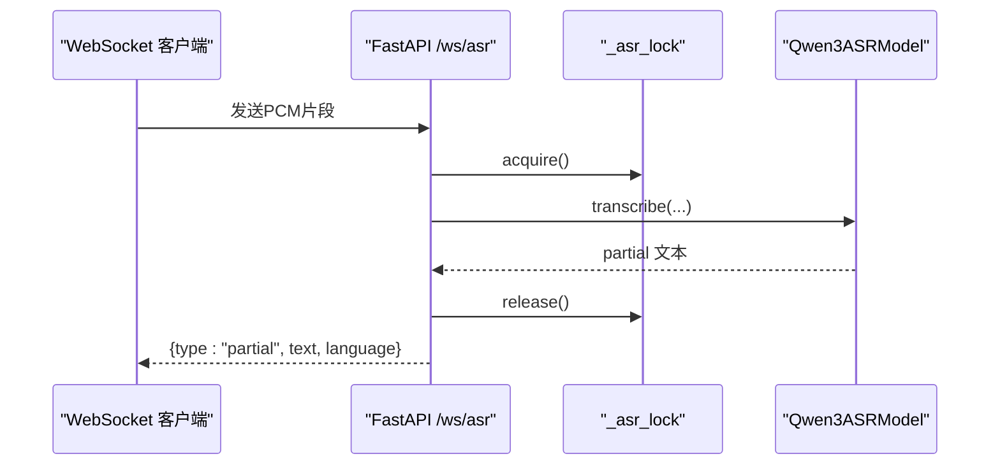
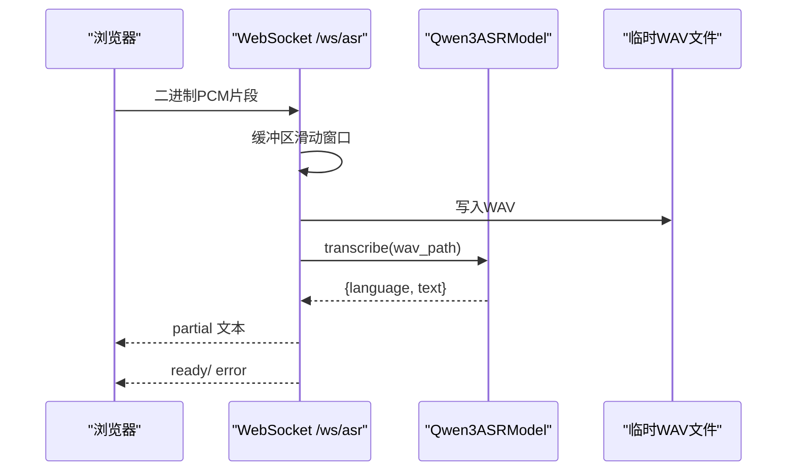
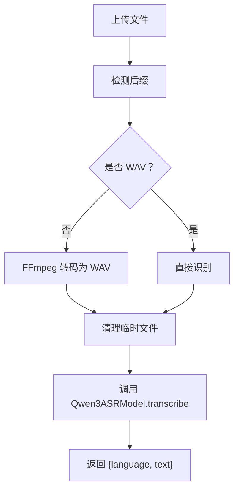
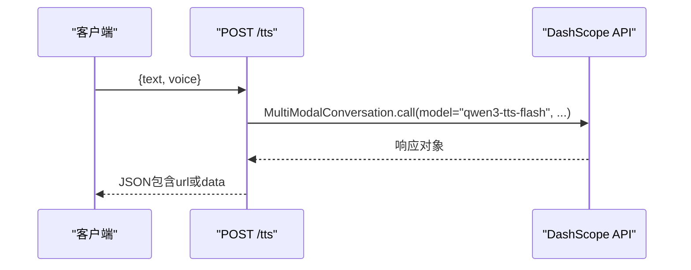
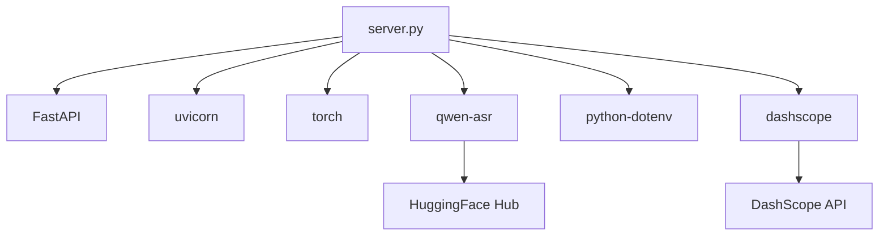

# ASR模型集成

<cite>
**本文档引用的文件**
- [README.md](file://README.md)
- [server.py](file://server.py)
- [index.py](file://index.py)
- [requirements.txt](file://requirements.txt)
- [.env](file://.env)
- [Qwen3-ASR-1.7B/README.md](file://Qwen3-ASR-1.7B/README.md)
- [qwen3stream.py](file://qwen3stream.py)
- [qwen36.py](file://qwen36.py)
- [demo.html](file://demo.html)
- [tts_voices_catalog.json](file://tts_voices_catalog.json)
</cite>

## 目录
1. [简介](#简介)
2. [项目结构](#项目结构)
3. [核心组件](#核心组件)
4. [架构总览](#架构总览)
5. [详细组件分析](#详细组件分析)
6. [依赖关系分析](#依赖关系分析)
7. [性能考量](#性能考量)
8. [故障排除指南](#故障排除指南)
9. [结论](#结论)
10. [附录](#附录)

## 简介
本文件面向Vue3Speech项目中的ASR模型集成，聚焦于Qwen3ASR模型的初始化流程、设备映射策略、模型配置参数、异步锁机制以及故障排除与性能调优建议。文档基于实际代码进行分析，确保技术细节准确可追溯。

## 项目结构
项目采用前后端分离架构，后端基于FastAPI提供ASR与TTS能力，前端提供演示页面与Vue组件。ASR模型通过qwen-asr包加载，支持本地路径优先与HuggingFace回退机制；WebSocket提供准实时流式识别；TTS通过DashScope实现。

**图表来源**
- [server.py:88-95](file://server.py#L88-L95)
- [server.py:124-197](file://server.py#L124-L197)
- [server.py:367-425](file://server.py#L367-L425)
- [server.py:212-247](file://server.py#L212-L247)

**章节来源**
- [README.md:5-19](file://README.md#L5-L19)
- [server.py:67-95](file://server.py#L67-L95)

## 核心组件
- 模型初始化与回退：根据环境变量优先使用本地模型路径，否则回退至HuggingFace Hub。
- 设备映射与精度：自动检测CUDA可用性，优先使用BF16；否则使用FP32与CPU。
- 异步锁：WebSocket与上传识别均使用异步锁保护模型实例，避免并发冲突。
- 配置参数：最大推理批次大小、新token数量限制等，用于平衡性能与内存占用。
- WebSocket流式识别：滑动窗口+周期性识别，返回partial文本。
- TTS集成：DashScope多模态对话接口，返回JSON结构。

**章节来源**
- [server.py:78-95](file://server.py#L78-L95)
- [server.py:97-98](file://server.py#L97-L98)
- [server.py:124-197](file://server.py#L124-L197)
- [server.py:367-425](file://server.py#L367-L425)
- [server.py:212-247](file://server.py#L212-L247)

## 架构总览
后端启动时完成环境变量加载、模型初始化与路由注册。WebSocket与上传接口共享同一个Qwen3ASRModel实例，通过异步锁保证并发安全。TTS接口调用DashScope，前端通过HTTP与WebSocket与后端交互。

**图表来源**
- [server.py:199-201](file://server.py#L199-L201)
- [server.py:204-209](file://server.py#L204-L209)
- [server.py:367-425](file://server.py#L367-L425)
- [server.py:124-197](file://server.py#L124-L197)

## 详细组件分析

### 模型初始化与回退机制
- 模型路径检测：读取环境变量ASR_MODEL_PATH，若为有效目录则使用本地路径；否则回退至HuggingFace模型ID。
- 初始化参数：
  - dtype：根据设备选择BF16或FP32
  - device_map：CUDA或CPU
  - max_inference_batch_size：32
  - max_new_tokens：256
- 回退策略：当本地路径不可用时，自动从HF Hub加载模型权重。

**图表来源**
- [server.py:83-95](file://server.py#L83-L95)
- [README.md:38-46](file://README.md#L38-L46)

**章节来源**
- [server.py:83-95](file://server.py#L83-L95)
- [README.md:38-46](file://README.md#L38-L46)

### 设备映射策略与精度选择
- 设备检测：优先使用CUDA:0（BF16），否则回退至CPU（FP32）。
- 精度选择：BF16在支持的GPU上可提升吞吐与降低显存占用；FP32用于CPU或不支持BF16的设备。
- 降级处理：若CUDA不可用，自动切换至CPU，确保服务可用性。

**图表来源**
- [server.py:78-81](file://server.py#L78-L81)

**章节来源**
- [server.py:78-81](file://server.py#L78-L81)

### 模型配置参数与性能优化
- 最大推理批次大小：32，用于限制并发推理的批尺寸，避免OOM。
- 新token数量限制：256，适用于较长音频输入，平衡生成长度与资源消耗。
- 性能优化策略：
  - BF16在支持的GPU上可显著降低显存占用并提升吞吐。
  - 本地模型优先可减少网络抖动带来的延迟。
  - WebSocket滑动窗口与周期性识别，避免频繁I/O与重复计算。

**图表来源**
- [server.py:93-94](file://server.py#L93-L94)
- [index.py:9-10](file://index.py#L9-L10)

**章节来源**
- [server.py:93-94](file://server.py#L93-L94)
- [index.py:9-10](file://index.py#L9-L10)

### 异步锁机制与并发控制
- 全局异步锁：_asr_lock用于保护模型实例，确保同一时间只有一个异步任务访问模型。
- 保护范围：WebSocket实时识别与上传识别均使用该锁。
- 锁的使用：在调用模型transcribe前获取锁，完成后释放，避免并发冲突。

**图表来源**
- [server.py:97](file://server.py#L97)
- [server.py:180-181](file://server.py#L180-L181)

**章节来源**
- [server.py:97](file://server.py#L97)
- [server.py:180-181](file://server.py#L180-L181)

### WebSocket流式识别流程
- 帧格式：16kHz、单声道、16bit小端PCM（pcm_s16le）
- 滑动窗口：默认最大窗口12秒，超过部分丢弃
- 周期性解码：默认解码间隔1.2秒，避免过于频繁的I/O
- 输出：ready、partial、error三类消息
- 临时文件：将PCM写入临时WAV后调用模型识别

**图表来源**
- [server.py:124-197](file://server.py#L124-L197)

**章节来源**
- [server.py:124-197](file://server.py#L124-L197)

### 上传识别与转码流程
- 支持格式：WAV、MP3、M4A、OGG、WEBM、FLAC
- 转码策略：WEBM/OGG/MP3/M4A通过FFmpeg转码为WAV
- FFmpeg路径：可通过环境变量FFMPEG_PATH指定绝对路径
- 临时文件管理：上传文件与转码后的WAV均在finally中清理

**图表来源**
- [server.py:367-425](file://server.py#L367-L425)

**章节来源**
- [server.py:367-425](file://server.py#L367-L425)

### TTS集成与DashScope调用
- 接口：POST /tts，请求体包含text与voice
- 调用：DashScope MultiModalConversation，模型为qwen3-tts-flash
- 响应：JSON结构，优先使用url播放，否则使用base64 data
- 语音列表：/tts/voices返回tts_voices_catalog.json内容

**图表来源**
- [server.py:212-247](file://server.py#L212-L247)
- [tts_voices_catalog.json:1-54](file://tts_voices_catalog.json#L1-L54)

**章节来源**
- [server.py:212-247](file://server.py#L212-L247)
- [tts_voices_catalog.json:1-54](file://tts_voices_catalog.json#L1-L54)

## 依赖关系分析
- 后端依赖：FastAPI、uvicorn、torch、qwen-asr、dashscope、python-dotenv等
- 模型依赖：qwen-asr提供Qwen3ASRModel封装，torch负责推理
- 外部依赖：HuggingFace Hub（回退）、DashScope API（TTS）

**图表来源**
- [requirements.txt:1-13](file://requirements.txt#L1-L13)
- [server.py:12-19](file://server.py#L12-L19)

**章节来源**
- [requirements.txt:1-13](file://requirements.txt#L1-L13)
- [server.py:12-19](file://server.py#L12-L19)

## 性能考量
- 设备与精度：优先使用CUDA+BF16，CPU+FP32作为降级方案
- 批次与token：max_inference_batch_size=32，max_new_tokens=256，兼顾吞吐与资源
- 本地模型优先：减少网络抖动，提高稳定性
- WebSocket参数：ASR_WS_DECODE_INTERVAL_S与ASR_WS_MAX_WINDOW_S可调，平衡实时性与负载
- FFmpeg路径：在IDE环境中明确FFMPEG_PATH，避免NoBackendError

**章节来源**
- [server.py:78-81](file://server.py#L78-L81)
- [server.py:93-94](file://server.py#L93-L94)
- [README.md:77-83](file://README.md#L77-L83)
- [server.py:388-410](file://server.py#L388-L410)

## 故障排除指南
- HuggingFace连接超时：配置ASR_MODEL_PATH指向本地完整权重目录，避免Hub拉取
- torchvision/nms版本不兼容：卸载不匹配的torchvision，或重装与torch同源版本
- transformers兼容问题：锁定与qwen-asr匹配的transformers版本
- TTS缺少API Key：检查.DASHSCOPE_API_KEY，确保与地域一致
- 演示页TTS无法播放：外链wav加载受限，可改用后端代理或查看返回JSON中的url
- webm转码失败：安装FFmpeg并在.env中设置FFMPEG_PATH为ffmpeg.exe绝对路径

**章节来源**
- [README.md:194-204](file://README.md#L194-L204)
- [server.py:388-410](file://server.py#L388-L410)

## 结论
Vue3Speech项目通过FastAPI与qwen-asr实现了稳定可靠的ASR服务，结合本地模型优先与HuggingFace回退机制、设备自动检测与BF16优先策略、异步锁并发保护与WebSocket滑动窗口识别，提供了高性能、低延迟的语音识别体验。配合DashScope TTS与完善的故障排除指南，整体系统具备良好的可维护性与可扩展性。

## 附录
- 环境变量参考：ASR_MODEL_PATH、DASHSCOPE_API_KEY、FFMPEG_PATH、UVICORN_*等
- WebSocket参数：ASR_WS_DECODE_INTERVAL_S、ASR_WS_MAX_WINDOW_S
- 模型配置：max_inference_batch_size、max_new_tokens

**章节来源**
- [.env:1-5](file://.env#L1-L5)
- [README.md:48-83](file://README.md#L48-L83)
- [server.py:136-137](file://server.py#L136-L137)