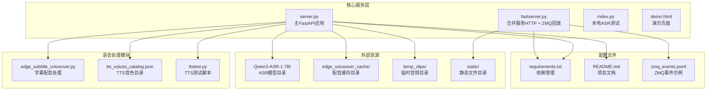
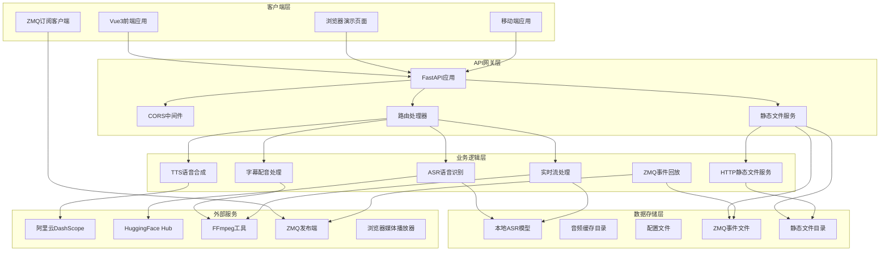
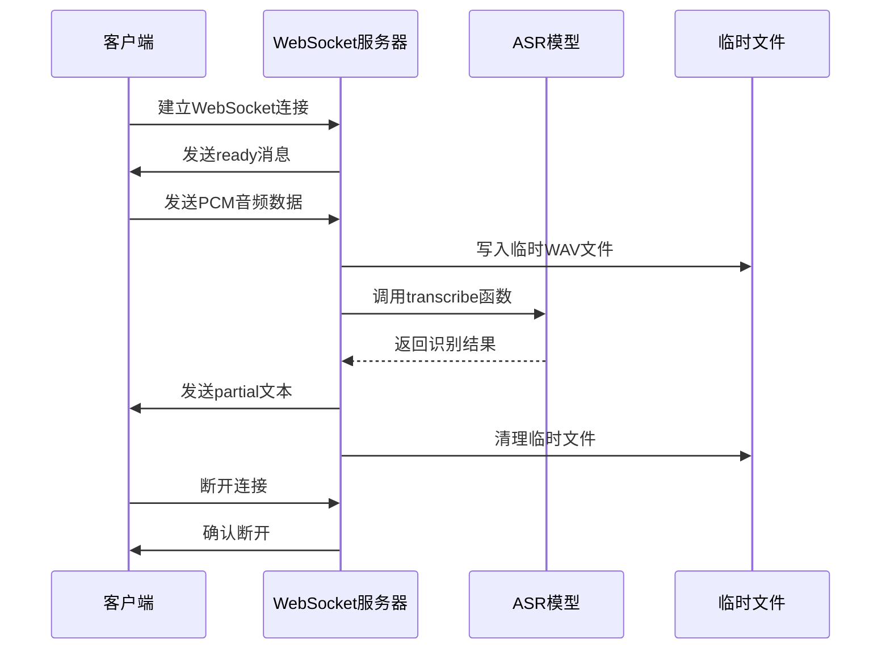
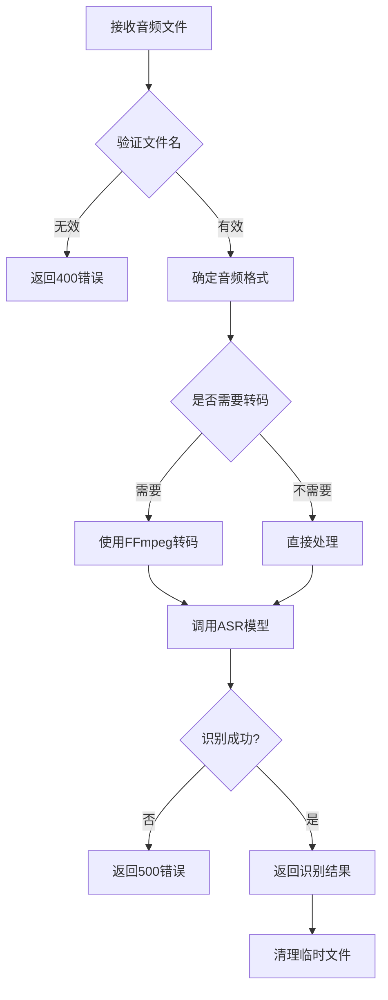
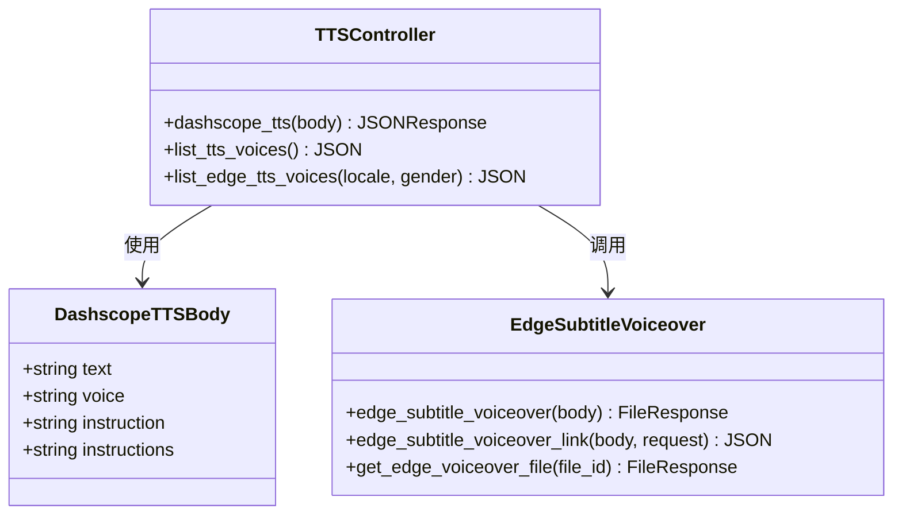
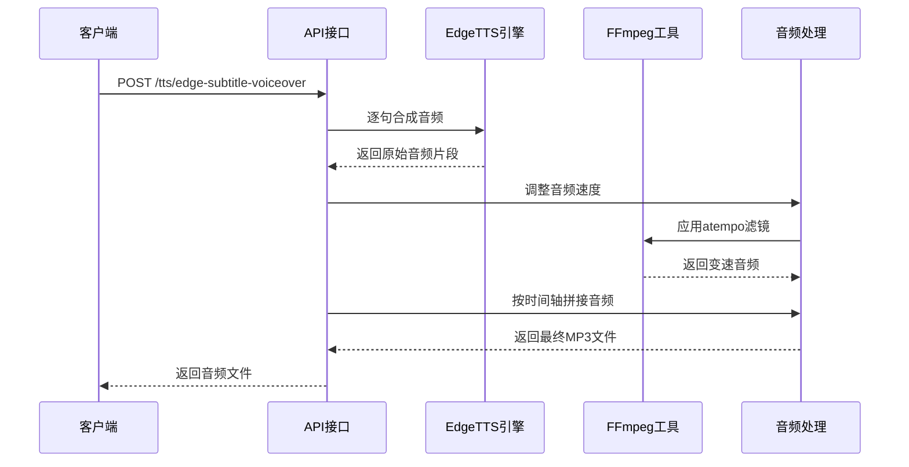
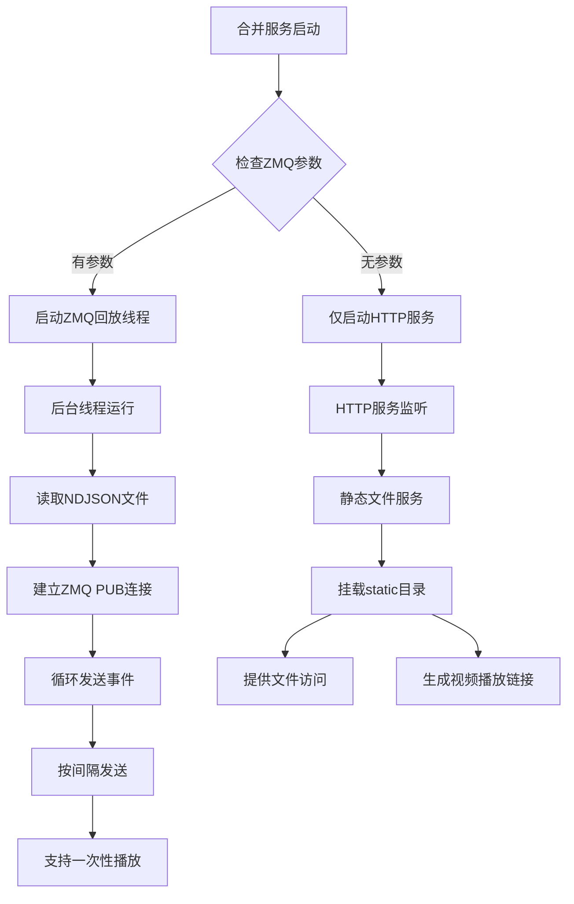
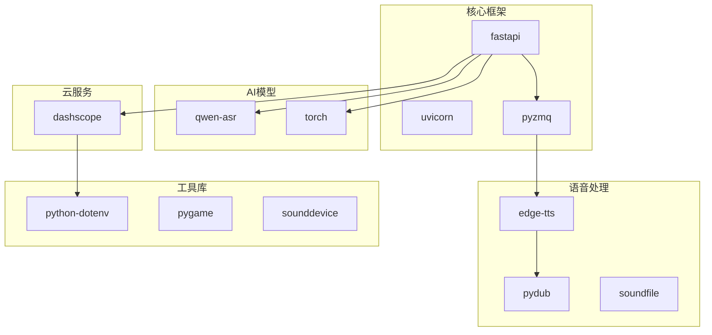
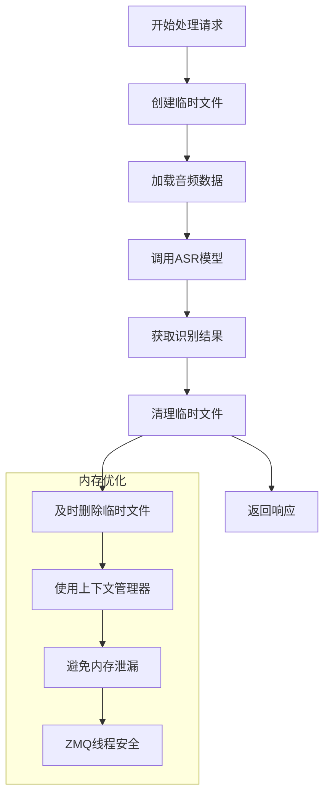

# FastAPI服务设计

<cite>
**本文档引用的文件**
- [server.py](file://server.py)
- [fastserver.py](file://fastserver.py)
- [index.py](file://index.py)
- [requirements.txt](file://requirements.txt)
- [README.md](file://README.md)
- [edge_subtitle_voiceover.py](file://edge_subtitle_voiceover.py)
- [ttstest.py](file://ttstest.py)
- [tts_voices_catalog.json](file://tts_voices_catalog.json)
- [demo.html](file://demo.html)
- [zmq_events.jsonl](file://zmq_events.jsonl)
</cite>

## 更新摘要
**变更内容**
- 新增FastAPI合并服务功能分析，包括HTTP静态文件服务和ZMQ事件回放能力
- 更新核心组件章节，增加fastserver.py的合并服务架构
- 新增ZMQ事件回放系统详细说明
- 更新项目结构图，反映新的服务架构
- 增加命令行参数配置和环境变量管理说明

## 目录
1. [简介](#简介)
2. [项目结构](#项目结构)
3. [核心组件](#核心组件)
4. [架构概览](#架构概览)
5. [详细组件分析](#详细组件分析)
6. [依赖关系分析](#依赖关系分析)
7. [性能考虑](#性能考虑)
8. [故障排除指南](#故障排除指南)
9. [结论](#结论)

## 简介

Vue3Speech是一个基于Vue3前端和FastAPI后端的语音应用，集成了本地Qwen3-ASR语音识别和阿里云DashScope TTS语音合成功能。该项目提供了完整的语音处理解决方案，包括录音上传识别、WebSocket实时流式识别、浏览器内TTS试听等功能。

**更新** 新增了FastAPI合并服务功能，通过fastserver.py提供HTTP静态文件服务和ZMQ事件回放能力，支持命令行参数配置、静态文件挂载和ZMQ回放线程等新功能。

该FastAPI服务采用现代化的微服务架构，通过CORS中间件支持跨域访问，实现了高性能的语音处理能力。服务支持多种音频格式的转写和实时语音流处理，为前端Vue3应用提供了强大的后端支撑。

## 项目结构

项目采用模块化设计，主要文件组织如下：



**图表来源**
- [server.py:67-67](file://server.py#L67-L67)
- [fastserver.py:25-26](file://fastserver.py#L25-L26)
- [requirements.txt:1-13](file://requirements.txt#L1-L13)

**章节来源**
- [README.md:5-19](file://README.md#L5-L19)
- [server.py:67-67](file://server.py#L67-L67)
- [fastserver.py:25-26](file://fastserver.py#L25-L26)

## 核心组件

### FastAPI应用实例

应用采用标准的FastAPI实例化方式，配置了完整的中间件栈和路由系统：

- **应用初始化**: 创建FastAPI实例，启用OpenAPI文档
- **CORS中间件**: 全域跨域支持，便于前后端分离开发
- **模型加载**: 启动时加载Qwen3-ASR模型，支持本地路径和HuggingFace回退
- **缓存目录**: 初始化edge_voiceover_cache目录用于存储生成的音频文件

**更新** 新增fastserver.py合并服务，提供HTTP静态文件服务和ZMQ事件回放功能：
- **静态文件服务**: 通过StaticFiles挂载static目录，提供文件访问能力
- **视频播放服务**: 提供/test.mp4的播放链接生成
- **ZMQ事件回放**: 支持从NDJSON文件回放事件到ZMQ PUB

### 中间件配置

服务配置了专门的CORS中间件，采用宽松的跨域策略：

```mermaid
flowchart TD
A[CORS中间件配置] --> B[allow_origins: "*"]
A --> C[allow_credentials: True]
A --> D[allow_methods: "*"]
A --> E[allow_headers: "*"]
B --> F[允许任意源访问]
C --> G[支持凭据传输]
D --> H[允许任意HTTP方法]
E --> I[允许任意请求头]
```

**图表来源**
- [server.py:69-76](file://server.py#L69-L76)

### 异常处理机制

服务实现了多层次的异常处理策略：

- **HTTP异常**: 使用HTTPException返回标准化错误响应
- **WebSocket异常**: 捕获WebSocketDisconnect异常并优雅处理
- **文件操作异常**: 处理文件不存在、权限不足等IO异常
- **模型推理异常**: 捕获ASR模型推理过程中的各种异常
- **ZMQ异常**: 处理ZMQ连接和消息发送过程中的异常

**章节来源**
- [server.py:124-197](file://server.py#L124-L197)
- [server.py:212-247](file://server.py#L212-L247)
- [server.py:367-424](file://server.py#L367-L424)
- [fastserver.py:48-107](file://fastserver.py#L48-L107)

## 架构概览

### 整体架构设计



**图表来源**
- [server.py:67-67](file://server.py#L67-L67)
- [server.py:88-95](file://server.py#L88-L95)
- [fastserver.py:25-26](file://fastserver.py#L25-L26)

### 数据流处理

服务的数据流处理遵循以下模式：

1. **请求接收**: FastAPI接收HTTP请求和WebSocket连接
2. **参数验证**: Pydantic模型进行数据验证和类型转换
3. **业务处理**: 调用相应的语音处理函数
4. **结果返回**: 格式化响应数据并返回给客户端

**更新** 新增ZMQ事件回放数据流：
- **事件读取**: 从NDJSON文件读取事件数据
- **ZMQ发布**: 将事件通过ZMQ PUB发布到网络
- **回放控制**: 支持循环播放和一次性播放模式

**章节来源**
- [server.py:124-197](file://server.py#L124-L197)
- [server.py:367-424](file://server.py#L367-L424)
- [fastserver.py:48-107](file://fastserver.py#L48-L107)

## 详细组件分析

### WebSocket实时ASR组件

WebSocket组件实现了准实时的语音识别功能：



**图表来源**
- [server.py:124-197](file://server.py#L124-L197)

#### 核心参数配置

| 参数名称 | 默认值 | 说明 |
|---------|--------|------|
| ASR_WS_DECODE_INTERVAL_S | 1.2秒 | 解码间隔时间 |
| ASR_WS_MAX_WINDOW_S | 12秒 | 音频滑动窗口大小 |
| sample_rate | 16000Hz | 采样频率 |
| channels | 1 | 单声道 |

#### 处理流程

1. **连接建立**: 接受WebSocket连接并发送就绪消息
2. **音频缓冲**: 将PCM数据缓冲到内存中
3. **定时识别**: 按设定间隔进行音频转写
4. **结果推送**: 将识别结果通过WebSocket推送
5. **资源清理**: 删除临时文件并处理异常

**章节来源**
- [server.py:124-197](file://server.py#L124-L197)

### HTTP音频转录组件

HTTP转录组件支持多种音频格式的批量处理：



**图表来源**
- [server.py:367-424](file://server.py#L367-L424)

#### 支持的音频格式

| 格式 | 说明 | 转码要求 |
|------|------|----------|
| WAV | 原始音频格式 | 无需转码 |
| MP3 | MPEG音频格式 | 无需转码 |
| M4A | AAC音频格式 | 无需转码 |
| OGG | Ogg容器格式 | 需要FFmpeg |
| WEBM | WebM容器格式 | 需要FFmpeg |
| FLAC | 无损音频格式 | 无需转码 |

**章节来源**
- [server.py:367-424](file://server.py#L367-L424)

### TTS语音合成组件

TTS组件提供了多种语音合成能力：



**图表来源**
- [server.py:100-107](file://server.py#L100-L107)
- [server.py:212-247](file://server.py#L212-L247)
- [server.py:300-360](file://server.py#L300-L360)

#### 音色目录管理

服务维护了一个完整的音色目录，包含：

- **音色基本信息**: 名称、描述、适用语言
- **模型支持**: 不同TTS模型的支持情况
- **地区适配**: 各种方言和地区的音色适配

**章节来源**
- [server.py:250-253](file://server.py#L250-L253)
- [tts_voices_catalog.json:1-54](file://tts_voices_catalog.json#L1-L54)

### 字幕配音处理组件

字幕配音组件实现了精确的时间轴对齐功能：



**图表来源**
- [edge_subtitle_voiceover.py:166-223](file://edge_subtitle_voiceover.py#L166-L223)

#### 时间轴对齐算法

组件实现了精确的音频时间轴对齐：

1. **逐句合成**: 对每个字幕条目独立合成音频
2. **速度调整**: 根据目标时长计算速度因子并调整音频
3. **无缝拼接**: 将多个音频片段按时间轴精确拼接
4. **静音插入**: 在句子间插入适当的静音间隔

**章节来源**
- [edge_subtitle_voiceover.py:166-223](file://edge_subtitle_voiceover.py#L166-L223)

### **新增** FastAPI合并服务组件

**更新** fastserver.py提供了合并服务功能，结合HTTP静态文件服务和ZMQ事件回放能力：



**图表来源**
- [fastserver.py:111-143](file://fastserver.py#L111-L143)

#### 命令行参数配置

| 参数名称 | 类型 | 默认值 | 说明 |
|----------|------|--------|------|
| --host | 字符串 | 0.0.0.0 | HTTP监听地址 |
| --port | 整数 | 8000 | HTTP监听端口 |
| --reload | 布尔 | False | 开启uvicorn热重载 |
| --zmq-input | 路径 | None | ZMQ回放NDJSON文件路径 |
| --zmq-bind | 字符串 | tcp://*:5557 | ZMQ PUB绑定地址 |
| --zmq-topic | 字符串 | hado.event | ZMQ主题名称 |
| --zmq-interval | 浮点数 | 1.0 | 两条消息间隔秒数 |
| --zmq-once | 布尔 | False | 文件播完后停止回放 |

#### ZMQ事件回放功能

- **NDJSON解析**: 从JSONL文件读取事件数据并验证格式
- **ZMQ发布**: 通过PUB/SUB模式发布事件到网络
- **线程管理**: 后台线程运行，不影响HTTP服务
- **异常处理**: 捕获并记录ZMQ回放过程中的异常

**章节来源**
- [fastserver.py:48-107](file://fastserver.py#L48-L107)
- [fastserver.py:111-143](file://fastserver.py#L111-L143)

## 依赖关系分析

### 外部依赖管理

项目采用requirements.txt统一管理依赖：



**图表来源**
- [requirements.txt:1-13](file://requirements.txt#L1-L13)

### 环境变量配置

服务支持多种环境变量配置：

| 变量名称 | 类型 | 默认值 | 说明 |
|----------|------|--------|------|
| DASHSCOPE_API_KEY | 字符串 | 无 | 阿里云DashScope API密钥 |
| ASR_MODEL_PATH | 字符串 | Qwen3-ASR-1.7B | ASR模型本地路径 |
| UVICORN_HOST | 字符串 | 0.0.0.0 | Uvicorn主机绑定 |
| UVICORN_PORT | 整数 | 8000 | Uvicorn端口设置 |
| UVICORN_LOG_LEVEL | 字符串 | info | 日志级别 |
| UVICORN_RELOAD | 布尔 | False | 热重载开关 |
| ASR_WS_DECODE_INTERVAL_S | 浮点数 | 1.2 | WebSocket解码间隔 |
| ASR_WS_MAX_WINDOW_S | 浮点数 | 12 | 最大窗口大小 |
| FFMPEG_PATH | 字符串 | 无 | FFmpeg可执行文件路径 |
| PUBLIC_BASE_URL | 字符串 | 无 | 公网基础URL |
| ZMQ_BIND_ADDRESS | 字符串 | tcp://*:5557 | ZMQ PUB绑定地址 |
| ZMQ_TOPIC | 字符串 | hado.event | ZMQ主题名称 |

**章节来源**
- [README.md:48-83](file://README.md#L48-L83)
- [server.py:427-451](file://server.py#L427-L451)
- [fastserver.py:117-124](file://fastserver.py#L117-L124)

## 性能考虑

### 模型优化策略

服务采用了多项性能优化措施：

1. **设备选择**: 自动检测CUDA可用性，优先使用GPU加速
2. **数据类型**: 在GPU上使用bfloat16，在CPU上使用float32
3. **批处理限制**: 设置最大推理批大小为32，避免内存溢出
4. **锁机制**: 使用asyncio.Lock确保ASR模型调用的线程安全

### 内存管理



### 并发处理

服务支持高并发的WebSocket连接：

- **异步处理**: 所有WebSocket操作都是异步的
- **锁机制**: ASR模型调用使用互斥锁防止并发冲突
- **资源限制**: 通过批处理大小限制避免内存不足
- **ZMQ线程**: 后台线程运行，不影响主线程性能

**更新** ZMQ事件回放的性能考虑：
- **线程隔离**: ZMQ回放运行在独立线程中
- **内存管理**: 及时释放ZMQ套接字资源
- **异常恢复**: 捕获异常并优雅关闭连接

## 故障排除指南

### 常见问题及解决方案

| 问题类型 | 症状 | 解决方案 |
|----------|------|----------|
| 模型加载失败 | 连接HuggingFace超时 | 配置ASR_MODEL_PATH指向本地模型目录 |
| CUDA内存不足 | RuntimeError: CUDA out of memory | 降低max_inference_batch_size或使用CPU |
| FFmpeg找不到 | 转码失败 | 设置FFMPEG_PATH或添加到系统PATH |
| CORS跨域问题 | 浏览器跨域错误 | 检查CORS配置或使用反向代理 |
| TTS API密钥错误 | 401未授权 | 验证DASHSCOPE_API_KEY配置 |
| ZMQ连接失败 | pyzmq导入错误 | 安装pyzmq依赖或检查网络连接 |
| 静态文件访问失败 | 404错误 | 确认static目录存在且路径正确 |
| NDJSON文件格式错误 | JSON解析异常 | 检查JSONL文件格式和编码 |

### 调试建议

1. **查看日志**: 使用UVICORN_LOG_LEVEL设置更详细的日志级别
2. **检查依赖**: 确保所有依赖正确安装且版本兼容
3. **验证配置**: 检查.env文件中的环境变量设置
4. **测试连接**: 使用curl或Postman测试API端点
5. **ZMQ调试**: 使用zmqtest.py验证ZMQ连接和消息格式

**章节来源**
- [README.md:194-204](file://README.md#L194-L204)
- [fastserver.py:58-62](file://fastserver.py#L58-L62)

## 结论

Vue3Speech的FastAPI服务设计体现了现代Web应用的最佳实践：

1. **架构清晰**: 采用分层架构，职责明确，易于维护
2. **性能优化**: 通过设备检测、数据类型优化和批处理限制提升性能
3. **用户体验**: 提供实时流式识别和多种音频格式支持
4. **可扩展性**: 模块化设计便于功能扩展和维护
5. **多功能集成**: 新增的合并服务功能支持静态文件服务和ZMQ事件回放

**更新** 新增的fastserver.py合并服务功能为项目增加了以下优势：
- **统一入口**: 通过单一服务同时提供HTTP和ZMQ功能
- **灵活配置**: 支持命令行参数动态配置服务行为
- **事件驱动**: 通过ZMQ实现事件驱动的实时数据发布
- **开发友好**: 提供离线调试和回放能力

该服务为Vue3前端应用提供了强大而灵活的后端支撑，通过合理的中间件配置、异常处理机制和环境变量管理，确保了系统的稳定性和可靠性。未来可以进一步优化的方向包括引入更精细的缓存策略、增强监控指标收集和改进错误恢复机制。