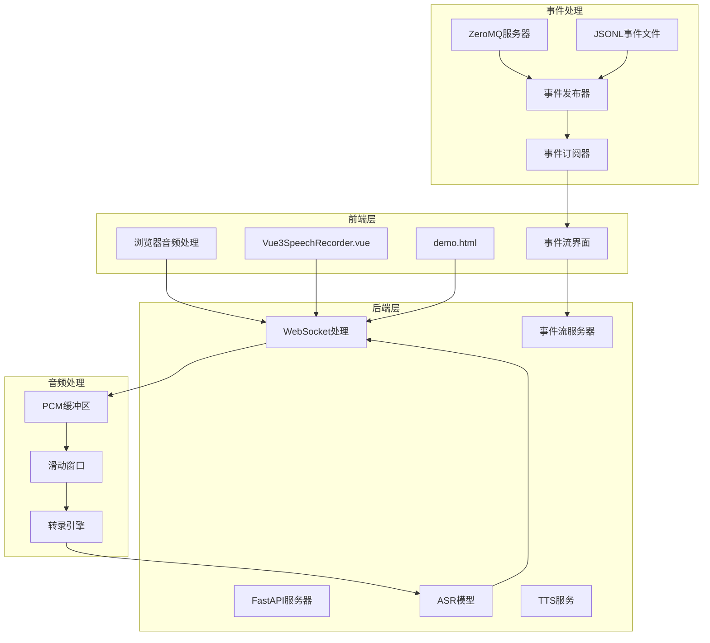
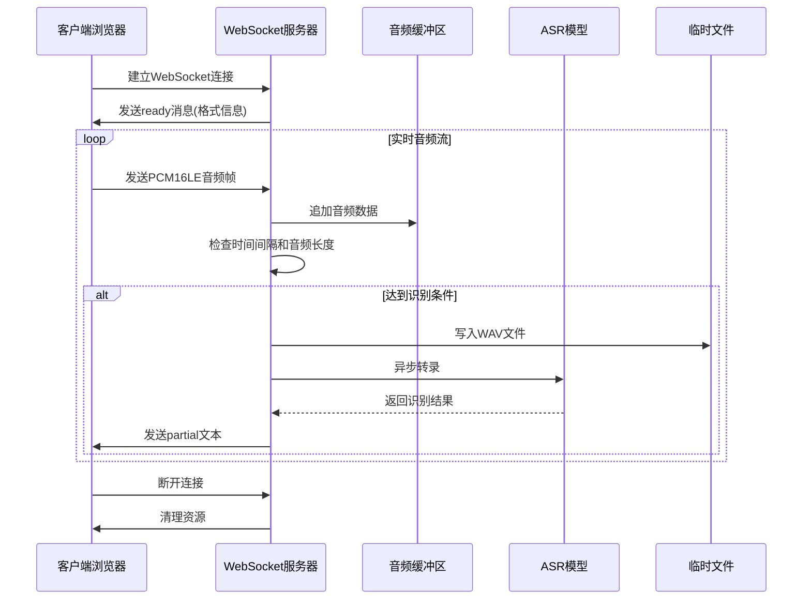
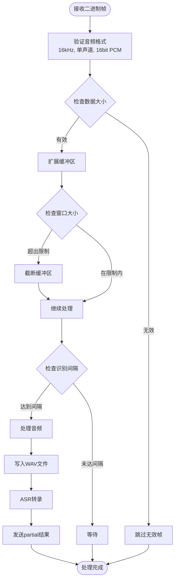
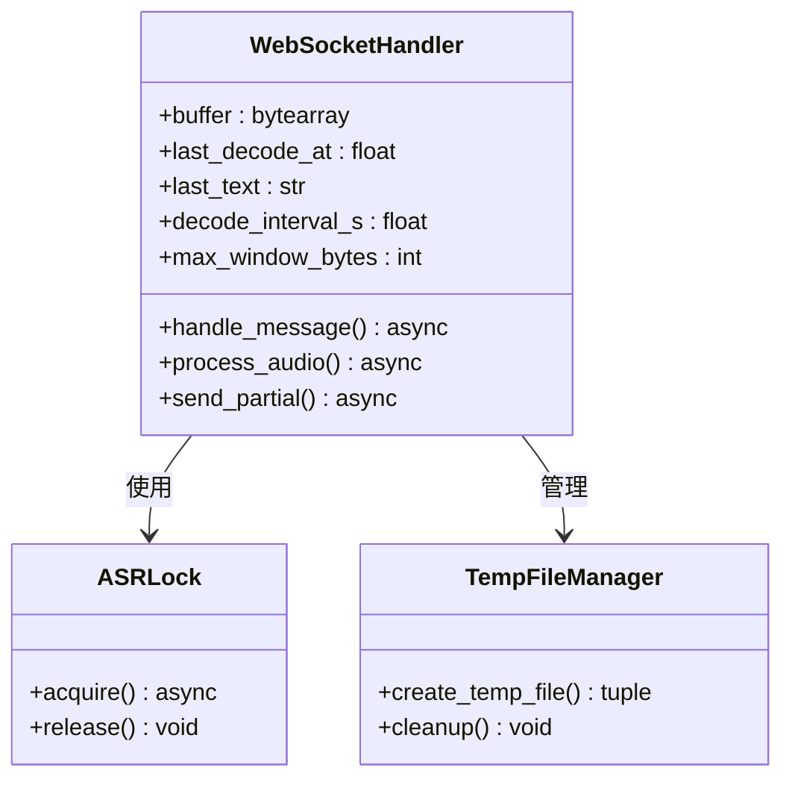
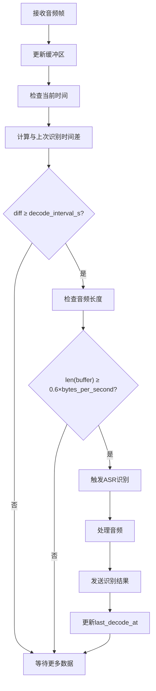
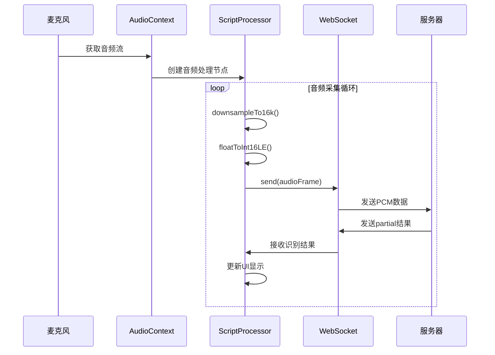
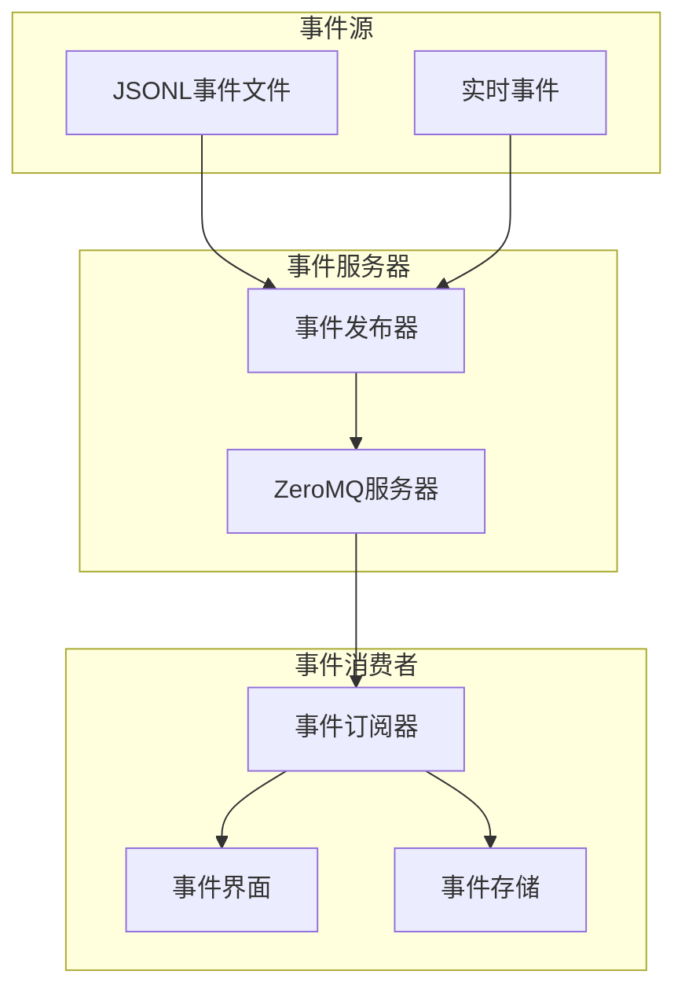
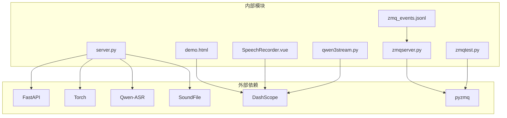
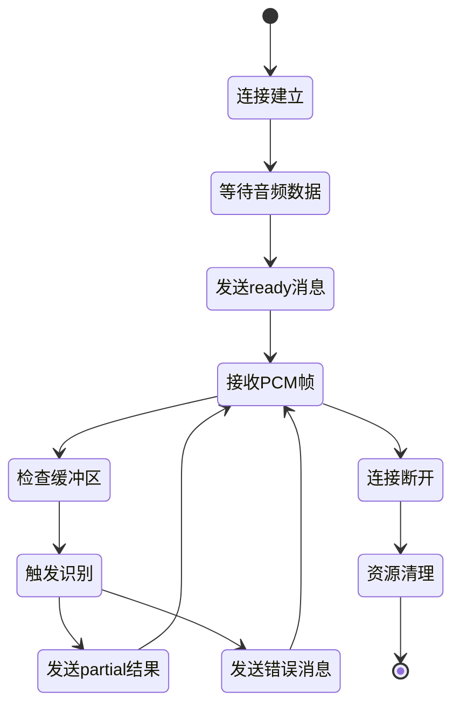
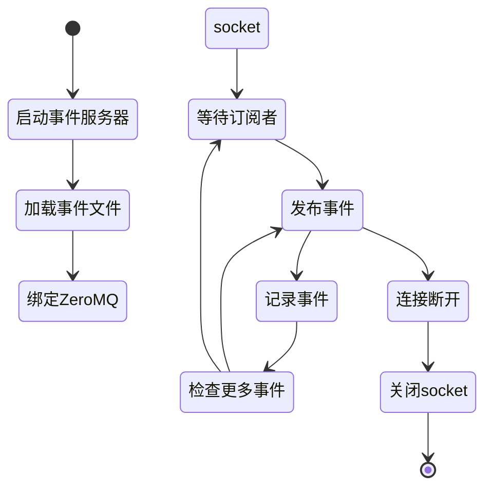

# WebSocket实时处理

<cite>
**本文档引用的文件**
- [server.py](file://server.py)
- [demo.html](file://demo.html)
- [SpeechRecorder.vue](file://SpeechRecorder.vue)
- [qwen3stream.py](file://qwen3stream.py)
- [README.md](file://README.md)
- [requirements.txt](file://requirements.txt)
- [zmq_events_20260519_144636.jsonl](file://zmq_events_20260519_144636.jsonl)
- [zmqserver.py](file://zmqserver.py)
- [zmqtest.py](file://zmqtest.py)
- [zmqcli.py](file://zmqcli.py)
</cite>

## 更新摘要
**变更内容**
- 新增ZeroMQ事件流处理架构，支持JSONL事件数据的实时发布和订阅
- 添加基于事件文件的回放机制，提供稳定的事件流测试能力
- 扩展实时处理能力，支持多种事件类型（动作、得分等）
- 增强事件处理的可靠性和可扩展性

## 目录
1. [简介](#简介)
2. [项目结构](#项目结构)
3. [核心组件](#核心组件)
4. [架构概览](#架构概览)
5. [详细组件分析](#详细组件分析)
6. [ZeroMQ事件流处理](#zeromq事件流处理)
7. [依赖关系分析](#依赖关系分析)
8. [性能考虑](#性能考虑)
9. [故障排除指南](#故障排除指南)
10. [结论](#结论)

## 简介

Vue3Speech是一个基于Vue3前端和FastAPI后端的语音应用，提供了完整的语音识别和语音合成解决方案。本文档专注于WebSocket实时处理功能，深入解释PCM16LE音频数据的处理流程，包括二进制帧接收、缓冲区管理、音频格式验证、滑动窗口算法实现、异步处理机制以及实时识别的触发条件。

**新增特性**：项目现已集成ZeroMQ事件流处理能力，支持基于JSONL格式的实时事件发布和订阅，为视频分析、动作识别等场景提供事件驱动的实时处理架构。

该项目的核心特色是提供WebSocket实时语音识别功能，客户端通过WebSocket连接向服务器发送16kHz单声道PCM音频流，服务器端采用滑动窗口算法进行周期性识别，并实时返回部分识别结果。同时，新增的ZeroMQ事件流处理能力为实时事件监控和分析提供了强大的基础设施。

## 项目结构

Vue3Speech项目采用模块化设计，主要包含以下核心组件：

**图表来源**
- [server.py:124-196](file://server.py#L124-L196)
- [demo.html:486-564](file://demo.html#L486-L564)
- [zmqserver.py:11-68](file://zmqserver.py#L11-L68)

**章节来源**
- [README.md:1-287](file://README.md#L1-L287)
- [requirements.txt:1-13](file://requirements.txt#L1-L13)

## 核心组件

### WebSocket实时识别服务

服务器端的WebSocket处理逻辑位于`server.py`文件中，实现了完整的实时音频处理管道：

- **二进制帧接收**：通过`websocket.receive()`接收客户端发送的PCM音频数据
- **缓冲区管理**：使用`bytearray`实现高效的音频缓冲区管理
- **滑动窗口算法**：基于时间间隔和音频长度的智能识别触发机制
- **异步处理**：利用Python asyncio实现非阻塞的音频处理

### ZeroMQ事件流处理

新增的ZeroMQ事件流处理系统提供了完整的事件发布和订阅机制：

- **事件服务器**：基于`zmqserver.py`实现的PUB/SUB模式事件发布器
- **事件文件回放**：支持从JSONL文件逐行回放事件，便于测试和演示
- **事件订阅器**：基于`zmqtest.py`的事件订阅和存储功能
- **事件CLI客户端**：简单的REQ/REP模式客户端用于测试ZeroMQ连接

### 前端音频采集和传输

前端提供了两种音频处理方式：

1. **传统录音上传**：使用`SpeechRecorder.vue`组件进行录音，然后通过HTTP上传识别
2. **实时WebSocket传输**：使用`demo.html`中的JavaScript代码实现实时音频流传输

**章节来源**
- [server.py:124-196](file://server.py#L124-L196)
- [demo.html:486-564](file://demo.html#L486-L564)
- [SpeechRecorder.vue:1-90](file://SpeechRecorder.vue#L1-L90)
- [zmqserver.py:11-68](file://zmqserver.py#L11-L68)
- [zmqtest.py:5-46](file://zmqtest.py#L5-L46)

## 架构概览

WebSocket实时处理的整体架构如下：

**图表来源**
- [server.py:124-196](file://server.py#L124-L196)
- [demo.html:486-564](file://demo.html#L486-L564)

## 详细组件分析

### PCM16LE音频数据处理

#### 二进制帧接收和验证

服务器端通过以下方式处理PCM16LE音频数据：

**图表来源**
- [server.py:155-194](file://server.py#L155-L194)

#### 缓冲区管理策略

服务器端采用了高效的缓冲区管理策略：

1. **动态缓冲区**：使用`bytearray()`实现可变长度的音频缓冲区
2. **内存优化**：当缓冲区超过最大窗口大小时，采用切片操作进行内存重用
3. **字节序处理**：确保PCM数据的小端序格式正确

#### 滑动窗口算法实现

滑动窗口算法的关键参数和实现：

| 参数名称 | 默认值 | 说明 |
|---------|--------|------|
| `ASR_WS_DECODE_INTERVAL_S` | 1.2秒 | 解码间隔时间 |
| `ASR_WS_MAX_WINDOW_S` | 12秒 | 最大音频窗口大小 |
| `sample_rate` | 16000Hz | 采样率 |
| `bytes_per_second` | 32000字节 | 每秒字节数 |

窗口大小计算：
- 最大窗口字节数 = `max_window_s × sample_rate × 2`
- 最小触发长度 = `0.6 × bytes_per_second`

**章节来源**
- [server.py:134-166](file://server.py#L134-L166)

### 异步处理机制

#### 事件循环管理

服务器端使用Python asyncio实现非阻塞的音频处理：

**图表来源**
- [server.py:97-98](file://server.py#L97-L98)
- [server.py:176-193](file://server.py#L176-L193)

#### 协程调度和资源清理

异步处理的关键实现：

1. **锁机制**：使用`asyncio.Lock()`确保ASR调用的互斥访问
2. **线程池**：通过`asyncio.to_thread()`将CPU密集型的ASR转录放到线程池执行
3. **资源清理**：在finally块中确保临时文件的正确删除

**章节来源**
- [server.py:178-193](file://server.py#L178-L193)

### 实时识别触发条件

#### 时间间隔控制

识别触发的严格时间控制机制：

**图表来源**
- [server.py:167-174](file://server.py#L167-L174)

#### 音频长度阈值

音频长度阈值的设计考虑：

- **最小触发长度**：0.6秒的音频数据，确保有足够的上下文信息
- **窗口大小限制**：12秒的滑动窗口，平衡实时性和准确性
- **采样率标准**：16kHz的采样率，符合语音识别的标准要求

**章节来源**
- [server.py:171-172](file://server.py#L171-L172)

### 前端WebSocket连接管理

#### 浏览器端音频处理

前端JavaScript实现了完整的音频采集和WebSocket通信：

**图表来源**
- [demo.html:486-564](file://demo.html#L486-L564)
- [demo.html:460-484](file://demo.html#L460-L484)

#### 音频格式转换

前端实现了精确的音频格式转换：

1. **重采样**：将输入音频重采样到16kHz
2. **格式转换**：将Float32音频转换为Int16LE PCM格式
3. **二进制处理**：使用Int16Array进行高效的二进制数据处理

**章节来源**
- [demo.html:460-484](file://demo.html#L460-L484)

## ZeroMQ事件流处理

### 事件流架构

新增的ZeroMQ事件流处理系统提供了强大的实时事件处理能力：

**图表来源**
- [zmqserver.py:11-68](file://zmqserver.py#L11-L68)
- [zmqtest.py:5-46](file://zmqtest.py#L5-L46)

### 事件数据格式

事件数据采用标准化的JSONL格式，每个事件包含以下关键字段：

- **schema_version**: 事件格式版本
- **event_id**: 唯一事件标识符
- **event_type**: 事件类型（action/score等）
- **frame_index/frame_number**: 帧索引和编号
- **time_seconds/time**: 时间戳信息
- **player**: 玩家信息（用户名、队伍、位置等）
- **action**: 动作信息（类型、置信度、关键点等）
- **score/ko**: 得分和K.O.相关信息

### 事件发布和订阅

#### 事件发布器

`zmqserver.py`实现了基于ZeroMQ的事件发布功能：

- **PUB/SUB模式**：使用PUB socket发布事件，SUB socket订阅事件
- **文件回放**：支持从JSONL文件逐行读取并发布事件
- **时间控制**：可配置事件发布的间隔时间
- **主题管理**：支持自定义事件主题

#### 事件订阅器

`zmqtest.py`提供了完整的事件订阅和存储功能：

- **SUB socket连接**：连接到ZeroMQ服务器订阅事件
- **JSONL存储**：将接收到的事件以JSONL格式存储到文件
- **实时显示**：在控制台实时显示接收到的事件
- **错误处理**：完善的异常处理和连接管理

### 事件处理流程

**图表来源**
- [zmqserver.py:50-60](file://zmqserver.py#L50-L60)

**章节来源**
- [zmqserver.py:11-68](file://zmqserver.py#L11-L68)
- [zmqtest.py:5-46](file://zmqtest.py#L5-L46)
- [zmq_events_20260519_144636.jsonl:1-118](file://zmq_events_20260519_144636.jsonl#L1-L118)

## 依赖关系分析

### 核心依赖关系

**图表来源**
- [requirements.txt:1-13](file://requirements.txt#L1-L13)
- [server.py:18-22](file://server.py#L18-L22)
- [zmqserver.py:8](file://zmqserver.py#L8)

### WebSocket连接生命周期

WebSocket连接的完整生命周期管理：

**图表来源**
- [server.py:124-196](file://server.py#L124-L196)

### ZeroMQ事件流生命周期

ZeroMQ事件流的完整生命周期管理：

**图表来源**
- [zmqserver.py:11-68](file://zmqserver.py#L11-L68)

**章节来源**
- [requirements.txt:1-13](file://requirements.txt#L1-L13)

## 性能考虑

### 内存优化策略

1. **缓冲区重用**：使用切片操作`buffer[:] = buffer[-max_window_bytes:]`实现内存重用
2. **临时文件管理**：及时清理临时WAV文件，避免磁盘空间占用
3. **异步处理**：避免阻塞事件循环，提高并发处理能力
4. **ZeroMQ内存管理**：合理配置ZeroMQ socket的内存缓冲区

### 处理延迟优化

1. **解码间隔调整**：通过环境变量`ASR_WS_DECODE_INTERVAL_S`调节识别频率
2. **窗口大小配置**：通过`ASR_WS_MAX_WINDOW_S`平衡实时性和准确性
3. **批量处理**：减少不必要的ASR调用次数
4. **事件发布间隔**：通过`--interval`参数控制事件发布的频率

### 并发处理能力

- **线程池隔离**：ASR处理在独立线程中执行，不影响WebSocket连接
- **锁机制保护**：确保多个并发连接的安全访问
- **资源池管理**：合理管理GPU/CPU资源的使用
- **ZeroMQ多路复用**：支持多个事件订阅者的并发处理

### ZeroMQ性能优化

1. **socket配置**：合理设置ZeroMQ socket的linger、rcvbuf等参数
2. **事件批处理**：支持事件的批量发布和订阅
3. **连接池管理**：避免频繁的socket创建和销毁
4. **内存映射**：对于大型事件文件，考虑使用内存映射优化读取性能

## 故障排除指南

### 常见问题及解决方案

#### WebSocket连接问题

| 问题现象 | 可能原因 | 解决方案 |
|---------|---------|---------|
| 连接超时 | 网络延迟或防火墙 | 检查网络连接，调整超时设置 |
| 连接中断 | 客户端异常退出 | 实现重连机制，增加心跳检测 |
| 数据传输错误 | 音频格式不匹配 | 确保使用16kHz PCM格式 |

#### 音频处理问题

| 问题现象 | 可能原因 | 解决方案 |
|---------|---------|---------|
| 识别准确率低 | 音频质量差 | 检查麦克风设置，改善录音环境 |
| 延迟过高 | 处理能力不足 | 增加解码间隔，优化模型配置 |
| 内存泄漏 | 资源清理不当 | 检查临时文件清理逻辑 |

#### ZeroMQ事件流问题

| 问题现象 | 可能原因 | 解决方案 |
|---------|---------|---------|
| 事件丢失 | 订阅者连接过晚 | 增加订阅等待时间，使用历史事件回放 |
| 性能下降 | 事件发布过快 | 调整发布间隔，优化事件处理逻辑 |
| 内存溢出 | 事件积压过多 | 实现事件队列限流，定期清理旧事件 |
| 连接失败 | ZeroMQ库未安装 | 安装pyzmq库，检查ZeroMQ服务状态 |

#### 性能优化建议

1. **监控指标**：记录音频处理延迟、内存使用情况、事件处理速率
2. **日志记录**：详细记录错误信息和性能数据
3. **资源监控**：监控GPU/CPU使用率，避免过载
4. **事件流监控**：监控ZeroMQ socket的状态和消息队列长度

**章节来源**
- [README.md:194-204](file://README.md#L194-L204)

## 结论

Vue3Speech的WebSocket实时处理功能提供了一个完整的、生产级别的语音识别解决方案。通过精心设计的滑动窗口算法、高效的缓冲区管理和严格的异步处理机制，实现了低延迟、高准确率的实时语音识别。

**新增的ZeroMQ事件流处理能力**进一步增强了系统的实时处理能力，为视频分析、动作识别、实时监控等场景提供了强大的事件驱动架构。该系统支持从JSONL文件的事件回放，便于测试和演示，同时具备完整的事件发布和订阅机制。

关键技术特点包括：

1. **精确的音频格式处理**：确保PCM16LE格式的正确传输和处理
2. **智能的滑动窗口算法**：平衡实时性和识别准确性
3. **高效的异步处理**：利用Python asyncio实现非阻塞的音频处理
4. **完善的资源管理**：确保内存和临时文件的正确清理
5. **灵活的配置选项**：通过环境变量实现参数的动态调整
6. **强大的事件流处理**：基于ZeroMQ的实时事件发布和订阅
7. **标准化的事件格式**：统一的JSONL事件数据格式
8. **可靠的事件存储**：自动化的事件持久化和回放能力

该系统为构建高质量的实时语音应用和事件驱动应用提供了坚实的基础，可以进一步扩展以支持更多的音频格式、优化识别模型、增强事件处理能力和完善监控功能。