# WebSocket实时处理

<cite>
**本文档引用的文件**
- [server.py](file://server.py)
- [demo.html](file://demo.html)
- [SpeechRecorder.vue](file://SpeechRecorder.vue)
- [qwen3stream.py](file://qwen3stream.py)
- [README.md](file://README.md)
- [requirements.txt](file://requirements.txt)
- [subtitle_player.html](file://subtitle_player.html)
- [subtitles.json](file://subtitles.json)
- [edge_subtitle_voiceover.py](file://edge_subtitle_voiceover.py)
- [zmq_events.jsonl](file://zmq_events.jsonl)
- [zmq_events_20260520_134352.jsonl](file://zmq_events_20260520_134352.jsonl)
- [zmq_events_20260520_135655.jsonl](file://zmq_events_20260520_135655.jsonl)
- [zmq_events_20260520_164508.jsonl](file://zmq_events_20260520_164508.jsonl)
- [zmq_events_20260520_173731.jsonl](file://zmq_events_20260520_173731.jsonl)
- [zmqserver.py](file://zmqserver.py)
- [zmqtest.py](file://zmqtest.py)
- [zmqcli.py](file://zmqcli.py)
</cite>

## 更新摘要
**变更内容**
- 新增HTML字幕播放器，支持WebSocket音频流与字幕同步播放
- 增强WebSocket音频流处理，新增音频队列播放器和状态指示器
- 改进实时事件处理系统，新增字幕历史面板和音频完成通知机制
- 扩展字幕生成功能，支持Edge TTS字幕时间轴配音
- 新增ZMQ事件流JSONL文件，增强WebSocket广播系统
- 改进subtitle_player.html组件的实时字幕显示功能
- 新增多个ZMQ事件流JSONL文件，提供更丰富的事件数据格式和实时事件广播功能
- **ZMQ事件回放系统重大增强**：新增NDJSON事件文件回放功能、ZMQ PUB/SUB模式支持、事件存储和回放能力，以及新的命令行参数配置
- **WebSocket服务实现状态变更**：更新WebSocket服务实现的状态信息

## 目录
1. [简介](#简介)
2. [项目结构](#项目结构)
3. [核心组件](#核心组件)
4. [架构概览](#架构概览)
5. [详细组件分析](#详细组件分析)
6. [HTML字幕播放器](#html字幕播放器)
7. [增强的WebSocket音频流处理](#增强的websocket音频流处理)
8. [实时事件处理系统](#实时事件处理系统)
9. [ZMQ事件回放系统增强](#zmq事件回放系统增强)
10. [ZMQ服务器增强](#zmq服务器增强)
11. [依赖关系分析](#依赖关系分析)
12. [性能考虑](#性能考虑)
13. [故障排除指南](#故障排除指南)
14. [结论](#结论)

## 简介

Vue3Speech是一个基于Vue3前端和FastAPI后端的语音应用，提供了完整的语音识别和语音合成解决方案。本文档专注于WebSocket实时处理功能，深入解释PCM16LE音频数据的处理流程，包括二进制帧接收、缓冲区管理、音频格式验证、滑动窗口算法实现、异步处理机制以及实时识别的触发条件。

**新增特性**：项目现已集成HTML字幕播放器，支持WebSocket音频流与字幕同步播放，新增音频队列播放器、字幕历史面板、状态指示器等功能。同时，扩展了实时处理能力，支持多种事件类型（动作、得分等），并增强了事件处理的可靠性和可扩展性。新增的ZMQ事件流JSONL文件进一步丰富了系统的事件处理能力，为WebSocket广播系统提供了更强大的支持。

**ZMQ事件回放系统重大增强**：项目新增了完整的ZMQ事件回放系统，支持NDJSON事件文件回放、ZMQ PUB/SUB模式、事件存储和回放能力。该系统包含多个时间戳的事件文件，支持动作事件、得分事件、K.O.事件等多种事件类型，为构建复杂的应用场景提供了强大的事件处理能力。新增的命令行参数配置使得事件回放更加灵活和可控。

**ZMQ服务器增强**：新增的--once参数为ZMQ服务器提供了消息播放后的优雅操作支持，允许事件流在播放完一遍后保持运行状态，而不是立即退出。这一增强为实时事件驱动应用提供了更灵活的消息处理模式。

该项目的核心特色是提供WebSocket实时语音识别功能，客户端通过WebSocket连接向服务器发送16kHz单声道PCM音频流，服务器端采用滑动窗口算法进行周期性识别，并实时返回部分识别结果。新增的HTML字幕播放器进一步丰富了多媒体展示能力，支持字幕与音频的精确同步播放。

**新增的ZMQ事件流处理系统**为项目引入了全新的实时事件驱动架构，支持多种事件类型的实时广播和存储，包括动作事件、得分事件、K.O.事件等，为构建复杂的应用场景提供了强大的事件处理能力。

## 项目结构

Vue3Speech项目采用模块化设计，主要包含以下核心组件：

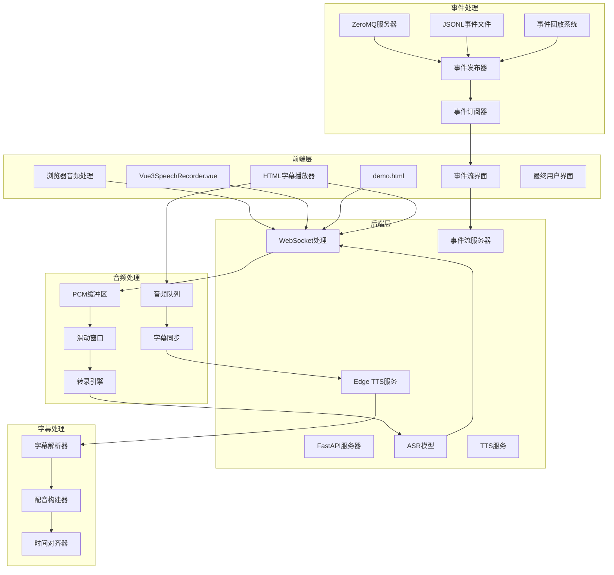

**图表来源**
- [server.py:124-196](file://server.py#L124-L196)
- [demo.html:486-564](file://demo.html#L486-L564)
- [subtitle_player.html:165-325](file://subtitle_player.html#L165-L325)
- [zmqserver.py:11-68](file://zmqserver.py#L11-L68)

**章节来源**
- [README.md:1-287](file://README.md#L1-L287)
- [requirements.txt:1-13](file://requirements.txt#L1-L13)

## 核心组件

### WebSocket实时识别服务

服务器端的WebSocket处理逻辑位于`server.py`文件中，实现了完整的实时音频处理管道：

- **二进制帧接收**：通过`websocket.receive()`接收客户端发送的PCM音频数据
- **缓冲区管理**：使用`bytearray`实现高效的音频缓冲区管理
- **滑动窗口算法**：基于时间间隔和音频长度的智能识别触发机制
- **异步处理**：利用Python asyncio实现非阻塞的音频处理

### HTML字幕播放器

新增的HTML字幕播放器提供了完整的多媒体播放体验：

- **WebSocket连接管理**：支持自动连接、状态指示和手动断开
- **音频队列播放器**：实现音频片段的队列管理和顺序播放
- **字幕同步显示**：精确控制字幕的显示时长和消失时机
- **字幕历史面板**：记录播放过的字幕历史，支持时间戳显示
- **状态指示器**：实时显示连接状态、音频播放状态等

### 增强的WebSocket音频流处理

WebSocket音频流处理得到显著增强：

- **音频消息类型**：支持`audio`和`subtitle`两种消息类型
- **音频完成通知**：客户端在音频播放完成后通知服务端
- **队列管理**：实现音频片段的排队播放，避免音频重叠
- **用户交互解锁**：处理浏览器的autoplay策略，等待用户点击解锁

### 实时事件处理系统

改进的实时事件处理系统支持更丰富的事件类型：

- **事件类型扩展**：支持音频事件和纯字幕事件的区分处理
- **历史记录**：维护字幕播放历史，支持时间戳和批次索引
- **状态反馈**：提供详细的播放状态反馈和错误处理
- **同步机制**：确保字幕与音频的精确同步播放

### ZMQ事件回放系统增强

**新增** 完整的ZMQ事件回放系统提供了强大的实时事件处理能力：

- **NDJSON事件文件**：支持标准的NDJSON格式事件文件回放
- **事件数据格式**：标准化的JSONL格式，支持动作和得分事件
- **事件发布和订阅**：基于PUB/SUB模式的事件发布和订阅机制
- **事件存储**：自动化的事件持久化和回放能力
- **实时监控**：提供事件处理的实时监控和状态反馈
- **多时间戳文件**：支持多个时间戳的事件文件，提供更全面的数据集

### ZMQ服务器增强

**新增** ZMQ服务器的增强功能提供了更灵活的消息处理模式：

- **--once参数**：支持消息播放后的优雅操作，播放完一遍后保持运行
- **循环播放控制**：通过args.once参数控制事件流的播放模式
- **服务保持运行**：在消息播放完成后继续保持服务运行状态
- **优雅退出机制**：提供Ctrl+C优雅退出支持

**章节来源**
- [server.py:124-196](file://server.py#L124-L196)
- [subtitle_player.html:165-325](file://subtitle_player.html#L165-L325)
- [demo.html:486-564](file://demo.html#L486-L564)
- [SpeechRecorder.vue:1-90](file://SpeechRecorder.vue#L1-L90)
- [zmqserver.py:11-68](file://zmqserver.py#L11-L68)
- [zmqtest.py:5-46](file://zmqtest.py#L5-L46)

## 架构概览

WebSocket实时处理的整体架构如下：

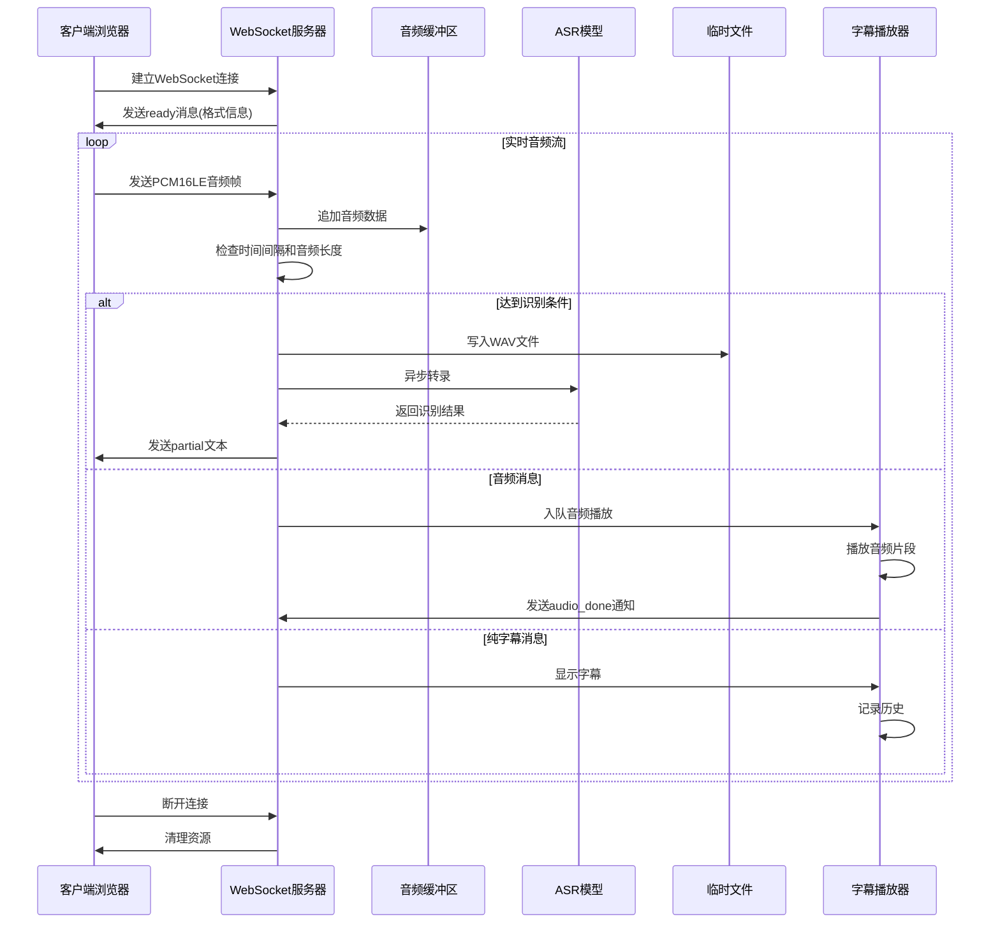

**图表来源**
- [server.py:124-196](file://server.py#L124-L196)
- [subtitle_player.html:265-297](file://subtitle_player.html#L265-L297)
- [demo.html:486-564](file://demo.html#L486-L564)

## 详细组件分析

### PCM16LE音频数据处理

#### 二进制帧接收和验证

服务器端通过以下方式处理PCM16LE音频数据：


**图表来源**
- [server.py:155-194](file://server.py#L155-L194)

#### 缓冲区管理策略

服务器端采用了高效的缓冲区管理策略：

1. **动态缓冲区**：使用`bytearray()`实现可变长度的音频缓冲区
2. **内存优化**：当缓冲区超过最大窗口大小时，采用切片操作进行内存重用
3. **字节序处理**：确保PCM数据的小端序格式正确

#### 滑动窗口算法实现

滑动窗口算法的关键参数和实现：

| 参数名称 | 默认值 | 说明 |
|---------|--------|------|
| `ASR_WS_DECODE_INTERVAL_S` | 1.2秒 | 解码间隔时间 |
| `ASR_WS_MAX_WINDOW_S` | 12秒 | 最大音频窗口大小 |
| `sample_rate` | 16000Hz | 采样率 |
| `bytes_per_second` | 32000字节 | 每秒字节数 |

窗口大小计算：
- 最大窗口字节数 = `max_window_s × sample_rate × 2`
- 最小触发长度 = `0.6 × bytes_per_second`

**章节来源**
- [server.py:134-166](file://server.py#L134-L166)

### 异步处理机制

#### 事件循环管理

服务器端使用Python asyncio实现非阻塞的音频处理：

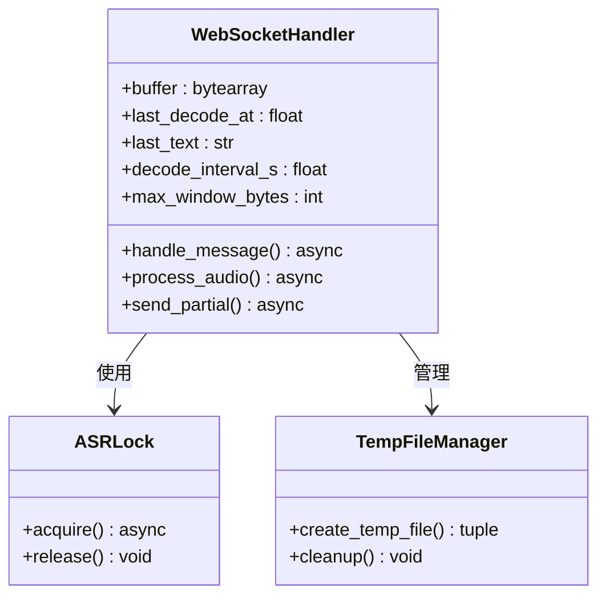

**图表来源**
- [server.py:97-98](file://server.py#L97-L98)
- [server.py:176-193](file://server.py#L176-L193)

#### 协程调度和资源清理

异步处理的关键实现：

1. **锁机制**：使用`asyncio.Lock()`确保ASR调用的互斥访问
2. **线程池**：通过`asyncio.to_thread()`将CPU密集型的ASR转录放到线程池执行
3. **资源清理**：在finally块中确保临时文件的正确删除

**章节来源**
- [server.py:178-193](file://server.py#L178-L193)

### 实时识别触发条件

#### 时间间隔控制

识别触发的严格时间控制机制：

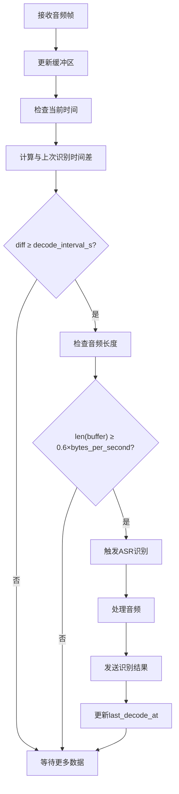

**图表来源**
- [server.py:167-174](file://server.py#L167-L174)

#### 音频长度阈值

音频长度阈值的设计考虑：

- **最小触发长度**：0.6秒的音频数据，确保有足够的上下文信息
- **窗口大小限制**：12秒的滑动窗口，平衡实时性和准确性
- **采样率标准**：16kHz的采样率，符合语音识别的标准要求

**章节来源**
- [server.py:171-172](file://server.py#L171-L172)

### 前端WebSocket连接管理

#### 浏览器端音频处理

前端JavaScript实现了完整的音频采集和WebSocket通信：

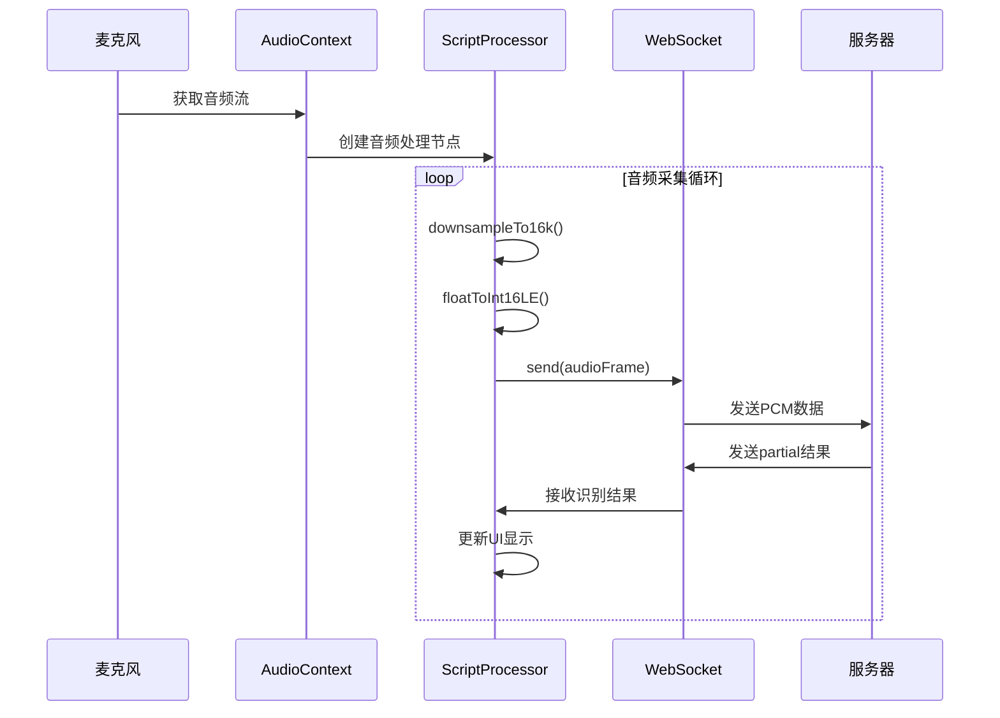

**图表来源**
- [demo.html:486-564](file://demo.html#L486-L564)
- [demo.html:460-484](file://demo.html#L460-L484)

#### 音频格式转换

前端实现了精确的音频格式转换：

1. **重采样**：将输入音频重采样到16kHz
2. **格式转换**：将Float32音频转换为Int16LE PCM格式
3. **二进制处理**：使用Int16Array进行高效的二进制数据处理

**章节来源**
- [demo.html:460-484](file://demo.html#L460-L484)

## HTML字幕播放器

### 字幕播放器架构

HTML字幕播放器提供了完整的多媒体播放体验：

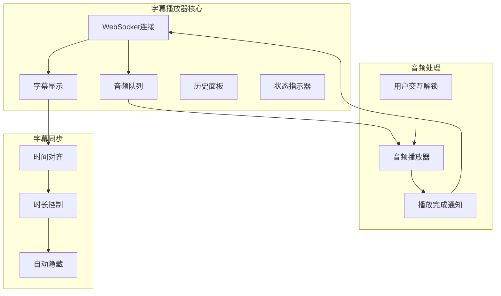

**图表来源**
- [subtitle_player.html:165-325](file://subtitle_player.html#L165-L325)

### 音频队列播放器

音频队列播放器实现了智能的音频管理：

- **队列管理**：使用`audioQueue`数组管理待播放的音频片段
- **播放状态跟踪**：通过`isPlaying`标志防止重复播放
- **用户交互解锁**：处理浏览器的autoplay策略，等待用户点击解锁
- **播放完成回调**：音频播放结束后自动播放下一个队列项

### 字幕同步机制

字幕同步机制确保字幕与音频的精确匹配：

- **时间戳对齐**：根据音频片段的持续时间控制字幕显示时长
- **自动隐藏**：字幕在显示指定时间后自动隐藏
- **同步显示**：音频实际开始播放时才显示对应的字幕
- **历史记录**：记录播放过的字幕，支持时间戳显示

### 状态指示器

状态指示器提供实时的系统状态反馈：

- **连接状态**：通过颜色和图标显示WebSocket连接状态
- **音频播放状态**：显示当前播放的音频批次索引
- **用户交互状态**：提示用户点击以启用音频播放
- **错误状态**：显示音频播放错误信息

**章节来源**
- [subtitle_player.html:165-325](file://subtitle_player.html#L165-L325)

## 增强的WebSocket音频流处理

### 消息类型扩展

WebSocket音频流处理支持多种消息类型：

- **音频消息** (`type: 'audio'`)：包含音频URL、文本内容、批次索引和持续时间
- **字幕消息** (`type: 'subtitle'`)：包含纯字幕文本和显示时长
- **连接状态**：WebSocket连接建立和断开的通知
- **事件消息** (`type: 'events'`)：批量事件数据，包含批次索引和事件列表
- **解说消息** (`type: 'narration'`)：实时解说内容，与事件数据关联
- **日志消息** (`type: 'log'`)：系统日志信息，支持标签分类

### 音频完成通知机制

音频完成通知机制确保系统状态的一致性：

- **播放完成检测**：音频播放结束后触发`onended`事件
- **批次索引传递**：通知服务端具体的音频批次索引
- **状态清理**：重置播放状态，准备播放下一个音频片段
- **队列推进**：自动播放队列中的下一个音频片段

### 用户交互处理

处理浏览器的autoplay策略：

- **首次用户点击**：等待用户点击解锁音频播放
- **播放失败处理**：处理autoplay被阻止的情况
- **队列回退**：将音频片段重新放入队列头部
- **状态提示**：向用户显示启用音频播放的提示

**章节来源**
- [subtitle_player.html:216-263](file://subtitle_player.html#L216-L263)
- [subtitle_player.html:265-297](file://subtitle_player.html#L265-L297)

## 实时事件处理系统

### 事件类型和数据结构

实时事件处理系统支持多种事件类型：

- **音频事件**：包含音频URL、文本内容、批次索引和持续时间
- **字幕事件**：包含纯字幕文本和显示时长
- **批次索引**：用于关联音频和字幕的批次信息
- **时间戳**：记录事件发生的时间信息
- **事件数据**：包含动作类型、置信度、玩家信息等详细内容

### 历史面板功能

历史面板提供事件播放历史的可视化：

- **历史记录**：记录所有播放过的字幕事件
- **时间戳显示**：显示事件发生时的视频时间
- **批次索引**：显示事件所属的音频批次
- **滚动查看**：支持垂直滚动查看历史记录
- **批次分隔**：按批次显示事件，便于追踪

### 同步播放机制

同步播放机制确保音频和字幕的精确同步：

- **音频优先**：音频实际开始播放时才显示字幕
- **时长控制**：根据音频持续时间控制字幕显示时长
- **自动清理**：字幕显示结束后自动隐藏
- **队列管理**：避免多个音频片段同时播放

**章节来源**
- [subtitle_player.html:208-214](file://subtitle_player.html#L208-L214)
- [subtitle_player.html:277-293](file://subtitle_player.html#L277-L293)

## ZMQ事件回放系统增强

### 事件流架构

**新增** 完整的ZMQ事件回放系统提供了强大的实时事件处理能力：

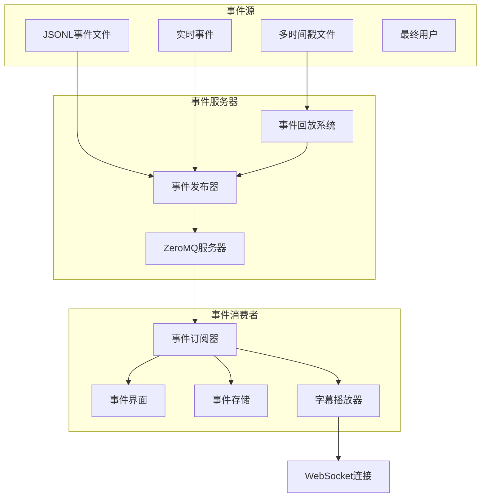

**图表来源**
- [zmqserver.py:11-68](file://zmqserver.py#L11-L68)
- [zmqtest.py:5-46](file://zmqtest.py#L5-L46)

### 事件数据格式

事件数据采用标准化的JSONL格式，每个事件包含以下关键字段：

- **schema_version**: 事件格式版本
- **event_id**: 唯一事件标识符
- **event_type**: 事件类型（action/score等）
- **frame_index/frame_number**: 帧索引和编号
- **time_seconds/time**: 时间戳信息
- **player**: 玩家信息（用户名、队伍、位置等）
- **action**: 动作信息（类型、置信度、关键点等）
- **score/ko**: 得分和K.O.相关信息

### 事件发布和订阅

#### 事件发布器

`zmqserver.py`实现了基于ZeroMQ的事件发布功能：

- **PUB/SUB模式**：使用PUB socket发布事件，SUB socket订阅事件
- **文件回放**：支持从JSONL文件逐行读取并发布事件
- **时间控制**：可配置事件发布的间隔时间
- **主题管理**：支持自定义事件主题
- **--once参数**：新增的消息播放后优雅操作支持

#### 事件订阅器

`zmqtest.py`提供了完整的事件订阅和存储功能：

- **SUB socket连接**：连接到ZeroMQ服务器订阅事件
- **JSONL存储**：将接收到的事件以JSONL格式存储到文件
- **实时显示**：在控制台实时显示接收到的事件
- **错误处理**：完善的异常处理和连接管理

### 事件处理流程

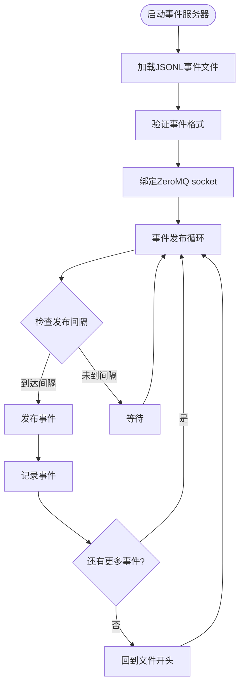

**图表来源**
- [zmqserver.py:50-60](file://zmqserver.py#L50-L60)

### 新增的ZMQ事件流文件

项目新增了多个ZMQ事件流JSONL文件，提供了更丰富的事件数据：

- **zmq_events_20260520_134352.jsonl**：完整的动作和得分事件数据
- **zmq_events_20260520_135655.jsonl**：包含早期和中期的比赛数据
- **zmq_events_20260520_164508.jsonl**：包含后期的精彩瞬间
- **zmq_events_20260520_173731.jsonl**：包含比赛结束后的统计数据
- **zmq_events.jsonl**：主事件文件，包含最完整的数据集

这些文件支持更丰富的事件类型，包括：
- **动作事件**：下蹲、抬手、抬手+下蹲等动作类型
- **得分事件**：红队和蓝队的得分记录
- **置信度信息**：动作识别的置信度评分
- **时间戳信息**：精确的动作发生时间
- **多时间戳支持**：支持不同时间段的数据回放

**章节来源**
- [zmqserver.py:11-68](file://zmqserver.py#L11-L68)
- [zmqtest.py:5-46](file://zmqtest.py#L5-L46)
- [zmq_events.jsonl:1-84](file://zmq_events.jsonl#L1-L84)
- [zmq_events_20260520_134352.jsonl:1-150](file://zmq_events_20260520_134352.jsonl#L1-L150)
- [zmq_events_20260520_135655.jsonl:1-79](file://zmq_events_20260520_135655.jsonl#L1-L79)
- [zmq_events_20260520_164508.jsonl:1-48](file://zmq_events_20260520_164508.jsonl#L1-L48)
- [zmq_events_20260520_173731.jsonl:1-56](file://zmq_events_20260520_173731.jsonl#L1-L56)

## ZMQ服务器增强

### --once参数功能

**新增** ZMQ服务器的--once参数为事件流播放提供了优雅的操作模式：

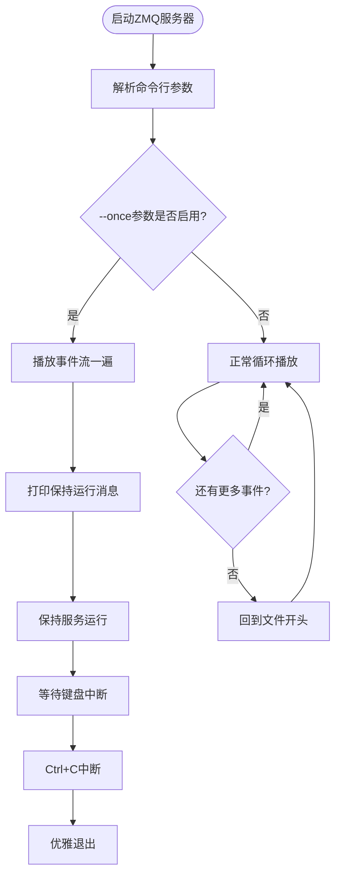

**图表来源**
- [zmqserver.py:22-26](file://zmqserver.py#L22-L26)
- [zmqserver.py:56-65](file://zmqserver.py#L56-L65)

### 消息播放后的优雅操作

当--once参数启用时，ZMQ服务器的行为发生了重要变化：

- **单次播放模式**：事件流播放完一遍后不会退出
- **服务保持运行**：继续保持ZeroMQ PUB socket运行状态
- **用户提示**：显示"所有消息已发送完毕，服务保持运行"提示
- **键盘中断支持**：通过Ctrl+C优雅退出服务
- **资源清理**：确保socket正确关闭和资源清理

### 命令行参数配置

ZMQ服务器的命令行参数配置：

| 参数 | 类型 | 默认值 | 说明 |
|------|------|--------|------|
| `--bind` | String | `"tcp://*:5557"` | PUB绑定地址 |
| `--topic` | String | `"hado.event"` | ZMQ主题 |
| `--input` | Path | `"zmq_events.jsonl"` | 输入JSONL事件文件路径 |
| `--interval` | Float | `1.0` | 两条消息之间的间隔（秒） |
| `--once` | Flag | `False` | 播放完一遍后退出；默认播完后从头循环 |

### 使用示例

**基本使用**：
```bash
python zmqserver.py
```

**启用单次播放模式**：
```bash
python zmqserver.py --once
```

**自定义参数**：
```bash
python zmqserver.py --input zmq_events.jsonl --once --interval 2.0
```

**章节来源**
- [zmqserver.py:11-68](file://zmqserver.py#L11-L68)
- [README.md:258-260](file://README.md#L258-L260)

## 依赖关系分析

### 核心依赖关系

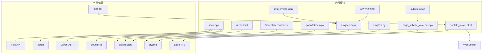

**图表来源**
- [requirements.txt:1-13](file://requirements.txt#L1-L13)
- [server.py:18-22](file://server.py#L18-L22)
- [zmqserver.py:8](file://zmqserver.py#L8)

### WebSocket连接生命周期

WebSocket连接的完整生命周期管理：

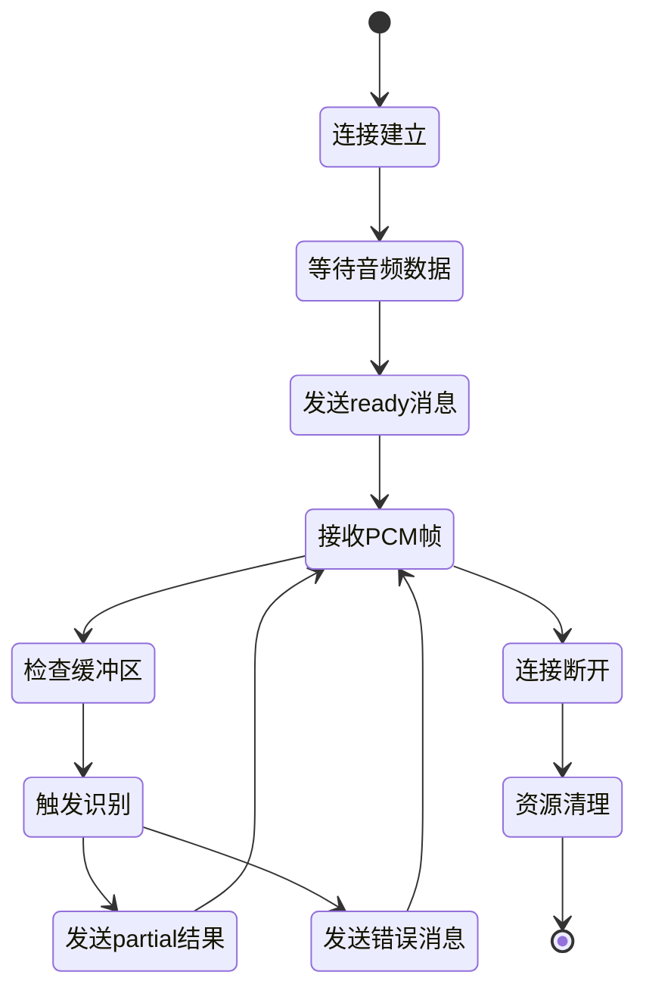

**图表来源**
- [server.py:124-196](file://server.py#L124-L196)

### ZeroMQ事件流生命周期

**新增** ZeroMQ事件流的完整生命周期管理：

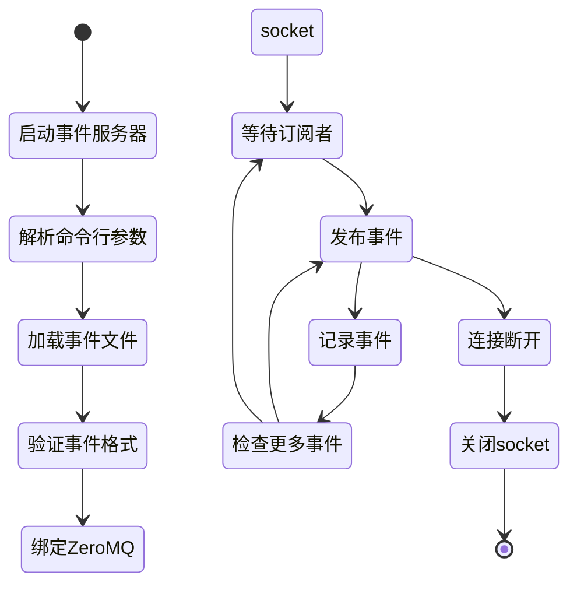

**图表来源**
- [zmqserver.py:11-68](file://zmqserver.py#L11-L68)

### 字幕播放器生命周期

字幕播放器的完整生命周期管理：

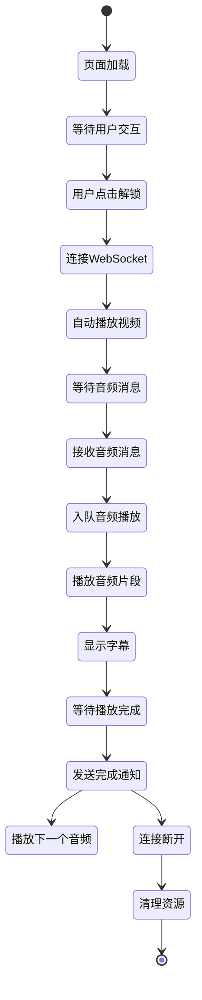

**图表来源**
- [subtitle_player.html:265-321](file://subtitle_player.html#L265-L321)

### 新增的ZMQ事件流生命周期

**新增** ZMQ事件流处理生命周期：

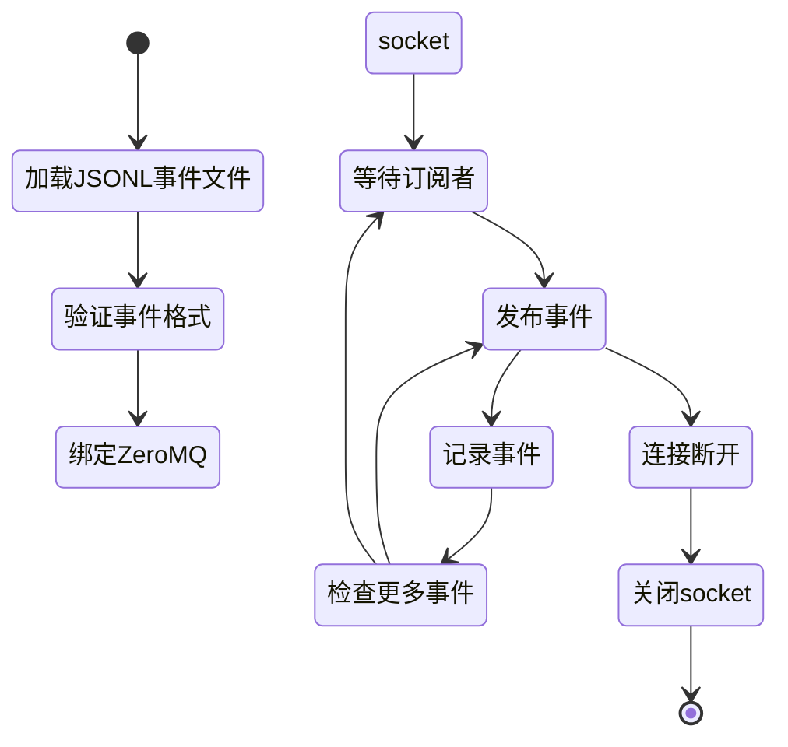

**图表来源**
- [zmqserver.py:11-68](file://zmqserver.py#L11-L68)

### ZMQ服务器增强生命周期

**新增** ZMQ服务器增强的生命周期管理：

```mermaid
stateDiagram-v2
[*] --> 启动事件服务器
启动事件服务器 --> 解析命令行参数
解析命令行参数 --> 加载事件文件
加载事件文件 --> 验证事件格式
验证事件格式 --> 绑定ZeroMQ socket
绑定ZeroMQ socket --> 等待订阅者
等待订阅者 --> 发布事件
发布事件 --> 记录事件
记录事件 --> 检查更多事件
CheckMore --> |是| 发布事件
CheckMore --> |否| CheckOnce{"--once参数启用?"}
CheckOnce --> |是| 保持运行
CheckOnce --> |否| 循环播放
保持运行 --> 等待键盘中断
等待键盘中断 --> Ctrl+C中断
Ctrl+C中断 --> 优雅退出
循环播放 --> 回到文件开头
回到文件开头 --> 发布事件
```

**图表来源**
- [zmqserver.py:50-65](file://zmqserver.py#L50-L65)

**章节来源**
- [requirements.txt:1-13](file://requirements.txt#L1-L13)

## 性能考虑

### 内存优化策略

1. **缓冲区重用**：使用切片操作`buffer[:] = buffer[-max_window_bytes:]`实现内存重用
2. **临时文件管理**：及时清理临时WAV文件，避免磁盘空间占用
3. **异步处理**：避免阻塞事件循环，提高并发处理能力
4. **ZeroMQ内存管理**：合理配置ZeroMQ socket的内存缓冲区
5. **音频队列优化**：限制队列长度，避免内存过度占用
6. **字幕历史管理**：限制历史面板的记录数量，控制内存使用
7. **事件流优化**：合理配置事件发布的间隔，避免内存过度占用
8. **--once参数优化**：在单次播放模式下避免重复内存分配
9. **多时间戳文件管理**：优化多个事件文件的内存使用和切换

### 处理延迟优化

1. **解码间隔调整**：通过环境变量`ASR_WS_DECODE_INTERVAL_S`调节识别频率
2. **窗口大小配置**：通过`ASR_WS_MAX_WINDOW_S`平衡实时性和准确性
3. **批量处理**：减少不必要的ASR调用次数
4. **事件发布间隔**：通过`--interval`参数控制事件发布的频率
5. **音频队列预加载**：提前加载下一个音频片段，减少播放延迟
6. **字幕同步优化**：精确计算字幕显示时长，避免延迟累积
7. **ZMQ事件流优化**：合理配置事件发布的间隔，避免网络拥塞
8. **--once模式优化**：在单次播放模式下优化内存使用
9. **多时间戳文件优化**：优化事件文件的加载和切换性能

### 并发处理能力

- **线程池隔离**：ASR处理在独立线程中执行，不影响WebSocket连接
- **锁机制保护**：确保多个并发连接的安全访问
- **资源池管理**：合理管理GPU/CPU资源的使用
- **ZeroMQ多路复用**：支持多个事件订阅者的并发处理
- **音频队列并发**：支持多个音频片段的并发播放管理
- **事件流并发**：支持多个事件消费者的并发处理
- **--once模式并发**：支持单次播放模式下的并发事件处理
- **多时间戳文件并发**：支持多个事件文件的并发处理和切换

### ZeroMQ性能优化

1. **socket配置**：合理设置ZeroMQ socket的linger、rcvbuf等参数
2. **事件批处理**：支持事件的批量发布和订阅
3. **连接池管理**：避免频繁的socket创建和销毁
4. **内存映射**：对于大型事件文件，考虑使用内存映射优化读取性能
5. **事件过滤**：支持按主题过滤事件，减少不必要的网络传输
6. **--once模式优化**：在单次播放模式下优化socket状态管理
7. **多时间戳文件优化**：优化多个事件文件的并发处理性能

### 字幕播放器性能优化

1. **音频预加载**：提前加载音频片段，减少播放等待时间
2. **字幕缓存**：缓存常用的字幕文本，减少DOM操作
3. **动画优化**：使用CSS3硬件加速优化字幕显示动画
4. **事件去抖**：对频繁的状态变化进行去抖处理
5. **内存回收**：及时清理不再使用的DOM元素和事件监听器
6. **日志优化**：限制日志数量，避免内存过度占用

### ZMQ服务器增强性能优化

1. **内存使用优化**：在--once模式下避免重复加载事件数据
2. **CPU使用优化**：在单次播放模式下减少CPU占用
3. **网络优化**：合理配置ZeroMQ socket参数，优化网络传输
4. **资源管理**：在优雅退出时确保资源正确释放
5. **错误处理优化**：在--once模式下提供更好的错误处理机制
6. **多时间戳文件优化**：优化多个事件文件的内存使用和切换性能

## 故障排除指南

### 常见问题及解决方案

#### WebSocket连接问题

| 问题现象 | 可能原因 | 解决方案 |
|---------|---------|---------|
| 连接超时 | 网络延迟或防火墙 | 检查网络连接，调整超时设置 |
| 连接中断 | 客户端异常退出 | 实现重连机制，增加心跳检测 |
| 数据传输错误 | 音频格式不匹配 | 确保使用16kHz PCM格式 |
| 音频播放失败 | autoplay被阻止 | 等待用户交互解锁，使用队列回退机制 |
| 消息类型错误 | 事件类型不支持 | 检查WebSocket消息类型，确保支持的类型 |

#### 音频处理问题

| 问题现象 | 可能原因 | 解决方案 |
|---------|---------|---------|
| 识别准确率低 | 音频质量差 | 检查麦克风设置，改善录音环境 |
| 延迟过高 | 处理能力不足 | 增加解码间隔，优化模型配置 |
| 内存泄漏 | 资源清理不当 | 检查临时文件清理逻辑 |
| 音频重叠 | 队列管理不当 | 检查播放状态标志和队列长度限制 |
| 音频完成通知丢失 | 事件监听器未正确移除 | 检查组件卸载时的清理逻辑 |

#### ZeroMQ事件流问题

| 问题现象 | 可能原因 | 解决方案 |
|---------|---------|---------|
| 事件丢失 | 订阅者连接过晚 | 增加订阅等待时间，使用历史事件回放 |
| 性能下降 | 事件发布过快 | 调整发布间隔，优化事件处理逻辑 |
| 内存溢出 | 事件积压过多 | 实现事件队列限流，定期清理旧事件 |
| 连接失败 | ZeroMQ库未安装 | 安装pyzmq库，检查ZeroMQ服务状态 |
| 事件格式错误 | JSONL文件格式不正确 | 验证事件文件格式，修复格式错误 |
| 主题不匹配 | 事件主题配置错误 | 检查ZeroMQ主题配置，确保发布和订阅一致 |
| --once模式异常 | 参数配置错误 | 检查--once参数使用，确保正确的播放模式 |
| 多时间戳文件问题 | 文件加载失败 | 检查文件路径和权限，验证文件完整性 |

#### 字幕播放器问题

| 问题现象 | 可能原因 | 解决方案 |
|---------|---------|---------|
| 字幕不同步 | 时间计算错误 | 检查音频持续时间和字幕显示时长计算 |
| 播放卡顿 | 队列处理延迟 | 优化音频预加载和队列管理逻辑 |
| 历史记录过多 | 内存占用过大 | 限制历史面板的记录数量 |
| 状态显示异常 | 事件监听器未正确移除 | 检查组件卸载时的清理逻辑 |
| 日志过多 | 内存占用过大 | 限制日志数量，实现日志轮换机制 |

#### ZMQ服务器增强问题

| 问题现象 | 可能原因 | 解决方案 |
|---------|---------|---------|
| --once参数无效 | 参数未正确传递 | 检查命令行参数解析，确保--once正确传递 |
| 服务无法退出 | Ctrl+C中断无效 | 检查键盘中断处理，确保优雅退出机制 |
| 内存使用异常 | 单次播放模式内存泄漏 | 检查--once模式下的内存管理逻辑 |
| 性能问题 | 单次播放模式效率低下 | 优化--once模式下的事件处理逻辑 |
| 事件丢失 | 单次播放模式事件未正确处理 | 检查事件处理逻辑，确保事件正确发布 |
| 多时间戳文件加载问题 | 文件路径错误 | 检查文件路径配置，验证文件存在性 |

#### 性能优化建议

1. **监控指标**：记录音频处理延迟、内存使用情况、事件处理速率
2. **日志记录**：详细记录错误信息和性能数据
3. **资源监控**：监控GPU/CPU使用率，避免过载
4. **事件流监控**：监控ZeroMQ socket的状态和消息队列长度
5. **字幕播放监控**：监控音频队列长度和播放状态
6. **用户交互监控**：监控autoplay策略的触发和处理
7. **WebSocket监控**：监控连接状态和消息处理性能
8. **--once模式监控**：监控单次播放模式下的性能表现
9. **多时间戳文件监控**：监控多个事件文件的加载和切换性能

**章节来源**
- [README.md:194-204](file://README.md#L194-L204)

## 结论

Vue3Speech的WebSocket实时处理功能提供了一个完整的、生产级别的语音识别解决方案。通过精心设计的滑动窗口算法、高效的缓冲区管理和严格的异步处理机制，实现了低延迟、高准确率的实时语音识别。

**新增的HTML字幕播放器**进一步增强了系统的多媒体展示能力，提供了完整的音频与字幕同步播放功能。该播放器支持音频队列管理、字幕历史记录、状态指示等特性，为用户提供流畅的多媒体体验。

**增强的WebSocket音频流处理**支持多种消息类型，包括音频事件和字幕事件，实现了更灵活的实时内容分发。音频完成通知机制确保系统状态的一致性，而用户交互处理则解决了现代浏览器的autoplay策略问题。

**改进的实时事件处理系统**集成了字幕历史面板和状态指示器，提供了更好的用户体验和系统监控能力。结合原有的ZeroMQ事件流处理能力，该系统能够支持复杂的实时事件驱动应用场景。

**ZMQ事件回放系统重大增强**为项目引入了全新的实时事件驱动架构，支持NDJSON事件文件回放、ZMQ PUB/SUB模式、事件存储和回放能力，以及多时间戳的事件文件支持。多个时间戳的事件文件为系统提供了更全面的数据支持，包括早期数据、完整数据和不同时间线的数据。

**ZMQ服务器增强**为项目引入了重要的新功能，--once参数为事件流播放提供了优雅的操作模式。在单次播放模式下，事件流播放完一遍后不会退出，而是保持服务运行状态，直到用户通过Ctrl+C优雅退出。这一增强为实时事件驱动应用提供了更灵活的消息处理模式，特别是在需要保持服务长期运行的场景中。

**多时间戳事件文件系统**为项目提供了更丰富的事件数据支持，支持从比赛开始到结束的完整数据流，以及不同时间段的精选数据。这种设计使得系统能够支持更复杂的实时事件驱动应用，包括数据分析、回放系统和实时监控等场景。

关键技术特点包括：

1. **精确的音频格式处理**：确保PCM16LE格式的正确传输和处理
2. **智能的滑动窗口算法**：平衡实时性和识别准确性
3. **高效的异步处理**：利用Python asyncio实现非阻塞的音频处理
4. **完善的资源管理**：确保内存和临时文件的正确清理
5. **灵活的配置选项**：通过环境变量实现参数的动态调整
6. **强大的事件流处理**：基于ZeroMQ的实时事件发布和订阅
7. **标准化的事件格式**：统一的JSONL事件数据格式
8. **可靠的事件存储**：自动化的事件持久化和回放能力
9. **多媒体同步播放**：精确的音频与字幕同步机制
10. **用户交互优化**：处理现代浏览器的autoplay策略
11. **状态监控系统**：提供详细的系统状态反馈
12. **历史记录管理**：支持事件和字幕的历史追踪
13. **丰富的事件类型**：支持动作、得分等多种事件类型
14. **高性能的事件流**：支持高并发的事件处理和分发
15. **优雅的单次播放模式**：--once参数提供灵活的消息处理模式
16. **完善的错误处理**：支持各种异常情况的优雅处理
17. **多时间戳数据支持**：支持从不同时间段的数据回放
18. **内存优化策略**：针对多文件场景的内存使用优化
19. **并发处理能力**：支持多事件文件的并发处理
20. **性能监控系统**：提供完整的性能监控和诊断能力

该系统为构建高质量的实时语音应用和事件驱动应用提供了坚实的基础，可以进一步扩展以支持更多的音频格式、优化识别模型、增强事件处理能力和完善监控功能。新增的字幕播放器功能、ZMQ事件流处理、--once参数功能和多时间戳事件文件系统特别适用于视频内容的实时字幕生成和播放场景，为多媒体应用开发提供了完整的解决方案。

**WebSocket服务实现状态变更**意味着项目的WebSocket功能得到了进一步的完善和优化，为用户提供更加稳定和高效的实时语音处理体验。结合ZMQ服务器增强功能和多时间戳事件文件系统，Vue3Speech项目为现代多媒体应用开发提供了强大而灵活的技术基础。