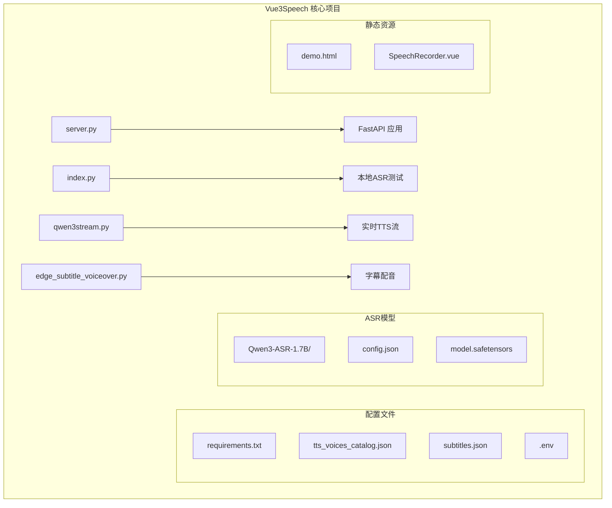
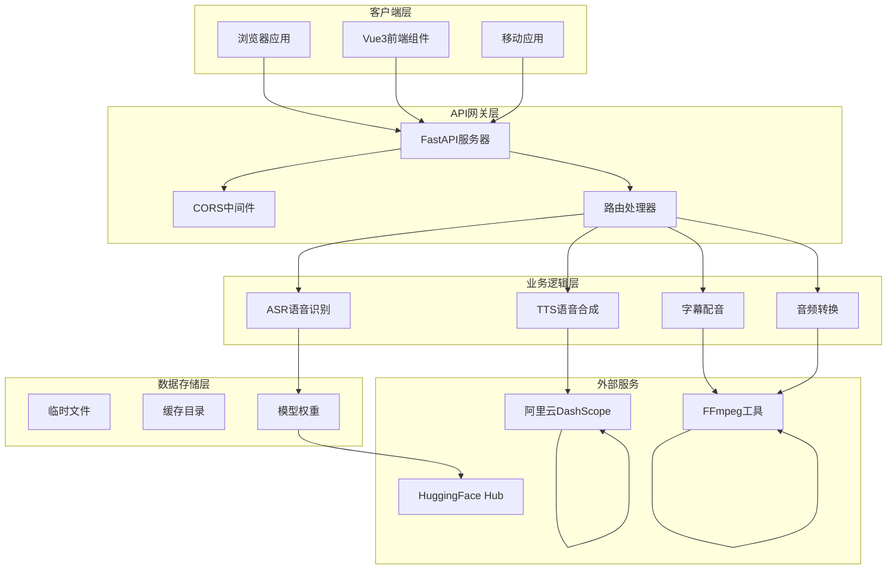
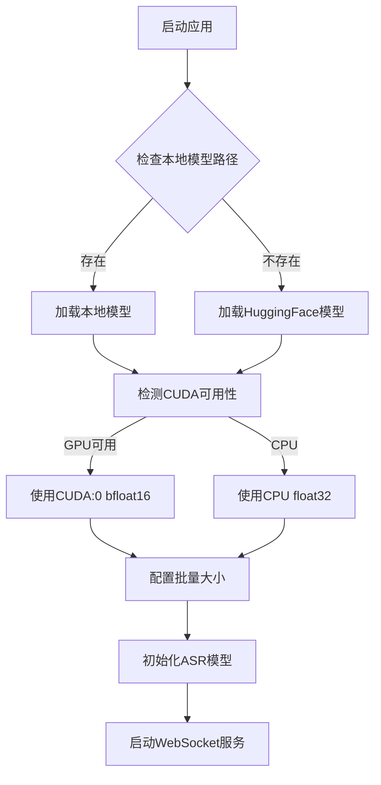
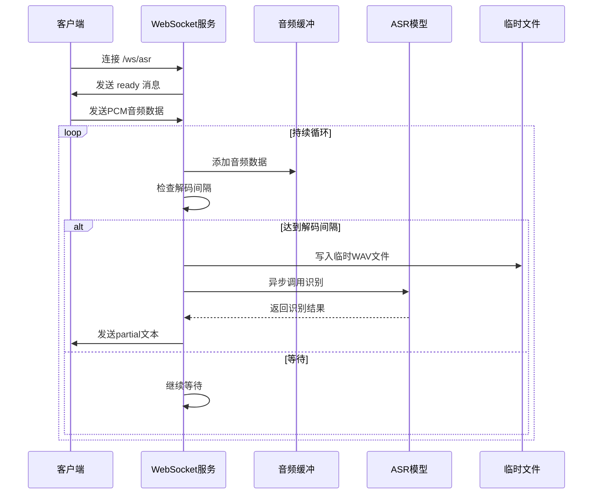
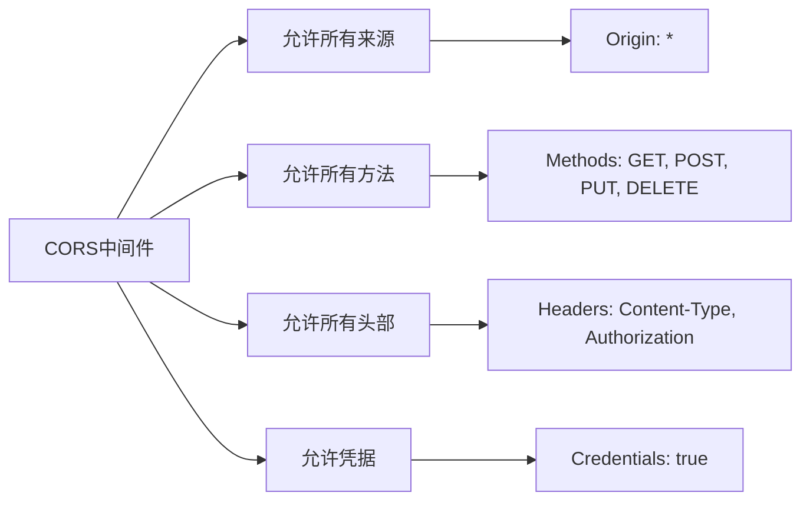
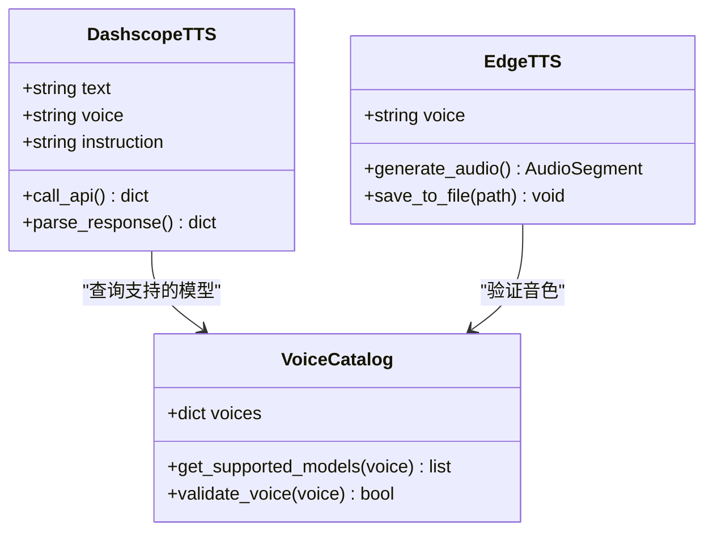
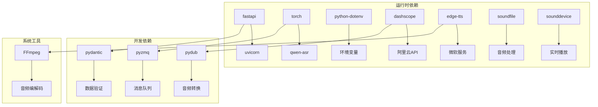

# 后端服务架构

<cite>
**本文档引用的文件**
- [server.py](file://server.py)
- [index.py](file://index.py)
- [qwen3stream.py](file://qwen3stream.py)
- [edge_subtitle_voiceover.py](file://edge_subtitle_voiceover.py)
- [requirements.txt](file://requirements.txt)
- [README.md](file://README.md)
- [tts_voices_catalog.json](file://tts_voices_catalog.json)
- [subtitles.json](file://subtitles.json)
- [Qwen3-ASR-1.7B/config.json](file://Qwen3-ASR-1.7B/config.json)
- [demo.html](file://demo.html)
</cite>

## 目录
1. [简介](#简介)
2. [项目结构](#项目结构)
3. [核心组件](#核心组件)
4. [架构概览](#架构概览)
5. [详细组件分析](#详细组件分析)
6. [依赖关系分析](#依赖关系分析)
7. [性能考虑](#性能考虑)
8. [故障排除指南](#故障排除指南)
9. [结论](#结论)

## 简介

Vue3Speech是一个基于Vue3前端和FastAPI后端的语音应用系统，集成了Qwen3-ASR语音识别模型和阿里云DashScope TTS语音合成服务。该系统提供了完整的语音处理能力，包括音频上传识别、WebSocket实时流式识别、语音合成以及字幕配音等功能。

系统采用现代化的微服务架构，通过FastAPI提供RESTful API接口，结合WebSocket实现实时音频处理，支持多种音频格式转换和高质量的语音合成输出。

## 项目结构

**图表来源**
- [server.py:1-452](file://server.py#L1-L452)
- [requirements.txt:1-13](file://requirements.txt#L1-L13)

**章节来源**
- [README.md:5-19](file://README.md#L5-L19)
- [server.py:67-67](file://server.py#L67-L67)

## 核心组件

### FastAPI应用架构

系统的核心是基于FastAPI构建的Web服务，采用了现代化的异步编程模式和中间件配置：

- **应用实例**: 创建FastAPI应用实例，配置CORS中间件
- **模型管理**: 动态加载Qwen3-ASR模型，支持本地路径和HuggingFace Hub两种模式
- **路由系统**: 提供RESTful API和WebSocket接口
- **异步处理**: 使用asyncio实现高性能并发处理

### ASR模型集成

系统集成了Qwen3-ASR 1.7B语音识别模型，支持多种设备配置：

- **设备映射**: 自动检测CUDA可用性，优先使用GPU加速
- **数据类型**: 支持bfloat16半精度计算，提升推理速度
- **批量处理**: 配置最大推理批量大小，平衡内存使用和吞吐量
- **语言支持**: 支持40+种语言的语音识别

### WebSocket实时识别

实现了基于滑动窗口的准实时语音识别系统：

- **音频格式**: 支持16kHz单声道PCM音频流
- **缓冲策略**: 实现动态滑动窗口，避免内存溢出
- **解码间隔**: 可配置的识别间隔，平衡延迟和准确性
- **并发控制**: 使用锁机制确保模型调用的线程安全

**章节来源**
- [server.py:88-95](file://server.py#L88-L95)
- [server.py:124-197](file://server.py#L124-L197)
- [index.py:4-11](file://index.py#L4-L11)

## 架构概览

**图表来源**
- [server.py:67-67](file://server.py#L67-L67)
- [server.py:88-95](file://server.py#L88-L95)
- [server.py:124-197](file://server.py#L124-L197)

## 详细组件分析

### ASR模型初始化与配置

系统实现了智能的模型加载机制，支持灵活的部署选项：

**图表来源**
- [server.py:88-95](file://server.py#L88-L95)
- [server.py:78-81](file://server.py#L78-L81)

#### 设备选择策略

系统采用智能的设备选择算法：

- **GPU优先**: 自动检测CUDA可用性，优先使用GPU加速
- **内存优化**: 根据设备能力调整批量大小，避免OOM错误
- **精度适配**: GPU使用bfloat16，CPU使用float32确保稳定性

#### 性能优化配置

- **批量大小**: 最大推理批量大小设置为32，平衡吞吐量和内存使用
- **最大生成长度**: 设置为256个token，支持较长音频输入
- **半精度计算**: 在支持的设备上使用bfloat16提升计算速度

**章节来源**
- [server.py:78-95](file://server.py#L78-L95)
- [index.py:4-11](file://index.py#L4-L11)

### WebSocket实时识别实现

WebSocket接口实现了准实时的语音识别功能：

**图表来源**
- [server.py:124-197](file://server.py#L124-L197)

#### 滑动窗口算法

系统实现了高效的滑动窗口算法：

- **窗口大小**: 默认12秒，可根据需求调整
- **缓冲策略**: 当缓冲区超过窗口大小时，丢弃最早的数据
- **最小长度**: 至少需要0.6秒的音频才能进行识别
- **解码间隔**: 默认1.2秒，避免过于频繁的模型调用

#### 异步处理机制

- **线程池**: 使用`asyncio.to_thread`执行阻塞的ASR调用
- **锁机制**: `_asr_lock`确保模型调用的互斥访问
- **异常处理**: 完善的错误捕获和用户反馈机制

**章节来源**
- [server.py:124-197](file://server.py#L124-L197)

### CORS中间件配置

系统配置了灵活的跨域资源共享策略：

**图表来源**
- [server.py:69-76](file://server.py#L69-L76)

#### 跨域策略说明

- **完全开放**: 默认允许来自任何来源的请求
- **方法兼容**: 支持所有HTTP方法
- **头部灵活**: 允许自定义请求头
- **凭据支持**: 支持携带认证信息的请求

**章节来源**
- [server.py:69-76](file://server.py#L69-L76)

### TTS语音合成服务

系统提供了多种语音合成能力：

#### DashScope TTS集成

**图表来源**
- [server.py:212-247](file://server.py#L212-L247)
- [tts_voices_catalog.json:1-54](file://tts_voices_catalog.json#L1-L54)

#### 字幕配音功能

系统实现了精确的时间轴对齐字幕配音：

- **时间对齐**: 根据字幕的开始和结束时间精确对齐
- **变速处理**: 使用FFmpeg的atempo滤镜调整音频速度
- **静音插入**: 在字幕间隙插入适当的静音
- **质量保证**: 保持音高不变的变速效果

**章节来源**
- [server.py:300-321](file://server.py#L300-L321)
- [edge_subtitle_voiceover.py:166-223](file://edge_subtitle_voiceover.py#L166-L223)

## 依赖关系分析

### 核心依赖关系

**图表来源**
- [requirements.txt:1-13](file://requirements.txt#L1-L13)

### 模块间交互

系统采用模块化设计，各组件职责明确：

- **server.py**: 主应用入口，负责路由和业务逻辑协调
- **edge_subtitle_voiceover.py**: 字幕配音核心逻辑，支持API和离线脚本复用
- **qwen3stream.py**: DashScope实时TTS流处理
- **index.py**: 本地ASR测试和模型验证

**章节来源**
- [requirements.txt:1-13](file://requirements.txt#L1-L13)
- [server.py:18-31](file://server.py#L18-L31)

## 性能考虑

### 内存管理

系统实现了完善的内存管理策略：

- **临时文件清理**: 自动清理识别过程中的临时WAV文件
- **缓冲区限制**: 滑动窗口限制音频缓冲区大小
- **批量处理**: 控制ASR模型的批量大小，避免内存溢出

### 并发处理

- **异步I/O**: 使用asyncio处理WebSocket连接
- **线程池**: 将阻塞的ASR调用放入线程池执行
- **锁机制**: 确保模型调用的线程安全

### 网络优化

- **CORS配置**: 灵活的跨域策略，支持开发和生产环境
- **静态文件**: 提供静态文件服务，减少API负载
- **缓存策略**: 字幕配音结果的文件缓存机制

## 故障排除指南

### 常见问题及解决方案

| 问题类型 | 症状 | 解决方案 |
|---------|------|----------|
| 模型加载失败 | 启动时报错，无法加载ASR模型 | 检查ASR_MODEL_PATH配置，确保包含完整的模型文件 |
| CUDA内存不足 | GPU内存溢出错误 | 降低max_inference_batch_size，使用CPU模式 |
| WebSocket连接失败 | 客户端无法连接到/ws/asr | 检查防火墙设置，确认端口开放 |
| FFmpeg找不到 | 转码失败，提示找不到ffmpeg | 在.env中设置FFMPEG_PATH，确保ffmpeg.exe在PATH中 |
| CORS错误 | 跨域请求被阻止 | 检查CORS配置，生产环境建议限制特定来源 |

### 环境变量配置

系统支持多种环境变量配置：

- **DASHSCOPE_API_KEY**: 阿里云DashScope API密钥
- **ASR_MODEL_PATH**: 本地ASR模型路径
- **FFMPEG_PATH**: FFmpeg可执行文件路径
- **ASR_WS_DECODE_INTERVAL_S**: WebSocket解码间隔（秒）
- **ASR_WS_MAX_WINDOW_S**: 最大滑动窗口（秒）

**章节来源**
- [README.md:48-83](file://README.md#L48-L83)
- [server.py:427-431](file://server.py#L427-L431)

## 结论

Vue3Speech后端服务展现了现代语音处理系统的最佳实践：

### 技术优势

- **模块化设计**: 清晰的组件分离，便于维护和扩展
- **异步架构**: 高性能的并发处理能力
- **灵活部署**: 支持多种部署模式和配置选项
- **完整生态**: 集成了从语音识别到合成的完整工具链

### 架构特点

- **可扩展性**: 支持水平扩展和垂直扩展
- **可靠性**: 完善的错误处理和恢复机制
- **易用性**: 简洁的API设计和丰富的示例代码
- **性能**: 针对GPU和CPU的优化配置

该系统为语音应用开发提供了坚实的基础，可以作为企业级语音处理平台的核心组件，支持各种语音识别和合成场景的应用开发。