# 后端服务架构

<cite>
**本文档引用的文件**
- [server.py](file://server.py)
- [index.py](file://index.py)
- [qwen3stream.py](file://qwen3stream.py)
- [edge_subtitle_voiceover.py](file://edge_subtitle_voiceover.py)
- [requirements.txt](file://requirements.txt)
- [README.md](file://README.md)
- [tts_voices_catalog.json](file://tts_voices_catalog.json)
- [subtitles.json](file://subtitles.json)
- [Qwen3-ASR-1.7B/config.json](file://Qwen3-ASR-1.7B/config.json)
- [demo.html](file://demo.html)
- [kokoserver.py](file://kokoserver.py)
- [kokoro_model/config.json](file://kokoro_model/config.json)
- [kokoro_model/README.md](file://kokoro_model/README.md)
- [kokoro_model/VOICES.md](file://kokoro_model/VOICES.md)
- [kokoro_model/SAMPLES.md](file://kokoro_model/SAMPLES.md)
- [qwen-to-data7.py](file://qwen-to-data7.py)
</cite>

## 更新摘要
**变更内容**
- 新增Kokoro TTS服务架构分析，包含完整的FastAPI服务设计
- 增强TTS后端集成能力，支持多后端统一接口
- 新增Kokoro模型的本地/远程加载机制
- 扩展语音合成服务的多平台支持
- 更新WebSocket实时识别的架构图和实现细节
- 新增SSE流式合成的详细实现说明
- **重大更新**：kokoserver.py完全重构，新增本地模型管理、环境变量配置、自动下载HuggingFace模型、智能音色解析等功能
- **新增**：完整的 kokoro_model 目录结构文档，包含 config.json、voices、samples、eval等目录
- **新增**：Kokoro TTS服务的环境变量配置和部署指南

## 目录
1. [简介](#简介)
2. [项目结构](#项目结构)
3. [核心组件](#核心组件)
4. [架构概览](#架构概览)
5. [详细组件分析](#详细组件分析)
6. [Kokoro TTS服务架构](#kokoro-tts服务架构)
7. [多后端统一接口设计](#多后端统一接口设计)
8. [依赖关系分析](#依赖关系分析)
9. [性能考虑](#性能考虑)
10. [故障排除指南](#故障排除指南)
11. [结论](#结论)

## 简介

Vue3Speech是一个基于Vue3前端和FastAPI后端的现代化语音应用系统，集成了多种先进的语音处理技术。系统不仅支持Qwen3-ASR语音识别模型和阿里云DashScope TTS语音合成服务，还新增了Kokoro TTS服务架构，提供了完整的多后端统一接口。

该系统采用微服务架构设计，通过FastAPI提供RESTful API接口，结合WebSocket实现实时音频处理，支持多种音频格式转换和高质量的语音合成输出。系统现已支持四种主要的TTS后端：阿里云DashScope、Microsoft Edge TTS、Kokoro中文语音合成和实时DashScope TTS，为不同语言和应用场景提供最优的语音合成解决方案。

**重大更新**：kokoserver.py经过完全重构，现在提供了完整的Kokoro TTS服务，包括本地模型管理、智能音色解析、SSE流式合成等高级功能。

## 项目结构

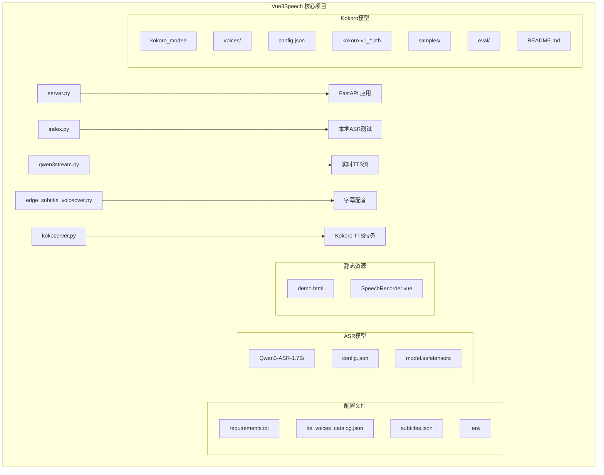

**图表来源**
- [server.py:67-67](file://server.py#L67-L67)
- [requirements.txt:1-13](file://requirements.txt#L1-L13)
- [kokoserver.py:1-240](file://kokoserver.py#L1-L240)

**章节来源**
- [README.md:5-19](file://README.md#L5-L19)
- [server.py:67-67](file://server.py#L67-L67)
- [kokoserver.py:24-25](file://kokoserver.py#L24-L25)

## 核心组件

### FastAPI应用架构

系统的核心是基于FastAPI构建的Web服务，采用了现代化的异步编程模式和中间件配置：

- **应用实例**: 创建FastAPI应用实例，配置CORS中间件
- **模型管理**: 动态加载Qwen3-ASR模型，支持本地路径和HuggingFace Hub两种模式
- **路由系统**: 提供RESTful API和WebSocket接口
- **异步处理**: 使用asyncio实现高性能并发处理

### 多后端TTS集成

系统实现了统一的TTS后端接口，支持四种不同的语音合成服务：

- **阿里云DashScope**: 支持多语言、多音色的高质量TTS
- **Microsoft Edge TTS**: 提供自然流畅的英文语音合成
- **Kokoro TTS**: 专为中国中文场景优化的高质量语音合成，现已支持本地模型管理和智能音色解析
- **实时DashScope TTS**: 通过WebSocket提供流式语音合成

### ASR模型集成

系统集成了Qwen3-ASR 1.7B语音识别模型，支持多种设备配置：

- **设备映射**: 自动检测CUDA可用性，优先使用GPU加速
- **数据类型**: 支持bfloat16半精度计算，提升推理速度
- **批量处理**: 配置最大推理批量大小，平衡内存使用和吞吐量
- **语言支持**: 支持40+种语言的语音识别

### WebSocket实时识别

实现了基于滑动窗口的准实时语音识别系统：

- **音频格式**: 支持16kHz单声道PCM音频流
- **缓冲策略**: 实现动态滑动窗口，避免内存溢出
- **解码间隔**: 可配置的识别间隔，平衡延迟和准确性
- **并发控制**: 使用锁机制确保模型调用的线程安全

### Kokoro TTS服务

**重大更新**：新增了完整的Kokoro TTS服务，提供以下核心功能：

- **本地模型管理**: 支持本地模型文件的自动检测和加载
- **智能音色解析**: 支持本地音色文件和远程音色下载
- **SSE流式合成**: 提供实时进度反馈和状态更新
- **环境变量配置**: 支持KOKORO_*系列环境变量配置
- **静态文件服务**: 自动挂载/static目录提供文件访问

**章节来源**
- [server.py:88-95](file://server.py#L88-L95)
- [server.py:124-197](file://server.py#L124-L197)
- [index.py:4-11](file://index.py#L4-L11)
- [kokoserver.py:158-169](file://kokoserver.py#L158-L169)

## 架构概览

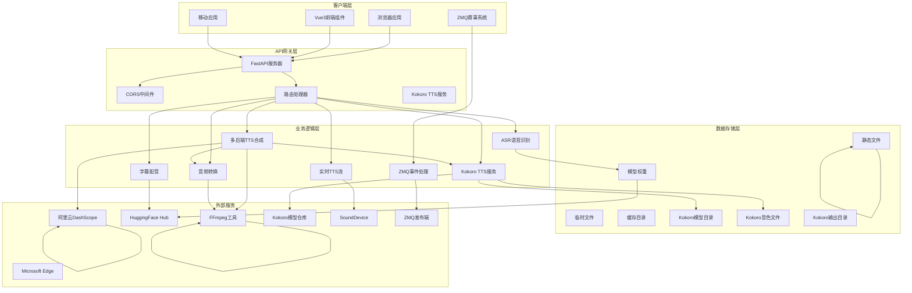

**图表来源**
- [server.py:67-67](file://server.py#L67-L67)
- [server.py:88-95](file://server.py#L88-L95)
- [server.py:124-197](file://server.py#L124-L197)
- [kokoserver.py:158-169](file://kokoserver.py#L158-L169)

## 详细组件分析

### ASR模型初始化与配置

系统实现了智能的模型加载机制，支持灵活的部署选项：

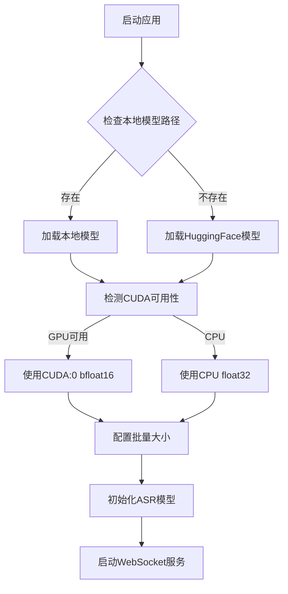

**图表来源**
- [server.py:88-95](file://server.py#L88-L95)
- [server.py:78-81](file://server.py#L78-L81)

#### 设备选择策略

系统采用智能的设备选择算法：

- **GPU优先**: 自动检测CUDA可用性，优先使用GPU加速
- **内存优化**: 根据设备能力调整批量大小，避免OOM错误
- **精度适配**: GPU使用bfloat16，CPU使用float32确保稳定性

#### 性能优化配置

- **批量大小**: 最大推理批量大小设置为32，平衡吞吐量和内存使用
- **最大生成长度**: 设置为256个token，支持较长音频输入
- **半精度计算**: 在支持的设备上使用bfloat16提升计算速度

**章节来源**
- [server.py:78-95](file://server.py#L78-L95)
- [index.py:4-11](file://index.py#L4-L11)

### WebSocket实时识别实现

WebSocket接口实现了准实时的语音识别功能：

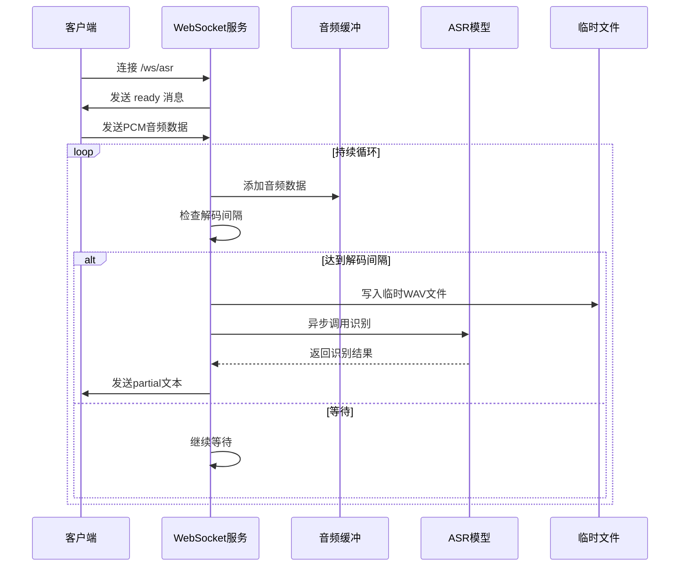

**图表来源**
- [server.py:124-197](file://server.py#L124-L197)

#### 滑动窗口算法

系统实现了高效的滑动窗口算法：

- **窗口大小**: 默认12秒，可根据需求调整
- **缓冲策略**: 当缓冲区超过窗口大小时，丢弃最早的数据
- **最小长度**: 至少需要0.6秒的音频才能进行识别
- **解码间隔**: 默认1.2秒，避免过于频繁的模型调用

#### 异步处理机制

- **线程池**: 使用`asyncio.to_thread`执行阻塞的ASR调用
- **锁机制**: `_asr_lock`确保模型调用的互斥访问
- **异常处理**: 完善的错误捕获和用户反馈机制

**章节来源**
- [server.py:124-197](file://server.py#L124-L197)

### CORS中间件配置

系统配置了灵活的跨域资源共享策略：

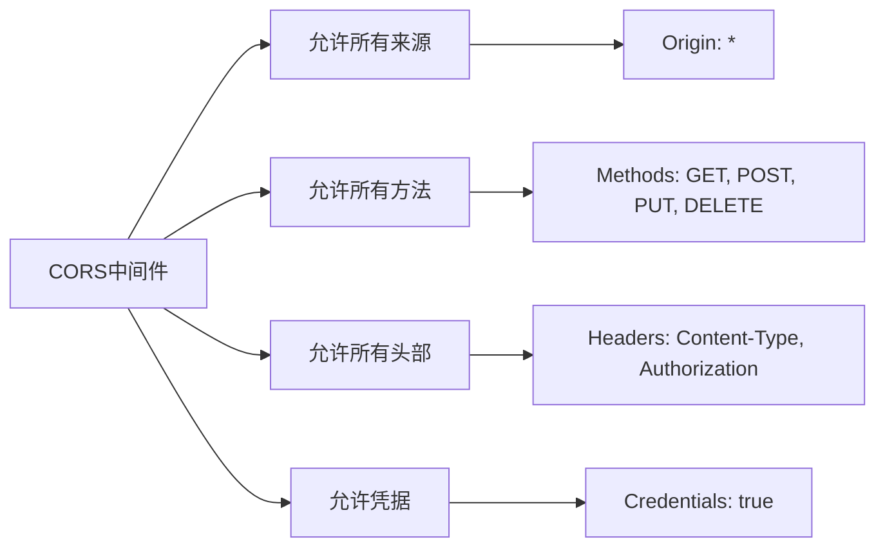

**图表来源**
- [server.py:69-76](file://server.py#L69-L76)

#### 跨域策略说明

- **完全开放**: 默认允许来自任何来源的请求
- **方法兼容**: 支持所有HTTP方法
- **头部灵活**: 允许自定义请求头
- **凭据支持**: 支持携带认证信息的请求

**章节来源**
- [server.py:69-76](file://server.py#L69-L76)

### TTS语音合成服务

系统提供了多种语音合成能力，现已扩展到四个主要后端：

#### 多后端统一接口设计

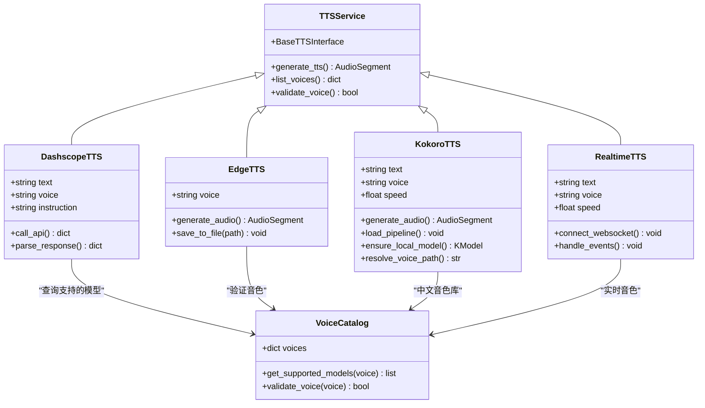

**图表来源**
- [server.py:212-247](file://server.py#L212-L247)
- [tts_voices_catalog.json:1-54](file://tts_voices_catalog.json#L1-L54)
- [kokoserver.py:30-42](file://kokoserver.py#L30-L42)

#### 阿里云DashScope TTS集成

系统集成了阿里云DashScope的Qwen系列TTS模型：

- **多音色支持**: 支持20+种中文音色，涵盖不同年龄、性别和风格
- **指令式合成**: 支持情感化、风格化的语音合成
- **多语言**: 支持中文、英文、日语、韩语等多种语言
- **高质量输出**: 采样率24kHz，支持多种音频格式

#### Microsoft Edge TTS集成

系统提供了与Microsoft Edge浏览器相同的TTS能力：

- **实时查询**: 支持实时查询可用的语音列表
- **区域过滤**: 支持按语言和地区过滤语音
- **性别筛选**: 支持按性别筛选合适的语音
- **自然流畅**: 提供接近真人说话的自然语音

#### Kokoro TTS集成

**重大更新**：系统集成了全新的Kokoro中文语音合成服务，具有以下核心特性：

- **中文优化**: 专为中国中文场景设计，支持多种中文方言
- **本地化部署**: 支持本地模型文件，减少网络依赖
- **智能音色解析**: 支持本地音色文件和远程音色下载
- **SSE流式合成**: 提供实时进度反馈和状态更新
- **多音色支持**: 内置多种中文音色，支持自定义音色文件

#### 实时DashScope TTS集成

系统提供了实时的DashScope WebSocket TTS服务：

- **流式传输**: 通过WebSocket实时传输音频数据
- **边收边播**: 支持实时播放合成的音频
- **低延迟**: 首包延迟最低，适合实时应用场景
- **高质量**: 24kHz采样率，提供高质量语音输出

#### 字幕配音功能

系统实现了精确的时间轴对齐字幕配音：

- **时间对齐**: 根据字幕的开始和结束时间精确对齐
- **变速处理**: 使用FFmpeg的atempo滤镜调整音频速度
- **静音插入**: 在字幕间隙插入适当的静音
- **质量保证**: 保持音高不变的变速效果

**章节来源**
- [server.py:300-321](file://server.py#L300-L321)
- [edge_subtitle_voiceover.py:166-223](file://edge_subtitle_voiceover.py#L166-L223)

## Kokoro TTS服务架构

### 服务设计概述

**重大更新**：Kokoro TTS服务是一个专门针对中文场景优化的独立FastAPI服务，经过完全重构后提供了完整的语音合成能力：

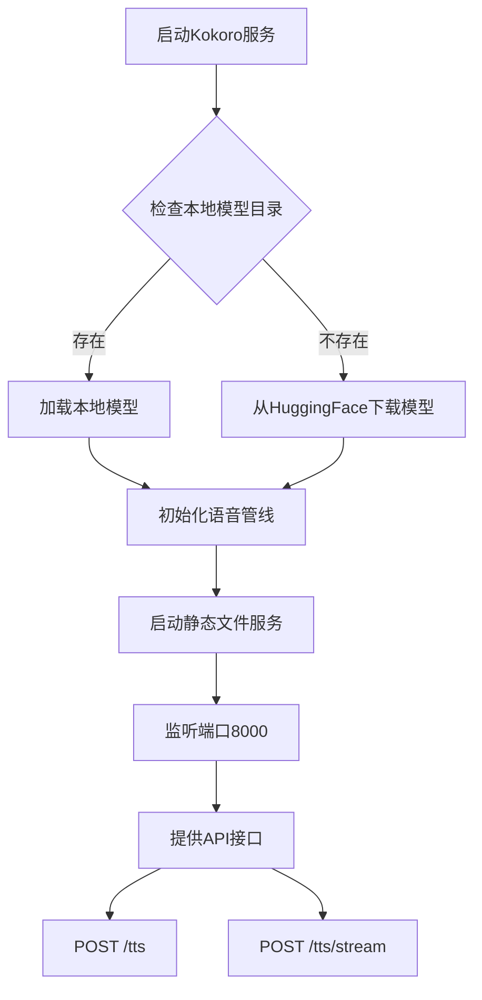

**图表来源**
- [kokoserver.py:158-169](file://kokoserver.py#L158-L169)

#### 核心特性

- **中文优化**: 专为中国中文场景设计，支持多种中文方言
- **本地化部署**: 支持本地模型文件，减少网络依赖
- **智能音色解析**: 支持本地音色文件和远程音色下载
- **SSE流式合成**: 提供实时进度反馈和状态更新
- **环境变量配置**: 支持KOKORO_*系列环境变量配置

#### API接口设计

服务提供了两个主要的API接口：

- **POST /tts**: 同步语音合成，返回音频文件URL
- **POST /tts/stream**: 流式语音合成，实时返回进度和状态

#### 配置管理

- **环境变量**: 支持KOKORO_REPO_ID、KOKORO_LOCAL_MODEL_DIR、KOKORO_LOCAL_VOICE_DIR等配置
- **静态文件服务**: 自动挂载/static目录提供文件访问
- **语音文件解析**: 支持本地音色文件和远程音色路径

**章节来源**
- [kokoserver.py:16-23](file://kokoserver.py#L16-L23)
- [kokoserver.py:183-194](file://kokoserver.py#L183-L194)

### Kokoro模型加载机制

**重大更新**：系统实现了智能的模型加载策略，经过完全重构后具有以下特性：

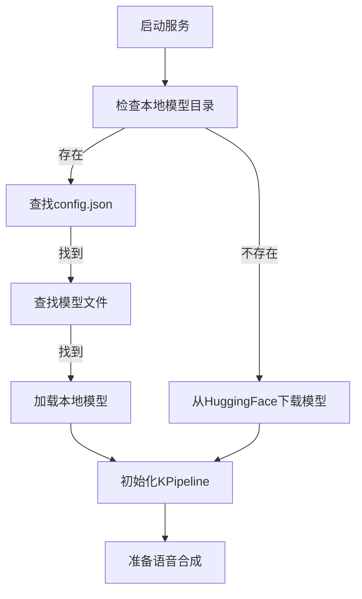

**图表来源**
- [kokoserver.py:82-111](file://kokoserver.py#L82-L111)

#### 本地模型优先策略

- **配置文件检测**: 首先检查config.json是否存在
- **模型文件匹配**: 查找kokoro-v1_0.pth或kokoro-v1_1-zh.pth
- **完整性验证**: 确保配置文件和模型文件同时存在

#### 远程模型回退机制

- **HuggingFace集成**: 自动从hexgrad/Kokoro-82M仓库加载
- **模型下载**: 支持自动下载必要的模型文件
- **版本管理**: 支持多个版本的模型文件

**章节来源**
- [kokoserver.py:82-111](file://kokoserver.py#L82-L111)

### SSE流式合成实现

**重大更新**：Kokoro服务提供了完整的SSE（Server-Sent Events）流式合成，经过完全重构后具有以下特性：

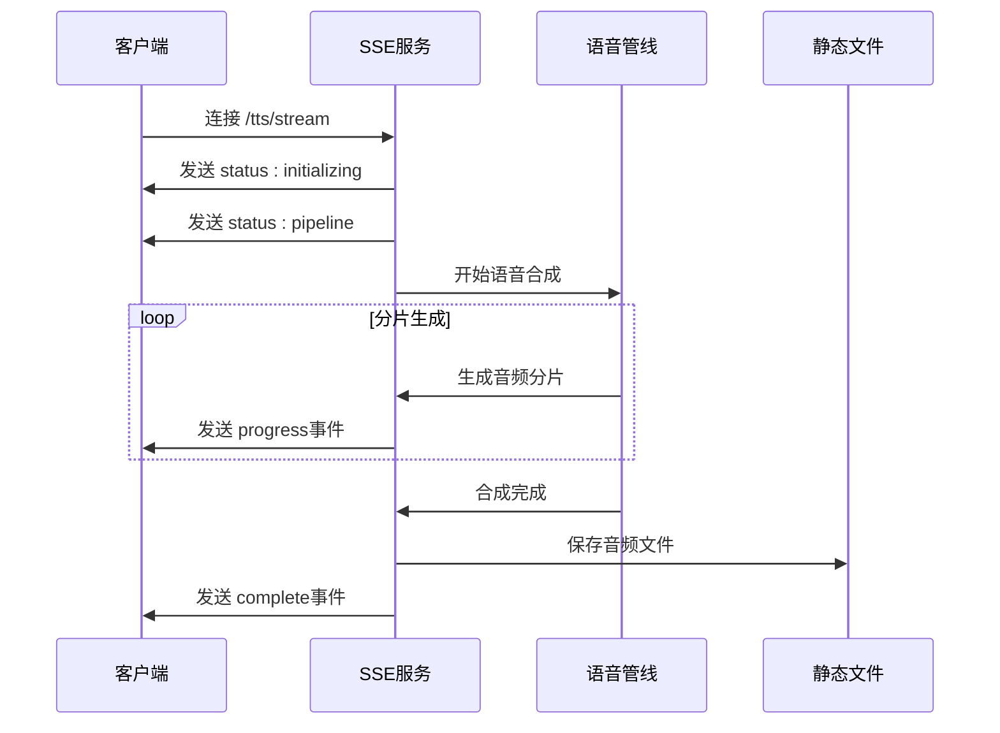

**图表来源**
- [kokoserver.py:145-195](file://kokoserver.py#L145-L195)

#### 事件类型设计

- **status事件**: 提供合成状态更新
- **progress事件**: 实时反馈分片生成进度
- **complete事件**: 合成完成，返回最终结果
- **error事件**: 错误处理和异常通知

#### 实时进度反馈

- **分片计数**: 跟踪生成的音频分片数量
- **样本统计**: 提供每个分片的样本数量
- **时长计算**: 实时计算音频时长
- **文件保存**: 合成完成后自动保存到静态目录

**章节来源**
- [kokoserver.py:145-195](file://kokoserver.py#L145-L195)

### Kokoro模型配置详解

**重大更新**：Kokoro模型采用了复杂的配置结构，经过完全重构后支持多种语音合成参数：

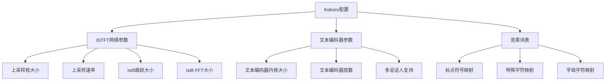

**图表来源**
- [kokoro_model/config.json:1-150](file://kokoro_model/config.json#L1-L150)

#### ISTFT网络配置

- **上采样参数**: 支持多级上采样，提高音频质量
- **Istft参数**: 优化音频重建算法
- **卷积核大小**: 多尺度卷积核设计

#### 文本编码器配置

- **多说话人**: 支持多音色语音合成
- **音素词表**: 丰富的音素映射
- **隐藏维度**: 512维隐藏层，支持复杂语音建模

#### 完整目录结构

**重大更新**：Kokoro模型现在包含完整的目录结构：

- **config.json**: 模型配置文件
- **voices/**: 本地音色文件目录
- **samples/**: 示例音频文件
- **eval/**: 评估数据和测试文件
- **README.md**: 模型使用说明
- **VOICES.md**: 音色列表和说明
- **SAMPLES.md**: 示例音频说明
- **EVAL.md**: 评估标准和方法
- **DONATE.md**: 捐赠和支持信息

**章节来源**
- [kokoro_model/config.json:1-150](file://kokoro_model/config.json#L1-L150)
- [kokoro_model/README.md:1-118](file://kokoro_model/README.md#L1-L118)
- [kokoro_model/VOICES.md:1-162](file://kokoro_model/VOICES.md#L1-L162)
- [kokoro_model/SAMPLES.md:1-49](file://kokoro_model/SAMPLES.md#L1-L49)

### 智能音色解析机制

**重大更新**：系统实现了智能的音色解析机制，支持本地音色文件和远程音色下载：

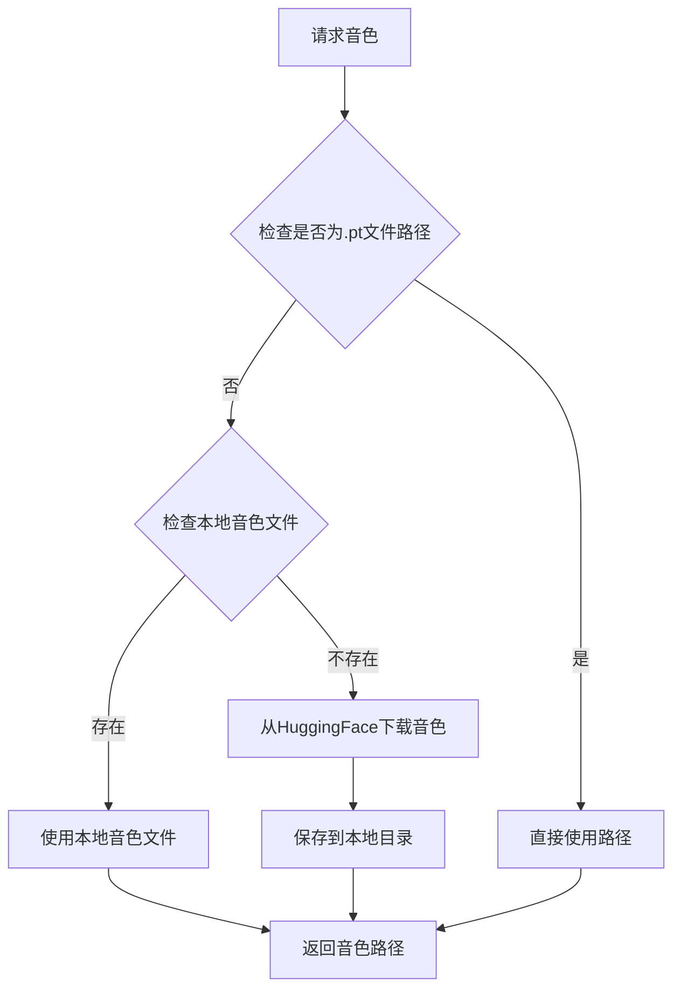

**图表来源**
- [kokoserver.py:61-80](file://kokoserver.py#L61-L80)

#### 音色解析策略

- **路径优先**: 如果音色参数以.pt结尾，直接视为文件路径
- **本地优先**: 检查LOCAL_VOICE_DIR下的同名.pt文件
- **远程回退**: 如果本地不存在，自动从HuggingFace下载
- **错误处理**: 下载失败时回退为音色名称

#### 环境变量配置

**重大更新**：支持以下KOKORO_*系列环境变量：

- **KOKORO_REPO_ID**: HuggingFace模型仓库ID，默认hexgrad/Kokoro-82M
- **KOKORO_LOCAL_MODEL_DIR**: 本地模型目录，默认kokoro_model
- **KOKORO_LOCAL_VOICE_DIR**: 本地音色目录，默认kokoro_model/voices
- **KOKORO_HOST**: 服务主机，默认0.0.0.0
- **KOKORO_PORT**: 服务端口，默认8000

**章节来源**
- [kokoserver.py:61-80](file://kokoserver.py#L61-L80)
- [kokoserver.py:17-23](file://kokoserver.py#L17-L23)

## 多后端统一接口设计

### 接口抽象层

系统设计了一个统一的TTS接口抽象层，支持不同后端的无缝切换：

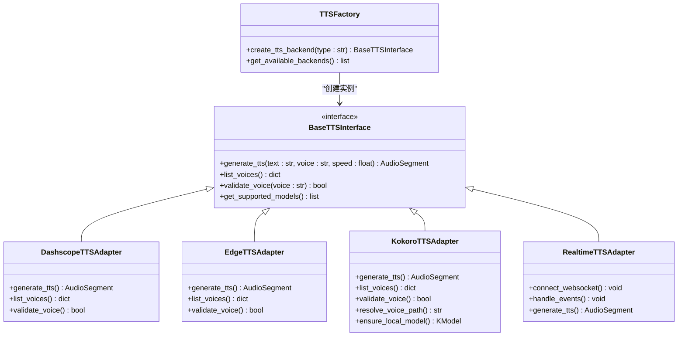

**图表来源**
- [server.py:100-107](file://server.py#L100-L107)
- [tts_voices_catalog.json:1-54](file://tts_voices_catalog.json#L1-L54)

### 后端选择策略

系统提供了灵活的后端选择机制：

- **自动选择**: 根据输入语言和音色自动选择最适合的后端
- **手动指定**: 支持客户端指定特定的TTS后端
- **负载均衡**: 在多个相同类型的后端之间分配请求
- **故障转移**: 当某个后端不可用时自动切换到备用后端

### 语音目录管理

系统维护了一个统一的语音目录，支持所有后端的音色查询：

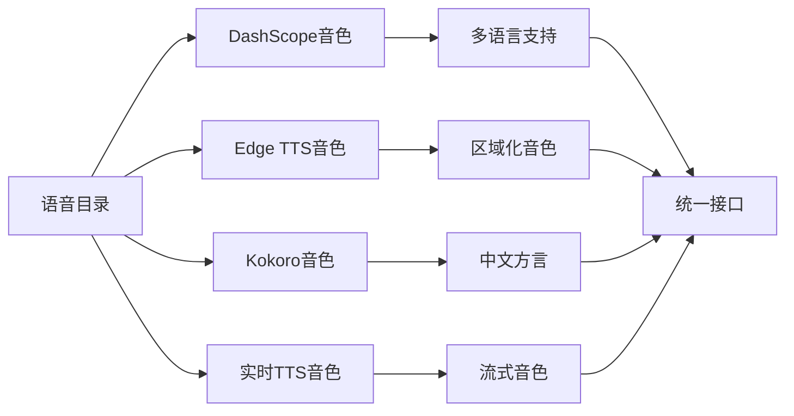

**图表来源**
- [tts_voices_catalog.json:1-54](file://tts_voices_catalog.json#L1-L54)

#### 目录结构设计

- **版本管理**: 包含目录版本信息，支持向后兼容
- **音色描述**: 提供详细的音色特征和适用场景
- **模型映射**: 显示每个音色支持的TTS模型
- **语言覆盖**: 展示音色支持的语言范围

#### 动态更新机制

- **文件监控**: 自动检测语音目录文件的变化
- **缓存策略**: 缓存目录数据以提高查询性能
- **增量更新**: 支持部分更新而不重启服务

**章节来源**
- [server.py:250-254](file://server.py#L250-L254)
- [tts_voices_catalog.json:1-54](file://tts_voices_catalog.json#L1-L54)

## 依赖关系分析

### 核心依赖关系

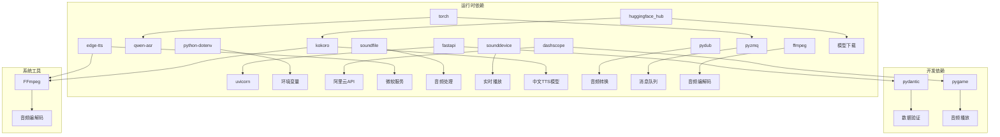

**图表来源**
- [requirements.txt:1-13](file://requirements.txt#L1-L13)

### 模块间交互

系统采用模块化设计，各组件职责明确：

- **server.py**: 主应用入口，负责路由和业务逻辑协调
- **edge_subtitle_voiceover.py**: 字幕配音核心逻辑，支持API和离线脚本复用
- **qwen3stream.py**: DashScope实时TTS流处理
- **index.py**: 本地ASR测试和模型验证
- **kokoserver.py**: 独立的Kokoro TTS服务，经过完全重构
- **qwen-to-data7.py**: ZMQ赛事系统，支持多种TTS后端

**章节来源**
- [requirements.txt:1-13](file://requirements.txt#L1-L13)
- [server.py:18-31](file://server.py#L18-L31)

## 性能考虑

### 内存管理

系统实现了完善的内存管理策略：

- **临时文件清理**: 自动清理识别过程中的临时WAV文件
- **缓冲区限制**: 滑动窗口限制音频缓冲区大小
- **批量处理**: 控制ASR模型的批量大小，避免内存溢出
- **静态文件缓存**: Kokoro服务的音频文件缓存机制
- **模型预热**: Kokoro服务的模型预加载机制

### 并发处理

- **异步I/O**: 使用asyncio处理WebSocket连接
- **线程池**: 将阻塞的ASR调用放入线程池执行
- **锁机制**: 确保模型调用的线程安全
- **SSE流式处理**: 避免长时间持有大量音频数据
- **多后端并发**: 支持多个TTS后端的并发处理

### 网络优化

- **CORS配置**: 灵活的跨域策略，支持开发和生产环境
- **静态文件**: 提供静态文件服务，减少API负载
- **缓存策略**: 字幕配音结果的文件缓存机制
- **模型预热**: Kokoro服务的模型预加载机制
- **环境变量配置**: 支持KOKORO_*系列环境变量优化

## 故障排除指南

### 常见问题及解决方案

| 问题类型 | 症状 | 解决方案 |
|---------|------|----------|
| 模型加载失败 | 启动时报错，无法加载ASR模型 | 检查ASR_MODEL_PATH配置，确保包含完整的模型文件 |
| CUDA内存不足 | GPU内存溢出错误 | 降低max_inference_batch_size，使用CPU模式 |
| WebSocket连接失败 | 客户端无法连接到/ws/asr | 检查防火墙设置，确认端口开放 |
| FFmpeg找不到 | 转码失败，提示找不到ffmpeg | 在.env中设置FFMPEG_PATH，确保ffmpeg.exe在PATH中 |
| CORS错误 | 跨域请求被阻止 | 检查CORS配置，生产环境建议限制特定来源 |
| Kokoro模型加载失败 | 无法加载Kokoro模型 | 检查KOKORO_LOCAL_MODEL_DIR配置，确保模型文件完整 |
| Kokoro音色解析失败 | 无法解析音色路径 | 检查KOKORO_LOCAL_VOICE_DIR配置，确认音色文件存在 |
| SSE流式合成中断 | 事件流意外断开 | 检查服务器资源和客户端连接状态 |
| 多后端选择错误 | 选择错误的TTS后端 | 检查QWEN_TTS_BACKEND环境变量配置 |

### 环境变量配置

系统支持多种环境变量配置：

- **DASHSCOPE_API_KEY**: 阿里云DashScope API密钥
- **ASR_MODEL_PATH**: 本地ASR模型路径
- **FFMPEG_PATH**: FFmpeg可执行文件路径
- **ASR_WS_DECODE_INTERVAL_S**: WebSocket解码间隔（秒）
- **ASR_WS_MAX_WINDOW_S**: 最大滑动窗口（秒）
- **KOKORO_REPO_ID**: Kokoro模型仓库ID
- **KOKORO_LOCAL_MODEL_DIR**: 本地Kokoro模型目录
- **KOKORO_LOCAL_VOICE_DIR**: 本地Kokoro音色目录
- **KOKORO_HOST**: Kokoro服务主机
- **KOKORO_PORT**: Kokoro服务端口
- **QWEN_TTS_BACKEND**: 默认TTS后端选择
- **KOKORO_TTS_URL**: Kokoro服务地址
- **KOKORO_VOICE**: 默认Kokoro音色
- **KOKORO_SPEED**: 默认Kokoro语速

**章节来源**
- [README.md:48-83](file://README.md#L48-L83)
- [server.py:427-431](file://server.py#L427-L431)
- [kokoserver.py:20-22](file://kokoserver.py#L20-L22)

## 结论

Vue3Speech后端服务展现了现代语音处理系统的最佳实践：

### 技术优势

- **模块化设计**: 清晰的组件分离，便于维护和扩展
- **异步架构**: 高性能的并发处理能力
- **多后端支持**: 支持四种主要TTS后端，满足不同语言和场景需求
- **灵活部署**: 支持多种部署模式和配置选项
- **完整生态**: 集成了从语音识别到合成的完整工具链
- **智能管理**: Kokoro服务的本地模型管理和智能音色解析

### 架构特点

- **可扩展性**: 支持水平扩展和垂直扩展
- **可靠性**: 完善的错误处理和恢复机制
- **易用性**: 简洁的API设计和丰富的示例代码
- **性能**: 针对GPU和CPU的优化配置
- **国际化**: 支持多语言和多地区语音合成
- **本地化**: 支持本地模型部署，减少网络依赖

### 新增价值

**重大更新**：Kokoro TTS服务的引入为系统带来了显著的价值提升：

- **中文优化**: 专门针对中文场景优化的高质量语音合成
- **本地化部署**: 支持本地模型文件，减少网络依赖
- **智能音色解析**: 支持本地音色文件和远程音色下载
- **SSE事件流**: 完整的Server-Sent Events实现，支持实时状态更新
- **环境变量配置**: 支持KOKORO_*系列环境变量，便于部署和管理
- **完整的模型生态**: 包含config.json、voices、samples、eval等完整目录结构

**重大更新**：kokoserver.py的完全重构为系统带来了以下新特性：

- **本地模型管理**: 自动检测和加载本地模型文件
- **智能音色解析**: 支持本地音色文件和远程音色下载
- **SSE流式合成**: 提供实时进度反馈和状态更新
- **环境变量配置**: 支持完整的KOKORO_*系列环境变量
- **静态文件服务**: 自动挂载/static目录提供文件访问
- **错误处理**: 完善的异常处理和回退机制

该系统为语音应用开发提供了坚实的基础，可以作为企业级语音处理平台的核心组件，支持各种语音识别和合成场景的应用开发。通过多后端统一接口设计，系统能够根据具体需求选择最适合的语音合成方案，为用户提供最佳的语音体验。

**重大更新**：随着Kokoro TTS服务的完全重构和集成，系统现在具备了更强大的中文语音合成能力，支持本地部署、智能音色解析和实时流式合成，为中文应用场景提供了最优的解决方案。