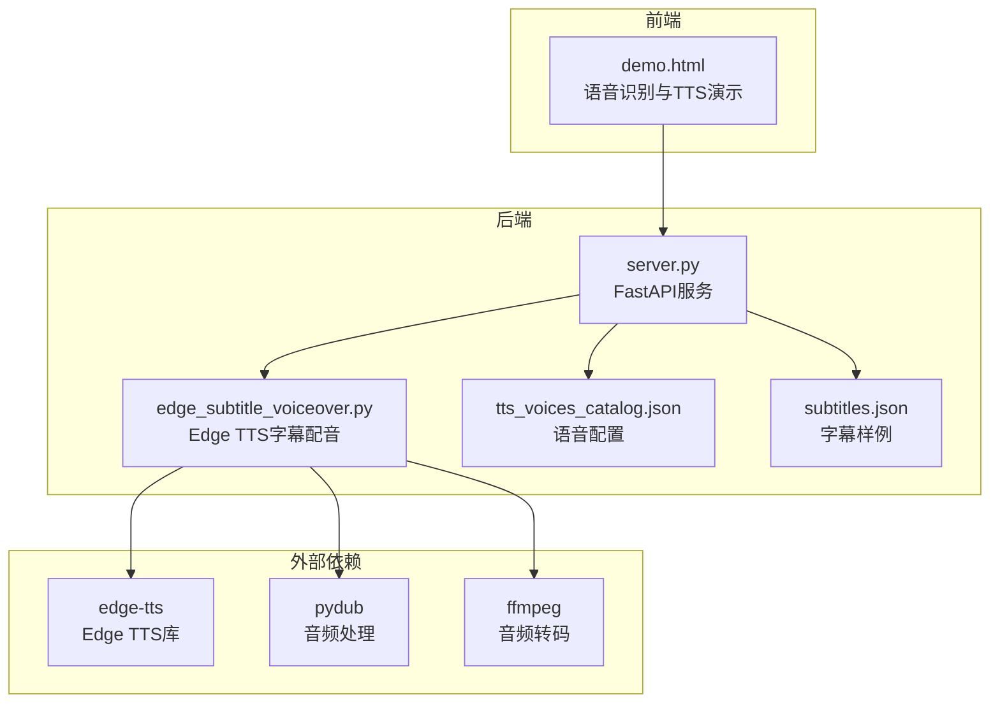
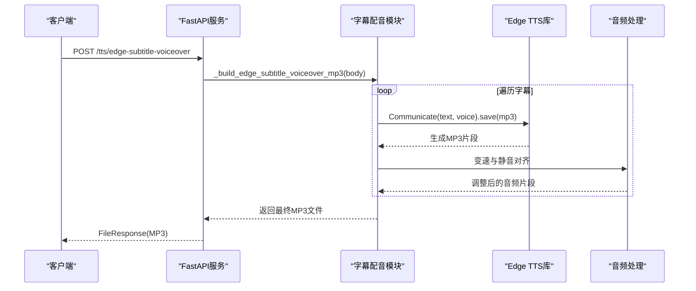
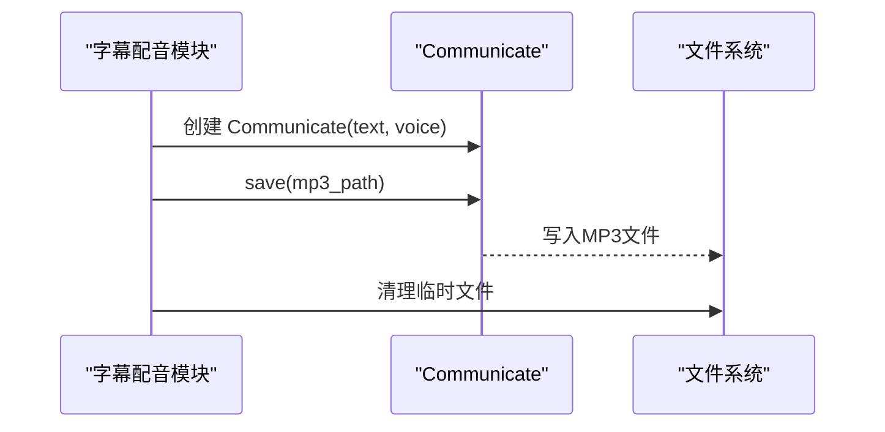
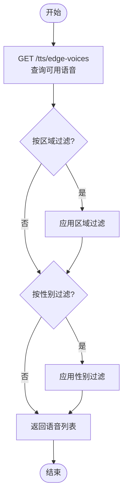
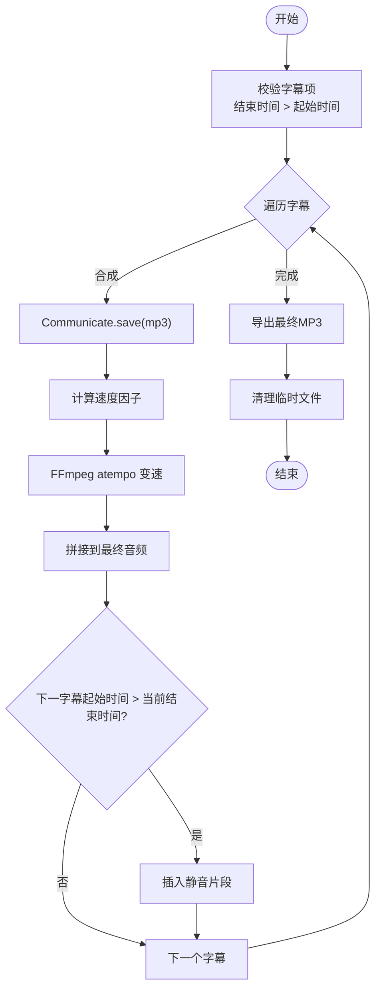
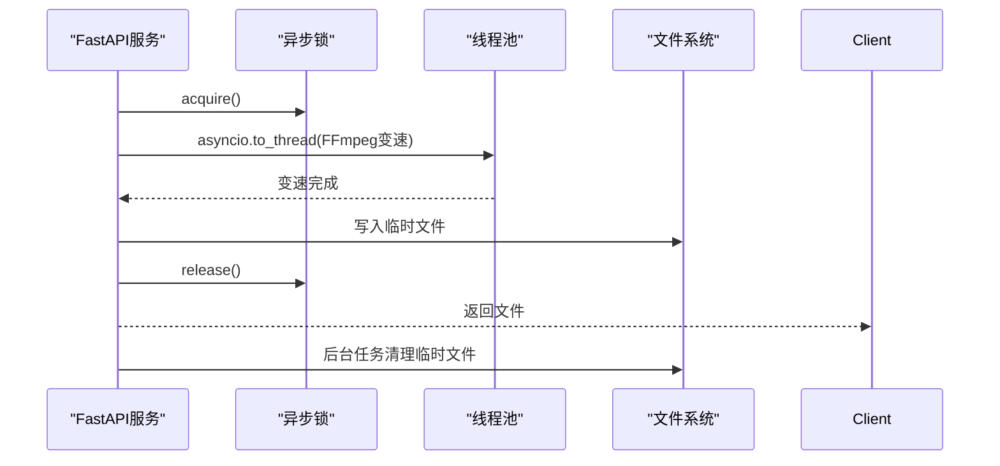
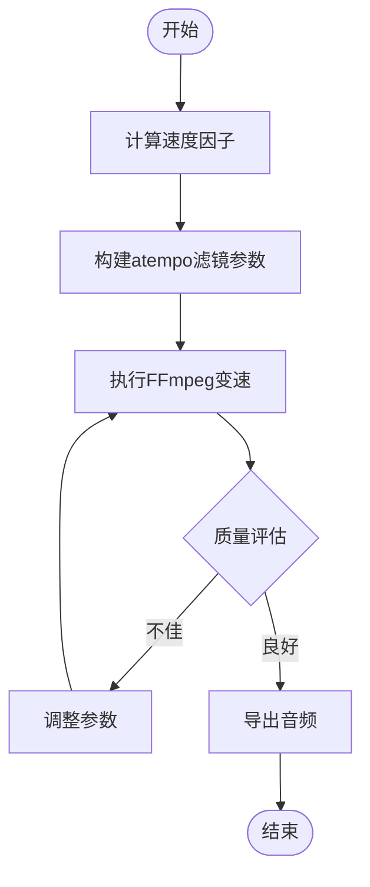
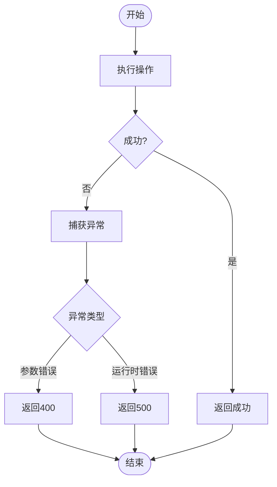
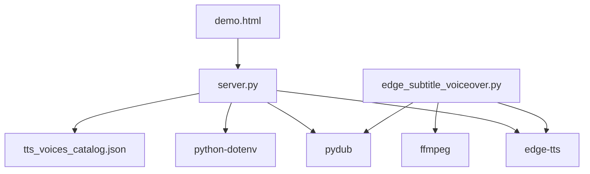

# Edge TTS语音合成集成

<cite>
**本文档引用的文件**
- [README.md](file://README.md)
- [server.py](file://server.py)
- [edge_subtitle_voiceover.py](file://edge_subtitle_voiceover.py)
- [tts_voices_catalog.json](file://tts_voices_catalog.json)
- [subtitles.json](file://subtitles.json)
- [requirements.txt](file://requirements.txt)
- [demo.html](file://demo.html)
- [ttstest.py](file://ttstest.py)
- [qwen-to-data4.py](file://qwen-to-data4.py)
</cite>

## 目录
1. [简介](#简介)
2. [项目结构](#项目结构)
3. [核心组件](#核心组件)
4. [架构总览](#架构总览)
5. [详细组件分析](#详细组件分析)
6. [依赖关系分析](#依赖关系分析)
7. [性能考虑](#性能考虑)
8. [故障排查指南](#故障排查指南)
9. [结论](#结论)
10. [附录](#附录)

## 简介
本项目提供基于Microsoft Edge TTS的字幕时间轴配音能力，结合FastAPI后端与前端演示页面，支持：
- 通过Edge TTS按字幕时间轴生成配音，支持变速与静音对齐
- 提供语音配置管理与可用语音列表查询
- 支持异步TTS生成与并发控制
- 提供质量控制方法（语速调节、情感表达、自然度优化）
- 包含错误处理、重试策略与性能监控实现细节

## 项目结构
项目采用前后端分离架构，后端使用FastAPI提供REST接口，前端使用静态HTML+JavaScript进行演示与交互。核心文件包括：
- 后端服务：server.py（提供TTS、ASR、WebSocket、字幕配音等接口）
- Edge TTS集成：edge_subtitle_voiceover.py（封装Communicate类，实现异步合成与变速对齐）
- 配置与演示：tts_voices_catalog.json（语音列表）、subtitles.json（字幕样例）、demo.html（前端演示）
- 依赖管理：requirements.txt（第三方库）
- 辅助脚本：ttstest.py（DashScope TTS测试）、qwen-to-data4.py（实时TTS播报与质量控制）

**图表来源**
- [server.py:1-452](file://server.py#L1-L452)
- [edge_subtitle_voiceover.py:1-223](file://edge_subtitle_voiceover.py#L1-L223)
- [requirements.txt:1-13](file://requirements.txt#L1-L13)

**章节来源**
- [README.md:1-287](file://README.md#L1-L287)
- [server.py:1-452](file://server.py#L1-L452)
- [edge_subtitle_voiceover.py:1-223](file://edge_subtitle_voiceover.py#L1-L223)
- [requirements.txt:1-13](file://requirements.txt#L1-L13)

## 核心组件
- Edge TTS Communicate类集成：通过edge-tts库的Communicate类实现异步文本到语音的合成，支持保存为MP3文件。
- 字幕时间轴配音：根据字幕的时间戳，逐条合成并按目标时长进行变速调整，最终拼接为完整的配音音频。
- 语音配置管理：提供语音列表查询接口，支持按区域、性别过滤；语音配置来源于tts_voices_catalog.json。
- 异步TTS生成与并发控制：使用asyncio实现异步合成，通过锁与后台任务管理资源，避免阻塞。
- 质量控制：通过语速调节、情感表达指令、自然度优化等手段提升合成质量。
- 错误处理与性能监控：统一异常捕获、状态码返回、日志记录与超时控制。

**章节来源**
- [edge_subtitle_voiceover.py:148-151](file://edge_subtitle_voiceover.py#L148-L151)
- [edge_subtitle_voiceover.py:166-223](file://edge_subtitle_voiceover.py#L166-L223)
- [server.py:250-298](file://server.py#L250-L298)
- [server.py:300-321](file://server.py#L300-L321)

## 架构总览
后端服务通过FastAPI提供多种接口：
- GET /tts/voices：返回DashScope TTS语音列表
- GET /tts/edge-voices：查询Edge TTS可用声音（实时请求微软接口）
- POST /tts/edge-subtitle-voiceover：按字幕时间轴生成Edge TTS配音（返回MP3文件）
- POST /tts/edge-subtitle-voiceover/link：生成配音并返回可访问的URL与文件路径
- GET /tts/edge-voiceover-files/{file_id}：获取已生成的配音文件

**图表来源**
- [server.py:300-321](file://server.py#L300-L321)
- [edge_subtitle_voiceover.py:166-223](file://edge_subtitle_voiceover.py#L166-L223)

**章节来源**
- [server.py:250-361](file://server.py#L250-L361)
- [edge_subtitle_voiceover.py:148-223](file://edge_subtitle_voiceover.py#L148-L223)

## 详细组件分析

### Edge TTS Communicate类使用
- 通信对象创建：使用Communicate(text, voice)创建通信对象，随后调用save方法将合成结果保存为MP3文件。
- 异步合成：通过asyncio实现异步调用，避免阻塞主线程，提高并发性能。
- 文件管理：合成完成后，调用清理函数删除临时文件，释放磁盘空间。

**图表来源**
- [edge_subtitle_voiceover.py:148-151](file://edge_subtitle_voiceover.py#L148-L151)
- [edge_subtitle_voiceover.py:190-191](file://edge_subtitle_voiceover.py#L190-L191)

**章节来源**
- [edge_subtitle_voiceover.py:148-151](file://edge_subtitle_voiceover.py#L148-L151)

### 语音选择与配置管理
- 语音列表查询：GET /tts/edge-voices支持按区域(locale)与性别(gender)过滤，返回Edge TTS可用声音列表。
- 语音配置：tts_voices_catalog.json提供DashScope TTS的语音配置，包含音色名称、描述、支持的语言与模型。
- 字幕配音语音：Edge TTS字幕配音使用ShortName作为voice参数，与字幕项中的voice字段对应。

**图表来源**
- [server.py:256-298](file://server.py#L256-L298)

**章节来源**
- [server.py:250-298](file://server.py#L250-L298)
- [tts_voices_catalog.json:1-54](file://tts_voices_catalog.json#L1-L54)

### 文本处理与异步合成流程
- 字幕项校验：确保每个字幕项的结束时间大于起始时间，避免负时长或零时长。
- 异步合成：对每个字幕项调用Communicate进行异步合成，使用asyncio.to_thread进行CPU密集型操作的线程化。
- 时长对齐：根据目标时长计算速度因子，使用FFmpeg的atempo滤镜进行变速，保持音高不变。
- 静音填充：在相邻字幕之间插入静音片段，确保时间轴对齐。

**图表来源**
- [edge_subtitle_voiceover.py:166-223](file://edge_subtitle_voiceover.py#L166-L223)
- [edge_subtitle_voiceover.py:197-202](file://edge_subtitle_voiceover.py#L197-L202)

**章节来源**
- [edge_subtitle_voiceover.py:166-223](file://edge_subtitle_voiceover.py#L166-L223)

### 异步TTS生成的并发处理机制
- 并发控制：使用asyncio.Lock()保护共享资源，避免并发访问导致的数据竞争。
- 资源管理：通过BackgroundTask在文件下载完成后自动清理临时文件，防止磁盘空间泄漏。
- 任务调度：使用asyncio.to_thread将CPU密集型操作（如FFmpeg变速）放到线程池中执行，避免阻塞事件循环。

**图表来源**
- [server.py:97-98](file://server.py#L97-L98)
- [server.py:320](file://server.py#L320)

**章节来源**
- [server.py:97-98](file://server.py#L97-L98)
- [server.py:320](file://server.py#L320)

### 语音合成质量控制方法
- 语速调节：通过计算目标时长与原始时长的比例得到速度因子，使用FFmpeg atempo滤镜进行变速，保持音高。
- 情感表达：通过指令参数控制情感表达，如愤怒、激情高昂等语气。
- 自然度优化：合理设置采样率与声道数，确保音频质量；在字幕之间插入静音，避免语音拼接突兀。

**图表来源**
- [edge_subtitle_voiceover.py:97-114](file://edge_subtitle_voiceover.py#L97-L114)
- [edge_subtitle_voiceover.py:117-146](file://edge_subtitle_voiceover.py#L117-L146)

**章节来源**
- [edge_subtitle_voiceover.py:97-146](file://edge_subtitle_voiceover.py#L97-L146)

### 错误处理机制、重试策略与性能监控
- 错误处理：统一捕获ValueError、RuntimeError与通用异常，返回HTTP 400或500状态码，并在前端展示错误信息。
- 重试策略：在实时TTS场景中，设置最大等待时间，超过阈值后强制关闭WebSocket，避免后续播报积压。
- 性能监控：记录最近事件类型序列，便于诊断服务端事件缺失或延迟问题。

**图表来源**
- [server.py:307-315](file://server.py#L307-L315)
- [qwen-to-data4.py:661-714](file://qwen-to-data4.py#L661-L714)

**章节来源**
- [server.py:307-315](file://server.py#L307-L315)
- [qwen-to-data4.py:661-714](file://qwen-to-data4.py#L661-L714)

## 依赖关系分析
- 第三方库依赖：FastAPI、edge-tts、pydub、ffmpeg、python-dotenv等。
- 语音库集成：edge-tts提供Edge TTS的Python接口；pydub与ffmpeg用于音频处理与转码。
- 配置与演示：tts_voices_catalog.json提供语音配置；demo.html提供前端演示页面。

**图表来源**
- [requirements.txt:1-13](file://requirements.txt#L1-L13)
- [server.py:1-452](file://server.py#L1-L452)
- [edge_subtitle_voiceover.py:1-223](file://edge_subtitle_voiceover.py#L1-L223)

**章节来源**
- [requirements.txt:1-13](file://requirements.txt#L1-L13)
- [server.py:1-452](file://server.py#L1-L452)
- [edge_subtitle_voiceover.py:1-223](file://edge_subtitle_voiceover.py#L1-L223)

## 性能考虑
- 异步I/O：使用asyncio实现异步合成，避免阻塞主线程，提高并发吞吐量。
- 线程池：将CPU密集型操作（如FFmpeg变速）放入线程池，减少事件循环阻塞。
- 资源清理：通过BackgroundTask自动清理临时文件，防止磁盘空间泄漏。
- 超时控制：在实时TTS场景中设置最大等待时间，避免长时间阻塞后续播报。

## 故障排查指南
- 语音列表获取失败：检查网络连通性与微软接口可用性，确认返回状态码。
- FFmpeg未找到：在环境变量中设置FFMPEG_PATH，或将ffmpeg加入系统PATH。
- 字幕时长异常：检查字幕项的结束时间是否大于起始时间，避免负时长或零时长。
- 实时TTS播报中断：检查服务端事件类型序列，必要时调整等待时间阈值。

**章节来源**
- [server.py:279-282](file://server.py#L279-L282)
- [edge_subtitle_voiceover.py:43-81](file://edge_subtitle_voiceover.py#L43-L81)
- [edge_subtitle_voiceover.py:29-33](file://edge_subtitle_voiceover.py#L29-L33)
- [qwen-to-data4.py:661-714](file://qwen-to-data4.py#L661-L714)

## 结论
本项目通过Edge TTS实现了高质量的字幕时间轴配音能力，结合FastAPI提供了完善的接口与前端演示。通过异步合成、并发控制与质量控制策略，能够满足多场景下的语音合成需求。同时，完善的错误处理与性能监控机制确保了系统的稳定性与可维护性。

## 附录
- 前端演示页面：demo.html提供语音识别与TTS演示，支持语音选择与播放控制。
- 语音配置：tts_voices_catalog.json提供DashScope TTS的语音配置，便于前端动态展示。
- 字幕样例：subtitles.json提供字幕时间轴样例，便于测试与验证。

**章节来源**
- [demo.html:1-685](file://demo.html#L1-L685)
- [tts_voices_catalog.json:1-54](file://tts_voices_catalog.json#L1-L54)
- [subtitles.json:1-17](file://subtitles.json#L1-L17)