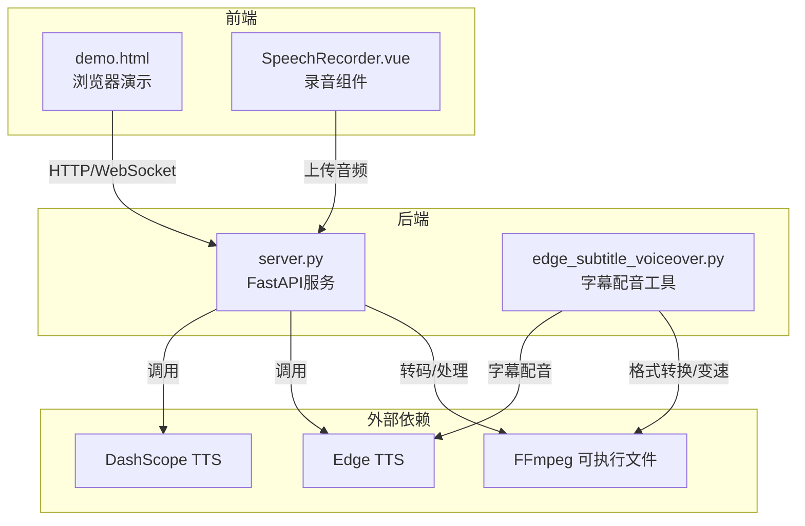
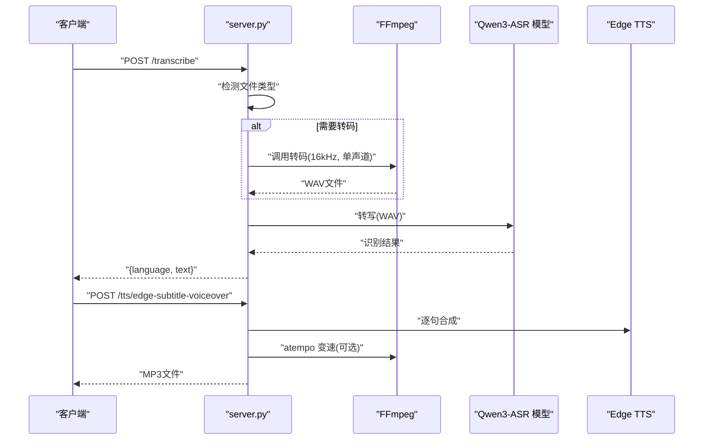
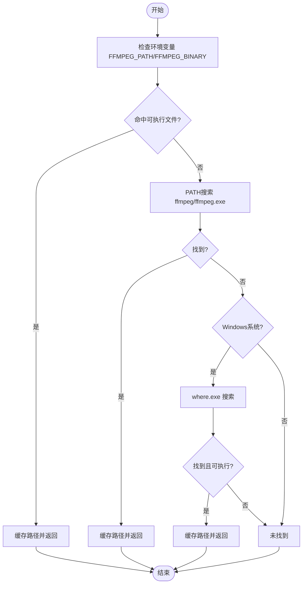
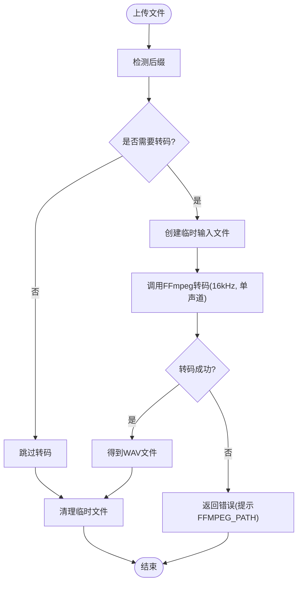
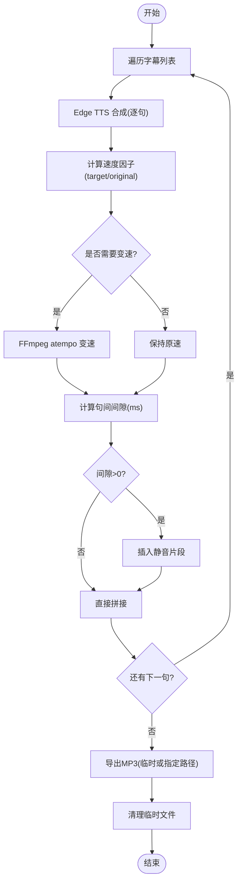
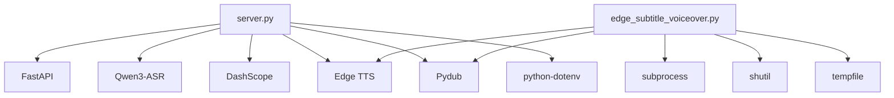

# FFmpeg集成与音频处理

<cite>
**本文引用的文件**
- [README.md](file://README.md)
- [server.py](file://server.py)
- [edge_subtitle_voiceover.py](file://edge_subtitle_voiceover.py)
- [SpeechRecorder.vue](file://SpeechRecorder.vue)
- [demo.html](file://demo.html)
- [requirements.txt](file://requirements.txt)
- [subtitles.json](file://subtitles.json)
- [tts_voices_catalog.json](file://tts_voices_catalog.json)
- [index.py](file://index.py)
- [ttstest.py](file://ttstest.py)
</cite>

## 目录
1. [简介](#简介)
2. [项目结构](#项目结构)
3. [核心组件](#核心组件)
4. [架构总览](#架构总览)
5. [详细组件分析](#详细组件分析)
6. [依赖关系分析](#依赖关系分析)
7. [性能考量](#性能考量)
8. [故障排查指南](#故障排查指南)
9. [结论](#结论)
10. [附录](#附录)

## 简介
本技术文档聚焦于FFmpeg在本项目中的集成与音频处理实现，涵盖：
- FFmpeg可执行文件的自动发现机制（环境变量优先级、PATH搜索、Windows系统兼容性）
- 音频格式转换流程（从任意音频到16kHz单声道WAV）
- 静音填充与字幕间隙的音频生成及无缝拼接
- 音频处理管道设计（临时文件管理与内存优化）
- 跨平台兼容性、错误恢复与性能监控

## 项目结构
项目采用前后端分离架构，前端通过浏览器演示页面与后端FastAPI服务交互，后端负责ASR识别、TTS合成、字幕配音生成与转码处理。与FFmpeg相关的逻辑集中在后端服务与独立脚本中。

图表来源
- [server.py:1-452](file://server.py#L1-L452)
- [edge_subtitle_voiceover.py:1-223](file://edge_subtitle_voiceover.py#L1-L223)
- [demo.html:1-685](file://demo.html#L1-L685)
- [SpeechRecorder.vue:1-90](file://SpeechRecorder.vue#L1-L90)

章节来源
- [README.md:1-287](file://README.md#L1-L287)
- [server.py:1-452](file://server.py#L1-L452)
- [edge_subtitle_voiceover.py:1-223](file://edge_subtitle_voiceover.py#L1-L223)

## 核心组件
- FFmpeg自动发现与转码：后端在上传音频时根据文件类型决定是否通过FFmpeg转码为16kHz单声道WAV；同时提供独立的字幕配音脚本复用相同转码与变速能力。
- 字幕配音生成：按字幕时间轴生成Edge TTS配音，处理句间静音填充与变速，最终导出MP3。
- 临时文件管理：在转码与音频处理过程中使用临时文件，确保资源回收与错误清理。
- 跨平台兼容：在Windows环境下通过多种途径定位FFmpeg，避免IDE子进程PATH差异导致的不可用问题。

章节来源
- [server.py:363-425](file://server.py#L363-L425)
- [edge_subtitle_voiceover.py:43-81](file://edge_subtitle_voiceover.py#L43-L81)
- [edge_subtitle_voiceover.py:84-94](file://edge_subtitle_voiceover.py#L84-L94)
- [edge_subtitle_voiceover.py:166-222](file://edge_subtitle_voiceover.py#L166-L222)

## 架构总览
后端服务在接收上传音频后，根据文件类型判断是否需要转码；若需要，调用FFmpeg将音频转换为16kHz单声道WAV；随后进行ASR识别。对于字幕配音场景，服务调用Edge TTS生成每句配音，结合字幕时间轴进行静音填充与变速，最终导出MP3。

图表来源
- [server.py:367-425](file://server.py#L367-L425)
- [edge_subtitle_voiceover.py:148-151](file://edge_subtitle_voiceover.py#L148-L151)
- [edge_subtitle_voiceover.py:117-145](file://edge_subtitle_voiceover.py#L117-L145)

## 详细组件分析

### FFmpeg自动发现机制
- 环境变量优先级：优先读取FFMPEG_PATH/FFMPEG_BINARY，去除引号与空白后判断是否存在可执行文件。
- PATH搜索：若环境变量未命中，使用shutil.which在PATH中查找ffmpeg或ffmpeg.exe。
- Windows系统兼容：若PATH未找到，使用where.exe进行系统范围搜索，并验证首个可执行文件。
- 缓存策略：将解析结果缓存至模块级变量，避免重复搜索。
- 超时与隐藏输出：调用subprocess时设置超时与隐藏输出，提升稳定性与安全性。

图表来源
- [edge_subtitle_voiceover.py:43-81](file://edge_subtitle_voiceover.py#L43-L81)
- [server.py:388-389](file://server.py#L388-L389)

章节来源
- [edge_subtitle_voiceover.py:43-81](file://edge_subtitle_voiceover.py#L43-L81)
- [server.py:388-389](file://server.py#L388-L389)

### 音频格式转换流程（任意到16kHz单声道WAV）
- 触发条件：当上传文件为webm/ogg/m4a/mp3等非WAV格式时，后端尝试通过FFmpeg转码。
- 转码参数：采样率16kHz、单声道、WAV格式，隐藏banner与日志，禁用stdin，超时120秒。
- 错误处理：捕获子进程异常并返回友好错误信息；若无法转码，提示在.env中设置FFMPEG_PATH。
- 临时文件：转码过程使用临时文件，完成后清理。

图表来源
- [server.py:367-425](file://server.py#L367-L425)
- [edge_subtitle_voiceover.py:84-94](file://edge_subtitle_voiceover.py#L84-L94)

章节来源
- [server.py:367-425](file://server.py#L367-L425)
- [edge_subtitle_voiceover.py:84-94](file://edge_subtitle_voiceover.py#L84-L94)

### 静音填充与字幕间隙的音频生成
- 静音填充：在相邻字幕之间计算时间差，插入相应时长的静音片段，确保无缝衔接。
- 变速处理：根据目标时长与原始时长计算速度因子，使用FFmpeg的atempo滤镜进行变速，避免音高变化。
- 临时文件：变速过程使用临时WAV文件，完成后清理。
- 导出：最终将所有片段拼接为MP3文件，支持直接导出或写入临时文件由调用方清理。

图表来源
- [edge_subtitle_voiceover.py:166-222](file://edge_subtitle_voiceover.py#L166-L222)
- [edge_subtitle_voiceover.py:117-145](file://edge_subtitle_voiceover.py#L117-L145)

章节来源
- [edge_subtitle_voiceover.py:166-222](file://edge_subtitle_voiceover.py#L166-L222)
- [edge_subtitle_voiceover.py:117-145](file://edge_subtitle_voiceover.py#L117-L145)

### 音频处理管道设计（临时文件与内存优化）
- 临时文件策略：转码与变速均使用NamedTemporaryFile，确保跨平台兼容与自动清理。
- 内存优化：音频处理采用分步拼接与静音填充，避免一次性加载全部音频造成内存峰值过高。
- 错误恢复：在异常情况下主动清理临时文件，防止磁盘占用与文件锁定。
- 资源回收：使用BackgroundTask或finally块确保文件删除，减少泄漏风险。

章节来源
- [edge_subtitle_voiceover.py:124-145](file://edge_subtitle_voiceover.py#L124-L145)
- [edge_subtitle_voiceover.py:153-163](file://edge_subtitle_voiceover.py#L153-L163)
- [server.py:316-321](file://server.py#L316-L321)

### 跨平台兼容性与错误恢复
- 跨平台：统一使用subprocess调用FFmpeg，Windows下通过where.exe增强发现能力；隐藏窗口标志避免弹窗。
- 错误恢复：捕获子进程返回码与stderr/stdout，提供可读错误信息；在Web端上传场景中，明确提示FFMPEG_PATH配置。
- 性能监控：通过超时控制与日志级别抑制，降低I/O与CPU开销；WebSocket实时识别中通过滑动窗口与周期性解码平衡延迟与吞吐。

章节来源
- [edge_subtitle_voiceover.py:66-81](file://edge_subtitle_voiceover.py#L66-L81)
- [server.py:124-197](file://server.py#L124-L197)

## 依赖关系分析
- 后端服务依赖：FastAPI、Qwen ASR、DashScope TTS、Edge TTS、Pydub、dotenv等。
- FFmpeg依赖：通过环境变量或PATH定位，Windows下额外依赖where.exe。
- 前端依赖：浏览器MediaRecorder与WebSocket API，用于录音与实时识别。

图表来源
- [requirements.txt:1-13](file://requirements.txt#L1-L13)
- [server.py:1-452](file://server.py#L1-L452)
- [edge_subtitle_voiceover.py:1-223](file://edge_subtitle_voiceover.py#L1-L223)

章节来源
- [requirements.txt:1-13](file://requirements.txt#L1-L13)
- [server.py:1-452](file://server.py#L1-L452)
- [edge_subtitle_voiceover.py:1-223](file://edge_subtitle_voiceover.py#L1-L223)

## 性能考量
- 转码性能：16kHz单声道WAV体积较小，适合ASR与实时识别；变速使用FFmpeg atempo滤镜，避免重采样与重建音频带来的额外开销。
- 内存占用：分步处理与静音填充避免一次性加载大音频；临时文件在完成后立即删除，减少内存峰值。
- I/O优化：隐藏FFmpeg日志与禁用stdin，减少不必要的输出与阻塞；WebSocket滑动窗口与周期性解码降低CPU占用。
- 超时与并发：转码超时120秒，子进程超时控制避免长时间阻塞；ASR识别使用锁保护，避免并发冲突。

章节来源
- [edge_subtitle_voiceover.py:84-94](file://edge_subtitle_voiceover.py#L84-L94)
- [server.py:124-197](file://server.py#L124-L197)

## 故障排查指南
- FFmpeg未找到：在Windows下IDE子进程PATH常与PowerShell不一致，需在.env中设置FFMPEG_PATH为ffmpeg.exe绝对路径。
- webm/ogg无法解码：当前Python进程找不到ffmpeg，提示在.env中设置FFMPEG_PATH或加入系统PATH。
- 转码失败：查看子进程返回码与stderr/stdout，确认FFmpeg可用与输入文件格式正确。
- 字幕配音异常：检查字幕时间轴end_time是否大于start_time，确保变速与静音填充逻辑正常。

章节来源
- [README.md:203-203](file://README.md#L203-L203)
- [server.py:388-410](file://server.py#L388-L410)
- [edge_subtitle_voiceover.py:29-33](file://edge_subtitle_voiceover.py#L29-L33)

## 结论
本项目通过统一的FFmpeg自动发现机制与严格的错误处理策略，实现了跨平台的音频转码与字幕配音生成。借助atempo变速与静音填充，确保字幕与音频的精确对齐与自然过渡；通过临时文件管理与内存优化，保障了处理管道的稳定与高效。建议在生产环境中固定FFMPEG_PATH并启用超时与日志级别控制，以进一步提升可靠性与可观测性。

## 附录
- 环境变量参考
  - FFMPEG_PATH：FFmpeg可执行文件绝对路径（Windows下推荐）
  - DASHSCOPE_API_KEY：DashScope API密钥
  - ASR_MODEL_PATH：本地ASR模型路径
  - UVICORN_*：Uvicorn运行参数（主机、端口、日志级别等）
- API参考
  - POST /transcribe：上传音频并转写
  - WebSocket /ws/asr：实时PCM流识别
  - POST /tts：DashScope TTS合成
  - GET /tts/voices：音色列表
  - POST /tts/edge-subtitle-voiceover：按字幕生成配音（MP3）
  - POST /tts/edge-subtitle-voiceover/link：生成并返回可访问URL

章节来源
- [README.md:48-98](file://README.md#L48-L98)
- [server.py:100-253](file://server.py#L100-L253)