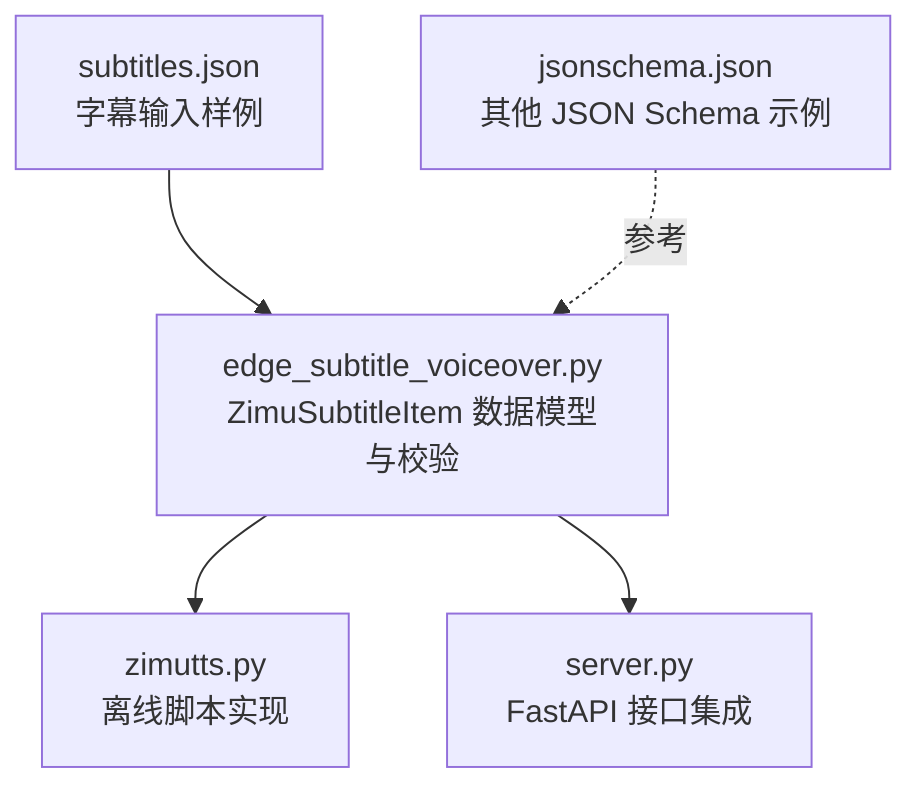
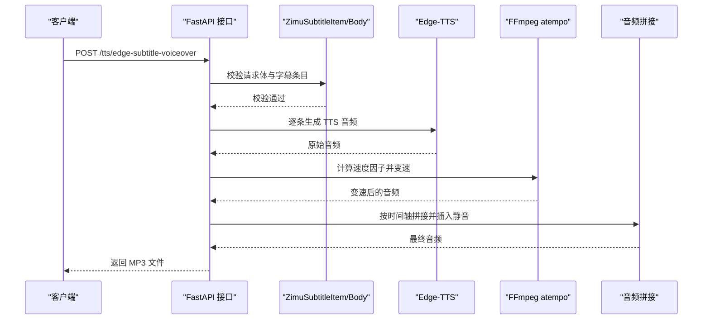
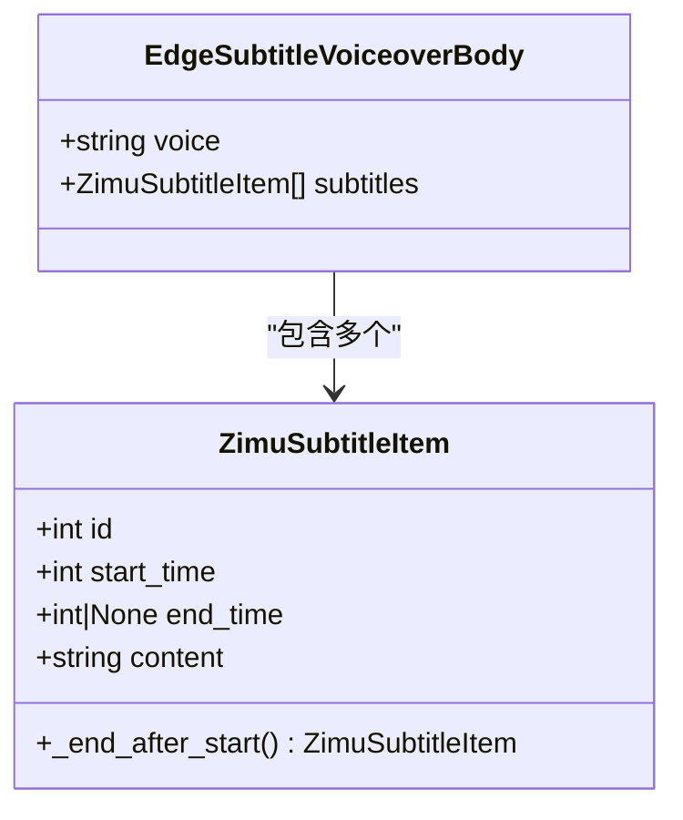
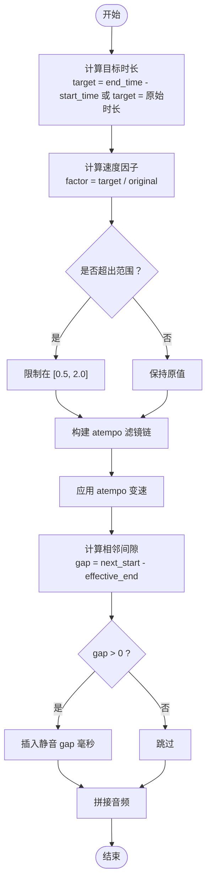
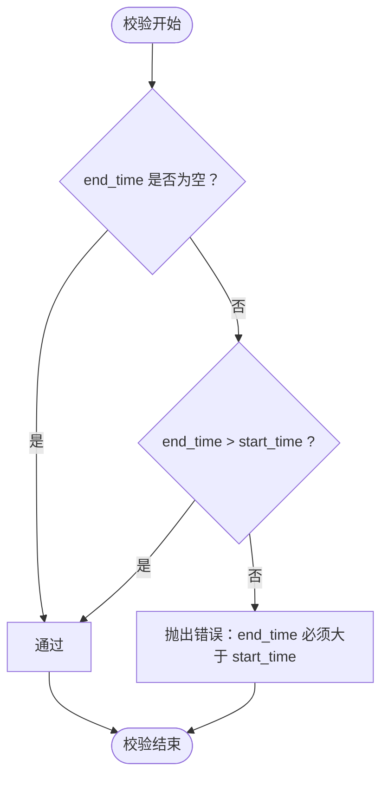
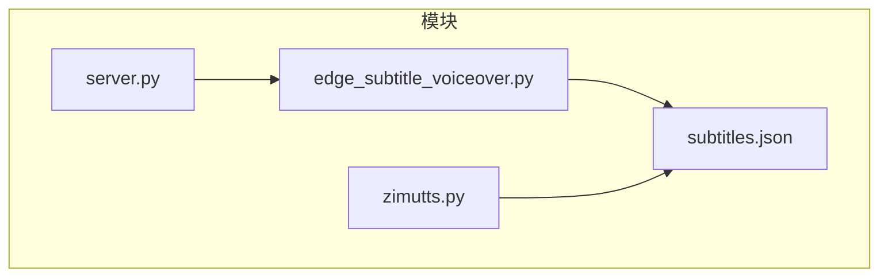

# 字幕时间轴处理

<cite>
**本文引用的文件**
- [subtitles.json](file://subtitles.json)
- [edge_subtitle_voiceover.py](file://edge_subtitle_voiceover.py)
- [zimutts.py](file://zimutts.py)
- [server.py](file://server.py)
- [jsonschema.json](file://jsonschema.json)
</cite>

## 目录
1. [简介](#简介)
2. [项目结构](#项目结构)
3. [核心组件](#核心组件)
4. [架构概览](#架构概览)
5. [详细组件分析](#详细组件分析)
6. [依赖关系分析](#依赖关系分析)
7. [性能考量](#性能考量)
8. [故障排查指南](#故障排查指南)
9. [结论](#结论)
10. [附录](#附录)

## 简介
本技术文档聚焦于字幕时间轴处理，围绕 ZimuSubtitleItem 数据模型的设计原理展开，系统阐述：
- ID 标识、起始时间与结束时间的字段定义与验证规则
- 时间戳解析与字幕内容与时间轴的对齐算法
- 时间范围验证逻辑（结束时间必须大于起始时间）
- 字幕条目结构的 JSON Schema 定义（字段类型、约束与默认值）
- 时间轴计算公式与边界情况处理的实现细节

## 项目结构
该项目包含字幕时间轴处理的核心逻辑与服务端集成：
- 字幕输入样例：subtitles.json
- 字幕时间轴处理与 TTS 配音：edge_subtitle_voiceover.py
- 离线脚本版本：zimutts.py
- 服务端 API 集成：server.py
- 其他 JSON Schema 示例：jsonschema.json

图表来源
- [subtitles.json:1-17](file://subtitles.json#L1-L17)
- [edge_subtitle_voiceover.py:20-34](file://edge_subtitle_voiceover.py#L20-L34)
- [zimutts.py:101-164](file://zimutts.py#L101-L164)
- [server.py:300-322](file://server.py#L300-L322)

章节来源
- [subtitles.json:1-17](file://subtitles.json#L1-L17)
- [edge_subtitle_voiceover.py:1-223](file://edge_subtitle_voiceover.py#L1-L223)
- [zimutts.py:1-164](file://zimutts.py#L1-L164)
- [server.py:1-452](file://server.py#L1-L452)

## 核心组件
- ZimuSubtitleItem：字幕条目的 Pydantic 模型，负责字段定义与时间范围校验
- EdgeSubtitleVoiceoverBody：请求体模型，封装 voice 与字幕数组
- 时间轴对齐流程：逐条生成 TTS 音频，按目标时长进行变速，按时间轴拼接并插入静音间隙
- 服务端接口：提供字幕时间轴配音的 HTTP API

章节来源
- [edge_subtitle_voiceover.py:20-41](file://edge_subtitle_voiceover.py#L20-L41)
- [server.py:300-322](file://server.py#L300-L322)

## 架构概览
字幕时间轴处理的整体流程如下：
- 输入：字幕 JSON（包含 id、start_time、end_time、content）
- 校验：ZimuSubtitleItem 对 start_time 与 end_time 进行约束
- 处理：逐条生成 TTS 音频，计算速度因子，必要时使用 FFmpeg atempo 变速
- 拼接：按时间轴顺序拼接音频，并在相邻条目之间插入静音间隙
- 输出：MP3 文件（可直接下载或生成可访问链接）

图表来源
- [server.py:300-322](file://server.py#L300-L322)
- [edge_subtitle_voiceover.py:166-223](file://edge_subtitle_voiceover.py#L166-L223)
- [zimutts.py:97-164](file://zimutts.py#L97-L164)

## 详细组件分析

### ZimuSubtitleItem 数据模型设计
- 字段定义
  - id：整数，唯一标识
  - start_time：整数，起始时间（毫秒），最小值为 0
  - end_time：整数或空，结束时间（毫秒），可省略
  - content：字符串，字幕文本
- 校验规则
  - start_time ≥ 0
  - 若 end_time 非空，则 end_time > start_time
- 默认值
  - end_time 默认为 null，表示按 TTS 自然时长输出

图表来源
- [edge_subtitle_voiceover.py:20-41](file://edge_subtitle_voiceover.py#L20-L41)

章节来源
- [edge_subtitle_voiceover.py:20-33](file://edge_subtitle_voiceover.py#L20-L33)

### 时间戳解析与对齐算法
- 目标时长计算
  - 若 end_time 为空：目标时长 = 原始 TTS 时长
  - 若 end_time 非空：目标时长 = end_time − start_time
- 速度因子计算
  - speed_factor = target_duration / original_duration
  - 限制在 [0.5, 2.0] 区间，避免声音异常
- 变速处理
  - 使用 FFmpeg atempo 滤镜链，尽量保持音高
  - 将任意倍率拆分为多段 atempo（每段不超过 2.0 或不低于 0.5）
- 音频拼接与静音间隙
  - 逐条拼接变速后的音频
  - 若相邻条目存在时间差 gap = next_start − effective_end，则插入 gap 毫秒静音

图表来源
- [edge_subtitle_voiceover.py:97-114](file://edge_subtitle_voiceover.py#L97-L114)
- [edge_subtitle_voiceover.py:166-223](file://edge_subtitle_voiceover.py#L166-L223)
- [zimutts.py:24-36](file://zimutts.py#L24-L36)
- [zimutts.py:146-153](file://zimutts.py#L146-L153)

章节来源
- [edge_subtitle_voiceover.py:97-114](file://edge_subtitle_voiceover.py#L97-L114)
- [edge_subtitle_voiceover.py:166-223](file://edge_subtitle_voiceover.py#L166-L223)
- [zimutts.py:24-36](file://zimutts.py#L24-L36)
- [zimutts.py:146-153](file://zimutts.py#L146-L153)

### 时间范围验证逻辑
- 约束条件
  - start_time ≥ 0
  - end_time > start_time（当 end_time 非空时）
- 错误提示
  - 当 end_time ≤ start_time 时抛出错误，提示将 end_time 置为 null 以使用自然语速

图表来源
- [edge_subtitle_voiceover.py:29-33](file://edge_subtitle_voiceover.py#L29-L33)

章节来源
- [edge_subtitle_voiceover.py:29-33](file://edge_subtitle_voiceover.py#L29-L33)

### 字幕条目结构的 JSON Schema 定义
以下为与字幕条目结构对应的 JSON Schema 片段（基于实际代码字段与约束）：
- 类型：对象
- 字段与约束
  - id：整数，必填
  - start_time：整数，必填，≥ 0
  - end_time：整数或空，可选，默认 null
  - content：字符串，必填
- 默认值
  - end_time 默认为 null，表示按自然时长输出

章节来源
- [edge_subtitle_voiceover.py:20-27](file://edge_subtitle_voiceover.py#L20-L27)
- [subtitles.json:4-15](file://subtitles.json#L4-L15)

### 边界情况处理
- 原始时长为 0 或负数
  - 速度因子返回 1.0，不进行变速
- 速度因子超出 [0.5, 2.0]
  - 自动限制在范围内
- end_time 为空
  - 使用 TTS 自然时长作为目标时长
- 相邻条目时间差 gap ≤ 0
  - 不插入静音，直接拼接

章节来源
- [edge_subtitle_voiceover.py:97-101](file://edge_subtitle_voiceover.py#L97-L101)
- [edge_subtitle_voiceover.py:193-196](file://edge_subtitle_voiceover.py#L193-L196)
- [zimutts.py:30-36](file://zimutts.py#L30-L36)

## 依赖关系分析
- edge_subtitle_voiceover.py
  - 依赖：pydantic（BaseModel、Field、model_validator）、edge_tts、pydub、subprocess、tempfile、os、shutil
- server.py
  - 依赖：fastapi、uvicorn、edge_subtitle_voiceover（导入 ZimuSubtitleItem、EdgeSubtitleVoiceoverBody、处理函数）
- zimutts.py
  - 依赖：json、asyncio、os、subprocess、tempfile、time、edge_tts、pydub

图表来源
- [edge_subtitle_voiceover.py:1-14](file://edge_subtitle_voiceover.py#L1-L14)
- [server.py:24-31](file://server.py#L24-L31)
- [zimutts.py:1-18](file://zimutts.py#L1-L18)

章节来源
- [edge_subtitle_voiceover.py:1-14](file://edge_subtitle_voiceover.py#L1-L14)
- [server.py:24-31](file://server.py#L24-L31)
- [zimutts.py:1-18](file://zimutts.py#L1-L18)

## 性能考量
- 变速处理
  - 使用 FFmpeg atempo，避免改变采样率导致音高变化
  - 将任意倍率拆分为多段 atempo，保证稳定性
- 并发与异步
  - TTS 生成采用异步接口，结合线程池执行音频处理，减少阻塞
- I/O 优化
  - 临时文件与清理机制，避免磁盘占用与残留
- 时长计算
  - 严格的目标时长与速度因子计算，避免多次重复变速

[本节为通用性能建议，不直接分析具体文件]

## 故障排查指南
- ffmpeg 未找到
  - 症状：运行时报错提示 ffmpeg not found
  - 处理：设置环境变量 FFMPEG_PATH 或将 ffmpeg 加入 PATH；Windows 下可使用 where.exe 查找
- 字幕时间范围非法
  - 症状：校验失败，提示 end_time 必须大于 start_time
  - 处理：修正 end_time 或将其置为 null 以使用自然时长
- 相邻条目时间差为负
  - 症状：静音插入逻辑无效
  - 处理：检查相邻条目的 start_time 与 end_time 设置，确保时间轴连续且递增

章节来源
- [edge_subtitle_voiceover.py:43-81](file://edge_subtitle_voiceover.py#L43-L81)
- [edge_subtitle_voiceover.py:29-33](file://edge_subtitle_voiceover.py#L29-L33)
- [edge_subtitle_voiceover.py:204-211](file://edge_subtitle_voiceover.py#L204-L211)

## 结论
本项目通过 ZimuSubtitleItem 的严谨字段定义与校验，结合目标时长计算与 FFmpeg atempo 变速，实现了字幕内容与时间轴的高精度对齐。服务端接口与离线脚本共享同一套处理逻辑，既满足在线 API 的需求，也便于本地批量处理。通过合理的边界情况处理与错误提示，提升了系统的健壮性与易用性。

[本节为总结性内容，不直接分析具体文件]

## 附录
- 字幕输入样例参考：subtitles.json
- 服务端接口参考：server.py 中的 /tts/edge-subtitle-voiceover 与 /tts/edge-subtitle-voiceover/link
- 其他 JSON Schema 示例参考：jsonschema.json

章节来源
- [subtitles.json:1-17](file://subtitles.json#L1-L17)
- [server.py:300-345](file://server.py#L300-L345)
- [jsonschema.json:1-167](file://jsonschema.json#L1-L167)