# 字幕配音功能

<cite>
**本文档引用的文件**
- [edge_subtitle_voiceover.py](file://edge_subtitle_voiceover.py)
- [server.py](file://server.py)
- [subtitles.json](file://subtitles.json)
- [tts_voices_catalog.json](file://tts_voices_catalog.json)
- [README.md](file://README.md)
- [requirements.txt](file://requirements.txt)
- [zimutts.py](file://zimutts.py)
- [playvideo.py](file://playvideo.py)
- [index.py](file://index.py)
- [ttstest.py](file://ttstest.py)
</cite>

## 目录
1. [简介](#简介)
2. [项目结构](#项目结构)
3. [核心组件](#核心组件)
4. [架构概览](#架构概览)
5. [详细组件分析](#详细组件分析)
6. [字幕时间轴对齐算法](#字幕时间轴对齐算法)
7. [FFmpeg音频处理集成](#ffmpeg音频处理集成)
8. [字幕配音生成流程](#字幕配音生成流程)
9. [缓存机制设计](#缓存机制设计)
10. [字幕格式支持](#字幕格式支持)
11. [音频质量控制](#音频质量控制)
12. [输出格式定制](#输出格式定制)
13. [性能优化策略](#性能优化策略)
14. [故障排除指南](#故障排除指南)
15. [结论](#结论)

## 简介

Vue3Speech 是一个基于 Vue3 和 FastAPI 的语音应用，专注于字幕时间轴对齐的配音功能。该系统集成了多种语音处理技术，包括本地 Qwen3-ASR 语音识别、阿里云 DashScope TTS 语音合成，以及 Microsoft Edge TTS 的字幕配音功能。

本项目的核心创新在于实现了精确的字幕时间轴对齐算法，能够根据字幕的时间戳精确控制配音的起止时间和语速，确保配音与字幕完美同步。系统还提供了完整的 FFmpeg 集成，支持音频格式转换、变速处理和静音填充算法。

## 项目结构

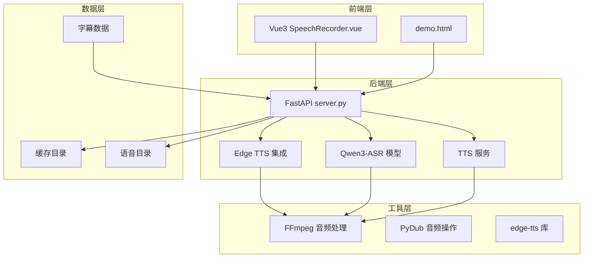

**图表来源**
- [server.py:1-452](file://server.py#L1-L452)
- [edge_subtitle_voiceover.py:1-223](file://edge_subtitle_voiceover.py#L1-L223)

**章节来源**
- [README.md:1-287](file://README.md#L1-L287)
- [requirements.txt:1-13](file://requirements.txt#L1-L13)

## 核心组件

### 主要功能模块

1. **字幕时间轴对齐引擎** - 基于 edge_subtitle_voiceover.py 实现
2. **FastAPI 服务端** - 提供 RESTful API 接口
3. **语音识别服务** - 集成 Qwen3-ASR 模型
4. **语音合成服务** - 支持多种 TTS 引擎
5. **音频处理管道** - 基于 FFmpeg 和 PyDub

### 核心数据结构

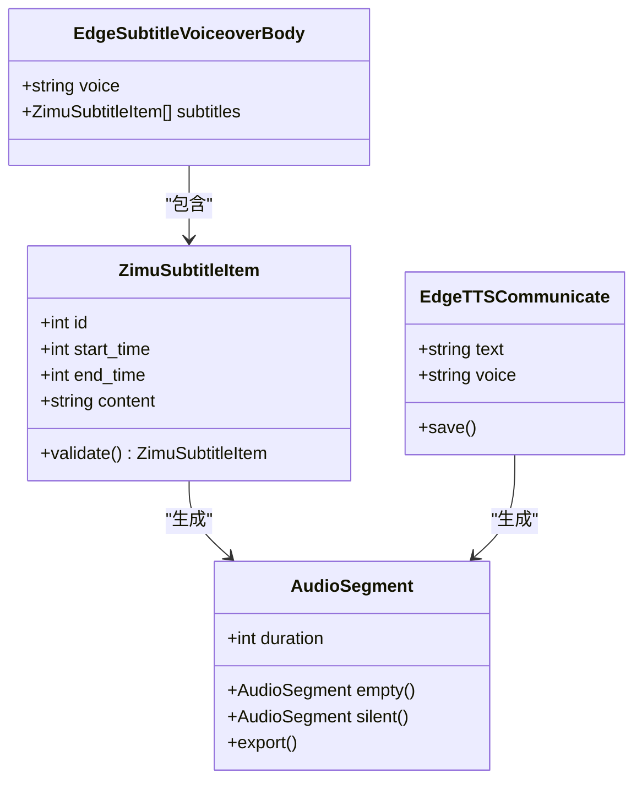

**图表来源**
- [edge_subtitle_voiceover.py:20-41](file://edge_subtitle_voiceover.py#L20-L41)
- [edge_subtitle_voiceover.py:148-151](file://edge_subtitle_voiceover.py#L148-L151)

**章节来源**
- [edge_subtitle_voiceover.py:20-41](file://edge_subtitle_voiceover.py#L20-L41)
- [edge_subtitle_voiceover.py:148-151](file://edge_subtitle_voiceover.py#L148-L151)

## 架构概览

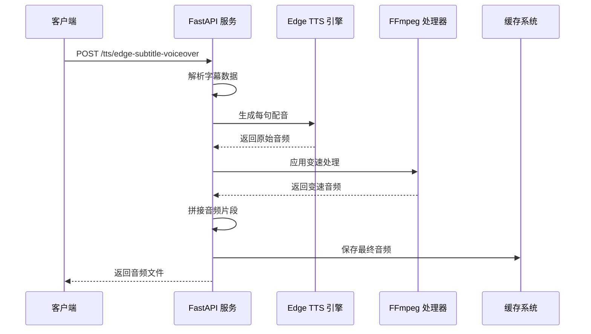

**图表来源**
- [server.py:300-322](file://server.py#L300-L322)
- [edge_subtitle_voiceover.py:166-223](file://edge_subtitle_voiceover.py#L166-L223)

## 详细组件分析

### 字幕时间轴对齐引擎

字幕时间轴对齐引擎是整个系统的核心组件，负责将字幕内容与音频进行精确的时间轴对齐。

#### 核心算法实现

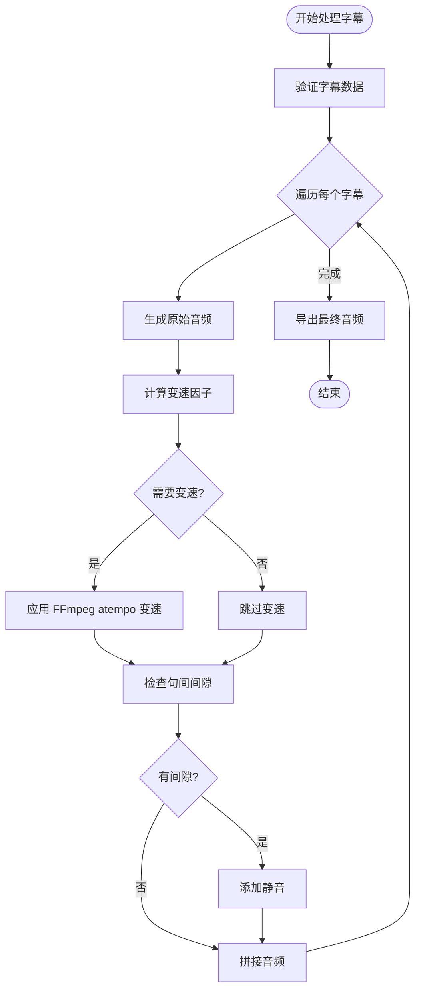

**图表来源**
- [edge_subtitle_voiceover.py:166-223](file://edge_subtitle_voiceover.py#L166-L223)

#### 关键实现细节

1. **时间戳解析**：支持毫秒级精度的时间戳解析
2. **片段分割**：根据字幕边界精确分割音频片段
3. **音频同步**：通过变速处理确保音频与字幕严格对齐

**章节来源**
- [edge_subtitle_voiceover.py:166-223](file://edge_subtitle_voiceover.py#L166-L223)

### FFmpeg 集成模块

FFmpeg 集成模块提供了强大的音频处理能力，包括格式转换、变速处理和静音填充。

#### 音频格式转换

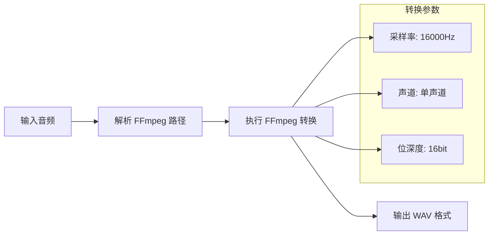

**图表来源**
- [edge_subtitle_voiceover.py:84-94](file://edge_subtitle_voiceover.py#L84-L94)

#### 变速处理算法

变速处理算法使用 FFmpeg 的 atempo 滤镜，通过将任意变速需求分解为多个 0.5-2.0 范围内的简单变速组合来实现。

**章节来源**
- [edge_subtitle_voiceover.py:84-94](file://edge_subtitle_voiceover.py#L84-L94)
- [edge_subtitle_voiceover.py:117-146](file://edge_subtitle_voiceover.py#L117-L146)

### FastAPI 服务端

FastAPI 服务端提供了完整的 RESTful API 接口，支持字幕配音的完整工作流程。

#### API 接口设计

```mermaid
graph TB
subgraph "字幕配音接口"
V1[/tts/edge-subtitle-voiceover]
V2[/tts/edge-subtitle-voiceover/link]
V3[/tts/edge-voiceover-files/{file_id}]
end
subgraph "语音服务接口"
V4[/tts/voices]
V5[/tts/edge-voices]
V6[/tts]
end
subgraph "音频处理接口"
V7[/transcribe]
V8[/ws/asr]
end
V1 --> V2
V2 --> V3
V4 --> V5
V7 --> V8
```

**图表来源**
- [server.py:300-361](file://server.py#L300-L361)

**章节来源**
- [server.py:300-361](file://server.py#L300-L361)

## 字幕时间轴对齐算法

### 时间戳解析机制

字幕时间轴对齐算法的核心在于精确解析和处理时间戳数据。

#### 时间戳验证逻辑

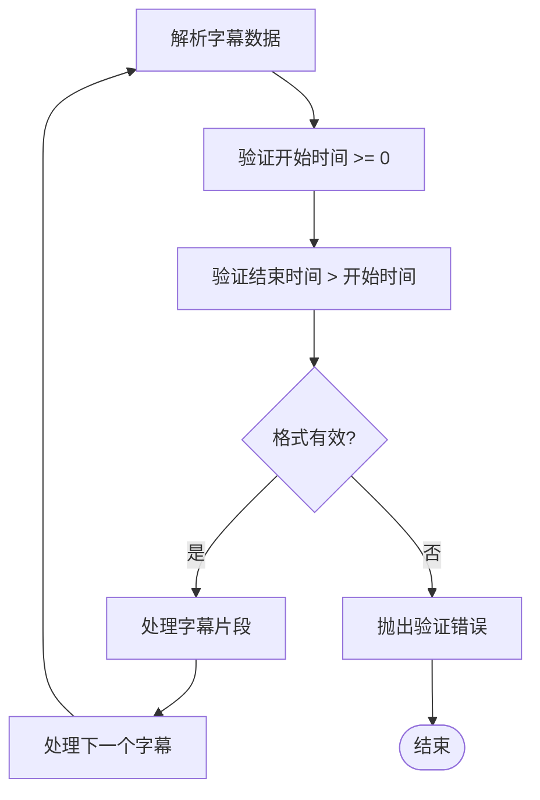

**图表来源**
- [edge_subtitle_voiceover.py:29-33](file://edge_subtitle_voiceover.py#L29-L33)

#### 变速因子计算

变速因子的计算公式为：`speed_factor = target_duration_ms / original_duration_ms`

系统对变速范围进行了限制，确保音频质量：
- 最小变速：0.5x（加速2倍）
- 最大变速：2.0x（减速0.5倍）

**章节来源**
- [edge_subtitle_voiceover.py:29-33](file://edge_subtitle_voiceover.py#L29-L33)
- [edge_subtitle_voiceover.py:97-101](file://edge_subtitle_voiceover.py#L97-L101)

### 片段分割算法

片段分割算法根据字幕的时间边界精确分割音频，确保每个字幕片段的音频长度与字幕显示时间完全匹配。

#### 分割流程

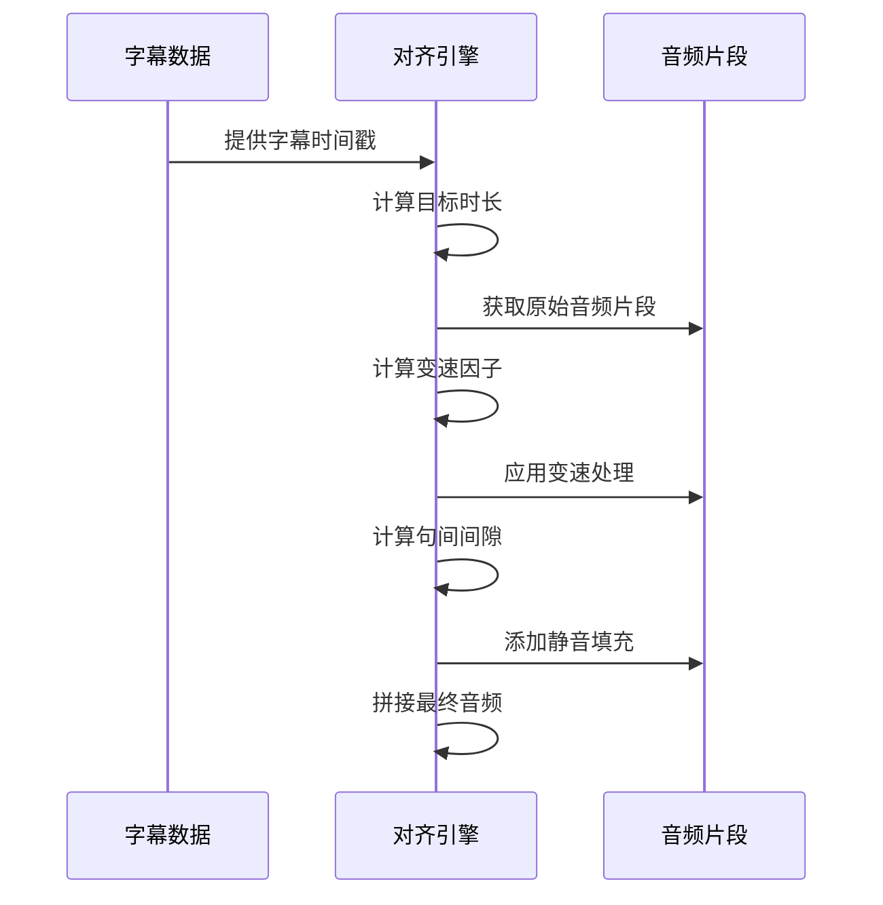

**图表来源**
- [edge_subtitle_voiceover.py:187-212](file://edge_subtitle_voiceover.py#L187-L212)

**章节来源**
- [edge_subtitle_voiceover.py:187-212](file://edge_subtitle_voiceover.py#L187-L212)

## FFmpeg音频处理集成

### 音频格式转换

系统集成了 FFmpeg 用于音频格式转换，确保所有输入音频都能转换为统一的 WAV 格式。

#### 转换参数配置

| 参数 | 值 | 说明 |
|------|-----|------|
| 采样率 | 16000 Hz | 符合语音识别要求 |
| 声道数 | 1 声道 | 单声道便于处理 |
| 位深度 | 16 bit | 标准音频质量 |
| 输入格式 | 支持多种 | 包括 MP3、M4A、OGG、WEBM、FLAC |

#### FFmpeg 路径解析机制

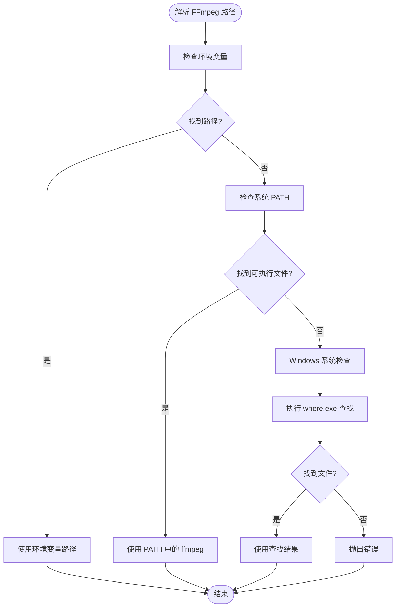

**图表来源**
- [edge_subtitle_voiceover.py:43-81](file://edge_subtitle_voiceover.py#L43-L81)

**章节来源**
- [edge_subtitle_voiceover.py:43-81](file://edge_subtitle_voiceover.py#L43-L81)
- [edge_subtitle_voiceover.py:84-94](file://edge_subtitle_voiceover.py#L84-L94)

### 变速处理算法

变速处理算法使用 FFmpeg 的 atempo 滤镜，通过将任意变速需求分解为多个 0.5-2.0 范围内的简单变速组合来实现。

#### atempo 滤镜构建

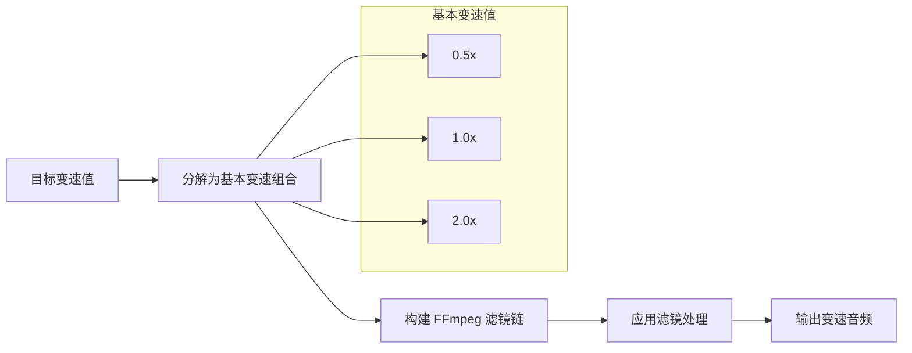

**图表来源**
- [edge_subtitle_voiceover.py:104-114](file://edge_subtitle_voiceover.py#L104-L114)

**章节来源**
- [edge_subtitle_voiceover.py:104-114](file://edge_subtitle_voiceover.py#L104-L114)
- [edge_subtitle_voiceover.py:117-146](file://edge_subtitle_voiceover.py#L117-L146)

### 静音填充算法

静音填充算法根据相邻字幕之间的时间间隙自动生成静音片段，确保音频流的连续性和自然性。

#### 间隙检测与处理

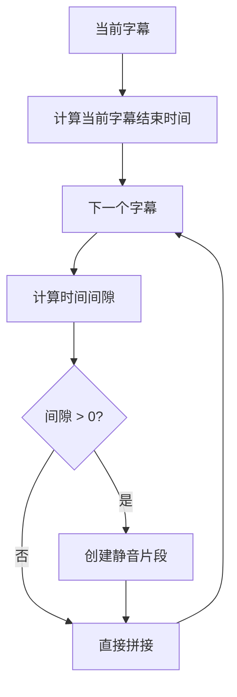

**图表来源**
- [edge_subtitle_voiceover.py:203-212](file://edge_subtitle_voiceover.py#L203-L212)

**章节来源**
- [edge_subtitle_voiceover.py:203-212](file://edge_subtitle_voiceover.py#L203-L212)

## 字幕配音生成流程

### 完整生成流程

字幕配音的生成流程是一个复杂的多步骤处理过程，涉及字幕解析、音频生成、变速处理和最终输出。

#### 生成流程图

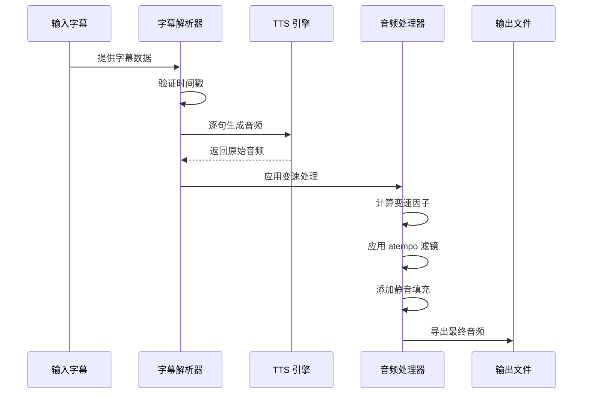

**图表来源**
- [edge_subtitle_voiceover.py:166-223](file://edge_subtitle_voiceover.py#L166-L223)

### 错误处理机制

系统实现了完善的错误处理机制，确保在各种异常情况下都能提供稳定的处理能力。

#### 错误处理流程

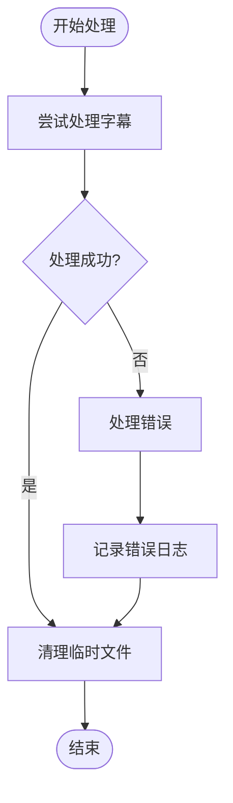

**图表来源**
- [edge_subtitle_voiceover.py:213-222](file://edge_subtitle_voiceover.py#L213-L222)

**章节来源**
- [edge_subtitle_voiceover.py:166-223](file://edge_subtitle_voiceover.py#L166-L223)

## 缓存机制设计

### 服务端缓存系统

系统实现了服务端缓存机制，用于存储生成的字幕配音文件，提高重复访问的效率。

#### 缓存目录结构

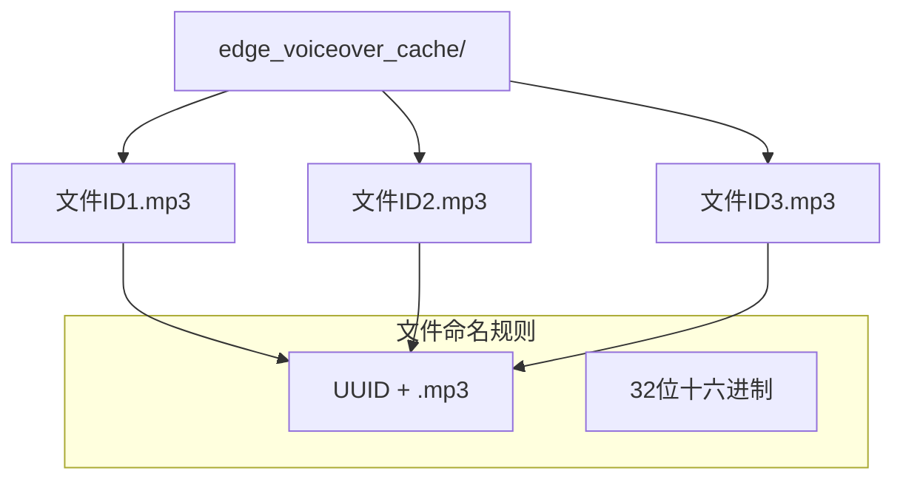

**图表来源**
- [server.py:332-345](file://server.py#L332-L345)

#### 缓存管理策略

1. **文件命名**：使用 UUID 确保文件名唯一性
2. **目录组织**：统一存储在 edge_voiceover_cache 目录
3. **URL 生成**：自动生成可访问的 URL 路径
4. **清理策略**：支持手动清理和定期维护

**章节来源**
- [server.py:332-361](file://server.py#L332-L361)

### 性能优化考虑

缓存机制的设计充分考虑了性能优化，包括文件系统操作的最小化和内存使用的优化。

## 字幕格式支持

### 支持的字幕格式

系统支持多种字幕格式，能够灵活处理不同来源的字幕数据。

#### 字幕数据结构

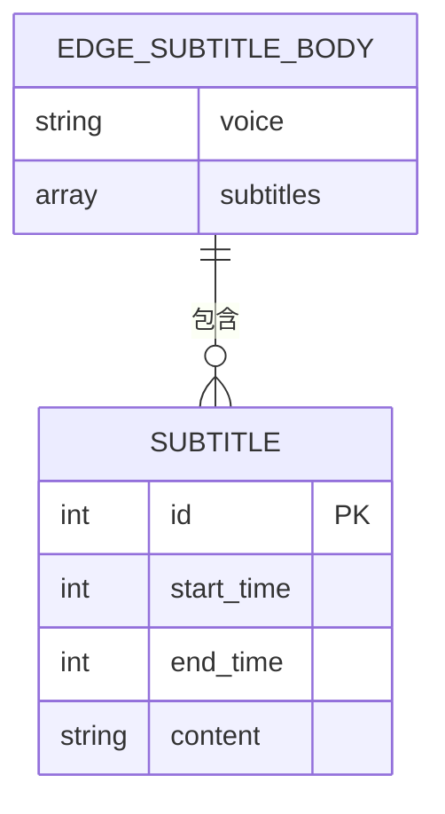

**图表来源**
- [edge_subtitle_voiceover.py:20-41](file://edge_subtitle_voiceover.py#L20-L41)

#### 字幕数据验证

系统对字幕数据进行了严格的验证，确保数据的完整性和正确性。

**章节来源**
- [edge_subtitle_voiceover.py:20-41](file://edge_subtitle_voiceover.py#L20-L41)

### 字幕解析示例

字幕数据通常采用 JSON 格式，包含字幕 ID、开始时间、结束时间和内容文本。

**章节来源**
- [subtitles.json:1-17](file://subtitles.json#L1-L17)

## 音频质量控制

### 音频参数配置

系统在音频处理过程中采用了多项质量控制措施，确保输出音频的高质量。

#### 音频参数设置

| 参数 | 值 | 说明 |
|------|-----|------|
| 采样率 | 16000 Hz | 符合语音识别和合成要求 |
| 声道数 | 1 声道 | 单声道便于处理和传输 |
| 位深度 | 16 bit | 标准音频质量 |
| 变速范围 | 0.5x - 2.0x | 保证音质稳定 |

#### 音质保护机制

1. **变速限制**：防止过度变速影响音质
2. **静音处理**：避免音频突变造成听觉不适
3. **格式统一**：确保输出格式的一致性

**章节来源**
- [edge_subtitle_voiceover.py:97-101](file://edge_subtitle_voiceover.py#L97-L101)
- [edge_subtitle_voiceover.py:117-146](file://edge_subtitle_voiceover.py#L117-L146)

## 输出格式定制

### 支持的输出格式

系统目前主要支持 MP3 格式的音频输出，同时保留了扩展其他格式的能力。

#### 输出格式选项

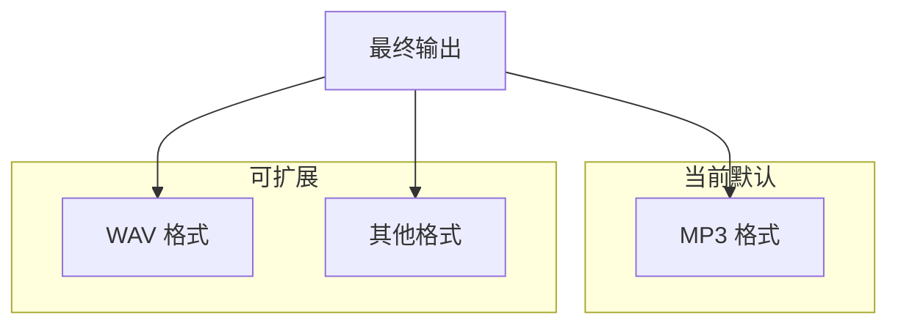

**图表来源**
- [edge_subtitle_voiceover.py:212](file://edge_subtitle_voiceover.py#L212)

### 输出质量控制

系统提供了多种输出质量控制选项，用户可以根据需要调整音频质量。

**章节来源**
- [edge_subtitle_voiceover.py:212](file://edge_subtitle_voiceover.py#L212)

## 性能优化策略

### 多线程处理

系统采用了多线程处理策略，充分利用多核 CPU 的计算能力。

#### 并行处理机制

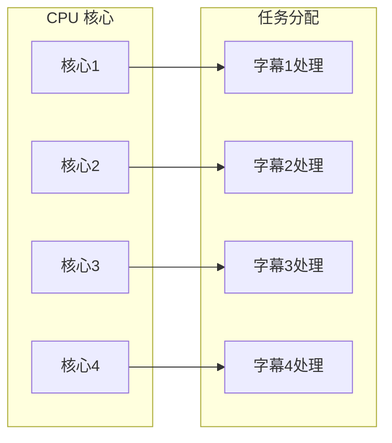

**图表来源**
- [edge_subtitle_voiceover.py:198-201](file://edge_subtitle_voiceover.py#L198-L201)

### 内存管理优化

系统实现了高效的内存管理策略，避免内存泄漏和过度占用。

#### 内存清理机制

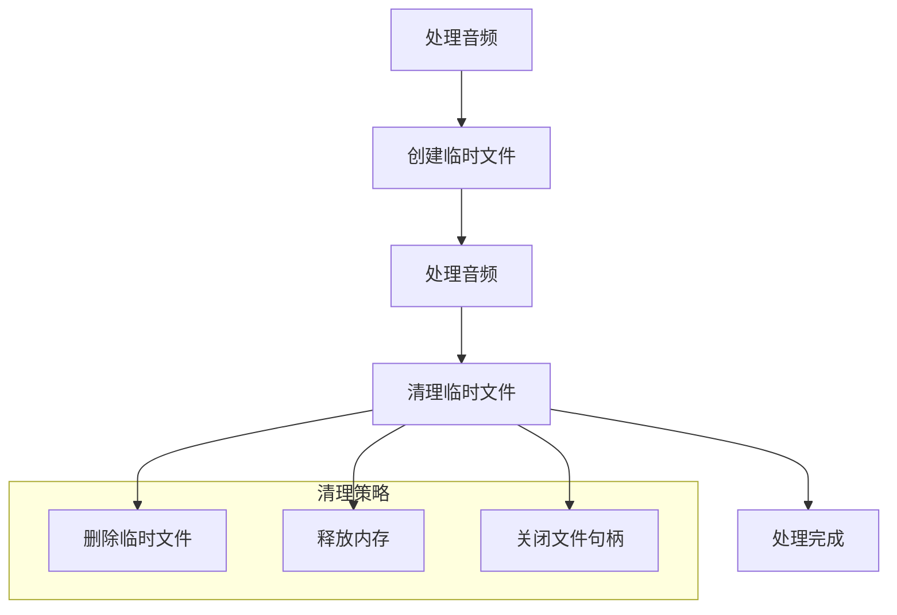

**图表来源**
- [edge_subtitle_voiceover.py:153-164](file://edge_subtitle_voiceover.py#L153-L164)

**章节来源**
- [edge_subtitle_voiceover.py:153-164](file://edge_subtitle_voiceover.py#L153-L164)

## 故障排除指南

### 常见问题及解决方案

#### FFmpeg 相关问题

| 问题描述 | 可能原因 | 解决方案 |
|----------|----------|----------|
| 找不到 ffmpeg | 环境变量未设置 | 在 .env 中设置 FFMPEG_PATH |
| Windows 系统找不到 | IDE 启动环境问题 | 使用 where.exe 查找并设置绝对路径 |
| 转码失败 | 输入格式不受支持 | 确保输入文件格式正确 |

#### 字幕数据问题

| 问题描述 | 可能原因 | 解决方案 |
|----------|----------|----------|
| 时间戳无效 | 开始时间大于结束时间 | 检查字幕数据格式 |
| 内容为空 | 字幕内容缺失 | 验证字幕文件完整性 |
| 语音不可用 | Edge TTS 服务问题 | 检查网络连接和 API 密钥 |

**章节来源**
- [README.md:194-204](file://README.md#L194-L204)

### 调试工具

系统提供了多种调试工具，帮助开发者快速定位和解决问题。

#### 调试功能

1. **日志记录**：详细的错误日志和处理过程记录
2. **状态监控**：实时监控系统运行状态
3. **性能分析**：分析处理时间和资源使用情况

## 结论

Vue3Speech 的字幕配音功能通过精心设计的算法和架构，实现了高质量的字幕时间轴对齐和音频处理。系统的主要优势包括：

1. **精确的时间轴对齐**：通过毫秒级精度的时间戳处理，确保配音与字幕完美同步
2. **强大的音频处理能力**：集成了 FFmpeg 的强大音频处理功能，支持多种格式和变速处理
3. **灵活的缓存机制**：提供服务端缓存，提高重复访问的效率
4. **完善的错误处理**：实现多层次的错误处理和恢复机制
5. **良好的扩展性**：模块化的架构设计，便于功能扩展和定制

该系统为字幕配音应用提供了完整的解决方案，适用于各种场景下的字幕同步需求。通过合理的性能优化和质量控制，系统能够在保证音频质量的同时，提供高效的处理能力。

未来的发展方向包括支持更多的字幕格式、优化处理速度、增强音频质量控制等功能，进一步提升用户体验和应用价值。