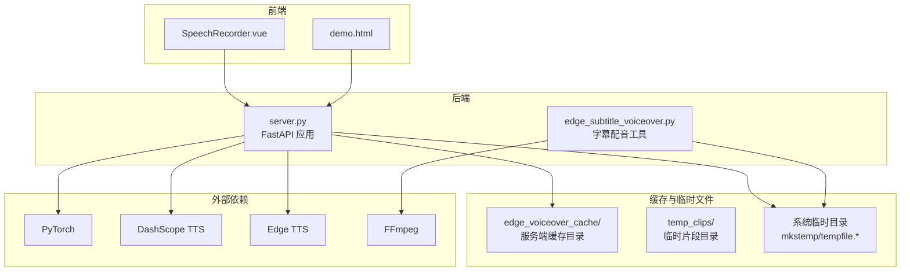
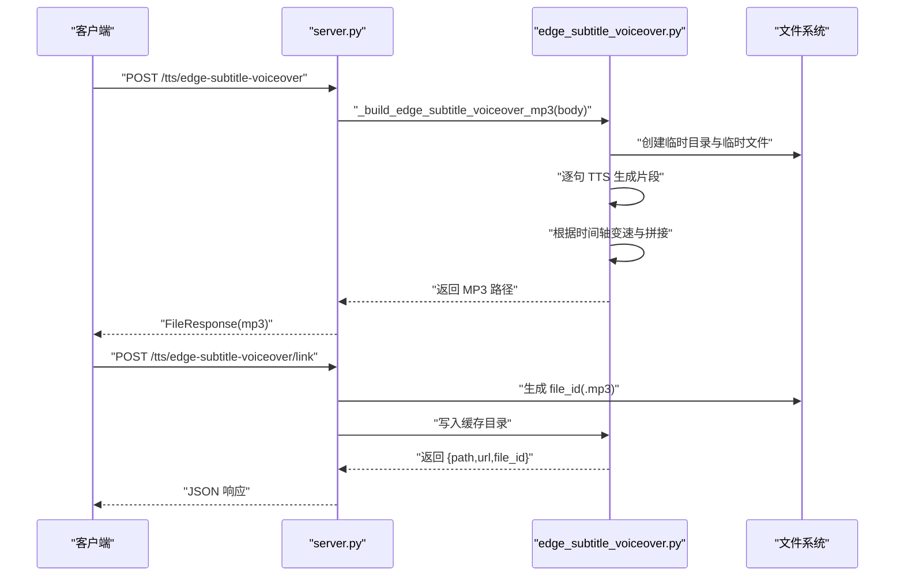
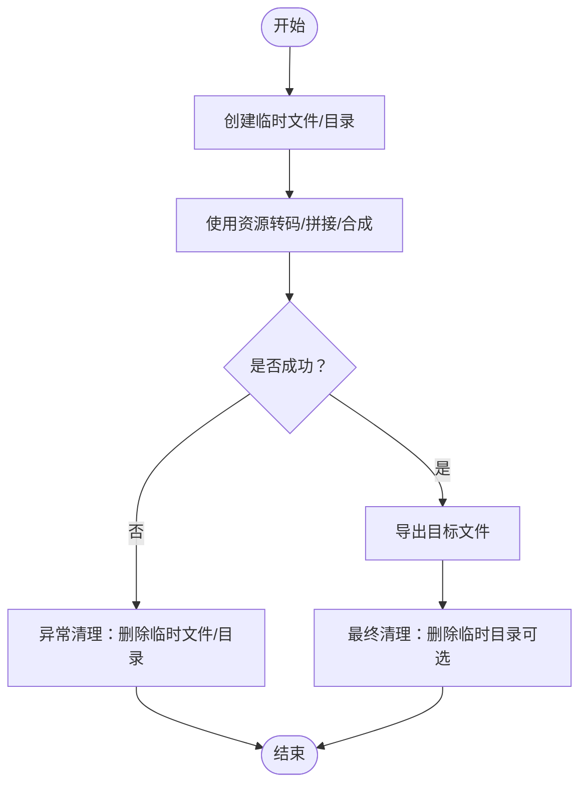
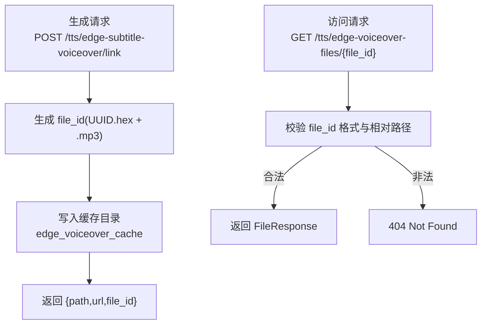
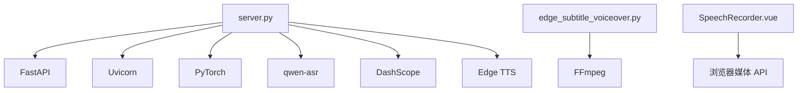

# 缓存管理与性能优化

<cite>
**本文引用的文件**
- [server.py](file://server.py)
- [edge_subtitle_voiceover.py](file://edge_subtitle_voiceover.py)
- [SpeechRecorder.vue](file://SpeechRecorder.vue)
- [README.md](file://README.md)
- [requirements.txt](file://requirements.txt)
- [tts_voices_catalog.json](file://tts_voices_catalog.json)
- [subtitles.json](file://subtitles.json)
- [demo.html](file://demo.html)
- [playvideo.py](file://playvideo.py)
</cite>

## 目录
1. [简介](#简介)
2. [项目结构](#项目结构)
3. [核心组件](#核心组件)
4. [架构总览](#架构总览)
5. [详细组件分析](#详细组件分析)
6. [依赖分析](#依赖分析)
7. [性能考虑](#性能考虑)
8. [故障排查指南](#故障排查指南)
9. [结论](#结论)
10. [附录](#附录)

## 简介
本技术文档聚焦于本项目的缓存管理与性能优化实践，涵盖以下主题：
- 临时文件管理策略：临时目录创建、文件命名规范、清理机制
- 缓存目录设计：edge_voiceover_cache 的作用与文件组织结构
- 内存管理优化：音频对象生命周期管理与垃圾回收策略
- 性能监控指标：处理时间统计、内存使用监控、并发控制
- 错误恢复机制：部分失败时的回滚策略与资源清理方法

## 项目结构
项目采用前后端分离架构，后端基于 FastAPI 提供 ASR、TTS、字幕配音等能力；前端包含 Vue3 组件与演示页面。关键目录与文件如下：
- 后端服务：server.py（FastAPI 应用、WebSocket 实时识别、ASR/TTS 接口、缓存与临时文件管理）
- 字幕配音工具：edge_subtitle_voiceover.py（字幕时间轴配音、临时文件清理）
- 前端组件：SpeechRecorder.vue（浏览器录音与上传）、demo.html（演示页面）
- 配置与依赖：requirements.txt、tts_voices_catalog.json、subtitles.json
- 辅助工具：playvideo.py（远程音频播放与临时文件清理）

图表来源
- [server.py](file://server.py)
- [edge_subtitle_voiceover.py](file://edge_subtitle_voiceover.py)
- [SpeechRecorder.vue](file://SpeechRecorder.vue)
- [demo.html](file://demo.html)

章节来源
- [README.md](file://README.md)
- [requirements.txt](file://requirements.txt)

## 核心组件
- 临时文件管理器：在上传音频、WebSocket 识别、字幕配音等流程中，统一使用临时文件进行中间存储，确保资源及时释放。
- 缓存目录管理器：服务端缓存目录用于持久化生成的配音文件，提供安全的文件命名与访问控制。
- 并发与锁：使用异步锁保护共享资源（如 ASR 推理），避免并发冲突。
- 错误恢复与清理：在异常路径中执行资源清理，确保系统稳定。

章节来源
- [server.py](file://server.py)
- [edge_subtitle_voiceover.py](file://edge_subtitle_voiceover.py)

## 架构总览
后端服务通过 FastAPI 提供多种接口，涉及音频转写、实时识别、TTS 合成与字幕配音。字幕配音流程依赖 FFmpeg 进行音频变速与拼接，期间大量使用临时文件；服务端还提供将生成的 MP3 写入缓存目录的能力，便于后续访问。

图表来源
- [server.py](file://server.py)
- [edge_subtitle_voiceover.py](file://edge_subtitle_voiceover.py)

## 详细组件分析

### 临时文件管理策略
- 临时目录创建
  - 服务端在转写流程中使用临时文件保存上传音频与转码后的 WAV 文件，确保跨平台兼容与资源隔离。
  - 字幕配音流程在项目根目录创建临时目录存放中间片段，并在完成后清理。
- 文件命名规范
  - 使用系统提供的临时文件命名规则，避免文件名冲突；字幕配音场景中使用带前缀的临时文件名，便于识别与清理。
- 清理机制
  - 在 finally 块中删除临时文件，确保即使发生异常也能释放资源。
  - 字幕配音流程在最终导出后清理临时目录，同时提供集中清理函数以应对异常路径。

图表来源
- [server.py](file://server.py)
- [edge_subtitle_voiceover.py](file://edge_subtitle_voiceover.py)

章节来源
- [server.py](file://server.py)
- [edge_subtitle_voiceover.py](file://edge_subtitle_voiceover.py)

### 缓存目录设计：edge_voiceover_cache
- 作用
  - 作为服务端缓存目录，存放通过链接接口生成的 MP3 文件，便于后续 GET 访问与复用。
- 文件组织结构
  - 目录名：edge_voiceover_cache
  - 文件命名：UUID 前缀 + .mp3，使用正则表达式进行合法性校验，防止路径穿越与非法访问。
  - 访问控制：严格校验文件 ID 与缓存目录的相对路径，确保只允许访问缓存目录内的文件。
- 生命周期管理
  - 生成：POST /tts/edge-subtitle-voiceover/link 将 MP3 写入缓存目录并返回可访问的 URL 与相对路径。
  - 访问：GET /tts/edge-voiceover-files/{file_id} 提供文件下载。
  - 清理：建议定期清理或增加过期策略，避免磁盘空间膨胀。

图表来源
- [server.py](file://server.py)

章节来源
- [server.py](file://server.py)

### 内存管理优化：音频对象生命周期与垃圾回收
- 音频对象生命周期
  - 字幕配音流程中，逐句生成音频片段并进行变速调整，最终拼接为完整音频。在导出前，确保中间对象及时释放。
  - 使用异步线程执行耗时操作（如 FFmpeg 变速），避免阻塞事件循环。
- 垃圾回收策略
  - 在异常路径与最终清理阶段，统一调用清理函数删除临时文件与目录，减少内存与磁盘占用。
  - 对于浏览器侧的音频播放，使用对象 URL 时注意在不再需要时撤销，避免内存泄漏。

章节来源
- [edge_subtitle_voiceover.py](file://edge_subtitle_voiceover.py)
- [demo.html](file://demo.html)

### 性能监控指标
- 处理时间统计
  - WebSocket 实时识别：通过解码间隔与滑动窗口参数控制识别频率与延迟，可在环境变量中调整（如解码间隔、最大窗口）。
  - 转写接口：记录上传、转码、推理与响应的总耗时，结合日志级别与访问日志开关进行观测。
- 内存使用监控
  - 通过系统监控工具观察进程内存占用，关注音频对象与临时文件的峰值使用。
  - 在字幕配音流程中，合理控制单次处理的字幕数量，避免一次性生成过多片段导致内存压力。
- 并发控制
  - 使用异步锁保护 ASR 推理，避免多请求并发导致显存不足或 OOM。
  - 对外部服务（如 DashScope）的调用进行限流与超时控制，防止阻塞。

章节来源
- [server.py](file://server.py)
- [README.md](file://README.md)

### 错误恢复机制
- 部分失败时的回滚策略
  - 字幕配音：在异常路径中删除已生成的临时文件与目录，避免残留文件占用磁盘。
  - 转写接口：在转码失败时返回明确的错误信息，并清理临时文件。
- 资源清理方法
  - 统一使用 finally 块删除临时文件与目录。
  - 提供集中清理函数，支持传入多个路径进行批量清理。
  - 对于浏览器侧的音频对象 URL，及时撤销以释放内存。

章节来源
- [server.py](file://server.py)
- [edge_subtitle_voiceover.py](file://edge_subtitle_voiceover.py)

## 依赖分析
- 后端依赖
  - FastAPI、Uvicorn：Web 框架与服务器
  - PyTorch、qwen-asr：本地 ASR 推理
  - DashScope：云端 TTS 合成
  - Edge TTS：本地字幕配音
  - FFmpeg：音频转码与变速
- 前端依赖
  - Vue3：录音组件与交互
  - 浏览器媒体 API：录音与 WebSocket

图表来源
- [requirements.txt](file://requirements.txt)
- [server.py](file://server.py)
- [edge_subtitle_voiceover.py](file://edge_subtitle_voiceover.py)

章节来源
- [requirements.txt](file://requirements.txt)

## 性能考虑
- 临时文件与缓存
  - 合理设置临时文件的前缀与后缀，避免与其他文件冲突；在流程结束后立即清理。
  - 对于缓存目录，建议实现定期清理策略或基于 TTL 的过期机制，防止磁盘空间无限增长。
- 并发与锁
  - 使用异步锁保护共享资源，避免并发冲突；根据硬件条件调整批处理大小与解码间隔。
- 外部工具
  - FFmpeg 的路径解析与缓存，避免重复查找；在 Windows 环境下优先使用绝对路径。
- 前端体验
  - 浏览器端的音频播放与撤销对象 URL，减少内存占用；在网络不佳时考虑回退到本地播放。

## 故障排查指南
- FFmpeg 未找到
  - 现象：转码失败或字幕配音时报错
  - 处理：在 .env 中设置 FFMPEG_PATH 指向 ffmpeg.exe 绝对路径，或将 ffmpeg 加入系统 PATH
- WebSocket 识别异常
  - 现象：实时识别无输出或报错
  - 处理：检查解码间隔与最大窗口参数，确保浏览器端采样率与通道数符合要求
- 缓存文件无法访问
  - 现象：GET /tts/edge-voiceover-files/{file_id} 返回 404
  - 处理：确认 file_id 格式正确且位于缓存目录内，检查相对路径校验逻辑

章节来源
- [README.md](file://README.md)
- [server.py](file://server.py)
- [edge_subtitle_voiceover.py](file://edge_subtitle_voiceover.py)

## 结论
本项目通过统一的临时文件管理、严格的缓存目录设计与完善的错误恢复机制，实现了高效稳定的语音识别与合成能力。建议在生产环境中进一步完善缓存清理策略、并发控制与性能监控，以提升整体稳定性与用户体验。

## 附录
- 相关配置与接口
  - 环境变量：UVICORN_HOST、UVICORN_PORT、ASR_WS_DECODE_INTERVAL_S、ASR_WS_MAX_WINDOW_S、FFMPEG_PATH 等
  - 接口：/transcribe、/ws/asr、/tts、/tts/edge-subtitle-voiceover、/tts/edge-subtitle-voiceover/link、/tts/edge-voiceover-files/{file_id}

章节来源
- [README.md](file://README.md)
- [server.py](file://server.py)
- [edge_subtitle_voiceover.py](file://edge_subtitle_voiceover.py)