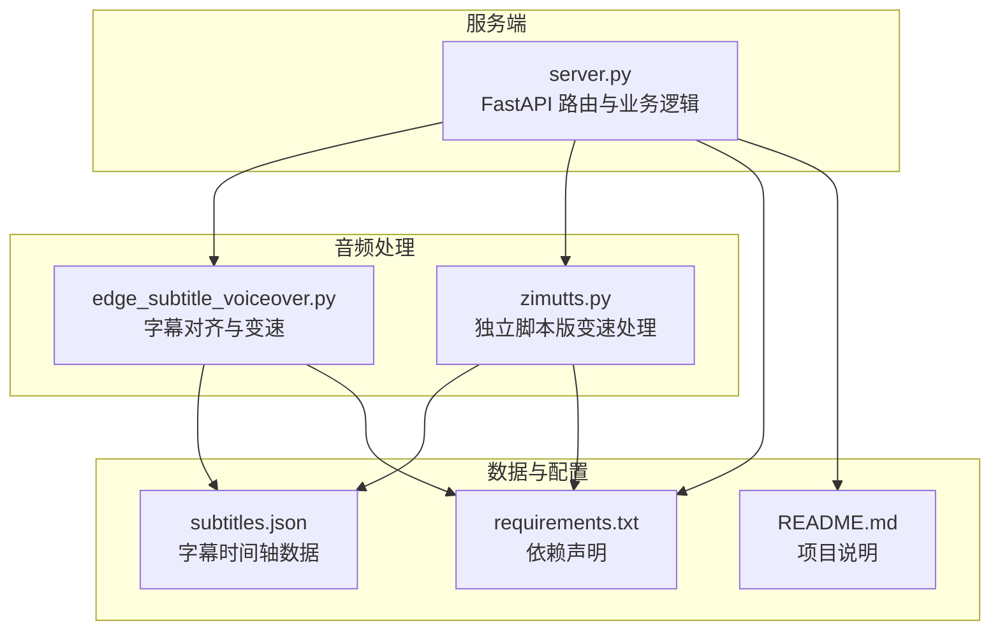
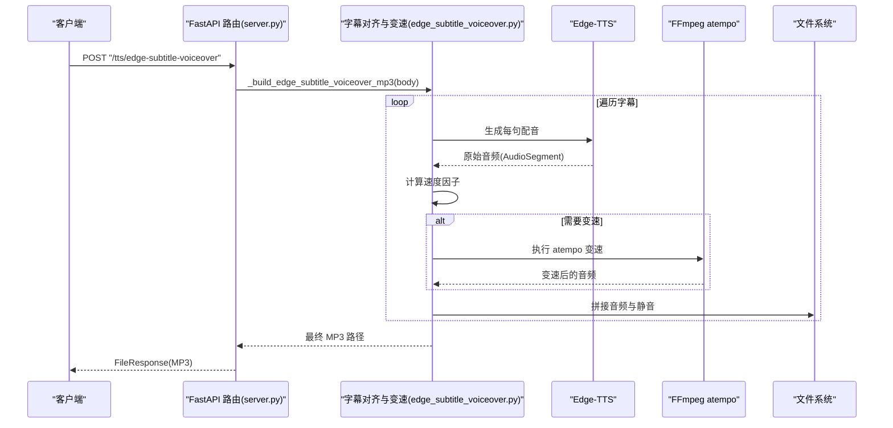
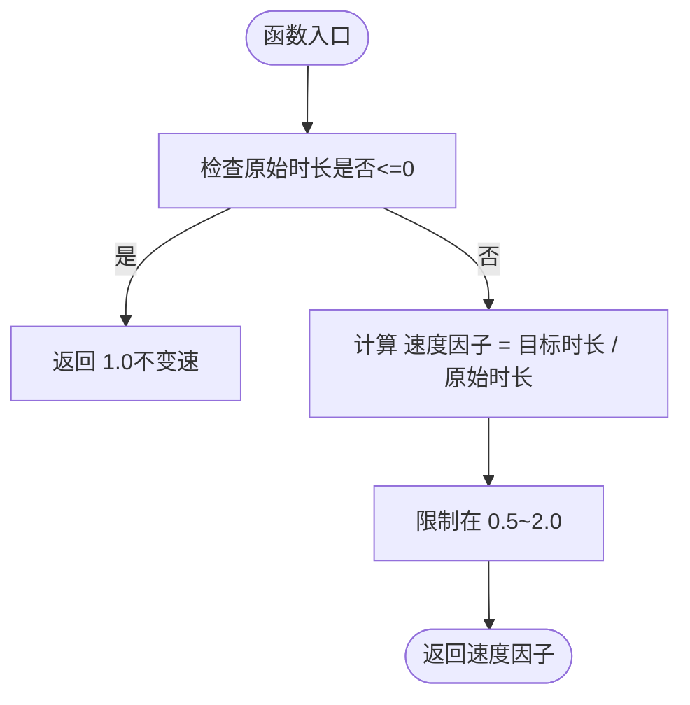
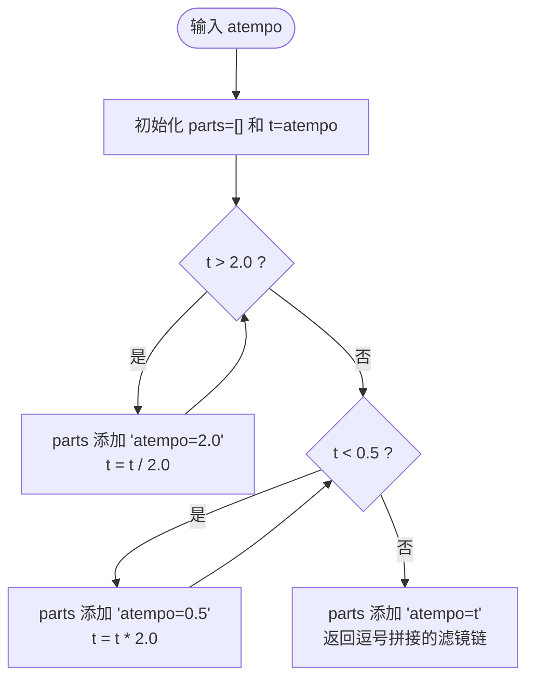
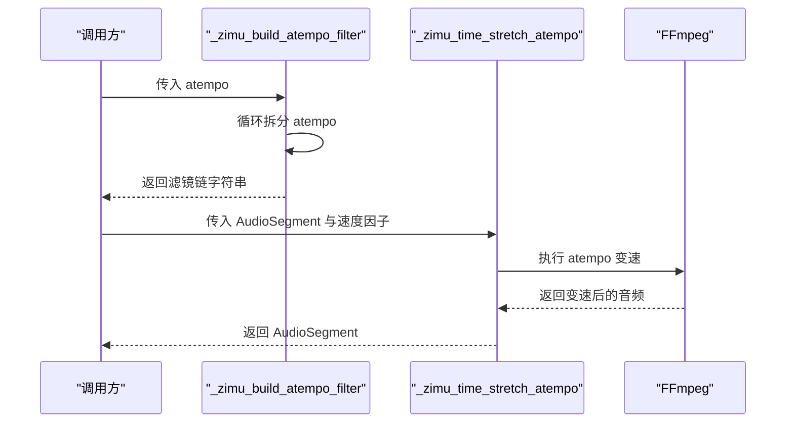
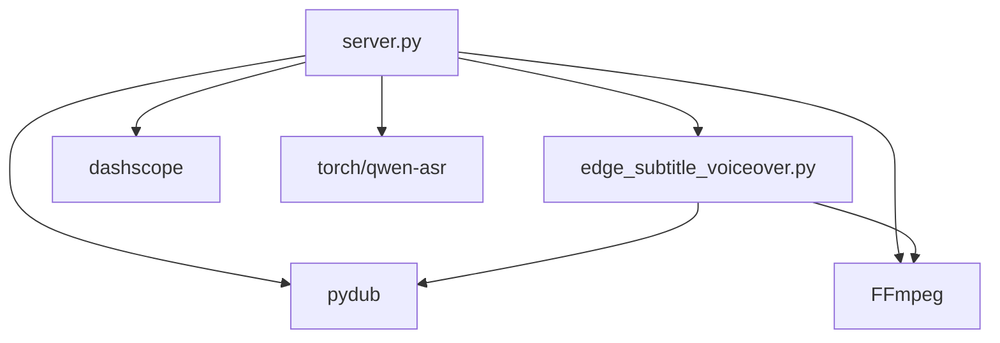

# 音频变速处理

<cite>
**本文引用的文件**
- [edge_subtitle_voiceover.py](file://edge_subtitle_voiceover.py)
- [server.py](file://server.py)
- [zimutts.py](file://zimutts.py)
- [subtitles.json](file://subtitles.json)
- [requirements.txt](file://requirements.txt)
- [README.md](file://README.md)
</cite>

## 目录
1. [简介](#简介)
2. [项目结构](#项目结构)
3. [核心组件](#核心组件)
4. [架构概览](#架构概览)
5. [详细组件分析](#详细组件分析)
6. [依赖分析](#依赖分析)
7. [性能考虑](#性能考虑)
8. [故障排查指南](#故障排查指南)
9. [结论](#结论)

## 简介
本技术文档围绕“音频变速处理”展开，重点解释以下内容：
- 速度因子计算算法：基于原始时长与目标时长的比例关系，确保变速在合理范围内。
- FFmpeg atempo 滤镜的工作原理：倍速处理的数学模型与限制范围（0.5-2.0），以及多级变速的分段策略。
- 音频变速的质量保持机制：通过 atempo 保持音高的方法与注意事项。
- 变速精度控制、性能优化与错误处理的具体实现细节。

本项目通过 FastAPI 提供服务端接口，结合 Edge-TTS 生成语音、FFmpeg atempo 实现变速、pydub 进行音频拼接与静音填充，最终输出对齐字幕时间轴的配音音频。

## 项目结构
该项目采用“服务端 + 音频处理模块”的组织方式，核心文件如下：
- 服务端入口与路由：server.py
- 音频变速与字幕对齐逻辑：edge_subtitle_voiceover.py
- 独立脚本版变速处理：zimutts.py
- 示例字幕数据：subtitles.json
- 依赖声明：requirements.txt
- 项目说明：README.md

图表来源
- [server.py:1-452](file://server.py#L1-L452)
- [edge_subtitle_voiceover.py:1-223](file://edge_subtitle_voiceover.py#L1-L223)
- [zimutts.py:1-164](file://zimutts.py#L1-L164)
- [subtitles.json:1-17](file://subtitles.json#L1-L17)
- [requirements.txt:1-13](file://requirements.txt#L1-L13)
- [README.md:1-287](file://README.md#L1-L287)

章节来源
- [server.py:1-452](file://server.py#L1-L452)
- [edge_subtitle_voiceover.py:1-223](file://edge_subtitle_voiceover.py#L1-L223)
- [zimutts.py:1-164](file://zimutts.py#L1-L164)
- [subtitles.json:1-17](file://subtitles.json#L1-L17)
- [requirements.txt:1-13](file://requirements.txt#L1-L13)
- [README.md:1-287](file://README.md#L1-L287)

## 核心组件
- 速度因子计算：根据原始音频时长与目标时长计算速度因子，并限制在 0.5~2.0 的范围内。
- atempo 滤镜构建：将任意倍速拆分为多个 atempo=0.5/2.0 的组合，确保单次 atempo 在限制范围内。
- 音频变速执行：通过 FFmpeg atempo 对 WAV 输入进行时间伸缩，尽量保持音高。
- 字幕对齐与拼接：按字幕时间轴对齐每句配音，必要时插入静音，最终导出 MP3。

章节来源
- [edge_subtitle_voiceover.py:97-146](file://edge_subtitle_voiceover.py#L97-L146)
- [zimutts.py:24-83](file://zimutts.py#L24-L83)

## 架构概览
整体流程从客户端发起请求开始，服务端加载字幕数据，逐句生成 Edge-TTS 配音，计算速度因子并应用 atempo 变速，拼接各片段与静音，最终返回 MP3 文件或提供可访问的链接。

图表来源
- [server.py:300-321](file://server.py#L300-L321)
- [edge_subtitle_voiceover.py:166-222](file://edge_subtitle_voiceover.py#L166-L222)

## 详细组件分析

### 速度因子计算算法
- 输入：原始音频时长（毫秒）、目标时长（毫秒）
- 计算：速度因子 = 目标时长 / 原始时长
- 限制：将速度因子限制在 0.5~2.0，超出范围则裁剪，避免极端变速导致音质异常
- 用途：用于后续 atempo 倍速的倒数计算（atempo = 1 / 速度因子）

图表来源
- [edge_subtitle_voiceover.py:97-101](file://edge_subtitle_voiceover.py#L97-L101)
- [zimutts.py:24-36](file://zimutts.py#L24-L36)

章节来源
- [edge_subtitle_voiceover.py:97-101](file://edge_subtitle_voiceover.py#L97-L101)
- [zimutts.py:24-36](file://zimutts.py#L24-L36)

### FFmpeg atempo 滤镜工作原理与数学模型
- atempo 倍速与速度因子的关系：atempo = 1 / 速度因子
- 单次 atempo 限制：0.5~2.0
- 多级变速策略：当 atempo 超出限制时，通过多次 atempo=2.0 或 atempo=0.5 的组合逐步逼近目标倍速
- 数学模型：
  - 若 atempo > 2.0：连续除以 2.0 并叠加 atempo=2.0
  - 若 atempo < 0.5：连续乘以 2.0 并叠加 atempo=0.5
  - 最终剩余部分作为最后一个 atempo 参数

图表来源
- [edge_subtitle_voiceover.py:104-114](file://edge_subtitle_voiceover.py#L104-L114)
- [zimutts.py:38-49](file://zimutts.py#L38-L49)

章节来源
- [edge_subtitle_voiceover.py:104-114](file://edge_subtitle_voiceover.py#L104-L114)
- [zimutts.py:38-49](file://zimutts.py#L38-L49)

### 多级变速的实现策略
- 当目标速度超出单次 atempo 限制时，采用分段处理：
  - 大于 2.0 倍：反复叠加 atempo=2.0，同时将 atempo 除以 2.0
  - 小于 0.5 倍：反复叠加 atempo=0.5，同时将 atempo 乘以 2.0
  - 最终剩余部分作为最后一个 atempo 参数，保证总倍速等于目标
- 该策略确保每段 atempo 都在 0.5~2.0 的安全范围内，提升稳定性与音质

图表来源
- [edge_subtitle_voiceover.py:104-114](file://edge_subtitle_voiceover.py#L104-L114)
- [edge_subtitle_voiceover.py:117-146](file://edge_subtitle_voiceover.py#L117-L146)

章节来源
- [edge_subtitle_voiceover.py:104-114](file://edge_subtitle_voiceover.py#L104-L114)
- [edge_subtitle_voiceover.py:117-146](file://edge_subtitle_voiceover.py#L117-L146)

### 音频变速的质量保持机制
- 使用 FFmpeg atempo 进行时间伸缩，避免改变采样率或帧率，从而尽量保持音高
- 通过限制单次 atempo 在 0.5~2.0，减少音质劣化与音调偏移
- 对极端倍速（远小于 0.5 或远大于 2.0）采用多级组合，降低瞬时处理压力

章节来源
- [edge_subtitle_voiceover.py:117-146](file://edge_subtitle_voiceover.py#L117-L146)
- [zimutts.py:51-56](file://zimutts.py#L51-L56)

### 变速精度控制
- 速度因子比较阈值：当 abs(速度因子 - 1.0) > 0.01 时才进行变速，避免微小差异引发不必要的处理
- atempo 拆分的浮点误差控制：使用 1e-6 的容差判断是否超过边界，确保数值稳定

章节来源
- [edge_subtitle_voiceover.py:198-201](file://edge_subtitle_voiceover.py#L198-L201)
- [edge_subtitle_voiceover.py:107-113](file://edge_subtitle_voiceover.py#L107-L113)
- [zimutts.py:42-48](file://zimutts.py#L42-L48)

### 性能优化
- 异步生成与处理：TTS 生成与变速处理在独立线程中执行，避免阻塞主事件循环
- 临时文件管理：使用 NamedTemporaryFile 生成中间 WAV 文件，处理完成后统一清理
- 字幕对齐与静音拼接：按时间轴精确对齐，减少无效音频长度，提高最终导出效率

章节来源
- [server.py:300-321](file://server.py#L300-L321)
- [edge_subtitle_voiceover.py:166-222](file://edge_subtitle_voiceover.py#L166-L222)

### 错误处理
- FFmpeg 可执行文件检测：优先从环境变量或 PATH 解析，Windows 下支持 where.exe 搜索
- 变速失败处理：捕获子进程返回码，抛出明确的错误信息
- 字幕数据校验：校验 end_time 是否大于 start_time，避免负时长或零时长
- 文件清理：无论成功与否，均清理临时文件与目录，防止磁盘占用

章节来源
- [edge_subtitle_voiceover.py:43-81](file://edge_subtitle_voiceover.py#L43-L81)
- [edge_subtitle_voiceover.py:131-146](file://edge_subtitle_voiceover.py#L131-L146)
- [edge_subtitle_voiceover.py:197-222](file://edge_subtitle_voiceover.py#L197-L222)

## 依赖分析
- FastAPI：提供 Web 服务与路由
- edge-tts：生成语音
- pydub：音频拼接、静音填充与格式转换
- ffmpeg：atempo 变速与媒体转码
- python-dotenv：加载 .env 环境变量
- 其他：torch、qwen-asr、dashscope 等（与 ASR/TTS 相关）

图表来源
- [server.py:24-31](file://server.py#L24-L31)
- [requirements.txt:1-13](file://requirements.txt#L1-L13)

章节来源
- [server.py:24-31](file://server.py#L24-L31)
- [requirements.txt:1-13](file://requirements.txt#L1-L13)

## 性能考虑
- I/O 与 CPU 分离：TTS 与 atempo 变速均在独立线程执行，避免阻塞
- 临时文件复用：使用命名临时文件，减少频繁创建销毁开销
- 字幕对齐策略：按时间轴精确拼接，避免多余静音与重复处理
- FFmpeg 调用参数：隐藏 banner 与错误日志，减少输出开销

章节来源
- [server.py:300-321](file://server.py#L300-L321)
- [edge_subtitle_voiceover.py:117-146](file://edge_subtitle_voiceover.py#L117-L146)

## 故障排查指南
- 找不到 ffmpeg：检查 FFMPEG_PATH 或将 ffmpeg 加入 PATH；Windows 下可使用 where.exe 搜索
- 变速失败：查看 FFmpeg 返回码与错误输出，确认 atempo 滤镜链是否正确
- 字幕时间异常：确保 end_time > start_time，避免负时长或零时长
- 临时文件未清理：确认 finally 分支是否执行，必要时手动清理临时目录

章节来源
- [edge_subtitle_voiceover.py:43-81](file://edge_subtitle_voiceover.py#L43-L81)
- [edge_subtitle_voiceover.py:131-146](file://edge_subtitle_voiceover.py#L131-L146)
- [edge_subtitle_voiceover.py:197-222](file://edge_subtitle_voiceover.py#L197-L222)

## 结论
本项目通过“速度因子计算 + atempo 多级变速 + 字幕对齐拼接”的组合，实现了高质量、稳定的音频变速处理。其关键优势在于：
- 明确的速度因子计算与限制范围，确保变速在合理区间
- 以 atempo 为核心的时间伸缩策略，尽量保持音高
- 多级变速分段处理，兼顾精度与稳定性
- 完善的错误处理与资源清理，保障生产环境可靠性