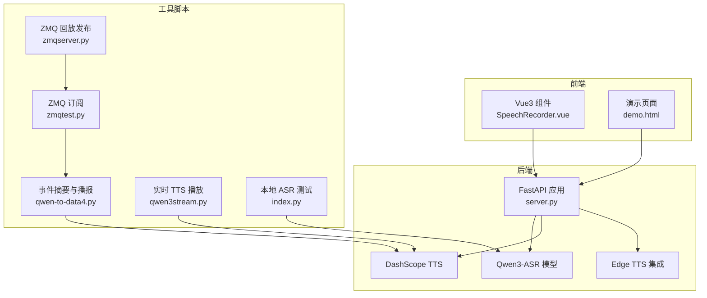
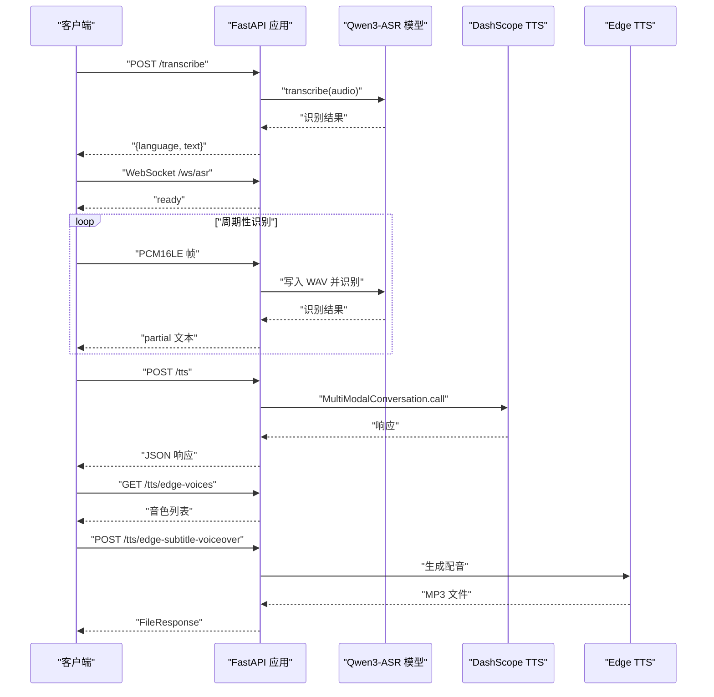
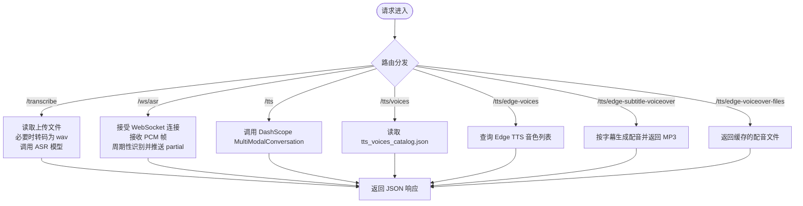
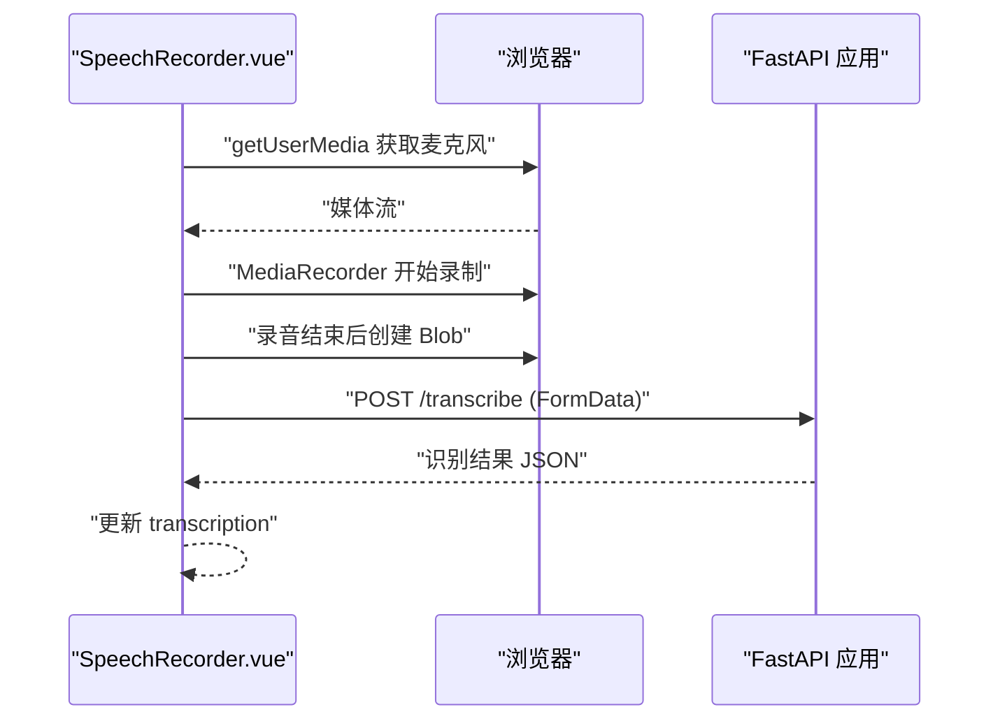
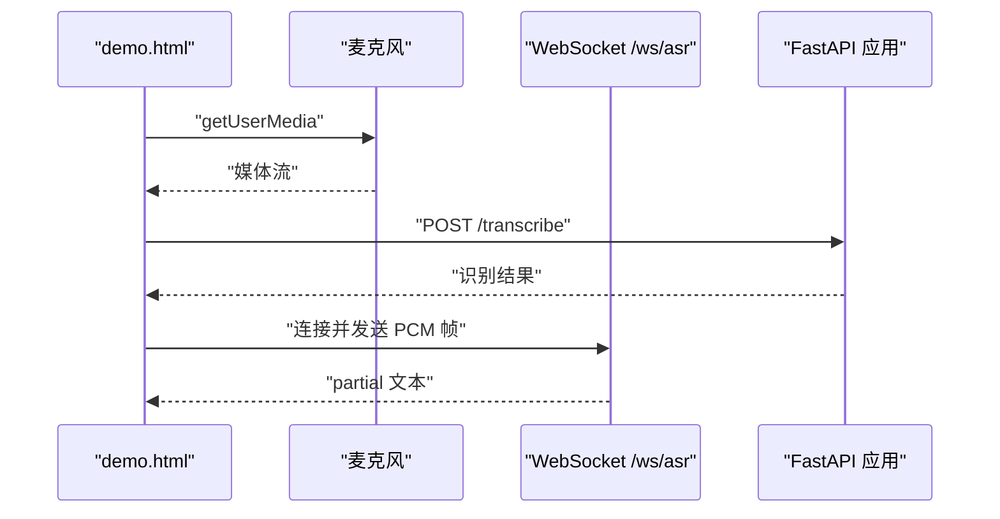
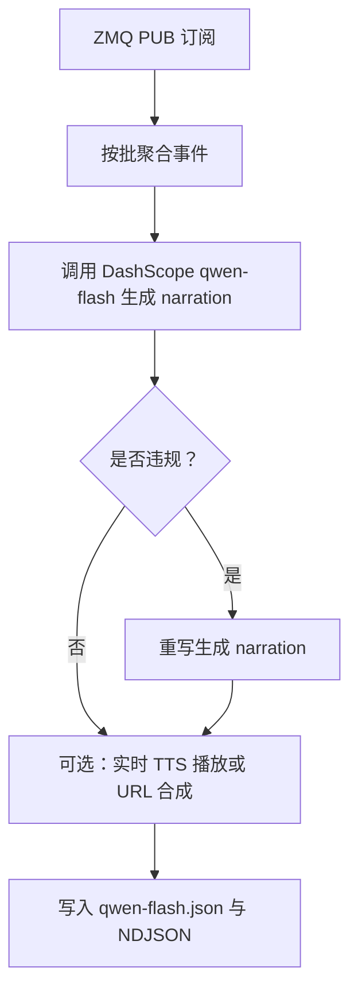
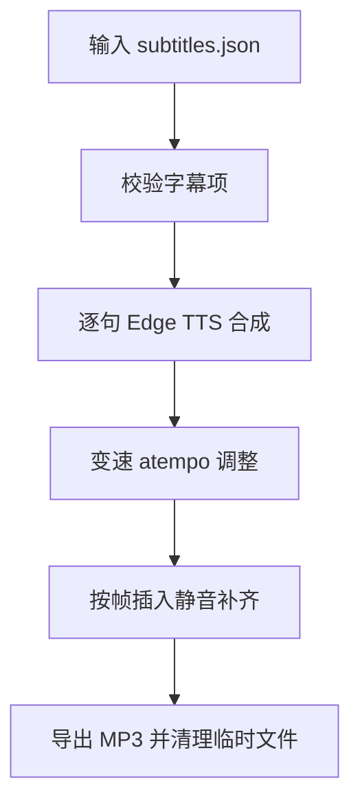
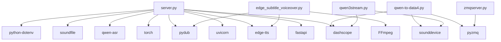

# 代码结构说明

<cite>
**本文档引用的文件**
- [README.md](file://README.md)
- [server.py](file://server.py)
- [SpeechRecorder.vue](file://SpeechRecorder.vue)
- [requirements.txt](file://requirements.txt)
- [ttstest.py](file://ttstest.py)
- [edge_subtitle_voiceover.py](file://edge_subtitle_voiceover.py)
- [demo.html](file://demo.html)
- [qwen-to-data4.py](file://qwen-to-data4.py)
- [zmqserver.py](file://zmqserver.py)
- [qwen3stream.py](file://qwen3stream.py)
- [qwen-flash.json](file://qwen-flash.json)
- [tts_voices_catalog.json](file://tts_voices_catalog.json)
- [subtitles.json](file://subtitles.json)
- [index.py](file://index.py)
</cite>

## 目录
1. [简介](#简介)
2. [项目结构](#项目结构)
3. [核心组件](#核心组件)
4. [架构总览](#架构总览)
5. [详细组件分析](#详细组件分析)
6. [依赖关系分析](#依赖关系分析)
7. [性能考虑](#性能考虑)
8. [故障排查指南](#故障排查指南)
9. [结论](#结论)
10. [附录](#附录)

## 简介
本项目是一个基于 Vue3 前端与 FastAPI 后端的语音应用，提供本地 Qwen3-ASR 语音识别、WebSocket 伪实时流式识别、以及阿里云 DashScope TTS 语音合成能力。项目还包含多个独立脚本，用于 ZMQ 赛事事件流的批量摘要与实时播报、字幕配音生成、以及本地 ASR 测试等。

## 项目结构
项目采用“前后端分离 + 多脚本工具”的组织方式：
- 后端服务：FastAPI 应用，提供 /transcribe、/ws/asr、/tts、/tts/voices、/tts/edge-voices、/tts/edge-subtitle-voiceover 等接口。
- 前端组件：Vue3 组件 SpeechRecorder.vue，可直接集成到现有工程。
- 演示页面：demo.html，内置麦克风授权、录音上传、实时识别、TTS 播放等功能。
- 独立脚本：涵盖 ZMQ 事件订阅与摘要、实时 TTS 播放、字幕配音生成、本地 ASR 测试等。
- 配置与资源：.env、tts_voices_catalog.json、subtitles.json、qwen-flash.json 等。

图表来源
- [server.py:1-452](file://server.py#L1-L452)
- [SpeechRecorder.vue:1-90](file://SpeechRecorder.vue#L1-L90)
- [demo.html:1-685](file://demo.html#L1-L685)
- [qwen-to-data4.py:1-1086](file://qwen-to-data4.py#L1-L1086)
- [zmqserver.py:1-68](file://zmqserver.py#L1-L68)
- [qwen3stream.py:1-196](file://qwen3stream.py#L1-L196)
- [index.py:1-19](file://index.py#L1-L19)

章节来源
- [README.md:5-19](file://README.md#L5-L19)
- [server.py:67-76](file://server.py#L67-L76)

## 核心组件
- FastAPI 后端服务：负责路由组织、中间件配置、异常处理、ASR/TTS/Edge TTS/字幕配音等业务逻辑。
- Vue3 组件：提供录音、上传识别、实时识别、TTS 播放的前端交互。
- 演示页面：完整的浏览器端语音应用界面，包含麦克风授权、录音、实时识别、TTS 合成与播放。
- 独立脚本：用于 ZMQ 事件流处理、实时 TTS 播放、字幕配音生成、本地 ASR 测试等。

章节来源
- [server.py:124-197](file://server.py#L124-L197)
- [server.py:367-425](file://server.py#L367-L425)
- [server.py:212-248](file://server.py#L212-L248)
- [SpeechRecorder.vue:20-77](file://SpeechRecorder.vue#L20-L77)
- [demo.html:248-685](file://demo.html#L248-L685)

## 架构总览
后端采用 FastAPI，内置 CORS 中间件，提供如下接口：
- GET /：健康检查
- GET /demo：返回演示页面
- POST /transcribe：上传音频文件进行识别
- WebSocket /ws/asr：实时流式识别（PCM 缓冲 + 周期性识别）
- GET /tts/voices：返回 TTS 音色列表
- POST /tts：调用 DashScope TTS
- GET /tts/edge-voices：查询 Edge TTS 音色列表
- POST /tts/edge-subtitle-voiceover：按字幕时间轴生成配音
- GET /tts/edge-voiceover-files/{file_id}：获取生成的配音文件

图表来源
- [server.py:124-197](file://server.py#L124-L197)
- [server.py:367-425](file://server.py#L367-L425)
- [server.py:212-248](file://server.py#L212-L248)
- [server.py:250-298](file://server.py#L250-L298)
- [server.py:300-361](file://server.py#L300-L361)

章节来源
- [README.md:100-150](file://README.md#L100-L150)
- [server.py:67-76](file://server.py#L67-L76)

## 详细组件分析

### 后端 FastAPI 服务（server.py）
- 路由组织
  - GET /：健康检查
  - GET /demo：返回 demo.html
  - POST /transcribe：上传音频文件，支持 webm/ogg/mp3/m4a/flac/wav，内部通过 FFmpeg 转码为 wav 后识别
  - WebSocket /ws/asr：接收 PCM16LE 单声道音频，周期性识别并推送 partial 文本
  - GET /tts/voices：返回 tts_voices_catalog.json
  - POST /tts：调用 DashScope MultiModalConversation，返回 JSON
  - GET /tts/edge-voices：查询 Edge TTS 音色列表，支持按区域与性别过滤
  - POST /tts/edge-subtitle-voiceover：按字幕时间轴生成配音，返回 MP3
  - GET /tts/edge-voiceover-files/{file_id}：获取生成的配音文件
- 中间件配置
  - CORS：允许所有来源、方法与头部
- 异常处理机制
  - 使用 HTTPException 返回明确的错误信息
  - 对外部服务调用（FFmpeg/DashScope/Edge）进行异常捕获与转换
- 环境变量与配置
  - ASR_MODEL_PATH：本地模型路径或 HuggingFace ID
  - DASHSCOPE_API_KEY：TTS API 密钥
  - ASR_WS_DECODE_INTERVAL_S / ASR_WS_MAX_WINDOW_S：WS 识别参数
  - FFMPEG_PATH：FFmpeg 可执行文件路径
  - PUBLIC_BASE_URL：用于生成绝对链接

图表来源
- [server.py:124-197](file://server.py#L124-L197)
- [server.py:367-425](file://server.py#L367-L425)
- [server.py:212-248](file://server.py#L212-L248)
- [server.py:250-298](file://server.py#L250-L298)
- [server.py:300-361](file://server.py#L300-L361)

章节来源
- [server.py:67-76](file://server.py#L67-L76)
- [server.py:83-95](file://server.py#L83-L95)
- [server.py:124-197](file://server.py#L124-L197)
- [server.py:367-425](file://server.py#L367-L425)
- [server.py:212-248](file://server.py#L212-L248)
- [server.py:250-298](file://server.py#L250-L298)
- [server.py:300-361](file://server.py#L300-L361)

### Vue3 组件（SpeechRecorder.vue）
- 组件职责
  - 提供录音按钮，使用浏览器 MediaRecorder 录制 audio/webm
  - 将录制的 Blob 通过 FormData 上传至 /transcribe
  - 展示识别结果与错误信息
- 状态管理
  - 使用 Vue3 的 ref 管理录音状态、识别结果与错误信息
- API 集成
  - 通过 fetch 调用 /transcribe 接口
  - 通过 WebSocket 连接 /ws/asr 实现实时识别（可在 demo.html 中体验）

图表来源
- [SpeechRecorder.vue:20-77](file://SpeechRecorder.vue#L20-L77)
- [server.py:367-425](file://server.py#L367-L425)

章节来源
- [SpeechRecorder.vue:1-90](file://SpeechRecorder.vue#L1-L90)

### 演示页面（demo.html）
- 功能特性
  - 麦克风授权、录音、上传识别
  - WebSocket 实时识别（PCM16LE -> partial 文本）
  - TTS 合成与播放（支持 url 与 base64 data 两种模式）
  - 语音列表动态加载（/tts/voices）
- 交互流程
  - 初始化麦克风与 MediaRecorder
  - 录音完成后上传至 /transcribe
  - 通过 WebSocket 连接 /ws/asr 实时传输音频
  - 调用 /tts 合成音频并自动播放

图表来源
- [demo.html:248-685](file://demo.html#L248-L685)
- [server.py:124-197](file://server.py#L124-L197)
- [server.py:367-425](file://server.py#L367-L425)

章节来源
- [demo.html:1-685](file://demo.html#L1-L685)

### ZMQ 赛事事件摘要与播报（qwen-to-data4.py）
- 功能概述
  - 订阅 ZMQ PUB 主题，按批聚合事件后调用 DashScope qwen-flash 生成短解说
  - 可选实时 TTS 播报（sounddevice），或回退为整段 URL 合成
  - 结果写入 JSON，原始事件写入 NDJSON
- 关键流程
  - 订阅 ZMQ 事件（zmqtest.py 或 zmqserver.py 回放）
  - 批量事件 -> 调用模型生成 narration
  - 可选 TTS -> 播放或保存
  - 写入结果文件与事件日志

图表来源
- [qwen-to-data4.py:1-1086](file://qwen-to-data4.py#L1-L1086)
- [zmqserver.py:1-68](file://zmqserver.py#L1-L68)
- [qwen-flash.json:1-1652](file://qwen-flash.json#L1-L1652)

章节来源
- [README.md:205-270](file://README.md#L205-L270)
- [qwen-to-data4.py:1-1086](file://qwen-to-data4.py#L1-L1086)
- [zmqserver.py:1-68](file://zmqserver.py#L1-L68)

### 字幕配音生成（edge_subtitle_voiceover.py）
- 功能概述
  - 输入字幕时间轴（subtitles.json），按帧生成 Edge TTS 配音
  - 支持变速（FFmpeg atempo）与时长对齐
  - 输出 MP3 文件，支持直接返回或服务端缓存链接
- 关键流程
  - 校验字幕项（时间合法性）
  - 逐句合成并变速调整
  - 按帧插入静音补齐时间差
  - 导出 MP3 并清理临时文件

图表来源
- [edge_subtitle_voiceover.py:166-223](file://edge_subtitle_voiceover.py#L166-L223)
- [subtitles.json:1-17](file://subtitles.json#L1-L17)

章节来源
- [edge_subtitle_voiceover.py:1-223](file://edge_subtitle_voiceover.py#L1-L223)
- [subtitles.json:1-17](file://subtitles.json#L1-L17)

### 本地 ASR 测试（index.py）
- 功能概述
  - 使用 Qwen3ASRModel 从本地或 HuggingFace 加载模型
  - 对本地音频文件进行转写并输出语言与文本
- 适用场景
  - 本地测试与验证 ASR 模型加载与推理

章节来源
- [index.py:1-19](file://index.py#L1-L19)

## 依赖关系分析
- 运行时依赖
  - FastAPI、uvicorn：后端服务框架与服务器
  - torch、qwen-asr：本地 ASR 模型推理
  - dashscope：阿里云 TTS 服务
  - edge-tts、pydub、soundfile：Edge TTS 与音频处理
  - python-dotenv：环境变量加载
  - pyzmq：ZMQ 事件订阅
  - sounddevice、pygame：实时 TTS 播放与音频播放
- 脚本依赖
  - qwen-to-data4.py：依赖 dashscope、pyzmq、sounddevice（可选）
  - qwen3stream.py：依赖 dashscope、sounddevice
  - zmqserver.py：依赖 pyzmq
  - edge_subtitle_voiceover.py：依赖 edge-tts、pydub、FFmpeg

图表来源
- [requirements.txt:1-13](file://requirements.txt#L1-L13)
- [server.py:12-31](file://server.py#L12-L31)
- [qwen-to-data4.py:17-28](file://qwen-to-data4.py#L17-L28)
- [qwen3stream.py:1-8](file://qwen3stream.py#L1-L8)
- [zmqserver.py:8](file://zmqserver.py#L8)
- [edge_subtitle_voiceover.py:11-13](file://edge_subtitle_voiceover.py#L11-L13)

章节来源
- [requirements.txt:1-13](file://requirements.txt#L1-L13)

## 性能考虑
- ASR 推理
  - 设备选择：优先使用 CUDA（bfloat16），否则 CPU（float32）
  - 批处理大小与最大生成长度：通过模型初始化参数控制
- WebSocket 实时识别
  - 滑动窗口大小与解码间隔：通过环境变量控制，平衡延迟与资源占用
  - 周期性识别：避免频繁 IO，减少模型调用次数
- TTS 合成
  - DashScope TTS：同步调用，避免非主线程行为差异
  - Edge TTS：按字幕生成，支持变速与静音补齐，减少音频拼接开销
- 文件处理
  - 临时文件与缓存：识别与配音生成均使用临时文件，完成后清理
  - FFmpeg 转码：在需要时进行，避免不必要的转码

## 故障排查指南
- ASR 模型加载
  - 本地路径不存在或不完整：回退至 HuggingFace 拉取，建议配置 ASR_MODEL_PATH
  - torch 版本不匹配：卸载不匹配的 torchvision，或重装与 torch 同源的版本
- FFmpeg 转码
  - 找不到 ffmpeg：在 .env 中设置 FFMPEG_PATH 或将 ffmpeg 加入系统 PATH
  - webm/ogg 解码失败：确保 ffmpeg 可用且路径正确
- TTS 服务
  - 缺少 DASHSCOPE_API_KEY：检查 .env 中的 API Key 与地域一致性
  - TTS 响应异常：检查响应结构与状态码，避免误用 hasattr 触发 __getattr__
- WebSocket 实时识别
  - PCM 格式不符：确保发送 16kHz 单声道 PCM（int16）
  - 窗口与间隔：根据网络与设备性能调整 ASR_WS_DECODE_INTERVAL_S 与 ASR_WS_MAX_WINDOW_S
- Edge TTS
  - 音色列表获取失败：检查网络与微软接口可用性
  - 配音生成异常：检查字幕时间轴与 FFmpeg 可用性

章节来源
- [README.md:194-204](file://README.md#L194-L204)
- [server.py:364-411](file://server.py#L364-L411)
- [server.py:212-248](file://server.py#L212-L248)
- [server.py:124-197](file://server.py#L124-L197)

## 结论
本项目通过 FastAPI 提供统一的语音服务能力，结合 Vue3 前端与演示页面，实现了从录音上传、实时识别到 TTS 合成与播放的完整闭环。同时，配套的脚本工具支持 ZMQ 事件流的批量摘要与实时播报、字幕配音生成等高级场景。项目结构清晰、模块职责明确，便于扩展与维护。

## 附录
- 快速上手路径
  - 安装依赖：pip install -r requirements.txt
  - 配置环境变量：DASHSCOPE_API_KEY、ASR_MODEL_PATH、FFMPEG_PATH（可选）
  - 启动后端：python server.py 或 uvicorn server:app
  - 访问演示页面：http://127.0.0.1:8000/demo
  - 集成 Vue3 组件：将 SpeechRecorder.vue 集成到现有工程，请求地址指向后端
- 接口一览
  - GET /：健康检查
  - GET /demo：演示页面
  - POST /transcribe：上传音频识别
  - WebSocket /ws/asr：实时流式识别
  - GET /tts/voices：TTS 音色列表
  - POST /tts：TTS 合成
  - GET /tts/edge-voices：Edge TTS 音色列表
  - POST /tts/edge-subtitle-voiceover：字幕配音生成
  - GET /tts/edge-voiceover-files/{file_id}：获取配音文件

章节来源
- [README.md:84-99](file://README.md#L84-L99)
- [README.md:100-150](file://README.md#L100-L150)
- [server.py:199-452](file://server.py#L199-L452)