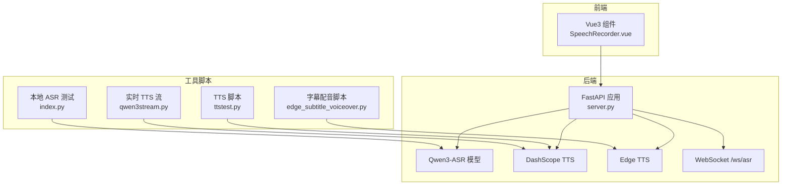
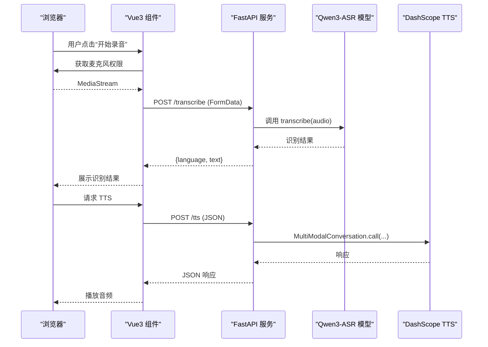
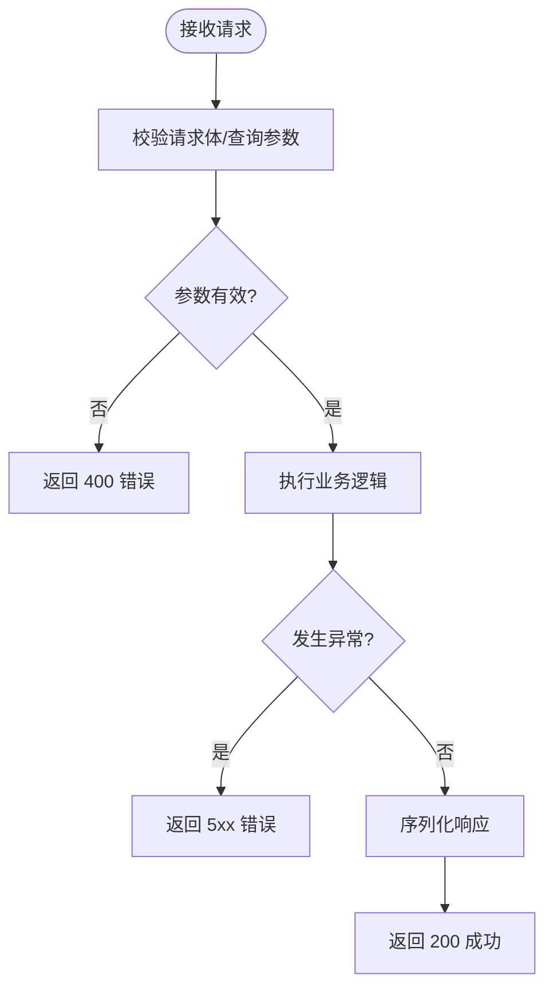
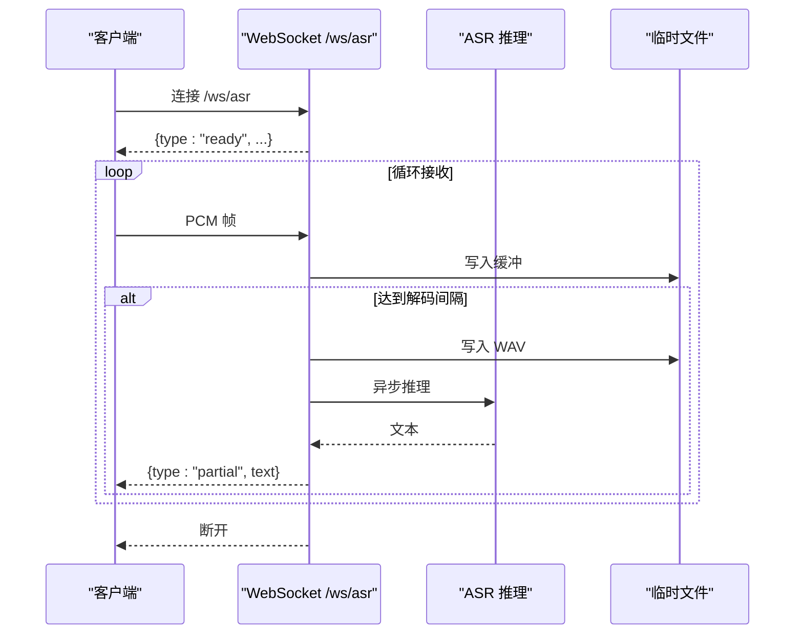
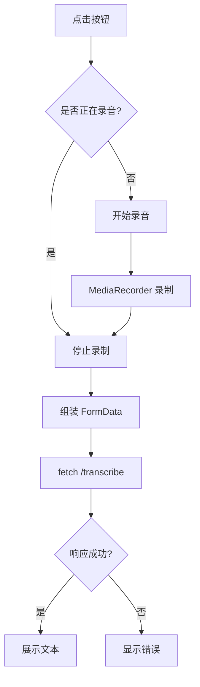
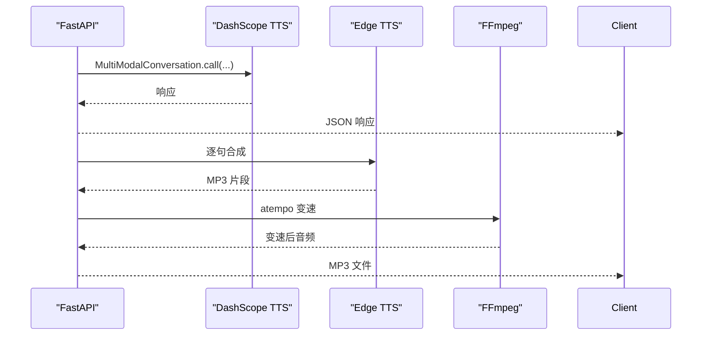
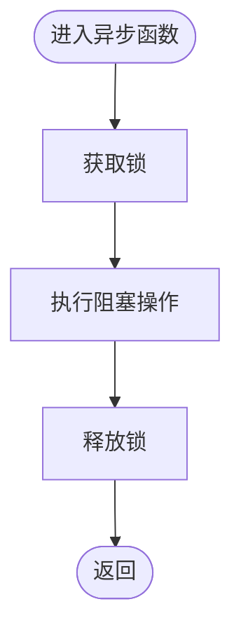
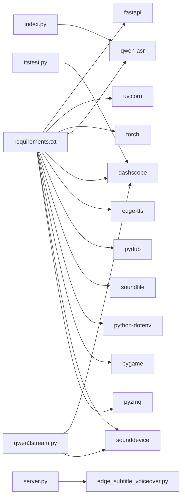

# 代码规范与最佳实践

<cite>
**本文引用的文件**
- [README.md](file://README.md)
- [server.py](file://server.py)
- [SpeechRecorder.vue](file://SpeechRecorder.vue)
- [requirements.txt](file://requirements.txt)
- [index.py](file://index.py)
- [ttstest.py](file://ttstest.py)
- [edge_subtitle_voiceover.py](file://edge_subtitle_voiceover.py)
- [qwen3stream.py](file://qwen3stream.py)
- [tts_voices_catalog.json](file://tts_voices_catalog.json)
- [subtitles.json](file://subtitles.json)
- [jsonschema.json](file://jsonschema.json)
</cite>

## 目录
1. [引言](#引言)
2. [项目结构](#项目结构)
3. [核心组件](#核心组件)
4. [架构总览](#架构总览)
5. [详细组件分析](#详细组件分析)
6. [依赖关系分析](#依赖关系分析)
7. [性能考虑](#性能考虑)
8. [故障排查指南](#故障排查指南)
9. [结论](#结论)
10. [附录](#附录)

## 引言
本指南面向开发者，提供统一的代码规范与最佳实践，涵盖：
- Python 代码风格与 PEP8 标准、命名约定、注释与文档字符串
- FastAPI 应用的编码规范（路由、依赖注入、数据验证、错误处理）
- Vue3 组件开发规范（结构、props、事件、状态管理）
- 异步编程与并发控制（async/await、锁、线程池）
- 性能优化（内存管理、资源释放、缓存策略）
- 代码审查清单与常见反模式规避

本指南结合项目实际代码进行说明，帮助团队在一致性、可维护性与可扩展性之间取得平衡。

## 项目结构
该项目采用前后端分离架构：
- 后端：FastAPI 服务，提供 ASR 上传识别、WebSocket 流式识别、TTS 合成、字幕配音等接口
- 前端：Vue3 组件（SpeechRecorder.vue），用于录音与上传识别
- 辅助工具：本地 ASR 测试脚本、DashScope TTS 脚本、Edge TTS 字幕配音、实时 TTS 流式播放等

图表来源
- [server.py:67-452](file://server.py#L67-L452)
- [SpeechRecorder.vue:1-90](file://SpeechRecorder.vue#L1-L90)
- [index.py:1-19](file://index.py#L1-L19)
- [ttstest.py:1-27](file://ttstest.py#L1-L27)
- [edge_subtitle_voiceover.py:1-223](file://edge_subtitle_voiceover.py#L1-L223)
- [qwen3stream.py:1-196](file://qwen3stream.py#L1-L196)

章节来源
- [README.md:5-19](file://README.md#L5-L19)
- [requirements.txt:1-13](file://requirements.txt#L1-L13)

## 核心组件
- FastAPI 应用与中间件：CORS、路由、WebSocket、文件上传、TTS 接口
- Vue3 组件：录音控制、上传识别、错误处理
- 辅助脚本：本地 ASR 测试、TTS 调用、Edge TTS 字幕配音、实时 TTS 流式播放
- 配置与数据：环境变量、音色目录、字幕结构、JSON Schema

章节来源
- [server.py:67-452](file://server.py#L67-L452)
- [SpeechRecorder.vue:11-90](file://SpeechRecorder.vue#L11-L90)
- [edge_subtitle_voiceover.py:20-42](file://edge_subtitle_voiceover.py#L20-L42)
- [tts_voices_catalog.json:1-54](file://tts_voices_catalog.json#L1-L54)
- [subtitles.json:1-17](file://subtitles.json#L1-L17)
- [jsonschema.json:1-167](file://jsonschema.json#L1-L167)

## 架构总览
后端服务通过 FastAPI 提供 REST 与 WebSocket 接口，结合本地 ASR 模型与云端 TTS 服务，实现完整的语音识别与合成能力。前端 Vue3 组件负责采集音频并通过上传接口完成识别，或通过 WebSocket 实现实时识别。

图表来源
- [SpeechRecorder.vue:20-77](file://SpeechRecorder.vue#L20-L77)
- [server.py:367-425](file://server.py#L367-L425)
- [server.py:212-247](file://server.py#L212-L247)
- [ttstest.py:13-26](file://ttstest.py#L13-L26)

## 详细组件分析

### FastAPI 应用规范
- 路由定义
  - 使用装饰器定义路由，明确 HTTP 方法与路径
  - 对于静态页面与文件响应，使用 FileResponse 并设置媒体类型
- 依赖注入与数据验证
  - 使用 Pydantic BaseModel 定义请求体结构，确保字段类型与默认值
  - 通过 Query 定义查询参数，提供描述与默认值
- 错误处理
  - 使用 HTTPException 返回明确的状态码与错误信息
  - 对外部服务异常进行捕获与包装，避免泄露内部细节
- 异步与并发
  - 使用 asyncio.Lock 保护共享资源（如 ASR 推理）
  - 使用 asyncio.to_thread 将阻塞操作移至线程池，避免阻塞事件循环
  - WebSocket 中对缓冲区与解码间隔进行合理控制，防止过度占用 CPU

图表来源
- [server.py:100-107](file://server.py#L100-L107)
- [server.py:257-297](file://server.py#L257-L297)
- [server.py:367-425](file://server.py#L367-L425)

章节来源
- [server.py:67-452](file://server.py#L67-L452)

### WebSocket 实时识别流程
- 连接建立：接受 WebSocket 连接并发送 ready 消息
- 数据接收：接收二进制 PCM 数据，写入环形缓冲区
- 解码控制：根据环境变量控制解码间隔与最大窗口大小
- 推理与回传：将缓冲区内容写入 WAV，异步调用 ASR，发送 partial 文本
- 错误处理：捕获异常并发送 error 消息，清理临时文件

图表来源
- [server.py:124-197](file://server.py#L124-L197)

章节来源
- [server.py:124-197](file://server.py#L124-L197)

### Vue3 组件开发规范
- 组件结构
  - 使用 <script setup> 简化组合式 API 使用
  - 使用 ref 声明响应式状态，避免在模板中直接操作 DOM
- props 与事件
  - 本组件未定义 props，遵循“可复用组件”原则，必要时通过父组件传入配置
  - 事件通过回调与错误状态传递给父组件
- 事件处理
  - 使用 getUserMedia 获取音频流，MediaRecorder 录制音频
  - 录制完成后组装 FormData 并调用 /transcribe
- 状态管理
  - 使用组件内部状态管理录音状态、识别结果与错误信息
  - 在 finally 中清理资源，避免内存泄漏

图表来源
- [SpeechRecorder.vue:20-77](file://SpeechRecorder.vue#L20-L77)

章节来源
- [SpeechRecorder.vue:11-90](file://SpeechRecorder.vue#L11-L90)

### TTS 与字幕配音规范
- TTS 接口
  - 使用 DashScope MultiModalConversation 调用 TTS，返回 JSON
  - 对响应对象进行安全转换，避免 hasattr 导致的 __getattr__ 触发
- 字幕配音
  - 使用 Edge TTS 生成每句音频，按时间轴对齐并变速
  - 通过 FFmpeg atempo 保持音高，避免音调变化
  - 生成 MP3 并清理临时文件

图表来源
- [server.py:212-247](file://server.py#L212-L247)
- [edge_subtitle_voiceover.py:166-222](file://edge_subtitle_voiceover.py#L166-L222)

章节来源
- [ttstest.py:13-26](file://ttstest.py#L13-L26)
- [edge_subtitle_voiceover.py:148-151](file://edge_subtitle_voiceover.py#L148-L151)

### 异步编程与并发控制
- 使用 asyncio.Lock 保护共享资源，避免并发冲突
- 使用 asyncio.to_thread 将阻塞操作（如文件 I/O、FFmpeg）移至线程池
- WebSocket 中对缓冲区与解码间隔进行节流，避免 CPU 占用过高
- 实时 TTS 流式播放使用线程与 PortAudio 回调，确保音频连续播放

图表来源
- [server.py:97-98](file://server.py#L97-L98)
- [server.py:180-181](file://server.py#L180-L181)
- [qwen3stream.py:21-81](file://qwen3stream.py#L21-L81)

章节来源
- [server.py:97-98](file://server.py#L97-L98)
- [qwen3stream.py:21-81](file://qwen3stream.py#L21-L81)

## 依赖关系分析
- 运行时依赖：FastAPI、Uvicorn、torch、qwen-asr、dashscope、edge-tts、pydub、soundfile、python-dotenv、pygame、sounddevice、pyzmq
- 项目内模块：server.py 作为入口，依赖 edge_subtitle_voiceover.py 提供字幕配音能力
- 脚本依赖：index.py 依赖 qwen-asr；ttstest.py 依赖 dashscope；qwen3stream.py 依赖 dashscope 实时 TTS 与 sounddevice

图表来源
- [requirements.txt:1-13](file://requirements.txt#L1-L13)
- [server.py:24-31](file://server.py#L24-L31)
- [index.py:1-19](file://index.py#L1-L19)
- [ttstest.py:1-27](file://ttstest.py#L1-L27)
- [qwen3stream.py:1-196](file://qwen3stream.py#L1-L196)

章节来源
- [requirements.txt:1-13](file://requirements.txt#L1-L13)

## 性能考虑
- 内存管理
  - 临时文件在使用后及时删除，避免磁盘与内存占用
  - 使用 with/finally 确保资源释放
- 资源释放
  - WebSocket 连接断开后清理临时文件
  - FFmpeg 进程结束后清理临时文件
- 缓存策略
  - 服务端缓存字幕配音文件，提供链接接口，避免重复合成
  - 使用 UUID 生成文件名，避免冲突
- 并发控制
  - 使用 asyncio.Lock 保护 ASR 推理
  - 使用线程池执行阻塞操作
- I/O 优化
  - 将音频转码与文件写入移至线程池
  - WebSocket 解码间隔与窗口大小可调，平衡延迟与资源占用

章节来源
- [server.py:420-425](file://server.py#L420-L425)
- [edge_subtitle_voiceover.py:153-163](file://edge_subtitle_voiceover.py#L153-L163)
- [server.py:332-345](file://server.py#L332-L345)

## 故障排查指南
- 环境变量
  - DASHSCOPE_API_KEY：TTS 接口必需
  - ASR_MODEL_PATH：本地 ASR 模型路径
  - FFMPEG_PATH：转码用，IDE 启动时 PATH 常与系统不一致
- 依赖版本
  - torchvision/nms 版本不匹配：卸载不匹配版本或重装与 torch 同源的包
  - transformers 与 qwen-asr 不兼容：锁定匹配版本
- 网络与代理
  - huggingface.co 连接超时：配置本地模型路径
- 演示页播放问题
  - 外链 wav 加载失败：改用后端代理或本地解码

章节来源
- [README.md:48-204](file://README.md#L48-L204)

## 结论
本指南基于项目现有实现，总结了 Python 代码风格、FastAPI 编码规范、Vue3 组件开发、异步编程与性能优化等方面的最佳实践。建议团队在日常开发中遵循这些规范，以提升代码质量与系统稳定性。

## 附录

### Python 代码风格与 PEP8 规范
- 命名约定
  - 模块与包：小写、下划线分隔
  - 类名：驼峰命名
  - 函数与方法：小写下划线
  - 常量：大写与下划线
- 注释与文档字符串
  - 函数/方法：使用三引号文档字符串，说明用途、参数、返回值与异常
  - 复杂逻辑：添加行内注释，解释关键步骤
- 代码组织
  - 导入分组：标准库、第三方库、项目内模块
  - 行长度：不超过 88（可放宽至 100）
  - 空行：模块级函数/类之间空两行，方法之间空一行

### FastAPI 编码规范清单
- 路由定义
  - 明确 HTTP 方法与路径
  - 使用 Pydantic BaseModel 进行请求体验证
  - 查询参数使用 Query 并提供默认值与描述
- 依赖注入
  - 将公共逻辑抽取为依赖函数，减少重复
- 错误处理
  - 使用 HTTPException 返回明确错误
  - 捕获外部服务异常并包装
- 异步与并发
  - 使用 asyncio.Lock 保护共享资源
  - 使用 asyncio.to_thread 执行阻塞操作
  - WebSocket 中进行节流与资源清理

### Vue3 组件开发规范清单
- 组件结构
  - 使用 <script setup> 简化组合式 API
  - 使用 ref/defineProps/defineEmits 管理状态与事件
- 事件处理
  - 在 onMounted/onUnmounted 中注册/注销监听
  - 使用 try/catch 捕获错误并反馈给用户
- 状态管理
  - 组件内部状态为主，必要时通过 props 与 emits 与父组件通信
  - 避免在模板中直接操作 DOM

### 异步编程与并发控制清单
- 使用 asyncio.Lock 保护共享资源
- 使用 asyncio.to_thread 执行阻塞 I/O
- WebSocket 中控制解码间隔与缓冲区大小
- 实时 TTS 使用线程与回调确保音频连续播放

### 性能优化清单
- 内存管理：及时删除临时文件与清理缓存
- 资源释放：finally/背景任务确保资源回收
- 缓存策略：服务端缓存生成结果，提供链接接口
- 并发控制：线程池与锁配合，避免竞争条件
- I/O 优化：将阻塞操作移至线程池

### 代码审查清单
- 代码风格：是否符合 PEP8 与项目约定
- 错误处理：是否覆盖边界情况与异常分支
- 资源管理：是否及时释放文件、连接与线程
- 并发安全：是否使用锁与线程池
- 文档与注释：是否提供足够的文档字符串与注释
- 可测试性：是否易于单元测试与集成测试