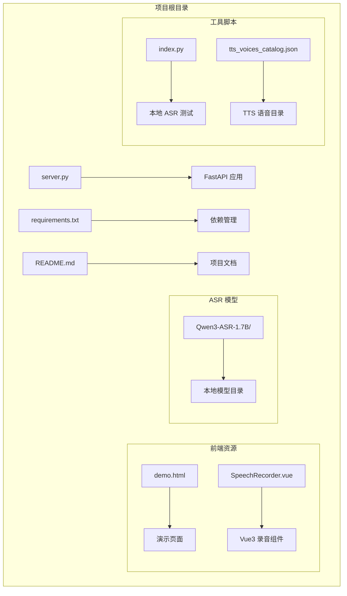
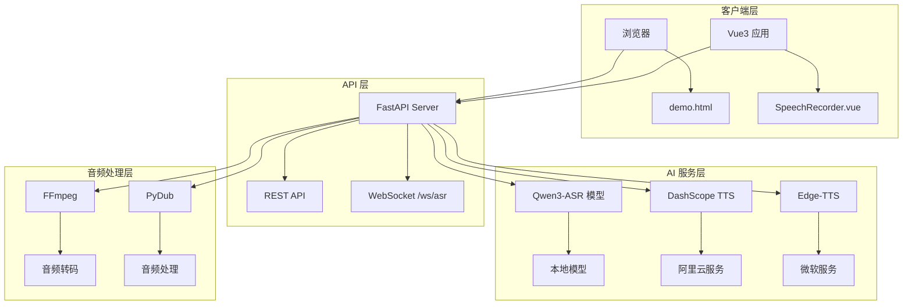
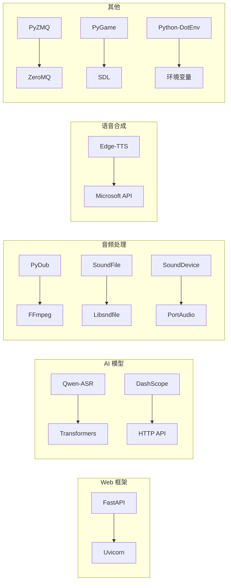

# 开发环境搭建

<cite>
**本文档引用的文件**
- [requirements.txt](file://requirements.txt)
- [README.md](file://README.md)
- [server.py](file://server.py)
- [edge_subtitle_voiceover.py](file://edge_subtitle_voiceover.py)
- [ttstest.py](file://ttstest.py)
- [qwen36.py](file://qwen36.py)
- [tts_voices_catalog.json](file://tts_voices_catalog.json)
- [demo.html](file://demo.html)
- [SpeechRecorder.vue](file://SpeechRecorder.vue)
- [index.py](file://index.py)
</cite>

## 目录
1. [简介](#简介)
2. [项目结构](#项目结构)
3. [核心组件](#核心组件)
4. [架构概览](#架构概览)
5. [详细组件分析](#详细组件分析)
6. [依赖关系分析](#依赖关系分析)
7. [性能考虑](#性能考虑)
8. [故障排除指南](#故障排除指南)
9. [结论](#结论)
10. [附录](#附录)

## 简介

Vue3 Speech 是一个基于 Vue3 和 FastAPI 的语音识别与语音合成应用。该项目集成了本地 Qwen3-ASR 模型进行语音识别，使用阿里云 DashScope 进行在线语音合成，并提供了浏览器内的 TTS 试听功能。项目支持上传音频识别、WebSocket 伪实时流式识别等功能。

## 项目结构



**图表来源**
- [server.py:1-50](file://server.py#L1-L50)
- [requirements.txt:1-13](file://requirements.txt#L1-L13)
- [README.md:5-19](file://README.md#L5-L19)

**章节来源**
- [README.md:5-19](file://README.md#L5-L19)
- [server.py:67-76](file://server.py#L67-L76)

## 核心组件

### Python 版本要求

根据项目依赖配置，推荐使用 Python 3.8+ 版本。项目使用了现代 Python 特性和最新的依赖库版本。

### 虚拟环境创建

```bash
# 创建虚拟环境
python -m venv venv

# 激活虚拟环境
# Windows:
venv\Scripts\activate
# macOS/Linux:
source venv/bin/activate

# 升级 pip
python -m pip install --upgrade pip

# 安装项目依赖
pip install -r requirements.txt
```

### 依赖包安装

项目的主要依赖包括：

- **Web 框架**: FastAPI + Uvicorn
- **AI 模型**: Qwen-ASR、DashScope
- **音频处理**: PyDub、SoundFile、SoundDevice
- **语音合成**: Edge-TTS
- **其他**: PyZMQ、PyGame、Python-DotEnv

**章节来源**
- [requirements.txt:1-13](file://requirements.txt#L1-L13)
- [README.md:36](file://README.md#L36)

## 架构概览



**图表来源**
- [server.py:124-197](file://server.py#L124-L197)
- [server.py:212-247](file://server.py#L212-L247)
- [edge_subtitle_voiceover.py:148-222](file://edge_subtitle_voiceover.py#L148-L222)

## 详细组件分析

### FastAPI 服务器配置

服务器采用异步架构设计，支持多种音频格式处理和实时语音识别功能。

#### 主要功能模块

1. **ASR 识别服务**
   - 支持 WAV、MP3、M4A、OGG、WEBM、FLAC 格式
   - 本地 Qwen3-ASR 模型推理
   - WebSocket 实时流式识别

2. **TTS 合成服务**
   - DashScope 多模态对话 TTS
   - Edge-TTS 本地合成
   - 语音目录管理

3. **音频处理服务**
   - FFmpeg 音频转码
   - 字幕时间轴配音
   - 音频变速处理

**章节来源**
- [server.py:88-95](file://server.py#L88-L95)
- [server.py:124-197](file://server.py#L124-L197)
- [server.py:212-247](file://server.py#L212-L247)

### 环境变量配置

项目支持多种环境变量配置：

| 变量名 | 类型 | 默认值 | 说明 |
|--------|------|--------|------|
| DASHSCOPE_API_KEY | 字符串 | 无 | DashScope API 密钥 |
| ASR_MODEL_PATH | 字符串 | Qwen3-ASR-1.7B | 本地 ASR 模型路径 |
| UVICORN_HOST | 字符串 | 0.0.0.0 | 服务器监听地址 |
| UVICORN_PORT | 整数 | 8000 | 服务器端口号 |
| UVICORN_RELOAD | 布尔 | false | 热重载开关 |
| ASR_WS_DECODE_INTERVAL_S | 浮点数 | 1.2 | WebSocket 解码间隔 |
| ASR_WS_MAX_WINDOW_S | 浮点数 | 12 | 最大音频窗口 |
| FFMPEG_PATH | 字符串 | 无 | FFmpeg 可执行文件路径 |

**章节来源**
- [README.md:48-83](file://README.md#L48-L83)
- [server.py:434-451](file://server.py#L434-L451)

### IDE 配置建议

#### VS Code 配置

1. **Python 解释器设置**
   ```json
   {
       "python.defaultInterpreterPath": "./venv/bin/python",
       "python.terminal.activateEnvironment": true,
       "python.linting.enabled": true,
       "python.linting.pylintEnabled": false,
       "python.linting.flake8Enabled": true
   }
   ```

2. **扩展推荐**
   - Python (by Microsoft)
   - Pylance
   - Flake8
   - Black Formatter

3. **调试配置**
   ```json
   {
       "version": "0.2.0",
       "configurations": [
           {
               "name": "FastAPI Debug",
               "type": "python",
               "request": "launch",
               "program": "${workspaceFolder}/server.py",
               "console": "integratedTerminal",
               "env": {
                   "UVICORN_HOST": "127.0.0.1",
                   "UVICORN_PORT": "8000"
               }
           }
       ]
   }
   ```

#### PyCharm 配置

1. **项目解释器**
   - File → Settings → Project → Python Interpreter
   - 选择虚拟环境路径：`./venv/bin/python`

2. **运行配置**
   - Run → Edit Configurations
   - 添加 Python 配置，目标文件为 `server.py`

3. **环境变量**
   - 在 Run/Debug Configurations 中添加环境变量

**章节来源**
- [README.md:48-83](file://README.md#L48-L83)

## 依赖关系分析

### 核心依赖项



**图表来源**
- [requirements.txt:1-13](file://requirements.txt#L1-L13)
- [server.py:12-22](file://server.py#L12-L22)

### 依赖版本要求

| 依赖包 | 版本范围 | 用途 | 注意事项 |
|--------|----------|------|----------|
| fastapi | >=0.100.0 | Web 框架 | 需要 Python 3.8+ |
| uvicorn | >=0.24.0 | ASGI 服务器 | 支持异步处理 |
| qwen-asr | >=1.0.0 | 语音识别 | 需要 CUDA 支持 |
| dashscope | >=1.15.0 | 语音合成 | 阿里云 API |
| edge-tts | >=6.1.0 | 本地 TTS | 微软服务 |
| torch | >=2.0.0 | AI 推理 | GPU 加速可选 |
| pydub | >=0.25.1 | 音频处理 | 依赖 FFmpeg |
| python-dotenv | >=1.0.0 | 环境变量 | 配置管理 |

**章节来源**
- [requirements.txt:1-13](file://requirements.txt#L1-L13)
- [README.md:36](file://README.md#L36)

## 性能考虑

### CUDA 环境配置

对于 Qwen-ASR 模型推理，建议配置 CUDA 环境：

1. **GPU 支持检测**
   ```python
   import torch
   print(torch.cuda.is_available())
   print(torch.cuda.get_device_name(0))
   ```

2. **内存优化**
   - `max_inference_batch_size=32`: 控制推理批次大小
   - `max_new_tokens=256`: 控制最大生成长度
   - `dtype=torch.bfloat16`: 使用混合精度减少内存占用

3. **CPU 回退机制**
   ```python
   DEVICE, DTYPE = get_device_and_dtype()
   # 自动检测 CUDA 可用性
   if torch.cuda.is_available():
       return "cuda:0", torch.bfloat16
   return "cpu", torch.float32
   ```

### WebSocket 性能优化

1. **音频缓冲区管理**
   - `ASR_WS_MAX_WINDOW_S`: 12 秒滑动窗口
   - `ASR_WS_DECODE_INTERVAL_S`: 1.2 秒解码间隔

2. **并发处理**
   - 使用 `_asr_lock` 避免并发访问
   - 异步 I/O 处理音频数据

**章节来源**
- [server.py:78-81](file://server.py#L78-L81)
- [server.py:93-95](file://server.py#L93-L95)
- [server.py:136-137](file://server.py#L136-L137)

## 故障排除指南

### 常见问题及解决方案

#### 1. HuggingFace 模型下载超时

**现象**: 连接 `huggingface.co` 超时
**解决方案**: 
- 配置本地模型路径 `ASR_MODEL_PATH`
- 确保模型目录包含完整的配置文件
- 使用国内镜像源或代理

#### 2. TorchVision 版本冲突

**现象**: `torchvision::nms` 等版本错误
**解决方案**:
- 卸载不匹配的 `torchvision`
- 重新安装与 `torch` 同源的版本

#### 3. FFmpeg 安装问题

**现象**: `/transcribe` 上传 webm 报错
**解决方案**:
- 安装 FFmpeg 到系统 PATH
- 在 `.env` 中设置 `FFMPEG_PATH` 指向绝对路径
- Windows 用户确保 IDE 子进程 PATH 包含 FFmpeg

#### 4. DashScope API Key 缺失

**现象**: `/tts` 报缺少 Key
**解决方案**:
- 在 `.env` 中配置 `DASHSCOPE_API_KEY`
- 确认 API Key 与地域一致

#### 5. WebSocket 连接失败

**现象**: 实时识别无法连接
**解决方案**:
- 检查防火墙设置
- 确认浏览器支持 WebSocket
- 验证服务器端口开放

**章节来源**
- [README.md:194-204](file://README.md#L194-L204)
- [server.py:388-410](file://server.py#L388-L410)

### 环境变量配置示例

```env
# DashScope API Key
DASHSCOPE_API_KEY=sk-xxxxxxxx

# 本地 ASR 模型路径
ASR_MODEL_PATH=./Qwen3-ASR-1.7B

# FFmpeg 路径（Windows 示例）
FFMPEG_PATH=C:/ffmpeg/bin/ffmpeg.exe

# Uvicorn 服务器配置
UVICORN_HOST=0.0.0.0
UVICORN_PORT=8000
UVICORN_RELOAD=true

# WebSocket 参数
ASR_WS_DECODE_INTERVAL_S=1.2
ASR_WS_MAX_WINDOW_S=12
```

**章节来源**
- [README.md:52-66](file://README.md#L52-L66)

## 结论

Vue3 Speech 项目提供了一个完整的语音处理解决方案，集成了本地语音识别和云端语音合成功能。通过合理的环境配置和依赖管理，开发者可以快速搭建开发环境并进行功能扩展。

关键要点：
- 使用虚拟环境隔离依赖
- 配置必要的环境变量
- 准备本地 ASR 模型
- 安装 FFmpeg 用于音频处理
- 配置 DashScope API Key

## 附录

### 开发服务器启动

```bash
# 方法1: 直接运行
python server.py

# 方法2: 使用 Uvicorn
uvicorn server:app --host 0.0.0.0 --port 8000

# 方法3: 开启热重载
uvicorn server:app --reload
```

### 基本调试操作

1. **健康检查**
   ```
   GET http://localhost:8000/
   ```

2. **演示页面**
   ```
   GET http://localhost:8000/demo
   ```

3. **实时识别测试**
   ```bash
   # 使用 WebSocket 客户端连接
   ws://localhost:8000/ws/asr
   ```

4. **TTS 合成测试**
   ```bash
   curl -X POST http://localhost:8000/tts \
        -H "Content-Type: application/json" \
        -d '{"text": "你好世界", "voice": "Cherry"}'
   ```

**章节来源**
- [README.md:84-98](file://README.md#L84-L98)
- [server.py:199-201](file://server.py#L199-L201)
- [server.py:204-209](file://server.py#L204-L209)