# 开发者指南

<cite>
**本文档引用的文件**
- [README.md](file://README.md)
- [server.py](file://server.py)
- [requirements.txt](file://requirements.txt)
- [SpeechRecorder.vue](file://SpeechRecorder.vue)
- [demo.html](file://demo.html)
- [ttstest.py](file://ttstest.py)
- [index.py](file://index.py)
- [edge_subtitle_voiceover.py](file://edge_subtitle_voiceover.py)
- [qwen-to-data4.py](file://qwen-to-data4.py)
- [qwen-to-data7.py](file://qwen-to-data7.py)
- [kokoserver.py](file://kokoserver.py)
- [zmqserver.py](file://zmqserver.py)
- [tts_voices_catalog.json](file://tts_voices_catalog.json)
- [jsonschema.json](file://jsonschema.json)
- [subtitles.json](file://subtitles.json)
- [qwen-to-date-prompts.json](file://qwen-to-date-prompts.json)
</cite>

## 目录
1. [简介](#简介)
2. [项目结构](#项目结构)
3. [核心组件](#核心组件)
4. [架构总览](#架构总览)
5. [详细组件分析](#详细组件分析)
6. [依赖分析](#依赖分析)
7. [性能考虑](#性能考虑)
8. [故障排查指南](#故障排查指南)
9. [结论](#结论)
10. [附录](#附录)

## 简介
本项目是一个基于 Vue3 前端与 FastAPI 后端的语音应用，提供本地 Qwen3-ASR 语音识别与阿里云 DashScope Qwen3 TTS 语音合成能力，支持浏览器内录音上传识别、WebSocket 伪实时流式识别，以及演示页面的 TTS 试听。项目还包含基于 ZMQ 的赛事事件流处理脚本，可批量生成解说并可选实时 TTS 播报。**新增**了多后端集成架构，支持 DashScope 实时 WebSocket、DashScope HTTP 和本地 Kokoro TTS 三种后端模式。

## 项目结构
- 后端服务：FastAPI 应用，提供健康检查、演示页、上传识别、WebSocket 实时识别、TTS、字幕配音等接口。
- 前端演示：静态 HTML 页面，内置麦克风授权、录音、实时识别、TTS 合成与播放。
- Vue 组件：可复用的录音组件，封装上传识别逻辑。
- 辅助脚本：本地 ASR 测试、TTS 测试、ZMQ 事件订阅与播报、字幕时间轴配音、**新增**多后端 TTS 处理脚本等。
- 配置文件：环境变量、TTS 音色表、JSON Schema、字幕样例、**新增**提示词配置等。

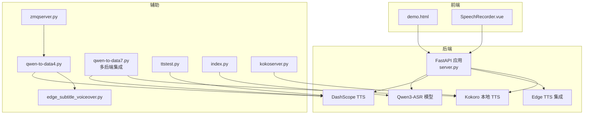

**图表来源**
- [server.py:1-452](file://server.py#L1-L452)
- [demo.html:1-685](file://demo.html#L1-L685)
- [SpeechRecorder.vue:1-90](file://SpeechRecorder.vue#L1-L90)
- [qwen-to-data4.py:1-1086](file://qwen-to-data4.py#L1-L1086)
- [qwen-to-data7.py:1-1506](file://qwen-to-data7.py#L1-L1506)
- [kokoserver.py:1-204](file://kokoserver.py#L1-L204)
- [zmqserver.py:1-68](file://zmqserver.py#L1-L68)
- [edge_subtitle_voiceover.py:1-223](file://edge_subtitle_voiceover.py#L1-L223)
- [ttstest.py:1-27](file://ttstest.py#L1-L27)
- [index.py:1-19](file://index.py#L1-L19)

**章节来源**
- [README.md:5-19](file://README.md#L5-L19)
- [requirements.txt:1-13](file://requirements.txt#L1-L13)

## 核心组件
- FastAPI 应用与路由
  - 健康检查、演示页、上传识别、WebSocket 实时识别、TTS、字幕配音、Edge TTS 音色查询等。
- 语音识别与转写
  - 本地 Qwen3-ASR 模型加载与推理，支持多种音频格式转 WAV 后转写。
- 语音合成
  - DashScope TTS（qwen3-tts-flash），支持整段 URL 返回与实时 WebSocket 模式。
  - **新增**多后端集成架构，支持 DashScope 实时 WebSocket、DashScope HTTP 和本地 Kokoro TTS。
- 前端演示与组件
  - demo.html 提供麦克风授权、录音、实时识别、TTS 合成与播放；SpeechRecorder.vue 提供可复用录音组件。
- ZMQ 事件处理
  - 订阅 ZMQ 事件，按批调用模型生成解说，支持实时 TTS 播报或 URL 回退。
- 字幕时间轴配音
  - 基于字幕时间轴生成 Edge TTS 配音，支持变速与静音拼接。
- **新增**Kokoro 本地 TTS 服务
  - 基于 Kokoro 模型的本地语音合成服务，支持实时流式播放和 HTTP 接口调用。

**章节来源**
- [server.py:199-425](file://server.py#L199-L425)
- [demo.html:248-685](file://demo.html#L248-L685)
- [SpeechRecorder.vue:11-77](file://SpeechRecorder.vue#L11-L77)
- [qwen-to-data4.py:773-1086](file://qwen-to-data4.py#L773-L1086)
- [qwen-to-data7.py:1228-1288](file://qwen-to-data7.py#L1228-L1288)
- [edge_subtitle_voiceover.py:166-223](file://edge_subtitle_voiceover.py#L166-L223)
- [kokoserver.py:158-204](file://kokoserver.py#L158-L204)

## 架构总览
后端采用 FastAPI，集成本地 ASR 与云端 TTS，提供 REST 与 WebSocket 接口；前端通过静态页面与 Vue 组件调用后端接口；ZMQ 脚本独立处理事件流并可选实时播报。**新增**多后端集成架构支持多种 TTS 后端选择，包括 DashScope 实时 WebSocket、DashScope HTTP 和本地 Kokoro TTS。

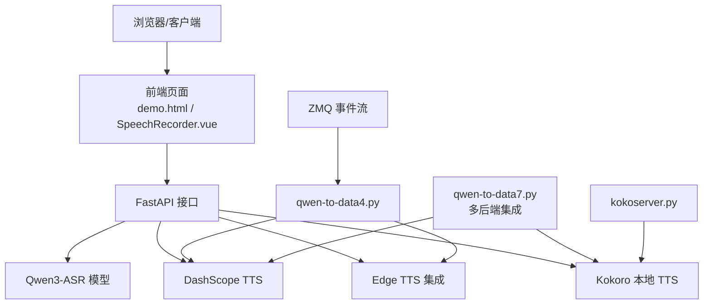

**图表来源**
- [server.py:67-452](file://server.py#L67-L452)
- [demo.html:248-685](file://demo.html#L248-L685)
- [SpeechRecorder.vue:11-77](file://SpeechRecorder.vue#L11-L77)
- [qwen-to-data4.py:773-1086](file://qwen-to-data4.py#L773-L1086)
- [qwen-to-data7.py:1228-1288](file://qwen-to-data7.py#L1228-L1288)
- [kokoserver.py:158-204](file://kokoserver.py#L158-L204)

## 详细组件分析

### FastAPI 应用与路由
- 路由概览
  - GET /：健康检查
  - GET /demo：演示页面
  - POST /transcribe：上传音频识别
  - WebSocket /ws/asr：实时识别（PCM 流）
  - GET /tts/voices：TTS 音色列表
  - POST /tts：DashScope TTS
  - GET /tts/edge-voices：Edge TTS 音色查询
  - POST /tts/edge-subtitle-voiceover：字幕配音（MP3）
  - POST /tts/edge-subtitle-voiceover/link：生成并返回链接
  - GET /tts/edge-voiceover-files/{file_id}：获取生成的 MP3
- 关键实现要点
  - 环境变量加载与 Uvicorn 启动参数
  - ASR 模型加载与设备选择（CUDA/CPU）
  - WebSocket 滑动窗口与周期性识别
  - CORS 中间件启用
  - FFmpeg 转码与错误处理
  - TTS 响应安全转换与错误处理

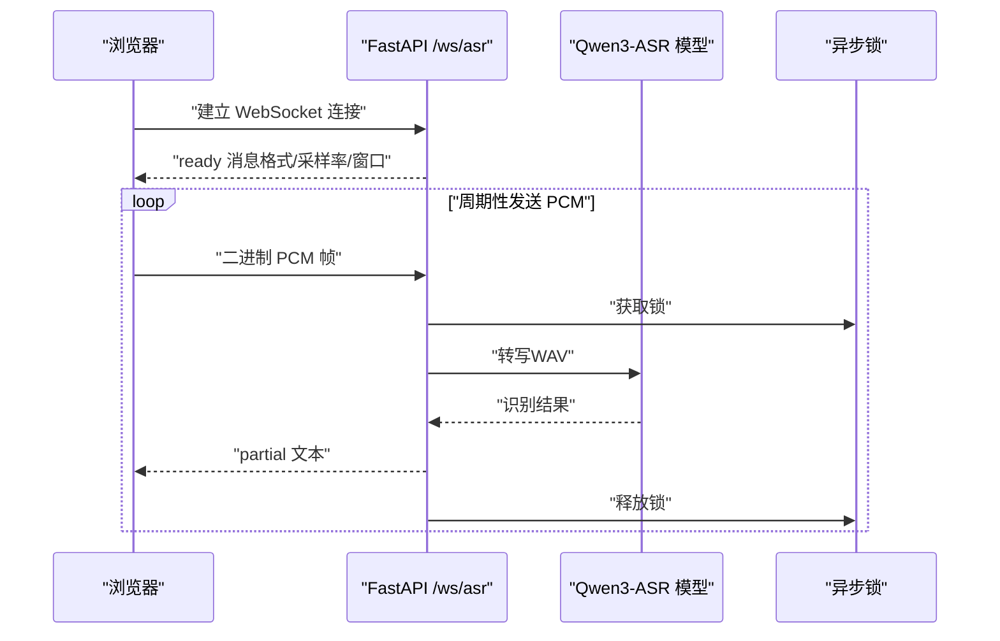

**图表来源**
- [server.py:124-197](file://server.py#L124-L197)

**章节来源**
- [server.py:67-452](file://server.py#L67-L452)

### 语音识别（上传与实时）
- 上传识别
  - 支持 WAV/MP3/M4A/OGG/WEBM/FLAC；非 WAV 时通过 FFmpeg 转码为 16kHz 单声道 WAV。
  - 识别结果包含语言与文本。
- 实时识别（WebSocket）
  - 客户端发送 16kHz 单声道 PCM（int16）；服务端维护滑动窗口，周期性识别并推送 partial 文本。
  - 可通过环境变量调整解码间隔与窗口大小。

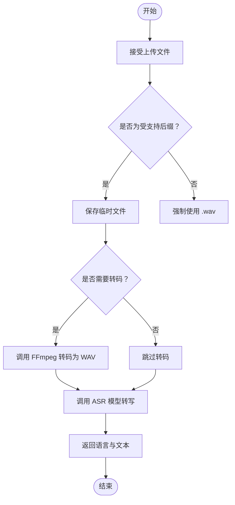

**图表来源**
- [server.py:367-425](file://server.py#L367-L425)

**章节来源**
- [server.py:124-197](file://server.py#L124-L197)
- [server.py:367-425](file://server.py#L367-L425)

### 语音合成（TTS）
- DashScope TTS
  - 支持整段 URL 返回与实时 WebSocket 模式；响应结构安全转换。
  - 音色列表来自 tts_voices_catalog.json。
- Edge TTS 集成
  - 查询 Edge 音色、按字幕时间轴生成配音（变速与静音拼接），支持返回 MP3 或生成链接。
- **新增**多后端集成架构
  - **自动模式**：根据可用性自动选择后端（sounddevice → kokoserver → dashscope）
  - **实时 WebSocket 模式**：DashScope qwen3-tts-*-realtime，需要 sounddevice
  - **HTTP 模式**：DashScope qwen3-tts-flash，整段返回音频 URL
  - **本地 Kokoro 模式**：通过 kokoserver.py 提供的 HTTP 接口调用本地模型

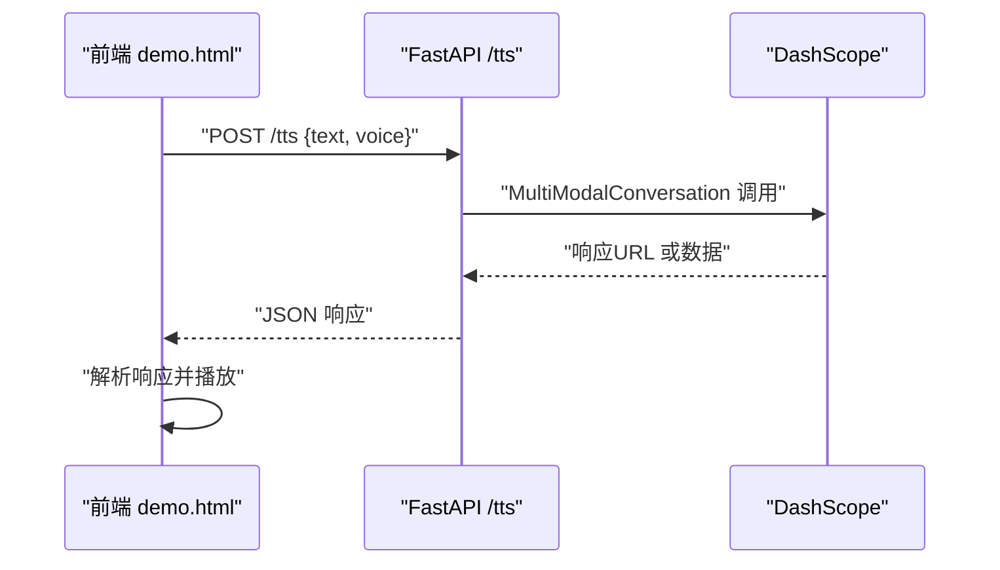

**图表来源**
- [server.py:212-248](file://server.py#L212-L248)
- [demo.html:323-382](file://demo.html#L323-L382)

**章节来源**
- [server.py:212-248](file://server.py#L212-L248)
- [demo.html:272-382](file://demo.html#L272-L382)
- [tts_voices_catalog.json:1-54](file://tts_voices_catalog.json#L1-L54)
- [qwen-to-data7.py:1228-1288](file://qwen-to-data7.py#L1228-L1288)

### 前端演示与组件
- demo.html
  - 麦克风授权、录音、实时识别（WebSocket）、TTS 合成与播放。
  - 自动适配 MIME 类型与格式。
- SpeechRecorder.vue
  - 封装录音、上传、识别与错误处理，按钮切换状态。

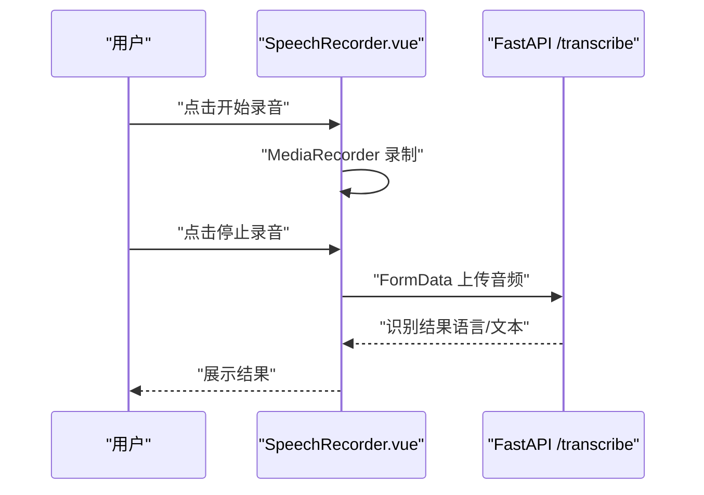

**图表来源**
- [SpeechRecorder.vue:20-77](file://SpeechRecorder.vue#L20-L77)
- [server.py:367-425](file://server.py#L367-L425)

**章节来源**
- [demo.html:433-664](file://demo.html#L433-L664)
- [SpeechRecorder.vue:11-77](file://SpeechRecorder.vue#L11-L77)

### ZMQ 赛事事件处理
- 功能概述
  - 订阅 ZMQ 事件，按批调用模型生成解说；可选实时 TTS 播报或 URL 回退。
  - 支持策略校验与重写、输出 JSON 与事件 NDJSON 日志。
- 关键流程
  - 事件收集与批处理
  - 模型调用与政策校验
  - TTS 队列与播放控制
  - 结果持久化与进度更新

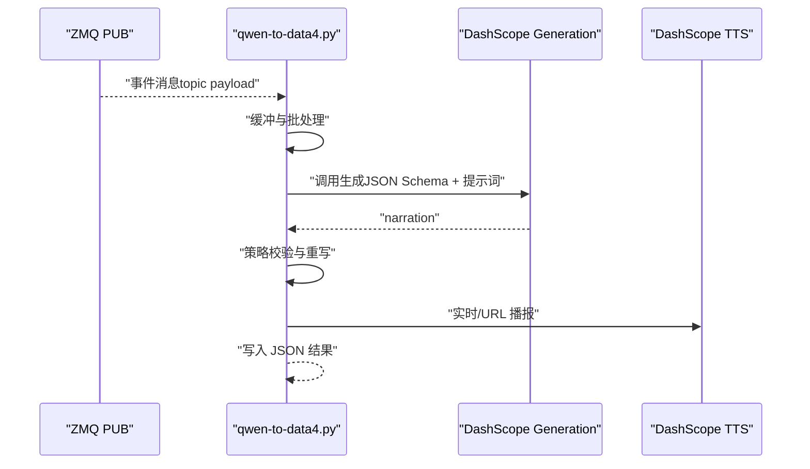

**图表来源**
- [qwen-to-data4.py:93-196](file://qwen-to-data4.py#L93-L196)
- [qwen-to-data4.py:773-1086](file://qwen-to-data4.py#L773-L1086)

**章节来源**
- [qwen-to-data4.py:1-1086](file://qwen-to-data4.py#L1-L1086)
- [zmqserver.py:11-67](file://zmqserver.py#L11-L67)

### 字幕时间轴配音（Edge TTS）
- 输入结构
  - 字幕项包含 id、起止时间（毫秒）、内容；可省略结束时间按自然时长输出。
- 处理流程
  - 逐句 Edge TTS 合成
  - 速度调整（FFmpeg atempo）
  - 按下一帧起始插入静音补齐时间轴
  - 导出 MP3 并清理临时文件

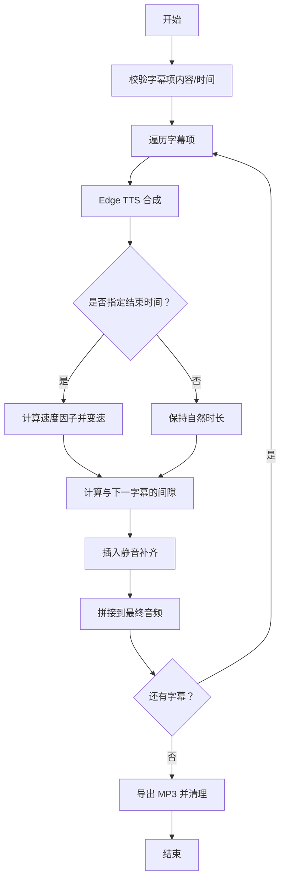

**图表来源**
- [edge_subtitle_voiceover.py:166-223](file://edge_subtitle_voiceover.py#L166-L223)

**章节来源**
- [edge_subtitle_voiceover.py:166-223](file://edge_subtitle_voiceover.py#L166-L223)
- [subtitles.json:1-17](file://subtitles.json#L1-L17)

### **新增**多后端集成架构（qwen-to-data7.py）
- **架构特点**
  - 支持三种 TTS 后端：DashScope 实时 WebSocket、DashScope HTTP、本地 Kokoro TTS
  - 自动后端选择机制：根据可用性自动选择最优后端
  - 实时流式合成与非实时回退路径
- **后端选择策略**
  - auto：有 sounddevice → kokoserver → dashscope
  - realtime：DashScope 实时 WebSocket（需 sounddevice）
  - dashscope：DashScope HTTP 模式
  - kokoro：本地 Kokoro TTS 服务
- **实时 TTS 特性**
  - 千问流式 JSON + 边解析 narration 边实时 TTS
  - 支持指令式 TTS（tts_instruction）
  - 完整的 WebSocket 生命周期管理
- **配置选项**
  - --tts-backend：选择 TTS 后端（auto/realtime/dashscope/kokoro）
  - --kokoro-url：Kokoro 服务地址（默认 http://localhost:8000）
  - --kokoro-voice：Kokoro 音色（默认 zm_yunxia）
  - --kokoro-speed：Kokoro 语速倍率（默认 1.0）

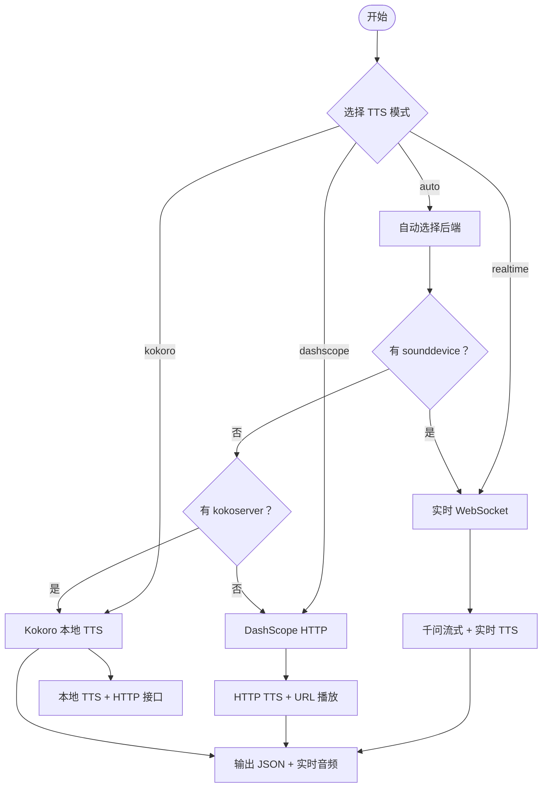

**图表来源**
- [qwen-to-data7.py:1228-1288](file://qwen-to-data7.py#L1228-L1288)
- [qwen-to-data7.py:1408-1414](file://qwen-to-data7.py#L1408-L1414)

**章节来源**
- [qwen-to-data7.py:1228-1288](file://qwen-to-data7.py#L1228-L1288)
- [qwen-to-data7.py:1408-1414](file://qwen-to-data7.py#L1408-L1414)

### **新增**Kokoro 本地 TTS 服务（kokoserver.py）
- **服务特性**
  - 基于 Kokoro 模型的本地语音合成服务
  - 支持实时流式播放和 HTTP 接口调用
  - SSE 事件流支持进度报告
- **API 接口**
  - GET /：服务主页
  - POST /tts：生成音频文件并返回访问 URL
  - POST /tts/stream：以 SSE 流式返回生成进度与最终 URL
- **配置选项**
  - HOST/PORT：服务监听地址（默认 0.0.0.0:8000）
  - KOKORO_REPO_ID：模型仓库 ID（默认 hexgrad/Kokoro-82M）
  - KOKORO_LOCAL_MODEL_DIR：本地模型目录（默认 kokoro_model）
  - LOCAL_VOICE_DIR：本地音色目录（默认 kokoro_model/voices）

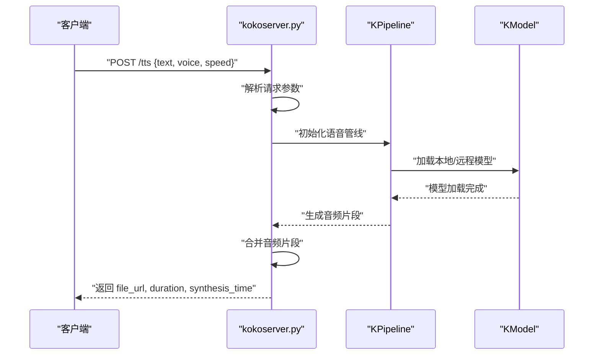

**图表来源**
- [kokoserver.py:158-204](file://kokoserver.py#L158-L204)
- [kokoserver.py:74-103](file://kokoserver.py#L74-L103)

**章节来源**
- [kokoserver.py:158-204](file://kokoserver.py#L158-L204)
- [kokoserver.py:74-103](file://kokoserver.py#L74-L103)

## 依赖分析
- 主要依赖
  - FastAPI、Uvicorn、Pydantic、Qwen-ASR、DashScope、PyDub、SoundFile、Python-dotenv、Edge-TTS、Pygame、SoundDevice、PyZMQ。
  - **新增**Kokoro 模型支持、实时 TTS WebSocket 客户端。
- 设备与运行时
  - 自动检测 CUDA/CPU，选择 bf16/fp32；FFmpeg 路径可通过环境变量指定。
  - **新增**sounddevice 用于实时音频播放，Kokoro 服务需要本地模型文件。

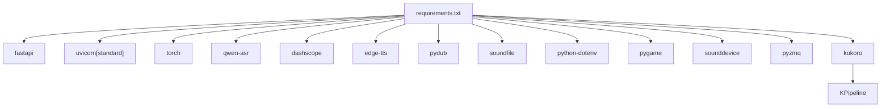

**图表来源**
- [requirements.txt:1-13](file://requirements.txt#L1-L13)

**章节来源**
- [requirements.txt:1-13](file://requirements.txt#L1-L13)
- [server.py:83-95](file://server.py#L83-L95)

## 性能考虑
- 设备选择
  - 优先使用 CUDA 设备与 bf16；CPU 上使用 fp32。
- ASR 推理
  - 合理设置 max_inference_batch_size 与 max_new_tokens，避免 OOM。
- WebSocket 实时识别
  - 通过 ASR_WS_DECODE_INTERVAL_S 与 ASR_WS_MAX_WINDOW_S 控制延迟与资源占用。
- FFmpeg 转码
  - 非 WAV 格式需转码为 16kHz 单声道；确保 FFmpeg 可用并配置 FFMPEG_PATH。
- TTS 播放
  - 实时 TTS 通过 WebSocket 流式播放；URL 模式下载后播放；注意等待完成事件的超时控制。
- **新增**多后端性能优化
  - 实时 WebSocket 模式具有最低延迟，但需要 sounddevice
  - HTTP 模式延迟较高但稳定性更好
  - 本地 Kokoro 模式完全离线，适合隐私敏感场景
  - 合理设置实时 TTS 完成等待时间，避免队列积压

**章节来源**
- [server.py:78-95](file://server.py#L78-L95)
- [server.py:136-137](file://server.py#L136-L137)
- [server.py:388-410](file://server.py#L388-L410)
- [qwen-to-data4.py:515-590](file://qwen-to-data4.py#L515-L590)
- [qwen-to-data4.py:661-714](file://qwen-to-data4.py#L661-L714)
- [qwen-to-data7.py:1264-1267](file://qwen-to-data7.py#L1264-L1267)

## 故障排查指南
- 模型加载与环境
  - ASR 模型路径配置（ASR_MODEL_PATH），确保包含 config.json 与权重；Hub 连接不稳定时建议本地路径。
- 依赖版本
  - torchvision/nms 版本不匹配、check_model_inputs 与 transformers 兼容性问题。
- TTS Key
  - 缺少 DASHSCOPE_API_KEY 或地域不一致。
- FFmpeg
  - webm/ogg 无法解码：安装 FFmpeg 并在 .env 中设置 FFMPEG_PATH；IDE 子进程 PATH 与系统 PATH 不一致。
- 演示页播放
  - 外链 wav 加载失败：改用响应中的 URL 下载或扩展后端代理。
- ZMQ 与实时播报
  - 服务端未发送完成事件导致阻塞：通过 --realtime-tts-finish-wait 控制等待超时。
- **新增**多后端集成问题
  - sounddevice 未安装：实时 WebSocket 模式不可用，自动降级为 HTTP 模式
  - kokoserver 服务不可达：自动降级为 DashScope 模式
  - TTS 后端选择失败：检查环境变量和网络连接
- **新增**Kokoro 服务问题
  - 本地模型文件缺失：检查 KOKORO_LOCAL_MODEL_DIR 配置
  - 端口占用：修改 KOKORO_PORT 或停止占用进程
  - 音色文件不存在：检查 LOCAL_VOICE_DIR 下的 .pt 文件

**章节来源**
- [README.md:194-204](file://README.md#L194-L204)
- [server.py:388-410](file://server.py#L388-L410)
- [qwen-to-data7.py:1242-1247](file://qwen-to-data7.py#L1242-L1247)
- [kokoserver.py:163-169](file://kokoserver.py#L163-L169)

## 结论
本项目提供了完整的语音识别与合成能力，结合前端演示与 Vue 组件，便于快速集成与扩展。通过合理的环境配置、依赖管理与性能调优，可在本地与云端稳定运行。**新增**的多后端集成架构进一步增强了系统的灵活性和可靠性，支持实时 WebSocket、HTTP 和本地 Kokoro TTS 三种模式。ZMQ 脚本与 Kokoro 服务的引入，使得项目能够适应更多应用场景，包括离线部署和低延迟需求。

## 附录

### 开发环境搭建
- 安装依赖
  - 在项目根目录执行安装命令，确保 Python 环境满足依赖版本要求。
  - **新增**安装 sounddevice 以支持实时 WebSocket TTS
  - **新增**安装 kokoro 以支持本地 TTS 服务
- 环境变量
  - 在项目根目录创建 .env，配置 DASHSCOPE_API_KEY、ASR_MODEL_PATH、FFMPEG_PATH、UVICORN_* 等。
  - **新增**配置 KOKORO_TTS_URL、KOKORO_VOICE、KOKORO_SPEED 等 Kokoro 相关变量
- 启动服务
  - 使用 python server.py 或 uvicorn 启动；访问 /demo 查看演示页面。
  - **新增**启动 kokoserver.py 以启用本地 TTS 服务

**章节来源**
- [README.md:29-98](file://README.md#L29-L98)
- [requirements.txt:1-13](file://requirements.txt#L1-13)

### API 一览
- GET /
  - 健康检查
- GET /demo
  - 返回演示页面
- POST /transcribe
  - 上传音频识别，返回语言与文本
- WebSocket /ws/asr
  - 实时识别，周期性返回 partial 文本
- GET /tts/voices
  - 返回 TTS 音色列表
- POST /tts
  - DashScope TTS 合成
- GET /tts/edge-voices
  - Edge TTS 音色查询
- POST /tts/edge-subtitle-voiceover
  - 字幕时间轴配音（MP3）
- POST /tts/edge-subtitle-voiceover/link
  - 生成并返回链接
- GET /tts/edge-voiceover-files/{file_id}
  - 获取生成的 MP3

**章节来源**
- [README.md:100-179](file://README.md#L100-L179)
- [server.py:199-425](file://server.py#L199-L425)

### 扩展开发最佳实践
- 新功能添加
  - 在 server.py 中新增路由与处理逻辑，遵循现有异常处理与响应编码模式。
- API 扩展
  - 使用 Pydantic BaseModel 校验请求体；统一响应编码与错误处理。
- 性能优化
  - 合理设置 ASR 推理参数；WebSocket 识别周期与窗口大小；TTS 等待超时控制。
- 跨域与安全
  - CORS 已启用；生产环境建议限制来源与头部。
- **新增**多后端集成扩展
  - 遵循现有的后端选择模式，添加新的后端时需要实现相应的检测和调用逻辑
  - 确保新后端支持相同的接口签名和错误处理模式
  - 提供适当的降级策略和错误恢复机制

**章节来源**
- [server.py:67-76](file://server.py#L67-L76)
- [server.py:100-107](file://server.py#L100-L107)
- [server.py:212-248](file://server.py#L212-L248)
- [qwen-to-data7.py:1228-1288](file://qwen-to-data7.py#L1228-L1288)

### 测试指南
- 单元测试
  - 可针对关键函数（如 _transcribe_wav_sync、_ffmpeg_to_wav、_zimu_time_stretch_atempo）编写测试用例，覆盖异常路径与边界条件。
- 集成测试
  - 使用 FastAPI TestClient 测试路由与中间件；模拟 WebSocket 连接与消息交互。
- 端到端测试
  - 使用 demo.html 或自定义脚本，录制音频并通过 /transcribe 与 /ws/asr 验证识别结果；通过 /tts 验证 TTS 合成与播放。
- **新增**多后端集成测试
  - 测试不同后端模式的切换逻辑
  - 验证实时 WebSocket 的音频播放质量
  - 测试 HTTP 模式的回退机制
  - 测试 Kokoro 服务的可用性检测

**章节来源**
- [server.py:117-121](file://server.py#L117-L121)
- [edge_subtitle_voiceover.py:84-94](file://edge_subtitle_voiceover.py#L84-L94)
- [demo.html:602-650](file://demo.html#L602-L650)

### 代码规范与文档标准
- 命名约定
  - 函数与变量使用下划线命名；类名使用 PascalCase；常量使用全大写。
- 文档标准
  - 重要函数与类添加 docstring；README 中列出 API 与环境变量说明。
- 错误处理
  - 使用 HTTPException 返回明确错误信息；捕获异常并记录日志。
- **新增**多后端集成规范
  - 后端选择逻辑需要清晰的注释和文档
  - 每种后端模式需要相应的配置选项和环境变量说明
  - 实时 TTS 需要详细的生命周期管理和错误恢复机制

**章节来源**
- [README.md:100-179](file://README.md#L100-L179)
- [server.py:212-248](file://server.py#L212-L248)
- [qwen-to-data7.py:1228-1288](file://qwen-to-data7.py#L1228-L1288)

### 常见问题与调试技巧
- 模型加载失败
  - 检查 ASR_MODEL_PATH 是否正确；确保权重文件完整。
- FFmpeg 未找到
  - 在 .env 中设置 FFMPEG_PATH；确认 IDE 子进程 PATH。
- TTS 无输出
  - 检查 DASHSCOPE_API_KEY；查看响应结构与错误信息。
- 实时识别延迟高
  - 调整 ASR_WS_DECODE_INTERVAL_S 与 ASR_WS_MAX_WINDOW_S。
- **新增**多后端集成问题
  - 后端选择异常：检查环境变量和依赖库安装情况
  - 实时 TTS 连接失败：验证 sounddevice 安装和音频设备权限
  - HTTP 模式回退：检查网络连接和 API 密钥配置
- **新增**Kokoro 服务问题
  - 服务启动失败：检查端口占用和模型文件完整性
  - 音色加载失败：验证 LOCAL_VOICE_DIR 下的 .pt 文件格式
  - 生成音频失败：检查合成时间和样本率配置

**章节来源**
- [README.md:194-204](file://README.md#L194-L204)
- [server.py:136-137](file://server.py#L136-L137)
- [qwen-to-data7.py:1242-1247](file://qwen-to-data7.py#L1242-L1247)
- [kokoserver.py:163-169](file://kokoserver.py#L163-L169)

### **新增**多后端集成使用指南
- **自动模式（推荐）**
  - 适用于大多数场景，系统会自动选择最优后端
  - 优先使用实时 WebSocket，其次本地 Kokoro，最后 DashScope HTTP
- **实时 WebSocket 模式**
  - 适用于低延迟场景，需要 sounddevice 库
  - 支持指令式 TTS，可指定语音风格和语调
- **HTTP 模式**
  - 适用于稳定性优先的场景，无需额外依赖
  - 延迟较高但兼容性最好
- **本地 Kokoro 模式**
  - 适用于隐私敏感和离线场景
  - 需要预先下载和配置本地模型文件
  - 支持自定义音色和语速调节

**章节来源**
- [qwen-to-data7.py:1228-1288](file://qwen-to-data7.py#L1228-L1288)
- [qwen-to-data7.py:1408-1414](file://qwen-to-data7.py#L1408-L1414)