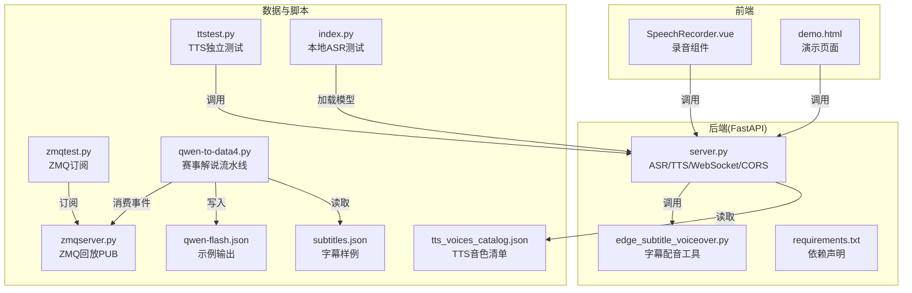
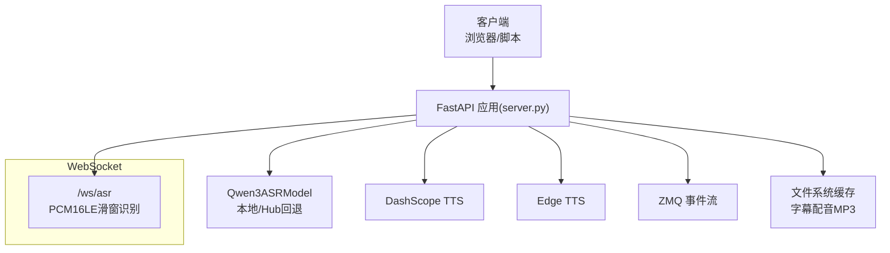
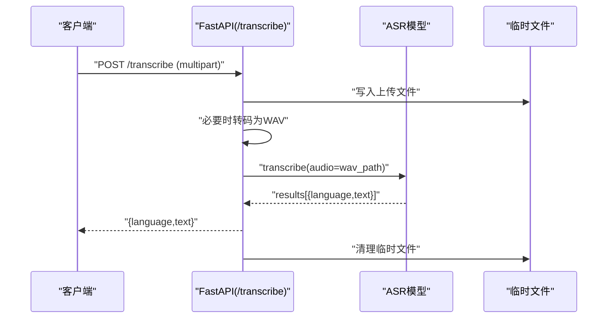
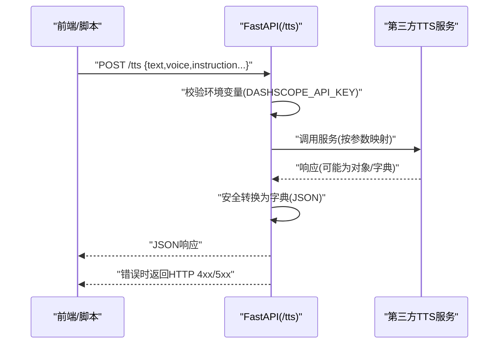
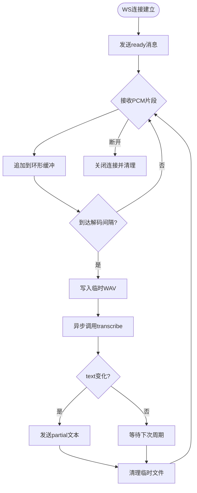
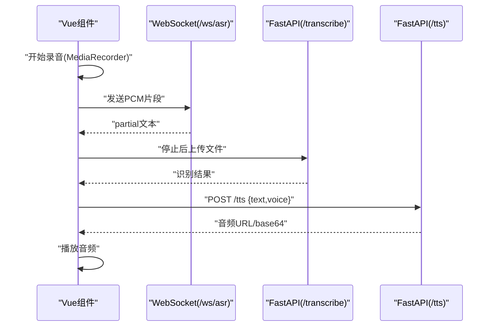
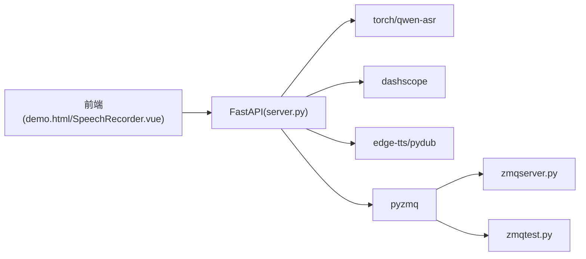

# 扩展开发指南

<cite>
**本文档引用的文件**
- [README.md](file://README.md)
- [server.py](file://server.py)
- [SpeechRecorder.vue](file://SpeechRecorder.vue)
- [requirements.txt](file://requirements.txt)
- [ttstest.py](file://ttstest.py)
- [tts_voices_catalog.json](file://tts_voices_catalog.json)
- [edge_subtitle_voiceover.py](file://edge_subtitle_voiceover.py)
- [demo.html](file://demo.html)
- [subtitles.json](file://subtitles.json)
- [qwen-flash.json](file://qwen-flash.json)
- [qwen-to-data4.py](file://qwen-to-data4.py)
- [zmqserver.py](file://zmqserver.py)
- [zmqtest.py](file://zmqtest.py)
- [index.py](file://index.py)
</cite>

## 目录
1. [简介](#简介)
2. [项目结构](#项目结构)
3. [核心组件](#核心组件)
4. [架构总览](#架构总览)
5. [详细组件分析](#详细组件分析)
6. [依赖关系分析](#依赖关系分析)
7. [性能考虑](#性能考虑)
8. [故障排查指南](#故障排查指南)
9. [结论](#结论)
10. [附录](#附录)

## 简介
本指南面向希望扩展本项目的开发者，涵盖以下主题：
- 新语音识别模型的接入：模型接口定义、配置管理与性能优化
- 新TTS服务的集成：API适配、参数映射与错误处理
- WebSocket扩展：消息协议设计与实时处理优化
- 前端组件扩展：Vue3组件扩展模式与API集成
- 插件系统与中间件：钩子机制与中间件开发思路
- 配置文件扩展：新增参数与默认值设置
- 第三方服务集成：最佳实践与注意事项

## 项目结构
该项目采用前后端分离架构，后端基于FastAPI提供ASR、TTS与WebSocket服务，前端提供演示页面与Vue组件。

**图表来源**
- [server.py:1-452](file://server.py#L1-L452)
- [SpeechRecorder.vue:1-90](file://SpeechRecorder.vue#L1-L90)
- [demo.html:1-685](file://demo.html#L1-L685)
- [edge_subtitle_voiceover.py:1-223](file://edge_subtitle_voiceover.py#L1-L223)
- [tts_voices_catalog.json:1-54](file://tts_voices_catalog.json#L1-L54)
- [ttstest.py:1-27](file://ttstest.py#L1-L27)
- [index.py:1-19](file://index.py#L1-L19)
- [zmqtest.py:1-46](file://zmqtest.py#L1-L46)
- [zmqserver.py:1-68](file://zmqserver.py#L1-L68)
- [qwen-to-data4.py:1-1086](file://qwen-to-data4.py#L1-L1086)
- [qwen-flash.json:1-1652](file://qwen-flash.json#L1-L1652)
- [subtitles.json:1-17](file://subtitles.json#L1-L17)

**章节来源**
- [README.md:1-287](file://README.md#L1-L287)
- [server.py:1-452](file://server.py#L1-L452)

## 核心组件
- FastAPI应用与路由
  - 健康检查、演示页、上传识别、WebSocket流式识别、TTS接口、字幕配音接口等
- 本地ASR模型加载与推理
  - 通过Qwen3ASRModel加载，支持本地路径或HuggingFace回退
- TTS服务集成
  - DashScope TTS、Microsoft Edge TTS、字幕配音MP3生成
- 前端组件
  - Vue3录音组件与演示页面，展示上传识别、实时识别与TTS播放
- ZMQ事件流水线
  - 订阅事件、批量总结、TTS实时播报与回放

**章节来源**
- [server.py:124-425](file://server.py#L124-L425)
- [edge_subtitle_voiceover.py:166-223](file://edge_subtitle_voiceover.py#L166-L223)
- [SpeechRecorder.vue:1-90](file://SpeechRecorder.vue#L1-L90)
- [demo.html:248-685](file://demo.html#L248-L685)
- [qwen-to-data4.py:773-1086](file://qwen-to-data4.py#L773-L1086)

## 架构总览
后端采用FastAPI，内置CORS中间件，提供REST与WebSocket接口；前端通过Fetch与WebSocket与后端交互；TTS服务通过DashScope或Edge实现；ZMQ用于事件驱动的批量处理与实时播报。

**图表来源**
- [server.py:67-76](file://server.py#L67-L76)
- [server.py:88-95](file://server.py#L88-L95)
- [server.py:124-197](file://server.py#L124-L197)
- [server.py:212-247](file://server.py#L212-L247)
- [server.py:256-360](file://server.py#L256-L360)
- [edge_subtitle_voiceover.py:166-223](file://edge_subtitle_voiceover.py#L166-L223)

## 详细组件分析

### 新语音识别模型接入指南
目标：在现有框架中接入新的ASR模型，保持接口一致与性能稳定。

- 模型接口定义
  - 保持与Qwen3ASRModel一致的transcribe签名，返回包含language与text的对象列表
  - 在加载阶段根据环境变量选择本地路径或Hub回退
- 配置管理
  - ASR_MODEL_PATH决定加载源；DEVICE/DTYPE自动选择GPU/CPU与精度
  - max_inference_batch_size与max_new_tokens影响推理吞吐与内存占用
- 性能优化
  - GPU优先：CUDA可用时使用bfloat16与device_map
  - 批处理：合理设置max_inference_batch_size避免OOM
  - 令牌上限：根据长音频调整max_new_tokens
  - I/O：上传文件转码与临时文件清理

**图表来源**
- [server.py:367-425](file://server.py#L367-L425)
- [index.py:1-19](file://index.py#L1-L19)

**章节来源**
- [server.py:83-95](file://server.py#L83-L95)
- [server.py:367-425](file://server.py#L367-L425)
- [index.py:1-19](file://index.py#L1-L19)

### 新TTS服务集成指南
目标：将新的TTS服务接入后端，统一参数映射与错误处理。

- API适配
  - 保持与DashScope相同的请求体结构：text、voice等
  - 响应统一转换为JSON，避免SDK响应对象的hasattr陷阱
- 参数映射
  - voice参数映射到具体音色；language_type等参数按服务要求设置
  - 支持指令控制（如instructions）与流式/非流式切换
- 错误处理
  - 缺少API Key时返回400
  - SDK异常捕获并返回500，包含详细错误信息
  - 响应结构校验，缺失字段时给出明确提示

**图表来源**
- [server.py:212-247](file://server.py#L212-L247)
- [ttstest.py:1-27](file://ttstest.py#L1-L27)

**章节来源**
- [server.py:100-107](file://server.py#L100-L107)
- [server.py:212-247](file://server.py#L212-L247)
- [ttstest.py:1-27](file://ttstest.py#L1-L27)

### WebSocket扩展指南
目标：设计消息协议与优化实时处理，确保低延迟与稳定性。

- 消息协议
  - 入站：二进制PCM16LE单声道16kHz
  - 出站：JSON文本帧，类型包括ready、partial、error
- 实时处理优化
  - 滑动窗口：max_window_s控制缓冲长度
  - 解码间隔：decode_interval_s控制识别频率
  - 异步I/O：使用asyncio与线程池避免阻塞
  - 并发锁：_asr_lock确保模型推理串行化
- 错误处理
  - 异常捕获并返回type="error"消息
  - 断开连接时清理资源

**图表来源**
- [server.py:124-197](file://server.py#L124-L197)

**章节来源**
- [server.py:124-197](file://server.py#L124-L197)

### 前端组件扩展指南
目标：在Vue3中扩展录音与播放能力，对接后端API。

- 扩展模式
  - 组件封装：将录音、上传、识别、播放封装为可复用组件
  - 状态管理：使用ref与响应式数据管理录音状态、错误与结果
  - 事件回调：onstop中触发上传与识别
- API集成
  - 上传识别：FormData + multipart/form-data
  - 实时识别：WebSocket + PCM16LE
  - TTS播放：优先URL，其次base64转Blob

**图表来源**
- [SpeechRecorder.vue:1-90](file://SpeechRecorder.vue#L1-L90)
- [demo.html:248-685](file://demo.html#L248-L685)

**章节来源**
- [SpeechRecorder.vue:1-90](file://SpeechRecorder.vue#L1-L90)
- [demo.html:248-685](file://demo.html#L248-L685)

### 插件系统与中间件开发
目标：在FastAPI中引入钩子与中间件，实现横切关注点。

- 中间件
  - CORS：已内置，允许跨域访问
  - 日志与访问统计：可通过Uvicorn参数控制
- 钩子机制
  - 请求/响应拦截：可在路由层增加前置/后置处理
  - 业务钩子：在ASR/TTS调用前后插入鉴权、限流、审计日志
- 中间件开发建议
  - 保持无状态与幂等
  - 异常隔离，避免影响主流程
  - 可配置开关，便于灰度发布

**章节来源**
- [server.py:67-76](file://server.py#L67-L76)
- [server.py:434-451](file://server.py#L434-L451)

### 配置文件扩展指南
目标：新增参数与默认值，确保向后兼容。

- 环境变量
  - ASR_WS_DECODE_INTERVAL_S：默认1.2秒
  - ASR_WS_MAX_WINDOW_S：默认12秒
  - FFMPEG_PATH：可选，解决IDE子进程PATH问题
  - PUBLIC_BASE_URL：反向代理/公网域名
- 配置加载
  - 优先加载项目根目录.env，再读取系统环境变量
  - 未设置时采用默认值，避免运行时异常

**章节来源**
- [server.py:33-44](file://server.py#L33-L44)
- [server.py:136-138](file://server.py#L136-L138)
- [README.md:48-83](file://README.md#L48-L83)

### 第三方服务集成最佳实践
- DashScope TTS
  - 使用MultiModalConversation调用，支持指令与流式/非流式
  - 统一响应转换，避免hasattr陷阱
  - 错误码与消息校验，确保前端友好提示
- Edge TTS
  - 实时查询音色列表，支持按locale/gender过滤
  - 字幕配音：按时间轴对齐，变速atempo保持音高
- ZMQ事件流
  - 订阅topic hado.event，按批聚合事件
  - 实时TTS：WebSocket实时播报，超时强制关闭避免积压
  - 输出：JSON数组记录批次、错误与TTS元数据

**章节来源**
- [server.py:212-247](file://server.py#L212-L247)
- [server.py:256-360](file://server.py#L256-L360)
- [edge_subtitle_voiceover.py:166-223](file://edge_subtitle_voiceover.py#L166-L223)
- [qwen-to-data4.py:773-1086](file://qwen-to-data4.py#L773-L1086)

## 依赖关系分析
后端依赖FastAPI、uvicorn、torch、qwen-asr、dashscope、edge-tts等；前端演示页面与Vue组件通过HTTP与WebSocket与后端交互；ZMQ脚本用于事件回放与订阅。

**图表来源**
- [requirements.txt:1-13](file://requirements.txt#L1-L13)
- [server.py:12-31](file://server.py#L12-L31)
- [demo.html:248-685](file://demo.html#L248-L685)
- [SpeechRecorder.vue:1-90](file://SpeechRecorder.vue#L1-L90)
- [zmqserver.py:1-68](file://zmqserver.py#L1-L68)
- [zmqtest.py:1-46](file://zmqtest.py#L1-L46)

**章节来源**
- [requirements.txt:1-13](file://requirements.txt#L1-L13)
- [server.py:12-31](file://server.py#L12-L31)

## 性能考虑
- 设备与精度
  - CUDA可用时使用bfloat16与device_map，提升吞吐与降低显存占用
- 推理参数
  - 合理设置max_inference_batch_size与max_new_tokens，避免OOM
- I/O与转码
  - 上传文件转码使用ffmpeg，失败时提供明确错误信息
  - 临时文件及时清理，避免磁盘压力
- WebSocket
  - 控制解码间隔与滑动窗口，平衡实时性与CPU占用
  - 异步I/O与线程池结合，避免阻塞事件循环

**章节来源**
- [server.py:78-82](file://server.py#L78-L82)
- [server.py:89-95](file://server.py#L89-L95)
- [server.py:136-138](file://server.py#L136-L138)
- [server.py:388-410](file://server.py#L388-L410)

## 故障排查指南
- HuggingFace连接超时
  - 配置ASR_MODEL_PATH指向本地权重目录
- FFmpeg缺失或PATH问题
  - 在.env中设置FFMPEG_PATH为ffmpeg.exe绝对路径
- API Key缺失
  - 检查DASHSCOPE_API_KEY是否正确配置
- CORS跨域问题
  - 默认已启用CORS，如遇问题检查代理与证书
- WebSocket连接失败
  - 检查防火墙与代理，确认WS/WSS协议匹配

**章节来源**
- [README.md:194-204](file://README.md#L194-L204)
- [server.py:388-410](file://server.py#L388-L410)

## 结论
本指南提供了从模型接入、TTS集成、WebSocket扩展到前端组件与第三方服务集成的完整扩展路径。通过遵循统一的接口定义、参数映射与错误处理规范，开发者可以快速、安全地扩展系统能力，并在性能与稳定性之间取得良好平衡。

## 附录
- 示例与脚本
  - 本地ASR测试：index.py
  - TTS独立测试：ttstest.py
  - 字幕配音：edge_subtitle_voiceover.py
  - ZMQ事件流水线：qwen-to-data4.py
  - ZMQ回放与订阅：zmqserver.py、zmqtest.py
- 配置参考
  - 环境变量：ASR_MODEL_PATH、DASHSCOPE_API_KEY、FFMPEG_PATH、PUBLIC_BASE_URL等
  - WebSocket参数：ASR_WS_DECODE_INTERVAL_S、ASR_WS_MAX_WINDOW_S

**章节来源**
- [index.py:1-19](file://index.py#L1-L19)
- [ttstest.py:1-27](file://ttstest.py#L1-L27)
- [edge_subtitle_voiceover.py:166-223](file://edge_subtitle_voiceover.py#L166-L223)
- [qwen-to-data4.py:773-1086](file://qwen-to-data4.py#L773-L1086)
- [zmqserver.py:1-68](file://zmqserver.py#L1-L68)
- [zmqtest.py:1-46](file://zmqtest.py#L1-L46)
- [README.md:48-83](file://README.md#L48-L83)