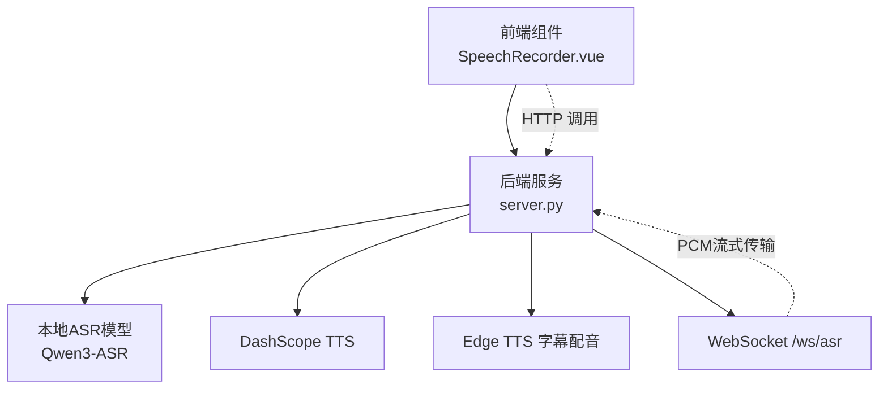
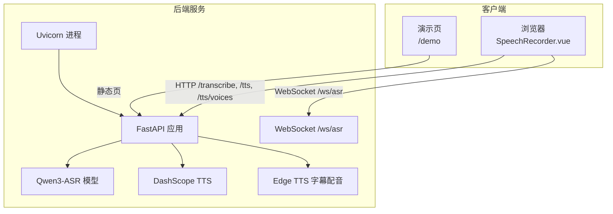
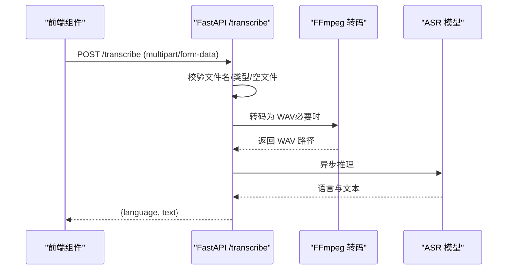
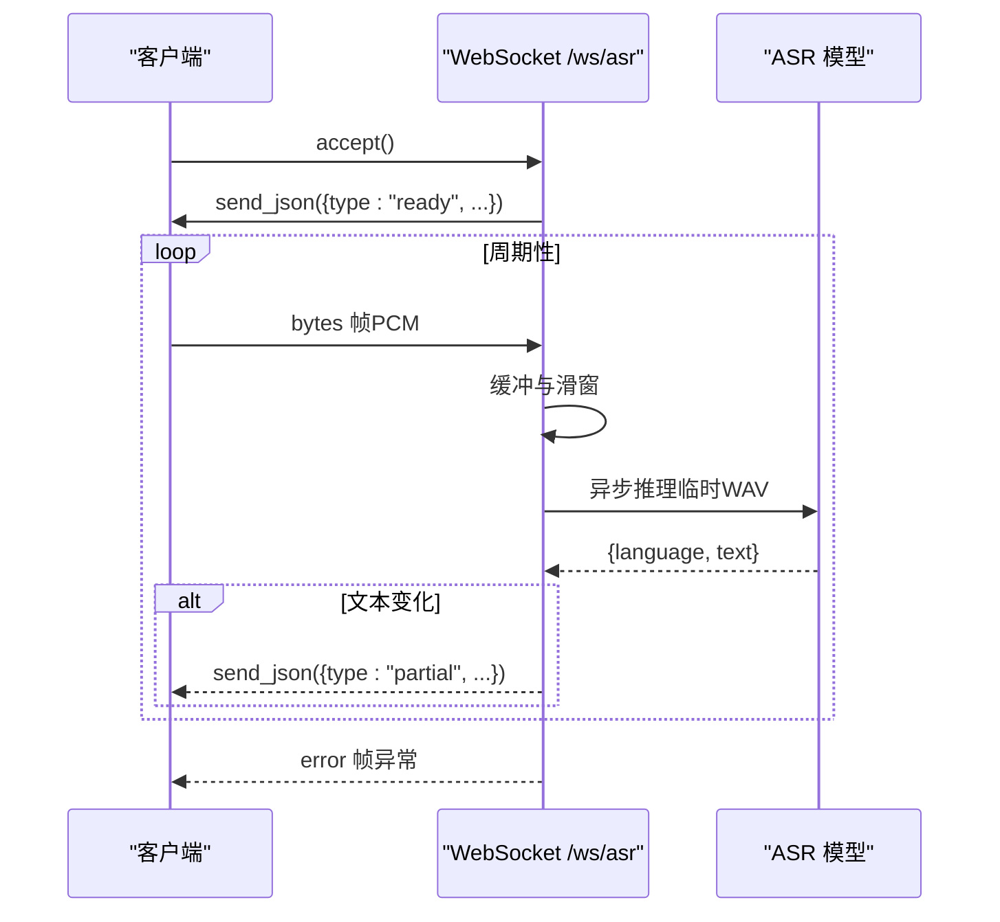
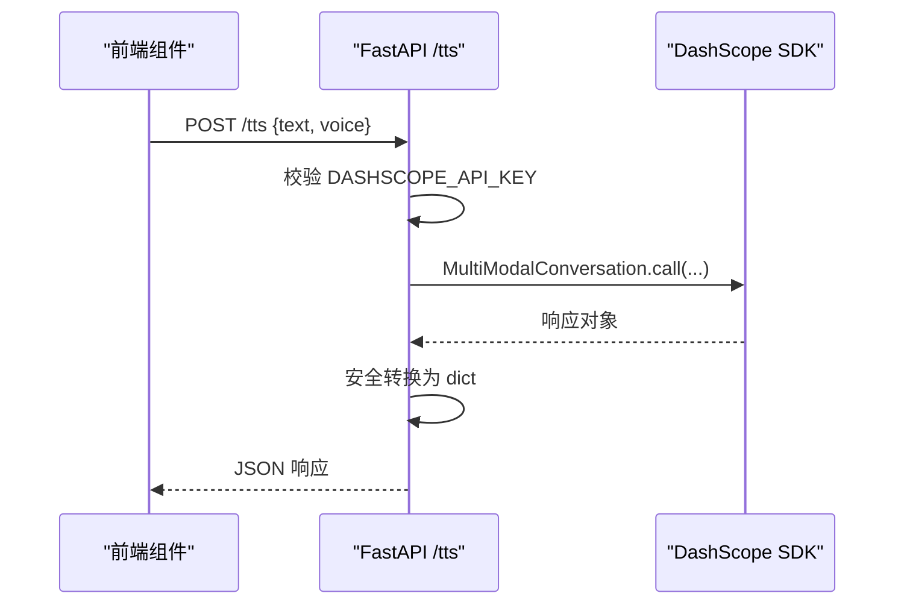
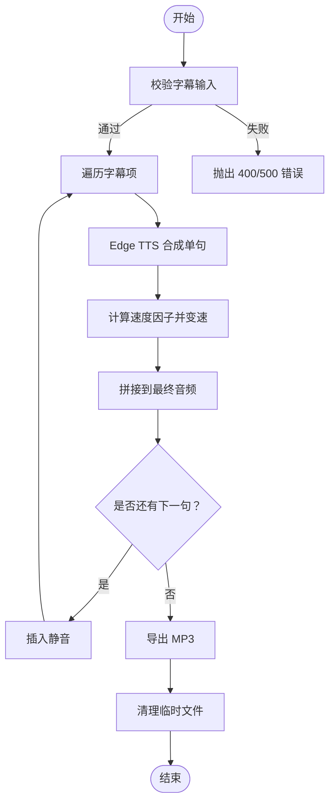
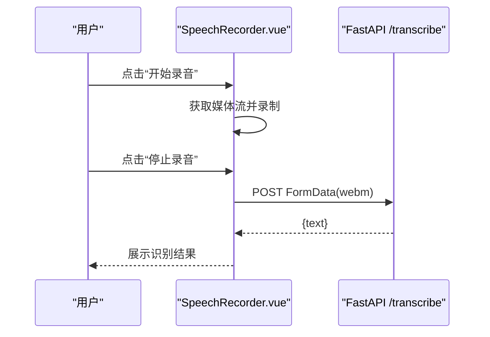
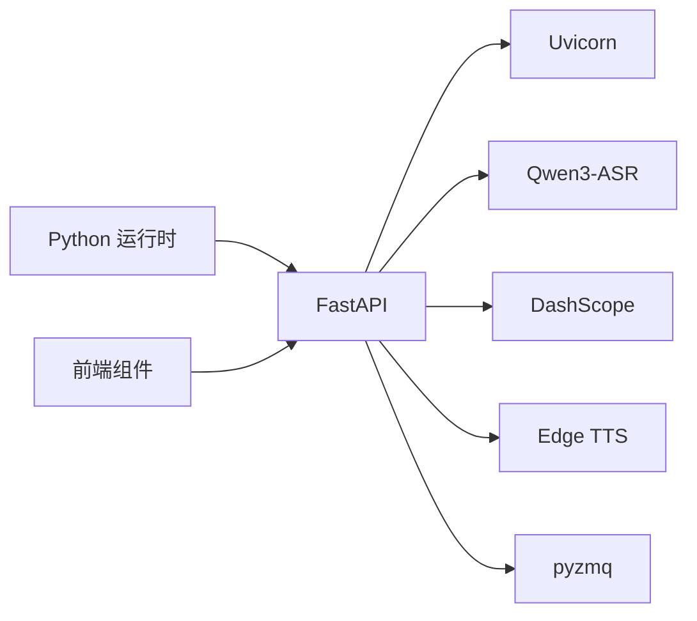

# 测试策略与实践

<cite>
**本文引用的文件**
- [README.md](file://README.md)
- [server.py](file://server.py)
- [SpeechRecorder.vue](file://SpeechRecorder.vue)
- [requirements.txt](file://requirements.txt)
- [ttstest.py](file://ttstest.py)
- [index.py](file://index.py)
- [edge_subtitle_voiceover.py](file://edge_subtitle_voiceover.py)
- [test_kokoro.py](file://test_kokoro.py)
- [qwen3stream.py](file://qwen3stream.py)
- [zmqtest.py](file://zmqtest.py)
</cite>

## 目录
1. [引言](#引言)
2. [项目结构](#项目结构)
3. [核心组件](#核心组件)
4. [架构总览](#架构总览)
5. [详细组件分析](#详细组件分析)
6. [依赖关系分析](#依赖关系分析)
7. [性能考量](#性能考量)
8. [故障排查指南](#故障排查指南)
9. [结论](#结论)
10. [附录](#附录)

## 引言
本指南面向开发者，围绕语音识别与语音合成后端（FastAPI + Qwen3-ASR/TTS）及前端录音组件，构建一套完整的测试策略与实践。内容涵盖：
- 单元测试设计原则与实现方法（测试用例编写、Mock对象、断言策略）
- 集成测试实施方案（API端点、WebSocket、音频处理）
- 端到端测试自动化（环境搭建、数据准备、结果验证）
- 测试覆盖率要求与测量方法
- 性能与压力测试实施指南
- 测试数据准备与管理策略
- 持续集成中的测试自动化配置
- 常见测试问题排查与解决

## 项目结构
该项目采用“后端服务 + 前端组件 + 辅助脚本”的组织方式：
- 后端服务：FastAPI 应用，提供 ASR、TTS、WebSocket 实时识别、字幕配音等接口
- 前端组件：Vue3 录音组件，负责采集音频并通过 HTTP 调用后端接口
- 辅助脚本：独立 TTS 调用、本地 ASR 测试、Edge TTS 字幕配音、实时 TTS、ZMQ 订阅等

图表来源
- [server.py:124-197](file://server.py#L124-L197)
- [SpeechRecorder.vue:48-62](file://SpeechRecorder.vue#L48-L62)

章节来源
- [README.md:5-19](file://README.md#L5-L19)
- [server.py:67-96](file://server.py#L67-L96)

## 核心组件
- FastAPI 应用与路由
  - 健康检查、演示页、上传识别、WebSocket 实时识别、TTS、Edge TTS 列表与字幕配音、字幕配音链接生成与文件服务
- 前端录音组件
  - 使用浏览器 MediaRecorder 采集音频，上传至 /transcribe，展示识别结果
- 本地与云端语音能力
  - 本地 Qwen3-ASR 模型推理
  - DashScope TTS（含实时 WebSocket 与 URL 两种模式）
  - Edge TTS 字幕配音（时序对齐、变速、静音拼接）

章节来源
- [server.py:199-425](file://server.py#L199-L425)
- [SpeechRecorder.vue:20-77](file://SpeechRecorder.vue#L20-L77)
- [ttstest.py:13-26](file://ttstest.py#L13-L26)
- [edge_subtitle_voiceover.py:166-223](file://edge_subtitle_voiceover.py#L166-L223)

## 架构总览
后端服务通过中间件启用跨域，加载本地 ASR 模型，提供多类接口；前端组件通过 HTTP 与 WebSocket 与后端交互。

图表来源
- [server.py:67-96](file://server.py#L67-L96)
- [server.py:124-197](file://server.py#L124-L197)
- [server.py:212-247](file://server.py#L212-L247)
- [server.py:250-361](file://server.py#L250-L361)

## 详细组件分析

### 组件A：上传识别 /transcribe
- 设计原则
  - 输入校验：文件名、文件类型、空文件
  - 转码策略：webm/ogg/m4a/mp3/flac 等非 WAV 文件通过 FFmpeg 转码为 WAV
  - 推理安全：异步线程执行模型推理，避免阻塞
  - 清理策略：临时文件在 finally 中清理
- Mock 对象建议
  - 上传文件：构造 UploadFile（模拟 webm/ogg 等）
  - FFmpeg：Mock subprocess.run，覆盖成功/失败分支
  - ASR 模型：Mock asr_model.transcribe 返回语言与文本
- 断言策略
  - 成功场景：状态码 200，响应包含 language 与 text
  - 失败场景：400/500，错误信息明确（如缺少文件名、转码失败、推理失败）

图表来源
- [server.py:367-425](file://server.py#L367-L425)

章节来源
- [server.py:367-425](file://server.py#L367-L425)

### 组件B：WebSocket 实时识别 /ws/asr
- 设计原则
  - 帧接收与缓冲：二进制 PCM16LE 单声道 16kHz，滑动窗口维持最大窗口长度
  - 周期性解码：按解码间隔触发转写，避免频繁 IO
  - 错误处理：异常通过 JSON 文本帧返回 error
- Mock 对象建议
  - WebSocket：Mock receive()/send_json()，注入 bytes 帧与断开事件
  - ASR：Mock _transcribe_wav_sync 返回语言与文本
- 断言策略
  - 连接阶段：收到 ready 帧，包含采样率、通道、窗口与解码间隔
  - 识别阶段：周期性收到 partial 文本，文本变化时才推送
  - 异常阶段：收到 error 帧，消息可读

图表来源
- [server.py:124-197](file://server.py#L124-L197)

章节来源
- [server.py:124-197](file://server.py#L124-L197)

### 组件C：TTS 接口 /tts 与 /tts/voices
- 设计原则
  - 环境变量校验：缺失 API Key 返回 400
  - 响应安全：兼容 dashscope 响应对象，统一转为 dict
  - 语音列表：/tts/voices 返回音色目录
- Mock 对象建议
  - DashScope SDK：Mock MultiModalConversation.call 返回结构化响应
- 断言策略
  - 成功：200，响应包含音频 URL 或 base64 数据
  - 失败：400/500，错误信息明确（Key 缺失、SDK 异常）

图表来源
- [server.py:212-247](file://server.py#L212-L247)
- [ttstest.py:13-26](file://ttstest.py#L13-L26)

章节来源
- [server.py:212-247](file://server.py#L212-L247)
- [ttstest.py:13-26](file://ttstest.py#L13-L26)

### 组件D：Edge TTS 字幕配音 /tts/edge-*
- 设计原则
  - 字幕时间轴对齐：逐句合成，按 end_time 与下一帧 start_time 插入静音
  - 语速调整：使用 FFmpeg atempo 保持音高
  - 文件管理：生成 MP3，支持缓存目录与链接返回
- Mock 对象建议
  - edge_tts：Mock Communicate.save
  - FFmpeg：Mock 转码与变速
- 断言策略
  - 输入校验：content 非空、时间顺序合法
  - 输出校验：MP3 可播放，时长与时间轴对齐

图表来源
- [edge_subtitle_voiceover.py:166-223](file://edge_subtitle_voiceover.py#L166-L223)

章节来源
- [edge_subtitle_voiceover.py:166-223](file://edge_subtitle_voiceover.py#L166-L223)

### 组件E：前端录音组件 SpeechRecorder.vue
- 设计原则
  - 用户交互：开始/停止录音，显示识别结果与错误
  - 数据准备：Blob(webm) + FormData 上传
- Mock 对象建议
  - navigator.mediaDevices.getUserMedia：Mock 返回音频流
  - fetch：Mock /transcribe 返回 JSON
- 断言策略
  - 成功：返回 text，错误为空
  - 失败：返回错误信息

图表来源
- [SpeechRecorder.vue:20-77](file://SpeechRecorder.vue#L20-L77)
- [server.py:367-425](file://server.py#L367-L425)

章节来源
- [SpeechRecorder.vue:20-77](file://SpeechRecorder.vue#L20-L77)

## 依赖关系分析
- 运行时依赖：FastAPI、Uvicorn、torch、qwen-asr、dashscope、edge-tts、pydub、soundfile、pygame、sounddevice、pyzmq 等
- 测试相关依赖：pytest、httpx（HTTP 测试）、websockets（WebSocket 测试）、pytest-asyncio（异步测试）、coverage（覆盖率）

图表来源
- [requirements.txt:1-13](file://requirements.txt#L1-L13)

章节来源
- [requirements.txt:1-13](file://requirements.txt#L1-L13)

## 性能考量
- ASR 推理
  - 设备选择：GPU 优先（bf16），CPU 回退（f32）
  - 批大小与新 token 限制：max_inference_batch_size 与 max_new_tokens
- WebSocket 实时识别
  - 解码间隔与滑动窗口：ASR_WS_DECODE_INTERVAL_S 与 ASR_WS_MAX_WINDOW_S
- TTS
  - 实时 WebSocket 与 URL 模式：根据延迟与吞吐需求选择
- 压力测试建议
  - 并发连接数、并发转写任务、并发 TTS 请求
  - 持续时间与目标指标（P95/P99 延迟、吞吐、错误率）

章节来源
- [server.py:78-95](file://server.py#L78-L95)
- [server.py:136-137](file://server.py#L136-L137)

## 故障排查指南
- ASR 模型加载
  - 现象：连接 huggingface.co 超时
  - 处理：配置 ASR_MODEL_PATH 指向本地完整权重目录
- FFmpeg 缺失
  - 现象：/transcribe webm 报错
  - 处理：在 .env 设置 FFMPEG_PATH 或加入系统 PATH
- DashScope Key 缺失
  - 现象：/tts 报 400
  - 处理：检查 .env 中 DASHSCOPE_API_KEY
- WebSocket 实时 TTS 阻塞
  - 现象：播报“播一段就停”
  - 处理：调整实时 TTS finish 等待时间，避免过长阻塞队列

章节来源
- [README.md:194-204](file://README.md#L194-L204)
- [server.py:388-410](file://server.py#L388-L410)
- [server.py:215-217](file://server.py#L215-L217)

## 结论
本测试策略以“单元测试 + 集成测试 + 端到端测试 + 性能测试”为主线，结合 Mock 与真实依赖，覆盖上传识别、WebSocket 实时识别、TTS（含实时与 URL）、Edge TTS 字幕配音等核心能力。建议在 CI 中引入覆盖率统计与性能回归基线，确保质量与稳定性。

## 附录

### 单元测试设计与实现
- 测试用例编写
  - 输入边界：空文件、非法扩展名、空内容
  - 转码分支：webm/ogg/m4a/mp3/flac 成功/失败
  - ASR 推理：正常/失败
  - TTS：Key 缺失/SDK 异常/响应转换
  - WebSocket：ready/partial/error 帧序列
  - Edge TTS：字幕时间轴合法/非法、FFmpeg 缺失
- Mock 对象
  - 使用 unittest.mock 或 pytest-mock，隔离外部依赖
  - 重点 Mock：subprocess.run、asr_model.transcribe、dashscope.MultiModalConversation.call、edge_tts.Communicate.save
- 断言策略
  - 状态码与响应结构
  - 错误信息可读性与一致性
  - 异常传播与日志记录

### 集成测试实施方案
- API 端点测试
  - /transcribe：上传多种格式音频，断言 language/text
  - /tts：断言音频 URL/base64，/tts/voices 断言音色列表
- WebSocket 连接测试
  - /ws/asr：发送 PCM 帧，断言 ready/partial/error
- 音频处理测试
  - Edge TTS 字幕配音：断言 MP3 可播放、时长与时间轴对齐

### 端到端测试自动化
- 环境搭建
  - 启动 Uvicorn 进程，加载 .env
  - 准备测试音频与字幕数据
- 数据准备
  - 本地 ASR 模型路径、DashScope API Key、FFmpeg 路径
- 结果验证
  - HTTP 响应与 WebSocket 帧内容
  - 生成音频文件可播放性

### 测试覆盖率要求与测量
- 覆盖率目标
  - 业务关键路径：≥80%
  - 核心模块（ASR/TTS/WebSocket）：≥90%
- 测量方法
  - 使用 coverage.py 或 pytest-cov，生成 HTML 报告
  - CI 中失败阈值：未达标的分支需说明原因并跟踪修复

### 性能测试与压力测试
- 指标
  - 延迟：P50/P95/P99
  - 吞吐：requests/sec
  - 错误率：HTTP 5xx、WebSocket 异常
- 方法
  - Locust/JMeter/自研压测工具
  - 并发连接数与任务强度阶梯式递增

### 测试数据准备与管理
- 数据类型
  - 音频：短句（ASR）、长句（TTS）、多语言混合
  - 字幕：正常/异常时间轴、空内容
- 管理策略
  - 分层存储：本地缓存、CI 专用数据集
  - 隐私与合规：脱敏与最小化使用

### 持续集成中的测试自动化
- CI 配置要点
  - 安装依赖与模型权重
  - 启动服务与数据库（如需）
  - 运行单元/集成/端到端测试
  - 上传覆盖率报告与测试结果
- 建议流水线
  - 触发：push/pr
  - 步骤：安装 → 加载模型 → 运行测试 → 生成报告 → 通知