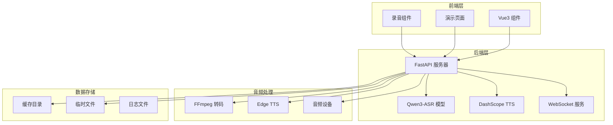
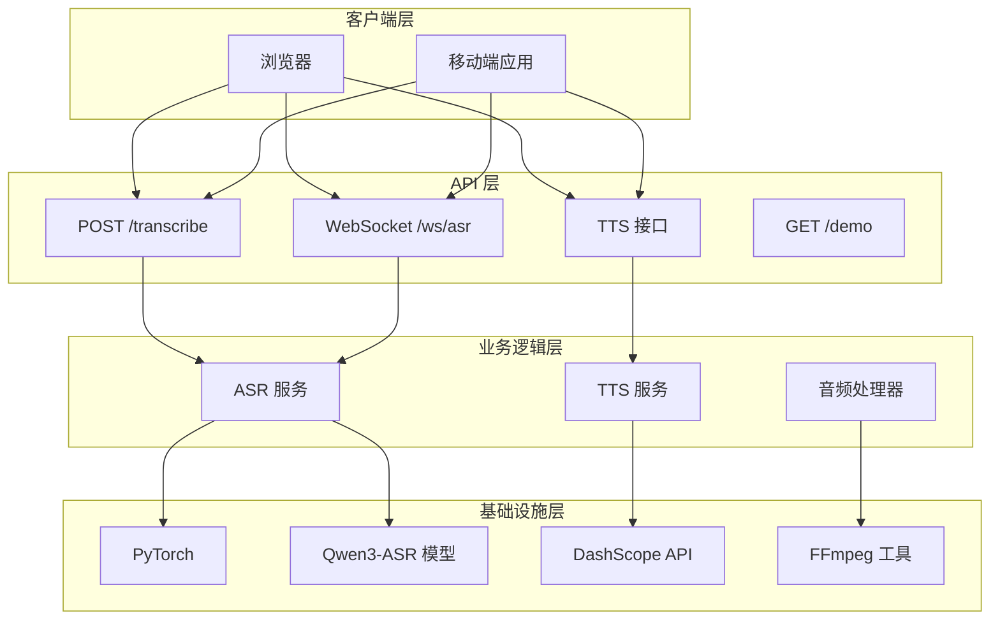
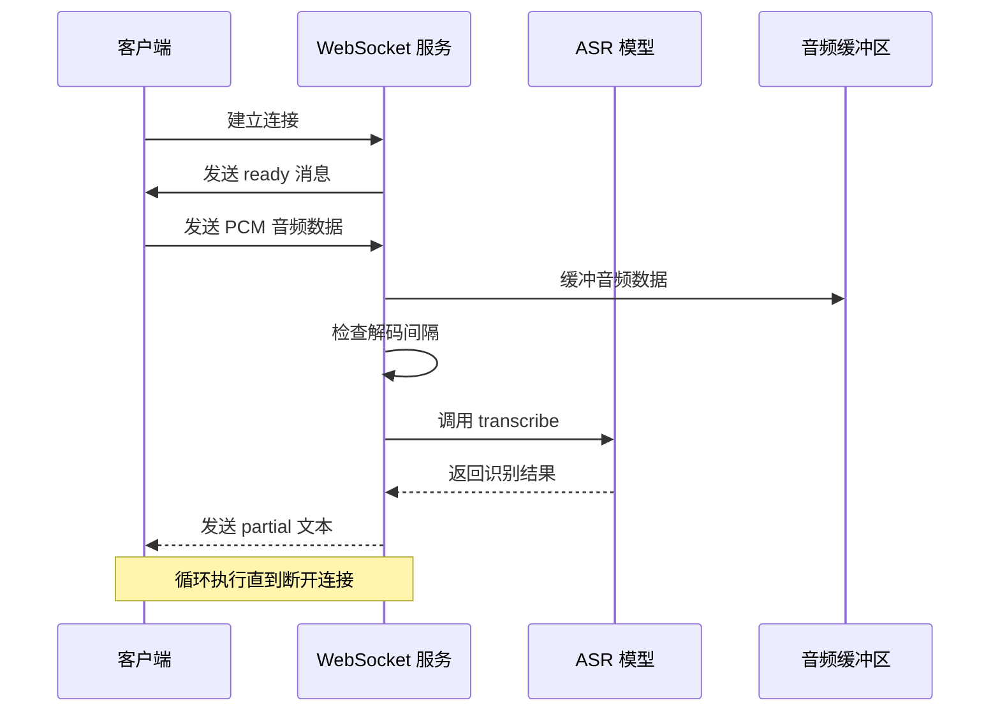
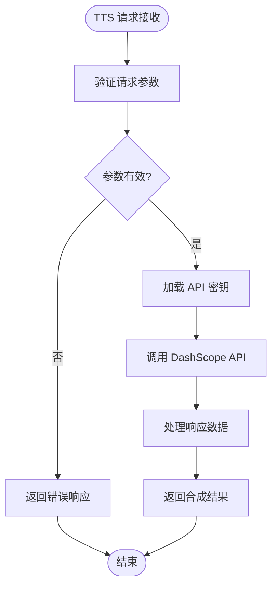
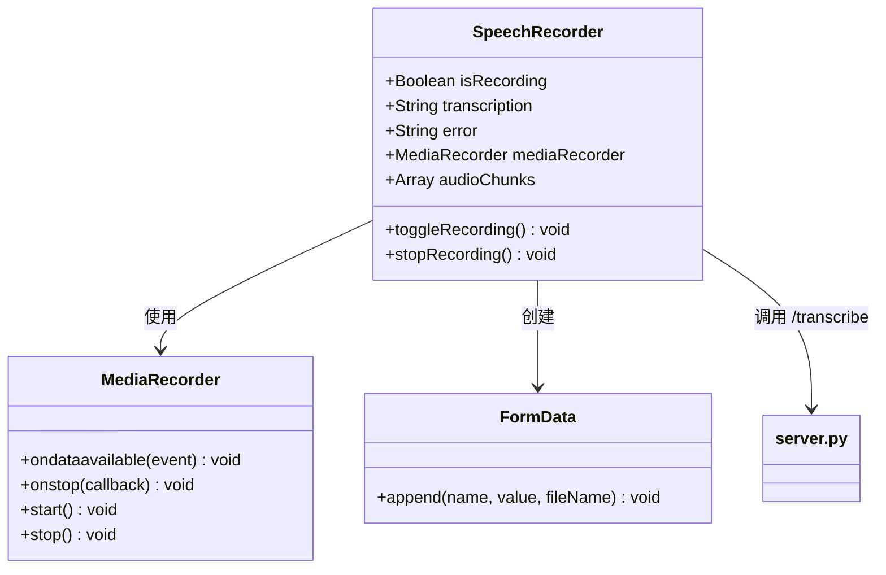
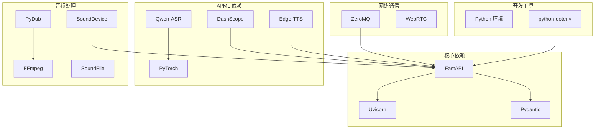
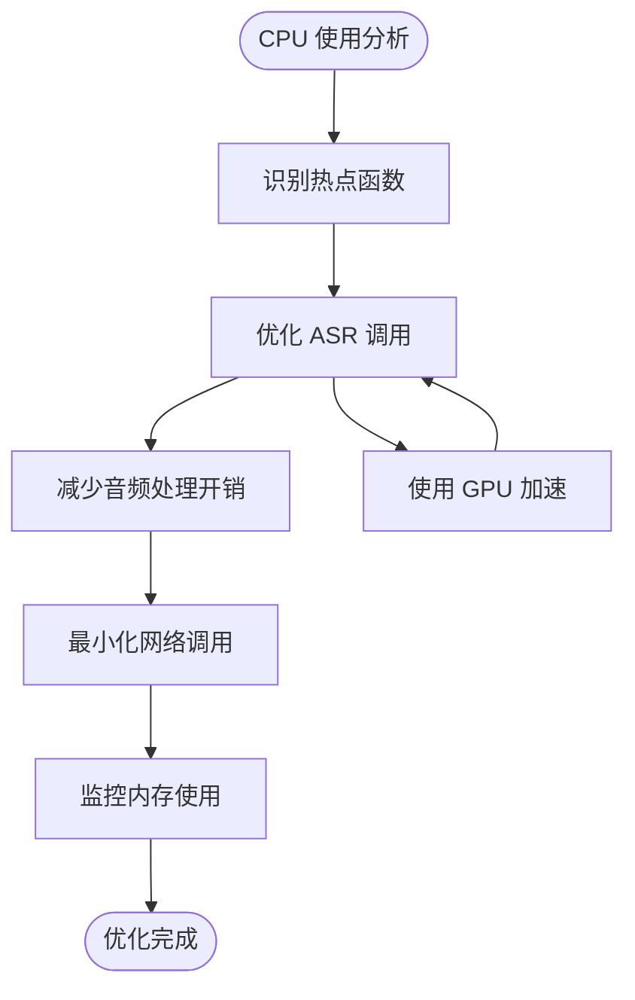
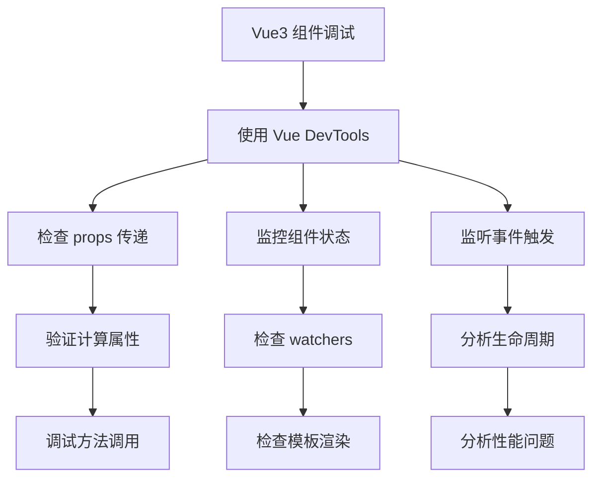

# 调试与故障排除

<cite>
**本文档引用的文件**
- [README.md](file://README.md)
- [server.py](file://server.py)
- [SpeechRecorder.vue](file://SpeechRecorder.vue)
- [demo.html](file://demo.html)
- [requirements.txt](file://requirements.txt)
- [edge_subtitle_voiceover.py](file://edge_subtitle_voiceover.py)
- [ttstest.py](file://ttstest.py)
- [index.py](file://index.py)
- [qwen3stream.py](file://qwen3stream.py)
- [zmqtest.py](file://zmqtest.py)
- [jsonschema.json](file://jsonschema.json)
</cite>

## 目录
1. [简介](#简介)
2. [项目结构](#项目结构)
3. [核心组件](#核心组件)
4. [架构概览](#架构概览)
5. [详细组件分析](#详细组件分析)
6. [依赖关系分析](#依赖关系分析)
7. [性能考虑](#性能考虑)
8. [故障排除指南](#故障排除指南)
9. [结论](#结论)

## 简介

Vue3 Speech 是一个基于 Vue3 和 FastAPI 构建的语音识别与语音合成应用。该项目提供了本地 Qwen3-ASR 语音识别、阿里云 DashScope TTS 语音合成、WebSocket 伪实时流式识别等功能。本文档旨在为开发者提供全面的调试和故障排除指南，涵盖 ASR 识别失败、TTS 合成错误、WebSocket 连接问题等常见问题的诊断和解决方法。

## 项目结构

该项目采用前后端分离的架构设计，主要包含以下核心组件：



**图表来源**
- [server.py:1-452](file://server.py#L1-L452)
- [SpeechRecorder.vue:1-90](file://SpeechRecorder.vue#L1-L90)
- [demo.html:1-685](file://demo.html#L1-L685)

**章节来源**
- [README.md:5-19](file://README.md#L5-L19)
- [server.py:67-95](file://server.py#L67-L95)

## 核心组件

### 语音识别组件

语音识别功能通过 Qwen3-ASR 模型实现，支持多种音频格式的转写：

- **上传识别**：支持 WAV、MP3、M4A、OGG、WEBM、FLAC 格式
- **实时识别**：通过 WebSocket 提供 16kHz 单声道 PCM 音频流式识别
- **模型加载**：支持本地模型路径和 Hugging Face Hub 回退机制

### 语音合成组件

语音合成通过阿里云 DashScope API 实现：

- **TTS 接口**：支持多种音色和语言配置
- **实时 TTS**：支持 WebSocket 实时音频流传输
- **本地 TTS**：集成 Edge TTS 语音合成能力

### 前端组件

- **SpeechRecorder.vue**：可复用的 Vue3 录音组件
- **demo.html**：完整的演示页面，包含录音、实时识别、TTS 播放功能
- **WebSocket 客户端**：实现实时音频流传输

**章节来源**
- [README.md:21-27](file://README.md#L21-L27)
- [server.py:124-197](file://server.py#L124-L197)
- [server.py:212-248](file://server.py#L212-L248)

## 架构概览

系统采用模块化设计，各组件职责明确：



**图表来源**
- [server.py:67-248](file://server.py#L67-L248)
- [demo.html:248-665](file://demo.html#L248-L665)

## 详细组件分析

### WebSocket 实时识别组件

WebSocket 实时识别是系统的核心功能之一，实现了准实时的语音识别：



**图表来源**
- [server.py:124-197](file://server.py#L124-L197)

#### 关键配置参数

| 参数名称 | 默认值 | 说明 |
|---------|--------|------|
| ASR_WS_DECODE_INTERVAL_S | 1.2 秒 | 解码间隔时间 |
| ASR_WS_MAX_WINDOW_S | 12 秒 | 音频滑动窗口大小 |
| sample_rate | 16000 Hz | 采样频率 |
| channels | 1 | 单声道 |

**章节来源**
- [server.py:136-152](file://server.py#L136-L152)

### TTS 语音合成组件

TTS 语音合成组件提供了多种语音合成模式：



**图表来源**
- [server.py:212-248](file://server.py#L212-L248)

#### TTS 音色配置

系统支持多种音色配置，音色信息来源于 `tts_voices_catalog.json` 文件：

| 音色参数 | 描述 | 适用场景 |
|---------|------|----------|
| Cherry | 温柔女声 | 普通对话、教育内容 |
| Ethan | 清晰男声 | 新闻播报、正式场合 |
| Vivian | 专业女声 | 会议记录、商务场景 |

**章节来源**
- [server.py:250-254](file://server.py#L250-L254)

### 前端录音组件

Vue3 录音组件提供了完整的录音功能：



**图表来源**
- [SpeechRecorder.vue:11-78](file://SpeechRecorder.vue#L11-L78)

**章节来源**
- [SpeechRecorder.vue:20-78](file://SpeechRecorder.vue#L20-L78)

## 依赖关系分析

项目依赖关系复杂，涉及多个第三方库：



**图表来源**
- [requirements.txt:1-13](file://requirements.txt#L1-L13)

**章节来源**
- [requirements.txt:1-13](file://requirements.txt#L1-L13)

## 性能考虑

### 内存管理

系统在音频处理过程中需要谨慎管理内存：

1. **临时文件清理**：所有临时 WAV 文件在使用后都会被自动清理
2. **缓冲区管理**：WebSocket 音频缓冲区限制在 12 秒范围内
3. **模型内存**：ASR 模型支持 GPU 加速，减少 CPU 占用

### CPU 使用率优化



### 网络延迟优化

1. **WebSocket 连接池**：复用 WebSocket 连接减少握手开销
2. **音频数据压缩**：使用 16kHz 单声道 PCM 减少带宽占用
3. **批量处理**：WebSocket 实现滑动窗口批量处理

## 故障排除指南

### ASR 识别失败

#### 常见问题及解决方案

| 问题现象 | 可能原因 | 解决方案 |
|---------|----------|----------|
| 模型加载失败 | Hugging Face 连接超时 | 配置本地模型路径 `ASR_MODEL_PATH` |
| 识别结果为空 | 音频质量差或静音 | 检查麦克风权限和音频输入 |
| 识别速度慢 | GPU 不可用 | 确保 CUDA 可用或调整 batch size |
| 格式不支持 | 音频格式不受支持 | 转换为 WAV 格式或安装 FFmpeg |

#### 诊断步骤

1. **检查模型加载**
   ```bash
   # 验证 ASR 模型是否正确加载
   python index.py
   ```

2. **测试音频格式**
   ```bash
   # 检查 FFmpeg 是否可用
   ffmpeg -version
   ```

3. **查看日志**
   ```bash
   # 启动服务器时增加日志级别
   UVICORN_LOG_LEVEL=debug python server.py
   ```

**章节来源**
- [README.md:194-204](file://README.md#L194-L204)
- [server.py:88-95](file://server.py#L88-L95)

### TTS 合成错误

#### 常见问题及解决方案

| 问题现象 | 可能原因 | 解决方案 |
|---------|----------|----------|
| API Key 缺失 | 环境变量未设置 | 在 `.env` 文件中设置 `DASHSCOPE_API_KEY` |
| 合成失败 | 网络连接问题 | 检查网络连接和防火墙设置 |
| 音频播放失败 | 跨域问题 | 使用后端代理下载音频文件 |
| 音色不可用 | 音色参数错误 | 检查 `tts_voices_catalog.json` 中的音色列表 |

#### 诊断步骤

1. **验证 API Key**
   ```bash
   # 测试独立 TTS 脚本
   python ttstest.py
   ```

2. **检查音色配置**
   ```bash
   # 获取可用音色列表
   curl http://localhost:8000/tts/voices
   ```

3. **测试音频播放**
   ```bash
   # 检查音频 URL 可访问性
   curl -I http://localhost:8000/tts
   ```

**章节来源**
- [README.md:196-202](file://README.md#L196-L202)
- [ttstest.py:1-27](file://ttstest.py#L1-L27)

### WebSocket 连接问题

#### 常见问题及解决方案

| 问题现象 | 可能原因 | 解决方案 |
|---------|----------|----------|
| 连接失败 | 端口被占用 | 更换端口号或关闭占用程序 |
| 连接中断 | 网络不稳定 | 检查网络连接和防火墙设置 |
| 数据传输错误 | 格式不匹配 | 确保发送 16kHz 单声道 PCM 数据 |
| 识别延迟高 | 服务器性能不足 | 增加服务器资源或优化配置 |

#### 诊断步骤

1. **检查端口占用**
   ```bash
   # 检查 8000 端口是否被占用
   netstat -an | grep :8000
   ```

2. **测试 WebSocket 连接**
   ```bash
   # 使用浏览器开发者工具检查 WebSocket 连接
   # 打开 Network 标签页，查看 WS 连接状态
   ```

3. **监控连接状态**
   ```bash
   # 启用详细日志
   UVICORN_LOG_LEVEL=debug python server.py
   ```

**章节来源**
- [server.py:124-197](file://server.py#L124-L197)

### 音频处理问题

#### 常见问题及解决方案

| 问题现象 | 可能原因 | 解决方案 |
|---------|----------|----------|
| WebM 解码失败 | 缺少 FFmpeg | 安装 FFmpeg 并设置 `FFMPEG_PATH` |
| PCM 数据格式错误 | 采样率或通道数不匹配 | 确保发送 16kHz 单声道 PCM 数据 |
| 音频播放异常 | 跨域或格式不支持 | 使用后端代理或转换音频格式 |
| 设备兼容性问题 | 音频设备驱动问题 | 更新音频驱动或更换设备 |

#### 诊断步骤

1. **检查 FFmpeg 配置**
   ```bash
   # 验证 FFmpeg 路径
   ffmpeg -version
   ```

2. **测试音频转换**
   ```bash
   # 检查音频格式转换功能
   python edge_subtitle_voiceover.py
   ```

3. **验证音频设备**
   ```bash
   # 测试音频播放设备
   python -c "import sounddevice; print(sounddevice.query_devices())"
   ```

**章节来源**
- [README.md:203](file://README.md#L203)
- [edge_subtitle_voiceover.py:43-82](file://edge_subtitle_voiceover.py#L43-L82)

### 前端调试技巧

#### 浏览器开发者工具使用

1. **Network 标签页**
   - 监控 API 请求和响应
   - 检查 WebSocket 连接状态
   - 分析音频数据传输

2. **Console 标签页**
   - 查看 JavaScript 错误信息
   - 调试音频处理逻辑
   - 监控实时识别状态

3. **Sources 标签页**
   - 设置断点调试
   - 检查异步操作
   - 分析事件处理流程

#### Vue3 组件调试



**章节来源**
- [SpeechRecorder.vue:11-78](file://SpeechRecorder.vue#L11-L78)
- [demo.html:433-458](file://demo.html#L433-L458)

### 生产环境问题

#### 快速定位策略

1. **日志分析**
   ```bash
   # 启用详细日志级别
   UVICORN_LOG_LEVEL=info python server.py
   
   # 检查访问日志
   tail -f uvicorn.log
   ```

2. **性能监控**
   ```bash
   # 监控系统资源使用
   top
   # 或在 Windows 上使用
   taskmgr
   ```

3. **错误追踪**
   ```bash
   # 检查错误堆栈
   python -m trace --trace server.py
   ```

#### 常见生产环境问题

| 问题类型 | 诊断方法 | 解决方案 |
|---------|----------|----------|
| 内存泄漏 | 监控内存使用趋势 | 优化对象销毁和循环引用 |
| CPU 占用过高 | 分析热点函数 | 优化算法或启用缓存 |
| 网络延迟 | 测量 RTT 和吞吐量 | 优化网络配置或升级带宽 |
| 并发问题 | 检查线程安全 | 使用锁或线程安全的数据结构 |

**章节来源**
- [server.py:434-451](file://server.py#L434-L451)

### 常见错误代码

#### HTTP 状态码

| 状态码 | 含义 | 可能原因 | 解决方案 |
|-------|------|----------|----------|
| 200 | 成功 | 请求正常处理 | 检查响应数据格式 |
| 400 | 请求错误 | 参数无效或缺失 | 验证请求参数 |
| 404 | 资源不存在 | 路径错误或文件缺失 | 检查 API 路径 |
| 500 | 服务器错误 | 服务器内部异常 | 查看服务器日志 |
| 502 | 网关错误 | 外部服务不可用 | 检查依赖服务状态 |

#### WebSocket 错误类型

| 错误类型 | 含义 | 解决方案 |
|---------|------|----------|
| ready | 连接建立成功 | 继续发送音频数据 |
| partial | 部分识别结果 | 更新界面显示 |
| error | 识别错误 | 检查音频质量和网络连接 |

#### 日志级别

| 级别 | 用途 | 建议场景 |
|------|------|----------|
| debug | 详细调试信息 | 开发阶段和问题定位 |
| info | 一般运行信息 | 生产环境常规监控 |
| warning | 警告信息 | 需要注意的问题 |
| error | 错误信息 | 异常情况处理 |

**章节来源**
- [server.py:144-190](file://server.py#L144-L190)
- [README.md:77-76](file://README.md#L77-L76)

## 结论

本调试和故障排除指南涵盖了 Vue3 Speech 项目的主要技术栈和常见问题。通过理解系统的架构设计、掌握各组件的工作原理，以及运用本文提供的诊断方法和解决方案，开发者可以有效地定位和解决各种技术问题。

关键要点包括：
- 理解 WebSocket 实时识别的工作机制
- 掌握 TTS 语音合成的配置和调试方法
- 熟悉音频处理的格式转换和设备兼容性问题
- 学会使用浏览器开发者工具进行前端调试
- 建立完善的日志分析和错误追踪体系

建议在实际开发中：
1. 建立标准化的日志记录和错误报告机制
2. 定期进行性能基准测试和压力测试
3. 建立完善的监控和告警系统
4. 制定详细的故障恢复和应急预案

通过这些措施，可以确保系统的稳定性和可靠性，为用户提供优质的语音识别和语音合成服务。