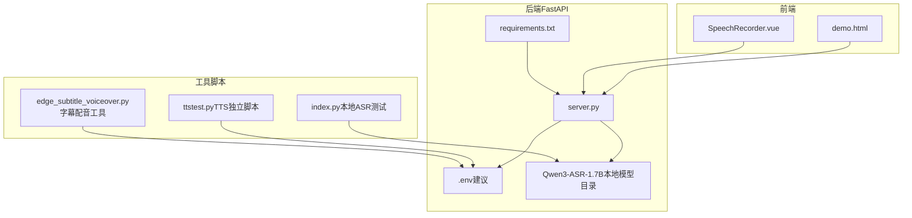
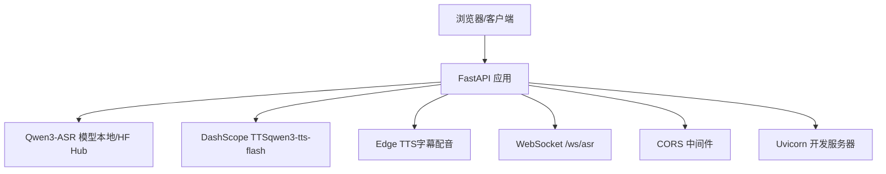
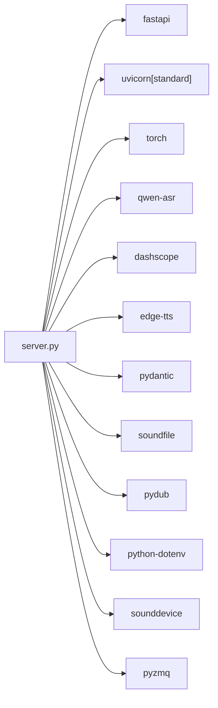

# 快速开始

<cite>
**本文引用的文件**
- [README.md](file://README.md)
- [requirements.txt](file://requirements.txt)
- [server.py](file://server.py)
- [index.py](file://index.py)
- [demo.html](file://demo.html)
- [SpeechRecorder.vue](file://SpeechRecorder.vue)
- [ttstest.py](file://ttstest.py)
- [edge_subtitle_voiceover.py](file://edge_subtitle_voiceover.py)
- [Qwen3-ASR-1.7B/README.md](file://Qwen3-ASR-1.7B/README.md)
</cite>

## 目录
1. [简介](#简介)
2. [项目结构](#项目结构)
3. [核心组件](#核心组件)
4. [架构总览](#架构总览)
5. [详细组件分析](#详细组件分析)
6. [依赖关系分析](#依赖关系分析)
7. [性能注意事项](#性能注意事项)
8. [故障排查指南](#故障排查指南)
9. [结论](#结论)
10. [附录](#附录)

## 简介
本指南面向希望快速搭建并运行 Vue3Speech 项目的开发者，涵盖：
- Python 环境准备与依赖安装
- 环境变量配置（.env）
- 本地 ASR 模型下载与配置（Hugging Face CLI）
- Uvicorn 服务器启动与基本 API 测试
- 常见问题排查与解决方案

## 项目结构
项目采用前后端分离思路：前端为静态页面与 Vue 组件，后端基于 FastAPI，提供 ASR、WebSocket 实时识别、TTS 等能力，并内置 Uvicorn 作为开发服务器。

图表来源
- [server.py:1-452](file://server.py#L1-L452)
- [requirements.txt:1-13](file://requirements.txt#L1-L13)
- [demo.html:1-685](file://demo.html#L1-L685)
- [SpeechRecorder.vue:1-90](file://SpeechRecorder.vue#L1-L90)
- [index.py:1-19](file://index.py#L1-L19)
- [ttstest.py:1-27](file://ttstest.py#L1-L27)
- [edge_subtitle_voiceover.py:1-223](file://edge_subtitle_voiceover.py#L1-L223)

章节来源
- [README.md:5-18](file://README.md#L5-L18)
- [server.py:67-76](file://server.py#L67-L76)
- [requirements.txt:1-13](file://requirements.txt#L1-L13)

## 核心组件
- FastAPI 应用与路由
  - 健康检查、演示页、上传识别、WebSocket 实时识别、TTS、字幕配音等接口
- 本地 ASR 模型加载
  - 支持本地目录或 Hugging Face Hub，自动选择加载源
- 环境变量与配置
  - .env 加载顺序与优先级、Uvicorn 启动参数、WebSocket 识别参数
- 前端演示与 Vue 组件
  - demo.html 提供麦克风授权、录音、实时识别、TTS 演示
  - SpeechRecorder.vue 可集成到 Vue3 工程

章节来源
- [README.md:21-27](file://README.md#L21-L27)
- [server.py:83-95](file://server.py#L83-L95)
- [server.py:124-197](file://server.py#L124-L197)
- [server.py:212-247](file://server.py#L212-L247)
- [demo.html:174-685](file://demo.html#L174-L685)
- [SpeechRecorder.vue:11-77](file://SpeechRecorder.vue#L11-L77)

## 架构总览
后端以 FastAPI 为核心，加载本地 Qwen3-ASR 模型，提供：
- HTTP 接口：/transcribe、/tts、/tts/voices、/tts/edge-voices、/tts/edge-subtitle-voiceover、/tts/edge-voiceover-files
- WebSocket 接口：/ws/asr（准实时流式识别）
- CORS 中间件与 Uvicorn 内置开发服务器

图表来源
- [server.py:67-76](file://server.py#L67-L76)
- [server.py:89-95](file://server.py#L89-L95)
- [server.py:212-247](file://server.py#L212-L247)
- [server.py:300-361](file://server.py#L300-L361)
- [server.py:124-197](file://server.py#L124-L197)
- [server.py:434-451](file://server.py#L434-L451)

## 详细组件分析

### 环境与依赖安装
- 创建并激活 Python 虚拟环境（推荐）
- 安装依赖：pip install -r requirements.txt
- 主要依赖：fastapi、uvicorn[standard]、torch、qwen-asr、dashscope、edge-tts、pydub、soundfile、python-dotenv、pygame、sounddevice、pyzmq

章节来源
- [README.md:29-36](file://README.md#L29-L36)
- [requirements.txt:1-13](file://requirements.txt#L1-L13)

### 本地 ASR 模型下载与配置
- 模型加载策略
  - 若 ASR_MODEL_PATH 指向的本地目录存在且包含完整权重文件，则优先使用本地路径
  - 否则回退至 Hugging Face Hub 的 Qwen/Qwen3-ASR-1.7B
- 使用 Hugging Face CLI 下载
  - 示例命令：hf download Qwen/Qwen3-ASR-1.7B --local-dir ./Qwen3-ASR-1.7B
- 本地模型目录要求
  - 必须包含 config.json 与权重文件，确保加载成功

章节来源
- [README.md:38-46](file://README.md#L38-L46)
- [server.py:83-86](file://server.py#L83-L86)
- [server.py:89-95](file://server.py#L89-L95)
- [Qwen3-ASR-1.7B/README.md:42-55](file://Qwen3-ASR-1.7B/README.md#L42-L55)

### 环境变量配置（.env）
- 位置与加载
  - 位于项目根目录，与 server.py 同级
  - 服务端会加载 server.py 所在目录下的 .env，不依赖当前工作目录
- 常用变量
  - DASHSCOPE_API_KEY：TTS 必需
  - ASR_MODEL_PATH：本地 ASR 模型目录（绝对或相对项目根路径）
  - FFMPEG_PATH：Windows 下 ffmpeg.exe 绝对路径（IDE 子进程 PATH 常不含用户 PATH）
  - UVICORN_HOST/PORT/RELOAD/LOG_LEVEL：Uvicorn 启动参数
  - ASR_WS_DECODE_INTERVAL_S、ASR_WS_MAX_WINDOW_S：WebSocket 识别参数

章节来源
- [README.md:48-66](file://README.md#L48-L66)
- [server.py:33-43](file://server.py#L33-L43)
- [server.py:83-86](file://server.py#L83-L86)
- [server.py:136-137](file://server.py#L136-L137)

### Uvicorn 服务器启动
- 方式一：python server.py（内置 Uvicorn）
  - 支持 UVICORN_HOST、UVICORN_PORT、UVICORN_RELOAD、UVICORN_LOG_LEVEL、UVICORN_ACCESS_LOG、UVICORN_PROXY_HEADERS
- 方式二：uvicorn server:app --host 0.0.0.0 --port 8000
- 访问地址
  - 本机：http://127.0.0.1:8000/ 或 http://localhost:8000/
  - 局域网：http://<本机局域网IP>:8000/demo

章节来源
- [README.md:84-98](file://README.md#L84-L98)
- [server.py:434-451](file://server.py#L434-L451)

### API 使用与测试
- 健康检查：GET /
- 演示页：GET /demo
- 上传识别：POST /transcribe（multipart/form-data，字段 file）
- WebSocket 实时识别：/ws/asr（PCM16LE 单声道 16kHz，周期性 partial 文本）
- TTS：POST /tts（application/json，{ text, voice }）
- TTS 语音列表：GET /tts/voices
- Edge TTS 语音列表：GET /tts/edge-voices
- 字幕配音：POST /tts/edge-subtitle-voiceover（按时间轴生成 MP3）

章节来源
- [README.md:100-149](file://README.md#L100-L149)
- [server.py:199-201](file://server.py#L199-L201)
- [server.py:204-209](file://server.py#L204-L209)
- [server.py:367-425](file://server.py#L367-L425)
- [server.py:124-197](file://server.py#L124-L197)
- [server.py:212-247](file://server.py#L212-L247)
- [server.py:250-253](file://server.py#L250-L253)
- [server.py:256-297](file://server.py#L256-L297)
- [server.py:300-361](file://server.py#L300-L361)

### 前端集成要点
- 语音识别（上传文件）
  - 使用 FormData 上传 file 字段到 /transcribe
- TTS（JSON + 播放）
  - POST /tts，解析响应中的 output.audio.url 或 output.audio.data
- Vue 组件
  - 可将 SpeechRecorder.vue 集成到 Vue3 工程，请求地址指向后端

章节来源
- [README.md:151-182](file://README.md#L151-L182)
- [demo.html:248-685](file://demo.html#L248-L685)
- [SpeechRecorder.vue:11-77](file://SpeechRecorder.vue#L11-L77)

## 依赖关系分析
后端依赖关系概览（简化）：

图表来源
- [requirements.txt:1-13](file://requirements.txt#L1-L13)
- [server.py:13-31](file://server.py#L13-L31)

章节来源
- [requirements.txt:1-13](file://requirements.txt#L1-L13)
- [server.py:13-31](file://server.py#L13-L31)

## 性能注意事项
- 设备与精度
  - 若存在 GPU，优先使用 CUDA 设备与 bfloat16；否则回退 CPU 与 float32
- 推理参数
  - max_inference_batch_size、max_new_tokens 等参数影响内存与速度
- WebSocket 识别
  - decode_interval_s 与 max_window_s 控制滑动窗口与周期性识别频率
- FFmpeg
  - Windows 下建议在 .env 中显式设置 FFMPEG_PATH，避免 IDE 子进程 PATH 问题

章节来源
- [server.py:78-81](file://server.py#L78-L81)
- [server.py:89-95](file://server.py#L89-L95)
- [server.py:136-137](file://server.py#L136-L137)
- [server.py:402-410](file://server.py#L402-L410)

## 故障排查指南
- 连接 huggingface.co 超时
  - 配置有效本地目录 ASR_MODEL_PATH，确保包含 config.json 与权重
- torchvision/nms 版本不兼容
  - 卸载不匹配的 torchvision，或重装与 torch 同源的 torch/torchvision
- check_model_inputs 与 transformers 不兼容
  - 锁定与 qwen-asr 匹配的 transformers 版本
- /tts 缺少 Key
  - 检查 .env 中 DASHSCOPE_API_KEY，确认地域一致（默认北京）
- 演示页 TTS 无法播放
  - 外链 wav 加载受限；可解析返回 JSON 中的 url 手动下载，或扩展后端代理
- /transcribe 上传 webm 报错
  - 安装 FFmpeg；若 PowerShell 正常但服务报错，在 .env 设置 FFMPEG_PATH 指向 ffmpeg.exe 绝对路径

章节来源
- [README.md:194-204](file://README.md#L194-L204)
- [server.py:402-410](file://server.py#L402-L410)

## 结论
按照本指南完成 Python 环境与依赖安装、.env 配置、本地 ASR 模型准备后，即可通过 python server.py 或 uvicorn 启动后端服务，并使用 demo.html 或 Vue 组件进行 API 测试与功能验证。遇到常见问题时，可依据故障排查指南快速定位与解决。

## 附录

### 本地 ASR 测试脚本（index.py）
- 用途：本地加载 Qwen3-ASR-1.7B 并对音频进行转写
- 注意：需确保本地模型目录完整，或网络可访问 HF Hub

章节来源
- [index.py:1-19](file://index.py#L1-L19)

### TTS 独立脚本（ttstest.py）
- 用途：调用 DashScope TTS（qwen3-tts-flash），打印响应
- 注意：需配置 DASHSCOPE_API_KEY

章节来源
- [ttstest.py:1-27](file://ttstest.py#L1-L27)

### 字幕配音工具（edge_subtitle_voiceover.py）
- 用途：按字幕时间轴生成 Edge-TTS 配音（MP3），支持 FFmpeg atempo 速度调整
- 注意：需安装 FFmpeg，并在 .env 中设置 FFMPEG_PATH（Windows）

章节来源
- [edge_subtitle_voiceover.py:1-223](file://edge_subtitle_voiceover.py#L1-L223)