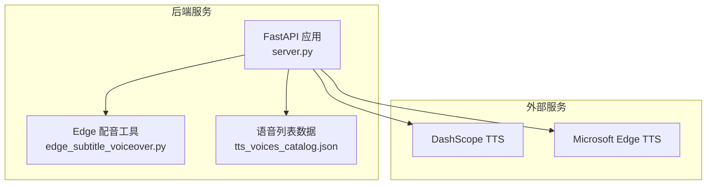
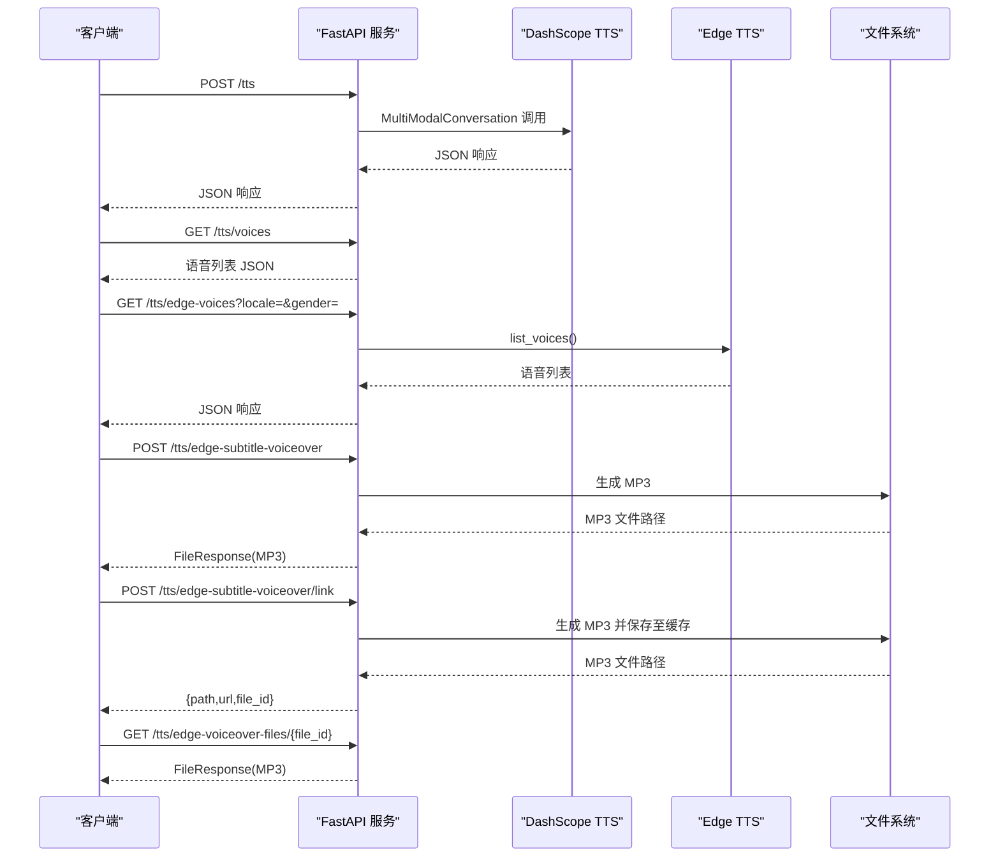
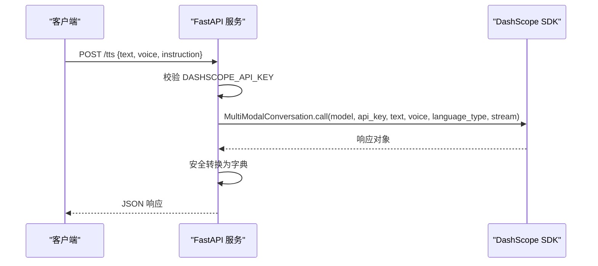
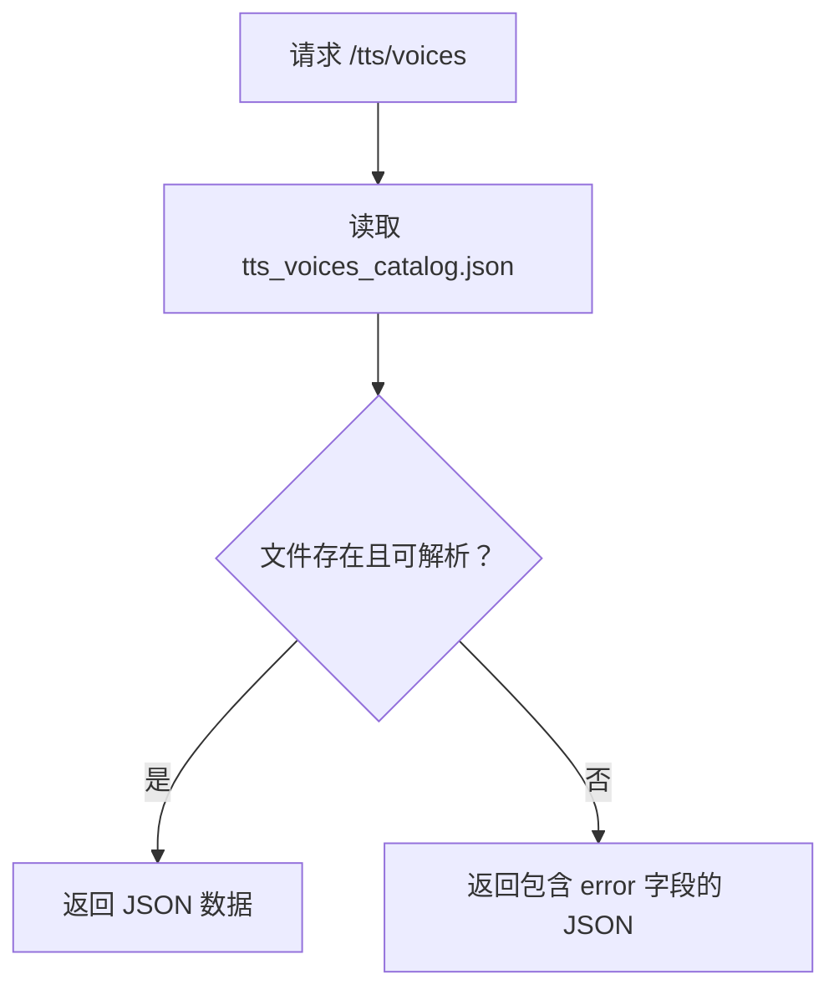
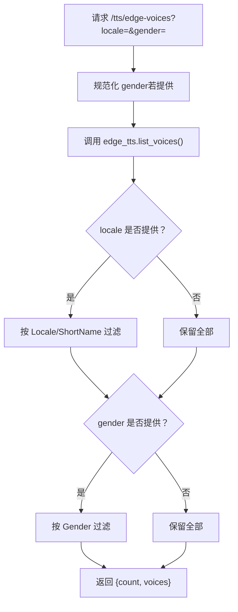
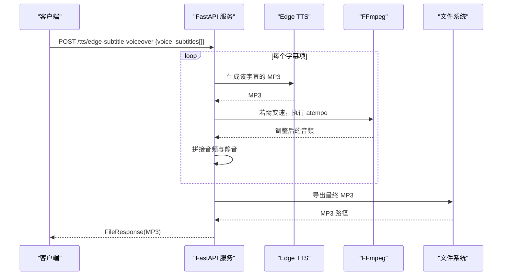
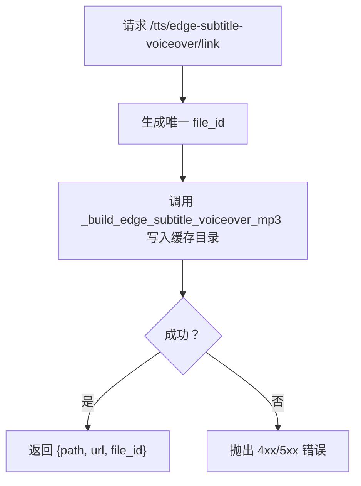
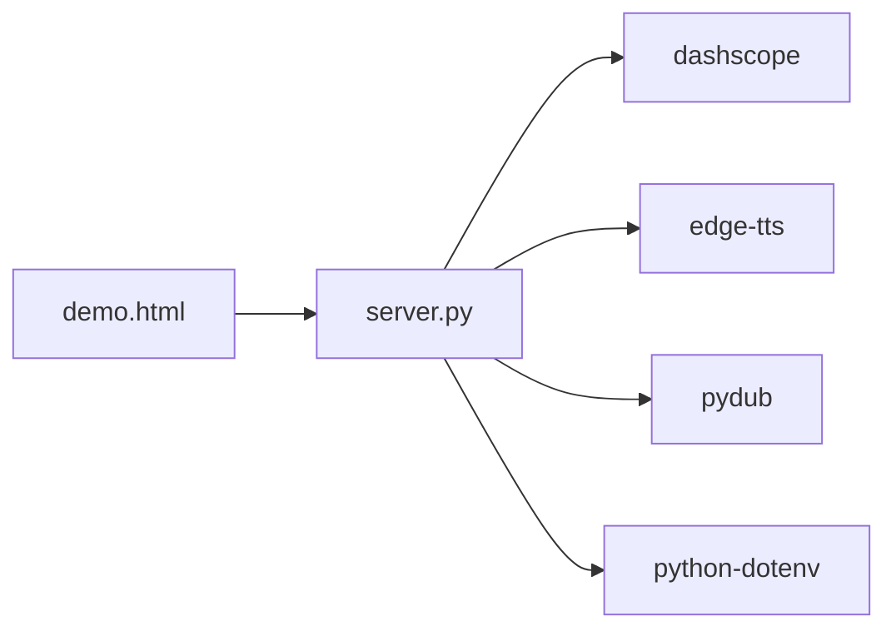

# TTS API接口

<cite>
**本文引用的文件**
- [server.py](file://server.py)
- [edge_subtitle_voiceover.py](file://edge_subtitle_voiceover.py)
- [tts_voices_catalog.json](file://tts_voices_catalog.json)
- [ttstest.py](file://ttstest.py)
- [qwen3stream.py](file://qwen3stream.py)
- [README.md](file://README.md)
- [requirements.txt](file://requirements.txt)
- [subtitles.json](file://subtitles.json)
</cite>

## 目录
1. [简介](#简介)
2. [项目结构](#项目结构)
3. [核心组件](#核心组件)
4. [架构总览](#架构总览)
5. [详细组件分析](#详细组件分析)
6. [依赖分析](#依赖分析)
7. [性能考虑](#性能考虑)
8. [故障排查指南](#故障排查指南)
9. [结论](#结论)
10. [附录](#附录)

## 简介
本文件为 Vue3 Speech 项目的 TTS API 接口文档，涵盖：
- DashScope Qwen3 TTS 的 HTTP POST 接口（/tts）
- 语音列表查询接口（/tts/voices）
- Edge TTS 语音列表查询接口（/tts/edge-voices）
- 基于字幕时间轴的 Edge TTS 配音合成接口（/tts/edge-subtitle-voiceover 与 /tts/edge-subtitle-voiceover/link）
- 请求/响应格式、参数验证规则、错误处理机制
- API 密钥配置、超时设置与并发限制
- curl 示例与前端集成要点

## 项目结构
该项目基于 FastAPI 提供语音识别与语音合成能力，TTS 相关接口集中在主服务文件中，Edge TTS 的字幕配音逻辑独立为工具模块，语音列表数据来源于 JSON 文件。

图表来源
- [server.py:67-452](file://server.py#L67-L452)
- [edge_subtitle_voiceover.py:1-223](file://edge_subtitle_voiceover.py#L1-L223)
- [tts_voices_catalog.json:1-54](file://tts_voices_catalog.json#L1-L54)

章节来源
- [server.py:67-452](file://server.py#L67-L452)
- [README.md:100-179](file://README.md#L100-L179)

## 核心组件
- DashScope TTS HTTP 接口：POST /tts，接收 text、voice 等参数，调用 DashScope MultiModalConversation 接口，返回与 SDK 响应一致的 JSON。
- 语音列表查询：GET /tts/voices，返回 tts_voices_catalog.json 的内容。
- Edge TTS 语音列表：GET /tts/edge-voices，支持按区域与性别过滤。
- Edge 字幕配音：POST /tts/edge-subtitle-voiceover 与 /tts/edge-subtitle-voiceover/link，按字幕时间轴生成 MP3，支持链接生成与缓存。
- 实时 TTS（可选）：qwen3stream.py 展示了 DashScope 实时 TTS 的 WebSocket 用法，可用于前端实时播报场景。

章节来源
- [server.py:212-361](file://server.py#L212-L361)
- [edge_subtitle_voiceover.py:36-223](file://edge_subtitle_voiceover.py#L36-L223)
- [qwen3stream.py:108-196](file://qwen3stream.py#L108-L196)

## 架构总览
下图展示了 TTS 相关的端点与外部服务交互关系：

图表来源
- [server.py:212-361](file://server.py#L212-L361)
- [edge_subtitle_voiceover.py:166-223](file://edge_subtitle_voiceover.py#L166-L223)

## 详细组件分析

### DashScope TTS 接口（POST /tts）
- 方法与路径：POST /tts
- Content-Type：application/json
- 请求体参数
  - text：必填，要合成的文本
  - voice：可选，默认值见实现
  - instruction：可选，用于指令控制（如需启用指令控制，需使用支持的模型）
  - instructions：可选，与 instruction 类似
- 响应：返回与 DashScope SDK 响应一致的 JSON（通常包含音频 URL 或 base64 数据）
- 错误处理
  - 缺少 API Key：400 Bad Request
  - 调用异常：500 Internal Server Error
- 说明
  - 使用模型：qwen3-tts-flash（默认）
  - 语言类型：Chinese（建议与文本语种一致）
  - 与独立脚本 ttstest.py 的调用方式一致

图表来源
- [server.py:212-247](file://server.py#L212-L247)
- [ttstest.py:13-26](file://ttstest.py#L13-L26)

章节来源
- [server.py:212-247](file://server.py#L212-L247)
- [README.md:139-149](file://README.md#L139-L149)

### 语音列表查询（GET /tts/voices）
- 方法与路径：GET /tts/voices
- 响应：返回 tts_voices_catalog.json 的内容，包含版本号与语音列表
- 用途：前端展示可用 voice 与模型支持情况

图表来源
- [server.py:250-253](file://server.py#L250-L253)
- [tts_voices_catalog.json:1-54](file://tts_voices_catalog.json#L1-L54)

章节来源
- [server.py:250-253](file://server.py#L250-L253)
- [README.md:130-137](file://README.md#L130-L137)

### Edge TTS 语音列表查询（GET /tts/edge-voices）
- 方法与路径：GET /tts/edge-voices
- 查询参数
  - locale：可选，按区域过滤（不区分大小写；匹配 Locale 或 ShortName 子串）
  - gender：可选，Female 或 Male
- 响应：包含 count 与 voices 数组
- 错误处理
  - gender 非法：400 Bad Request
  - 拉取失败：502 Bad Gateway

图表来源
- [server.py:256-297](file://server.py#L256-L297)

章节来源
- [server.py:256-297](file://server.py#L256-L297)

### Edge 字幕配音（POST /tts/edge-subtitle-voiceover）
- 方法与路径：POST /tts/edge-subtitle-voiceover
- 请求体参数
  - voice：必填，使用 Edge TTS 的 ShortName（如 zh-CN-YunxiNeural）
  - subtitles：必填，至少一项，每项包含 id、start_time、end_time（可选）、content
- 处理流程
  - 校验 content 非空
  - 对每个字幕项调用 Edge TTS 生成 MP3
  - 若 end_time 存在，计算目标时长并使用 FFmpeg atempo 调整速度
  - 按时间轴拼接音频，必要时插入静音
  - 导出最终 MP3
- 响应：FileResponse，媒体类型 audio/mpeg，文件名为 subtitle_voiceover.mp3
- 错误处理
  - 参数校验失败：400 Bad Request
  - 运行时错误：500 Internal Server Error

图表来源
- [server.py:300-321](file://server.py#L300-L321)
- [edge_subtitle_voiceover.py:166-223](file://edge_subtitle_voiceover.py#L166-L223)

章节来源
- [server.py:300-321](file://server.py#L300-L321)
- [edge_subtitle_voiceover.py:36-223](file://edge_subtitle_voiceover.py#L36-L223)

### Edge 字幕配音（POST /tts/edge-subtitle-voiceover/link）
- 方法与路径：POST /tts/edge-subtitle-voiceover/link
- 功能：与上述接口相同，但将 MP3 保存到服务端缓存目录，返回可访问的 URL 与相对路径
- 响应：包含 path、url、file_id
- 注意：返回的 URL 需结合 PUBLIC_BASE_URL 配置，确保在反向代理后也能正确访问

图表来源
- [server.py:324-345](file://server.py#L324-L345)

章节来源
- [server.py:324-345](file://server.py#L324-L345)

### Edge 配音文件访问（GET /tts/edge-voiceover-files/{file_id}）
- 方法与路径：GET /tts/edge-voiceover-files/{file_id}
- 功能：提供由 /tts/edge-subtitle-voiceover/link 生成的 MP3 文件
- 安全校验：文件名必须符合正则表达式，且位于缓存目录内

章节来源
- [server.py:348-360](file://server.py#L348-L360)

### 实时 TTS（DashScope 实时 WebSocket）
- 用途：前端边收边播，降低首包延迟
- 参考实现：qwen3stream.py 展示了如何建立 WebSocket 会话、更新会话参数、接收音频 delta 并播放
- 适用场景：需要实时播报的业务（如赛事解说）

章节来源
- [qwen3stream.py:108-196](file://qwen3stream.py#L108-L196)

## 依赖分析
- FastAPI 应用依赖
  - dashscope：调用 DashScope TTS
  - edge-tts、pydub：Edge TTS 语音列表与音频处理
  - python-dotenv：加载 .env 环境变量
- 前端演示依赖
  - demo.html 展示了如何调用 /tts 并播放返回的音频

图表来源
- [requirements.txt:1-13](file://requirements.txt#L1-L13)
- [server.py:18-31](file://server.py#L18-L31)

章节来源
- [requirements.txt:1-13](file://requirements.txt#L1-L13)
- [README.md:36](file://README.md#L36)

## 性能考虑
- DashScope TTS
  - 使用整段合成（stream=False），响应快但无流式体验
  - 建议在前端优先使用返回的 URL 播放，减少本地解码开销
- Edge 字幕配音
  - 逐句合成并拼接，整体时延受网络与 FFmpeg 影响
  - 速度调整采用 atempo，建议控制在 0.5～2.0 倍之间以保持音质
- 实时 TTS
  - 通过 WebSocket 边收边播，降低首包延迟
  - 注意会话结束等待时间，避免阻塞后续播报

[本节为通用性能建议，不直接分析具体文件]

## 故障排查指南
- 缺少 API Key
  - 现象：/tts 返回 400
  - 处理：在 .env 中配置 DASHSCOPE_API_KEY
- FFmpeg 未找到
  - 现象：/transcribe 上传 webm/ogg 报错，或 Edge 配音时报错
  - 处理：在 .env 中设置 FFMPEG_PATH 指向 ffmpeg.exe 绝对路径
- Edge 语音列表拉取失败
  - 现象：/tts/edge-voices 返回 502
  - 处理：检查网络连通性与微软接口状态
- 字幕参数非法
  - 现象：/tts/edge-subtitle-voiceover 返回 400
  - 处理：确保 subtitles 中每项 content 非空，end_time > start_time（若提供）

章节来源
- [server.py:215-217](file://server.py#L215-L217)
- [server.py:394-410](file://server.py#L394-L410)
- [edge_subtitle_voiceover.py:29-33](file://edge_subtitle_voiceover.py#L29-L33)

## 结论
本项目提供了完整的 TTS 能力：DashScope 整段 TTS、Edge TTS 语音列表与字幕配音。接口设计简洁，错误处理明确，配合 .env 配置与演示页面，便于快速集成与测试。对于实时播报场景，可参考实时 TTS 的 WebSocket 实现。

[本节为总结性内容，不直接分析具体文件]

## 附录

### API 定义与示例

- DashScope TTS（POST /tts）
  - 请求体
    - text：字符串，必填
    - voice：字符串，可选，默认值见实现
    - instruction/instructions：字符串，可选
  - 响应：JSON，包含音频 URL 或 base64 数据
  - curl 示例
    - curl -X POST http://127.0.0.1:8000/tts -H "Content-Type: application/json" -d '{"text":"你好","voice":"Ethan"}'

- 语音列表（GET /tts/voices）
  - 响应：JSON，包含 version 与 voices 数组
  - curl 示例
    - curl http://127.0.0.1:8000/tts/voices

- Edge 语音列表（GET /tts/edge-voices）
  - 查询参数：locale、gender
  - 响应：JSON，包含 count 与 voices 数组
  - curl 示例
    - curl "http://127.0.0.1:8000/tts/edge-voices?locale=zh-CN&gender=Female"

- Edge 字幕配音（POST /tts/edge-subtitle-voiceover）
  - 请求体
    - voice：字符串，必填（使用 Edge ShortName）
    - subtitles：数组，每项包含 id、start_time、end_time（可选）、content
  - 响应：MP3 文件
  - curl 示例
    - curl -X POST http://127.0.0.1:8000/tts/edge-subtitle-voiceover -H "Content-Type: application/json" -d '{"voice":"zh-CN-YunxiNeural","subtitles":[{"id":1,"start_time":1000,"end_time":5000,"content":"大家好"}]}'

- Edge 字幕配音（POST /tts/edge-subtitle-voiceover/link）
  - 响应：JSON，包含 path、url、file_id
  - curl 示例
    - curl -X POST http://127.0.0.1:8000/tts/edge-subtitle-voiceover/link -H "Content-Type: application/json" -d '{"voice":"zh-CN-YunxiNeural","subtitles":[{"id":1,"start_time":1000,"end_time":5000,"content":"大家好"}]}'

- Edge 配音文件访问（GET /tts/edge-voiceover-files/{file_id}）
  - 响应：MP3 文件
  - curl 示例
    - curl http://127.0.0.1:8000/tts/edge-voiceover-files/1234567890abcdef1234567890abcdef.mp3

- 实时 TTS（DashScope 实时 WebSocket）
  - 参考实现：qwen3stream.py
  - 说明：建立 WebSocket 会话，接收音频 delta 并播放

章节来源
- [server.py:212-361](file://server.py#L212-L361)
- [edge_subtitle_voiceover.py:36-223](file://edge_subtitle_voiceover.py#L36-L223)
- [qwen3stream.py:108-196](file://qwen3stream.py#L108-L196)
- [README.md:100-179](file://README.md#L100-L179)

### 参数验证规则
- /tts
  - text 必填
  - voice 默认值见实现
  - instruction/instructions 可选
- /tts/edge-subtitle-voiceover
  - voice 必填（Edge ShortName）
  - subtitles 至少一项
  - 每项 content 非空
  - end_time > start_time（若提供）
- /tts/edge-voices
  - gender 仅允许 Female 或 Male（大小写不敏感）

章节来源
- [server.py:100-107](file://server.py#L100-L107)
- [edge_subtitle_voiceover.py:20-33](file://edge_subtitle_voiceover.py#L20-L33)
- [server.py:256-297](file://server.py#L256-L297)

### 错误处理机制
- /tts
  - 400：缺少 DASHSCOPE_API_KEY
  - 500：SDK 调用异常
- /tts/edge-voices
  - 400：gender 非法
  - 502：拉取 Edge 语音列表失败
- /tts/edge-subtitle-voiceover / /tts/edge-subtitle-voiceover/link
  - 400：参数校验失败（如 content 为空、end_time 不合法）
  - 500：运行时错误（如 FFmpeg 不存在、Edge 合成失败）

章节来源
- [server.py:215-217](file://server.py#L215-L217)
- [server.py:271-274](file://server.py#L271-L274)
- [server.py:280-282](file://server.py#L280-L282)
- [edge_subtitle_voiceover.py:174-176](file://edge_subtitle_voiceover.py#L174-L176)
- [edge_subtitle_voiceover.py:196-201](file://edge_subtitle_voiceover.py#L196-L201)

### API 密钥配置、超时与并发
- API 密钥
  - DASHSCOPE_API_KEY：在 .env 中配置
- 超时设置
  - WebSocket 识别：ASR_WS_DECODE_INTERVAL_S、ASR_WS_MAX_WINDOW_S（秒）
  - Uvicorn 运行：UVICORN_HOST、UVICORN_PORT、UVICORN_LOG_LEVEL、UVICORN_RELOAD、UVICORN_ACCESS_LOG、UVICORN_PROXY_HEADERS
- 并发限制
  - ASR 接口使用互斥锁保护，避免并发调用导致资源竞争
  - 实时 TTS 会话在同一时间仅处理一条，避免阻塞

章节来源
- [server.py:136-137](file://server.py#L136-L137)
- [server.py:440-451](file://server.py#L440-L451)
- [server.py:97](file://server.py#L97)
- [README.md:68-83](file://README.md#L68-L83)

### 前端集成要点
- 上传文件识别：multipart/form-data，字段 file
- TTS 播放：优先使用返回的音频 URL；若仅有 base64 数据，需在前端解码后播放
- Vue 组件：可直接复用 demo.html 中的调用逻辑

章节来源
- [README.md:151-182](file://README.md#L151-L182)