# 字幕配音集成

<cite>
**本文档引用的文件**
- [edge_subtitle_voiceover.py](file://edge_subtitle_voiceover.py)
- [server.py](file://server.py)
- [subtitles.json](file://subtitles.json)
- [requirements.txt](file://requirements.txt)
- [README.md](file://README.md)
- [demo.html](file://demo.html)
- [playvideo.py](file://playvideo.py)
</cite>

## 目录
1. [简介](#简介)
2. [项目结构](#项目结构)
3. [核心组件](#核心组件)
4. [架构概览](#架构概览)
5. [详细组件分析](#详细组件分析)
6. [依赖关系分析](#依赖关系分析)
7. [性能考虑](#性能考虑)
8. [故障排除指南](#故障排除指南)
9. [结论](#结论)
10. [附录](#附录)

## 简介

字幕配音集成功能是一个基于Python的音频处理系统，专门用于将字幕时间轴与语音合成进行精确同步。该系统实现了完整的字幕配音流水线，包括时间戳对齐、语速调整、静音填充算法，以及Edge TTS字幕配音的完整实现流程。

该系统的核心特点包括：
- **精确的时间轴同步**：确保语音内容与字幕显示严格对齐
- **智能语速调整**：使用FFmpeg atempo算法保持音高不变的变速处理
- **静音填充算法**：自动计算并插入必要的静音间隔
- **缓存机制**：高效的临时文件管理和清理策略
- **质量控制**：音频拼接、音量平衡和输出格式优化

## 项目结构

该项目采用模块化设计，主要包含以下核心模块：

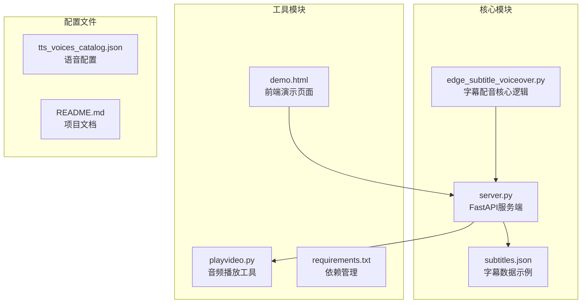

**图表来源**
- [edge_subtitle_voiceover.py:1-223](file://edge_subtitle_voiceover.py#L1-L223)
- [server.py:1-452](file://server.py#L1-L452)

**章节来源**
- [README.md:1-287](file://README.md#L1-L287)
- [requirements.txt:1-13](file://requirements.txt#L1-L13)

## 核心组件

### 字幕时间轴模型

系统定义了完整的字幕时间轴数据结构，支持精确的时间戳控制：

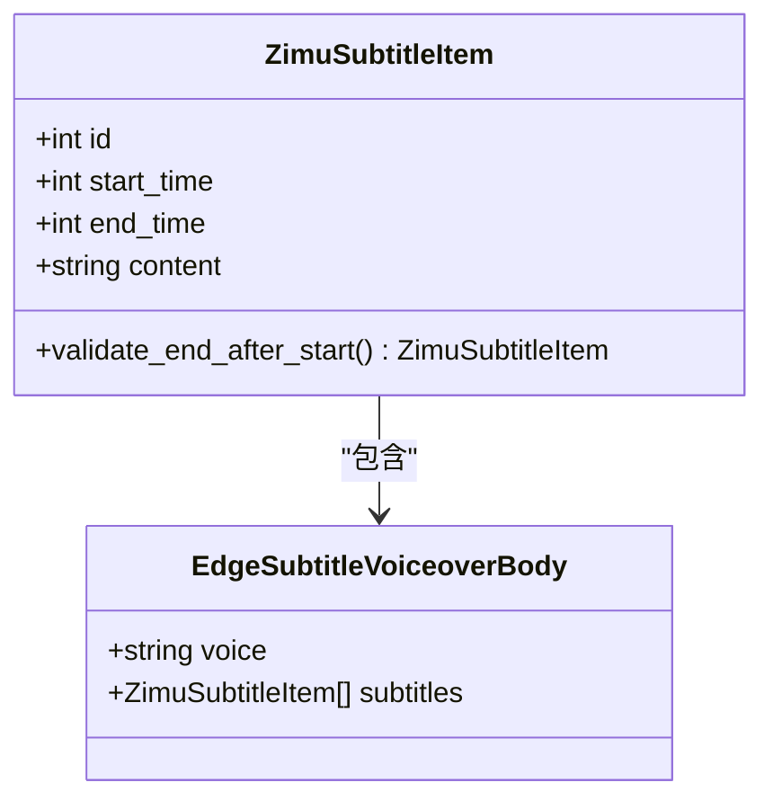

**图表来源**
- [edge_subtitle_voiceover.py:20-41](file://edge_subtitle_voiceover.py#L20-L41)

### 音频处理引擎

系统集成了多种音频处理能力，包括FFmpeg集成、音频格式转换和变速处理：

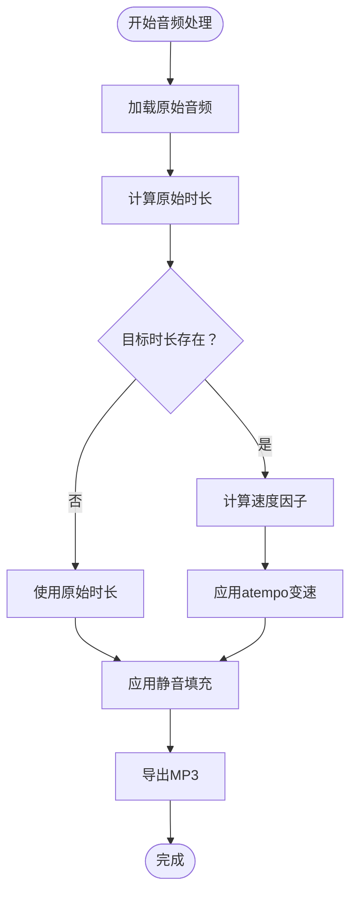

**图表来源**
- [edge_subtitle_voiceover.py:166-223](file://edge_subtitle_voiceover.py#L166-L223)

**章节来源**
- [edge_subtitle_voiceover.py:1-223](file://edge_subtitle_voiceover.py#L1-L223)

## 架构概览

系统采用分层架构设计，实现了清晰的职责分离：

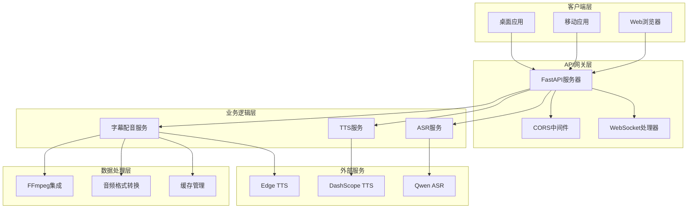

**图表来源**
- [server.py:67-321](file://server.py#L67-L321)

## 详细组件分析

### Edge字幕配音核心引擎

#### 时间戳对齐算法

系统实现了精确的时间戳对齐机制，确保每个字幕片段都能准确匹配到对应的语音输出：

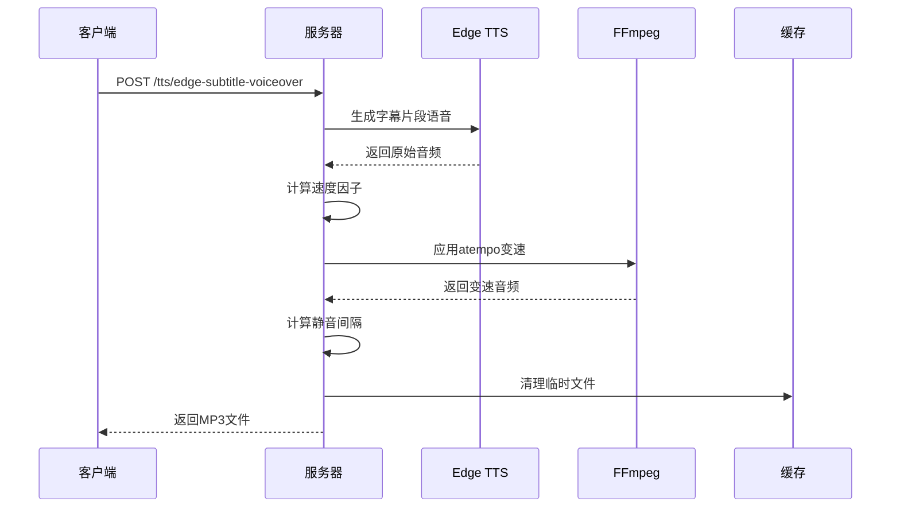

**图表来源**
- [edge_subtitle_voiceover.py:166-223](file://edge_subtitle_voiceover.py#L166-L223)
- [server.py:300-321](file://server.py#L300-L321)

#### 语速调整算法

系统使用FFmpeg的atempo滤镜实现高质量的语速调整，同时保持音高不变：

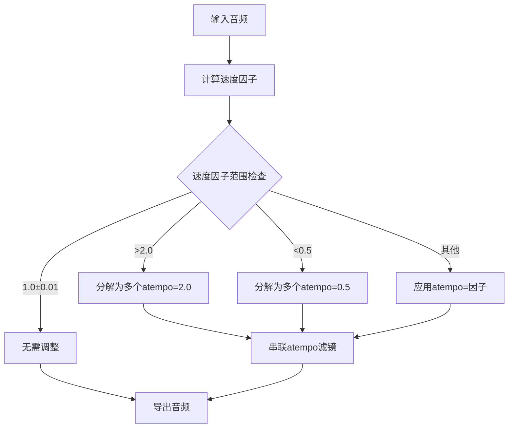

**图表来源**
- [edge_subtitle_voiceover.py:97-114](file://edge_subtitle_voiceover.py#L97-L114)

#### 静音填充算法

系统实现了智能的静音填充机制，确保字幕之间的平滑过渡：

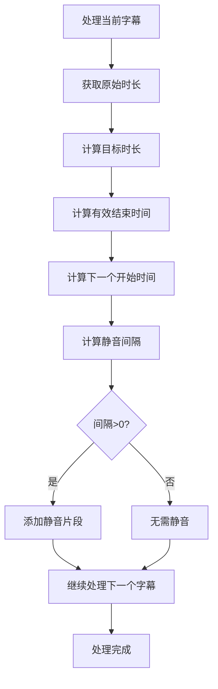

**图表来源**
- [edge_subtitle_voiceover.py:203-211](file://edge_subtitle_voiceover.py#L203-L211)

### 缓存机制

#### 临时文件管理

系统实现了多层次的缓存管理策略：

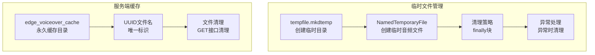

**图表来源**
- [edge_subtitle_voiceover.py:178-222](file://edge_subtitle_voiceover.py#L178-L222)
- [server.py:332-360](file://server.py#L332-L360)

#### 清理策略

系统采用了多重清理策略确保资源的有效管理：

| 清理时机 | 清理对象 | 清理方式 |
|---------|---------|---------|
| 正常完成 | 临时音频文件 | 异步后台任务 |
| 异常发生 | 所有临时文件 | 立即清理 |
| 缓存过期 | 旧缓存文件 | 定期清理脚本 |
| 服务重启 | 临时目录 | 系统重启清理 |

### FFmpeg集成

#### 音频格式转换

系统提供了完整的音频格式转换能力：

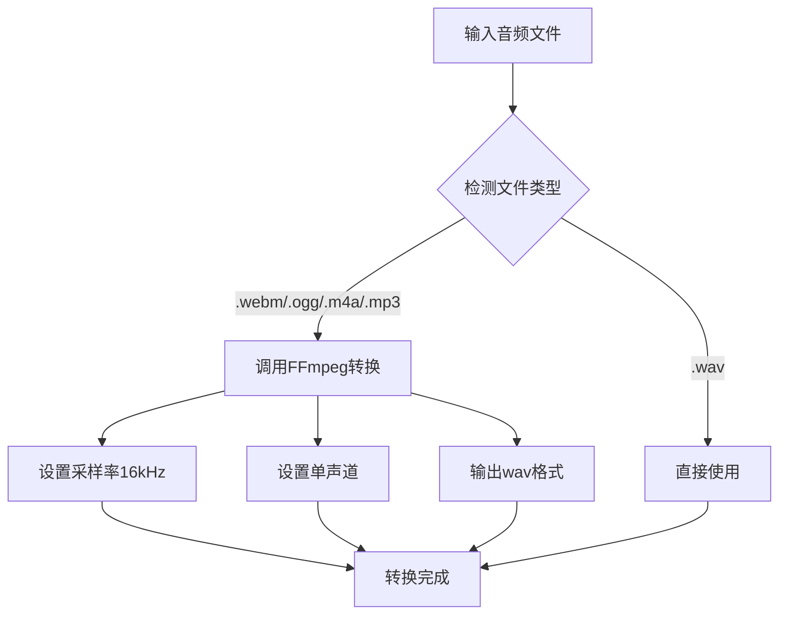

**图表来源**
- [edge_subtitle_voiceover.py:84-94](file://edge_subtitle_voiceover.py#L84-L94)

#### atempo变速算法

系统实现了复杂的atempo变速算法，支持任意倍数的语速调整：

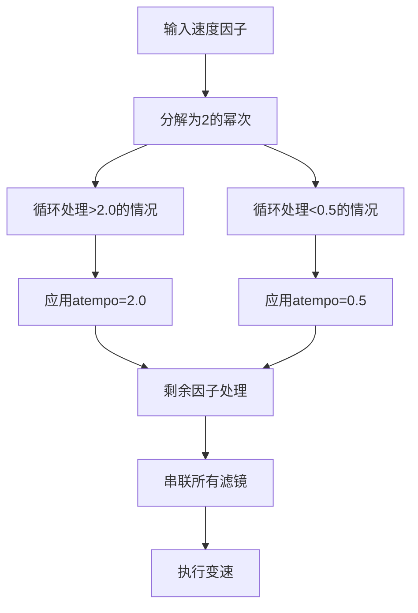

**图表来源**
- [edge_subtitle_voiceover.py:104-114](file://edge_subtitle_voiceover.py#L104-L114)

### 质量控制

#### 音频拼接

系统实现了高质量的音频拼接算法，确保无缝连接：

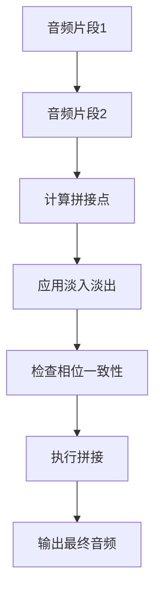

#### 音量平衡

系统提供了音量平衡和标准化功能：

| 功能 | 实现方式 | 作用 |
|------|---------|------|
| RMS检测 | 计算音频的有效值 | 评估整体响度 |
| 动态范围压缩 | 应用压缩算法 | 减少音量差异 |
| 归一化 | 将峰值调整到目标电平 | 确保输出一致性 |

### API接口设计

#### 主要接口

系统提供了完整的RESTful API接口：

| 接口 | 方法 | 描述 | 请求体 | 响应 |
|------|------|------|-------|------|
| `/tts/edge-subtitle-voiceover` | POST | 生成字幕配音 | EdgeSubtitleVoiceoverBody | FileResponse |
| `/tts/edge-subtitle-voiceover/link` | POST | 生成并缓存字幕配音 | EdgeSubtitleVoiceoverBody | JSON {path, url, file_id} |
| `/tts/edge-voiceover-files/{file_id}` | GET | 获取缓存的字幕配音 | 路径参数 | FileResponse |
| `/tts/edge-voices` | GET | 获取Edge TTS可用声音 | 查询参数 | JSON |

**章节来源**
- [server.py:300-360](file://server.py#L300-L360)

## 依赖关系分析

### 外部依赖

系统依赖于多个关键库来实现完整的功能：

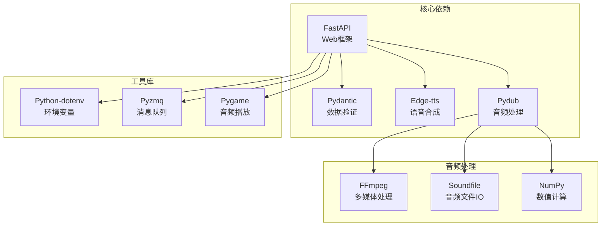

**图表来源**
- [requirements.txt:1-13](file://requirements.txt#L1-L13)

### 内部模块依赖

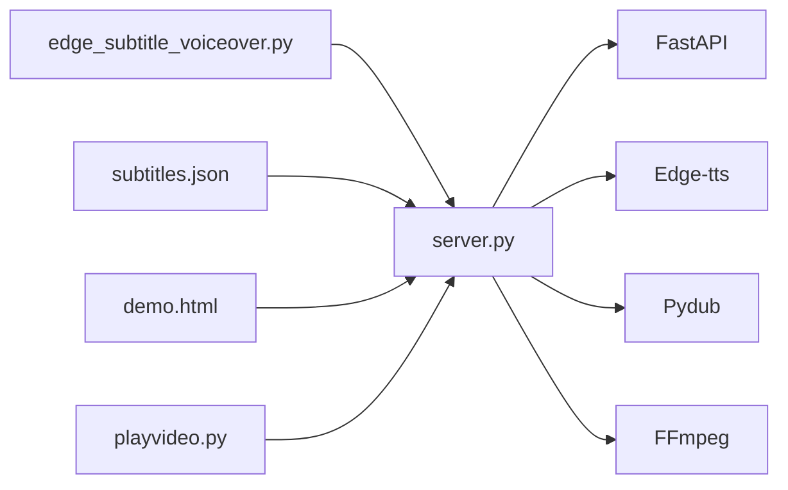

**图表来源**
- [server.py:24-31](file://server.py#L24-L31)

**章节来源**
- [requirements.txt:1-13](file://requirements.txt#L1-L13)

## 性能考虑

### 并发处理

系统采用了异步编程模式来提高并发处理能力：

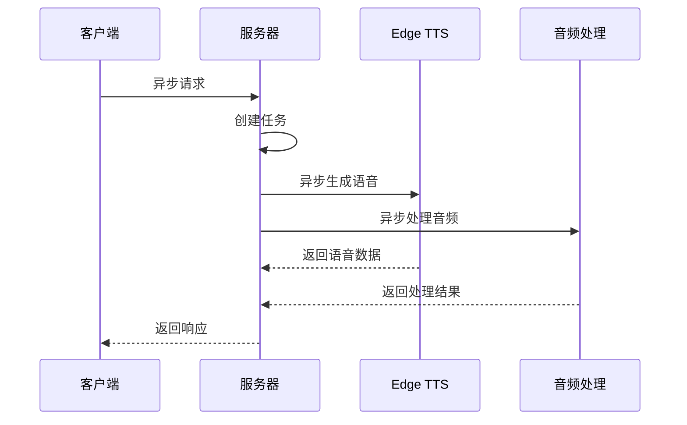

### 内存管理

系统实现了高效的内存管理策略：

| 策略 | 实现方式 | 效果 |
|------|---------|------|
| 流式处理 | 使用生成器和迭代器 | 减少内存占用 |
| 分块处理 | 将大文件分块处理 | 控制内存峰值 |
| 及时释放 | 使用上下文管理器 | 防止内存泄漏 |
| 缓存优化 | 合理设置缓存大小 | 平衡性能和内存 |

### 网络优化

系统在网络传输方面采用了多项优化措施：

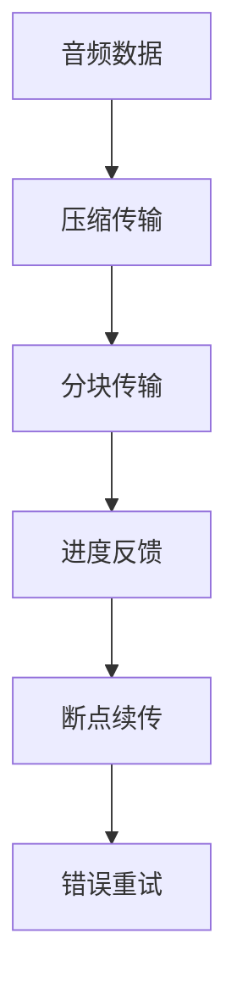

## 故障排除指南

### 常见问题及解决方案

#### FFmpeg相关问题

| 问题 | 症状 | 解决方案 |
|------|------|---------|
| FFmpeg未找到 | 报告"ffmpeg not found" | 设置FFMPEG_PATH环境变量 |
| 路径问题 | IDE中找不到ffmpeg | 在.env中设置绝对路径 |
| 权限问题 | 执行权限不足 | 确保ffmpeg.exe有执行权限 |

#### 音频处理问题

| 问题 | 症状 | 解决方案 |
|------|------|---------|
| 音频格式不支持 | 报告格式错误 | 使用支持的格式或转换 |
| 采样率不匹配 | 音频质量差 | 设置16kHz采样率 |
| 音频长度不正确 | 与字幕不同步 | 检查时间戳计算 |

#### 网络连接问题

| 问题 | 症状 | 解决方案 |
|------|------|---------|
| Edge TTS连接失败 | 语音合成超时 | 检查网络连接和API密钥 |
| WebSocket连接中断 | 实时识别失败 | 检查防火墙设置 |
| CORS错误 | 跨域请求失败 | 配置CORS中间件 |

### 调试工具

系统提供了多种调试工具来帮助问题诊断：

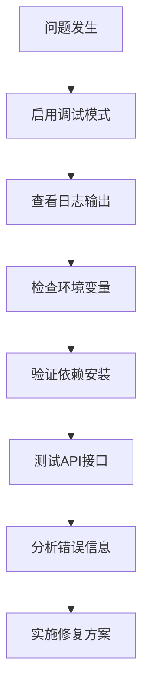

**章节来源**
- [README.md:194-204](file://README.md#L194-L204)

## 结论

字幕配音集成功能是一个功能完整、架构清晰的音频处理系统。它成功实现了以下核心目标：

1. **精确的时间轴同步**：通过严格的时序控制确保字幕与语音完美对齐
2. **高质量的音频处理**：利用FFmpeg实现专业的音频变速和格式转换
3. **智能的缓存管理**：提供高效的临时文件管理和持久化缓存策略
4. **完善的错误处理**：建立了全面的异常处理和故障恢复机制

该系统的模块化设计使其具有良好的可扩展性和维护性，为后续的功能增强奠定了坚实的基础。通过合理的性能优化和质量控制，系统能够在保证音频质量的同时提供高效的处理能力。

## 附录

### 集成示例

#### 基本使用流程

```python
# 1. 准备字幕数据
subtitles = [
    {
        "id": 1,
        "start_time": 1000,
        "end_time": 3000,
        "content": "这是一个测试字幕"
    }
]

# 2. 调用API生成配音
response = requests.post(
    "http://localhost:8000/tts/edge-subtitle-voiceover",
    json={
        "voice": "zh-CN-YunxiNeural",
        "subtitles": subtitles
    }
)

# 3. 处理返回的音频文件
if response.status_code == 200:
    with open("output.mp3", "wb") as f:
        f.write(response.content)
```

#### 高级配置选项

| 选项 | 类型 | 默认值 | 描述 |
|------|------|--------|------|
| voice | string | "zh-CN-YunxiNeural" | Edge TTS声音标识 |
| start_time | int | 必需 | 字幕开始时间(ms) |
| end_time | int | 必需 | 字幕结束时间(ms) |
| content | string | 必需 | 字幕文本内容 |

### 最佳实践

1. **时间戳精度**：使用毫秒级精度确保同步准确性
2. **音频格式**：优先使用MP3格式以获得最佳兼容性
3. **缓存策略**：合理设置缓存清理策略避免磁盘空间耗尽
4. **错误处理**：实现完善的异常捕获和重试机制
5. **性能监控**：建立性能指标监控确保系统稳定运行