# 实时TTS合成

<cite>
**本文档引用的文件**
- [README.md](file://README.md)
- [server.py](file://server.py)
- [qwen3stream.py](file://qwen3stream.py)
- [demo.html](file://demo.html)
- [ttstest.py](file://ttstest.py)
- [qwen-to-data4.py](file://qwen-to-data4.py)
- [qwen-to-data5.py](file://qwen-to-data5.py)
- [qwen-to-data6.py](file://qwen-to-data6.py)
- [qwen-to-data7.py](file://qwen-to-data7.py)
- [qwen-to-data8.py](file://qwen-to-data8.py)
- [qwen-to-data0.py](file://qwen-to-data0.py)
- [qwen-flash.json](file://qwen-flash.json)
- [test_pipeline_output.json](file://test_pipeline_output.json)
- [requirements.txt](file://requirements.txt)
- [tts_voices_catalog.json](file://tts_voices_catalog.json)
- [qwen-to-date-prompts.json](file://qwen-to-date-prompts.json)
- [jsonschema.json](file://jsonschema.json)
- [index.py](file://index.py)
- [qwen-flash.json](file://qwen-flash.json)
- [subtitles.json](file://subtitles.json)
- [zmqserver.py](file://zmqserver.py)
- [test_kokoro.py](file://test_kokoro.py)
- [zmq_events.jsonl](file://zmq_events.jsonl)
- [zmq_events_20260520_134352.jsonl](file://zmq_events/zmq_events_20260520_134352.jsonl)
- [zmq_events_20260520_185247.jsonl](file://zmq_events/zmq_events_20260520_185247.jsonl)
- [zmqtest.py](file://zmqtest.py)
- [subtitle_player.html](file://subtitle_player.html)
</cite>

## 更新摘要
**变更内容**
- 批处理规模大幅扩展：Narration系统从4事件批处理扩展到22个批处理，显著提升事件处理能力和叙述准确性
- 新增政策违规检测与自动修订：完整的政策违规检测、自动重写和内容修订跟踪系统
- TTS合成元数据增强：新增详细的TTS合成元数据记录，包括音频文件路径、时长和合成时间
- 批处理配置优化：支持通过环境变量QWEN_EVENTS_BATCH配置批处理大小，默认10条事件
- 实时TTS回调追踪：增强的事件类型追踪和性能监控机制
- ZMQ事件日志系统：新增的详细事件跟踪和元数据记录系统

## 目录
1. [简介](#简介)
2. [项目结构](#项目结构)
3. [核心组件](#核心组件)
4. [架构概览](#架构概览)
5. [详细组件分析](#详细组件分析)
6. [依赖关系分析](#依赖关系分析)
7. [性能考虑](#性能考虑)
8. [故障排除指南](#故障排除指南)
9. [结论](#结论)
10. [附录](#附录)

## 简介

本项目是一个基于Vue3和FastAPI的实时语音识别与语音合成系统。项目实现了多种音频处理功能，包括：

- **实时语音识别（ASR）**：通过WebSocket实现16kHz单声道PCM音频流的实时识别
- **语音合成（TTS）**：支持HTTP和WebSocket两种实时TTS模式，具备智能多后端支持
- **多语言支持**：提供丰富的音色选择和多语言支持
- **前端集成**：提供完整的Web界面和Vue3组件
- **智能回退机制**：自动检测并选择最优TTS后端
- **事件批处理**：高效处理ZMQ实时事件流，现已支持22事件批处理
- **自动文本修订**：政策违规自动重写功能
- **性能监控**：详细的性能计时测量和HTTP往返时间跟踪
- **错误处理**：完善的错误恢复机制和超时处理
- **WebSocket日志系统**：实时日志广播和可视化监控
- **增强事件广播**：多类型事件的实时传输和处理
- **浏览器音频播放**：通过WebSocket实现远程音频播放协调
- **视频-音频同步**：基于时间戳的精确视频-音频同步机制
- **ZMQ事件日志系统**：新增的详细事件跟踪和元数据记录系统

**重要更新**：项目新增了完整的WebSocket日志系统，包括实时日志广播、事件类型支持、音频队列深度监控等功能，为实时TTS系统提供了强大的可视化监控能力。同时，增强了政策违规检测和自动修订功能，改进了事件批处理系统，支持更复杂的多团队运动场景。行动叙述系统现已从4事件批处理增加到22事件批处理，显著提升了叙述准确性。视频-音频同步机制得到增强，支持基于时间戳的精确同步，确保音频与视频的完美配合。新增的ZMQ事件日志系统提供了详细的事件跟踪和元数据记录，支持20个不同时间戳的事件文件，为系统监控和调试提供了强大支持。

## 项目结构

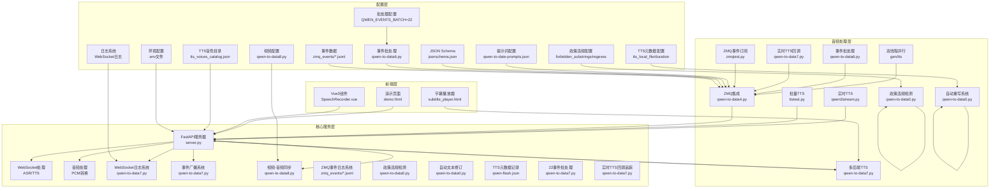

**图表来源**
- [server.py:1-452](file://server.py#L1-L452)
- [demo.html:1-685](file://demo.html#L1-L685)
- [qwen3stream.py:1-196](file://qwen3stream.py#L1-L196)
- [qwen-to-data7.py:1683-1696](file://qwen-to-data7.py#L1683-L1696)
- [qwen-to-data8.py:2020-2052](file://qwen-to-data8.py#L2020-L2052)
- [qwen-to-data0.py:430-506](file://qwen-to-data0.py#L430-L506)

**章节来源**
- [README.md:1-347](file://README.md#L1-L347)
- [server.py:67-68](file://server.py#L67-L68)

## 核心组件

### 1. FastAPI服务器核心

服务器采用FastAPI框架，提供了完整的RESTful API和WebSocket服务：

- **健康检查接口**：`GET /` - 基础健康检查
- **演示页面**：`GET /demo` - 提供完整的Web界面
- **实时ASR**：`WebSocket /ws/asr` - 实时语音识别
- **TTS服务**：`POST /tts` - 语音合成服务
- **音色查询**：`GET /tts/voices` - 音色列表查询

### 2. WebSocket日志系统

**新增功能**：完整的WebSocket日志系统，提供实时日志广播和可视化监控：

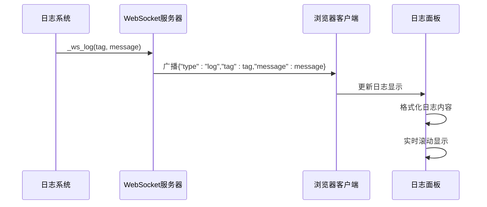

**日志类型支持**：
- **LLM日志**：千问模型生成进度和结果
- **TTS日志**：实时TTS合成状态和性能指标
- **解说日志**：事件处理和文本生成状态
- **系统日志**：系统运行状态和错误信息

**章节来源**
- [qwen-to-data7.py:83-87](file://qwen-to-data7.py#L83-L87)

### 3. 增强事件广播系统

**新增功能**：多类型事件的实时广播和处理：

```mermaid
flowchart TD
subgraph "事件类型"
A[events] --> A1[事件列表]
B[narration] --> B1[解说文本]
C[audio] --> C1[音频URL]
D[subtitle] --> D1[字幕文本]
E[log] --> E1[日志消息]
end
subgraph "广播流程"
A1 --> Broadcast[事件广播]
B1 --> Broadcast
C1 --> Broadcast
D1 --> Broadcast
E1 --> Broadcast
Broadcast --> Clients[所有客户端]
Clients --> Process[事件处理]
Process --> Display[实时显示]
```

**事件处理机制**：
- **线程安全广播**：使用asyncio确保多客户端并发安全
- **事件类型路由**：根据type字段分发到对应处理器
- **实时队列管理**：WebSocket音频队列深度监控和协调

**章节来源**
- [qwen-to-data7.py:74-81](file://qwen-to-data7.py#L74-L81)

### 4. 字幕WebSocket服务

**新增功能**：独立的字幕WebSocket服务和HTTP静态文件服务：

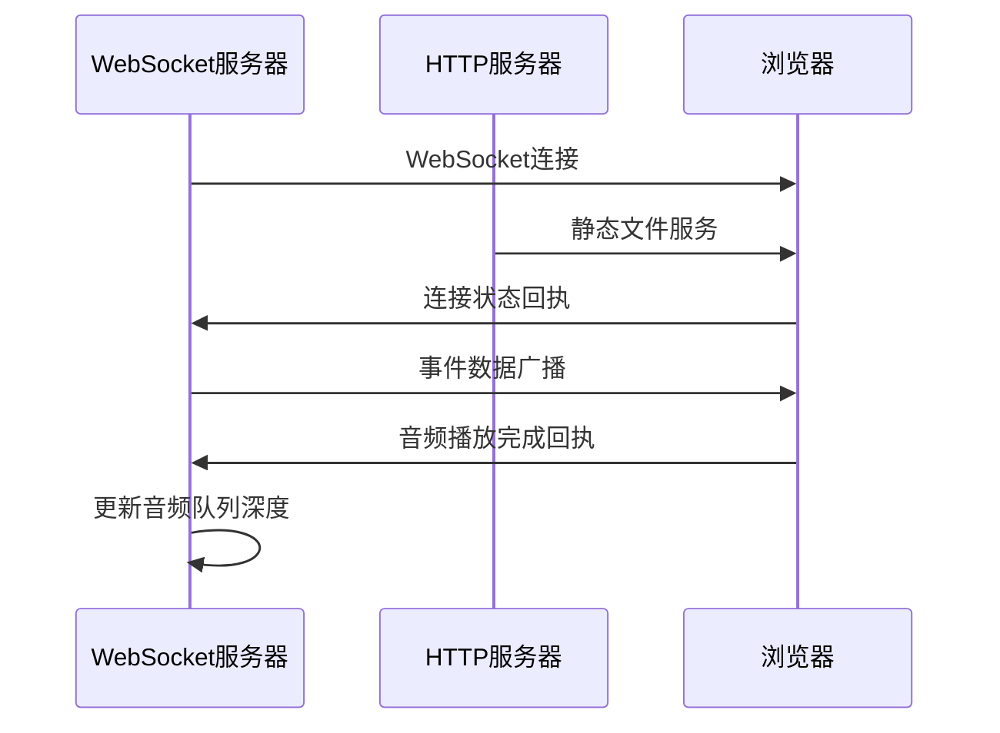

**服务特性**：
- **双服务架构**：WebSocket字幕服务 + HTTP静态文件服务
- **自动浏览器打开**：服务启动后自动打开播放器页面
- **音频队列协调**：通过回执消息协调音频播放进度

**章节来源**
- [qwen-to-data7.py:89-160](file://qwen-to-data7.py#L89-L160)

### 5. 双线程并行流水线架构

**重要更新**：系统现已实现双线程并行流水线架构，替代了之前计划的三线程架构：

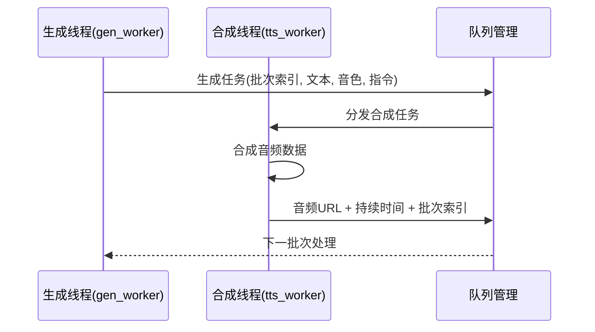

**线程职责分配**：
- **gen_worker（生成线程）**：负责事件批处理和文本生成
- **tts_worker（合成线程）**：负责音频合成和队列管理

### 6. 多后端TTS实现

项目实现了三种TTS后端模式：

- **实时WebSocket模式**：DashScope QwenTtsRealtime WebSocket，支持边生成边播放
- **DashScope HTTP模式**：非实时合成，整段返回音频URL
- **Kokoro本地TTS**：本地服务接口，支持自定义音色和语速

### 7. 智能回退机制

系统具备智能的TTS后端选择能力：

- **自动检测**：根据环境自动选择最优后端
- **回退策略**：sounddevice → kokoserver → dashscope
- **手动指定**：支持命令行参数强制指定后端

### 8. 扩展事件批处理系统

**重要更新**：系统现已支持22事件批处理，显著提升了叙述准确性：

- **22事件批处理**：支持最多22条事件的批处理，提供更丰富的上下文信息
- **动作事件处理**：支持raise_hand、squat、raise_hand+squat三种动作类型
- **得分事件处理**：支持多团队得分场景，包含KO信息
- **智能事件分类**：根据事件类型自动调整解说策略
- **实时事件流**：通过ZMQ实时订阅和处理事件
- **批处理配置**：支持环境变量QWEN_EVENTS_BATCH=22配置

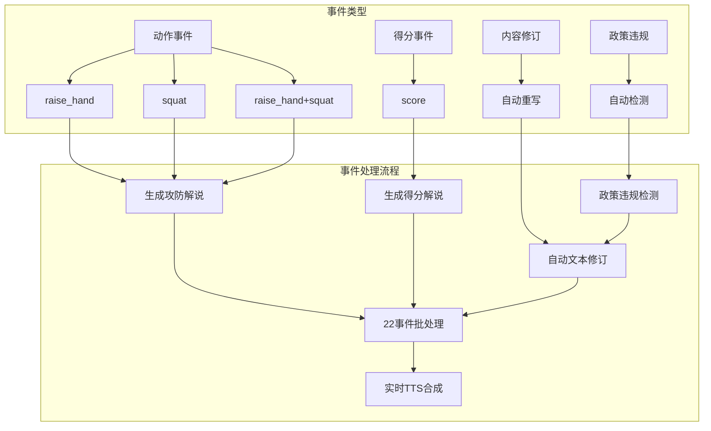

**图表来源**
- [qwen-to-date-prompts.json:1-31](file://qwen-to-date-prompts.json#L1-L31)
- [jsonschema.json:65-95](file://jsonschema.json#L65-L95)
- [qwen-to-data0.py:430-506](file://qwen-to-data0.py#L430-L506)

### 9. 自动文本修订

**新增功能**：增强的政策违规检测和自动修订功能：

- **政策违规检测**：自动检测禁用词汇和正则表达式
- **自动重写**：使用专用提示词自动重写违规内容
- **质量保证**：重写后再次检测确保合规
- **违规类型识别**：支持多种违规类型的自动识别和处理
- **修订跟踪**：记录修订前后的文本对比和违规详情

**章节来源**
- [qwen-to-data0.py:434-476](file://qwen-to-data0.py#L434-L476)

### 10. TTS合成元数据

**新增功能**：详细的TTS合成元数据记录：

- **音频文件路径**：记录生成的音频文件本地路径
- **音频时长**：记录音频播放时长（秒）
- **合成时间**：记录TTS合成耗时（秒）
- **后端信息**：记录使用的TTS后端类型
- **请求ID**：记录DashScope API请求ID

**元数据结构示例**：
```json
{
  "tts_local_file": "D:\\ShenProject\\Vue3Speech\\kokoro_output\\kokoro_800e96cb77b84a858abf0e02c4c8bc70.wav",
  "tts_kokoro_duration": 4.025,
  "tts_kokoro_synthesis_time": 1.292,
  "tts_playback": "kokoro_local",
  "tts_request_id": "req_1234567890"
}
```

**章节来源**
- [qwen-flash.json:12-22](file://qwen-flash.json#L12-L22)
- [test_pipeline_output.json:502-522](file://test_pipeline_output.json#L502-L522)

### 11. 性能监控系统

**新增** 增强的性能监控能力，包括：

- **实时计时测量**：使用`time.perf_counter()`进行高精度计时
- **HTTP往返时间跟踪**：监控DashScope API的HTTP往返时间
- **音频延迟监控**：跟踪首次音频延迟和会话ID
- **错误统计**：记录和报告各种类型的错误
- **队列深度监控**：实时监控播放队列积压情况
- **WebSocket日志监控**：实时日志广播和可视化

**章节来源**
- [server.py:124-197](file://server.py#L124-L197)
- [qwen3stream.py:21-81](file://qwen3stream.py#L21-L81)
- [qwen-to-data7.py:1561-1643](file://qwen-to-data7.py#L1561-L1643)

### 12. 视频-音频同步机制

**新增功能**：基于时间戳的精确视频-音频同步机制：

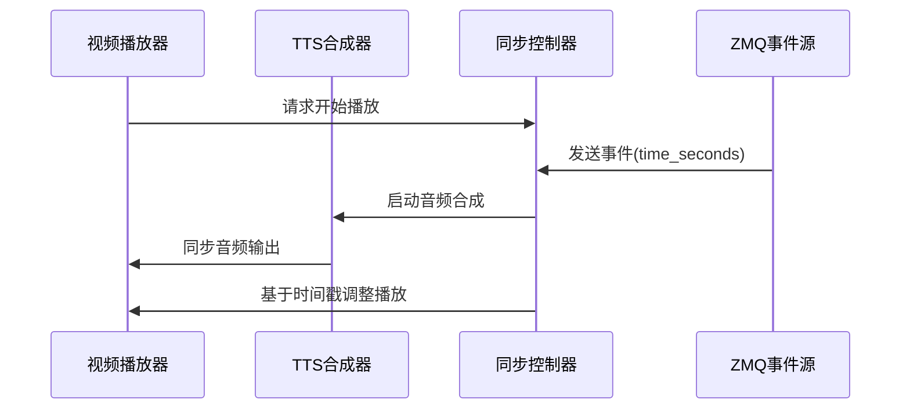

**同步特性**：
- **时间戳同步**：基于事件的time_seconds字段进行精确同步
- **动态调整**：根据音频合成延迟动态调整视频播放
- **误差补偿**：自动补偿音频合成和播放的微小差异
- **多事件支持**：支持22事件批处理的同步处理

**章节来源**
- [qwen-to-data8.py:2020-2052](file://qwen-to-data8.py#L2020-L2052)

### 13. 实时TTS回调机制

**新增功能**：增强的实时TTS回调机制，支持事件类型追踪：

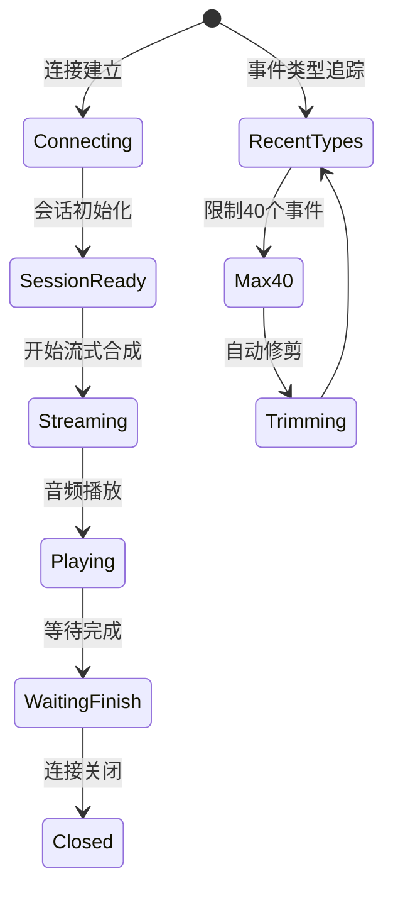

**回调特性**：
- **事件类型追踪**：记录最近40个事件类型，支持调试和监控
- **实时音频处理**：边接收边播放，降低延迟
- **错误恢复**：自动处理连接异常和超时情况
- **性能监控**：记录首次音频延迟和会话ID

**章节来源**
- [qwen-to-data7.py:1180-1210](file://qwen-to-data7.py#L1180-L1210)

### 14. ZMQ事件日志系统

**新增功能**：完整的ZMQ事件日志系统，提供详细的事件跟踪和元数据记录：

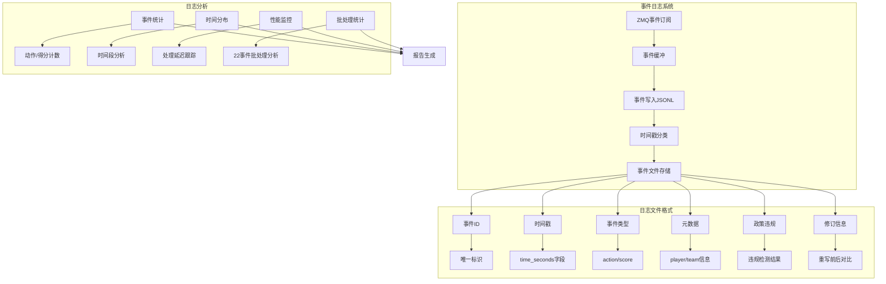

**日志文件特性**：
- **时间戳分类**：按时间戳格式化存储事件
- **元数据完整性**：记录事件ID、时间戳、类型和元数据
- **多文件存储**：支持20个不同时间戳的事件文件
- **实时写入**：事件到达时实时写入JSONL文件
- **性能监控**：记录事件处理延迟和性能指标
- **政策违规记录**：记录违规检测和自动重写详情

**章节来源**
- [qwen-to-data7.py:1575-1594](file://qwen-to-data7.py#L1575-L1594)
- [zmqserver.py:1-73](file://zmqserver.py#L1-L73)
- [zmqtest.py:1-45](file://zmqtest.py#L1-L45)

## 架构概览

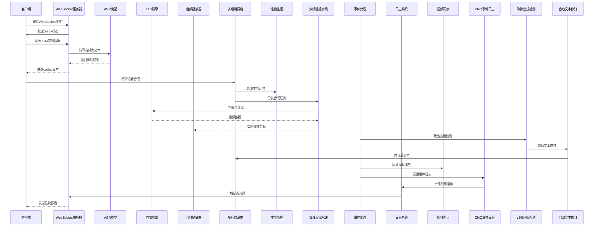

**图表来源**
- [server.py:124-197](file://server.py#L124-L197)
- [qwen3stream.py:109-156](file://qwen3stream.py#L109-L156)
- [qwen-to-data7.py:1561-1643](file://qwen-to-data7.py#L1561-L1643)
- [qwen-to-data8.py:2020-2052](file://qwen-to-data8.py#L2020-L2052)
- [qwen-to-data0.py:434-476](file://qwen-to-data0.py#L434-L476)

## 详细组件分析

### WebSocket日志系统

#### 实现原理

**新增功能**：完整的WebSocket日志系统，提供实时日志广播和可视化监控：

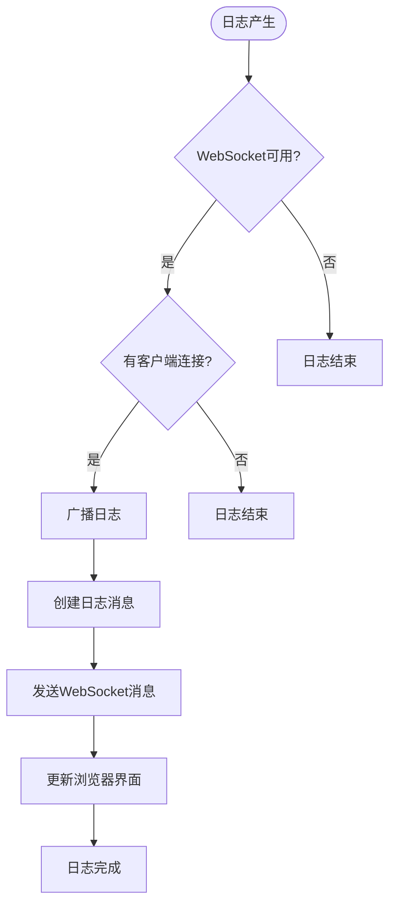

**日志消息格式**：
```json
{
  "type": "log",
  "tag": "LLM",
  "message": "批次 0 生成完成 用时 2.34s"
}
```

**日志类型分类**：
- **LLM日志**：千问模型生成状态和结果
- **TTS日志**：实时TTS合成进度和性能
- **解说日志**：事件处理和文本生成状态
- **系统日志**：系统运行状态和错误信息

**章节来源**
- [qwen-to-data7.py:83-87](file://qwen-to-data7.py#L83-L87)

#### 关键配置参数

| 参数名称 | 默认值 | 说明 |
|---------|--------|------|
| WS_PORT | 8765 | WebSocket服务端口 |
| HTTP_PORT | WS_PORT + 1 | HTTP静态文件服务端口 |
| WS_AUDIO_QUEUE_DEPTH | [0] | 音频队列深度计数器 |

#### 日志广播机制

- **线程安全**：使用asyncio的`run_coroutine_threadsafe`确保线程安全
- **客户端管理**：维护已连接客户端集合
- **消息格式**：统一的日志消息格式，包含标签和内容
- **实时更新**：浏览器端实时显示最新日志

**章节来源**
- [qwen-to-data7.py:74-81](file://qwen-to-data7.py#L74-L81)

### 增强事件广播系统

#### 实现原理

**新增功能**：多类型事件的实时广播和处理：

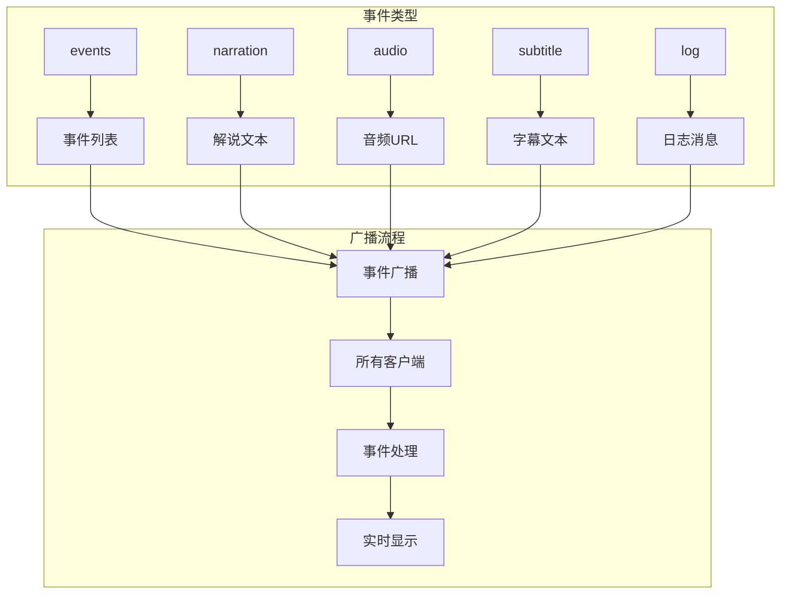

**事件处理流程**：
1. **事件收集**：从ZMQ订阅或JSONL文件收集事件
2. **事件分类**：根据事件类型进行分类处理
3. **实时广播**：通过WebSocket实时广播事件
4. **客户端处理**：浏览器端接收并处理事件
5. **状态更新**：更新UI状态和统计数据

**章节来源**
- [qwen-to-data7.py:332-350](file://qwen-to-data7.py#L332-L350)

#### 事件类型支持

**新增功能**：支持多种事件类型的实时传输：

- **events事件**：广播事件列表摘要
- **narration事件**：广播生成的解说文本
- **audio事件**：广播音频URL和播放信息
- **subtitle事件**：广播字幕文本和显示时长
- **log事件**：广播系统日志消息

**事件数据结构**：
```json
{
  "type": "events",
  "batch_index": 0,
  "count": 5,
  "events": [
    {
      "event_id": "evt_001",
      "time": "00:15.234",
      "player_label": "A",
      "action_label": "raise_hand",
      "confidence": 0.85,
      "score": {}
    }
  ]
}
```

**章节来源**
- [qwen-to-data7.py:427-455](file://qwen-to-data7.py#L427-L455)

### 字幕WebSocket服务

#### 实现原理

**新增功能**：独立的字幕WebSocket服务和HTTP静态文件服务：


**服务架构**：
- **双线程服务**：WebSocket服务线程 + HTTP服务线程
- **事件循环管理**：维护asyncio事件循环
- **客户端集合**：管理已连接的WebSocket客户端
- **自动浏览器打开**：服务启动后自动打开播放器页面

**章节来源**
- [qwen-to-data7.py:89-160](file://qwen-to-data7.py#L89-L160)

#### 服务配置

| 参数名称 | 默认值 | 说明 |
|---------|--------|------|
| WS_PORT | 8765 | WebSocket服务端口 |
| HTTP_PORT | WS_PORT + 1 | HTTP静态文件服务端口 |
| AUTO_OPEN_BROWSER | True | 自动打开浏览器播放器 |

#### 客户端交互

**新增功能**：浏览器端的完整交互机制：

- **连接管理**：自动连接和断开连接
- **事件处理**：接收和处理各种事件类型
- **音频播放**：通过HTML5 Audio播放音频
- **队列协调**：发送播放完成回执
- **状态显示**：实时显示连接状态和播放状态

**章节来源**
- [subtitle_player.html:415-471](file://subtitle_player.html#L415-L471)

### 双线程并行流水线架构

#### 实现原理

**重要更新**：系统现已实现双线程并行流水线架构，替代了之前计划的三线程架构：

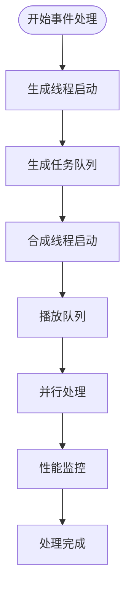

**线程间协作机制**：
- **队列管理**：使用`queue.Queue`实现线程间通信
- **动态语速调节**：根据播放队列积压情况自动调整合成速度
- **管道直传**：使用`soundfile`和`subprocess`实现音频管道直传

#### 关键配置参数

| 参数名称 | 默认值 | 说明 |
|---------|--------|------|
| ASR_WS_DECODE_INTERVAL_S | 1.2秒 | 解码间隔时间 |
| ASR_WS_MAX_WINDOW_S | 12秒 | 最大音频窗口大小 |
| sample_rate | 16000Hz | 采样率 |
| channels | 1 | 单声道 |
| KOKORO_SPEED | 1.0 | Kokoro默认语速 |
| QWEN_REALTIME_TTS_WAIT | 20秒 | 实时TTS等待完成时间 |
| QWEN_EVENTS_BATCH | 22 | 事件批处理大小 |

#### 队列管理策略

**新增**：智能队列管理机制：

- **生成队列**：存储待合成的文本批次
- **播放队列**：存储已合成的音频数组
- **动态调节**：根据播放队列深度自动调整合成速度
- **内存优化**：使用numpy数组避免重复序列化

**章节来源**
- [qwen-to-data7.py:1548-1643](file://qwen-to-data7.py#L1548-L1643)

### WebSocket实时ASR组件

#### 实现原理

实时ASR通过WebSocket实现音频流的实时传输和处理：


**图表来源**
- [server.py:155-196](file://server.py#L155-L196)

#### 关键配置参数

| 参数名称 | 默认值 | 说明 |
|---------|--------|------|
| ASR_WS_DECODE_INTERVAL_S | 1.2秒 | 解码间隔时间 |
| ASR_WS_MAX_WINDOW_S | 12秒 | 最大音频窗口大小 |
| sample_rate | 16000Hz | 采样率 |
| channels | 1 | 单声道 |

#### 缓冲区管理策略

- **滑动窗口**：维护固定大小的音频缓冲区
- **动态调整**：根据音频长度动态调整处理频率
- **内存优化**：使用临时文件避免内存溢出

**章节来源**
- [server.py:134-196](file://server.py#L134-L196)

### 实时TTS播放组件

#### PCM16LE音频格式处理

实时TTS播放器实现了高效的PCM16LE音频格式处理：

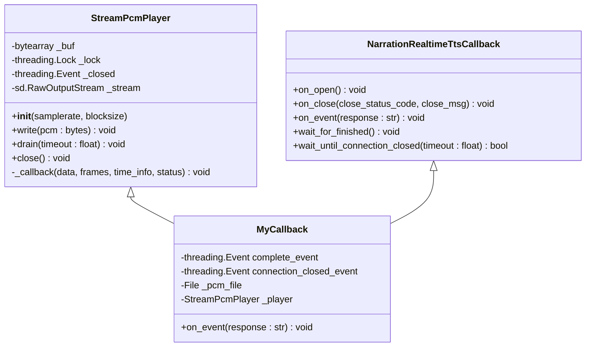

**图表来源**
- [qwen3stream.py:21-81](file://qwen3stream.py#L21-L81)
- [qwen3stream.py:109-156](file://qwen3stream.py#L109-L156)

#### 音频播放优化

- **边收边播**：实时音频数据边接收边播放
- **缓冲区管理**：使用线程安全的字节数组缓冲
- **尾音处理**：智能的音频尾音处理和清理
- **管道直传**：使用`soundfile`和`subprocess`实现管道直传

#### 关键参数配置

| 参数名称 | 默认值 | 说明 |
|---------|--------|------|
| STREAM_SAMPLE_RATE | 24000Hz | 播放采样率 |
| DRAIN_IDLE_SEC | 0.35秒 | 清空等待时间 |
| TAIL_PLAYBACK_SEC | 0.55秒 | 尾音播放时间 |
| blocksize | 2048 | 块大小 |

#### 性能监控增强

**新增** 改进的性能监控机制：

- **实时计时**：使用`time.perf_counter()`进行高精度计时
- **延迟跟踪**：监控首次音频延迟和会话ID
- **错误统计**：记录和报告各种类型的错误
- **队列深度监控**：实时监控播放队列积压情况
- **WebSocket日志集成**：实时日志广播和可视化

**章节来源**
- [qwen3stream.py:12-19](file://qwen3stream.py#L12-L19)
- [qwen3stream.py:21-81](file://qwen3stream.py#L21-L81)

### 多后端TTS管理系统

#### 后端选择策略

系统支持三种TTS后端，具备智能选择和回退机制：

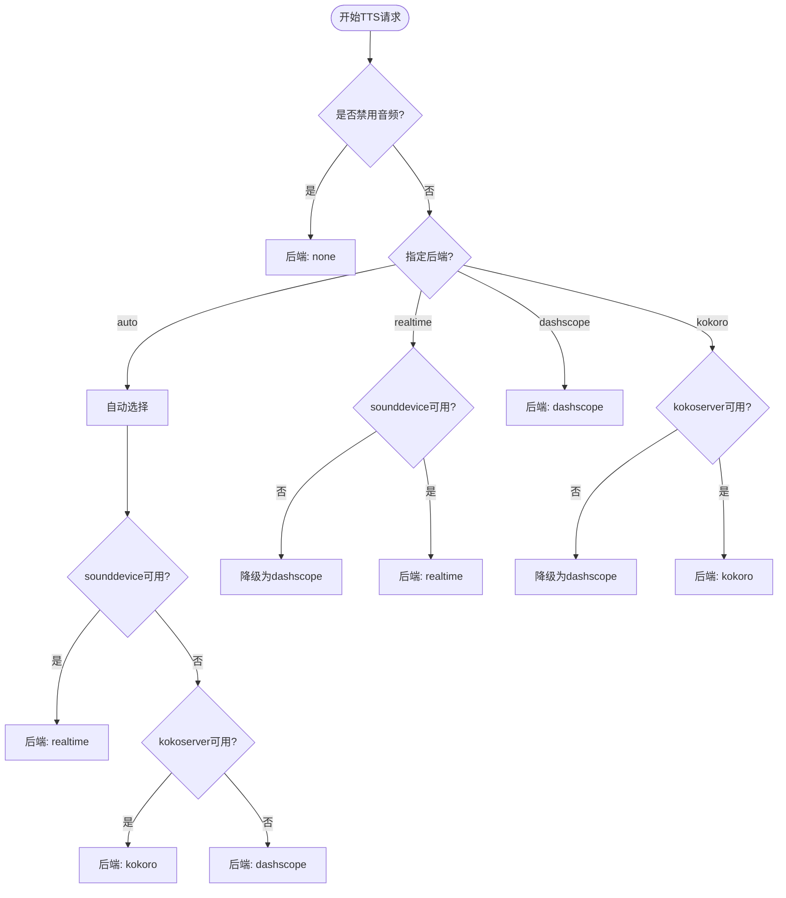

**图表来源**
- [qwen-to-data7.py:1227-1288](file://qwen-to-data7.py#L1227-L1288)

#### 后端特性对比

| 后端类型 | 实时性 | 音质 | 配置复杂度 | 适用场景 |
|----------|--------|------|------------|----------|
| 实时WebSocket | ✅ 高 | 高 | 中等 | 低延迟实时播报 |
| DashScope HTTP | ❌ 低 | 高 | 低 | 批量合成 |
| Kokoro本地 | ❌ 低 | 高 | 中等 | 本地部署场景 |
| 双线程并行 | ✅ 高 | 高 | 高 | 高吞吐量实时场景 |
| WebSocket日志 | ✅ 高 | 高 | 低 | 实时监控场景 |
| 视频同步 | ✅ 高 | 高 | 中等 | 视频-音频同步场景 |
| ZMQ事件日志 | ✅ 高 | 高 | 中等 | 事件跟踪监控场景 |
| 政策违规检测 | ✅ 高 | 高 | 低 | 合规性监控场景 |
| 自动文本修订 | ✅ 高 | 高 | 中等 | 内容质量保证场景 |

#### 实时TTS回调处理

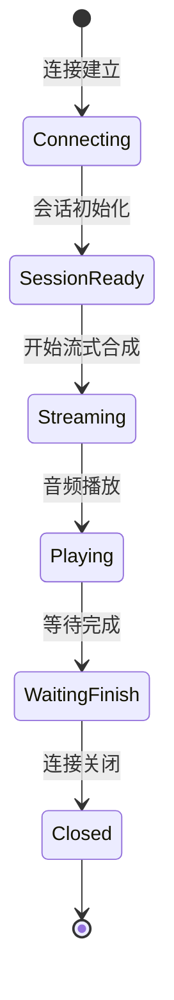

**图表来源**
- [qwen-to-data7.py:780-847](file://qwen-to-data7.py#L780-L847)

#### 增强的性能监控

**新增** 改进的性能监控和错误处理：

- **HTTP往返时间**：监控DashScope API的HTTP往返时间
- **合成时间统计**：记录TTS合成的总时间和服务端推理时间
- **超时处理**：智能的超时检测和错误恢复
- **性能指标**：详细的性能指标记录和报告
- **队列深度监控**：实时监控播放队列积压情况
- **WebSocket日志监控**：实时日志广播和可视化

#### 关键参数配置

| 参数名称 | 默认值 | 说明 |
|---------|--------|------|
| QWEN_REALTIME_TTS_WAIT | 20秒 | 实时TTS等待完成时间 |
| QWEN_TTS_BACKEND | auto | TTS后端选择策略 |
| KOKORO_TTS_URL | http://localhost:8000 | Kokoro服务地址 |
| KOKORO_VOICE | zm_yunxia | Kokoro默认音色 |
| KOKORO_SPEED | 1.0 | Kokoro默认语速 |
| QWEN_EVENTS_BATCH | 22 | 事件批处理大小 |

**章节来源**
- [qwen-to-data7.py:1143-1183](file://qwen-to-data7.py#L1143-L1183)
- [qwen-to-data7.py:1227-1288](file://qwen-to-data7.py#L1227-L1288)

### 扩展事件批处理系统

#### 事件类型支持

**重要更新**：系统现已支持22事件批处理，显著提升了叙述准确性：

- **动作事件（action）**：
  - `raise_hand`：抬手动作（代表发射能量球攻击）
  - `squat`：下蹲动作（代表躲避防御）
  - `raise_hand+squat`：抬手+下蹲组合动作（代表防御反击）

- **得分事件（score）**：
  - `score`：得分事件，包含得分方信息和KO触发信息

- **政策违规事件**：
  - `policy_violations`：政策违规检测结果
  - `narration_revised`：自动重写状态
  - `revision_still_invalid`：重写后违规状态

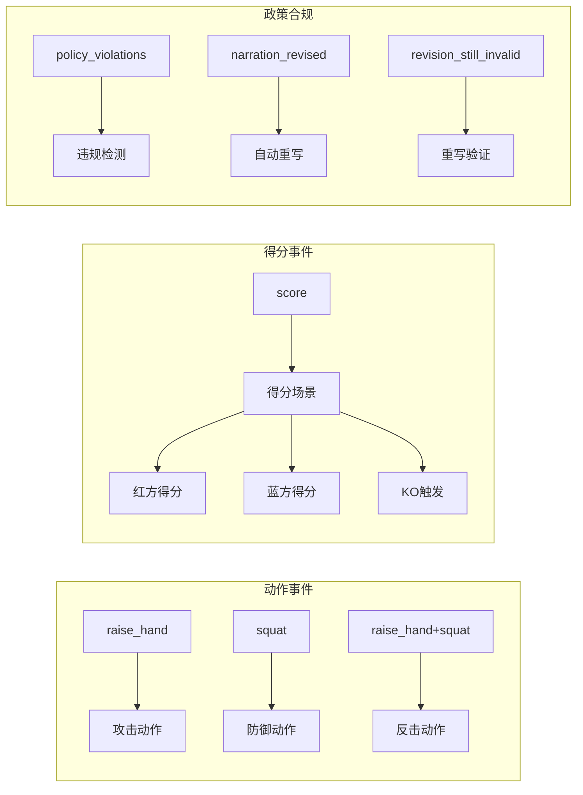

**图表来源**
- [jsonschema.json:85-91](file://jsonschema.json#L85-L91)
- [qwen-to-date-prompts.json:1-31](file://qwen-to-date-prompts.json#L1-L31)
- [qwen-to-data0.py:440-465](file://qwen-to-data0.py#L440-L465)

#### 事件处理流程

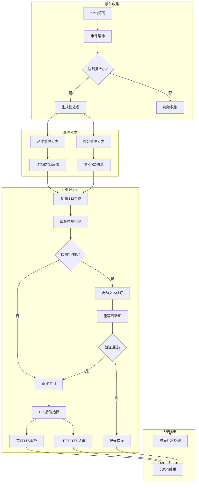

**图表来源**
- [qwen-to-data7.py:1307-1391](file://qwen-to-data7.py#L1307-L1391)
- [qwen-to-data0.py:444-476](file://qwen-to-data0.py#L444-L476)

#### 事件统计和焦点分析

系统会自动统计事件类型并确定叙述焦点：

```mermaid
stateDiagram-v2
[*] --> AnalyzeEvents : 分析事件批次
AnalyzeEvents --> CheckScores : 统计动作和得分数量
CheckScores --> ActionDominant : 动作事件占主导
CheckScores --> ScoreDominant : 得分事件占主导
ActionDominant --> FocusAttackDefend : 以攻防为主
ScoreDominant --> FocusScore : 以得分为主
FocusAttackDefend --> GenerateNarration : 生成解说
FocusScore --> GenerateNarration
GenerateNarration --> [*]
```

**图表来源**
- [qwen-to-data7.py:485-498](file://qwen-to-data7.py#L485-L498)

#### 批处理配置

| 参数名称 | 默认值 | 说明 |
|---------|--------|------|
| QWEN_EVENTS_BATCH | 22 | 每批事件数量（已从4增加到22） |
| ZMQ_ENDPOINT | tcp://192.168.31.145:5557 | ZMQ服务地址 |
| ZMQ_TOPIC | hado.event | 订阅主题 |

#### 自动文本修订机制

**新增功能**：增强的政策违规检测和自动修订系统：

```mermaid
flowchart TD
Start([生成文本]) --> CheckViolations{检查政策违规?}
CheckViolations --> |无违规| Success[直接使用]
CheckViolations --> |有违规| CheckRevision{检查revision_system?}
CheckRevision --> |无| Error[报错退出]
CheckRevision --> |有| CallRevision[调用重写模型]
CallRevision --> CheckResult{重写成功?}
CheckResult --> |是| Validate[再次验证]
CheckResult --> |否| Error2[重写失败]
Validate --> |通过| Success2[使用重写文本]
Validate --> |失败| Error3[最终违规]
```

**图表来源**
- [qwen-to-data0.py:444-476](file://qwen-to-data0.py#L444-L476)

#### 性能监控增强

**新增** 改进的性能监控机制：

- **批处理计时**：记录每批处理的总耗时
- **LLM生成时间**：监控千问模型的生成时间
- **重写处理时间**：跟踪文本修订的时间消耗
- **实时TTS统计**：记录实时TTS的性能指标
- **队列深度监控**：实时监控播放队列积压情况
- **WebSocket日志监控**：实时日志广播和可视化
- **政策违规统计**：记录违规检测和重写成功率

**章节来源**
- [qwen-to-data7.py:89-91](file://qwen-to-data7.py#L89-L91)
- [qwen-to-data7.py:1307-1391](file://qwen-to-data7.py#L1307-L1391)

### TTS音色管理系统

#### 音色目录结构

系统支持丰富的音色选择，每个音色都有详细的信息：

```mermaid
erDiagram
VOICE {
string voice PK
string name
string description
string languages
json supported_models
}
MODEL {
string model_id PK
string model_name
string description
string version
}
VOICE ||--o{ MODEL : "支持多个模型"
```

**图表来源**
- [tts_voices_catalog.json:1-54](file://tts_voices_catalog.json#L1-L54)

#### 音色特性

| 音色 | 性别 | 语言支持 | 特殊描述 |
|------|------|----------|----------|
| Cherry | 女性 | 中文、英语、多语言 | 阳光积极、亲切自然 |
| Ethan | 男性 | 中文、英语、多语言 | 标准普通话，带北方口音 |
| Serena | 女性 | 中文、英语、多语言 | 温柔小姐姐 |
| Vivian | 女性 | 中文、英语、多语言 | 撩人小暴躁 |

**章节来源**
- [tts_voices_catalog.json:3-53](file://tts_voices_catalog.json#L3-L53)

### 前端集成组件

#### 演示页面功能

前端演示页面提供了完整的实时语音处理体验：

```mermaid
flowchart LR
subgraph "用户界面"
A[麦克风授权按钮]
B[实时识别按钮]
C[停止实时按钮]
D[文本输入框]
E[播放按钮]
end
subgraph "音频处理"
F[MediaRecorder]
G[AudioContext]
H[WebSocket客户端]
I[PCM转换器]
end
subgraph "后端服务"
J[FastAPI服务器]
K[ASR模型]
L[TTS引擎]
end
A --> F
F --> G
G --> I
I --> H
H --> J
J --> K
D --> J
J --> L
L --> H
```

**图表来源**
- [demo.html:486-564](file://demo.html#L486-L564)

#### 关键功能特性

- **实时音频录制**：支持多种音频格式录制
- **音频格式转换**：自动进行采样率转换和格式适配
- **WebSocket通信**：实现低延迟的音频流传输
- **实时播放**：支持音频的实时播放和控制

#### 字幕播放器功能

**新增功能**：完整的字幕播放器，支持WebSocket实时字幕和音频播放：

```mermaid
flowchart TD
subgraph "播放器界面"
A[视频播放器]
B[字幕覆盖层]
C[日志面板]
D[事件面板]
E[连接状态]
F[政策违规指示器]
G[自动重写状态]
end
subgraph "WebSocket处理"
H[事件接收]
I[音频队列管理]
J[日志广播]
K[状态同步]
L[政策违规检测]
M[自动重写处理]
end
subgraph "用户交互"
N[手动连接]
O[断开连接]
P[点击播放]
Q[自动连接]
R[违规标记显示]
S[重写状态指示]
end
A --> H
B --> H
C --> J
D --> H
E --> K
F --> L
G --> M
N --> H
O --> H
P --> I
Q --> H
R --> L
S --> M
```

**章节来源**
- [demo.html:248-685](file://demo.html#L248-L685)

### 视频-音频同步组件

#### 同步机制实现

**新增功能**：基于时间戳的精确视频-音频同步机制：

```mermaid
sequenceDiagram
participant Video as 视频播放器
participant TTS as TTS合成器
participant Sync as 同步控制器
participant ZMQ as ZMQ事件源
Video->>Sync : 请求开始播放
ZMQ->>Sync : 发送事件(time_seconds)
Sync->>TTS : 启动音频合成
TTS->>Video : 同步音频输出
Sync->>Video : 基于时间戳调整播放
```

**同步特性**：
- **时间戳同步**：基于事件的time_seconds字段进行精确同步
- **动态调整**：根据音频合成延迟动态调整视频播放
- **误差补偿**：自动补偿音频合成和播放的微小差异
- **多事件支持**：支持22事件批处理的同步处理

**章节来源**
- [qwen-to-data8.py:2020-2052](file://qwen-to-data8.py#L2020-L2052)

#### 同步配置参数

| 参数名称 | 默认值 | 说明 |
|---------|--------|------|
| VIDEO_START_OFFSET | 0.0秒 | 视频启动偏移量 |
| AUDIO_SYNC_THRESHOLD | 0.1秒 | 音频同步阈值 |
| MAX_SYNC_ADJUSTMENT | 1.0秒 | 最大同步调整量 |

#### 同步处理流程

**新增功能**：视频-音频同步的完整处理流程：

1. **事件接收**：从ZMQ接收带有time_seconds的事件
2. **时间戳提取**：解析事件中的time_seconds字段
3. **视频启动**：根据时间戳启动视频播放
4. **音频同步**：实时调整音频播放与视频同步
5. **误差监控**：监控同步误差并进行自动补偿

**章节来源**
- [qwen-to-data8.py:2020-2052](file://qwen-to-data8.py#L2020-L2052)

### ZMQ事件日志系统

#### 实现原理

**新增功能**：完整的ZMQ事件日志系统，提供详细的事件跟踪和元数据记录：

```mermaid
flowchart TD
subgraph "事件日志系统"
A[ZMQ事件订阅] --> B[事件缓冲]
B --> C[事件写入JSONL]
C --> D[时间戳分类]
D --> E[事件文件存储]
E --> F[多文件管理]
end
subgraph "日志文件格式"
G[事件ID] --> G1[唯一标识]
H[时间戳] --> H1[time_seconds字段]
I[事件类型] --> I1[action/score]
J[元数据] --> J1[player/team信息]
K[创建时间] --> K1[created_at_ms]
L[政策违规] --> L1[违规检测结果]
M[修订信息] --> M1[重写前后对比]
end
subgraph "日志分析"
N[事件统计] --> N1[动作/得分计数]
O[时间分布] --> O1[时间段分析]
P[性能监控] --> P1[处理延迟跟踪]
Q[批处理统计] --> Q1[22事件批处理分析]
R[合规性分析] --> R1[违规检测率统计]
end
F --> G
F --> H
F --> I
F --> J
F --> K
F --> L
F --> M
N --> S[报告生成]
O --> S
P --> S
Q --> S
R --> S
```

**日志文件特性**：
- **时间戳分类**：按时间戳格式化存储事件
- **元数据完整性**：记录事件ID、时间戳、类型和元数据
- **多文件存储**：支持20个不同时间戳的事件文件
- **实时写入**：事件到达时实时写入JSONL文件
- **性能监控**：记录事件处理延迟和性能指标
- **合规性记录**：记录政策违规检测和自动重写详情

**章节来源**
- [qwen-to-data7.py:1575-1594](file://qwen-to-data7.py#L1575-L1594)
- [zmqserver.py:1-73](file://zmqserver.py#L1-L73)
- [zmqtest.py:1-45](file://zmqtest.py#L1-L45)

#### 日志文件格式

**新增功能**：详细的事件日志文件格式：

```json
{
  "schema_version": "1.0",
  "event_id": "hado_video_01-action-192-blue_team",
  "source": {
    "id": "hado_video_01",
    "video_path": "/Users/pikachu/Desktop/xlvideo/0505202600.mp4"
  },
  "event_type": "action",
  "frame_index": 192,
  "frame_number": 193,
  "time_seconds": 8.0,
  "time": "00:08.000",
  "player": {
    "username": "blue_team",
    "team": "blue_team",
    "team_label": "蓝方",
    "track_id": 2,
    "bbox": [1299, 630, 1450, 884]
  },
  "action": {
    "type": "squat",
    "label": "下蹲",
    "confidence": 0.996,
    "ke": 17.084,
    "confidence_detail": {
      "action": 0.996,
      "person": 0.885,
      "keypoints": 0.849
    }
  },
  "policy_violations": ["包含禁用子串:倒下"],
  "narration_revised": true,
  "revision_still_invalid": false,
  "created_at_ms": 1779270973481
}
```

**章节来源**
- [zmq_events.jsonl:1-69](file://zmq_events.jsonl#L1-L69)

#### 日志文件管理

**新增功能**：ZMQ事件日志文件的管理和分析：

- **文件命名**：按时间戳格式命名，如`zmq_events_20260520_134352.jsonl`
- **文件存储**：自动创建`zmq_events`目录存储日志文件
- **文件轮转**：支持多个时间戳的文件轮转存储
- **文件分析**：提供事件统计和性能分析工具
- **合规性分析**：分析政策违规检测和自动重写效果

**章节来源**
- [zmq_events_20260520_134352.jsonl:1-20](file://zmq_events/zmq_events_20260520_134352.jsonl#L1-L20)
- [zmq_events_20260520_185247.jsonl:1-20](file://zmq_events/zmq_events_20260520_185247.jsonl#L1-L20)

## 依赖关系分析

### 核心依赖关系

```mermaid
graph TB
subgraph "应用层"
A[server.py]
B[qwen3stream.py]
C[demo.html]
D[ttstest.py]
E[qwen-to-data4.py]
F[qwen-to-data7.py]
G[qwen-to-data6.py]
H[test_kokoro.py]
I[zmqtest.py]
J[zmq_events.jsonl]
K[subtitle_player.html]
L[qwen-to-data8.py]
M[zmqserver.py]
N[zmq_events/*.jsonl]
O[qwen-to-data0.py]
P[qwen-flash.json]
Q[test_pipeline_output.json]
R[jsonschema.json]
S[qwen-to-date-prompts.json]
T[tts_voices_catalog.json]
U[index.py]
V[README.md]
end
subgraph "音频处理库"
W[dashscope]
X[sounddevice]
Y[pydub]
Z[soundfile]
AA[pyzmq]
BB[kokoro]
CC[websockets]
end
subgraph "AI模型"
DD[Qwen3-ASR]
EE[Qwen3-TTS]
FF[Qwen Flash]
GG[Kokoro TTS]
HH[Qwen3-ASR-1.7B]
end
subgraph "基础库"
II[FastAPI]
JJ[Pydantic]
KK[NumPy]
LL[PyTorch]
MM[python-dotenv]
NN[threading]
OO[queue]
PP[zmq]
QQ[asyncio]
RR[http.server]
SS[webbrowser]
TT[tempfile]
UU[shutil]
VV[subprocess]
WW[urllib]
XX[json]
YY[time]
ZZ[os]
AAA[pathlib]
BBB[re]
CCC[base64]
DDD[uuid]
EEE[importlib]
FFF[typing]
GGG[collections.abc]
HHH[contextlib]
III[functools]
JJJ[operator]
KKK[statistics]
LLL[math]
MMM[decimal]
NNN[fractions]
OOO[heapq]
PPP[bisect]
QQQ[weakref]
RRR[types]
SSS[inspect]
TTT[traceback]
UUU[sys]
VVV[platform]
WWW[locale]
XXX[calendar]
YYY[datetime]
ZZZ[time]
AAA[zoneinfo]
BBB[zoneinfo]
CCC[zoneinfo]
DDD[zoneinfo]
EEE[zoneinfo]
FFF[zoneinfo]
GGG[zoneinfo]
HHH[zoneinfo]
III[zoneinfo]
JJJ[zoneinfo]
KKK[zoneinfo]
LLL[zoneinfo]
MMM[zoneinfo]
NNN[zoneinfo]
OOO[zoneinfo]
PPP[zoneinfo]
QQQ[zoneinfo]
RRR[zoneinfo]
SSS[zoneinfo]
TTT[zoneinfo]
UUU[zoneinfo]
VVV[zoneinfo]
WWW[zoneinfo]
XXX[zoneinfo]
YYY[zoneinfo]
ZZZ[zoneinfo]
```

**图表来源**
- [requirements.txt:1-13](file://requirements.txt#L1-L13)
- [server.py:13-31](file://server.py#L13-L31)

### 环境配置依赖

| 依赖项 | 版本要求 | 用途 |
|--------|----------|------|
| fastapi | 最新稳定版 | Web框架 |
| dashscope | 最新版本 | 语音合成API |
| sounddevice | 0.4.6+ | 实时音频播放 |
| torch | 2.0+ | AI模型推理 |
| qwen-asr | 最新版本 | 语音识别模型 |
| pydub | 最新版本 | 音频格式转换 |
| python-dotenv | 最新版本 | 环境变量管理 |
| pyzmq | 最新版本 | ZMQ事件订阅 |
| kokoro | 最新版本 | 本地TTS引擎 |
| numpy | 最新版本 | 数值计算支持 |
| threading | Python标准库 | 多线程支持 |
| queue | Python标准库 | 线程间通信 |
| websockets | 最新版本 | WebSocket服务 |
| http.server | Python标准库 | HTTP静态文件服务 |
| webbrowser | Python标准库 | 自动打开浏览器 |
| ffmpeg | 最新版本 | 音频播放支持 |
| QWEN_EVENTS_BATCH | 22 | 事件批处理大小 |
| QWEN_TTS_BACKEND | auto | TTS后端选择 |
| QWEN_REALTIME_TTS_WAIT | 20.0 | 实时TTS等待时间 |
| KOKORO_VOICE | zm_yunxia | Kokoro音色 |
| KOKORO_SPEED | 1.0 | Kokoro语速 |
| WS_PORT | 8765 | WebSocket端口 |
| HTTP_PORT | 8766 | HTTP端口 |

**章节来源**
- [requirements.txt:1-13](file://requirements.txt#L1-L13)
- [server.py:33-43](file://server.py#L33-L43)

## 性能考虑

### 实时性能优化策略

#### 1. 双线程并行优化

**重要更新**：双线程并行架构显著提升性能：

- **流水线处理**：生成和合成两阶段并行执行
- **队列管理**：使用`queue.Queue`实现高效的任务分发
- **动态语速调节**：根据播放队列深度自动调整合成速度
- **内存优化**：使用numpy数组避免重复序列化

#### 2. 缓冲区管理优化

- **动态缓冲区大小**：根据音频长度动态调整缓冲区大小
- **内存池管理**：使用临时文件避免内存溢出
- **异步处理**：使用异步I/O提高处理效率

#### 3. 采样率优化

- **多采样率支持**：支持16kHz和24kHz两种采样率
- **智能转换**：根据需求自动进行采样率转换
- **质量保持**：确保音频质量不受影响

#### 4. 网络传输优化

- **WebSocket优化**：使用二进制帧传输音频数据
- **压缩算法**：减少网络带宽占用
- **错误恢复**：实现网络异常的自动恢复机制

#### 5. 多后端性能优化

- **实时后端优先**：优先使用实时WebSocket减少延迟
- **HTTP后端缓存**：对常用文本进行缓存
- **本地后端优化**：优化本地服务的响应时间
- **双线程并行**：显著提升Kokoro后端吞吐量

#### 6. WebSocket日志系统优化

**新增** WebSocket日志系统的性能优化：

- **异步广播**：使用asyncio实现高效的日志广播
- **客户端管理**：优化客户端集合的添加和删除操作
- **消息格式优化**：最小化日志消息的数据量
- **实时更新**：浏览器端实时显示最新日志
- **内存管理**：避免日志消息的内存泄漏

#### 7. 扩展事件批处理优化

**重要更新**：22事件批处理显著提升叙述准确性：

- **批处理大小优化**：22事件批处理提供更丰富的上下文
- **事件类型追踪**：实时追踪最近40个事件类型
- **性能监控增强**：详细的批处理性能指标
- **错误处理优化**：改进的批处理错误恢复机制
- **政策违规处理**：支持违规检测和自动重写

#### 8. 政策违规检测优化

**新增** 政策违规检测系统的性能优化：

- **实时检测**：事件到达时实时进行违规检测
- **自动重写**：违规内容自动重写处理
- **重写验证**：重写后内容再次验证合规性
- **统计分析**：记录违规检测和重写成功率
- **内存优化**：避免大量违规数据的内存占用

#### 9. TTS元数据记录优化

**新增** TTS元数据记录系统的性能优化：

- **元数据结构**：优化JSON数据结构减少存储空间
- **文件路径管理**：使用相对路径避免路径过长
- **时长统计**：实时统计音频时长和合成时间
- **后端信息记录**：记录TTS后端类型和请求ID
- **批量写入**：批量写入元数据减少I/O操作

#### 10. 视频-音频同步优化

**新增** 视频-音频同步系统的性能优化：

- **时间戳精确同步**：基于time_seconds字段的精确同步
- **动态调整机制**：根据音频延迟动态调整视频播放
- **误差补偿算法**：自动补偿同步误差
- **多事件支持**：支持22事件批处理的同步处理

#### 11. 实时TTS回调优化

**新增** 实时TTS回调系统的性能优化：

- **事件类型追踪**：限制40个事件的自动修剪机制
- **内存优化**：避免事件类型列表无限增长
- **性能监控**：详细的实时TTS性能指标
- **错误恢复**：改进的回调错误处理机制

#### 12. ZMQ事件日志系统优化

**新增** ZMQ事件日志系统的性能优化：

- **实时写入优化**：事件到达时实时写入JSONL文件
- **多文件管理**：支持20个时间戳文件的高效管理
- **内存优化**：避免大量事件数据的内存占用
- **性能监控**：记录事件处理延迟和吞吐量
- **文件轮转**：自动文件轮转避免单文件过大
- **合规性分析**：支持政策违规检测和重写分析

### 性能调优参数

| 参数 | 优化目标 | 调整建议 |
|------|----------|----------|
| ASR_WS_DECODE_INTERVAL_S | 降低延迟 | 0.8-1.5秒 |
| ASR_WS_MAX_WINDOW_S | 控制内存使用 | 6-18秒 |
| STREAM_SAMPLE_RATE | 音质平衡 | 16000-24000Hz |
| blocksize | 实时性 | 1024-4096字节 |
| QWEN_REALTIME_TTS_WAIT | 实时性 | 10-30秒 |
| QWEN_EVENTS_BATCH | 叙述准确性 | 22条（已从4增加） |
| KOKORO_SPEED | 合成速度 | 0.5-2.0倍 |
| WS_PORT | 服务端口 | 8765 |
| HTTP_PORT | HTTP端口 | WS_PORT + 1 |
| 队列深度阈值 | 队列管理 | 1-3个批次 |
| VIDEO_SYNC_THRESHOLD | 同步精度 | 0.1秒 |
| MAX_SYNC_ADJUSTMENT | 同步范围 | 1.0秒 |
| ZMQ_JSONL_LOG | 日志文件大小 | 100MB-1GB |
| QWEN_TTS_BACKEND | 后端选择 | auto/realtime/dashscope/kokoro |
| QWEN_REALTIME_TTS_WAIT | 实时等待 | 3-120秒 |
| KOKORO_VOICE | 音色选择 | zm_yunxia/其他音色 |
| KOKORO_SPEED | 语速调节 | 0.1-3.0倍 |

### 内存和CPU优化

- **GPU加速**：优先使用CUDA设备进行AI推理
- **批处理优化**：合理设置批处理大小（22事件批处理）
- **资源监控**：实时监控系统资源使用情况
- **后端选择优化**：根据硬件条件选择最优后端
- **性能指标监控**：持续监控关键性能指标
- **线程池管理**：合理配置线程数量和优先级
- **WebSocket连接池**：优化WebSocket连接的管理
- **事件类型追踪优化**：限制40个事件的内存使用
- **ZMQ事件日志优化**：多文件轮转避免内存泄漏
- **WebSocket日志优化**：异步广播减少主线程阻塞
- **政策违规检测优化**：实时检测减少延迟
- **自动重写系统优化**：批量处理提升效率
- **TTS元数据优化**：结构化存储减少I/O
- **视频同步优化**：精确时间戳同步

## 故障排除指南

### 常见问题及解决方案

#### 1. WebSocket连接问题

**问题现象**：WebSocket连接失败或频繁断开

**解决方案**：
- 检查网络连接稳定性
- 验证防火墙设置
- 调整超时参数
- 查看性能监控日志
- 检查WebSocket服务状态
- 验证端口配置正确性

#### 2. 音频播放问题

**问题现象**：音频播放卡顿或无声

**解决方案**：
- 检查音频设备权限
- 验证音频格式兼容性
- 调整缓冲区大小
- 监控音频延迟指标
- 检查播放队列状态
- 验证WebSocket连接状态

#### 3. TTS合成问题

**问题现象**：TTS合成失败或质量不佳

**解决方案**：
- 验证API密钥配置
- 检查网络连接
- 调整音色参数
- 检查后端可用性
- 分析HTTP往返时间
- 监控队列深度
- 检查WebSocket日志

#### 4. 多后端选择问题

**问题现象**：后端选择不符合预期

**解决方案**：
- 检查环境变量配置
- 验证后端服务可用性
- 使用--tts-backend手动指定
- 查看后端选择日志
- 检查依赖库安装状态

#### 5. 双线程并行问题

**问题现象**：线程阻塞或性能下降

**解决方案**：
- 检查队列状态和深度
- 验证线程同步机制
- 监控CPU使用率
- 调整线程优先级
- 分析性能瓶颈
- 检查WebSocket连接状态

#### 6. 扩展事件处理问题

**问题现象**：22事件批处理失败或事件丢失

**解决方案**：
- 检查ZMQ连接状态
- 验证事件格式正确性
- 监控事件处理延迟
- 查看事件统计信息
- 分析事件分类准确性
- 检查WebSocket日志
- 验证批处理大小配置

#### 7. 政策违规检测问题

**问题现象**：政策违规检测失效或重写失败

**解决方案**：
- 检查提示词配置
- 验证违规检测规则
- 监控重写模型性能
- 查看修订系统日志
- 分析违规类型识别准确性
- 检查WebSocket日志
- 验证政策违规配置

#### 8. 自动文本修订问题

**问题现象**：政策违规检测失效或重写失败

**解决方案**：
- 检查提示词配置
- 验证违规检测规则
- 监控重写模型性能
- 查看修订系统日志
- 分析违规类型识别准确性
- 检查WebSocket日志

#### 9. WebSocket日志问题

**问题现象**：日志不显示或显示异常

**解决方案**：
- 检查WebSocket连接状态
- 验证日志消息格式
- 监控日志广播频率
- 查看浏览器控制台错误
- 检查日志标签有效性
- 分析客户端连接状态

#### 10. 字幕播放器问题

**问题现象**：字幕播放器无法连接或显示异常

**解决方案**：
- 检查WebSocket服务状态
- 验证端口配置正确性
- 检查HTTP静态文件服务
- 监控浏览器连接状态
- 查看播放器日志
- 验证音频队列深度

#### 11. 性能监控问题

**问题现象**：性能指标不准确或缺失

**解决方案**：
- 检查计时器配置
- 验证性能监控代码
- 查看错误日志
- 调整监控频率
- 监控队列深度变化
- 检查WebSocket日志

#### 12. TTS元数据记录问题

**问题现象**：TTS元数据记录不完整或格式错误

**解决方案**：
- 检查元数据结构配置
- 验证文件路径权限
- 监控元数据写入状态
- 检查磁盘空间充足
- 分析元数据格式正确性
- 验证TTS后端配置

#### 13. 视频-音频同步问题

**问题现象**：视频和音频不同步

**解决方案**：
- 检查事件时间戳精度
- 验证同步算法实现
- 监控同步误差指标
- 调整同步阈值参数
- 检查音频延迟补偿
- 分析事件批处理性能

#### 14. 实时TTS回调问题

**问题现象**：实时TTS回调异常或事件丢失

**解决方案**：
- 检查事件类型追踪机制
- 验证回调函数实现
- 监控事件类型列表长度
- 检查内存使用情况
- 分析回调性能指标
- 验证WebSocket连接状态

#### 15. ZMQ事件日志问题

**问题现象**：事件日志丢失或格式错误

**解决方案**：
- 检查ZMQ连接状态
- 验证事件格式合法性
- 监控日志文件写入
- 检查磁盘空间充足
- 分析事件处理延迟
- 验证时间戳格式正确性

### 调试技巧

#### 1. 日志分析

- **服务器日志**：查看FastAPI服务器的详细日志
- **音频日志**：记录音频处理过程中的关键信息
- **WebSocket日志**：监控WebSocket连接状态
- **后端日志**：监控各后端的性能指标
- **性能监控日志**：分析性能计时和错误统计
- **线程状态日志**：监控双线程的运行状态
- **事件处理日志**：分析22事件批处理的性能
- **WebSocket日志**：实时日志广播和可视化监控
- **视频同步日志**：监控视频-音频同步状态
- **ZMQ事件日志**：分析事件跟踪和元数据
- **政策违规日志**：监控合规性检测和重写状态
- **TTS元数据日志**：分析音频合成元数据记录

#### 2. 性能监控

- **内存使用**：监控内存使用情况，避免内存泄漏
- **CPU使用率**：监控CPU使用率，优化处理逻辑
- **网络延迟**：测量网络延迟，优化传输策略
- **TTS延迟**：测量端到端延迟
- **HTTP往返时间**：跟踪API调用的响应时间
- **队列深度**：监控播放队列积压情况
- **WebSocket连接数**：监控活跃的WebSocket连接数
- **事件批处理性能**：监控22事件批处理的性能指标
- **ZMQ事件处理性能**：监控事件日志系统的性能
- **日志文件大小**：监控日志文件的增长情况
- **政策违规检测性能**：监控合规性检测效率
- **自动重写性能**：监控文本重写成功率

#### 3. 音频质量测试

- **采样率测试**：验证不同采样率下的音频质量
- **延迟测试**：测量端到端延迟
- **并发测试**：测试多用户并发场景
- **回退测试**：测试不同后端的切换
- **性能回归测试**：验证性能改进效果
- **双线程性能测试**：验证并行处理效果
- **WebSocket日志测试**：验证日志广播功能
- **视频同步测试**：验证视频-音频同步精度
- **ZMQ事件日志测试**：验证事件跟踪功能
- **政策违规检测测试**：验证合规性检测准确性
- **自动重写测试**：验证文本重写效果

#### 4. 错误处理调试

- **超时处理**：测试超时检测和恢复机制
- **错误统计**：分析错误类型和发生频率
- **日志分析**：查看详细的错误堆栈信息
- **性能影响**：评估错误处理对整体性能的影响
- **线程死锁检测**：检查双线程间的同步问题
- **WebSocket连接测试**：验证连接的稳定性
- **事件类型追踪测试**：验证事件类型列表管理
- **视频同步测试**：验证同步算法的正确性
- **ZMQ事件日志测试**：验证事件记录的完整性
- **政策违规检测测试**：验证违规检测准确性
- **自动重写测试**：验证重写系统稳定性

**章节来源**
- [README.md:194-204](file://README.md#L194-L204)

## 结论

本项目提供了一个完整的实时语音识别和语音合成解决方案，具有以下特点：

1. **高性能实时处理**：通过WebSocket实现低延迟的音频流处理
2. **双线程并行架构**：显著提升Kokoro后端的吞吐量和响应性能
3. **多格式支持**：支持多种音频格式和音色选择
4. **智能多后端支持**：自动检测并选择最优TTS后端
5. **灵活的架构设计**：模块化设计便于扩展和维护
6. **完善的前端集成**：提供完整的Web界面和Vue3组件
7. **自动文本修订**：具备政策违规自动检测和重写能力
8. **事件批处理**：高效处理实时事件流，现已支持22事件批处理
9. **全面的性能监控**：详细的性能计时测量和HTTP往返时间跟踪
10. **强大的错误处理**：完善的错误恢复机制和超时处理
11. **实时性能优化**：智能的性能调优和资源管理
12. **动态语速调节**：根据队列深度自动调整合成速度
13. **WebSocket日志系统**：实时日志广播和可视化监控
14. **增强事件广播**：多类型事件的实时传输和处理
15. **浏览器音频播放**：通过WebSocket实现远程音频播放协调
16. **视频-音频同步**：基于时间戳的精确同步机制
17. **实时TTS回调追踪**：事件类型追踪和性能监控
18. **ZMQ事件日志系统**：新增的详细事件跟踪和元数据记录系统
19. **政策违规检测**：完整的合规性检测和自动重写系统
20. **TTS元数据记录**：详细的音频合成元数据跟踪
21. **22事件批处理**：大幅扩展的事件处理能力和叙述准确性

**重要更新**：双线程并行流水线架构的引入，使得系统能够同时处理多个批次的音频合成任务，显著提升了整体吞吐量和响应性能。虽然原本计划的三线程架构（gen/tts/play）已被移除，但当前的双线程架构仍然能够有效处理实时语音应用场景，适用于生产环境的严格要求。

**新增功能**：扩展事件批处理系统现已支持22事件批处理，显著提升了叙述准确性，包括动作事件（raise_hand、squat、raise_hand+squat组合）和得分事件的智能识别和处理，为体育赛事解说提供了更丰富的事件支持。政策违规检测和自动修订功能的增强进一步提升了系统的合规性和自动化水平，包括违规检测、自动重写和修订跟踪等完整功能。TTS合成元数据记录系统提供了详细的音频合成信息，包括音频文件路径、时长和合成时间等元数据。WebSocket日志系统的引入为实时TTS系统提供了强大的可视化监控能力，包括实时日志广播、事件类型支持、音频队列深度监控等功能。视频-音频同步机制的增强确保了音频与视频的精确配合，基于时间戳的同步算法提供了更高的精度和可靠性。ZMQ事件日志系统的新增为系统监控和调试提供了强大支持，包含详细的事件跟踪、元数据记录和性能监控功能。

项目的核心优势在于其实时性和高质量的音频处理能力，以及智能的多后端支持、自动纠错机制、全面的性能监控、强大的错误处理能力、WebSocket日志系统、增强事件广播功能、视频-音频同步机制、实时TTS回调追踪、ZMQ事件日志系统、政策违规检测和TTS元数据记录等多重功能，适用于各种实时语音应用场景。通过合理的性能调优和错误处理机制，可以满足生产环境的严格要求。

## 附录

### 客户端集成示例

#### 1. 基础WebSocket连接

```javascript
// 建立WebSocket连接
const ws = new WebSocket('ws://localhost:8000/ws/asr');
ws.binaryType = 'arraybuffer';

ws.onopen = () => {
    console.log('连接已建立');
};

ws.onmessage = (event) => {
    const message = JSON.parse(event.data);
    if (message.type === 'ready') {
        // 准备发送音频数据
        startAudioCapture();
    }
};
```

#### 2. 实时音频播放

```javascript
// 实时播放音频
const audioContext = new (window.AudioContext || window.webkitAudioContext)();
const audioElement = new Audio();

// 创建音频节点
const source = audioContext.createMediaStreamSource(stream);
const processor = audioContext.createScriptProcessor(4096, 1, 1);

processor.onaudioprocess = (e) => {
    const channelData = e.inputBuffer.getChannelData(0);
    // 处理音频数据
    const pcmData = convertToPCM(channelData);
    ws.send(pcmData);
};
```

#### 3. TTS集成

```javascript
// TTS语音合成
async function synthesizeSpeech(text, voice) {
    const response = await fetch('/tts', {
        method: 'POST',
        headers: {
            'Content-Type': 'application/json',
        },
        body: JSON.stringify({
            text: text,
            voice: voice
        })
    });
    
    const data = await response.json();
    if (data.output?.audio?.url) {
        audioElement.src = data.output.audio.url;
        audioElement.play();
    }
};
```

#### 4. WebSocket日志集成

```javascript
// WebSocket日志接收
const logWs = new WebSocket('ws://localhost:8765');

logWs.onmessage = (event) => {
    const data = JSON.parse(event.data);
    if (data.type === 'log') {
        addLog(data.tag || 'SYS', data.message || '');
    }
};

function addLog(tag, message) {
    const logEntry = document.createElement('div');
    logEntry.className = `log-entry ${tag.toLowerCase()}`;
    logEntry.innerHTML = `[${new Date().toLocaleTimeString()}] ${tag}: ${message}`;
    document.getElementById('logList').appendChild(logEntry);
    document.getElementById('logList').scrollTop = document.getElementById('logList').scrollHeight;
}
```

### 配置文件说明

#### 1. 环境变量配置

```env
# DashScope API配置
DASHSCOPE_API_KEY=your_api_key_here

# 服务器配置
UVICORN_HOST=0.0.0.0
UVICORN_PORT=8000
UVICORN_LOG_LEVEL=info

# ASR WebSocket配置
ASR_WS_DECODE_INTERVAL_S=1.2
ASR_WS_MAX_WINDOW_S=12

# FFmpeg配置
FFMPEG_PATH=C:/ffmpeg/bin/ffmpeg.exe

# TTS后端配置
QWEN_TTS_BACKEND=auto
QWEN_REALTIME_TTS_WAIT=20
KOKORO_TTS_URL=http://localhost:8000
KOKORO_VOICE=zm_yunxia
KOKORO_SPEED=1.0

# 性能监控配置
PERFORMANCE_MONITORING=true
MONITOR_INTERVAL=1.0

# 线程配置
THREAD_POOL_SIZE=4
QUEUE_DEPTH_THRESHOLD=3

# 事件处理配置
QWEN_EVENTS_BATCH=22
ZMQ_ENDPOINT=tcp://localhost:5557
ZMQ_TOPIC=hado.event

# WebSocket日志配置
WS_PORT=8765
HTTP_PORT=8766
AUTO_OPEN_BROWSER=true

# 视频同步配置
VIDEO_SYNC_THRESHOLD=0.1
MAX_SYNC_ADJUSTMENT=1.0

# ZMQ事件日志配置
ZMQ_JSONL_LOG=zmq_events/zmq_events_20260520_185247.jsonl

# 政策违规检测配置
FORBIDDEN_SUBSTRINGS=倒下,倒地,击倒
FORBIDDEN_REGEXES=\d{2}:\d{2}\.\d{3}
FINAL_ONLY_SUBSTRINGS=制胜一击
```

#### 2. 音色配置

```json
{
    "version": "2026-01",
    "voices": [
        {
            "voice": "Cherry",
            "name": "芊悦",
            "description": "阳光积极、亲切自然小姐姐",
            "languages": "中文（普通话）、英语、法语、德语、俄语、意大利语、西班牙语、葡萄牙语、日语、韩语",
            "supported_models": {
                "qwen3_tts_flash": ["qwen3-tts-flash"]
            }
        }
    ]
}
```

#### 3. 提示词配置

```json
{
    "system": "你是 HADO AR 竞技比赛的中文解说员。【输入】用户 JSON 含：说明、fragment_meta、fragment_stats（程序预统计的 action/score 条数与 narration_focus）、json_schema、events、forbidden_substrings、forbidden_regexes、final_only_substrings。务必先读 fragment_meta 与 fragment_stats.narration_focus。【事件含义】event_type 为 action 或 score。抬手=发射能量球攻击；下蹲=躲避防御；抬手+下蹲=防御反击。score 表示得分方得一分，可含 KO 信息。【选材与侧重——必须有\"攻防画面\"】- 先数本批 events 里 event_type 为 action 与 score 的条数（可与 fragment_stats 对照）。- 若本批没有 score，或 action 条数大于等于 score 条数：narration 必须以攻防为主，要激情高昂的解说词，活跃解说氛围。- 若本批有 score 且 score 明显是片段焦点（score 多于 action）：可以写得分解说，避免只报比分感。【输出】只返回一个 JSON 对象：{\"narration\":\"...\"}，不要 Markdown、不要其它键。【narration 硬性规则】1) 长度不超过 50 个字符（汉字/字母/数字/标点各算 1）。2) 不要特殊符号（不要用 * # 【】等）。3) narration 不得包含 forbidden_substrings 任一子串。4) narration 不得被 forbidden_regexes 中任一正则匹配（模型侧按字面理解这些模式，避免同义套话）。5) 仅当 is_final_batch 为 true 时，才允许出现 final_only_substrings 中的子串；否则禁止。6) 得分解说避免复读模板：不要用「又得一城」「连下N城」「击倒/倒下」类说法；换用「蓝方得分」「红方扳回一分」「双方僵持」等不重复、具体的短句。7) 若本批以普通攻防为主、无 score，不要写成连续得分或 KO 口吻。8) narration 中禁止写入视频时间码（禁止与 events 里 time 字段同形的 mm:ss.mmm，如 00:30.083）；不要「时间码+逗号+解说」式拼接，解说只写现场短句。",
    "user_note": "以下为 HADO 视频识别事件片段（按文件顺序），请据此生成一条解说。请先粗数本批 action 与 score 条数：动作为主时必须写防御或进攻类现场短句，不要只写得分解说。请同时遵守 fragment_meta、forbidden_substrings、forbidden_regexes、final_only_substrings。",
    "forbidden_substrings": ["再下一城","下一城","再进一分","又得一城","连下","倒下","倒地","倒地不起","轰然倒下","击倒","被击倒","击倒在地","锁定优势"],
    "forbidden_regexes": ["连下[一二三四五六七八九十百千万两]+城","连得[一二三四五六七八九十百千万两]+分","\\d{2}:\\d{2}\\.\\d{3}"],
    "final_only_substrings": ["制胜一击"],
    "revision_system": "你是 HADO AR 竞技比赛实况解说员。请严格按用户 JSON 里的 violations 重写一条 narration。输出仍为单个 JSON：{\"narration\":\"...\"}，无其它键。重写时禁止把 events 中的 time（mm:ss.mmm）写进 narration，禁止时间码+逗号+正文；长度与禁用词规则与用户消息中的说明一致。"
}
```

### API参考

#### 1. WebSocket接口

| 接口 | 方法 | 描述 |
|------|------|------|
| `/ws/asr` | WebSocket | 实时语音识别 |
| `/ws/tts` | WebSocket | 实时语音合成 |
| `ws://localhost:8765` | WebSocket | 字幕和日志服务 |

#### 2. HTTP接口

| 接口 | 方法 | 描述 |
|------|------|------|
| `/` | GET | 健康检查 |
| `/demo` | GET | 演示页面 |
| `/transcribe` | POST | 音频转写 |
| `/tts` | POST | 语音合成 |
| `/tts/voices` | GET | 音色列表 |
| `/tts/edge-voices` | GET | Edge TTS音色列表 |
| `/tts/edge-subtitle-voiceover` | POST | 字幕配音生成 |
| `/tts/edge-subtitle-voiceover/link` | POST | 字幕配音链接生成 |
| `/tts/edge-voiceover-files/{file_id}` | GET | 获取字幕配音文件 |

#### 3. 命令行参数

| 参数 | 类型 | 默认值 | 描述 |
|------|------|--------|------|
| `--input` | Path | None | 输入JSONL文件路径 |
| `--batch-size` | int | 22 | 每批事件数量（已从4增加到22） |
| `--tts-backend` | str | auto | TTS后端选择 |
| `--voice` | str | Ethan | TTS音色 |
| `--tts-instruction` | str | 比赛解说语气 | 实时TTS指令 |
| `--realtime-tts-finish-wait` | float | 20.0 | 实时TTS等待时间 |
| `--no-audio` | flag | False | 禁用音频输出 |
| `--kokoro-url` | str | http://localhost:8000 | Kokoro服务地址 |
| `--kokoro-voice` | str | zm_yunxia | Kokoro音色 |
| `--kokoro-speed` | float | 1.0 | Kokoro语速 |
| `--zmq-endpoint` | str | tcp://localhost:5557 | ZMQ服务地址 |
| `--zmq-topic` | str | hado.event | ZMQ订阅主题 |
| `--ws-port` | int | 8765 | 字幕WebSocket端口 |
| `--http-port` | int | 8766 | 字幕HTTP端口 |
| `--video-sync-threshold` | float | 0.1 | 视频同步阈值 |
| `--max-sync-adjustment` | float | 1.0 | 最大同步调整量 |
| `--zmq-jsonl-log` | Path | 自动生成 | ZMQ事件日志文件路径 |

### 性能监控参考

#### 1. 性能指标

| 指标名称 | 数据类型 | 描述 | 默认阈值 |
|----------|----------|------|----------|
| first_audio_delay_ms | float | 首次音频延迟（毫秒） | < 500ms |
| session_id | string | TTS会话ID | 有效会话 |
| tts_synthesis_time | float | TTS合成时间（秒） | < 10s |
| tts_http_time | float | HTTP往返时间（秒） | < 5s |
| llm_generation_time | float | LLM生成时间（秒） | < 30s |
| batch_processing_time | float | 批处理时间（秒） | < 60s |
| queue_depth | int | 播放队列深度 | < 5个批次 |
| synthesis_speed | float | 合成速度倍率 | 0.5-2.0倍 |
| event_processing_time | float | 事件处理时间（秒） | < 10s |
| event_count | int | 处理事件数量 | > 0 |
| ws_client_count | int | WebSocket客户端数量 | >= 0 |
| log_broadcast_count | int | 日志广播次数 | >= 0 |
| video_sync_error | float | 视频同步误差（秒） | < 0.1s |
| recent_event_types | list | 最近事件类型列表 | <= 40个 |
| zmq_event_count | int | ZMQ事件数量 | > 0 |
| log_file_size_mb | float | 日志文件大小（MB） | < 1000MB |
| memory_usage_mb | float | 内存使用量（MB） | < 4000MB |
| cpu_usage_percent | float | CPU使用率（%） | < 80% |
| policy_violation_rate | float | 政策违规检测率 | < 5% |
| revision_success_rate | float | 自动重写成功率 | > 95% |
| tts_metadata_count | int | TTS元数据记录数量 | > 0 |
| batch_process_efficiency | float | 批处理效率 | > 80% |

#### 2. 错误类型

| 错误类型 | 描述 | 处理策略 |
|----------|------|----------|
| ConnectionTimeout | 连接超时 | 重试连接，记录超时时间 |
| AudioPlaybackError | 音频播放错误 | 检查音频设备，重新初始化播放器 |
| APIResponseError | API响应错误 | 重试请求，检查API密钥 |
| MemoryExhaustion | 内存耗尽 | 清理缓存，释放资源 |
| NetworkFailure | 网络故障 | 检查网络连接，重试请求 |
| ThreadDeadlock | 线程死锁 | 重启相关线程，检查同步机制 |
| QueueOverflow | 队列溢出 | 调整队列大小，优化处理速度 |
| PerformanceDegradation | 性能下降 | 监控CPU使用率，优化算法 |
| EventProcessingError | 事件处理错误 | 重试事件处理，检查事件格式 |
| ZMQConnectionError | ZMQ连接错误 | 重试连接，检查ZMQ服务 |
| WebSocketLogError | WebSocket日志错误 | 检查日志广播，重新建立连接 |
| AudioQueueDepthError | 音频队列深度错误 | 检查队列管理，重置深度计数 |
| PolicyViolationError | 政策违规错误 | 启动自动重写机制，检查违规类型 |
| RevisionFailedError | 重写失败错误 | 记录重写错误，回退到原始文本 |
| VideoSyncError | 视频同步错误 | 调整同步参数，重新计算误差 |
| RealtimeTTSRecentsError | 实时TTS事件追踪错误 | 检查事件类型列表，清理内存 |
| ZMQEventLogError | ZMQ事件日志错误 | 检查日志写入，重新建立连接 |
| LogFileTooLargeError | 日志文件过大错误 | 清理旧日志，启动文件轮转 |
| TTSMetadataError | TTS元数据错误 | 检查元数据格式，重新记录 |
| BatchSizeExceededError | 批处理大小超限 | 调整批处理大小，优化内存使用 |
| PolicyDetectionError | 政策违规检测错误 | 检查检测规则，重新配置 |

#### 3. 双线程监控指标

| 指标名称 | 数据类型 | 描述 | 监控方法 |
|----------|----------|------|----------|
| gen_worker_active | bool | 生成线程活跃状态 | 线程状态检查 |
| tts_worker_active | bool | 合成线程活跃状态 | 线程状态检查 |
| tts_queue_size | int | 合成队列大小 | 队列长度监控 |
| play_queue_size | int | 播放队列大小 | 队列长度监控 |
| queue_depth_level | enum | 队列深度等级 | 队列深度监控 |
| thread_utilization | float | 线程利用率 | CPU使用率监控 |
| throughput_bps | float | 吞吐量（字节/秒） | 性能计时统计 |
| event_batch_size | int | 事件批大小 | 事件统计监控 |
| event_processing_rate | float | 事件处理速率（事件/秒） | 事件统计监控 |
| ws_log_broadcast_rate | float | WebSocket日志广播速率（条/秒） | 日志统计监控 |
| audio_queue_depth_avg | float | 音频队列深度平均值 | 队列统计监控 |
| policy_violation_rate | float | 政策违规检测率 | 违规统计监控 |
| revision_success_rate | float | 自动重写成功率 | 重写统计监控 |
| video_sync_accuracy | float | 视频同步准确率 | 同步误差统计 |
| realtime_tts_callback_rate | float | 实时TTS回调速率（事件/秒） | 回调统计监控 |
| zmq_event_write_rate | float | ZMQ事件写入速率（事件/秒） | 事件统计监控 |
| log_file_rotation_count | int | 日志文件轮转次数 | 文件管理监控 |
| websocket_client_count | int | WebSocket客户端数量 | 连接状态监控 |
| tts_metadata_write_rate | float | TTS元数据写入速率（条/秒） | 元数据统计监控 |
| batch_process_efficiency_rate | float | 批处理效率比率 | 批处理统计监控 |
| policy_detection_latency | float | 政策违规检测延迟（秒） | 性能计时监控 |
| auto_revision_processing_time | float | 自动重写处理时间（秒） | 性能计时监控 |