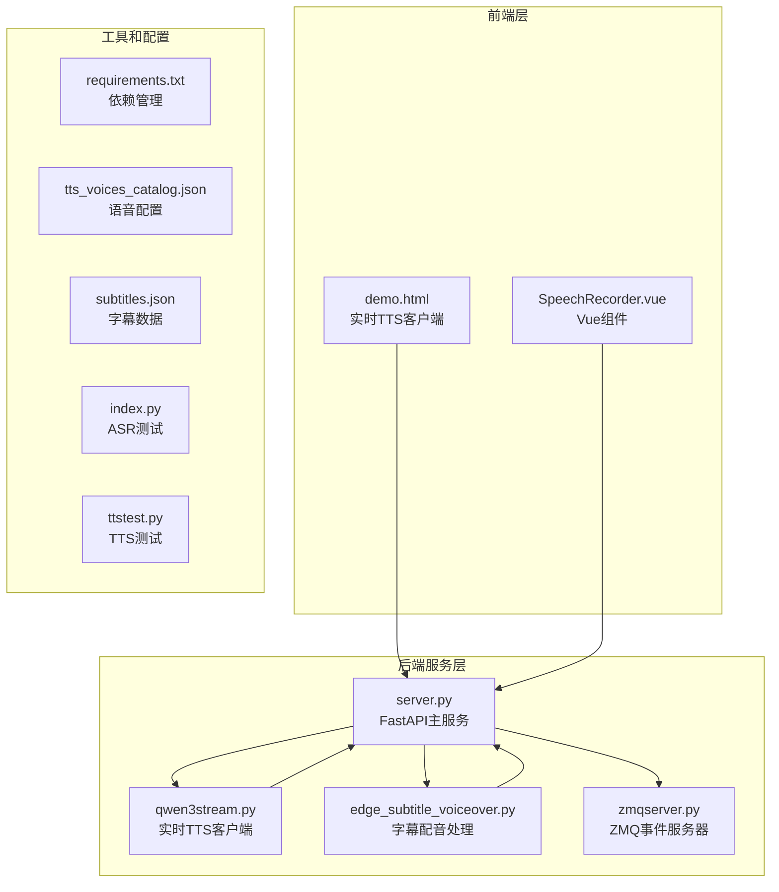
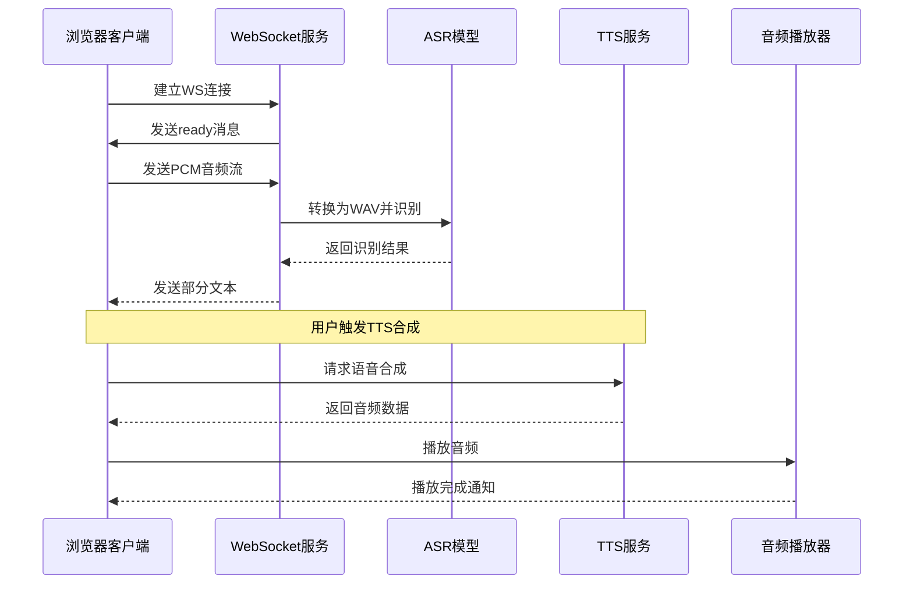
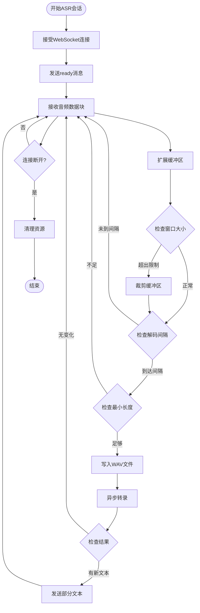
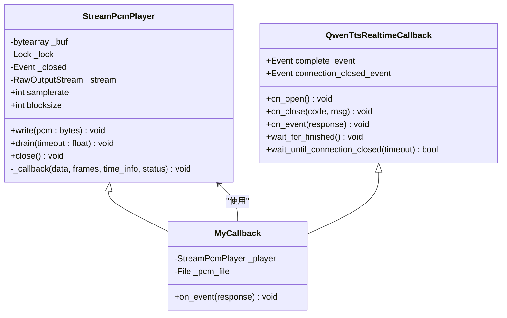
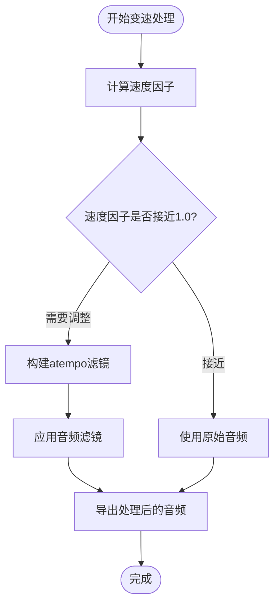
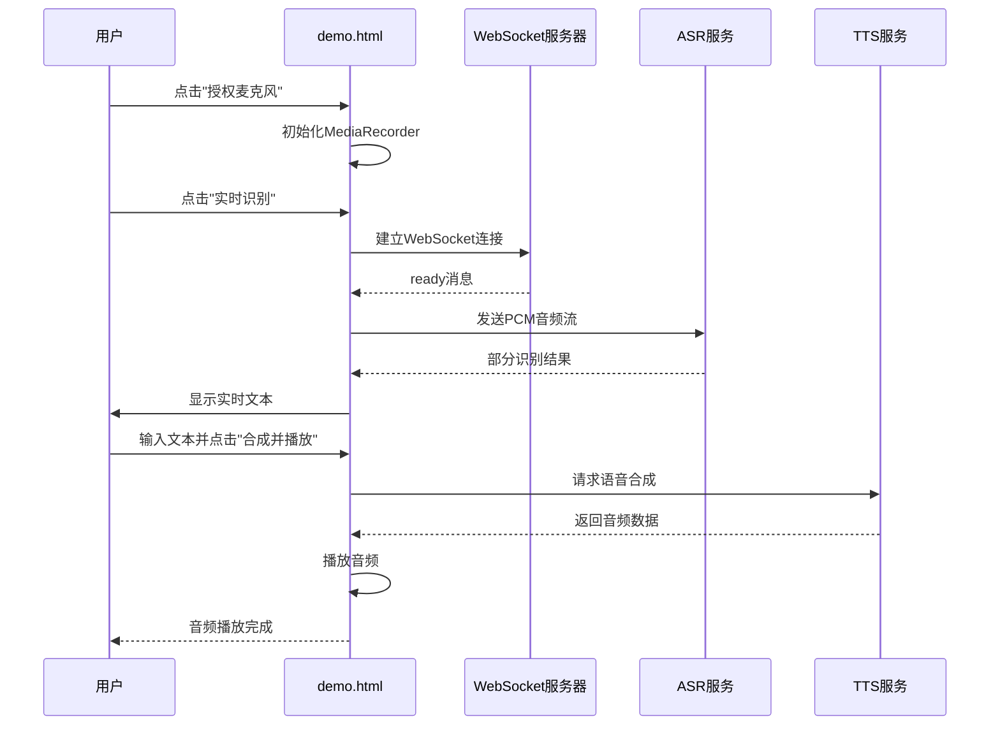
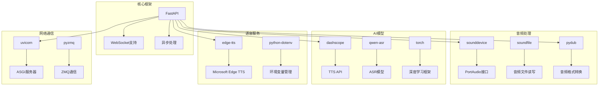

# 实时TTS合成

<cite>
**本文档引用的文件**
- [server.py](file://server.py)
- [qwen3stream.py](file://qwen3stream.py)
- [demo.html](file://demo.html)
- [edge_subtitle_voiceover.py](file://edge_subtitle_voiceover.py)
- [ttstest.py](file://ttstest.py)
- [index.py](file://index.py)
- [requirements.txt](file://requirements.txt)
- [tts_voices_catalog.json](file://tts_voices_catalog.json)
- [subtitles.json](file://subtitles.json)
- [zmqserver.py](file://zmqserver.py)
- [zmqcli.py](file://zmqcli.py)
</cite>

## 目录
1. [简介](#简介)
2. [项目结构](#项目结构)
3. [核心组件](#核心组件)
4. [架构概览](#架构概览)
5. [详细组件分析](#详细组件分析)
6. [依赖关系分析](#依赖关系分析)
7. [性能考虑](#性能考虑)
8. [故障排除指南](#故障排除指南)
9. [结论](#结论)
10. [附录](#附录)

## 简介

本项目是一个完整的实时语音合成（TTS）系统，集成了多种语音处理技术和实时通信能力。系统支持基于WebSocket的实时语音识别和语音合成，提供了从浏览器到服务器的完整端到端解决方案。

主要特性包括：
- 实时语音识别（ASR）通过WebSocket流式传输
- 基于DashScope的高质量TTS语音合成
- 支持多种音频格式和采样率配置
- 流式音频播放和缓冲区管理
- 与ASR系统的协同工作机制
- 完整的客户端集成示例

## 项目结构

项目采用模块化设计，包含多个独立的功能模块：



**图表来源**
- [server.py:1-452](file://server.py#L1-L452)
- [qwen3stream.py:1-196](file://qwen3stream.py#L1-L196)
- [demo.html:1-685](file://demo.html#L1-L685)

**章节来源**
- [server.py:67-76](file://server.py#L67-L76)
- [requirements.txt:1-13](file://requirements.txt#L1-L13)

## 核心组件

### WebSocket实时ASR服务

系统的核心是基于WebSocket的实时语音识别服务，支持流式音频数据传输和实时文本输出。

关键特性：
- **音频格式**：PCM16LE单声道，采样率16kHz
- **缓冲区管理**：动态窗口大小控制（最大12秒）
- **解码间隔**：每1.2秒进行一次语音识别
- **流式处理**：实时音频流处理和部分文本输出

### DashScope实时TTS客户端

实现了基于DashScope的实时TTS功能，支持边收边播的音频流处理。

核心组件：
- **音频播放器**：StreamPcmPlayer类负责实时音频播放
- **缓冲区管理**：多线程安全的PCM数据缓冲
- **采样率配置**：24kHz采样率，16位单声道
- **播放控制**：智能的播放停止和尾音处理

### 字幕时间轴配音系统

提供了基于字幕时间轴的自动配音生成功能：

- **时间对齐**：精确的字幕时间戳对齐
- **变速处理**：使用FFmpeg atempo滤镜调整音频速度
- **静音插入**：自动插入字幕间的静音片段
- **MP3导出**：高质量音频文件生成

**章节来源**
- [server.py:124-197](file://server.py#L124-L197)
- [qwen3stream.py:21-81](file://qwen3stream.py#L21-L81)
- [edge_subtitle_voiceover.py:166-223](file://edge_subtitle_voiceover.py#L166-L223)

## 架构概览

系统采用分层架构设计，从前端到后端形成完整的语音处理链路：



**图表来源**
- [server.py:124-197](file://server.py#L124-L197)
- [qwen3stream.py:161-196](file://qwen3stream.py#L161-L196)

## 详细组件分析

### WebSocket实时ASR实现

#### 数据流处理



**图表来源**
- [server.py:155-196](file://server.py#L155-L196)

#### 关键配置参数

| 参数名称 | 默认值 | 说明 |
|---------|--------|------|
| ASR_WS_DECODE_INTERVAL_S | 1.2秒 | 解码间隔时间 |
| ASR_WS_MAX_WINDOW_S | 12秒 | 最大缓冲窗口大小 |
| Sample Rate | 16000 Hz | PCM音频采样率 |
| Bit Depth | 16位 | PCM音频位深度 |
| Channels | 单声道 | 音频通道数 |

**章节来源**
- [server.py:134-152](file://server.py#L134-L152)
- [server.py:167-172](file://server.py#L167-L172)

### 实时TTS播放器实现

#### 音频播放架构



**图表来源**
- [qwen3stream.py:21-81](file://qwen3stream.py#L21-L81)
- [qwen3stream.py:109-155](file://qwen3stream.py#L109-L155)

#### 播放器关键特性

- **多线程安全**：使用锁机制保护共享缓冲区
- **智能缓冲**：动态调整播放缓冲区大小
- **尾音处理**：智能的播放停止和尾音清理
- **回调机制**：PortAudio回调函数高效拉取音频数据

**章节来源**
- [qwen3stream.py:21-81](file://qwen3stream.py#L21-L81)
- [qwen3stream.py:109-155](file://qwen3stream.py#L109-L155)

### 字幕时间轴配音系统

#### 音频变速算法



**图表来源**
- [edge_subtitle_voiceover.py:97-114](file://edge_subtitle_voiceover.py#L97-L114)
- [edge_subtitle_voiceover.py:117-146](file://edge_subtitle_voiceover.py#L117-L146)

#### 时间对齐流程

系统支持精确的时间轴对齐，确保音频与字幕完美同步：

1. **字幕解析**：读取JSON格式的字幕文件
2. **音频生成**：为每个字幕片段生成对应的音频
3. **速度调整**：根据目标时长调整音频播放速度
4. **静音插入**：在相邻字幕间插入适当的静音间隔
5. **最终合并**：将所有音频片段合并为连续的音频流

**章节来源**
- [edge_subtitle_voiceover.py:166-223](file://edge_subtitle_voiceover.py#L166-L223)
- [subtitles.json:1-17](file://subtitles.json#L1-L17)

### 客户端集成示例

#### HTML5 WebSocket客户端

浏览器端提供了完整的实时TTS客户端实现：



**图表来源**
- [demo.html:486-564](file://demo.html#L486-L564)
- [demo.html:323-382](file://demo.html#L323-L382)

#### Vue.js组件集成

系统还提供了Vue.js组件版本，便于在Vue应用中集成：

- **响应式数据绑定**：自动更新UI状态
- **生命周期管理**：正确处理组件挂载和卸载
- **错误处理**：完善的异常捕获和用户提示
- **音频控制**：支持播放、暂停、停止等操作

**章节来源**
- [demo.html:1-685](file://demo.html#L1-L685)

## 依赖关系分析

系统依赖关系复杂但组织有序，主要依赖包括：



**图表来源**
- [requirements.txt:1-13](file://requirements.txt#L1-L13)

**章节来源**
- [requirements.txt:1-13](file://requirements.txt#L1-L13)

## 性能考虑

### 实时性能优化策略

#### 缓冲区管理优化

1. **动态窗口调整**：根据网络状况动态调整缓冲区大小
2. **内存使用控制**：限制最大缓冲区大小防止内存溢出
3. **异步处理**：使用异步I/O避免阻塞主线程

#### 音频质量优化

1. **采样率配置**：根据应用场景选择合适的采样率
2. **音频格式选择**：平衡音频质量和传输效率
3. **降噪处理**：内置噪声抑制提高语音质量

#### 网络优化

1. **压缩算法**：使用高效的音频压缩算法
2. **带宽自适应**：根据网络状况调整传输参数
3. **错误恢复**：实现网络中断后的自动重连

### 性能监控指标

系统提供了详细的性能指标监控：

- **首包延迟**：从开始到收到第一个音频包的时间
- **CPU使用率**：音频处理的CPU消耗
- **内存使用**：实时音频缓冲的内存占用
- **网络延迟**：音频数据传输的延迟

## 故障排除指南

### 常见问题及解决方案

#### WebSocket连接问题

**问题**：WebSocket连接失败
**原因**：
- 网络防火墙阻止连接
- 服务器配置错误
- 客户端SSL证书问题

**解决方案**：
1. 检查服务器端口是否开放
2. 验证CORS配置
3. 确认SSL证书有效性

#### 音频播放问题

**问题**：音频播放异常或无声
**原因**：
- 音频设备权限问题
- 音频格式不支持
- 播放器初始化失败

**解决方案**：
1. 检查音频设备权限
2. 验证音频格式兼容性
3. 重新初始化播放器

#### TTS服务问题

**问题**：TTS服务调用失败
**原因**：
- API密钥配置错误
- 网络连接问题
- 服务端错误

**解决方案**：
1. 验证API密钥配置
2. 检查网络连接状态
3. 查看服务端日志

### 调试技巧

#### 日志记录

系统提供了详细的日志记录功能：

```python
# 示例：添加调试日志
import logging
logger = logging.getLogger(__name__)
logger.debug("WebSocket连接建立")
logger.info("音频数据接收完成")
logger.warning("缓冲区接近上限")
logger.error("ASR识别失败")
```

#### 性能分析

使用Python内置的性能分析工具：

```bash
# 使用cProfile分析性能
python -m cProfile -o profile_stats server.py

# 分析结果可视化
snakeviz profile_stats
```

#### 网络诊断

使用网络诊断工具检查连接问题：

```bash
# 检查端口连通性
telnet localhost 8000

# 抓包分析WebSocket通信
wireshark -f "tcp port 8000"
```

**章节来源**
- [server.py:189-190](file://server.py#L189-L190)
- [qwen3stream.py:153-155](file://qwen3stream.py#L153-L155)

## 结论

本实时TTS合成系统提供了完整的端到端解决方案，集成了现代Web技术与AI语音处理能力。系统具有以下优势：

1. **实时性强**：基于WebSocket的流式处理，延迟低
2. **质量高**：支持多种采样率和音频格式，音质优秀
3. **易集成**：提供完整的客户端示例和API接口
4. **可扩展**：模块化设计，易于功能扩展和定制

系统适用于各种实时语音应用场景，包括在线教育、语音助手、实时字幕生成等。通过合理的配置和优化，可以满足不同场景的性能要求。

## 附录

### API参考

#### WebSocket ASR接口

| 接口 | 方法 | 描述 |
|------|------|------|
| `/ws/asr` | WebSocket | 实时语音识别服务 |
| `/tts` | POST | 语音合成服务 |
| `/tts/voices` | GET | 获取可用语音列表 |
| `/tts/edge-voices` | GET | 获取Edge TTS语音列表 |

#### 配置参数

| 参数名 | 类型 | 默认值 | 描述 |
|--------|------|--------|------|
| ASR_WS_DECODE_INTERVAL_S | float | 1.2 | ASR解码间隔（秒） |
| ASR_WS_MAX_WINDOW_S | float | 12.0 | 最大缓冲窗口（秒） |
| DASHSCOPE_API_KEY | string | - | DashScope API密钥 |
| PUBLIC_BASE_URL | string | - | 公共基础URL |

### 安装和部署

#### 环境要求

- Python 3.8+
- CUDA 11.8+ (可选，用于GPU加速)
- FFmpeg (用于音频格式转换)

#### 安装步骤

```bash
# 克隆仓库
git clone https://github.com/your-repo/vue3speech.git
cd vue3speech

# 创建虚拟环境
python -m venv venv
source venv/bin/activate  # Windows: venv\Scripts\activate

# 安装依赖
pip install -r requirements.txt

# 配置环境变量
echo "DASHSCOPE_API_KEY=your_api_key" > .env

# 启动服务
uvicorn server:app --host 0.0.0.0 --port 8000
```