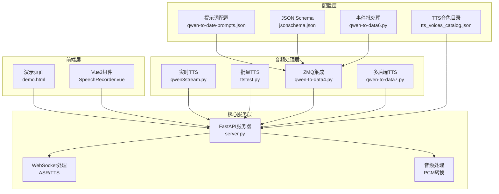
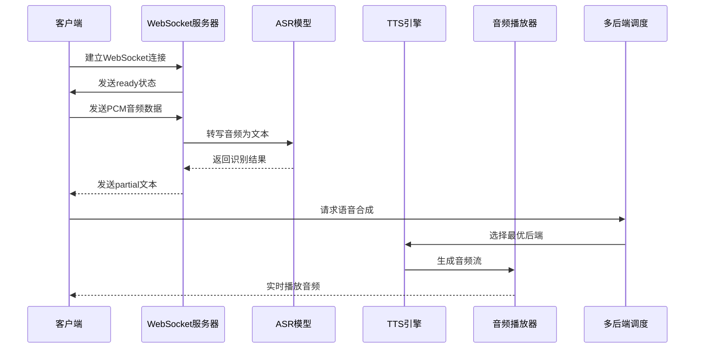
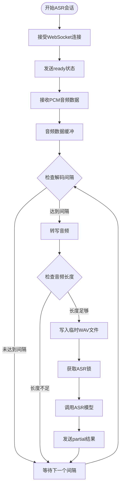
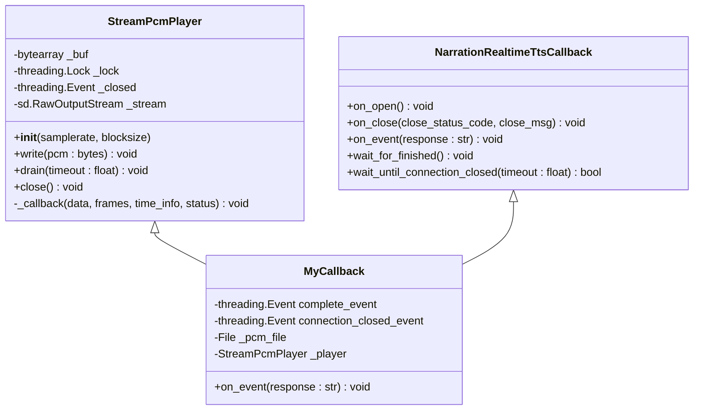
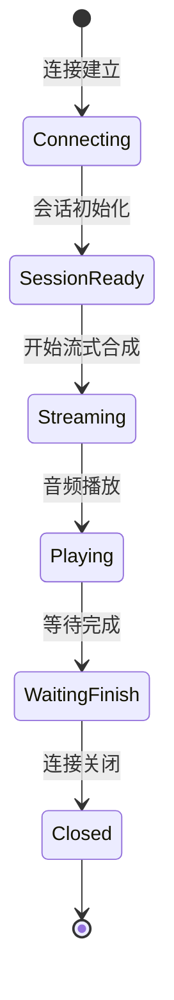
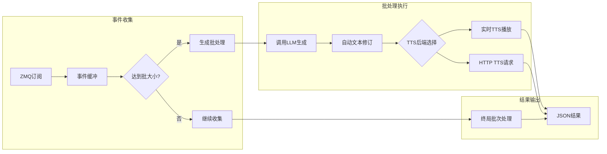
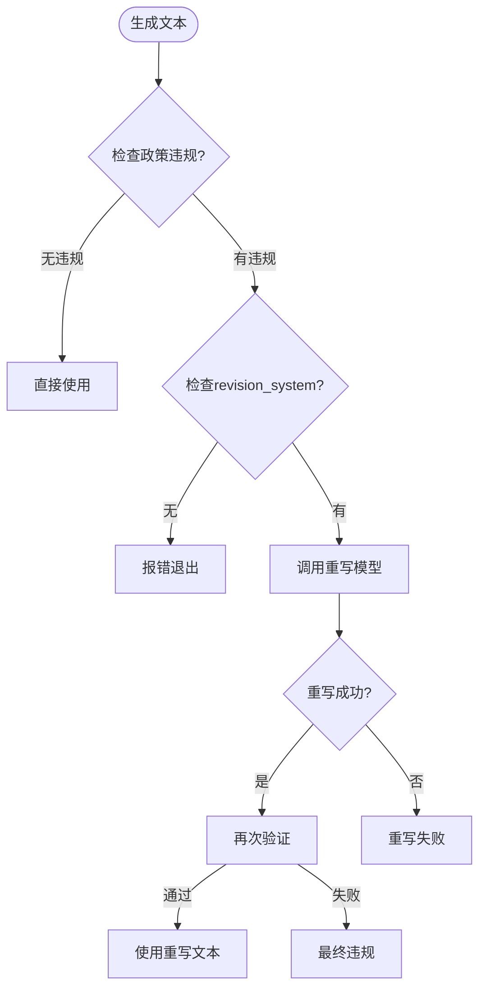
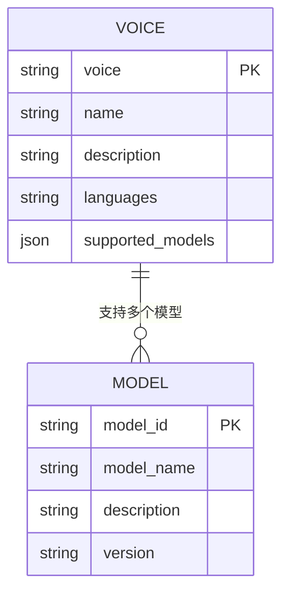
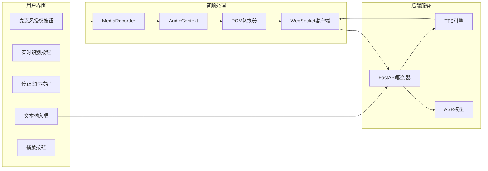
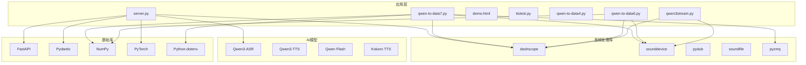

# 实时TTS合成

<cite>
**本文档引用的文件**
- [README.md](file://README.md)
- [server.py](file://server.py)
- [qwen3stream.py](file://qwen3stream.py)
- [demo.html](file://demo.html)
- [ttstest.py](file://ttstest.py)
- [qwen-to-data4.py](file://qwen-to-data4.py)
- [qwen-to-data6.py](file://qwen-to-data6.py)
- [qwen-to-data7.py](file://qwen-to-data7.py)
- [requirements.txt](file://requirements.txt)
- [tts_voices_catalog.json](file://tts_voices_catalog.json)
- [qwen-to-date-prompts.json](file://qwen-to-date-prompts.json)
- [jsonschema.json](file://jsonschema.json)
- [index.py](file://index.py)
- [qwen-flash.json](file://qwen-flash.json)
- [subtitles.json](file://subtitles.json)
- [zmqserver.py](file://zmqserver.py)
</cite>

## 更新摘要
**变更内容**
- 新增多后端TTS支持（实时WebSocket、DashScope HTTP、Kokoro本地TTS）
- 智能回退机制实现（自动检测可用后端）
- 事件批处理功能增强（批量处理ZMQ事件）
- 自动文本修订功能（政策违规自动重写）
- 实时TTS播放器优化（StreamPcmPlayer改进）

## 目录
1. [简介](#简介)
2. [项目结构](#项目结构)
3. [核心组件](#核心组件)
4. [架构概览](#架构概览)
5. [详细组件分析](#详细组件分析)
6. [依赖关系分析](#依赖关系分析)
7. [性能考虑](#性能考虑)
8. [故障排除指南](#故障排除指南)
9. [结论](#结论)
10. [附录](#附录)

## 简介

本项目是一个基于Vue3和FastAPI的实时语音识别与语音合成系统。项目实现了多种音频处理功能，包括：

- **实时语音识别（ASR）**：通过WebSocket实现16kHz单声道PCM音频流的实时识别
- **语音合成（TTS）**：支持HTTP和WebSocket两种实时TTS模式，具备智能多后端支持
- **多语言支持**：提供丰富的音色选择和多语言支持
- **前端集成**：提供完整的Web界面和Vue3组件
- **智能回退机制**：自动检测并选择最优TTS后端
- **事件批处理**：高效处理ZMQ实时事件流
- **自动文本修订**：政策违规自动重写功能

项目的核心特色在于实现了真正的实时TTS合成，支持边收边播的音频流处理，具有低延迟和高质量的特点，并具备智能的多后端支持和自动纠错能力。

## 项目结构



**图表来源**
- [server.py:1-452](file://server.py#L1-L452)
- [demo.html:1-685](file://demo.html#L1-L685)
- [qwen3stream.py:1-196](file://qwen3stream.py#L1-L196)
- [qwen-to-data7.py:1-1506](file://qwen-to-data7.py#L1-L1506)

**章节来源**
- [README.md:1-287](file://README.md#L1-L287)
- [server.py:67-68](file://server.py#L67-L68)

## 核心组件

### 1. FastAPI服务器核心

服务器采用FastAPI框架，提供了完整的RESTful API和WebSocket服务：

- **健康检查接口**：`GET /` - 基础健康检查
- **演示页面**：`GET /demo` - 提供完整的Web界面
- **实时ASR**：`WebSocket /ws/asr` - 实时语音识别
- **TTS服务**：`POST /tts` - 语音合成服务
- **音色查询**：`GET /tts/voices` - 音色列表查询

### 2. 多后端TTS实现

项目实现了三种TTS后端模式：

- **实时WebSocket模式**：DashScope QwenTtsRealtime WebSocket，支持边生成边播放
- **DashScope HTTP模式**：非实时合成，整段返回音频URL
- **Kokoro本地TTS**：本地服务接口，支持自定义音色和语速

### 3. 智能回退机制

系统具备智能的TTS后端选择能力：

- **自动检测**：根据环境自动选择最优后端
- **回退策略**：sounddevice → kokoserver → dashscope
- **手动指定**：支持命令行参数强制指定后端

### 4. 事件批处理系统

- **ZMQ实时订阅**：支持实时事件流处理
- **批量处理**：按配置大小批量处理事件
- **终局批次**：支持未满批次的特殊处理

### 5. 自动文本修订

- **政策违规检测**：自动检测禁用词汇和正则表达式
- **自动重写**：使用专用提示词自动重写违规内容
- **质量保证**：重写后再次检测确保合规

**章节来源**
- [server.py:124-197](file://server.py#L124-L197)
- [qwen3stream.py:21-81](file://qwen3stream.py#L21-L81)
- [qwen-to-data7.py:1227-1288](file://qwen-to-data7.py#L1227-L1288)

## 架构概览



**图表来源**
- [server.py:124-197](file://server.py#L124-L197)
- [qwen3stream.py:109-156](file://qwen3stream.py#L109-L156)
- [qwen-to-data7.py:1227-1288](file://qwen-to-data7.py#L1227-L1288)

## 详细组件分析

### WebSocket实时ASR组件

#### 实现原理

实时ASR通过WebSocket实现音频流的实时传输和处理：



**图表来源**
- [server.py:155-196](file://server.py#L155-L196)

#### 关键配置参数

| 参数名称 | 默认值 | 说明 |
|---------|--------|------|
| ASR_WS_DECODE_INTERVAL_S | 1.2秒 | 解码间隔时间 |
| ASR_WS_MAX_WINDOW_S | 12秒 | 最大音频窗口大小 |
| sample_rate | 16000Hz | 采样率 |
| channels | 1 | 单声道 |

#### 缓冲区管理策略

- **滑动窗口**：维护固定大小的音频缓冲区
- **动态调整**：根据音频长度动态调整处理频率
- **内存优化**：使用临时文件避免内存溢出

**章节来源**
- [server.py:134-196](file://server.py#L134-L196)

### 实时TTS播放组件

#### PCM16LE音频格式处理

实时TTS播放器实现了高效的PCM16LE音频格式处理：



**图表来源**
- [qwen3stream.py:21-81](file://qwen3stream.py#L21-L81)
- [qwen3stream.py:109-156](file://qwen3stream.py#L109-L156)

#### 音频播放优化

- **边收边播**：实时音频数据边接收边播放
- **缓冲区管理**：使用线程安全的字节数组缓冲
- **尾音处理**：智能的音频尾音处理和清理

#### 关键参数配置

| 参数名称 | 默认值 | 说明 |
|---------|--------|------|
| STREAM_SAMPLE_RATE | 24000Hz | 播放采样率 |
| DRAIN_IDLE_SEC | 0.35秒 | 清空等待时间 |
| TAIL_PLAYBACK_SEC | 0.55秒 | 尾音播放时间 |
| blocksize | 2048 | 块大小 |

**章节来源**
- [qwen3stream.py:12-19](file://qwen3stream.py#L12-L19)
- [qwen3stream.py:21-81](file://qwen3stream.py#L21-L81)

### 多后端TTS管理系统

#### 后端选择策略

系统支持三种TTS后端，具备智能选择和回退机制：


**图表来源**
- [qwen-to-data7.py:1227-1288](file://qwen-to-data7.py#L1227-L1288)

#### 后端特性对比

| 后端类型 | 实时性 | 音质 | 配置复杂度 | 适用场景 |
|----------|--------|------|------------|----------|
| 实时WebSocket | ✅ 高 | 高 | 中等 | 低延迟实时播报 |
| DashScope HTTP | ❌ 低 | 高 | 低 | 批量合成 |
| Kokoro本地 | ❌ 低 | 高 | 中等 | 本地部署场景 |

#### 实时TTS回调处理



**图表来源**
- [qwen-to-data7.py:780-847](file://qwen-to-data7.py#L780-L847)

#### 关键参数配置

| 参数名称 | 默认值 | 说明 |
|---------|--------|------|
| QWEN_REALTIME_TTS_WAIT | 20秒 | 实时TTS等待完成时间 |
| QWEN_TTS_BACKEND | auto | TTS后端选择策略 |
| KOKORO_TTS_URL | http://localhost:8000 | Kokoro服务地址 |
| KOKORO_VOICE | zm_yunxia | Kokoro默认音色 |
| KOKORO_SPEED | 1.0 | Kokoro默认语速 |

**章节来源**
- [qwen-to-data7.py:1143-1183](file://qwen-to-data7.py#L1143-L1183)
- [qwen-to-data7.py:1227-1288](file://qwen-to-data7.py#L1227-L1288)

### 事件批处理系统

#### 批处理流程

系统支持ZMQ实时事件流的高效批处理：



**图表来源**
- [qwen-to-data7.py:1307-1391](file://qwen-to-data7.py#L1307-L1391)

#### 批处理配置

| 参数名称 | 默认值 | 说明 |
|---------|--------|------|
| QWEN_EVENTS_BATCH | 10 | 每批事件数量 |
| ZMQ_ENDPOINT | tcp://192.168.31.145:5557 | ZMQ服务地址 |
| ZMQ_TOPIC | hado.event | 订阅主题 |

#### 自动文本修订机制



**图表来源**
- [qwen-to-data7.py:246-272](file://qwen-to-data7.py#L246-L272)

**章节来源**
- [qwen-to-data7.py:89-91](file://qwen-to-data7.py#L89-L91)
- [qwen-to-data7.py:1307-1391](file://qwen-to-data7.py#L1307-L1391)

### TTS音色管理系统

#### 音色目录结构

系统支持丰富的音色选择，每个音色都有详细的信息：



**图表来源**
- [tts_voices_catalog.json:1-54](file://tts_voices_catalog.json#L1-L54)

#### 音色特性

| 音色 | 性别 | 语言支持 | 特殊描述 |
|------|------|----------|----------|
| Cherry | 女性 | 中文、英语、多语言 | 阳光积极、亲切自然 |
| Ethan | 男性 | 中文、英语、多语言 | 标准普通话，带北方口音 |
| Serena | 女性 | 中文、英语、多语言 | 温柔小姐姐 |
| Vivian | 女性 | 中文、英语、多语言 | 撩人小暴躁 |

**章节来源**
- [tts_voices_catalog.json:3-53](file://tts_voices_catalog.json#L3-L53)

### 前端集成组件

#### 演示页面功能

前端演示页面提供了完整的实时语音处理体验：



**图表来源**
- [demo.html:486-564](file://demo.html#L486-L564)

#### 关键功能特性

- **实时音频录制**：支持多种音频格式录制
- **音频格式转换**：自动进行采样率转换和格式适配
- **WebSocket通信**：实现低延迟的音频流传输
- **实时播放**：支持音频的实时播放和控制

**章节来源**
- [demo.html:248-685](file://demo.html#L248-L685)

## 依赖关系分析

### 核心依赖关系



**图表来源**
- [requirements.txt:1-13](file://requirements.txt#L1-L13)
- [server.py:13-31](file://server.py#L13-L31)

### 环境配置依赖

| 依赖项 | 版本要求 | 用途 |
|--------|----------|------|
| fastapi | 最新稳定版 | Web框架 |
| dashscope | 最新版本 | 语音合成API |
| sounddevice | 0.4.6+ | 实时音频播放 |
| torch | 2.0+ | AI模型推理 |
| qwen-asr | 最新版本 | 语音识别模型 |
| pydub | 最新版本 | 音频格式转换 |
| python-dotenv | 最新版本 | 环境变量管理 |
| pyzmq | 最新版本 | ZMQ事件订阅 |

**章节来源**
- [requirements.txt:1-13](file://requirements.txt#L1-L13)
- [server.py:33-43](file://server.py#L33-L43)

## 性能考虑

### 实时性能优化策略

#### 1. 缓冲区管理优化

- **动态缓冲区大小**：根据音频长度动态调整缓冲区大小
- **内存池管理**：使用临时文件避免内存溢出
- **异步处理**：使用异步I/O提高处理效率

#### 2. 采样率优化

- **多采样率支持**：支持16kHz和24kHz两种采样率
- **智能转换**：根据需求自动进行采样率转换
- **质量保持**：确保音频质量不受影响

#### 3. 网络传输优化

- **WebSocket优化**：使用二进制帧传输音频数据
- **压缩算法**：减少网络带宽占用
- **错误恢复**：实现网络异常的自动恢复机制

#### 4. 多后端性能优化

- **实时后端优先**：优先使用实时WebSocket减少延迟
- **HTTP后端缓存**：对常用文本进行缓存
- **本地后端优化**：优化本地服务的响应时间

### 性能调优参数

| 参数 | 优化目标 | 调整建议 |
|------|----------|----------|
| ASR_WS_DECODE_INTERVAL_S | 降低延迟 | 0.8-1.5秒 |
| ASR_WS_MAX_WINDOW_S | 控制内存使用 | 6-18秒 |
| STREAM_SAMPLE_RATE | 音质平衡 | 16000-24000Hz |
| blocksize | 实时性 | 1024-4096字节 |
| QWEN_REALTIME_TTS_WAIT | 实时性 | 10-30秒 |
| QWEN_EVENTS_BATCH | 吞吐量 | 5-20条 |

### 内存和CPU优化

- **GPU加速**：优先使用CUDA设备进行AI推理
- **批处理优化**：合理设置批处理大小
- **资源监控**：实时监控系统资源使用情况
- **后端选择优化**：根据硬件条件选择最优后端

## 故障排除指南

### 常见问题及解决方案

#### 1. WebSocket连接问题

**问题现象**：WebSocket连接失败或频繁断开

**解决方案**：
- 检查网络连接稳定性
- 验证防火墙设置
- 调整超时参数

#### 2. 音频播放问题

**问题现象**：音频播放卡顿或无声

**解决方案**：
- 检查音频设备权限
- 验证音频格式兼容性
- 调整缓冲区大小

#### 3. TTS合成问题

**问题现象**：TTS合成失败或质量不佳

**解决方案**：
- 验证API密钥配置
- 检查网络连接
- 调整音色参数
- 检查后端可用性

#### 4. 多后端选择问题

**问题现象**：后端选择不符合预期

**解决方案**：
- 检查环境变量配置
- 验证后端服务可用性
- 使用--tts-backend手动指定

### 调试技巧

#### 1. 日志分析

- **服务器日志**：查看FastAPI服务器的详细日志
- **音频日志**：记录音频处理过程中的关键信息
- **WebSocket日志**：监控WebSocket连接状态
- **后端日志**：监控各后端的性能指标

#### 2. 性能监控

- **内存使用**：监控内存使用情况，避免内存泄漏
- **CPU使用率**：监控CPU使用率，优化处理逻辑
- **网络延迟**：测量网络延迟，优化传输策略
- **TTS延迟**：测量从事件到音频播放的端到端延迟

#### 3. 音频质量测试

- **采样率测试**：验证不同采样率下的音频质量
- **延迟测试**：测量端到端延迟
- **并发测试**：测试多用户并发场景
- **回退测试**：测试不同后端的切换

**章节来源**
- [README.md:194-204](file://README.md#L194-L204)

## 结论

本项目提供了一个完整的实时语音识别和语音合成解决方案，具有以下特点：

1. **高性能实时处理**：通过WebSocket实现低延迟的音频流处理
2. **多格式支持**：支持多种音频格式和音色选择
3. **智能多后端支持**：自动检测并选择最优TTS后端
4. **灵活的架构设计**：模块化设计便于扩展和维护
5. **完善的前端集成**：提供完整的Web界面和Vue3组件
6. **自动文本修订**：具备政策违规自动检测和重写能力
7. **事件批处理**：高效处理实时事件流

项目的核心优势在于其实时性和高质量的音频处理能力，以及智能的多后端支持和自动纠错机制，适用于各种实时语音应用场景。通过合理的性能调优和错误处理机制，可以满足生产环境的严格要求。

## 附录

### 客户端集成示例

#### 1. 基础WebSocket连接

```javascript
// 建立WebSocket连接
const ws = new WebSocket('ws://localhost:8000/ws/asr');
ws.binaryType = 'arraybuffer';

ws.onopen = () => {
    console.log('连接已建立');
};

ws.onmessage = (event) => {
    const message = JSON.parse(event.data);
    if (message.type === 'ready') {
        // 准备发送音频数据
        startAudioCapture();
    }
};
```

#### 2. 实时音频播放

```javascript
// 实时播放音频
const audioContext = new (window.AudioContext || window.webkitAudioContext)();
const audioElement = new Audio();

// 创建音频节点
const source = audioContext.createMediaStreamSource(stream);
const processor = audioContext.createScriptProcessor(4096, 1, 1);

processor.onaudioprocess = (e) => {
    const channelData = e.inputBuffer.getChannelData(0);
    // 处理音频数据
    const pcmData = convertToPCM(channelData);
    ws.send(pcmData);
};
```

#### 3. TTS集成

```javascript
// TTS语音合成
async function synthesizeSpeech(text, voice) {
    const response = await fetch('/tts', {
        method: 'POST',
        headers: {
            'Content-Type': 'application/json',
        },
        body: JSON.stringify({
            text: text,
            voice: voice
        })
    });
    
    const data = await response.json();
    if (data.output?.audio?.url) {
        audioElement.src = data.output.audio.url;
        audioElement.play();
    }
}
```

### 配置文件说明

#### 1. 环境变量配置

```env
# DashScope API配置
DASHSCOPE_API_KEY=your_api_key_here

# 服务器配置
UVICORN_HOST=0.0.0.0
UVICORN_PORT=8000
UVICORN_LOG_LEVEL=info

# ASR WebSocket配置
ASR_WS_DECODE_INTERVAL_S=1.2
ASR_WS_MAX_WINDOW_S=12

# FFmpeg配置
FFMPEG_PATH=C:/ffmpeg/bin/ffmpeg.exe

# TTS后端配置
QWEN_TTS_BACKEND=auto
QWEN_REALTIME_TTS_WAIT=20
KOKORO_TTS_URL=http://localhost:8000
KOKORO_VOICE=zm_yunxia
KOKORO_SPEED=1.0
```

#### 2. 音色配置

```json
{
    "version": "2026-01",
    "voices": [
        {
            "voice": "Cherry",
            "name": "芊悦",
            "description": "阳光积极、亲切自然小姐姐",
            "languages": "中文（普通话）、英语、法语、德语、俄语、意大利语、西班牙语、葡萄牙语、日语、韩语",
            "supported_models": {
                "qwen3_tts_flash": ["qwen3-tts-flash"]
            }
        }
    ]
}
```

#### 3. 提示词配置

```json
{
    "system": "你是一个专业的体育赛事解说员，擅长用生动的语言描述比赛场景。",
    "user_note": "请生成简短有力的现场解说，适合实时播报。",
    "forbidden_substrings": ["垃圾", "废物", "笨蛋"],
    "forbidden_regexes": ["\\d+分钟"],
    "final_only_substrings": ["最终比分"],
    "revision_system": "请将违规内容重写为积极正面的表达，保持原意但更加专业。"
}
```

### API参考

#### 1. WebSocket接口

| 接口 | 方法 | 描述 |
|------|------|------|
| `/ws/asr` | WebSocket | 实时语音识别 |
| `/ws/tts` | WebSocket | 实时语音合成 |

#### 2. HTTP接口

| 接口 | 方法 | 描述 |
|------|------|------|
| `/` | GET | 健康检查 |
| `/demo` | GET | 演示页面 |
| `/transcribe` | POST | 音频转写 |
| `/tts` | POST | 语音合成 |
| `/tts/voices` | GET | 音色列表 |

#### 3. 命令行参数

| 参数 | 类型 | 默认值 | 描述 |
|------|------|--------|------|
| `--input` | Path | None | 输入JSONL文件路径 |
| `--batch-size` | int | 10 | 每批事件数量 |
| `--tts-backend` | str | auto | TTS后端选择 |
| `--voice` | str | Ethan | TTS音色 |
| `--tts-instruction` | str | 比赛解说语气 | 实时TTS指令 |
| `--realtime-tts-finish-wait` | float | 20.0 | 实时TTS等待时间 |
| `--no-audio` | flag | False | 禁用音频输出 |
| `--kokoro-url` | str | http://localhost:8000 | Kokoro服务地址 |
| `--kokoro-voice` | str | zm_yunxia | Kokoro音色 |
| `--kokoro-speed` | float | 1.0 | Kokoro语速 |