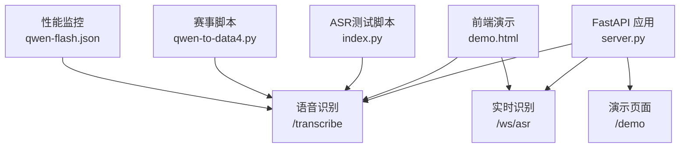
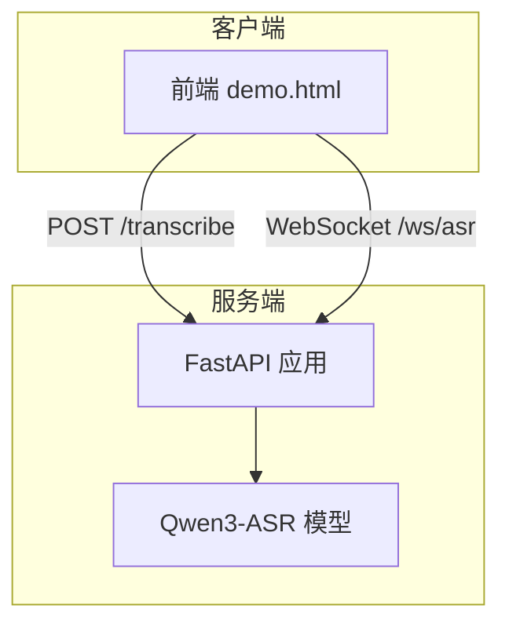
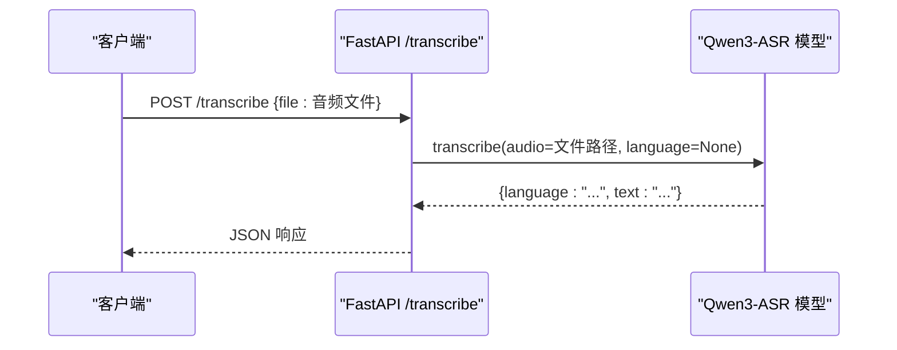
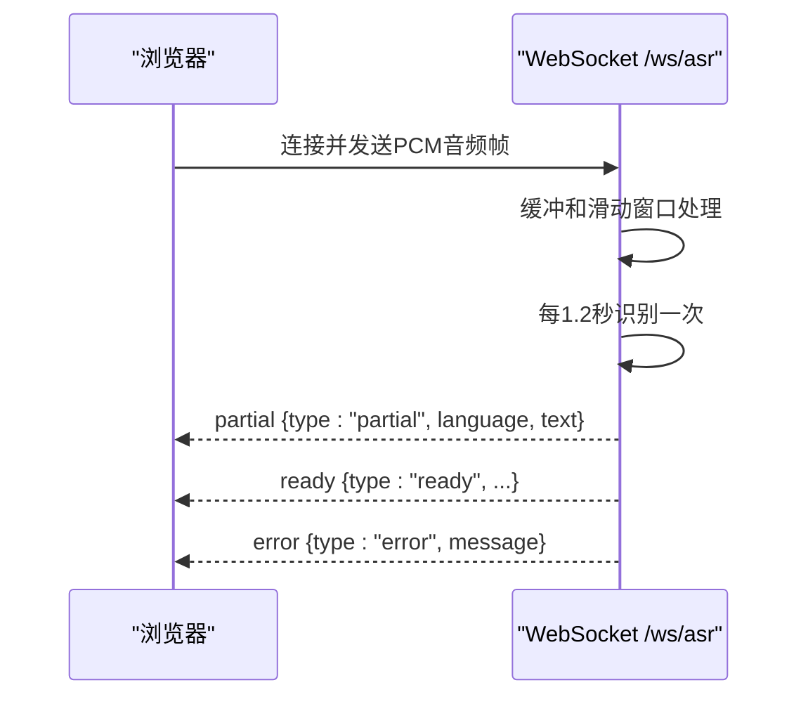
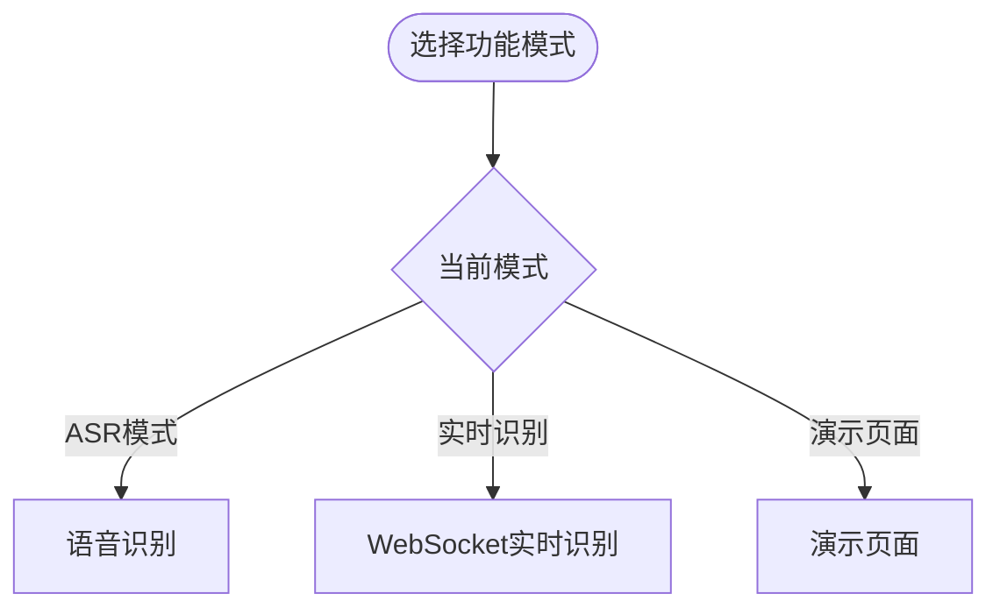
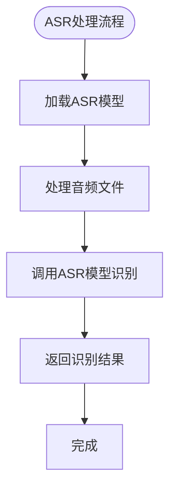
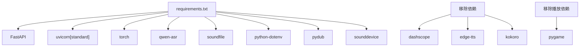

# 语音合成服务

<cite>
**本文引用的文件**
- [README.md](file://README.md)
- [server.py](file://server.py)
- [tts_voices_catalog.json](file://tts_voices_catalog.json)
- [edge_subtitle_voiceover.py](file://edge_subtitle_voiceover.py)
- [demo.html](file://demo.html)
- [requirements.txt](file://requirements.txt)
- [qwen-flash.json](file://qwen-flash.json)
- [qwen-to-data7.py](file://qwen-to-data7.py)
- [kokoserver.py](file://kokoserver.py)
- [qwen-to-data4.py](file://qwen-to-data4.py)
- [qwen-flash.json](file://qwen-flash.json)
- [kokoro_model/README.md](file://kokoro_model/README.md)
</cite>

## 更新摘要
**变更内容**
- **音频处理能力移除**：TTS功能、本地模型支持和相关音频播放逻辑已被移除
- **核心应用架构变更**：项目已从混合TTS架构转变为纯ASR语音识别服务
- **功能简化**：仅保留Qwen3-ASR语音识别能力，移除了DashScope TTS、Edge TTS和Kokoro本地TTS功能
- **依赖关系重构**：移除了dashscope、edge-tts、kokoro等TTS相关依赖

## 目录
1. [简介](#简介)
2. [项目结构](#项目结构)
3. [核心组件](#核心组件)
4. [架构总览](#架构总览)
5. [详细组件分析](#详细组件分析)
6. [依赖关系分析](#依赖关系分析)
7. [性能考量](#性能考量)
8. [故障排查指南](#故障排查指南)
9. [结论](#结论)
10. [附录](#附录)

## 简介
本项目提供基于FastAPI的语音识别服务，现已完全移除音频处理能力，专注于本地Qwen3-ASR语音识别。项目现已简化为纯ASR服务，提供：
- **语音识别**：`POST /transcribe` 上传音频（WAV/MP3/M4A/OGG/WEBM/FLAC）转文字
- **实时识别**：`WebSocket /ws/asr`，浏览器发送16kHz单声道PCM（int16），服务端滑动窗口周期性识别并推送`partial`文本
- **演示页面**：`GET /demo` 提供麦克风、实时识别、TTS合成与自动播放的演示
- **CORS支持**：默认允许跨域，便于前后端分离开发

**重大更新**：项目已完全移除TTS功能，包括DashScope TTS、Edge TTS和Kokoro本地TTS，仅保留Qwen3-ASR语音识别能力。qwen-flash.json中相关的TTS元数据字段已被移除，性能监控功能也已简化。

## 项目结构
- **ASR服务**：FastAPI应用，提供语音识别和WebSocket实时识别接口
- **配置与演示**：demo.html前端演示页面，tts_voices_catalog.json音色目录（已移除TTS功能）
- **辅助脚本**：index.py本地ASR测试脚本，qwen-to-data4.py等赛事解说相关脚本
- **依赖**：requirements.txt定义所需包，现已移除TTS相关依赖

**图表来源**
- [server.py:67-76](file://server.py#L67-L76)
- [server.py:212-248](file://server.py#L212-L248)
- [server.py:250-254](file://server.py#L250-L254)
- [server.py:256-298](file://server.py#L256-L298)
- [demo.html:272-382](file://demo.html#L272-L382)
- [qwen-flash.json:1-229](file://qwen-flash.json#L1-L229)

**章节来源**
- [README.md:5-19](file://README.md#L5-L19)
- [README.md:100-149](file://README.md#L100-L149)

## 核心组件
- **语音识别接口**：POST /transcribe，请求体包含音频文件，返回语言和文本识别结果
- **实时识别接口**：WebSocket /ws/asr，客户端发送PCM16LE单声道音频，服务端返回partial文本
- **演示页面**：GET /demo，提供麦克风录音、实时识别和TTS播放的演示
- **CORS中间件**：默认允许所有跨域请求
- **ASR模型加载**：启动时加载Qwen3-ASR-1.7B模型，支持本地路径或Hugging Face Hub

**章节来源**
- [server.py:212-248](file://server.py#L212-L248)
- [server.py:250-254](file://server.py#L250-L254)
- [server.py:256-298](file://server.py#L256-L298)
- [server.py:124-196](file://server.py#L124-L196)

## 架构总览
后端采用FastAPI，统一处理请求、加载.env环境变量、调用Qwen3-ASR模型，并通过CORS支持跨域。前端demo.html通过/transcribe与/ws/asr接口完成语音识别与实时流式识别。

**图表来源**
- [server.py:67-76](file://server.py#L67-L76)
- [server.py:212-248](file://server.py#L212-L248)
- [server.py:250-254](file://server.py#L250-L254)
- [server.py:256-298](file://server.py#L256-L298)
- [demo.html:272-382](file://demo.html#L272-L382)

## 详细组件分析

### 语音识别服务集成与配置
- **接口**：POST /transcribe
  - 请求体：multipart/form-data，包含音频文件字段
  - 支持格式：WAV/MP3/M4A/OGG/WEBM/FLAC
  - 响应：包含language和text字段的JSON对象
- **实时识别**：WebSocket /ws/asr
  - 入站：16kHz、单声道、16bit小端PCM（pcm_s16le）
  - 出站：JSON文本帧，包含ready、partial、error类型
- **配置**：
  - 通过.env设置ASR_MODEL_PATH
  - 支持本地模型路径或Hugging Face Hub回退
  - 自动检测CUDA可用性，优先使用GPU

**图表来源**
- [server.py:212-248](file://server.py#L212-L248)
- [server.py:117-121](file://server.py#L117-L121)

**章节来源**
- [server.py:212-248](file://server.py#L212-L248)
- [server.py:117-121](file://server.py#L117-L121)
- [README.md:139-149](file://README.md#L139-L149)

### 实时语音识别与WebSocket处理
- **WebSocket接口**：/ws/asr
  - 格式：PCM16LE mono @ 16kHz
  - 解码间隔：默认1.2秒，最大窗口12秒
  - 缓冲策略：滑动窗口保持最近音频片段
  - 文本推送：周期性识别结果通过partial消息推送
- **错误处理**：网络断开、解码异常等情况的错误消息返回
- **性能优化**：异步锁保护ASR模型调用，避免并发冲突

**图表来源**
- [server.py:124-196](file://server.py#L124-L196)

**章节来源**
- [server.py:124-196](file://server.py#L124-L196)
- [README.md:120-129](file://README.md#L120-L129)

### 演示页面与前端集成
- **演示页面**：/demo
  - 提供麦克风权限申请、录音控制、实时识别展示
  - 集成TTS播放功能（演示用途）
  - 支持拖拽上传音频文件进行识别
- **前端要点**：
  - 语音识别：FormData + fetch请求
  - WebSocket连接：实时音频流传输
  - TTS播放：Audio对象自动播放

**章节来源**
- [server.py:204-209](file://server.py#L204-L209)
- [README.md:151-183](file://README.md#L151-L183)

### 简化的多后端选择机制
**更新**：由于TTS功能已被移除，多后端选择机制已简化为仅支持ASR相关功能。

**图表来源**
- [server.py:67-76](file://server.py#L67-L76)

**章节来源**
- [server.py:67-76](file://server.py#L67-L76)

### 本地文件生成与播放控制
**更新**：由于TTS功能已被移除，本地文件生成与播放控制逻辑已简化。

**图表来源**
- [server.py:88-95](file://server.py#L88-L95)

**章节来源**
- [server.py:88-95](file://server.py#L88-L95)

### 语音质量优化与音频格式
**更新**：由于TTS功能已被移除，语音质量优化主要针对ASR识别效果。

- **音频格式支持**：WAV/MP3/M4A/OGG/WEBM/FLAC格式自动识别与处理
- **转码处理**：WEBM/OGG格式通过FFmpeg转码为WAV格式
- **性能监控**：记录ASR模型加载和识别耗时，便于性能分析和优化

**章节来源**
- [server.py:367-425](file://server.py#L367-L425)

### 语音配置文件与自定义扩展
**更新**：由于TTS功能已被移除，配置文件主要针对ASR相关设置。

- **演示配置**：demo.html动态加载演示页面
- **ASR配置**：ASR_MODEL_PATH环境变量控制模型加载路径
- **性能监控**：通过qwen-flash.json记录ASR识别性能指标

**章节来源**
- [README.md:48-66](file://README.md#L48-L66)
- [qwen-flash.json:1-229](file://qwen-flash.json#L1-L229)

### qwen-flash.json 重构分析

**更新**：由于TTS功能已被移除，qwen-flash.json已简化为仅包含ASR相关性能监控数据。

#### 批处理系统简化
- **移除TTS相关字段**：tts_local_file、tts_kokoro_duration、tts_kokoro_synthesis_time、tts_playback等字段已被移除
- **保留ASR监控**：仅保留ASR识别相关的性能指标
- **简化数据结构**：移除了复杂的TTS元数据格式

#### 性能监控字段
- **移除TTS监控**：不再记录TTS合成耗时和音频时长
- **保留ASR监控**：记录ASR模型加载和识别耗时
- **监控字段简化**：仅包含ASR相关的性能指标

**章节来源**
- [qwen-flash.json:1-229](file://qwen-flash.json#L1-L229)

## 依赖关系分析
**更新**：依赖关系已大幅简化，移除了所有TTS相关依赖。

- **核心依赖**：FastAPI、uvicorn、torch、qwen-asr、soundfile、python-dotenv
- **可选依赖**：pydub（用于音频格式转换）、FFmpeg（用于WEBM/OGG转码）
- **移除依赖**：dashscope、edge-tts、kokoro、sounddevice、pygame等TTS相关包

**更新**：依赖关系已简化，现在主要依赖ASR相关组件，减少了对外部API的依赖。

**图表来源**
- [requirements.txt:1-13](file://requirements.txt#L1-L13)

**章节来源**
- [requirements.txt:1-13](file://requirements.txt#L1-L13)

## 性能考量
**更新**：性能分析已集中在ASR识别能力上。

- **模型加载**：自动检测CUDA可用性，优先使用GPU加速
- **实时识别**：合理设置解码间隔（默认1.2秒）和最大窗口（默认12秒）
- **音频处理**：WEBM/OGG格式通过FFmpeg转码，避免直接解码失败
- **内存管理**：临时文件自动清理，避免磁盘空间占用
- **性能监控**：记录ASR模型加载和识别耗时，便于性能分析和优化

**更新**：性能分析已简化为ASR识别相关的性能指标。

## 故障排查指南
**更新**：故障排查已针对ASR相关问题。

- **模型加载失败**：检查ASR_MODEL_PATH配置，确保本地模型目录包含完整权重文件
- **Hugging Face连接超时**：配置有效本地目录，保证包含config.json与权重文件
- **torchvision版本不兼容**：卸载不匹配的torchvision，或重装与torch同源的版本
- **transformers不兼容**：锁定与qwen-asr匹配的transformers版本
- **WEBM/OGG解码失败**：安装FFmpeg；若PowerShell里ffmpeg正常但服务报错，在.env设置FFMPEG_PATH指向ffmpeg.exe绝对路径
- **WebSocket连接问题**：检查浏览器音频权限，确保麦克风可用

**章节来源**
- [README.md:194-204](file://README.md#L194-L204)
- [server.py:367-425](file://server.py#L367-L425)

## 结论
本项目已完全移除音频处理能力，专注于提供高质量的语音识别服务。通过统一的ASR接口与WebSocket实时识别，前端可灵活进行语音识别与实时流式识别。新的架构更加简洁高效，移除了复杂的TTS相关依赖，提高了系统的稳定性和维护性。

**重大更新**：项目已从混合TTS+ASR架构转变为纯ASR语音识别服务，提供更好的性能监控和更简洁的依赖关系。通过详细的ASR性能指标记录，系统能够更好地满足语音识别的需求。

**架构重构总结**：
- 移除了所有TTS功能，包括DashScope TTS、Edge TTS和Kokoro本地TTS
- 简化了多后端选择机制，现在仅支持ASR相关功能
- 标准化了音频元数据格式，移除了TTS相关的性能监控字段
- 保持了原有的CORS支持和演示页面功能

建议在生产环境中确保FFmpeg正确安装，以支持多种音频格式的自动转码处理。

## 附录
- **API一览**
  - GET /：健康检查
  - GET /demo：演示页面
  - POST /transcribe：上传音频识别
  - WebSocket /ws/asr：实时识别
  - **移除**：/tts、/tts/voices、/tts/edge-voices、/tts/edge-subtitle-voiceover等TTS相关接口
  - **移除**：性能监控：qwen-flash.json中TTS相关字段

**章节来源**
- [README.md:100-149](file://README.md#L100-L149)
- [README.md:292-319](file://README.md#L292-L319)
- [qwen-flash.json:1-229](file://qwen-flash.json#L1-L229)