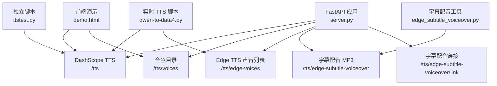
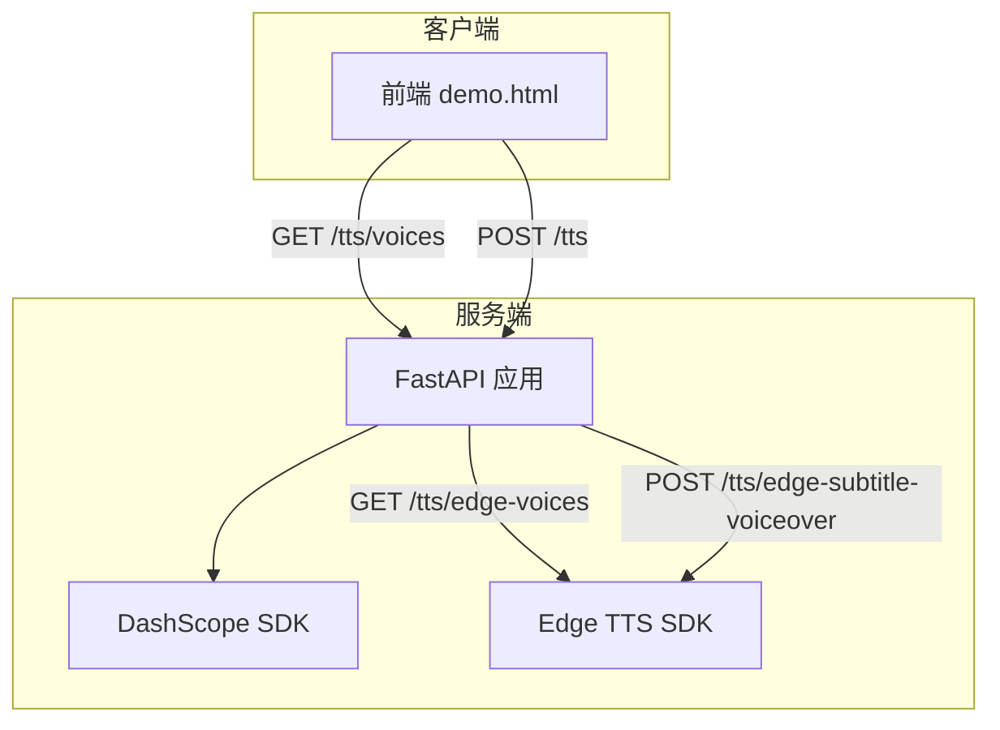
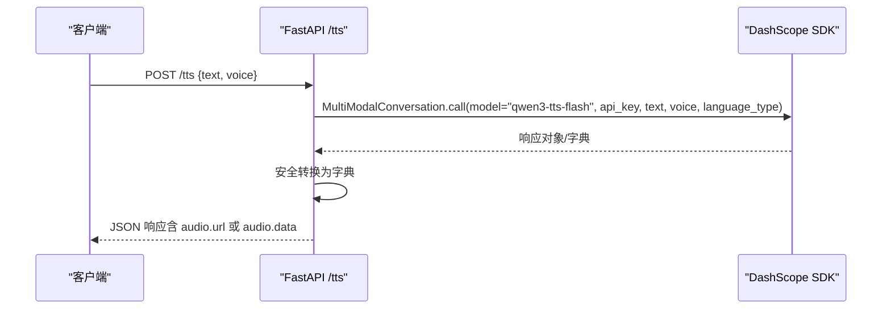
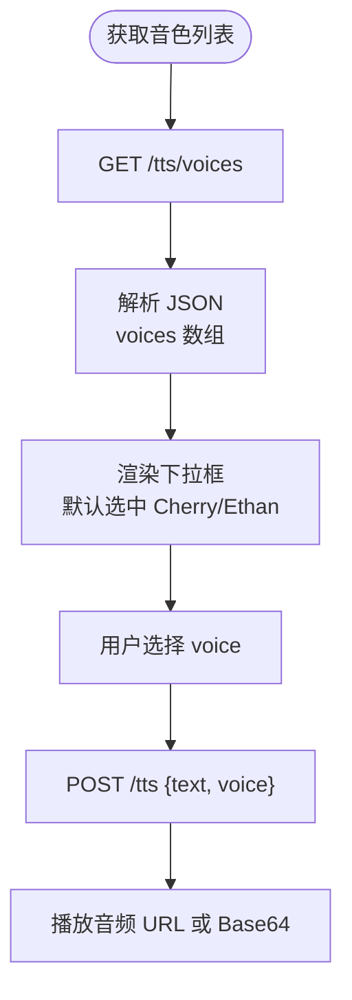
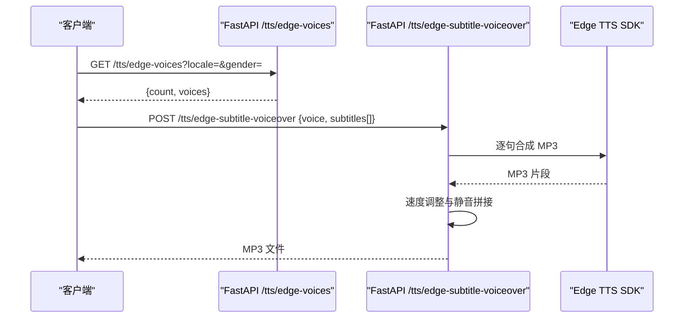
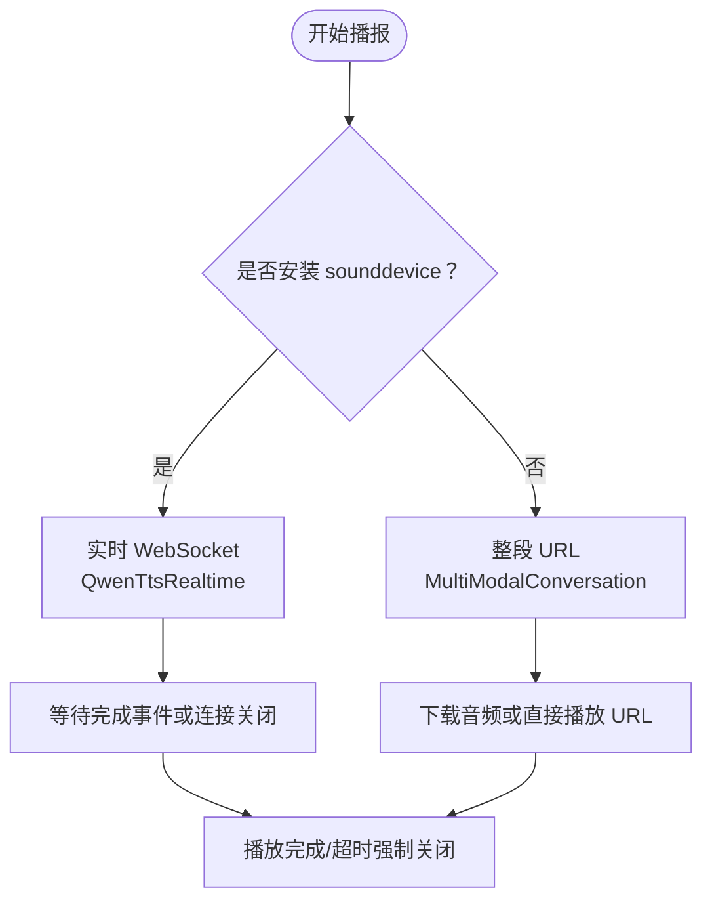
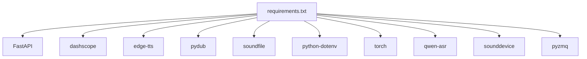

# 语音合成服务

<cite>
**本文引用的文件**
- [README.md](file://README.md)
- [server.py](file://server.py)
- [tts_voices_catalog.json](file://tts_voices_catalog.json)
- [ttstest.py](file://ttstest.py)
- [edge_subtitle_voiceover.py](file://edge_subtitle_voiceover.py)
- [demo.html](file://demo.html)
- [requirements.txt](file://requirements.txt)
- [subtitles.json](file://subtitles.json)
- [qwen-to-data4.py](file://qwen-to-data4.py)
</cite>

## 目录
1. [简介](#简介)
2. [项目结构](#项目结构)
3. [核心组件](#核心组件)
4. [架构总览](#架构总览)
5. [详细组件分析](#详细组件分析)
6. [依赖关系分析](#依赖关系分析)
7. [性能考量](#性能考量)
8. [故障排查指南](#故障排查指南)
9. [结论](#结论)
10. [附录](#附录)

## 简介
本项目提供基于 FastAPI 的语音合成服务，集成了阿里云 DashScope 的 Qwen3 TTS 与 Microsoft Edge TTS，支持：
- 在线 TTS：通过 DashScope qwen3-tts-flash 模型进行文本转语音，返回音频 URL 或 base64 数据。
- 离线字幕配音：基于 Edge TTS，按字幕时间轴生成 MP3，支持变速与静音对齐。
- 实时 TTS：通过 DashScope QwenTtsRealtime WebSocket 实现实时流式播放，或回退为整段 URL 合成。
- 语音选择：统一的音色目录与查询接口，前端演示页面可动态选择音色。

## 项目结构
- 后端服务：FastAPI 应用，提供 /tts、/tts/voices、/tts/edge-voices、/tts/edge-subtitle-voiceover 等接口。
- 配置与演示：tts_voices_catalog.json 音色目录；demo.html 前端演示页面。
- 辅助脚本：ttstest.py DashScope TTS 示例；edge_subtitle_voiceover.py Edge TTS 字幕配音工具；qwen-to-data4.py 赛事解说与实时 TTS 播放。
- 依赖：requirements.txt 定义所需包。

图表来源
- [server.py:212-254](file://server.py#L212-L254)
- [server.py:256-298](file://server.py#L256-L298)
- [server.py:300-361](file://server.py#L300-L361)
- [demo.html:272-382](file://demo.html#L272-L382)
- [ttstest.py:13-26](file://ttstest.py#L13-L26)
- [edge_subtitle_voiceover.py:166-223](file://edge_subtitle_voiceover.py#L166-L223)
- [qwen-to-data4.py:773-847](file://qwen-to-data4.py#L773-L847)

章节来源
- [README.md:5-19](file://README.md#L5-L19)
- [README.md:100-149](file://README.md#L100-L149)

## 核心组件
- DashScope TTS 接口：POST /tts，请求体包含 text、voice 等字段，返回与 dashscope.MultiModalConversation.call 一致的 JSON。
- 音色目录：GET /tts/voices，返回 tts_voices_catalog.json 的内容，包含音色、语言与模型映射。
- Edge TTS 声音列表：GET /tts/edge-voices，按区域与性别过滤返回微软 Edge TTS 支持的声音。
- 字幕配音：POST /tts/edge-subtitle-voiceover 生成 MP3；/tts/edge-subtitle-voiceover/link 返回可访问的音频链接。
- 实时 TTS：qwen-to-data4.py 提供 DashScope QwenTtsRealtime WebSocket 实时播放与整段 URL 回退方案。

章节来源
- [server.py:212-248](file://server.py#L212-L248)
- [server.py:250-254](file://server.py#L250-L254)
- [server.py:256-298](file://server.py#L256-L298)
- [server.py:300-361](file://server.py#L300-L361)
- [qwen-to-data4.py:515-771](file://qwen-to-data4.py#L515-L771)

## 架构总览
后端采用 FastAPI，统一处理请求、加载 .env 环境变量、调用 DashScope 与 Edge TTS，并通过 CORS 支持跨域。前端 demo.html 通过 /tts/voices 与 /tts 接口完成音色选择与 TTS 播放。

图表来源
- [server.py:67-76](file://server.py#L67-L76)
- [server.py:212-248](file://server.py#L212-L248)
- [server.py:256-298](file://server.py#L256-L298)
- [server.py:300-361](file://server.py#L300-L361)
- [demo.html:272-382](file://demo.html#L272-L382)

## 详细组件分析

### DashScope TTS 集成与配置
- 接口：POST /tts
  - 请求体：text（必填）、voice（可选，默认 Ethan）
  - 响应：与 dashscope.MultiModalConversation.call 返回一致，通常包含 output.audio.url 或 output.audio.data
- 配置：
  - 通过 .env 设置 DASHSCOPE_API_KEY
  - 服务端固定使用 qwen3-tts-flash 模型，语言类型 Chinese
- 错误处理：缺失 API Key 返回 400；SDK 异常返回 500；对响应对象安全转换避免 hasattr 导致的异常

图表来源
- [server.py:212-248](file://server.py#L212-L248)
- [ttstest.py:13-26](file://ttstest.py#L13-L26)

章节来源
- [server.py:212-248](file://server.py#L212-L248)
- [ttstest.py:13-26](file://ttstest.py#L13-L26)
- [README.md:139-149](file://README.md#L139-L149)

### 音色目录与选择机制
- 音色目录：GET /tts/voices 返回 tts_voices_catalog.json，包含 version、voices 数组
  - 每个音色项包含 voice、name、description、languages、supported_models
- 前端演示：demo.html 通过 /tts/voices 获取音色列表，渲染选择器并传递 voice 至 /tts

图表来源
- [server.py:250-254](file://server.py#L250-L254)
- [tts_voices_catalog.json:1-54](file://tts_voices_catalog.json#L1-L54)
- [demo.html:272-310](file://demo.html#L272-L310)
- [demo.html:323-382](file://demo.html#L323-L382)

章节来源
- [server.py:250-254](file://server.py#L250-L254)
- [tts_voices_catalog.json:1-54](file://tts_voices_catalog.json#L1-L54)
- [demo.html:272-310](file://demo.html#L272-L310)
- [demo.html:323-382](file://demo.html#L323-L382)

### Edge TTS 集成与字幕配音
- 声音列表：GET /tts/edge-voices 支持按区域（locale）与性别过滤
- 字幕配音：
  - POST /tts/edge-subtitle-voiceover：按字幕时间轴生成 MP3，支持按 end_time 对齐与静音填充
  - POST /tts/edge-subtitle-voiceover/link：生成 MP3 并返回可访问链接与相对路径，文件保存于 edge_voiceover_cache/
- 语音选择：使用 Edge TTS 的 ShortName（如 zh-CN-YunxiNeural）

图表来源
- [server.py:256-298](file://server.py#L256-L298)
- [server.py:300-361](file://server.py#L300-L361)
- [edge_subtitle_voiceover.py:166-223](file://edge_subtitle_voiceover.py#L166-L223)

章节来源
- [server.py:256-298](file://server.py#L256-L298)
- [server.py:300-361](file://server.py#L300-L361)
- [edge_subtitle_voiceover.py:166-223](file://edge_subtitle_voiceover.py#L166-L223)
- [subtitles.json:1-17](file://subtitles.json#L1-L17)

### 实时 TTS 与离线 TTS 方案
- 实时 TTS（WebSocket）：qwen-to-data4.py 使用 QwenTtsRealtime，按文本分块 append，finish 后等待完成事件或连接关闭，支持共享音频输出设备
- 离线 TTS（整段 URL）：当无 sounddevice 时回退为整段 HTTP 合成，返回 audio.url，支持 ffplay/mpv 流式播放或下载后用 pygame 播放
- 两种模式均使用相同的音色参数 voice 与 instruction（实时模式为 session.instructions，URL 回退为 MultiModalConversation 的 instruction）

图表来源
- [qwen-to-data4.py:515-771](file://qwen-to-data4.py#L515-L771)
- [qwen-to-data4.py:381-427](file://qwen-to-data4.py#L381-L427)
- [qwen-to-data4.py:485-513](file://qwen-to-data4.py#L485-L513)

章节来源
- [qwen-to-data4.py:515-771](file://qwen-to-data4.py#L515-L771)
- [qwen-to-data4.py:381-427](file://qwen-to-data4.py#L381-L427)
- [qwen-to-data4.py:485-513](file://qwen-to-data4.py#L485-L513)

### 语音质量优化与音频格式
- 语音质量：通过音色 voice 与 instruction 控制语调与风格；实时模式支持 server_commit 与 PCM 24kHz mono 16bit 输出
- 音频格式转换：字幕配音使用 pydub 与 FFmpeg atempo 实现变速，尽量保持音高；Edge TTS 输出 MP3，最终导出为 MP3
- 播放控制：实时模式使用 sounddevice RawOutputStream 边收边播；URL 模式优先 ffplay/mpv 流式播放，否则下载后 pygame 播放

章节来源
- [edge_subtitle_voiceover.py:104-146](file://edge_subtitle_voiceover.py#L104-L146)
- [qwen-to-data4.py:515-590](file://qwen-to-data4.py#L515-L590)
- [qwen-to-data4.py:429-464](file://qwen-to-data4.py#L429-L464)

### 语音配置文件与自定义扩展
- 音色目录：tts_voices_catalog.json，支持新增音色项与语言/模型映射
- 前端演示：demo.html 动态加载 /tts/voices，渲染音色选择器
- 实时播报：qwen-to-data4.py 支持命令行参数与环境变量（如 QWEN_EVENTS_BATCH、QWEN_REALTIME_TTS_WAIT）控制批大小与等待时长
- Edge 配音：支持自定义 voice（ShortName）与字幕结构（subtitles[]），按 end_time 对齐与静音填充

章节来源
- [tts_voices_catalog.json:1-54](file://tts_voices_catalog.json#L1-L54)
- [demo.html:272-310](file://demo.html#L272-L310)
- [qwen-to-data4.py:819-847](file://qwen-to-data4.py#L819-L847)
- [subtitles.json:1-17](file://subtitles.json#L1-L17)

## 依赖关系分析
- 服务端依赖：FastAPI、dashscope、edge-tts、pydub、soundfile、python-dotenv、torch、qwen-asr 等
- 实时 TTS 依赖：sounddevice（可选，无则回退 URL 模式）
- 字幕配音依赖：pydub、FFmpeg（atempo 变速）

图表来源
- [requirements.txt:1-13](file://requirements.txt#L1-L13)

章节来源
- [requirements.txt:1-13](file://requirements.txt#L1-L13)

## 性能考量
- 实时 TTS：合理设置 finish 等待时长（默认 20 秒），避免服务端不发结束事件导致阻塞；可复用音频输出设备减少开销
- URL 模式：优先使用 ffplay/mpv 流式播放，降低内存占用；无外部播放器时再下载后播放
- 字幕配音：按 end_time 对齐与静音填充，避免过长静音影响体验；变速 atempo 分段叠加，避免极端倍速
- 语音选择：通过 /tts/edge-voices 按区域与性别过滤，减少无效请求

## 故障排查指南
- 缺少 API Key：/tts 返回 400，检查 .env 中 DASHSCOPE_API_KEY
- FFmpeg 未找到：/transcribe 对 webm/ogg 报错，需设置 FFMPEG_PATH 或加入系统 PATH
- 演示页 TTS 无法播放：外链 wav 加载受限，优先使用返回的 url；或扩展后端代理下载
- 实时 TTS 阻塞：finish 后未收到结束事件，强制关闭 WebSocket；可调大等待时长或检查网络
- Edge 配音失败：确认 voice 为 Edge TTS 的 ShortName，确保 FFmpeg 可用

章节来源
- [README.md:194-204](file://README.md#L194-L204)
- [server.py:367-425](file://server.py#L367-L425)
- [qwen-to-data4.py:661-714](file://qwen-to-data4.py#L661-L714)

## 结论
本项目提供了完整的语音合成能力：在线 DashScope TTS、Edge TTS 字幕配音、实时与离线两种播报模式。通过统一的音色目录与查询接口，前端可灵活选择音色；通过 .env 与命令行参数实现配置化管理。建议在生产环境中结合 FFmpeg 与 sounddevice，确保高质量与低延迟的音频处理与播放。

## 附录
- API 一览
  - GET /：健康检查
  - GET /demo：演示页面
  - POST /transcribe：上传音频识别
  - WebSocket /ws/asr：实时识别
  - GET /tts/voices：音色目录
  - POST /tts：DashScope TTS
  - GET /tts/edge-voices：Edge TTS 声音列表
  - POST /tts/edge-subtitle-voiceover：字幕配音 MP3
  - POST /tts/edge-subtitle-voiceover/link：字幕配音链接
  - GET /tts/edge-voiceover-files/{file_id}：获取生成的 MP3

章节来源
- [README.md:100-149](file://README.md#L100-L149)