# 音色管理

<cite>
**本文档引用的文件**
- [server.py](file://server.py)
- [edge_subtitle_voiceover.py](file://edge_subtitle_voiceover.py)
- [tts_voices_catalog.json](file://tts_voices_catalog.json)
- [qwen-flash.json](file://qwen-flash.json)
- [subtitles.json](file://subtitles.json)
- [README.md](file://README.md)
- [requirements.txt](file://requirements.txt)
- [ttstest.py](file://ttstest.py)
- [qwen-to-data4.py](file://qwen-to-data4.py)
- [zmq_events.jsonl](file://zmq_events.jsonl)
</cite>

## 目录
1. [简介](#简介)
2. [项目结构](#项目结构)
3. [核心组件](#核心组件)
4. [架构概览](#架构概览)
5. [详细组件分析](#详细组件分析)
6. [依赖关系分析](#依赖关系分析)
7. [性能考虑](#性能考虑)
8. [故障排除指南](#故障排除指南)
9. [结论](#结论)
10. [附录](#附录)

## 简介

音色管理系统是一个基于Vue3前端和FastAPI后端的语音应用，集成了多种语音合成技术。该系统支持阿里云DashScope音色管理和Microsoft Edge TTS音色管理，提供了完整的音色目录管理、动态更新机制和缓存策略。

系统的核心功能包括：
- DashScope音色目录管理（版本化配置）
- Edge TTS音色查询和管理
- 字幕时间轴配音生成
- 实时语音合成和播放
- 音频缓存和性能优化

## 项目结构

该项目采用模块化设计，主要包含以下核心模块：

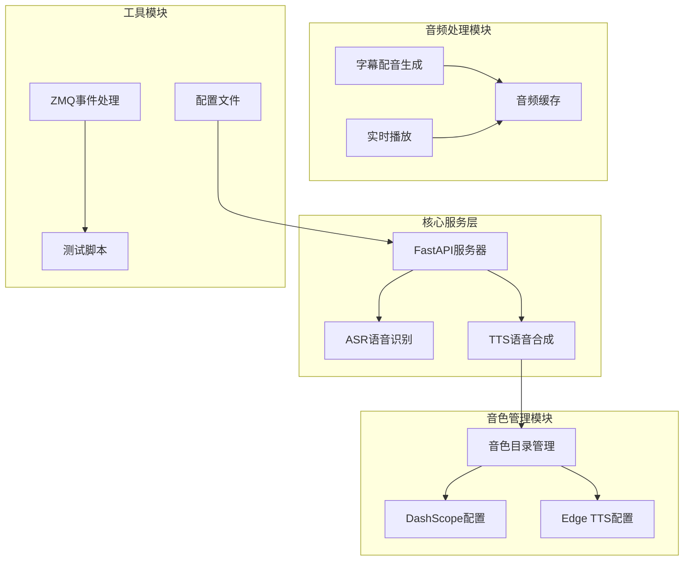

**图表来源**
- [server.py:67-452](file://server.py#L67-L452)
- [edge_subtitle_voiceover.py:1-223](file://edge_subtitle_voiceover.py#L1-L223)

**章节来源**
- [README.md:1-287](file://README.md#L1-L287)
- [requirements.txt:1-13](file://requirements.txt#L1-L13)

## 核心组件

### 音色目录管理系统

音色目录管理系统是整个音色管理的核心，负责维护和管理所有可用的音色配置。

#### 音色目录结构

音色目录采用JSON格式存储，包含版本管理、音色列表和语言支持信息：

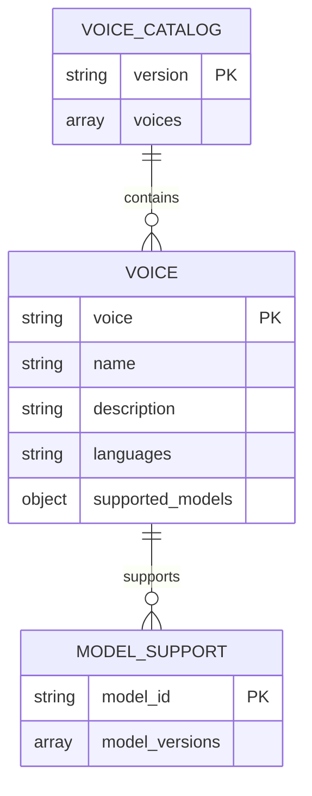

**图表来源**
- [tts_voices_catalog.json:1-54](file://tts_voices_catalog.json#L1-L54)

#### DashScope音色配置

DashScope音色配置支持多种音色类型，包括：
- 标准普通话音色（如Cherry、Serena）
- 地方话音色（如Jada、Dylan、Sunny等）
- 情感表达音色（带特定情感描述）

每个音色配置包含：
- `voice`: 音色标识符
- `name`: 音色显示名称
- `description`: 音色特征描述
- `languages`: 支持的语言列表
- `supported_models`: 支持的模型版本

**章节来源**
- [tts_voices_catalog.json:3-52](file://tts_voices_catalog.json#L3-L52)

### Edge TTS音色管理系统

Edge TTS音色管理系统提供实时音色查询和管理功能：

#### 音色查询接口

系统提供灵活的音色查询接口，支持：
- 按区域过滤（locale参数）
- 按性别过滤（gender参数）
- 实时音色列表获取

#### 音色筛选机制

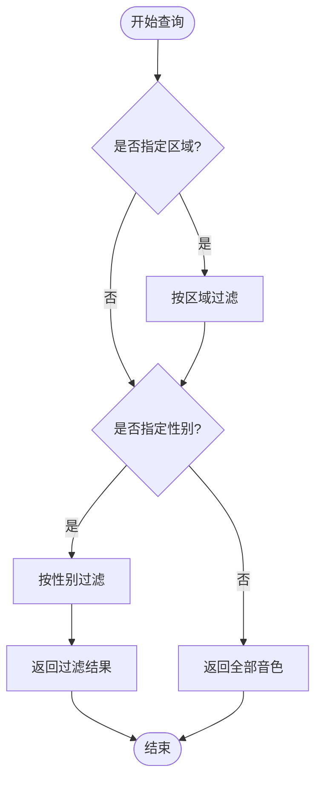

**图表来源**
- [server.py:256-297](file://server.py#L256-L297)

**章节来源**
- [server.py:256-297](file://server.py#L256-L297)

## 架构概览

系统采用分层架构设计，各层职责明确：

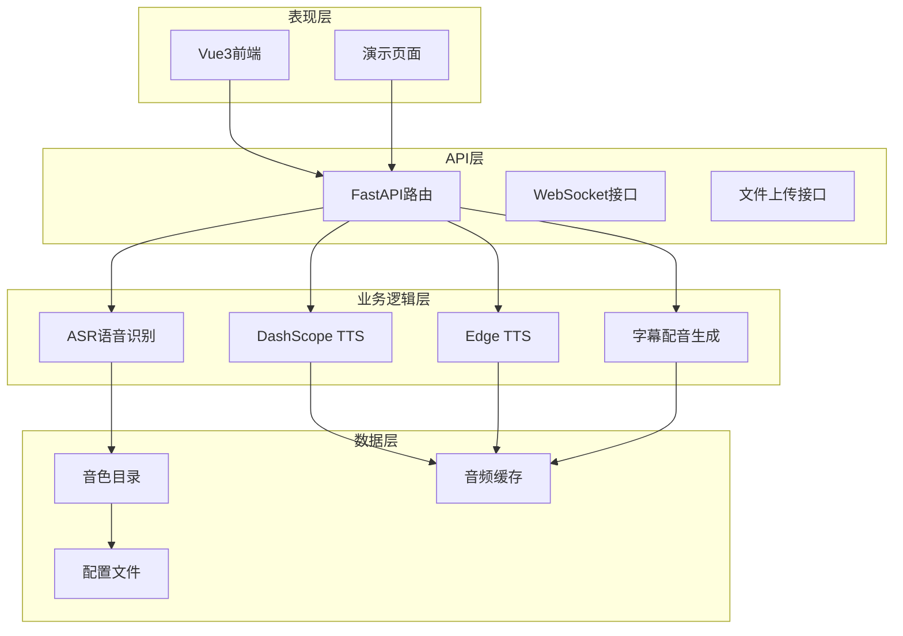

**图表来源**
- [server.py:67-452](file://server.py#L67-L452)
- [edge_subtitle_voiceover.py:166-223](file://edge_subtitle_voiceover.py#L166-L223)

## 详细组件分析

### 音色目录管理组件

#### 版本管理机制

音色目录采用版本化管理，确保配置的稳定性和可追溯性：

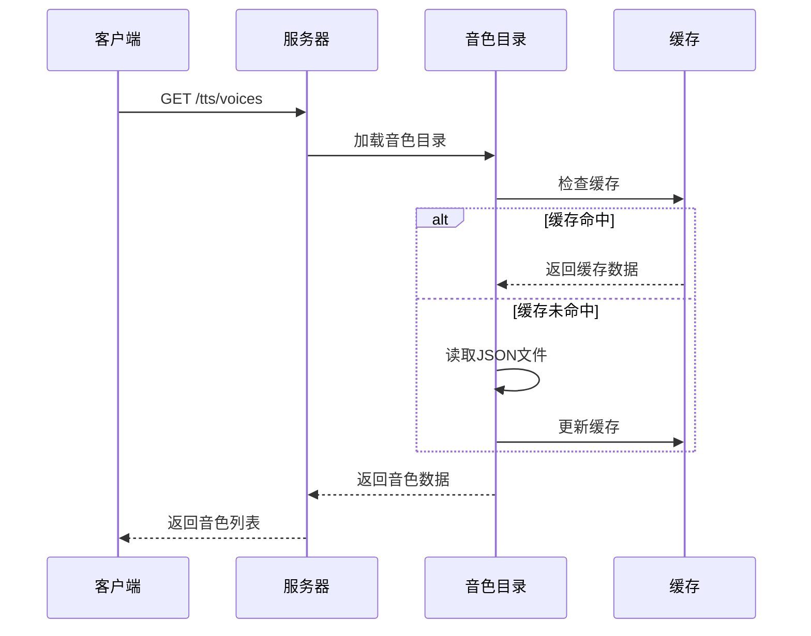

**图表来源**
- [server.py:54-65](file://server.py#L54-L65)
- [server.py:250-253](file://server.py#L250-L253)

#### 音色列表维护

音色列表维护采用声明式配置方式，便于维护和扩展：

**章节来源**
- [tts_voices_catalog.json:1-54](file://tts_voices_catalog.json#L1-L54)

### DashScope音色管理组件

#### 音色配置映射

DashScope音色管理支持多种音色类型和语言支持：

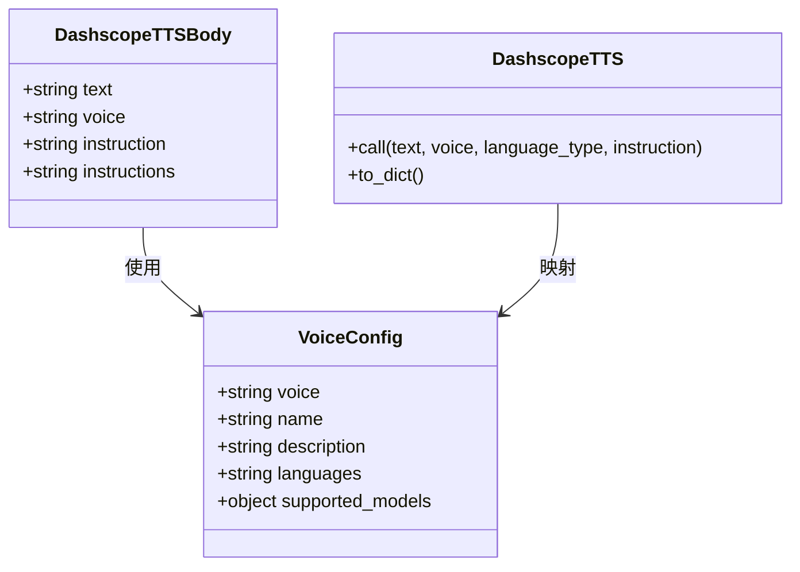

**图表来源**
- [server.py:100-107](file://server.py#L100-L107)
- [ttstest.py:13-26](file://ttstest.py#L13-L26)

#### 语言支持选项

DashScope音色支持多语言，包括：
- 中文（普通话、粤语、四川话等地方话）
- 英语
- 法语、德语、俄语、意大利语、西班牙语、葡萄牙语
- 日语、韩语
- 拉丁美洲西班牙语、法语、德语、意大利语、西班牙语、葡萄牙语

**章节来源**
- [tts_voices_catalog.json:4-52](file://tts_voices_catalog.json#L4-L52)
- [ttstest.py:20-25](file://ttstest.py#L20-L25)

### Edge TTS音色管理组件

#### 音色查询和筛选

Edge TTS音色管理提供强大的音色查询和筛选功能：

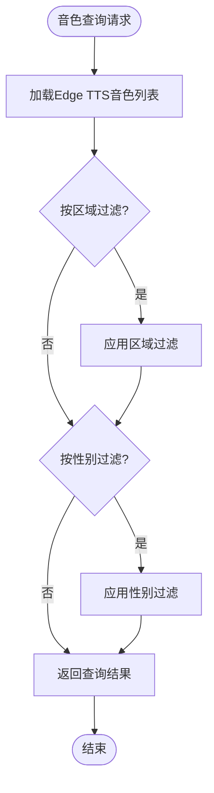

**图表来源**
- [server.py:256-297](file://server.py#L256-L297)

#### 音色名称映射

Edge TTS音色使用ShortName格式，如"zh-CN-YunxiNeural"，系统提供完整的音色名称映射：

**章节来源**
- [server.py:256-297](file://server.py#L256-L297)

### 字幕时间轴配音组件

#### 音频生成流程

字幕时间轴配音组件提供精确的时间轴对齐功能：

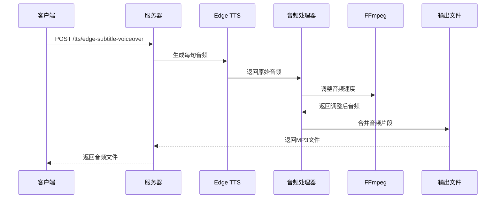

**图表来源**
- [edge_subtitle_voiceover.py:166-223](file://edge_subtitle_voiceover.py#L166-L223)

#### 速度调整算法

音频速度调整采用atempo滤镜，支持0.5x到2.0x的速度范围：

**章节来源**
- [edge_subtitle_voiceover.py:97-146](file://edge_subtitle_voiceover.py#L97-L146)

### 实时语音合成组件

#### 实时播放机制

系统支持实时语音合成和播放，包括：

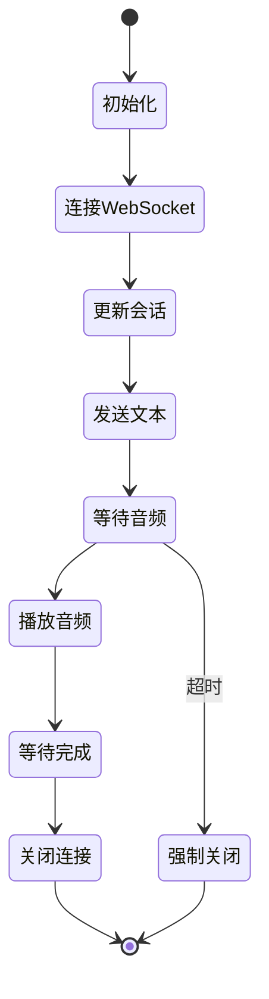

**图表来源**
- [qwen-to-data4.py:592-714](file://qwen-to-data4.py#L592-L714)

#### 音频播放优化

系统提供多种音频播放方式：
- 流式播放（ffplay/mpv）
- 本地播放（pygame）
- 实时PCM播放（PortAudio）

**章节来源**
- [qwen-to-data4.py:429-513](file://qwen-to-data4.py#L429-L513)

## 依赖关系分析

### 外部依赖

系统依赖多个外部库和服务：

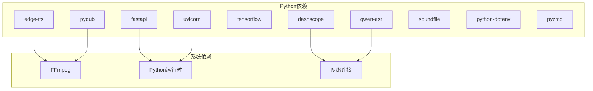

**图表来源**
- [requirements.txt:1-13](file://requirements.txt#L1-L13)

### 内部模块依赖

内部模块之间存在清晰的依赖关系：

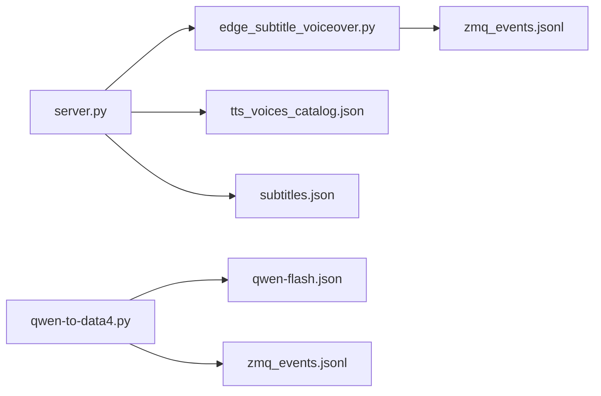

**图表来源**
- [server.py:24-31](file://server.py#L24-L31)
- [edge_subtitle_voiceover.py:11-13](file://edge_subtitle_voiceover.py#L11-L13)

**章节来源**
- [requirements.txt:1-13](file://requirements.txt#L1-L13)

## 性能考虑

### 缓存策略

系统采用多层次缓存策略来提升性能：

#### 音色目录缓存

音色目录采用内存缓存机制，减少文件I/O操作：

#### 音频缓存

音频文件采用文件系统缓存，支持：
- 临时文件缓存
- 永久缓存目录
- 自动清理机制

### 性能优化建议

#### 并发处理

系统支持异步并发处理：
- WebSocket并发连接
- 异步音频处理
- 并发音色查询

#### 资源管理

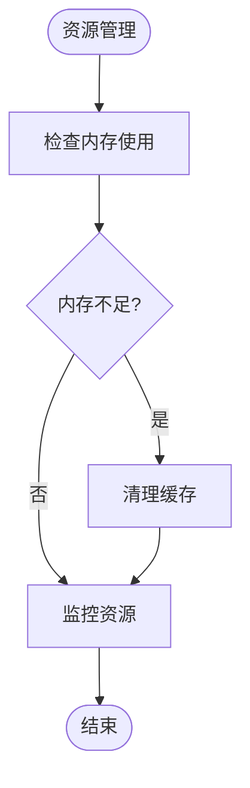

**图表来源**
- [server.py:97-98](file://server.py#L97-L98)

#### 网络优化

- CDN加速音频文件
- 连接池复用
- 压缩传输

## 故障排除指南

### 常见问题及解决方案

#### FFmpeg相关问题

**问题**: 找不到ffmpeg可执行文件
**解决方案**: 
- 在.env文件中设置FFMPEG_PATH
- 将ffmpeg添加到系统PATH
- 确保IDE环境变量正确

#### API密钥问题

**问题**: DashScope API调用失败
**解决方案**:
- 检查DASHSCOPE_API_KEY配置
- 确认API密钥地域匹配
- 验证网络连接

#### 音频播放问题

**问题**: 音频无法播放
**解决方案**:
- 安装ffplay或mpv
- 检查音频格式支持
- 验证播放权限

**章节来源**
- [README.md:194-204](file://README.md#L194-L204)

### 调试工具

系统提供多种调试工具：
- WebSocket调试
- 音频流调试
- 性能监控工具

## 结论

音色管理系统是一个功能完整、架构清晰的语音处理系统。系统的主要优势包括：

1. **模块化设计**: 清晰的模块划分和职责分离
2. **多音色支持**: 支持DashScope和Edge TTS两种音色引擎
3. **灵活配置**: 声明式配置和版本化管理
4. **性能优化**: 多层次缓存和并发处理
5. **易于扩展**: 插件化的架构设计

系统的不足之处：
- 部分功能需要额外的系统依赖
- 音频处理性能仍有优化空间
- 错误处理机制可以进一步完善

## 附录

### API参考

#### 音色管理API

| 端点 | 方法 | 描述 |
|------|------|------|
| `/tts/voices` | GET | 获取音色目录 |
| `/tts/edge-voices` | GET | 获取Edge TTS音色列表 |
| `/tts` | POST | DashScope音色合成 |
| `/tts/edge-subtitle-voiceover` | POST | 字幕时间轴配音 |

#### WebSocket接口

| 接口 | 描述 |
|------|------|
| `/ws/asr` | 实时语音识别 |

### 配置文件说明

#### .env配置文件

```env
# DashScope API密钥
DASHSCOPE_API_KEY=sk-xxxxxxxx

# ASR模型路径
ASR_MODEL_PATH=./Qwen3-ASR-1.7B

# FFmpeg路径
FFMPEG_PATH=C:/ffmpeg/bin/ffmpeg.exe
```

### 最佳实践

1. **音色选择**: 根据应用场景选择合适的音色
2. **性能优化**: 合理使用缓存和并发处理
3. **错误处理**: 完善的异常处理和降级机制
4. **监控告警**: 建立完善的监控和告警系统
5. **安全防护**: 输入验证和权限控制