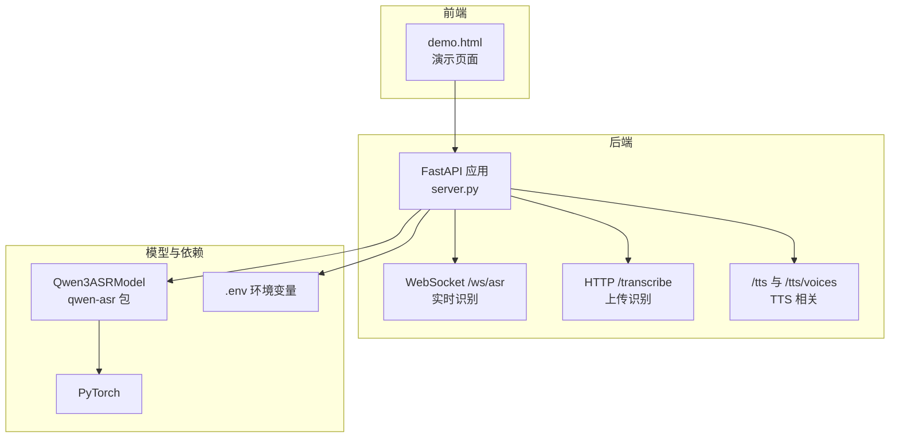
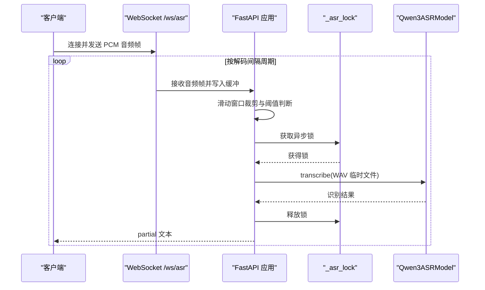
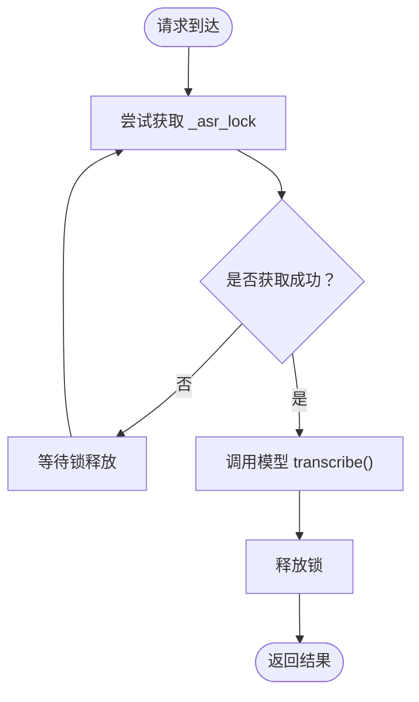
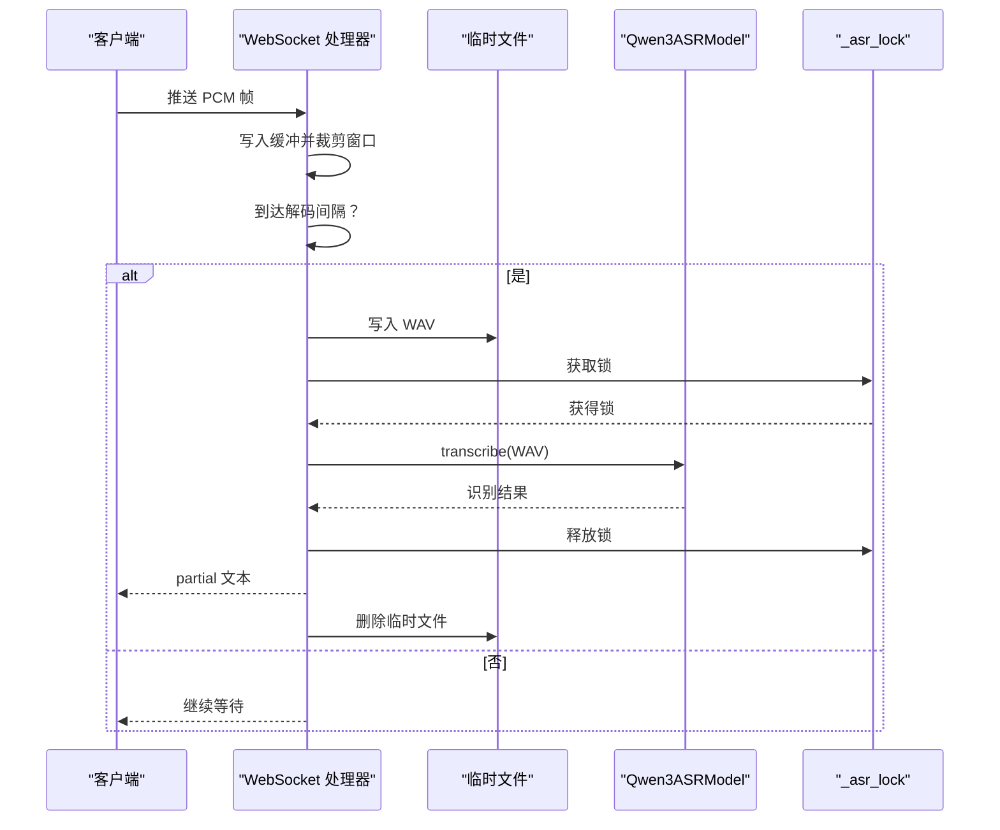
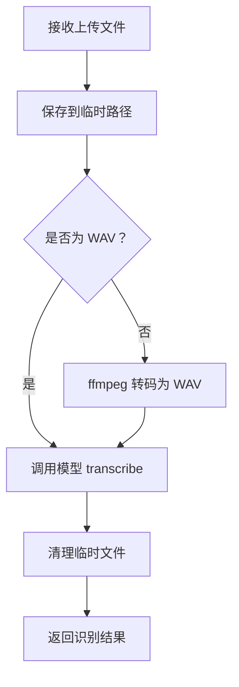
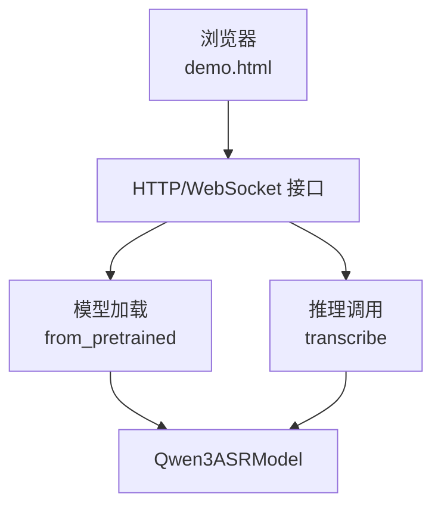
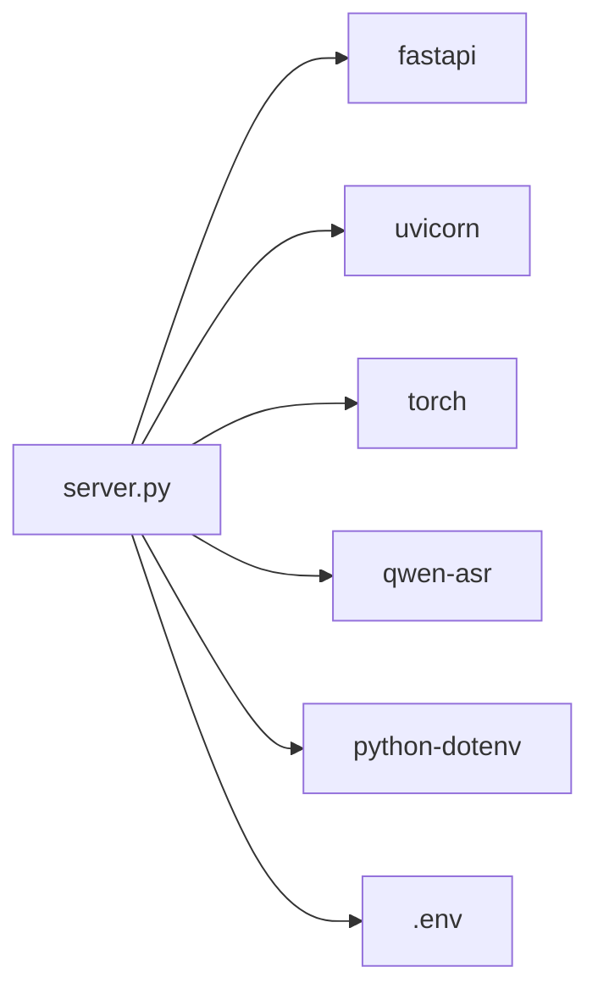

# ASR模型集成

<cite>
**本文引用的文件**
- [server.py](file://server.py)
- [index.py](file://index.py)
- [README.md](file://README.md)
- [requirements.txt](file://requirements.txt)
- [Qwen3-ASR-1.7B/README.md](file://Qwen3-ASR-1.7B/README.md)
- [demo.html](file://demo.html)
</cite>

## 目录
1. [简介](#简介)
2. [项目结构](#项目结构)
3. [核心组件](#核心组件)
4. [架构总览](#架构总览)
5. [详细组件分析](#详细组件分析)
6. [依赖关系分析](#依赖关系分析)
7. [性能考量](#性能考量)
8. [故障排查指南](#故障排查指南)
9. [结论](#结论)
10. [附录](#附录)

## 简介
本技术文档围绕 ASR（自动语音识别）模型在本项目的集成与部署展开，重点说明以下内容：
- Qwen3ASRModel 的初始化流程与关键参数（模型路径、设备映射、数据类型）
- 环境变量配置（ASR_MODEL_PATH、ASR_WS_DECODE_INTERVAL_S、ASR_WS_MAX_WINDOW_S 等）
- 异步锁机制（_asr_lock）的设计目的与实现原理
- 推理性能优化策略（批处理大小、最大新令牌数、设备资源管理）
- 部署最佳实践（硬件要求、内存占用估算、性能调优）
- 版本兼容性与升级指导

## 项目结构
本项目采用“前端页面 + FastAPI 后端”的架构，后端负责加载 Qwen3-ASR 模型并通过 HTTP/WebSocket 对外提供识别能力，同时提供演示页面与 TTS 相关接口。

图表来源
- [server.py:67-95](file://server.py#L67-L95)
- [demo.html:172-200](file://demo.html#L172-L200)

章节来源
- [README.md:5-19](file://README.md#L5-L19)
- [server.py:67-95](file://server.py#L67-L95)

## 核心组件
- 模型加载与推理入口：在服务启动时通过 Qwen3ASRModel.from_pretrained 初始化模型，支持本地路径或 Hugging Face Hub 回退。
- WebSocket 实时识别：接收 16kHz 单声道 PCM，按滑动窗口与周期性解码间隔进行识别，返回 partial 文本。
- HTTP 上传识别：支持多种音频格式，内部统一转码为 WAV 后调用模型识别。
- 异步锁保护：使用 asyncio.Lock 保护模型推理调用，避免并发访问导致的状态冲突。
- 环境变量配置：通过 .env 控制模型路径、WebSocket 解码参数、Uvicorn 运行参数等。

章节来源
- [server.py:88-95](file://server.py#L88-L95)
- [server.py:124-197](file://server.py#L124-L197)
- [server.py:367-425](file://server.py#L367-L425)
- [server.py:97](file://server.py#L97)

## 架构总览
后端启动时根据环境变量选择设备与数据类型，加载 Qwen3ASR 模型；随后对外提供两类能力：
- WebSocket 实时识别：客户端持续推送 PCM 音频，服务端按窗口与间隔周期性识别并返回中间文本。
- HTTP 上传识别：客户端上传音频文件，服务端转码并调用模型识别，返回语言与文本。

图表来源
- [server.py:124-197](file://server.py#L124-L197)
- [server.py:97](file://server.py#L97)

## 详细组件分析

### 模型初始化与配置
- 设备映射与数据类型
  - 自动检测 CUDA 可用性，优先使用 GPU（cuda:0）与 bfloat16；否则回退到 CPU 与 float32。
  - 该策略兼顾显存占用与精度，适配不同硬件条件。
- 模型路径选择
  - 优先使用 ASR_MODEL_PATH 指定的本地目录；若不存在则回退到 Hugging Face Hub 的 Qwen/Qwen3-ASR-1.7B。
  - 本地路径需包含完整权重与配置文件，避免运行时网络下载。
- 关键推理参数
  - max_inference_batch_size：推理批大小上限，用于控制显存占用，避免 OOM。
  - max_new_tokens：最大新生成 token 数，长音频输入建议增大该值。
- 示例初始化
  - 参考本地测试脚本与服务端初始化，均采用相同参数模式。

章节来源
- [server.py:78-82](file://server.py#L78-L82)
- [server.py:83-95](file://server.py#L83-L95)
- [index.py:4-11](file://index.py#L4-L11)
- [Qwen3-ASR-1.7B/README.md:105-131](file://Qwen3-ASR-1.7B/README.md#L105-L131)

### 环境变量配置
- ASR_MODEL_PATH
  - 本地模型目录路径（绝对或相对项目根目录），存在即优先使用本地权重。
- ASR_WS_DECODE_INTERVAL_S
  - WebSocket 实时识别的解码间隔（秒），默认 1.2s；越小延迟越低但计算压力越大。
- ASR_WS_MAX_WINDOW_S
  - 滑动窗口长度（秒），默认 12s；影响窗口内音频长度与识别范围。
- 其他运行参数
  - UVICORN_HOST/PORT/LOG_LEVEL/RELOAD 等，用于控制 Uvicorn 服务器行为。

章节来源
- [README.md:48-83](file://README.md#L48-L83)
- [server.py:83](file://server.py#L83)
- [server.py:136-137](file://server.py#L136-L137)
- [server.py:434-451](file://server.py#L434-L451)

### 异步锁机制（_asr_lock）
- 设计目的
  - 防止多个并发请求同时调用模型推理，避免共享状态冲突与资源竞争。
- 实现原理
  - 在 WebSocket 识别与 HTTP 上传识别中，均通过 asyncio.Lock 保护 transcribe 调用。
  - 采用异步上下文管理器确保异常时也能正确释放锁。
- 性能影响
  - 单锁串行化推理，降低并发吞吐；可通过硬件扩容与批处理优化缓解。

图表来源
- [server.py:180-181](file://server.py#L180-L181)
- [server.py:97](file://server.py#L97)

章节来源
- [server.py:97](file://server.py#L97)
- [server.py:180-181](file://server.py#L180-L181)

### 推理性能优化策略
- 批处理大小（max_inference_batch_size=32）
  - 控制单次推理批大小，平衡吞吐与显存占用；较小值有助于避免 OOM。
- 最大新令牌数（max_new_tokens=256）
  - 长音频建议增大该值，以获得更完整的识别结果。
- 设备资源管理
  - 自动选择 GPU（bfloat16）或 CPU（float32），在不同硬件条件下取得合理折中。
- 转码与 I/O
  - 上传识别时对非 WAV 格式进行转码，减少解码开销；WebSocket 识别通过滑动窗口与解码间隔控制频率。

章节来源
- [server.py:88-95](file://server.py#L88-L95)
- [server.py:136-137](file://server.py#L136-L137)
- [server.py:389-401](file://server.py#L389-L401)

### WebSocket 实时识别流程
- 输入格式
  - 16kHz 单声道 PCM（int16），客户端持续推送二进制帧。
- 服务端处理
  - 接收帧写入缓冲，按 max_window_s 裁剪，超过阈值才触发识别。
  - 按 decode_interval_s 周期性写入临时 WAV 并调用模型，返回 partial 文本。
- 错误处理
  - 识别失败返回 error 类型消息；最终清理临时文件。

图表来源
- [server.py:124-197](file://server.py#L124-L197)

章节来源
- [server.py:124-197](file://server.py#L124-L197)

### HTTP 上传识别流程
- 支持格式
  - WAV、MP3、M4A、OGG、WEBM、FLAC；非 WAV 时通过 ffmpeg 转码为 WAV。
- 处理步骤
  - 保存上传文件至临时路径，必要时转码；调用模型 transcribe；返回语言与文本。
- 清理策略
  - 无论成功与否，均删除临时文件与转码后的 WAV 文件。

图表来源
- [server.py:367-425](file://server.py#L367-L425)

章节来源
- [server.py:367-425](file://server.py#L367-L425)

### 概念性概览
以下为概念性流程图，展示从浏览器到后端再到模型的整体交互，帮助理解端到端工作方式。

（此图为概念性示意，不直接映射具体源码文件）

## 依赖关系分析
- 运行时依赖
  - FastAPI、Uvicorn、PyTorch、qwen-asr、python-dotenv 等。
- 模型与框架
  - Qwen3ASRModel 依赖 PyTorch；推荐使用 FlashAttention 2 以提升长序列与大批量推理性能。
- 环境变量
  - .env 中的 DASHSCOPE_API_KEY、ASR_MODEL_PATH、ASR_WS_DECODE_INTERVAL_S、ASR_WS_MAX_WINDOW_S 等。

图表来源
- [requirements.txt:1-13](file://requirements.txt#L1-L13)
- [server.py:18](file://server.py#L18)

章节来源
- [requirements.txt:1-13](file://requirements.txt#L1-L13)
- [Qwen3-ASR-1.7B/README.md:91-103](file://Qwen3-ASR-1.7B/README.md#L91-L103)

## 性能考量
- 硬件与内存
  - 推荐使用具备足够显存的 GPU（如 RTX 4090/5090 等），以 bfloat16 运行可显著降低显存占用并提升吞吐。
  - 若显存紧张，可适当减小 max_inference_batch_size 与 max_new_tokens。
- 推理参数调优
  - ASR_WS_DECODE_INTERVAL_S：降低可降低延迟，但增加 CPU/GPU 压力；默认 1.2s 为折中。
  - ASR_WS_MAX_WINDOW_S：增大窗口可提升长音频识别稳定性，但会增加内存与 I/O 压力；默认 12s 适用于多数场景。
- I/O 与转码
  - 上传识别时优先使用本地 ffmpeg，避免在 IDE 子进程中找不到 ffmpeg 的问题；可在 .env 中显式指定 FFMPEG_PATH。
- 扩展与并发
  - 当前实现为单锁串行化推理；若需更高并发，可考虑多实例部署或引入批处理队列。

（本节为通用性能建议，不直接分析具体文件）

## 故障排查指南
- Hugging Face 下载超时
  - 配置 ASR_MODEL_PATH 指向本地完整权重目录，避免运行时网络下载。
- torchvision/transformers 版本不兼容
  - 锁定与 qwen-asr 匹配的 transformers 版本，避免模型加载异常。
- /tts 缺少 API Key
  - 确认 .env 中 DASHSCOPE_API_KEY 已设置且与地域一致。
- /transcribe 上传 webm 报错
  - 安装 ffmpeg；若 IDE 中无法找到 ffmpeg，显式设置 FFMPEG_PATH 指向 ffmpeg.exe。
- WebSocket 识别延迟高或不稳定
  - 调整 ASR_WS_DECODE_INTERVAL_S 与 ASR_WS_MAX_WINDOW_S；确保客户端采样率与通道数符合要求（16kHz 单声道 PCM）。

章节来源
- [README.md:194-204](file://README.md#L194-L204)
- [server.py:83](file://server.py#L83)
- [server.py:389-410](file://server.py#L389-L410)

## 结论
本项目通过 FastAPI 提供稳定的 ASR 能力，结合 WebSocket 与 HTTP 两种接入方式满足不同场景需求。通过合理的设备与数据类型选择、批处理与窗口参数调优、以及异步锁保护，能够在不同硬件条件下获得稳定且高效的识别体验。建议在生产环境中优先使用本地模型路径、合理设置解码间隔与窗口大小，并根据实际显存情况调整批处理与最大新令牌数。

（本节为总结性内容，不直接分析具体文件）

## 附录

### 环境变量清单
- DASHSCOPE_API_KEY：TTS 接口所需密钥
- ASR_MODEL_PATH：本地模型目录路径
- ASR_WS_DECODE_INTERVAL_S：WebSocket 解码间隔（秒）
- ASR_WS_MAX_WINDOW_S：WebSocket 滑动窗口（秒）
- FFMPEG_PATH：ffmpeg 可执行文件绝对路径（当 IDE 子进程无法找到 ffmpeg 时）
- UVICORN_*：Uvicorn 服务器运行参数（HOST、PORT、LOG_LEVEL、RELOAD 等）

章节来源
- [README.md:48-83](file://README.md#L48-L83)
- [server.py:83](file://server.py#L83)
- [server.py:434-451](file://server.py#L434-L451)