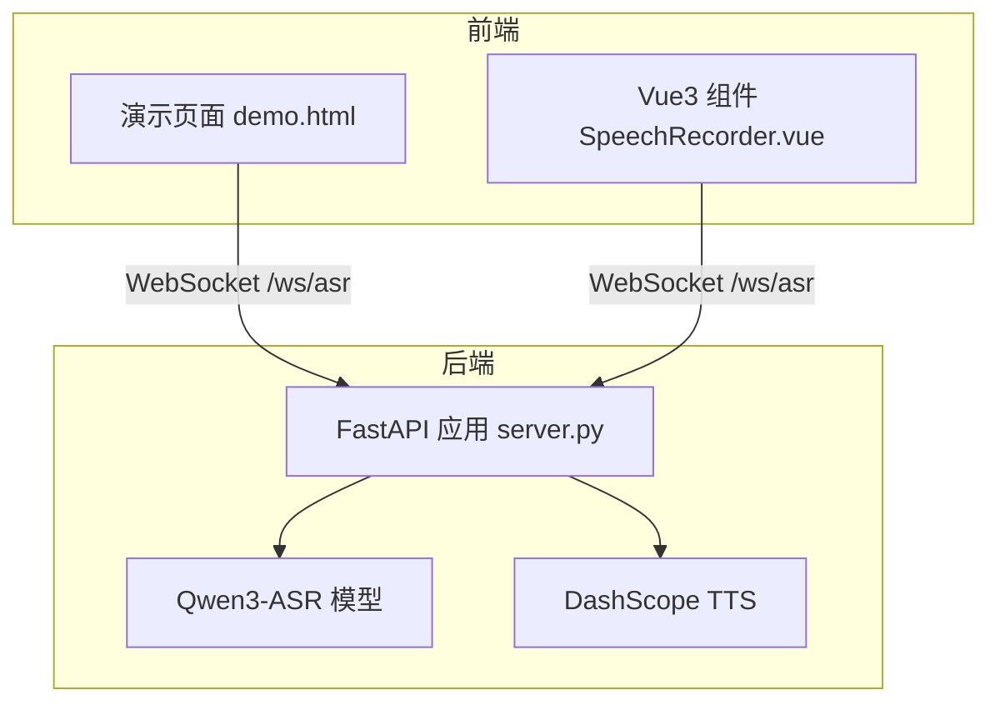
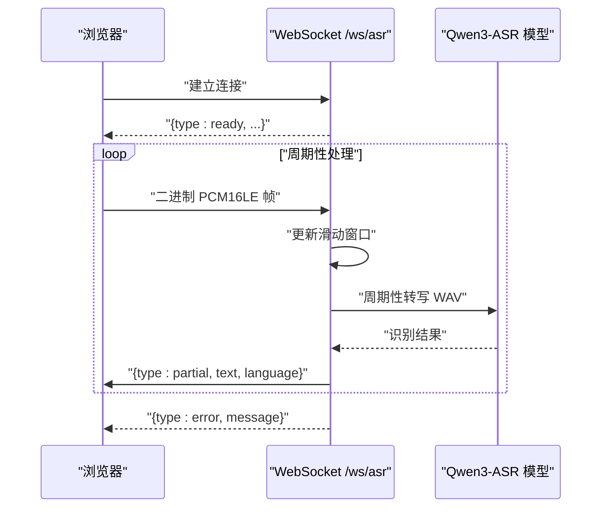
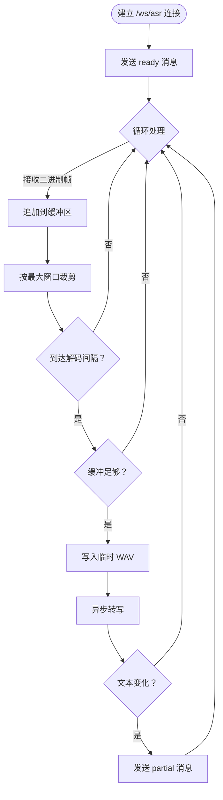
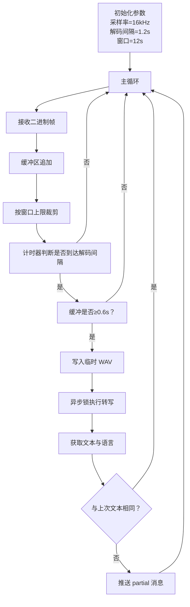
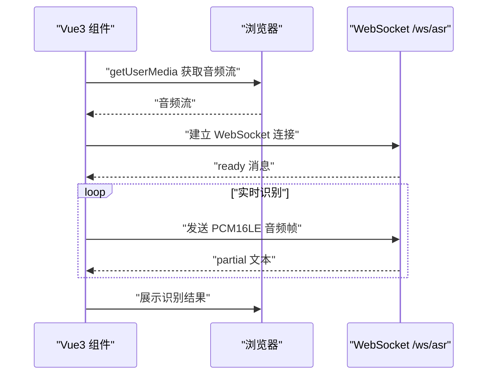
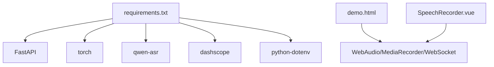

# 实时语音识别

<cite>
**本文档引用的文件**
- [README.md](file://README.md)
- [server.py](file://server.py)
- [SpeechRecorder.vue](file://SpeechRecorder.vue)
- [demo.html](file://demo.html)
- [requirements.txt](file://requirements.txt)
- [tts_voices_catalog.json](file://tts_voices_catalog.json)
- [qwen3stream.py](file://qwen3stream.py)
- [index.py](file://index.py)
</cite>

## 目录
1. [简介](#简介)
2. [项目结构](#项目结构)
3. [核心组件](#核心组件)
4. [架构总览](#架构总览)
5. [详细组件分析](#详细组件分析)
6. [依赖关系分析](#依赖关系分析)
7. [性能考量](#性能考量)
8. [故障排查指南](#故障排查指南)
9. [结论](#结论)
10. [附录](#附录)

## 简介
本项目基于 Vue3 前端与 FastAPI 后端，提供本地 Qwen3-ASR 语音识别与实时流式 WebSocket 识别能力，同时集成 DashScope TTS 语音合成与演示页面。本文档聚焦于实时语音识别功能，深入解释 WebSocket 连接建立流程、PCM16LE 音频数据格式要求、滑动窗口识别算法机制、部分结果推送与去重逻辑、WebSocket 消息格式定义，以及前端 Vue3 组件的集成示例。

## 项目结构
项目采用前后端分离架构：
- 前端：Vue3 组件与演示页面，负责麦克风授权、音频采集、WebSocket 连接与实时识别。
- 后端：FastAPI 服务，提供 WebSocket /ws/asr、/transcribe、/tts 等接口，加载本地 Qwen3-ASR 模型进行识别。

图表来源
- [server.py:124-197](file://server.py#L124-L197)
- [demo.html:486-564](file://demo.html#L486-L564)
- [SpeechRecorder.vue:20-77](file://SpeechRecorder.vue#L20-L77)

章节来源
- [README.md:5-19](file://README.md#L5-L19)
- [requirements.txt:1-13](file://requirements.txt#L1-L13)

## 核心组件
- WebSocket 实时识别服务：接收浏览器发送的 PCM16LE 音频流，维护滑动窗口，周期性转写并推送部分结果。
- 前端演示页面：提供麦克风授权、实时识别按钮、录音上传识别、TTS 合成播放等功能。
- Vue3 组件：可复用的录音组件，支持上传识别与实时识别两种模式。
- 本地 ASR 模型：Qwen3-ASR-1.7B，支持本地加载与 Hugging Face 回退。
- TTS 服务：DashScope Qwen TTS，提供语音合成与播放。

章节来源
- [README.md:21-27](file://README.md#L21-L27)
- [server.py:88-96](file://server.py#L88-L96)
- [demo.html:486-564](file://demo.html#L486-L564)
- [SpeechRecorder.vue:20-77](file://SpeechRecorder.vue#L20-L77)

## 架构总览
实时识别的整体流程如下：
- 前端通过 WebSocket 连接 /ws/asr。
- 服务端发送 ready 消息，告知客户端音频格式与识别参数。
- 客户端持续发送 PCM16LE 音频帧（16kHz、单声道、16bit）。
- 服务端维护滑动窗口，周期性将窗口内音频转写为文本，去重后推送 partial 消息。
- 出现异常时推送 error 消息。

图表来源
- [server.py:124-197](file://server.py#L124-L197)
- [demo.html:498-516](file://demo.html#L498-L516)

## 详细组件分析

### WebSocket 连接与握手协议
- 连接入口：/ws/asr
- 握手阶段：服务端接受连接后立即发送 ready 消息，包含音频格式、采样率、通道数、解码间隔与最大窗口等参数。
- 连接状态管理：服务端在循环中接收二进制帧，遇到断开或异常时优雅退出。

图表来源
- [server.py:124-197](file://server.py#L124-L197)

章节来源
- [server.py:124-153](file://server.py#L124-L153)
- [server.py:155-197](file://server.py#L155-L197)

### PCM16LE 音频数据格式要求
- 采样率：16kHz
- 通道数：单声道
- 位深：16bit
- 字节序：小端
- 数据类型：int16（PCM16LE）

前端在浏览器中通常录制为 audio/webm，后端已支持 .webm 转码。实时识别时，前端将麦克风音频流经 WebAudio 降采样至 16kHz、量化为 int16，并以二进制帧发送。

章节来源
- [README.md:122-126](file://README.md#L122-L126)
- [demo.html:460-484](file://demo.html#L460-L484)
- [demo.html:545-554](file://demo.html#L545-L554)

### 滑动窗口识别算法
- 窗口大小：默认 12 秒（可通过环境变量 ASR_WS_MAX_WINDOW_S 调整）
- 解码间隔：默认 1.2 秒（可通过环境变量 ASR_WS_DECODE_INTERVAL_S 调整）
- 缓冲策略：新增音频帧追加到缓冲区，超过窗口大小时丢弃最早的数据，确保窗口长度不超过设定上限
- 周期性转写：到达解码间隔且缓冲区至少包含 0.6 秒数据时，将缓冲区内容写入临时 WAV 并异步转写
- 去重逻辑：仅当新文本与上次推送文本不相等时才推送，避免重复

图表来源
- [server.py:134-197](file://server.py#L134-L197)

章节来源
- [server.py:134-174](file://server.py#L134-L174)
- [server.py:186-188](file://server.py#L186-L188)

### 部分结果推送机制
- 消息类型：partial
- 字段：language（语言）、text（文本）
- 推送条件：文本发生变化且非空
- 去重策略：记录上次推送文本，仅当新文本不等于上次文本时推送
- 错误处理：任何异常均以 error 类型消息返回，包含错误描述

章节来源
- [server.py:186-190](file://server.py#L186-L190)
- [README.md:124-126](file://README.md#L124-L126)

### WebSocket 消息格式说明
- ready
  - 用途：连接建立后的握手消息，告知客户端音频格式与识别参数
  - 字段：type（固定为 ready）、format（pcm_s16le）、sample_rate（16000）、channels（1）、decode_interval_s（解码间隔）、max_window_s（窗口大小）
- partial
  - 用途：实时推送的部分识别结果
  - 字段：type（固定为 partial）、language（语言）、text（文本）
- error
  - 用途：识别过程中的错误通知
  - 字段：type（固定为 error）、message（错误描述）

章节来源
- [server.py:144-153](file://server.py#L144-L153)
- [server.py:189-190](file://server.py#L189-L190)
- [README.md:121-127](file://README.md#L121-L127)

### 前端 Vue3 组件集成示例
- 组件职责：提供开始/停止录音按钮，展示识别结果与错误信息
- 录音模式：使用 MediaRecorder API 录制 audio/webm，停止后上传到 /transcribe
- 实时模式：在演示页面中，通过 WebSocket 连接 /ws/asr，实时发送 PCM16LE 音频帧
- 集成要点：将组件中的请求地址指向后端服务，确保跨域配置允许访问

图表来源
- [SpeechRecorder.vue:20-77](file://SpeechRecorder.vue#L20-L77)
- [demo.html:486-564](file://demo.html#L486-L564)

章节来源
- [SpeechRecorder.vue:1-90](file://SpeechRecorder.vue#L1-L90)
- [README.md:180-183](file://README.md#L180-L183)

## 依赖关系分析
- 后端依赖：FastAPI、uvicorn、torch、qwen-asr、dashscope、python-dotenv 等
- 前端演示：依赖浏览器 WebAudio API、MediaRecorder API、WebSocket
- 模型加载：本地 Qwen3-ASR-1.7B，若本地路径存在则优先使用，否则回退到 Hugging Face

图表来源
- [requirements.txt:1-13](file://requirements.txt#L1-L13)
- [server.py:12-19](file://server.py#L12-L19)

章节来源
- [requirements.txt:1-13](file://requirements.txt#L1-L13)
- [server.py:88-96](file://server.py#L88-L96)

## 性能考量
- 解码间隔与窗口大小：通过环境变量可调，默认 1.2 秒解码间隔与 12 秒窗口，平衡实时性与识别准确率
- 异步转写：使用 asyncio.to_thread 将转写任务放入线程池，避免阻塞事件循环
- 缓冲管理：滑动窗口裁剪与最小缓冲阈值（0.6 秒）减少无效转写
- 锁保护：使用 asyncio.Lock 保护转写资源，避免并发冲突

章节来源
- [server.py:136-138](file://server.py#L136-L138)
- [server.py:180-181](file://server.py#L180-L181)
- [server.py:97](file://server.py#L97)

## 故障排查指南
- 连接 huggingface.co 超时：配置有效本地目录 ASR_MODEL_PATH，确保包含 config.json 与权重
- torch 版本不兼容：卸载不匹配的 torchvision，或重装与 torch 同源的 torch/torchvision
- transformers 版本不兼容：锁定与 qwen-asr 匹配的 transformers 版本
- /tts 缺少 Key：检查 .env 中 DASHSCOPE_API_KEY，确认与地域一致
- 演示页 TTS 无法播放：外链 wav 加载受限，可改用响应中的 url 下载或扩展后端代理
- /transcribe 上传 webm 报错：安装 FFmpeg；若 PowerShell 正常但服务报错，在 .env 设置 FFMPEG_PATH 指向 ffmpeg.exe 绝对路径

章节来源
- [README.md:194-204](file://README.md#L194-L204)

## 结论
本项目提供了完整的实时语音识别解决方案，涵盖 WebSocket 连接、PCM16LE 音频格式、滑动窗口识别与部分结果推送。通过合理的参数配置与异步处理，实现了低延迟、高可用的准实时识别体验。前端 Vue3 组件与演示页面可直接集成到现有工程中，满足多种应用场景。

## 附录
- 环境变量
  - ASR_WS_DECODE_INTERVAL_S：解码间隔（秒），默认 1.2
  - ASR_WS_MAX_WINDOW_S：音频滑动窗口（秒），默认 12
  - ASR_MODEL_PATH：本地 ASR 模型目录
  - DASHSCOPE_API_KEY：DashScope API 密钥
  - FFMPEG_PATH：FFmpeg 可执行文件绝对路径（用于 webm 转码）
- API 一览
  - GET /：健康检查
  - GET /demo：演示页面
  - POST /transcribe：上传音频识别
  - WebSocket /ws/asr：实时识别
  - GET /tts/voices：TTS 语音列表
  - POST /tts：TTS 合成
  - GET /tts/edge-voices：Edge TTS 语音列表
  - POST /tts/edge-subtitle-voiceover：字幕配音合成
  - GET /tts/edge-voiceover-files/{file_id}：获取字幕配音文件

章节来源
- [README.md:77-83](file://README.md#L77-L83)
- [README.md:100-147](file://README.md#L100-L147)
- [server.py:427-451](file://server.py#L427-L451)