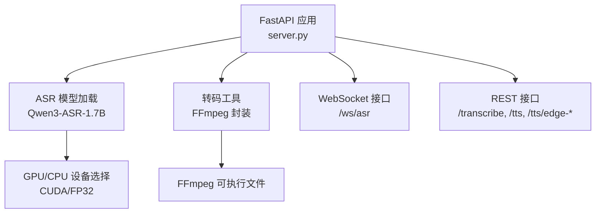
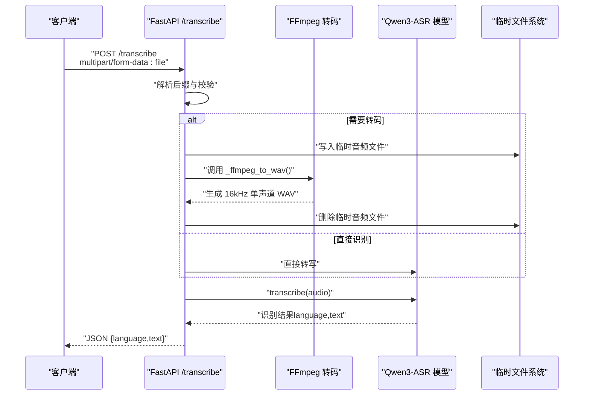
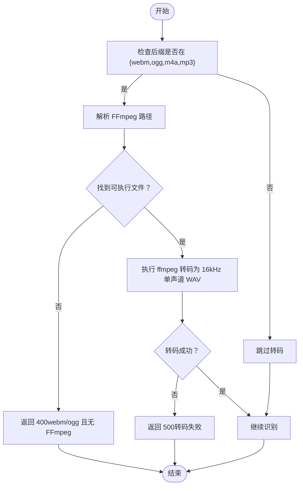
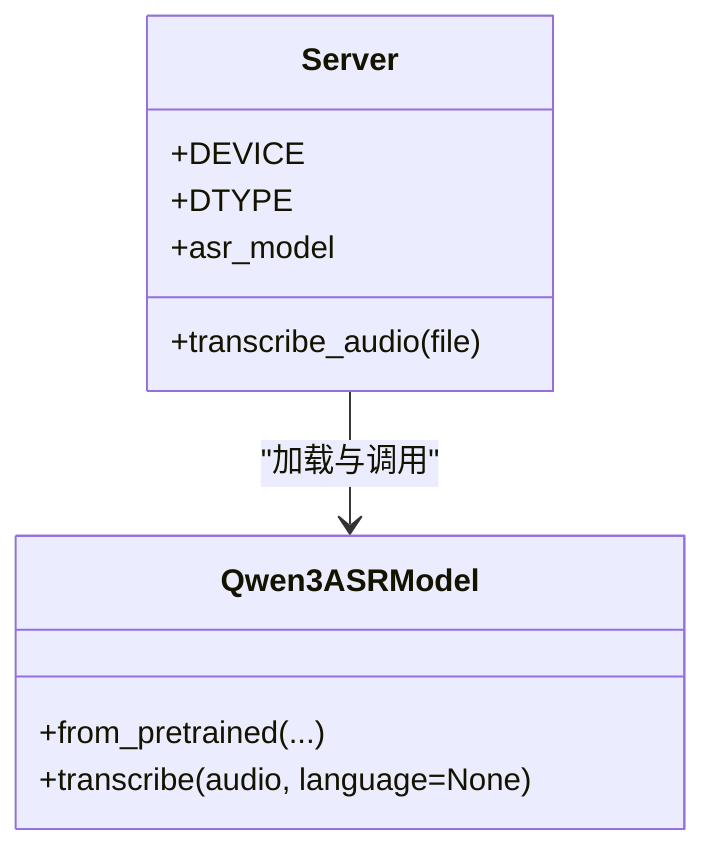
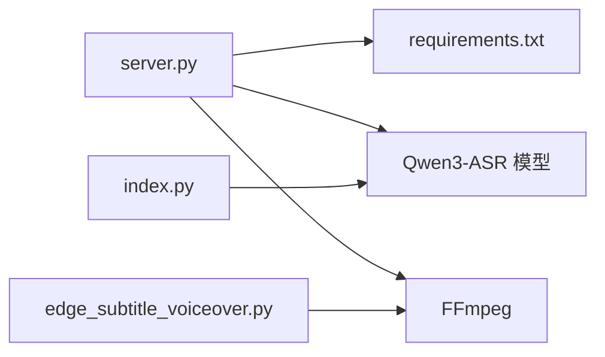

# 批量音频识别

<cite>
**本文引用的文件**
- [server.py](file://server.py)
- [README.md](file://README.md)
- [requirements.txt](file://requirements.txt)
- [index.py](file://index.py)
- [edge_subtitle_voiceover.py](file://edge_subtitle_voiceover.py)
- [demo.html](file://demo.html)
</cite>

## 目录
1. [简介](#简介)
2. [项目结构](#项目结构)
3. [核心组件](#核心组件)
4. [架构总览](#架构总览)
5. [详细组件分析](#详细组件分析)
6. [依赖关系分析](#依赖关系分析)
7. [性能考虑](#性能考虑)
8. [故障排除指南](#故障排除指南)
9. [结论](#结论)
10. [附录](#附录)

## 简介
本文件面向“批量音频识别”能力，聚焦于 POST /transcribe 端点的使用方法与实现细节，涵盖：
- 文件上传格式与支持的音频格式（.wav、.mp3、.m4a、.ogg、.webm、.flac）
- 音频转码流程与 FFmpeg 技术实现
- ASR 模型的批处理机制、GPU/CPU 设备选择与内存管理
- 完整 API 调用示例（curl 与多语言客户端）
- 返回结果的数据结构（语言检测与文本组织）
- 常见问题与故障排除（格式不支持、转码失败、识别结果为空）

## 项目结构
后端采用 FastAPI 提供 REST 与 WebSocket 接口，核心模块如下：
- server.py：提供 /transcribe、/ws/asr、/tts、/tts/edge-* 等接口，加载 Qwen3-ASR 模型，负责转码与推理
- edge_subtitle_voiceover.py：复用 FFmpeg 转码与音频处理工具函数，供字幕配音等场景
- index.py：本地测试脚本，展示如何加载模型与执行单次转写
- README.md：项目说明、API 文档与故障排除
- requirements.txt：运行依赖清单
- demo.html：前端演示页面，包含录音与识别交互

图表来源
- [server.py:88-95](file://server.py#L88-L95)
- [edge_subtitle_voiceover.py:43-94](file://edge_subtitle_voiceover.py#L43-L94)

章节来源
- [README.md:5-19](file://README.md#L5-L19)
- [server.py:67-95](file://server.py#L67-L95)

## 核心组件
- POST /transcribe：接收 multipart/form-data，字段名为 file，支持多种音频格式；内部根据后缀决定是否转码为 WAV，再交由 ASR 模型识别，返回语言与文本
- ASR 模型：Qwen3-ASR-1.7B，支持自动语言检测与批量推理
- 转码子系统：FFmpeg 封装，统一采样率与声道，确保模型输入一致性
- 设备与精度：自动检测 CUDA 可用性，优先使用 bfloat16；CPU fallback 使用 float32
- 错误处理：针对空文件、格式不支持、转码失败、识别失败等场景返回明确状态码与错误信息

章节来源
- [server.py:367-425](file://server.py#L367-L425)
- [server.py:78-95](file://server.py#L78-L95)
- [README.md:114-118](file://README.md#L114-L118)

## 架构总览
POST /transcribe 的端到端流程如下：
- 客户端上传音频文件（multipart/form-data）
- 服务端解析后缀，判断是否需要转码
- 若需要，使用 FFmpeg 将音频转为 16kHz 单声道 WAV
- 将 WAV 路径传入 ASR 模型执行转写
- 返回包含 language 与 text 的 JSON 结果

图表来源
- [server.py:367-425](file://server.py#L367-L425)
- [edge_subtitle_voiceover.py:84-94](file://edge_subtitle_voiceover.py#L84-L94)

## 详细组件分析

### POST /transcribe 接口
- 请求方法与类型：POST，Content-Type: multipart/form-data
- 请求字段：file（音频文件）
- 成功响应：JSON 对象，包含 language 与 text
- 支持的音频格式：.wav、.mp3、.m4a、.ogg、.webm、.flac
- 格式要求：
  - .wav：无需转码，直接识别
  - .mp3/.m4a/.ogg/.webm：若存在 FFmpeg，自动转码为 16kHz 单声道 16bit WAV；否则对 .webm/.ogg 报错提示安装/配置 FFmpeg
  - .flac：无需转码，直接识别
- 错误处理：
  - 缺少文件名：400
  - 上传内容为空：400
  - 转码失败：500（包含 FFmpeg 输出片段）
  - 识别失败：500
  - .webm/.ogg 且无 FFmpeg：400（提示配置 FFMPEG_PATH 或加入 PATH）

章节来源
- [README.md:114-118](file://README.md#L114-L118)
- [server.py:367-425](file://server.py#L367-L425)

### 音频转码流程（FFmpeg）
- 转码触发条件：当上传后缀属于 {".webm",".ogg",".m4a",".mp3"} 且 FFmpeg 可用时
- 转码参数：采样率 16000Hz、单声道、16bit PCM（WAV）
- 转码实现：
  - 解析 FFmpeg 路径：优先读取环境变量 FFMPEG_PATH/FFMPEG_BINARY，其次系统 PATH，Windows 上尝试 where.exe
  - 执行命令：ffmpeg -nostdin -hide_banner -loglevel error -y -i <src> -ar 16000 -ac 1 <dst>
- 转码失败处理：
  - 捕获子进程异常，返回 500，并附带 FFmpeg 输出片段
  - 对 .webm/.ogg 且无 FFmpeg 的情况，明确提示安装/配置 FFmpeg

图表来源
- [server.py:388-411](file://server.py#L388-L411)
- [edge_subtitle_voiceover.py:43-94](file://edge_subtitle_voiceover.py#L43-L94)

章节来源
- [server.py:388-411](file://server.py#L388-L411)
- [edge_subtitle_voiceover.py:43-94](file://edge_subtitle_voiceover.py#L43-L94)

### ASR 模型批处理与设备选择
- 设备选择：优先 CUDA:0（bfloat16），否则 CPU（float32）
- 模型加载：from_pretrained，支持本地目录或 Hugging Face Hub；可通过环境变量 ASR_MODEL_PATH 指定本地路径
- 批处理参数：max_inference_batch_size 控制推理批大小，max_new_tokens 控制最大生成长度
- 推理入口：asr_model.transcribe(audio, language=None)，返回包含 language 与 text 的结果列表
- 本地测试：index.py 展示了如何加载模型与执行单次转写

图表来源
- [server.py:78-95](file://server.py#L78-L95)
- [index.py:4-11](file://index.py#L4-L11)

章节来源
- [server.py:78-95](file://server.py#L78-L95)
- [index.py:4-11](file://index.py#L4-L11)

### 返回结果数据结构
- 字段：language（语言标签）、text（识别文本）
- 组织方式：单文件识别返回单个对象；模型支持批量输入时可返回多个对象（按输入顺序）

章节来源
- [server.py:412-419](file://server.py#L412-L419)
- [README.md:116-118](file://README.md#L116-L118)

### API 调用示例

- curl 示例（上传音频文件）
  - 语法：curl -X POST http://127.0.0.1:8000/transcribe -F file=@<音频文件路径>
  - 注意：file 为必填字段，Content-Type 由 curl 自动设置为 multipart/form-data

- JavaScript（Fetch）示例（浏览器）
  - 通过 FormData 上传文件，然后读取 JSON 响应
  - 参考 demo.html 中的录音与上传逻辑

- Python requests 示例
  - 使用 requests.post(url, files={"file": open("audio.wav", "rb")}) 上传
  - 读取 r.json() 获取 {language, text}

- 其他语言客户端
  - Java：使用 multipart/form-data 上传文件，读取 JSON 响应
  - Go：使用 multipart 上传，解析 JSON
  - C#/Node.js：同理，遵循 multipart/form-data 协议

章节来源
- [README.md:155-176](file://README.md#L155-L176)
- [demo.html:194-200](file://demo.html#L194-L200)

## 依赖关系分析
- 运行时依赖：FastAPI、Uvicorn、Pydantic、torch、qwen-asr、python-dotenv、dashscope、edge-tts、pydub、soundfile、pygame、sounddevice、pyzmq 等
- 关键耦合点：
  - server.py 依赖 qwen-asr 模型与 FFmpeg
  - edge_subtitle_voiceover.py 提供 FFmpeg 路径解析与转码工具，供字幕配音等场景复用
  - index.py 展示模型加载与推理流程

图表来源
- [requirements.txt:1-13](file://requirements.txt#L1-L13)
- [server.py:18](file://server.py#L18)
- [edge_subtitle_voiceover.py:11](file://edge_subtitle_voiceover.py#L11)

章节来源
- [requirements.txt:1-13](file://requirements.txt#L1-L13)
- [server.py:18](file://server.py#L18)

## 性能考虑
- 设备与精度
  - 自动检测 CUDA 可用性，优先使用 CUDA:0 与 bfloat16，提升吞吐与降低显存占用
  - CPU 环境使用 float32，保证稳定性
- 批处理与内存
  - max_inference_batch_size 控制推理批大小，较小值有助于避免 OOM
  - max_new_tokens 越大，适合长音频，但会增加显存与时间消耗
- 转码效率
  - 仅对非 WAV 的音频进行转码，减少不必要的 I/O
  - FFmpeg 转码参数固定为 16kHz 单声道 16bit，确保模型输入一致性
- 并发与锁
  - /transcribe 使用异步 I/O，转码与推理在独立线程执行
  - /ws/asr 使用互斥锁保护模型调用，避免并发冲突

章节来源
- [server.py:78-95](file://server.py#L78-L95)
- [server.py:97](file://server.py#L97)
- [edge_subtitle_voiceover.py:84-94](file://edge_subtitle_voiceover.py#L84-L94)

## 故障排除指南
- 上传文件为空或缺少文件名
  - 现象：400 Bad Request
  - 处理：确保 multipart/form-data 中包含 file 字段且文件非空
- 格式不支持或后缀不在支持集合
  - 现象：自动降级为 .wav 后继续处理
  - 处理：上传 .wav/.mp3/.m4a/.ogg/.webm/.flac 中的一种
- .webm/.ogg 无法解码
  - 现象：400 Bad Request，提示找不到 ffmpeg
  - 处理：安装 FFmpeg；在 .env 中设置 FFMPEG_PATH=ffmpeg.exe 的绝对路径；或将 ffmpeg 加入系统 PATH 后重启 IDE
- 转码失败
  - 现象：500 Internal Server Error，附带 FFmpeg 输出片段
  - 处理：检查 FFmpeg 可执行文件路径与权限；确认输入音频可被 FFmpeg 正确解码
- 识别结果为空或失败
  - 现象：500 Internal Server Error
  - 处理：检查模型加载是否成功；确认音频质量与长度；必要时增大 max_new_tokens
- 模型加载失败或网络超时
  - 现象：启动时报错或加载超时
  - 处理：配置 ASR_MODEL_PATH 指向本地完整权重目录；或确保网络可访问 Hugging Face Hub

章节来源
- [server.py:369-414](file://server.py#L369-L414)
- [README.md:194-204](file://README.md#L194-L204)

## 结论
POST /transcribe 提供了稳定、高效的批量音频识别能力，具备完善的格式支持与转码机制。通过 FFmpeg 统一音频预处理、自动设备与精度选择、合理的批处理参数，可在不同硬件环境下获得良好性能与稳定性。配合清晰的错误处理与故障排除指引，能够快速定位并解决常见问题。

## 附录

### API 定义（POST /transcribe）
- 方法与路径：POST /transcribe
- Content-Type：multipart/form-data
- 字段：file（音频文件）
- 成功响应：JSON { language, text }
- 错误码：
  - 400：缺少文件名、上传内容为空、webm/ogg 且无 FFmpeg
  - 500：转码失败、识别失败

章节来源
- [README.md:114-118](file://README.md#L114-L118)
- [server.py:367-425](file://server.py#L367-L425)

### 环境变量参考
- DASHSCOPE_API_KEY：用于 /tts 接口（非 /transcribe）
- ASR_MODEL_PATH：本地模型目录路径
- FFMPEG_PATH：FFmpeg 可执行文件绝对路径（Windows 常见场景）
- UVICORN_*：Uvicorn 运行参数（主机、端口、日志级别等）

章节来源
- [README.md:48-76](file://README.md#L48-L76)
- [server.py:434-451](file://server.py#L434-L451)