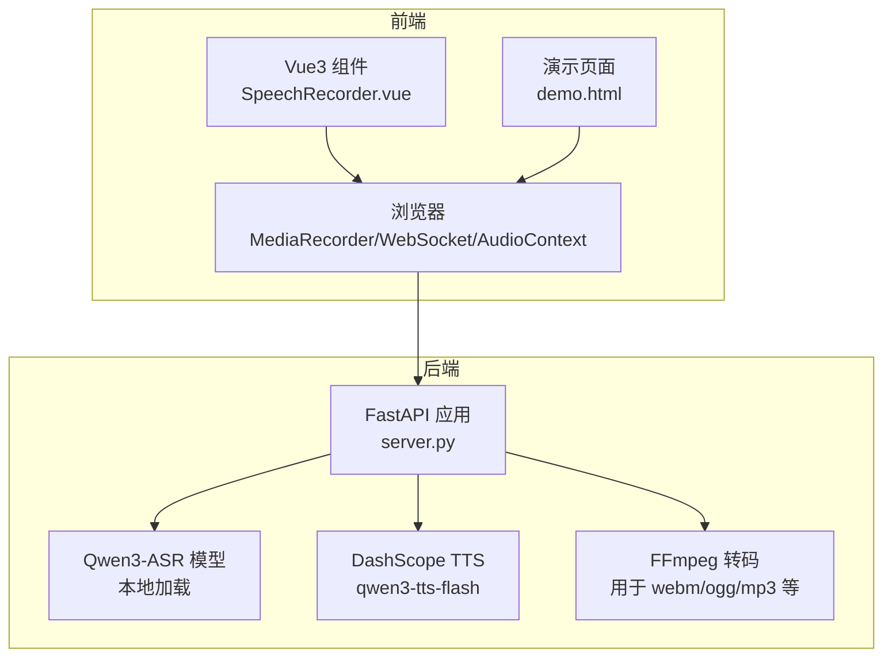
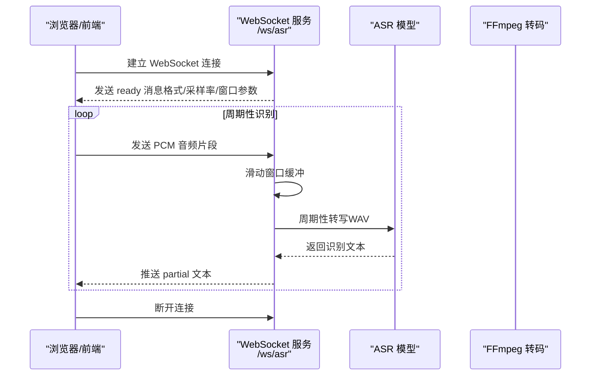
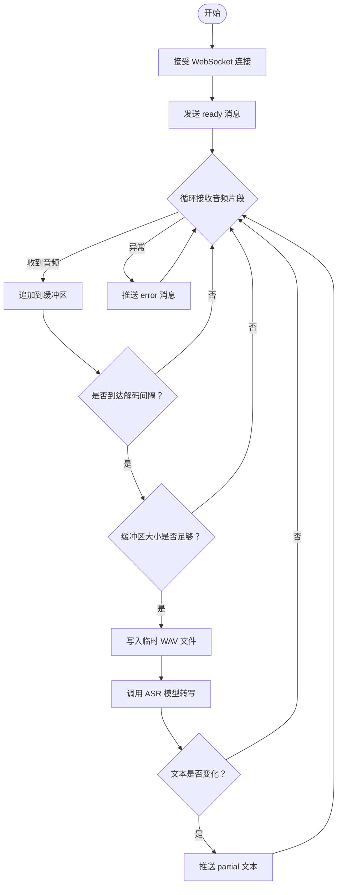
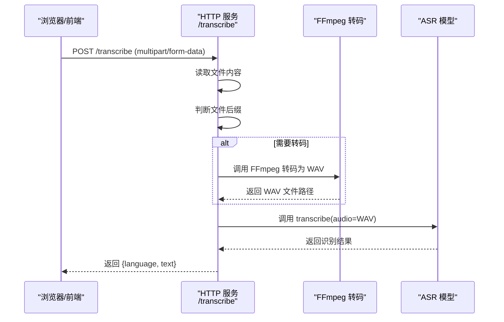
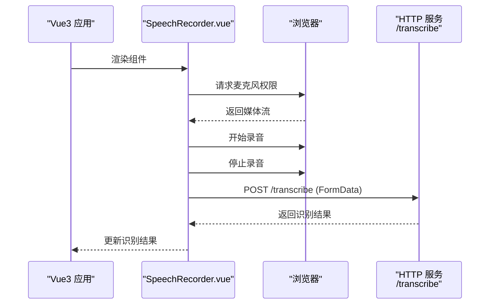
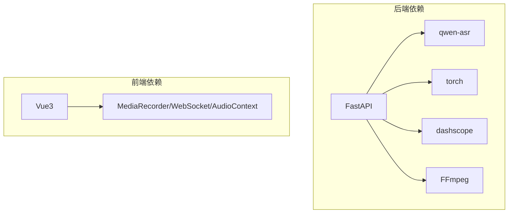

# 语音识别功能

<cite>
**本文档引用的文件**
- [README.md](file://README.md)
- [server.py](file://server.py)
- [SpeechRecorder.vue](file://SpeechRecorder.vue)
- [demo.html](file://demo.html)
- [qwen3stream.py](file://qwen3stream.py)
- [index.py](file://index.py)
- [requirements.txt](file://requirements.txt)
- [edge_subtitle_voiceover.py](file://edge_subtitle_voiceover.py)
- [tts_voices_catalog.json](file://tts_voices_catalog.json)
- [subtitles.json](file://subtitles.json)
- [jsonschema.json](file://jsonschema.json)
</cite>

## 目录
1. [简介](#简介)
2. [项目结构](#项目结构)
3. [核心组件](#核心组件)
4. [架构总览](#架构总览)
5. [详细组件分析](#详细组件分析)
6. [依赖关系分析](#依赖关系分析)
7. [性能考虑](#性能考虑)
8. [故障排除指南](#故障排除指南)
9. [结论](#结论)
10. [附录](#附录)

## 简介
本项目是一个基于 Vue3 前端与 FastAPI 后端的语音应用，集成了本地 Qwen3-ASR 语音识别与阿里云 DashScope TTS 语音合成能力。项目提供两种语音识别模式：
- 实时语音识别（WebSocket 流式）：通过 WebSocket 传输 16kHz 单声道 PCM 音频，服务端采用滑动窗口 + 周期性转写的方式进行准实时识别，并周期性推送部分结果。
- 批量音频识别（HTTP 上传）：通过 HTTP POST 上传音频文件，服务端支持 WAV、MP3、M4A、OGG、WEBM、FLAC 等格式，内部自动转码为 WAV 后进行识别。

同时，项目还提供 TTS 语音合成接口、演示页面以及 Vue3 组件集成指南，帮助开发者快速构建语音相关的应用。

## 项目结构
项目采用前后端分离架构，前端使用 Vue3 和浏览器原生 API，后端使用 FastAPI 提供 RESTful 接口与 WebSocket 服务。

**图表来源**
- [server.py:124-197](file://server.py#L124-L197)
- [SpeechRecorder.vue:20-77](file://SpeechRecorder.vue#L20-L77)
- [demo.html:486-564](file://demo.html#L486-L564)

**章节来源**
- [README.md:5-19](file://README.md#L5-L19)
- [requirements.txt:1-13](file://requirements.txt#L1-L13)

## 核心组件
- WebSocket 实时识别服务：负责接收浏览器发送的 PCM 音频流，维护滑动窗口缓冲区，周期性将窗口内的音频转写为文本并推送部分结果。
- HTTP 批量识别服务：接收浏览器上传的音频文件，自动转码为 WAV，然后调用 ASR 模型进行识别。
- TTS 语音合成服务：调用 DashScope 的 qwen3-tts-flash 模型进行语音合成，支持多种音色与语言。
- Vue3 录音组件：封装浏览器录音、上传识别的逻辑，便于集成到 Vue3 项目中。
- 演示页面：提供完整的前端交互界面，展示录音、实时识别、TTS 合成等功能。

**章节来源**
- [server.py:124-197](file://server.py#L124-L197)
- [server.py:367-425](file://server.py#L367-L425)
- [server.py:212-247](file://server.py#L212-L247)
- [SpeechRecorder.vue:20-77](file://SpeechRecorder.vue#L20-L77)
- [demo.html:486-664](file://demo.html#L486-L664)

## 架构总览
后端通过 FastAPI 提供 RESTful API 与 WebSocket 服务，ASR 模型在启动时加载，TTS 通过 DashScope API 调用。浏览器端通过 MediaRecorder 录制音频，通过 WebSocket 发送 PCM 音频流，或通过 HTTP 上传音频文件进行批量识别。

**图表来源**
- [server.py:124-197](file://server.py#L124-L197)
- [demo.html:486-564](file://demo.html#L486-L564)

**章节来源**
- [README.md:21-27](file://README.md#L21-L27)
- [server.py:124-197](file://server.py#L124-L197)

## 详细组件分析

### 实时语音识别（WebSocket 模式）
- WebSocket 连接建立：客户端通过 ws:// 或 wss:// 连接到 /ws/asr，服务端接受连接后发送 ready 消息，包含音频格式、采样率、解码间隔与最大窗口等参数。
- PCM 音频数据格式：16kHz、单声道、16bit 小端 PCM（pcm_s16le），客户端需将麦克风采集的音频按此格式发送。
- 滑动窗口识别算法：
  - 维护一个固定大小的音频缓冲区（最大窗口大小由环境变量控制），新音频片段追加到缓冲区末尾，超出窗口长度的部分丢弃。
  - 每次收到音频片段后，检查是否达到解码间隔（由环境变量控制），若达到则将缓冲区内容写入临时 WAV 文件，调用 ASR 模型进行转写，得到文本后与上次结果比较，若发生变化则推送 partial 文本。
  - 识别过程中捕获异常并通过 error 类型消息返回错误信息。
- 环境变量：
  - ASR_WS_DECODE_INTERVAL_S：解码间隔（秒），默认 1.2。
  - ASR_WS_MAX_WINDOW_S：音频滑动窗口（秒），默认 12。

**图表来源**
- [server.py:124-197](file://server.py#L124-L197)

**章节来源**
- [README.md:120-129](file://README.md#L120-L129)
- [server.py:124-197](file://server.py#L124-L197)

### 批量音频识别（HTTP 上传模式）
- 支持的音频格式：WAV、MP3、M4A、OGG、WEBM、FLAC。
- 上传处理流程：
  - 接收 multipart/form-data，字段名为 file。
  - 根据文件后缀判断是否需要转码，若为 webm/ogg/mp3/m4a 等，且系统存在 FFmpeg，则调用 FFmpeg 将其转码为 16kHz 单声道 WAV。
  - 调用 ASR 模型进行转写，返回识别结果（language 与 text）。
- 错误处理：
  - 若上传文件为空或后缀不受支持，返回 400 错误。
  - 若 FFmpeg 转码失败，返回 500 错误，并包含转码失败的详细信息。
  - 若 ASR 转写失败，返回 500 错误。

**图表来源**
- [server.py:367-425](file://server.py#L367-L425)

**章节来源**
- [README.md:114-119](file://README.md#L114-L119)
- [server.py:367-425](file://server.py#L367-L425)

### TTS 语音合成
- 接口：POST /tts，请求体包含 text 与 voice（可选），返回 DashScope 的合成结果。
- 音色列表：GET /tts/voices 返回 tts_voices_catalog.json 中的音色与适用模型说明。
- 实现要点：
  - 服务端通过 DashScope MultiModalConversation 调用 qwen3-tts-flash 模型。
  - 对 DashScope 响应对象进行安全转换，避免 hasattr 导致的误判。
  - 支持多种语言与音色，音色信息来源于 tts_voices_catalog.json。

**章节来源**
- [README.md:130-147](file://README.md#L130-L147)
- [server.py:212-247](file://server.py#L212-L247)
- [tts_voices_catalog.json:1-54](file://tts_voices_catalog.json#L1-L54)

### Vue3 组件集成指南
- 组件名称：SpeechRecorder.vue
- 功能：封装录音、上传识别的逻辑，支持错误处理与识别结果显示。
- 集成步骤：
  - 将组件导入到 Vue3 项目中。
  - 修改组件中的请求地址为后端服务地址（默认指向本地 8000 端口）。
  - 在组件中绑定按钮事件，调用 toggleRecording 方法开始/停止录音。
  - 录音结束后自动上传至 /transcribe 接口并显示识别结果。

**图表来源**
- [SpeechRecorder.vue:20-77](file://SpeechRecorder.vue#L20-L77)

**章节来源**
- [README.md:180-183](file://README.md#L180-L183)
- [SpeechRecorder.vue:20-77](file://SpeechRecorder.vue#L20-L77)

### 演示页面集成
- 页面：demo.html
- 功能：提供麦克风授权、录音、实时识别、TTS 合成与播放的完整体验。
- 关键逻辑：
  - 通过 MediaRecorder 录制音频，支持多种 MIME 类型。
  - 通过 WebSocket 连接 /ws/asr，实时发送 PCM 音频并接收 partial 文本。
  - 通过 /tts 接口进行语音合成，支持多种音色选择。
  - 自动处理跨域与错误提示，提供友好的用户反馈。

**章节来源**
- [demo.html:486-664](file://demo.html#L486-L664)

## 依赖关系分析
后端依赖 FastAPI、qwen-asr、torch、dashscope 等库，前端依赖浏览器原生 API（MediaRecorder、WebSocket、AudioContext）与 Vue3。

**图表来源**
- [requirements.txt:1-13](file://requirements.txt#L1-L13)
- [demo.html:486-564](file://demo.html#L486-L564)

**章节来源**
- [requirements.txt:1-13](file://requirements.txt#L1-L13)

## 性能考虑
- 实时识别：
  - 解码间隔与滑动窗口大小可通过环境变量调节，以平衡延迟与准确性。
  - 使用临时文件进行 WAV 写入与转写，避免内存溢出。
  - 识别过程在独立线程中执行，减少对 WebSocket 连接的影响。
- 批量识别：
  - 对于 webm/ogg/mp3 等格式，使用 FFmpeg 转码为 WAV，确保 ASR 模型输入格式一致。
  - 上传文件大小与转码耗时会影响整体性能，建议在生产环境中优化转码参数与并发处理。
- TTS 合成：
  - DashScope 合成结果可能包含外链 wav，浏览器加载受限时可考虑后端代理下载。
  - 音色选择与语言支持丰富，可根据场景选择合适的音色以提升用户体验。

[本节为通用性能讨论，无需特定文件来源]

## 故障排除指南
- 连接 huggingface.co 超时：配置有效本地目录 ASR_MODEL_PATH，确保包含 config.json 与权重文件。
- torchvision/nms 版本错误：卸载不匹配的 torchvision，或重装与 torch 同源的 torch/torchvision。
- check_model_inputs 与 transformers 不兼容：锁定与 qwen-asr 匹配的 transformers 版本。
- /tts 缺少 API Key：检查 .env 中 DASHSCOPE_API_KEY，并确认与地域一致。
- 演示页 TTS 无法播放：多为外链 wav 加载限制，可查看返回 JSON 中的 url 手动下载，或扩展后端代理。
- /transcribe 上传 webm 报 Format not recognised：安装 FFmpeg；若 PowerShell 正常但服务报错，在 .env 设置 FFMPEG_PATH 指向 ffmpeg.exe 绝对路径。

**章节来源**
- [README.md:194-204](file://README.md#L194-L204)

## 结论
本项目提供了完整的语音识别与语音合成解决方案，支持实时流式识别与批量识别两种模式，并提供了 Vue3 组件与演示页面，便于快速集成与使用。通过合理的滑动窗口与周期性转写策略，实现了准实时的语音识别体验；通过 FFmpeg 转码与 DashScope TTS，确保了多格式音频与高质量语音合成的支持。

[本节为总结性内容，无需特定文件来源]

## 附录
- 环境变量参考：
  - ASR_MODEL_PATH：本地 ASR 模型目录（绝对路径或相对项目根的路径）。
  - DASHSCOPE_API_KEY：DashScope API Key。
  - FFMPEG_PATH：FFmpeg 可执行文件路径（Windows 上推荐绝对路径）。
  - ASR_WS_DECODE_INTERVAL_S：WebSocket 识别解码间隔（秒）。
  - ASR_WS_MAX_WINDOW_S：WebSocket 识别滑动窗口（秒）。
  - UVICORN_HOST/PORT/RELOAD/LOG_LEVEL：Uvicorn 运行参数。

**章节来源**
- [README.md:48-83](file://README.md#L48-L83)
- [README.md:84-98](file://README.md#L84-L98)