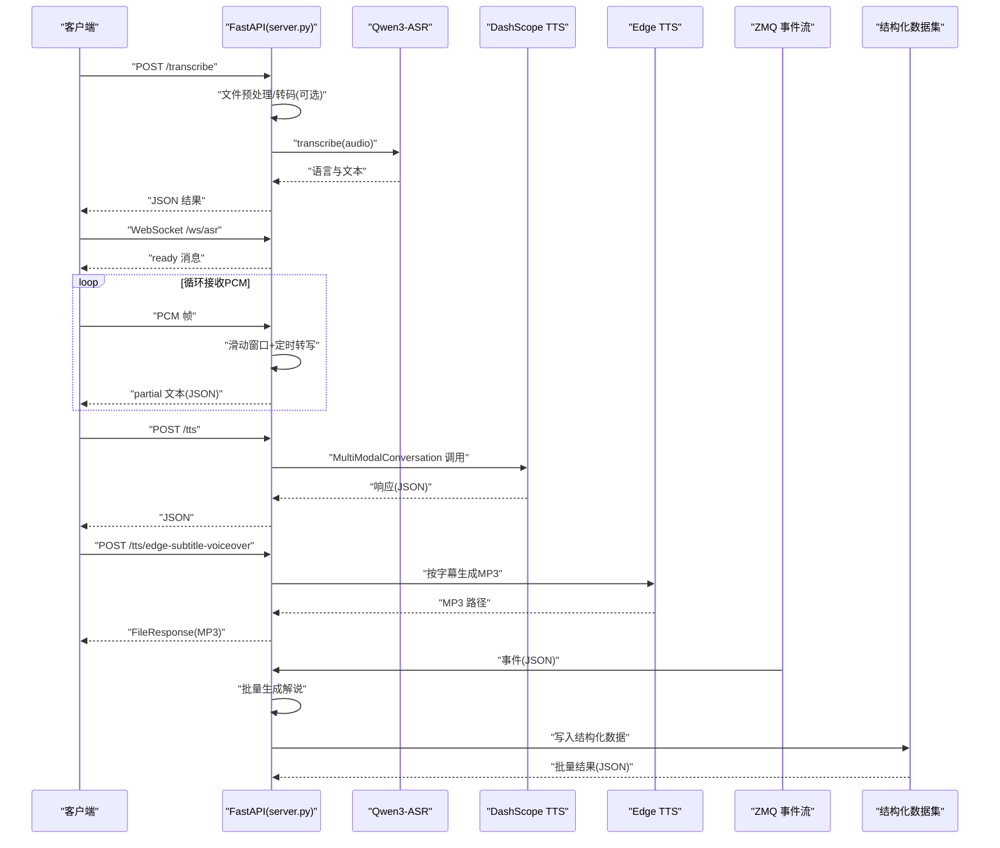
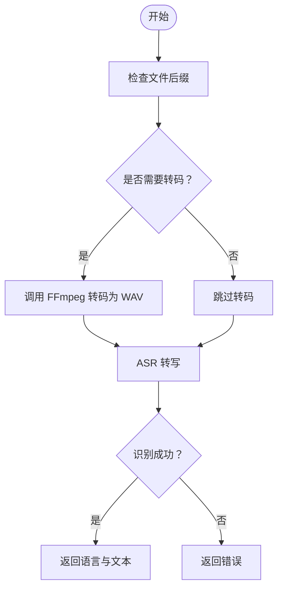
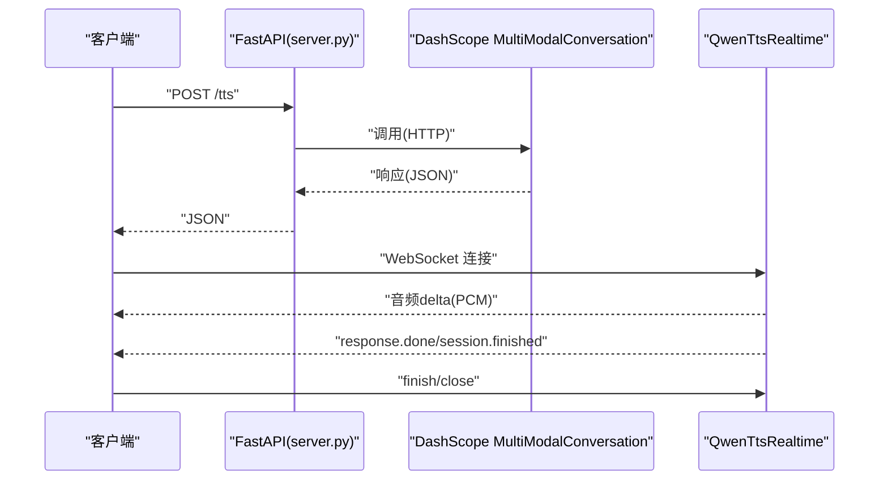
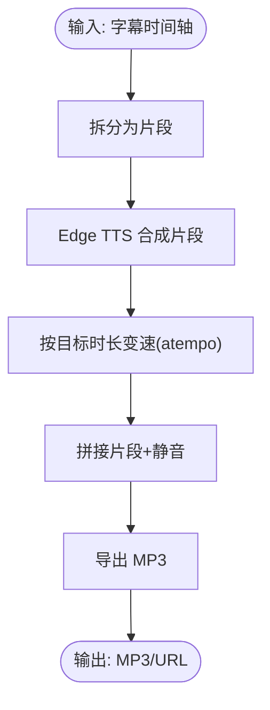
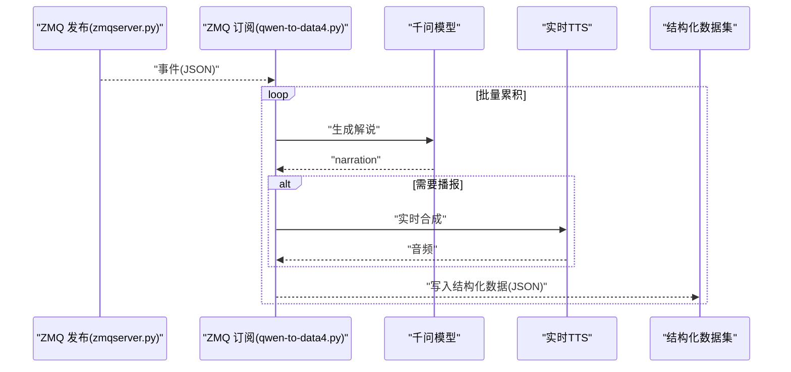
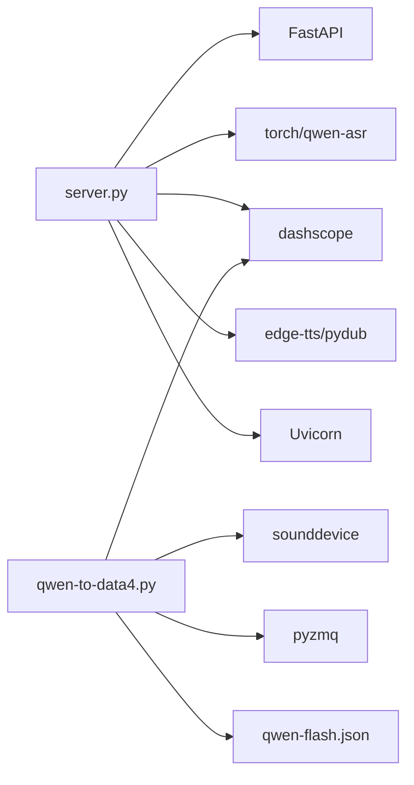

# 故障排除与维护

<cite>
**本文引用的文件**
- [README.md](file://README.md)
- [server.py](file://server.py)
- [requirements.txt](file://requirements.txt)
- [index.py](file://index.py)
- [ttstest.py](file://ttstest.py)
- [qwen3stream.py](file://qwen3stream.py)
- [edge_subtitle_voiceover.py](file://edge_subtitle_voiceover.py)
- [qwen-to-data0.py](file://qwen-to-data0.py)
- [qwen-to-data1.py](file://qwen-to-data1.py)
- [qwen-to-data4.py](file://qwen-to-data4.py)
- [zmqserver.py](file://zmqserver.py)
- [zmqtest.py](file://zmqtest.py)
- [qwen-flash.json](file://qwen-flash.json)
- [subtitles.json](file://subtitles.json)
- [tts_voices_catalog.json](file://tts_voices_catalog.json)
- [zmq_events.jsonl](file://zmq_events.jsonl)
- [zmq_events_20260520_134352.jsonl](file://zmq_events_20260520_134352.jsonl)
- [zmq_events_20260520_135655.jsonl](file://zmq_events_20260520_135655.jsonl)
</cite>

## 更新摘要
**变更内容**
- 更新ZMQ赛事解说流水线架构，从多文件事件日志转向单一结构化数据集
- 新增实时TTS流式处理功能和性能监控指标
- 优化事件处理流程，提高批量处理效率
- 增强错误处理和重试机制

## 目录
1. [简介](#简介)
2. [项目结构](#项目结构)
3. [核心组件](#核心组件)
4. [架构总览](#架构总览)
5. [详细组件分析](#详细组件分析)
6. [依赖分析](#依赖分析)
7. [性能考虑](#性能考虑)
8. [故障排除指南](#故障排除指南)
9. [结论](#结论)
10. [附录](#附录)

## 简介
本手册面向运维与开发人员，围绕语音识别（ASR）与语音合成（TTS）后端服务，提供系统化的故障排除与日常维护指南。内容涵盖：
- 常见问题诊断与解决步骤：ASR识别失败、TTS合成错误、WebSocket连接问题
- 日志分析与错误定位方法
- 内存泄漏检测与处理方案
- 定期维护任务清单：模型更新、缓存清理、磁盘空间管理
- 备份策略与数据恢复流程
- 紧急故障处理预案与回滚机制
- 性能瓶颈分析与优化建议

**更新** 本版本特别关注ZMQ赛事解说流水线的架构优化：从依赖多个事件日志文件（zmq_events_*.jsonl）转向单一的结构化数据集（qwen-flash.json），简化了日志管理和数据备份策略

## 项目结构
该项目采用 FastAPI 提供 REST 与 WebSocket 接口，结合本地 Qwen3-ASR 与阿里云 DashScope TTS，支持浏览器演示页与字幕配音等场景。

```mermaid
graph TB
subgraph "前端"
Demo["演示页 demo.html"]
Vue["组件 SpeechRecorder.vue"]
end
subgraph "后端服务"
API["FastAPI 应用 server.py"]
ASR["Qwen3-ASR 模型"]
TTS["DashScope TTS"]
EdgeTTS["Edge TTS 配音"]
end
subgraph "工具脚本"
ZMQSub["ZMQ 订阅 zmqtest.py"]
ZMQPub["ZMQ 发布 zmqserver.py"]
ZMQBatch["批量解说 qwen-to-data4.py"]
TTSTest["TTS 测试 ttstest.py"]
EdgeVO["字幕配音 edge_subtitle_voiceover.py"]
end
subgraph "日志与数据"
Events["事件日志 zmq_events.jsonl"]
Flash["结构化数据 qwen-flash.json"]
</subgraph>
Demo --> API
Vue --> API
API --> ASR
API --> TTS
API --> EdgeTTS
ZMQSub --> ZMQBatch
ZMQPub --> ZMQSub
TTSTest --> TTS
EdgeVO --> EdgeTTS
ZMQBatch --> Flash
Events --> ZMQBatch
```

**图示来源**
- [server.py:1-452](file://server.py#L1-L452)
- [qwen-to-data4.py:1-800](file://qwen-to-data4.py#L1-L800)
- [zmqserver.py:1-68](file://zmqserver.py#L1-L68)
- [zmqtest.py:1-46](file://zmqtest.py#L1-L46)
- [ttstest.py:1-27](file://ttstest.py#L1-L27)
- [edge_subtitle_voiceover.py:1-223](file://edge_subtitle_voiceover.py#L1-L223)
- [qwen-flash.json:1-200](file://qwen-flash.json#L1-L200)

**章节来源**
- [README.md:5-19](file://README.md#L5-L19)
- [server.py:67-96](file://server.py#L67-L96)

## 核心组件
- FastAPI 应用与路由
  - 健康检查、演示页、上传识别、WebSocket 实时识别、TTS、Edge TTS 与字幕配音等接口
- ASR 引擎
  - Qwen3-ASR 模型加载与推理，支持 CUDA/CPU 设备选择
- TTS 引擎
  - DashScope TTS（HTTP 与实时 WebSocket）
  - Edge TTS 字幕配音（本地 Edge TTS 与 FFmpeg 合成）
- ZMQ 赛事解说流水线
  - 订阅 ZMQ 事件，批量生成解说，可选实时 TTS 播报
  - **更新** 输出单一结构化数据集（qwen-flash.json）替代多文件事件日志

**章节来源**
- [server.py:124-197](file://server.py#L124-L197)
- [server.py:212-247](file://server.py#L212-L247)
- [server.py:250-361](file://server.py#L250-L361)
- [qwen-to-data4.py:773-800](file://qwen-to-data4.py#L773-L800)

## 架构总览
后端服务通过 FastAPI 提供统一入口，内部根据请求类型路由至相应模块：
- 上传识别：文件预处理（必要时 FFmpeg 转码）→ ASR 推理 → 返回语言与文本
- WebSocket 实时识别：接收 PCM 音频帧 → 滑动窗口转写 → 周期性推送 partial 文本
- TTS：DashScope HTTP 接口或实时 WebSocket
- Edge TTS：按字幕时间轴生成配音，支持变速与静音拼接
- **更新** ZMQ 赛事解说流水线：订阅事件 → 批量生成解说 → 输出结构化数据集



**图示来源**
- [server.py:124-197](file://server.py#L124-L197)
- [server.py:367-425](file://server.py#L367-L425)
- [server.py:212-247](file://server.py#L212-L247)
- [edge_subtitle_voiceover.py:166-223](file://edge_subtitle_voiceover.py#L166-L223)
- [qwen-to-data4.py:773-800](file://qwen-to-data4.py#L773-L800)

## 详细组件分析

### ASR 组件（上传识别与 WebSocket）
- 上传识别
  - 支持 WAV/MP3/M4A/OGG/WEBM/FLAC；WEBM/OGG 在无 FFmpeg 时会报错
  - 可选通过 FFmpeg 转码为 WAV 后再识别
  - 识别失败时返回错误
- WebSocket 实时识别
  - 16kHz 单声道 PCM，滑动窗口 + 定时转写
  - 仅当缓冲达到一定阈值时触发转写
  - 出错时发送 error 类型消息



**图示来源**
- [server.py:367-425](file://server.py#L367-L425)

**章节来源**
- [server.py:124-197](file://server.py#L124-L197)
- [server.py:367-425](file://server.py#L367-L425)

### TTS 组件（DashScope 与实时 TTS）
- HTTP TTS
  - 通过 MultiModalConversation 调用，返回 JSON
  - 对响应对象进行安全转换，避免误用属性判断
- 实时 TTS（WebSocket）
  - 使用 QwenTtsRealtime，边收边播
  - 严格等待 response.done 或连接关闭，防止阻塞
  - 提供播放器 drain 与尾音处理



**图示来源**
- [server.py:212-247](file://server.py#L212-L247)
- [qwen3stream.py:161-196](file://qwen3stream.py#L161-L196)
- [qwen-to-data4.py:592-714](file://qwen-to-data4.py#L592-L714)

**章节来源**
- [server.py:212-247](file://server.py#L212-L247)
- [qwen3stream.py:109-156](file://qwen3stream.py#L109-L156)
- [qwen-to-data4.py:592-714](file://qwen-to-data4.py#L592-L714)

### Edge TTS 与字幕配音
- 按字幕时间轴生成配音，支持变速与静音拼接
- 通过 FFmpeg atempo 实现变速，尽量保持音高
- 支持将 MP3 写入服务端缓存并返回可访问 URL



**图示来源**
- [edge_subtitle_voiceover.py:166-223](file://edge_subtitle_voiceover.py#L166-L223)

**章节来源**
- [edge_subtitle_voiceover.py:166-223](file://edge_subtitle_voiceover.py#L166-L223)
- [server.py:300-361](file://server.py#L300-L361)

### ZMQ 赛事解说流水线
- 订阅 ZMQ 事件，按批调用千问生成解说
- 可选实时 TTS 播报，支持强制关闭以避免阻塞
- **更新** 输出单一结构化数据集（qwen-flash.json）替代多文件事件日志



**图示来源**
- [zmqserver.py:11-68](file://zmqserver.py#L11-L68)
- [zmqtest.py:5-46](file://zmqtest.py#L5-L46)
- [qwen-to-data4.py:773-800](file://qwen-to-data4.py#L773-L800)

**章节来源**
- [zmqserver.py:11-68](file://zmqserver.py#L11-L68)
- [zmqtest.py:5-46](file://zmqtest.py#L5-L46)
- [qwen-to-data4.py:773-800](file://qwen-to-data4.py#L773-L800)

## 依赖分析
- 主要依赖
  - FastAPI、Uvicorn、torch、qwen-asr、dashscope、edge-tts、pydub、sounddevice、pyzmq 等
- 环境变量
  - DASHSCOPE_API_KEY、ASR_MODEL_PATH、FFMPEG_PATH、UVICORN_*、ASR_WS_* 等



**图示来源**
- [requirements.txt:1-13](file://requirements.txt#L1-L13)
- [server.py:12-31](file://server.py#L12-L31)

**章节来源**
- [requirements.txt:1-13](file://requirements.txt#L1-L13)
- [server.py:33-43](file://server.py#L33-L43)

## 性能考虑
- 设备与精度
  - 自动选择 CUDA 或 CPU，BF16/BF16 降低显存占用
- 推理参数
  - max_inference_batch_size、max_new_tokens 控制吞吐与长度
- WebSocket 实时识别
  - decode_interval_s 与 max_window_s 控制延迟与窗口大小
- TTS 实时播放
  - 严格等待完成事件或连接关闭，避免阻塞后续播报

**章节来源**
- [server.py:78-95](file://server.py#L78-L95)
- [server.py:136-137](file://server.py#L136-L137)
- [qwen-to-data4.py:661-714](file://qwen-to-data4.py#L661-L714)

## 故障排除指南

### 通用排查步骤
- 确认环境变量
  - DASHSCOPE_API_KEY、ASR_MODEL_PATH、FFMPEG_PATH、UVICORN_* 等
- 检查依赖安装
  - pip install -r requirements.txt
- 查看日志
  - Uvicorn 日志级别与访问日志开关
- 验证模型与音频
  - 本地 ASR 模型路径与完整性
  - FFmpeg 是否可用与路径正确

**章节来源**
- [README.md:48-90](file://README.md#L48-L90)
- [requirements.txt:1-13](file://requirements.txt#L1-L13)
- [server.py:434-451](file://server.py#L434-L451)

### ASR 识别失败
- 现象
  - /transcribe 返回"识别失败"
  - WebSocket /ws/asr 返回 error
- 可能原因
  - 本地 ASR 模型未正确加载
  - 输入音频格式异常或 FFmpeg 转码失败
  - 设备/精度不匹配导致推理异常
- 处理步骤
  - 确认 ASR_MODEL_PATH 指向完整权重目录
  - 若为 WEBM/OGG，确保安装 FFmpeg 并设置 FFMPEG_PATH
  - 检查设备与 dtype 选择（CUDA/CPU）
  - 逐步缩小输入范围，定位具体文件或片段

**章节来源**
- [server.py:88-95](file://server.py#L88-L95)
- [server.py:367-425](file://server.py#L367-L425)
- [server.py:189-190](file://server.py#L189-L190)

### TTS 合成错误
- 现象
  - /tts 返回错误或状态码非 200
  - 实时 TTS 无音频或长时间无响应
- 可能原因
  - 缺少 DASHSCOPE_API_KEY
  - DashScope 接口异常或配额不足
  - 实时 TTS 等待 response.done 超时
- 处理步骤
  - 检查 DASHSCOPE_API_KEY 与地域一致性
  - 使用 ttstest.py 验证 TTS 调用
  - 调整实时 TTS 等待时间，必要时强制关闭连接
  - 分析 qwen-flash.json 中的 tts_realtime 指标

**章节来源**
- [server.py:215-234](file://server.py#L215-L234)
- [ttstest.py:1-27](file://ttstest.py#L1-L27)
- [qwen-to-data4.py:381-427](file://qwen-to-data4.py#L381-L427)
- [qwen-to-data4.py:661-714](file://qwen-to-data4.py#L661-L714)

### WebSocket 连接问题
- 现象
  - /ws/asr 无法建立连接或频繁断开
  - 客户端收不到 partial 文本
- 可能原因
  - 客户端发送格式不符合要求（16kHz 单声道 PCM）
  - 服务端缓冲过小或解码间隔不合理
  - 网络不稳定或代理层中断
- 处理步骤
  - 确认客户端采样率、通道与编码格式
  - 调整 ASR_WS_DECODE_INTERVAL_S 与 ASR_WS_MAX_WINDOW_S
  - 使用 demo.html 验证连接与识别效果

**章节来源**
- [server.py:124-197](file://server.py#L124-L197)
- [server.py:136-137](file://server.py#L136-L137)
- [README.md:120-129](file://README.md#L120-L129)

### 日志分析与错误定位
- 日志位置与级别
  - Uvicorn 日志级别、访问日志开关
- 常用字段
  - 请求路径、状态码、耗时、异常堆栈
- 定位方法
  - 以时间戳对齐前端操作与后端日志
  - 关注 ASR 转码、TTS 调用、WebSocket 事件序列
  - **更新** 对照 qwen-flash.json 与事件 NDJSON 校验流程

**章节来源**
- [server.py:434-451](file://server.py#L434-L451)
- [qwen-flash.json:1-200](file://qwen-flash.json#L1-L200)

### 内存泄漏检测与处理
- 检测手段
  - 监控进程内存曲线，关注持续上涨
  - 重点观察 ASR 推理、TTS 实时播放、FFmpeg 子进程
- 常见原因
  - 未释放的临时文件与音频对象
  - WebSocket 连接未正确关闭导致资源滞留
- 处理方案
  - 确保 finally 分支清理临时文件
  - 实时 TTS 明确等待策略并在超时后强制关闭
  - 使用上下文管理器与后台任务清理

**章节来源**
- [server.py:189-193](file://server.py#L189-L193)
- [server.py:394-400](file://server.py#L394-L400)
- [qwen-to-data4.py:661-714](file://qwen-to-data4.py#L661-L714)

### 定期维护任务清单
- 模型更新
  - 更新 Qwen3-ASR 模型目录，确保完整性
  - 验证加载路径与设备选择
- 缓存清理
  - 清理 edge_voiceover_cache 与临时目录
  - 删除过期的事件 NDJSON 文件
  - **更新** 清理旧的事件日志文件（zmq_events_*.jsonl）
- 磁盘空间管理
  - 监控日志与媒体文件占用
  - 设置轮转与保留策略
  - **更新** 优化日志存储结构，减少文件数量

**章节来源**
- [README.md:38-47](file://README.md#L38-L47)
- [server.py:332-345](file://server.py#L332-L345)

### 备份策略与数据恢复
- 备份对象
  - 模型权重目录、TTS 输出 MP3、**更新** 结构化数据集（qwen-flash.json）、事件日志文件
- 备份方式
  - 增量备份模型目录与关键日志
  - 定期归档 NDJSON 与 JSON 结果
  - **更新** 由于采用单一数据集，备份策略简化为备份 qwen-flash.json 和相关配置
- 恢复流程
  - 恢复模型权重后重启服务
  - 使用 NDJSON 重放事件，重新生成解说与 TTS
  - **更新** 直接加载 qwen-flash.json 进行数据恢复

**章节来源**
- [qwen-flash.json:1-200](file://qwen-flash.json#L1-L200)
- [zmqserver.py:29-64](file://zmqserver.py#L29-L64)

### 紧急故障处理预案与回滚机制
- 预案
  - 识别失败：切换 CPU 推理、降 batch size、缩短 max_new_tokens
  - TTS 失败：回退 HTTP URL 播放、临时禁用实时 TTS
  - WebSocket 断连：调整解码间隔、增加缓冲上限
  - **更新** 数据库故障：使用 qwen-flash.json 进行数据恢复
- 回滚机制
  - 保留上一版本模型与配置
  - 通过环境变量快速切换 ASR/TTS 服务端点
  - **更新** 采用单一数据集便于快速回滚

**章节来源**
- [server.py:78-95](file://server.py#L78-L95)
- [server.py:136-137](file://server.py#L136-L137)
- [README.md:194-204](file://README.md#L194-L204)

### ZMQ 赛事解说流水线故障排除
- 现象
  - 事件日志文件过多，管理困难
  - 批量处理效率低
  - 实时 TTS 播放卡顿
- 可能原因
  - 多文件事件日志导致 I/O 瓶颈
  - 批处理大小不当影响吞吐量
  - 实时 TTS 连接超时或阻塞
- 处理步骤
  - **更新** 切换到单一结构化数据集 qwen-flash.json
  - 调整批量处理大小（--batch-size 参数）
  - 优化实时 TTS 等待策略，设置合理超时时间
  - 监控 tts_realtime 指标，包括 first_audio_delay_ms 和 session_id

**章节来源**
- [qwen-to-data4.py:773-800](file://qwen-to-data4.py#L773-L800)
- [qwen-flash.json:1-200](file://qwen-flash.json#L1-L200)

## 结论
本手册提供了从架构理解到具体故障处理的完整路径。通过规范的日志分析、合理的性能调优与定期维护，可显著提升系统的稳定性与可运维性。**更新** 特别是维护策略的调整，从多文件事件日志转向单一结构化数据集，大大简化了日志管理与备份流程，建议在生产环境中启用更细粒度的日志与监控，并制定自动化巡检与备份策略。

## 附录

### API 一览（与故障排查相关）
- GET /
  - 健康检查
- GET /demo
  - 返回演示页
- POST /transcribe
  - 上传音频识别
- WebSocket /ws/asr
  - 实时识别（PCM→partial 文本）
- POST /tts
  - DashScope TTS（HTTP）
- GET /tts/voices
  - TTS 音色列表
- POST /tts/edge-subtitle-voiceover
  - 字幕配音（MP3）
- GET /tts/edge-voiceover-files/{file_id}
  - 获取生成的 MP3

**章节来源**
- [README.md:100-149](file://README.md#L100-L149)
- [server.py:199-361](file://server.py#L199-L361)

### ZMQ 赛事解说流水线配置参数
- **更新** 批处理参数
  - --batch-size：每批事件数量，默认 10
  - --no-audio：禁用 TTS 合成
  - --voice：TTS 音色，默认 Ethan
  - --tts-instruction：实时 TTS 指令
- **更新** 输出配置
  - --input：输入事件 JSONL 文件
  - --output：输出结构化数据集文件（qwen-flash.json）

**章节来源**
- [qwen-to-data4.py:773-800](file://qwen-to-data4.py#L773-L800)
- [qwen-flash.json:1-200](file://qwen-flash.json#L1-L200)