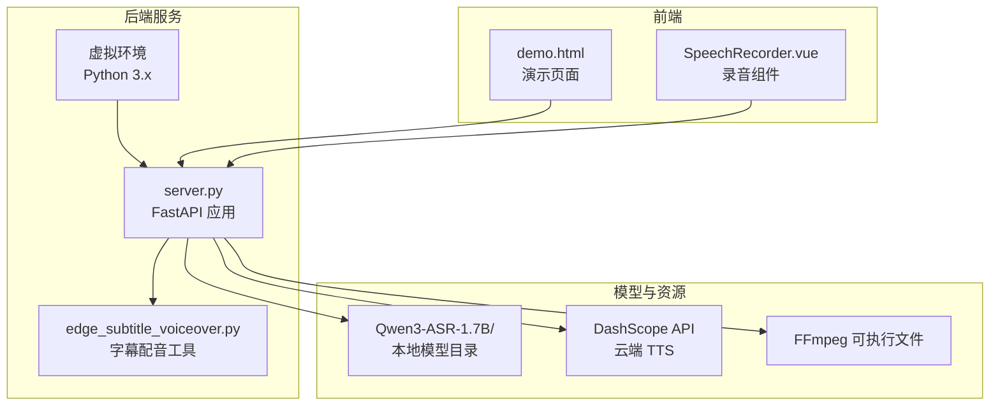
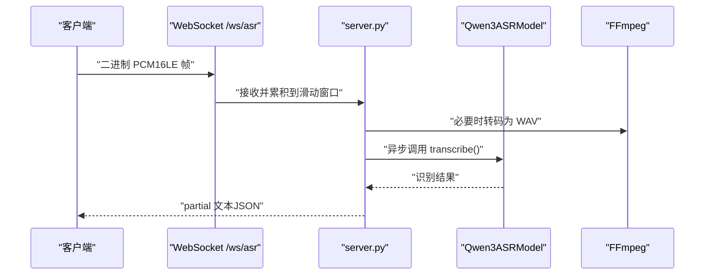
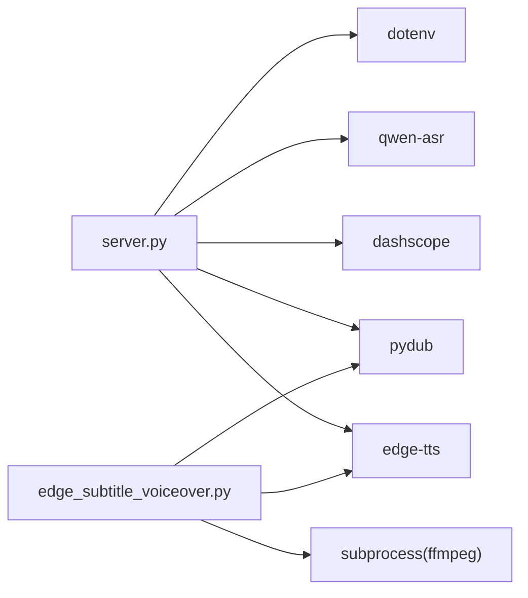

# 环境配置

<cite>
**本文引用的文件**
- [requirements.txt](file://requirements.txt)
- [README.md](file://README.md)
- [server.py](file://server.py)
- [edge_subtitle_voiceover.py](file://edge_subtitle_voiceover.py)
- [ttstest.py](file://ttstest.py)
- [qwen36.py](file://qwen36.py)
- [qwen3stream.py](file://qwen3stream.py)
- [index.py](file://index.py)
- [Qwen3-ASR-1.7B/README.md](file://Qwen3-ASR-1.7B/README.md)
</cite>

## 目录
1. [简介](#简介)
2. [项目结构](#项目结构)
3. [核心组件](#核心组件)
4. [架构总览](#架构总览)
5. [详细组件分析](#详细组件分析)
6. [依赖关系分析](#依赖关系分析)
7. [性能考虑](#性能考虑)
8. [故障排查指南](#故障排查指南)
9. [结论](#结论)
10. [附录](#附录)

## 简介
本指南面向首次部署与运行本项目的用户，提供从硬件到软件、从依赖到环境变量的完整配置说明，帮助您在本地快速搭建稳定可靠的语音识别与语音合成服务。内容涵盖：
- 系统硬件要求（CPU/GPU、内存）
- Python 环境搭建（版本、虚拟环境）
- 依赖安装与版本建议
- 环境变量配置（ASR_MODEL_PATH、DASHSCOPE_API_KEY、FFMPEG_PATH 等）
- ASR 模型本地部署与云端模型切换
- 常见环境问题排查与解决方案

## 项目结构
本项目采用“前端静态页面 + FastAPI 后端”的架构，后端负责：
- 本地 Qwen3-ASR 模型加载与识别
- WebSocket 实时识别
- DashScope TTS 合成
- 字幕时间轴配音（Edge-TTS）

图表来源
- [server.py:1-452](file://server.py#L1-L452)
- [edge_subtitle_voiceover.py:1-223](file://edge_subtitle_voiceover.py#L1-L223)
- [README.md:1-287](file://README.md#L1-L287)

章节来源
- [README.md:5-19](file://README.md#L5-L19)
- [server.py:67-96](file://server.py#L67-L96)

## 核心组件
- 本地 ASR 模型加载与推理：通过 Qwen3ASRModel 从本地路径或 Hugging Face Hub 加载模型，支持 CUDA 设备与 bfloat16 精度。
- WebSocket 实时识别：接收 16kHz 单声道 PCM，按滑动窗口周期性识别并推送 partial 文本。
- DashScope TTS：调用 qwen3-tts-flash 模型进行云端语音合成。
- 字幕时间轴配音：基于 Edge-TTS 与 FFmpeg 对齐字幕时间轴生成 MP3。

章节来源
- [server.py:88-96](file://server.py#L88-L96)
- [server.py:124-197](file://server.py#L124-L197)
- [server.py:212-248](file://server.py#L212-L248)
- [edge_subtitle_voiceover.py:166-223](file://edge_subtitle_voiceover.py#L166-L223)

## 架构总览
后端服务启动时根据环境变量选择模型来源（本地路径或 Hub），同时加载 FFmpeg 用于音频转码。WebSocket 通道接收 PCM 数据，转 WAV 后调用 ASR；HTTP 接口支持文件上传识别与 TTS 合成。

图表来源
- [server.py:124-197](file://server.py#L124-L197)
- [edge_subtitle_voiceover.py:84-94](file://edge_subtitle_voiceover.py#L84-L94)

## 详细组件分析

### 硬件与系统要求
- GPU/CPU 配置建议
  - 推荐使用具备 CUDA 支持的 NVIDIA GPU，以启用 GPU 加速推理。
  - 若无 GPU，可使用 CPU，但推理速度会显著降低。
- 内存需求
  - bfloat16 精度下，单卡显存占用与批量大小相关。建议至少保留 6–12GB 显存余量，避免 OOM。
  - 若显存紧张，可通过减小 max_inference_batch_size 与 max_new_tokens 参数缓解。
- CPU 与内存
  - 至少 8GB 内存起步，推荐 16GB+；多核 CPU 有利于音频转码与并发处理。

章节来源
- [Qwen3-ASR-1.7B/README.md:115-122](file://Qwen3-ASR-1.7B/README.md#L115-L122)
- [server.py:88-96](file://server.py#L88-L96)

### Python 环境搭建
- Python 版本
  - 建议使用 Python 3.10–3.11，确保与依赖包兼容。
- 虚拟环境
  - 推荐使用 venv 或 conda 创建隔离环境，避免全局污染。
  - 在项目根目录创建并激活虚拟环境后，再安装依赖。

章节来源
- [README.md:36](file://README.md#L36)

### 依赖安装
- 安装命令
  - 在虚拟环境中执行：pip install -r requirements.txt
- 主要依赖说明
  - fastapi、uvicorn：Web 服务框架与 ASGI 服务器
  - torch、qwen-asr：本地 ASR 推理
  - dashscope：阿里云百炼 TTS/对话能力
  - pydub、soundfile、sounddevice：音频处理与播放
  - edge-tts：微软 Edge TTS（字幕配音）
  - python-dotenv：.env 环境变量加载
  - pyzmq：ZMQ 赛事解说脚本依赖
- 版本与兼容性
  - 若遇到 torchvision/nms 或 transformers/check_model_inputs 兼容性问题，需统一 torch 与 torchvision 的来源与版本。
  - 若 qwen-asr 与 transformers 版本不匹配，需锁定与 qwen-asr 兼容的 transformers 版本。

章节来源
- [requirements.txt:1-13](file://requirements.txt#L1-L13)
- [README.md:36](file://README.md#L36)
- [README.md:199-200](file://README.md#L199-L200)

### 环境变量配置
- .env 文件位置
  - 与 server.py 同级目录，服务端会从 server.py 所在目录加载 .env，不依赖当前工作目录。
- 关键变量
  - DASHSCOPE_API_KEY：必填，用于 DashScope TTS/对话调用
  - ASR_MODEL_PATH：本地 Qwen3-ASR-1.7B 模型目录（绝对或相对路径，需包含完整权重）
  - FFMPEG_PATH：可选，当 IDE 子进程 PATH 不包含 ffmpeg 时，需显式指定 ffmpeg.exe 绝对路径
  - PUBLIC_BASE_URL：反向代理/公网域名，用于拼接字幕配音链接
  - UVICORN_*：Uvicorn 运行参数（HOST、PORT、RELOAD、LOG_LEVEL 等）
  - ASR_WS_*：WebSocket 识别参数（解码间隔与滑动窗口）
- 示例与说明
  - 本地模型优先：若 ASR_MODEL_PATH 指向的目录存在且包含完整权重，则不会从 Hub 拉取
  - FFmpeg：Windows 上 IDE 启动时 PATH 常与系统 PATH 不一致，需在 .env 中明确指定 FFMPEG_PATH

章节来源
- [README.md:48-83](file://README.md#L48-L83)
- [server.py:33-43](file://server.py#L33-L43)
- [server.py:83](file://server.py#L83)
- [edge_subtitle_voiceover.py:43-81](file://edge_subtitle_voiceover.py#L43-L81)

### ASR 模型本地部署与云端切换
- 本地部署
  - 使用 huggingface-cli 下载完整权重至 Qwen3-ASR-1.7B 目录
  - 启动时若 ASR_MODEL_PATH 指向有效目录，将优先加载本地模型
- 云端 Hub 回退
  - 若本地目录不可用，将回退到 Qwen/Qwen3-ASR-1.7B（国内网络不稳定时建议配置本地路径）
- 推理精度与设备
  - 默认使用 CUDA 设备与 bfloat16 精度；无 GPU 时自动降级为 CPU 与 float32

章节来源
- [README.md:38-47](file://README.md#L38-L47)
- [README.md:80-103](file://README.md#L80-L103)
- [server.py:88-96](file://server.py#L88-L96)
- [index.py:4-11](file://index.py#L4-L11)

### WebSocket 与实时识别
- 输入格式
  - 16kHz 单声道、16bit 小端 PCM（pcm_s16le）
- 行为说明
  - 服务端维护滑动窗口，周期性将窗口内音频转写为 partial 文本
  - 可通过环境变量调整解码间隔与窗口大小

章节来源
- [README.md:120-129](file://README.md#L120-L129)
- [server.py:124-197](file://server.py#L124-L197)
- [server.py:136-137](file://server.py#L136-L137)

### TTS 与字幕配音
- DashScope TTS
  - 默认模型 qwen3-tts-flash，需配置 DASHSCOPE_API_KEY
  - 支持音色列表查询与按音色合成
- Edge 字幕配音
  - 基于 Edge-TTS 与 FFmpeg 对齐字幕时间轴生成 MP3
  - 支持将 MP3 保存到服务端缓存并返回可访问链接

章节来源
- [README.md:130-148](file://README.md#L130-L148)
- [server.py:212-248](file://server.py#L212-L248)
- [edge_subtitle_voiceover.py:166-223](file://edge_subtitle_voiceover.py#L166-L223)

## 依赖关系分析
- 组件耦合
  - server.py 依赖 dotenv、qwen-asr、dashscope、pydub、edge-tts 等
  - edge_subtitle_voiceover.py 依赖 edge-tts、pydub、subprocess（FFmpeg）
- 外部依赖
  - FFmpeg：用于 webm/ogg/m4a/mp3 等格式转码为 WAV
  - DashScope：云端 TTS 与对话能力
- 循环依赖
  - 未发现循环导入；模块职责清晰

图表来源
- [server.py:18-31](file://server.py#L18-L31)
- [edge_subtitle_voiceover.py:11-13](file://edge_subtitle_voiceover.py#L11-L13)

章节来源
- [requirements.txt:1-13](file://requirements.txt#L1-L13)
- [server.py:18-31](file://server.py#L18-L31)
- [edge_subtitle_voiceover.py:11-13](file://edge_subtitle_voiceover.py#L11-L13)

## 性能考虑
- GPU 加速与精度
  - 优先使用 CUDA 与 bfloat16；若显存不足，适当降低 max_inference_batch_size 与 max_new_tokens
- FlashAttention 2
  - 可减少显存占用并加速长输入与大批次推理（需满足硬件与精度条件）
- WebSocket 识别参数
  - 适当增大解码间隔与窗口大小可提升稳定性，但会增加延迟
- FFmpeg 转码
  - 确保 FFmpeg 可用且路径正确，避免因转码失败导致的性能回退

章节来源
- [Qwen3-ASR-1.7B/README.md:91-103](file://Qwen3-ASR-1.7B/README.md#L91-L103)
- [server.py:136-137](file://server.py#L136-L137)
- [edge_subtitle_voiceover.py:84-94](file://edge_subtitle_voiceover.py#L84-L94)

## 故障排查指南
- 连接 huggingface.co 超时
  - 方案：配置有效的本地模型目录 ASR_MODEL_PATH，确保包含 config.json 与权重
- torchvision/nms 或 transformers/check_model_inputs 版本不兼容
  - 方案：卸载不匹配的 torchvision，或重装与 torch 同源的 torch/torchvision
- /tts 缺少 API Key
  - 方案：检查 .env 中 DASHSCOPE_API_KEY，并确认与地域一致（默认北京）
- 演示页 TTS 无法播放
  - 方案：外链 wav 加载受限时，优先使用返回 JSON 中的 url；或扩展后端代理下载
- /transcribe 上传 webm 报格式不识别/找不到 ffmpeg
  - 方案：安装 FFmpeg；若 PowerShell 正常但服务仍报错，在 .env 设置 FFMPEG_PATH 指向 ffmpeg.exe 绝对路径（IDE 子进程 PATH 常不含用户 PATH）

章节来源
- [README.md:194-204](file://README.md#L194-L204)
- [server.py:402-410](file://server.py#L402-L410)

## 结论
按照本指南完成硬件准备、Python 环境与依赖安装、.env 配置与模型部署后，您即可启动服务并体验本地 ASR 与云端 TTS 的完整流程。若遇到性能瓶颈或兼容性问题，可依据“性能考虑”与“故障排查指南”逐步优化与定位。

## 附录

### 环境变量清单
- DASHSCOPE_API_KEY：DashScope API 密钥（必填）
- ASR_MODEL_PATH：本地 Qwen3-ASR-1.7B 模型目录
- FFMPEG_PATH：ffmpeg.exe 绝对路径（IDE 子进程 PATH 不包含时必填）
- PUBLIC_BASE_URL：反向代理/公网域名（字幕配音链接拼接）
- UVICORN_HOST/PORT/RELOAD/LOG_LEVEL：Uvicorn 运行参数
- ASR_WS_DECODE_INTERVAL_S/ASR_WS_MAX_WINDOW_S：WebSocket 识别参数

章节来源
- [README.md:48-83](file://README.md#L48-L83)
- [server.py:434-451](file://server.py#L434-L451)