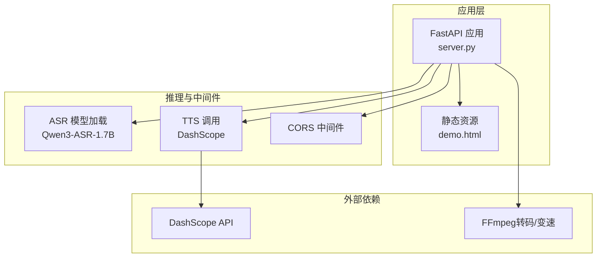
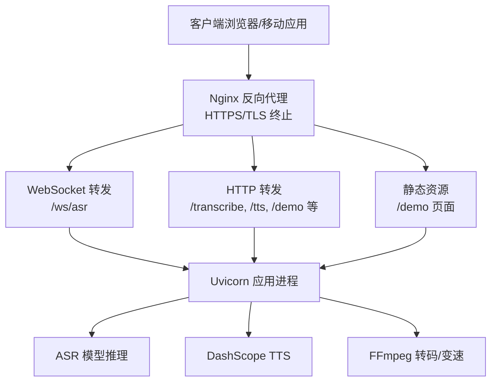
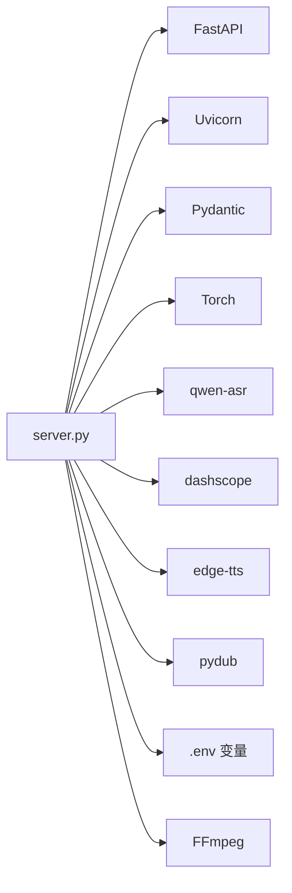

# 生产部署

<cite>
**本文引用的文件**
- [server.py](file://server.py)
- [README.md](file://README.md)
- [requirements.txt](file://requirements.txt)
- [edge_subtitle_voiceover.py](file://edge_subtitle_voiceover.py)
- [ttstest.py](file://ttstest.py)
- [qwen3stream.py](file://qwen3stream.py)
- [qwen-to-data4.py](file://qwen-to-data4.py)
- [zmqserver.py](file://zmqserver.py)
</cite>

## 目录
1. [简介](#简介)
2. [项目结构](#项目结构)
3. [核心组件](#核心组件)
4. [架构总览](#架构总览)
5. [详细组件分析](#详细组件分析)
6. [依赖分析](#依赖分析)
7. [性能考虑](#性能考虑)
8. [故障排查指南](#故障排查指南)
9. [结论](#结论)
10. [附录](#附录)

## 简介
本指南面向生产环境部署，围绕 Uvicorn 服务器配置、Nginx 反向代理（含 WebSocket 与静态文件）、Gunicorn 进程管理、Docker 容器化、负载均衡与高可用、SSL 与 HTTPS、性能调优与资源限制等方面，结合代码库实际实现进行说明。目标是在确保稳定性与性能的前提下，快速、安全地上线语音识别与语音合成服务。

## 项目结构
- 后端服务由 FastAPI 提供，内置 Uvicorn 用于本地开发与简单部署。
- 服务包含：
  - 静态页面演示与健康检查
  - 上传音频识别（POST /transcribe）
  - WebSocket 实时识别（/ws/asr）
  - TTS 接口（/tts 与 /tts/voices）
  - 边缘字幕配音（/tts/edge-... 与 /tts/edge-voiceover-files）
- 依赖与运行环境通过 requirements.txt 管理，模型与外部服务（DashScope）通过环境变量配置。

图表来源
- [server.py:67-76](file://server.py#L67-L76)
- [server.py:83-95](file://server.py#L83-L95)
- [server.py:212-247](file://server.py#L212-L247)
- [server.py:300-321](file://server.py#L300-L321)
- [edge_subtitle_voiceover.py:43-81](file://edge_subtitle_voiceover.py#L43-L81)

章节来源
- [README.md:5-19](file://README.md#L5-L19)
- [requirements.txt:1-13](file://requirements.txt#L1-L13)

## 核心组件
- Uvicorn 服务器：内置在 server.py 中，支持通过环境变量配置主机、端口、日志级别、访问日志与代理头。
- WebSocket 识别：/ws/asr 使用滑动窗口与周期性识别，支持通过环境变量调节解码间隔与窗口大小。
- TTS 与字幕配音：/tts 调用 DashScope，/tts/edge-... 通过 Edge-TTS 与 FFmpeg 实现字幕对齐与变速。
- CORS 与静态资源：默认允许跨域，/demo 返回静态页面；/tts/edge-voiceover-files 提供生成的音频文件。

章节来源
- [server.py:434-451](file://server.py#L434-L451)
- [server.py:124-197](file://server.py#L124-L197)
- [server.py:212-247](file://server.py#L212-L247)
- [server.py:300-360](file://server.py#L300-L360)
- [server.py:69-76](file://server.py#L69-L76)

## 架构总览
生产部署可采用“反向代理 + 应用服务器 + 外部服务”的三层架构。Nginx 作为入口，负责 TLS 终止、静态资源与 WebSocket 转发；应用服务器（Uvicorn/Gunicorn）承载 FastAPI 服务；外部服务包括 DashScope 与 FFmpeg。

图表来源
- [server.py:124-197](file://server.py#L124-L197)
- [server.py:367-424](file://server.py#L367-L424)
- [edge_subtitle_voiceover.py:84-94](file://edge_subtitle_voiceover.py#L84-L94)

## 详细组件分析

### Uvicorn 服务器配置（生产）
- 主机绑定与端口
  - 默认监听 0.0.0.0:8000；可通过环境变量 UVICORN_HOST/HOST 与 UVICORN_PORT/PORT 调整。
- 日志级别
  - 默认 info；可通过 UVICORN_LOG_LEVEL 调整。
- 访问日志与代理头
  - 可通过 UVICORN_ACCESS_LOG 控制访问日志开关；UVICORN_PROXY_HEADERS 控制是否启用代理头。
- 热重载
  - UVICORN_RELOAD 控制是否启用开发模式热重载（生产不建议开启）。
- 反向代理场景
  - 在反向代理后部署时，建议设置 PUBLIC_BASE_URL，以确保 /tts/edge-subtitle-voiceover/link 返回正确绝对链接。

章节来源
- [server.py:434-451](file://server.py#L434-L451)
- [server.py:46-51](file://server.py#L46-L51)
- [README.md:68-76](file://README.md#L68-L76)

### Nginx 反向代理配置（含 WebSocket 与静态文件）
- 基本要点
  - HTTPS 终止：建议使用 Let's Encrypt 或商业证书，开启强密码套件与 HSTS。
  - 静态资源：/demo 页面与前端资源由 Nginx 直接提供，减少应用压力。
  - WebSocket：/ws/asr 需启用 proxy_set_header Upgrade 与 proxy_set_header Connection，同时设置较长超时与大缓冲。
- 示例要点（描述性说明）
  - upstream 指向本地 Uvicorn 进程（如 127.0.0.1:8000）。
  - location /demo 与静态目录映射。
  - location /ws/asr 使用 proxy_pass 指向上游，并设置 upgrade 相关头与超时。
  - location /transcribe、/tts、/tts/edge-... 等转发至上游。
  - 静态音频文件 /tts/edge-voiceover-files/* 由 Nginx 直接提供或通过上游代理。

章节来源
- [server.py:204-209](file://server.py#L204-L209)
- [server.py:348-360](file://server.py#L348-L360)

### Gunicorn 部署方案与进程管理
- 进程与线程
  - 建议使用 gunicorn 作为 WSGI 服务器承载 FastAPI 应用（需要将 app 作为 WSGI 可调用对象）。
  - 进程数：CPU 核心数 × 2 + 1（经验公式），根据内存与 GPU 情况调整。
  - 线程数：每个进程内可配置线程池，满足 I/O 密集型任务（如音频转码）。
- 进程管理
  - 使用 systemd 或 supervisor 管理 gunicorn 进程，实现自动重启与日志切割。
  - 配置 worker_class 为 sync 或 gthread，依据业务并发特征选择。
- 与 Uvicorn 的区别
  - Uvicorn 更适合开发与轻量部署；Gunicorn 在生产中具备更成熟的进程管理能力。

章节来源
- [server.py:67](file://server.py#L67)
- [requirements.txt:1-13](file://requirements.txt#L1-L13)

### Docker 容器化部署
- 基础镜像与依赖
  - 建议基于 Python 官方镜像（如 python:3.x-slim），安装系统依赖（如 FFmpeg）。
  - 通过 requirements.txt 安装 Python 依赖。
- 模型与资源
  - 将 ASR 模型目录挂载为只读卷，避免容器内重复下载。
  - TTS 音频缓存目录可挂载为持久卷，便于清理与备份。
- 运行参数
  - 暴露端口 8000（或 Nginx 映射的端口）。
  - 设置环境变量（DASHSCOPE_API_KEY、ASR_MODEL_PATH、FFMPEG_PATH 等）。
  - 如需 GPU，使用 nvidia-container-toolkit 并在 docker run 添加 --gpus。
- 示例步骤（描述性说明）
  - 构建镜像：docker build -t vue3speech-prod .
  - 运行容器：docker run -d --name vue3speech -p 80:8000 --mount type=volume,source=model_vol,destination=/app/Qwen3-ASR-1.7B --mount type=volume,source=cache_vol,destination=/app/edge_voiceover_cache vue3speech-prod

章节来源
- [requirements.txt:1-13](file://requirements.txt#L1-L13)
- [README.md:38-46](file://README.md#L38-L46)
- [edge_subtitle_voiceover.py:43-81](file://edge_subtitle_voiceover.py#L43-L81)

### 负载均衡与高可用架构
- 架构设计
  - 多实例：部署多个应用实例（物理机/虚拟机/容器），由 Nginx 或 HAProxy 做四层/七层负载均衡。
  - 会话亲和：WebSocket 会话建议使用粘性会话或共享状态（如 Redis）。
  - 健康检查：定期探测 / 与 /demo，失败实例自动摘除。
- 数据与缓存
  - 模型与静态资源尽量本地化或使用共享存储。
  - TTS 音频缓存统一管理，避免节点间重复生成。
- 扩展策略
  - CPU 密集型：增加实例数量，配合限流与队列。
  - I/O 密集型：优化磁盘与网络，必要时引入 SSD 与 CDN。

章节来源
- [server.py:124-197](file://server.py#L124-L197)
- [server.py:300-360](file://server.py#L300-L360)

### SSL 证书与 HTTPS 部署
- 证书获取
  - 使用 Certbot 获取免费证书，或购买商业证书。
- Nginx 配置要点
  - listen 443 ssl，配置证书与私钥路径。
  - 启用 TLS 1.2/1.3 与现代密码套件。
  - 启用 HSTS 与 OCSP Stapling。
- WebSocket 与静态资源
  - WebSocket 代理需保留 Upgrade 头，确保升级成功。
  - 静态资源建议由 Nginx 直接提供，减少应用负担。

章节来源
- [server.py:204-209](file://server.py#L204-L209)
- [server.py:348-360](file://server.py#L348-L360)

### 性能调优与资源限制
- Uvicorn/Gunicorn 参数
  - worker 数量：CPU 核心数 × 2 + 1；线程池大小视 I/O 任务而定。
  - keepalive 与超时：根据请求特征设置，避免长时间占用连接。
- 模型与推理
  - ASR 模型 dtype 与 device_map 已按 CUDA/CPU 自动选择；推理批大小与 token 数限制在模型初始化时设定。
  - WebSocket 识别窗口与解码间隔可通过环境变量调节，平衡延迟与准确性。
- 外部依赖
  - FFmpeg 路径与可用性：在 IDE 环境下常见 PATH 不一致问题，建议在 .env 中显式设置 FFMPEG_PATH。
  - DashScope TTS：合理设置音色与指令，避免频繁切换造成抖动。
- 资源限制
  - Docker：设置 CPU/内存限制，防止突发流量导致 OOM。
  - systemd/supervisor：设置最大重启次数与日志轮转。

章节来源
- [server.py:78-81](file://server.py#L78-L81)
- [server.py:89-95](file://server.py#L89-L95)
- [server.py:136-137](file://server.py#L136-L137)
- [edge_subtitle_voiceover.py:43-81](file://edge_subtitle_voiceover.py#L43-L81)
- [README.md:196-204](file://README.md#L196-L204)

## 依赖分析
- 应用依赖
  - FastAPI、Uvicorn、Pydantic、Torch、qwen-asr、dashscope、edge-tts、pydub、python-dotenv 等。
- 外部依赖
  - DashScope API（TTS 与对话）
  - FFmpeg（音频转码与变速）
- 环境变量
  - DASHSCOPE_API_KEY、ASR_MODEL_PATH、FFMPEG_PATH、UVICORN_*、ASR_WS_*、PUBLIC_BASE_URL 等。

图表来源
- [requirements.txt:1-13](file://requirements.txt#L1-L13)
- [server.py:12-31](file://server.py#L12-L31)

章节来源
- [requirements.txt:1-13](file://requirements.txt#L1-L13)
- [server.py:427-431](file://server.py#L427-L431)

## 性能考虑
- I/O 优化
  - 使用异步 I/O 与线程池处理音频转码与文件操作，避免阻塞主事件循环。
  - WebSocket 识别采用滑动窗口与周期性识别，降低模型调用频率。
- 缓存与复用
  - TTS 音频缓存目录统一管理，避免重复合成。
  - 模型加载后复用，避免重复初始化。
- 资源隔离
  - Docker 容器内限制 CPU/内存，防止突发流量影响整体稳定性。
  - 多实例部署，结合负载均衡与健康检查。

章节来源
- [server.py:176-193](file://server.py#L176-L193)
- [server.py:332-345](file://server.py#L332-L345)

## 故障排查指南
- 模型加载失败或超时
  - 确认 ASR_MODEL_PATH 指向包含完整权重的本地目录，避免网络超时。
- TTS 缺少 API Key
  - 检查 .env 中 DASHSCOPE_API_KEY 是否正确配置。
- WebSocket 无法升级或连接中断
  - 确认 Nginx 已转发 Upgrade 与 Connection 头，超时与缓冲设置合理。
- 上传音频转码失败
  - 安装 FFmpeg 并在 .env 中设置 FFMPEG_PATH；IDE 子进程 PATH 常与系统 PATH 不一致。
- 静态页面无法访问
  - 确认 /demo 路由与 demo.html 存在，Nginx 静态资源映射正确。

章节来源
- [README.md:196-204](file://README.md#L196-L204)
- [server.py:204-209](file://server.py#L204-L209)
- [edge_subtitle_voiceover.py:43-81](file://edge_subtitle_voiceover.py#L43-L81)

## 结论
通过合理的服务器配置、反向代理与负载均衡、容器化与资源限制，以及完善的性能与故障排查机制，Vue3Speech 语音服务可在生产环境中稳定运行。建议优先采用 Nginx + Gunicorn/Uvicorn 的组合，并结合 Docker 与多实例部署实现高可用与弹性扩展。

## 附录

### 环境变量清单（生产）
- 服务器与运行
  - UVICORN_HOST / HOST
  - UVICORN_PORT / PORT
  - UVICORN_LOG_LEVEL
  - UVICORN_ACCESS_LOG
  - UVICORN_PROXY_HEADERS
  - UVICORN_RELOAD
- WebSocket 识别
  - ASR_WS_DECODE_INTERVAL_S
  - ASR_WS_MAX_WINDOW_S
- 服务与外部依赖
  - DASHSCOPE_API_KEY
  - ASR_MODEL_PATH
  - FFMPEG_PATH
  - PUBLIC_BASE_URL

章节来源
- [README.md:48-66](file://README.md#L48-L66)
- [README.md:68-82](file://README.md#L68-L82)
- [server.py:434-451](file://server.py#L434-L451)