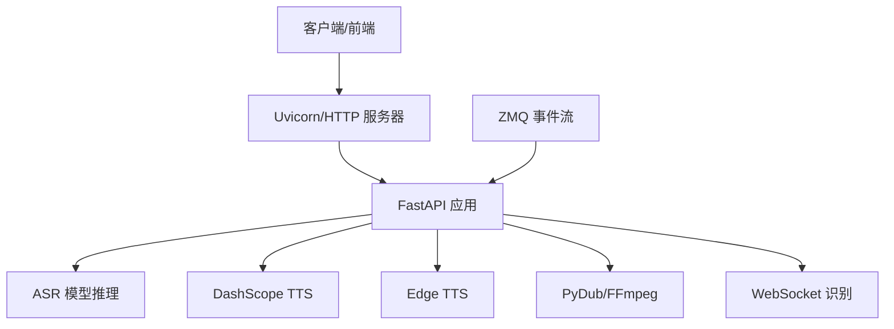
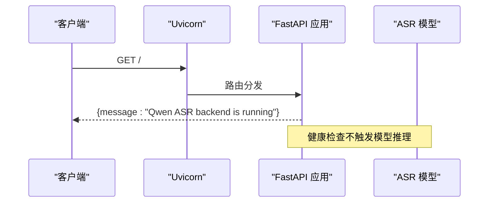
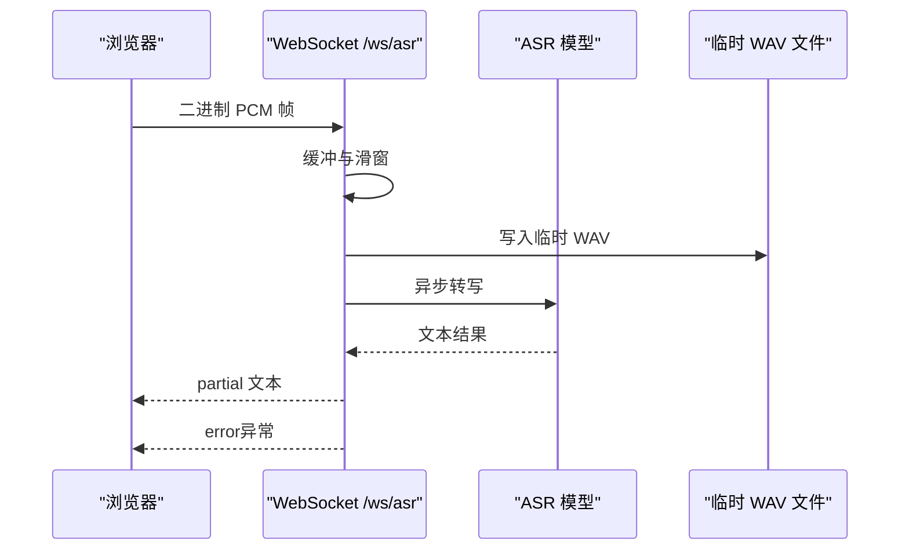
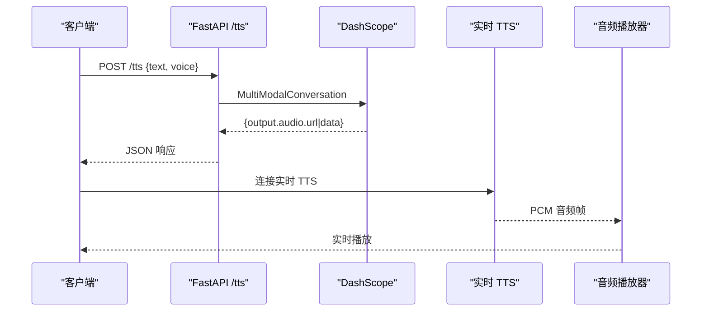
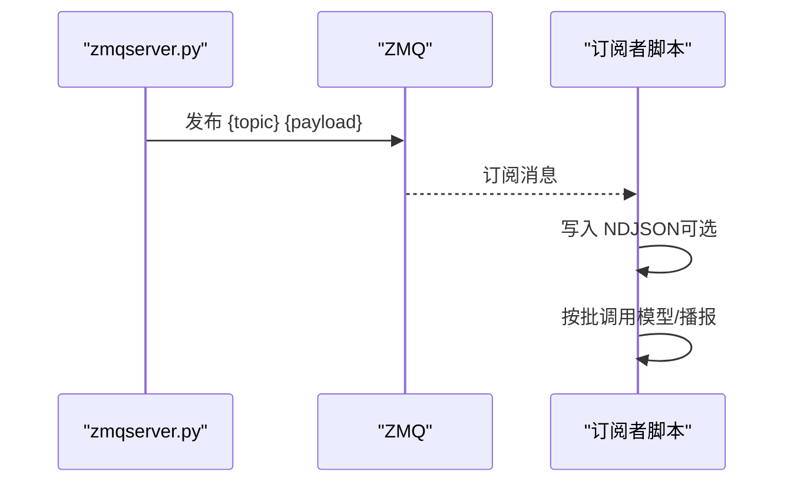
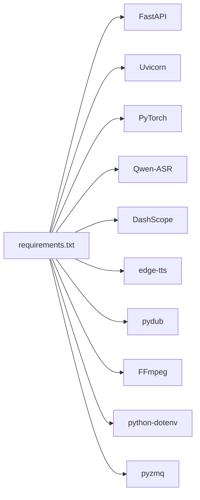

# 监控告警

<cite>
**本文引用的文件**
- [server.py](file://server.py)
- [README.md](file://README.md)
- [requirements.txt](file://requirements.txt)
- [edge_subtitle_voiceover.py](file://edge_subtitle_voiceover.py)
- [qwen3stream.py](file://qwen3stream.py)
- [qwen-to-data0.py](file://qwen-to-data0.py)
- [qwen-to-data4.py](file://qwen-to-data4.py)
- [zmqserver.py](file://zmqserver.py)
- [playvideo.py](file://playvideo.py)
- [ttstest.py](file://ttstest.py)
</cite>

## 目录
1. [简介](#简介)
2. [项目结构](#项目结构)
3. [核心组件](#核心组件)
4. [架构总览](#架构总览)
5. [详细组件分析](#详细组件分析)
6. [依赖分析](#依赖分析)
7. [性能考虑](#性能考虑)
8. [故障排查指南](#故障排查指南)
9. [结论](#结论)
10. [附录](#附录)

## 简介
本指南面向语音识别与语音合成系统的运维与开发团队，提供一套完整的系统监控与告警配置方案。内容涵盖关键性能指标（CPU、内存、GPU 显存、网络延迟）的采集与观测方法，Prometheus 监控集成与 Grafana 仪表板配置思路，日志收集与分类管理策略，健康检查端点与自检机制，告警规则设计（服务可用性、响应时间阈值、异常检测），以及性能基准测试与容量规划建议。

## 项目结构
该系统由 FastAPI 后端提供 REST/WebSocket 接口，结合本地 ASR 模型与云端 TTS 服务，同时包含基于 ZeroMQ 的赛事事件流处理脚本。核心模块如下：
- FastAPI 应用与路由：提供健康检查、音频转写、实时流式识别、TTS、字幕配音等接口
- ASR/TTS 依赖：PyTorch、Qwen-ASR、DashScope、edge-tts、FFmpeg
- 零拷贝/低延迟音频处理：基于 PyDub 与 FFmpeg 的音频拼接与变速
- 实时 TTS 回放：基于 DashScope 实时 TTS 的 WebSocket 会话与音频播放
- 日志与事件：ZMQ 事件回放与订阅、NDJSON 订阅日志

```mermaid
graph TB
subgraph "后端服务"
S["FastAPI 应用<br/>server.py"]
ASR["Qwen3-ASR 模型"]
TTS["DashScope TTS"]
EDGE["Edge TTS"]
end
subgraph "音频处理"
PYD["PyDub/FFmpeg"]
WSP["WebSocket 流式识别"]
end
subgraph "实时播报"
RT["DashScope 实时 TTS"]
AUD["音频播放器"]
end
subgraph "事件流"
ZMQ["ZeroMQ PUB/SUB"]
ZS["zmqserver.py"]
end
S --> ASR
S --> TTS
S --> EDGE
S --> PYD
S --> WSP
RT --> AUD
ZMQ <- --> ZS
ZMQ --> S
```

图表来源
- [server.py:67-451](file://server.py#L67-L451)
- [edge_subtitle_voiceover.py:166-223](file://edge_subtitle_voiceover.py#L166-L223)
- [qwen3stream.py:161-196](file://qwen3stream.py#L161-L196)
- [zmqserver.py:11-68](file://zmqserver.py#L11-L68)

章节来源
- [README.md:5-19](file://README.md#L5-L19)
- [requirements.txt:1-13](file://requirements.txt#L1-L13)

## 核心组件
- FastAPI 应用与中间件
  - CORS 中间件启用跨域
  - Uvicorn 运行参数支持主机、端口、日志级别、访问日志开关、代理头
- WebSocket 实时识别
  - 按固定解码间隔与滑动窗口周期性转写
- 音频转写接口
  - 支持多种音频格式，必要时通过 FFmpeg 转码
- TTS 接口
  - DashScope MultiModalConversation 调用，支持整段与实时 TTS
- 字幕配音
  - 基于 Edge TTS 与 FFmpeg atempo 的变速拼接
- 零拷贝事件流
  - ZMQ PUB/SUB 订阅与回放，NDJSON 记录

章节来源
- [server.py:67-451](file://server.py#L67-L451)
- [edge_subtitle_voiceover.py:166-223](file://edge_subtitle_voiceover.py#L166-L223)
- [qwen3stream.py:161-196](file://qwen3stream.py#L161-L196)
- [zmqserver.py:11-68](file://zmqserver.py#L11-L68)

## 架构总览
系统采用“后端 API + 本地模型 + 云服务”的混合架构。后端负责接入层与编排，本地模型承担 ASR 推理，云端服务承担 TTS 与大模型生成。音频处理与实时播报通过 FFmpeg 与 DashScope 实时 TTS 完成。事件流通过 ZMQ 实现低延迟广播与回放。



图表来源
- [server.py:67-451](file://server.py#L67-L451)
- [qwen-to-data4.py:852-899](file://qwen-to-data4.py#L852-L899)

## 详细组件分析

### FastAPI 应用与健康检查
- 健康检查端点：GET /
- 访问日志：可通过 UVICORN_ACCESS_LOG 控制是否记录
- 自检机制：返回服务状态消息，可用于探活与容器编排
- 性能相关参数：UVICORN_HOST、UVICORN_PORT、UVICORN_LOG_LEVEL、UVICORN_PROXY_HEADERS



图表来源
- [server.py:199-201](file://server.py#L199-L201)

章节来源
- [server.py:199-201](file://server.py#L199-L201)
- [server.py:434-451](file://server.py#L434-L451)

### WebSocket 实时识别流程
- 输入：16kHz 单声道 PCM（int16）
- 处理：滑动窗口 + 周期性转写，周期由环境变量控制
- 输出：partial 文本更新
- 异常：错误类型通过 JSON error 消息返回



图表来源
- [server.py:124-196](file://server.py#L124-L196)

章节来源
- [server.py:124-196](file://server.py#L124-L196)

### 音频转写接口
- 支持格式：WAV、MP3、M4A、OGG、WEBM、FLAC
- 转码：当输入为 WEBM/OGG 时，若检测到 FFmpeg 可用则转码为 WAV
- 错误处理：转码失败与转写失败均有明确错误码与消息


图表来源
- [server.py:367-425](file://server.py#L367-L425)

章节来源
- [server.py:367-425](file://server.py#L367-L425)

### TTS 接口与实时播报
- 整段 TTS：DashScope MultiModalConversation，返回音频 URL 或 base64
- 实时 TTS：DashScope 实时 WebSocket，边收边播，支持首包延迟统计
- 音频播放：优先流式播放（ffplay/mpv），否则下载后 pygame 播放



图表来源
- [server.py:212-247](file://server.py#L212-L247)
- [qwen3stream.py:161-196](file://qwen3stream.py#L161-L196)
- [playvideo.py:35-91](file://playvideo.py#L35-L91)

章节来源
- [server.py:212-247](file://server.py#L212-L247)
- [qwen3stream.py:161-196](file://qwen3stream.py#L161-L196)
- [playvideo.py:35-91](file://playvideo.py#L35-L91)

### 字幕配音与变速
- 基于 Edge TTS 生成每句配音
- 使用 FFmpeg atempo 进行变速，尽量保持音高
- 按字幕时间戳拼接，句间插入静音


图表来源
- [edge_subtitle_voiceover.py:166-223](file://edge_subtitle_voiceover.py#L166-L223)

章节来源
- [edge_subtitle_voiceover.py:166-223](file://edge_subtitle_voiceover.py#L166-L223)

### 零拷贝事件流与回放
- ZMQ PUB/SUB：事件以 topic+payload 形式传输
- 回放脚本：按固定间隔逐行回放 NDJSON 事件
- 订阅日志：可选将收到的事件写入 NDJSON 文件



图表来源
- [zmqserver.py:11-68](file://zmqserver.py#L11-L68)
- [qwen-to-data4.py:852-899](file://qwen-to-data4.py#L852-L899)

章节来源
- [zmqserver.py:11-68](file://zmqserver.py#L11-L68)
- [qwen-to-data4.py:852-899](file://qwen-to-data4.py#L852-L899)

## 依赖分析
- 运行时依赖：FastAPI、Uvicorn、PyTorch、Qwen-ASR、DashScope、edge-tts、pydub、FFmpeg、python-dotenv、pyzmq
- 关键耦合点：
  - ASR 模型加载与设备选择（CUDA/ CPU）
  - FFmpeg 路径解析与转码
  - DashScope API Key 与地域配置
  - WebSocket 与实时 TTS 的并发与资源释放



图表来源
- [requirements.txt:1-13](file://requirements.txt#L1-L13)

章节来源
- [requirements.txt:1-13](file://requirements.txt#L1-L13)

## 性能考虑
- 设备与精度
  - CUDA 可用时使用 bf16，否则使用 fp32
  - 设备选择影响推理吞吐与显存占用
- 推理批大小
  - ASR 最大推理批大小限制为 32，可根据显存调整
- 网络与 I/O
  - FFmpeg 转码与音频拼接为 I/O 密集操作，建议使用高性能磁盘与合适的缓冲
- 实时 TTS
  - 首包延迟与会话关闭等待时间可调，避免阻塞后续播报
- WebSocket
  - 解码间隔与滑动窗口决定实时性与稳定性的平衡

章节来源
- [server.py:78-95](file://server.py#L78-L95)
- [server.py:136-137](file://server.py#L136-L137)
- [qwen3stream.py:161-196](file://qwen3stream.py#L161-L196)
- [qwen-to-data4.py:837-843](file://qwen-to-data4.py#L837-L843)

## 故障排查指南
- FFmpeg 缺失或路径问题
  - 现象：上传 WEBM/OGG 报格式不识别或找不到 ffmpeg
  - 处理：设置 FFMPEG_PATH 或将 ffmpeg 加入系统 PATH
- DashScope API Key 缺失或地域不一致
  - 现象：/tts 报错
  - 处理：检查 .env 中 DASHSCOPE_API_KEY，确认地域与 URL 一致
- 模型加载超时
  - 现象：连接 huggingface.co 超时
  - 处理：配置 ASR_MODEL_PATH 指向本地完整权重目录
- WebSocket 实时播报“播一半就停”
  - 现象：实时 TTS 会话未及时结束导致阻塞
  - 处理：调整实时 TTS finish 等待时间，避免过短截断尾音或过长阻塞

章节来源
- [README.md:194-204](file://README.md#L194-L204)
- [server.py:394-410](file://server.py#L394-L410)

## 结论
本指南提供了从指标采集、监控集成、日志管理到告警规则与性能优化的全栈方案。建议在生产环境中结合 Prometheus/Grafana 实施统一监控，并针对 ASR 推理、TTS 与实时播报的关键路径建立 SLI/SLO，配合自动化告警与容量规划，确保系统稳定与用户体验。

## 附录

### 关键性能指标与采集建议
- CPU 使用率
  - 采集：系统级 CPU 使用率、Python 进程 CPU 使用率
  - 建议：关注 ASR 推理阶段的 CPU 占用峰值
- 内存占用
  - 采集：系统内存与进程 RSS/VSZ
  - 建议：监控 ASR 模型加载与推理过程的内存波动
- GPU 显存使用情况
  - 采集：nvidia-smi 显存占用、PyTorch 分配统计
  - 建议：关注 CUDA 设备上的显存峰值与碎片化
- 网络延迟
  - 采集：DashScope API 延迟、WebSocket 延迟、FFmpeg 转码耗时
  - 建议：记录首包延迟与会话关闭等待时间

### Prometheus 监控集成方案
- Exporter 选择
  - Node Exporter：系统 CPU/内存/磁盘/网络
  - nvidia_gpu_exporter：GPU 显存与利用率
  - 自定义 Exporter：采集 ASR/TTS 推理耗时与错误计数
- 指标命名
  - 服务可用性：up{job="qwen-asr-backend"}
  - 响应时间：histogram_quantile(0.95, sum by(le, endpoint) (rate(http_request_duration_seconds_bucket[5m])))
  - 错误率：rate(http_request_total{status=~"5.."}[5m])

### Grafana 仪表板配置思路
- 面板建议
  - 系统负载：CPU 使用率、内存使用、磁盘 I/O
  - GPU 资源：显存使用、显存分配、GPU 利用率
  - 业务指标：ASR 推理耗时分布、TTS 成功率与平均时延、实时 TTS 首包延迟
  - 日志聚合：按错误类型与接口维度统计

### 日志收集与分析策略
- 访问日志
  - 采集：Uvicorn access_log，按天轮转
  - 分类：按接口、状态码、响应时间分桶
- 错误日志
  - 采集：ASR 转码失败、TTS 请求失败、WebSocket 异常
  - 分类：按错误类型与上游依赖（FFmpeg/DashScope）归类
- 业务日志
  - 采集：ZMQ 事件订阅日志（NDJSON）、实时播报会话元数据
  - 分析：事件到达时延、播报时延、会话完成率

### 健康检查端点与自检机制
- 健康检查：GET / 返回服务状态
- 自检：启动时加载模型与依赖，失败快速暴露
- 探活：容器编排中使用 HTTP 探针访问 /，结合就绪探针避免流量导入

章节来源
- [server.py:199-201](file://server.py#L199-L201)
- [server.py:434-451](file://server.py#L434-L451)

### 告警规则配置
- 服务可用性
  - up == 0 或 5xx 比例过高
- 响应时间阈值
  - /transcribe 与 /tts 的 p95/p99 延迟超过阈值
- 异常检测
  - ASR 转码失败率、TTS 请求失败率、WebSocket 断连率
- 实时播报
  - 实时 TTS 会话等待超时比例、首包延迟异常

### 性能基准测试与容量规划
- 基准测试
  - ASR：不同采样率、通道数、批大小下的吞吐与延迟
  - TTS：整段与实时 TTS 的首包延迟与稳定帧率
  - I/O：FFmpeg 转码与音频拼接的吞吐与 CPU 占用
- 容量规划
  - 基于峰值 CPU/显存与网络带宽，预留安全余量
  - 根据 SLA 设定并发上限与排队策略，避免过载