# 监控告警

<cite>
**本文引用的文件**
- [server.py](file://server.py)
- [README.md](file://README.md)
- [requirements.txt](file://requirements.txt)
- [edge_subtitle_voiceover.py](file://edge_subtitle_voiceover.py)
- [qwen3stream.py](file://qwen3stream.py)
- [qwen-to-data0.py](file://qwen-to-data0.py)
- [qwen-to-data4.py](file://qwen-to-data4.py)
- [qwen-to-data8.py](file://qwen-to-data8.py)
- [zmqserver.py](file://zmqserver.py)
- [zmqtest.py](file://zmqtest.py)
- [playvideo.py](file://playvideo.py)
- [ttstest.py](file://ttstest.py)
- [subtitle_player.html](file://subtitle_player.html)
</cite>

## 更新摘要
**变更内容**
- 新增ZMQ事件流监控章节，涵盖事件回放、订阅日志和时间戳同步机制
- 更新视频音频同步监控，包括基于time_seconds的时间戳精确同步
- 增强实时播报监控，包括实时TTS会话管理和音频播放同步
- 新增ZMQ事件文件轮转和存储监控策略
- 更新性能基准测试，包含事件流处理延迟和同步精度指标

## 目录
1. [简介](#简介)
2. [项目结构](#项目结构)
3. [核心组件](#核心组件)
4. [架构总览](#架构总览)
5. [详细组件分析](#详细组件分析)
6. [ZMQ事件流监控](#zmq事件流监控)
7. [视频音频同步监控](#视频音频同步监控)
8. [依赖分析](#依赖分析)
9. [性能考虑](#性能考虑)
10. [故障排查指南](#故障排查指南)
11. [结论](#结论)
12. [附录](#附录)

## 简介
本指南面向语音识别与语音合成系统的运维与开发团队，提供一套完整的系统监控与告警配置方案。内容涵盖关键性能指标（CPU、内存、GPU 显存、网络延迟）的采集与观测方法，Prometheus 监控集成与 Grafana 仪表板配置思路，日志收集与分类管理策略，健康检查端点与自检机制，告警规则设计（服务可用性、响应时间阈值、异常检测），以及性能基准测试与容量规划建议。

**更新** 本次更新重点加强了ZMQ事件流系统的监控能力，包括事件回放延迟、订阅日志完整性、基于时间戳的视频音频同步精度等关键指标的监控。

## 项目结构
该系统由 FastAPI 后端提供 REST/WebSocket 接口，结合本地 ASR 模型与云端 TTS 服务，同时包含基于 ZeroMQ 的赛事事件流处理脚本。核心模块如下：
- FastAPI 应用与路由：提供健康检查、音频转写、实时流式识别、TTS、字幕配音等接口
- ASR/TTS 依赖：PyTorch、Qwen-ASR、DashScope、edge-tts、FFmpeg
- 零拷贝/低延迟音频处理：基于 PyDub 与 FFmpeg 的音频拼接与变速
- 实时 TTS 回放：基于 DashScope 实时 TTS 的 WebSocket 会话与音频播放
- 日志与事件：ZMQ 事件回放与订阅、NDJSON 订阅日志
- **新增** 视频音频同步：基于time_seconds时间戳的精确同步机制

```mermaid
graph TB
subgraph "后端服务"
S["FastAPI 应用<br/>server.py"]
ASR["Qwen3-ASR 模型"]
TTS["DashScope TTS"]
EDGE["Edge TTS"]
end
subgraph "音频处理"
PYD["PyDub/FFmpeg"]
WSP["WebSocket 流式识别"]
end
subgraph "实时播报"
RT["DashScope 实时 TTS"]
AUD["音频播放器"]
VID["视频播放器"]
end
subgraph "事件流"
ZMQ["ZeroMQ PUB/SUB"]
ZS["zmqserver.py"]
ZT["zmqtest.py"]
ZLOG["NDJSON 订阅日志"]
end
subgraph "同步机制"
SYNC["基于time_seconds的同步"]
SUB["subtitle_player.html"]
end
S --> ASR
S --> TTS
S --> EDGE
S --> PYD
S --> WSP
RT --> AUD
VID --> SYNC
SYNC --> SUB
ZMQ <- --> ZS
ZMQ --> ZT
ZMQ --> ZLOG
ZMQ --> S
```

**图表来源**
- [server.py:67-451](file://server.py#L67-L451)
- [edge_subtitle_voiceover.py:166-223](file://edge_subtitle_voiceover.py#L166-L223)
- [qwen3stream.py:161-196](file://qwen3stream.py#L161-L196)
- [zmqserver.py:11-68](file://zmqserver.py#L11-L68)
- [subtitle_player.html:436-463](file://subtitle_player.html#L436-L463)

**章节来源**
- [README.md:5-19](file://README.md#L5-L19)
- [requirements.txt:1-13](file://requirements.txt#L1-L13)

## 核心组件
- FastAPI 应用与中间件
  - CORS 中间件启用跨域
  - Uvicorn 运行参数支持主机、端口、日志级别、访问日志开关、代理头
- WebSocket 实时识别
  - 按固定解码间隔与滑动窗口周期性转写
- 音频转写接口
  - 支持多种音频格式，必要时通过 FFmpeg 转码
- TTS 接口
  - DashScope MultiModalConversation 调用，支持整段与实时 TTS
- 字幕配音
  - 基于 Edge TTS 与 FFmpeg atempo 的变速拼接
- 零拷贝事件流
  - ZMQ PUB/SUB 订阅与回放，NDJSON 记录
- **新增** 视频音频同步
  - 基于time_seconds时间戳的精确同步机制
  - WebSocket事件驱动的视频定位与播放

**章节来源**
- [server.py:67-451](file://server.py#L67-L451)
- [edge_subtitle_voiceover.py:166-223](file://edge_subtitle_voiceover.py#L166-L223)
- [qwen3stream.py:161-196](file://qwen3stream.py#L161-L196)
- [zmqserver.py:11-68](file://zmqserver.py#L11-L68)
- [subtitle_player.html:436-463](file://subtitle_player.html#L436-L463)

## 架构总览
系统采用"后端 API + 本地模型 + 云服务"的混合架构。后端负责接入层与编排，本地模型承担 ASR 推理，云端服务承担 TTS 与大模型生成。音频处理与实时播报通过 FFmpeg 与 DashScope 实时 TTS 完成。事件流通过 ZMQ 实现低延迟广播与回放，支持基于时间戳的精确视频音频同步。

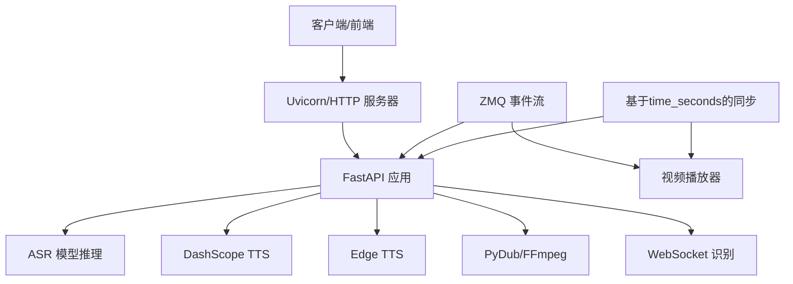

**图表来源**
- [server.py:67-451](file://server.py#L67-L451)
- [qwen-to-data4.py:852-899](file://qwen-to-data4.py#L852-L899)
- [qwen-to-data8.py:2043-2053](file://qwen-to-data8.py#L2043-L2053)

## 详细组件分析

### FastAPI 应用与健康检查
- 健康检查端点：GET /
- 访问日志：可通过 UVICORN_ACCESS_LOG 控制是否记录
- 自检机制：返回服务状态消息，可用于探活与容器编排
- 性能相关参数：UVICORN_HOST、UVICORN_PORT、UVICORN_LOG_LEVEL、UVICORN_PROXY_HEADERS

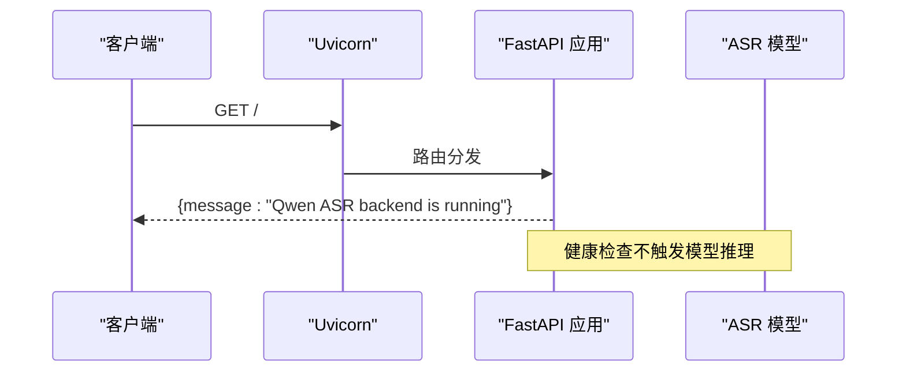

**图表来源**
- [server.py:199-201](file://server.py#L199-L201)

**章节来源**
- [server.py:199-201](file://server.py#L199-L201)
- [server.py:434-451](file://server.py#L434-L451)

### WebSocket 实时识别流程
- 输入：16kHz 单声道 PCM（int16）
- 处理：滑动窗口 + 周期性转写，周期由环境变量控制
- 输出：partial 文本更新
- 异常：错误类型通过 JSON error 消息返回

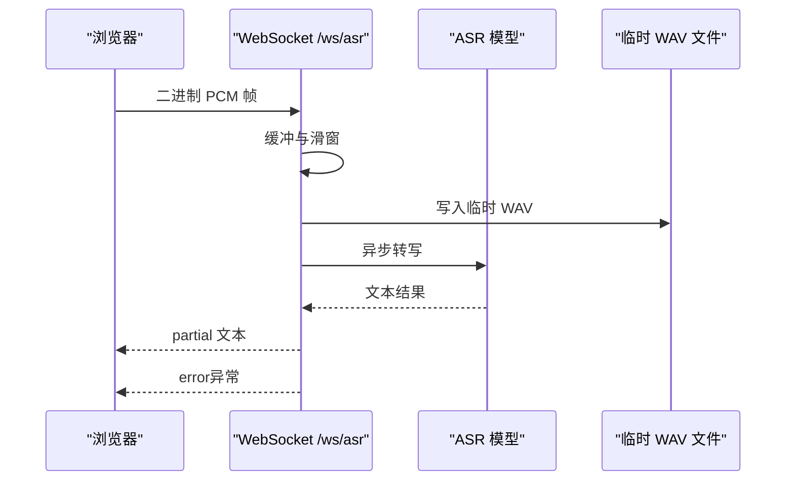

**图表来源**
- [server.py:124-196](file://server.py#L124-L196)

**章节来源**
- [server.py:124-196](file://server.py#L124-L196)

### 音频转写接口
- 支持格式：WAV、MP3、M4A、OGG、WEBM、FLAC
- 转码：当输入为 WEBM/OGG 时，若检测到 FFmpeg 可用则转码为 WAV
- 错误处理：转码失败与转写失败均有明确错误码与消息

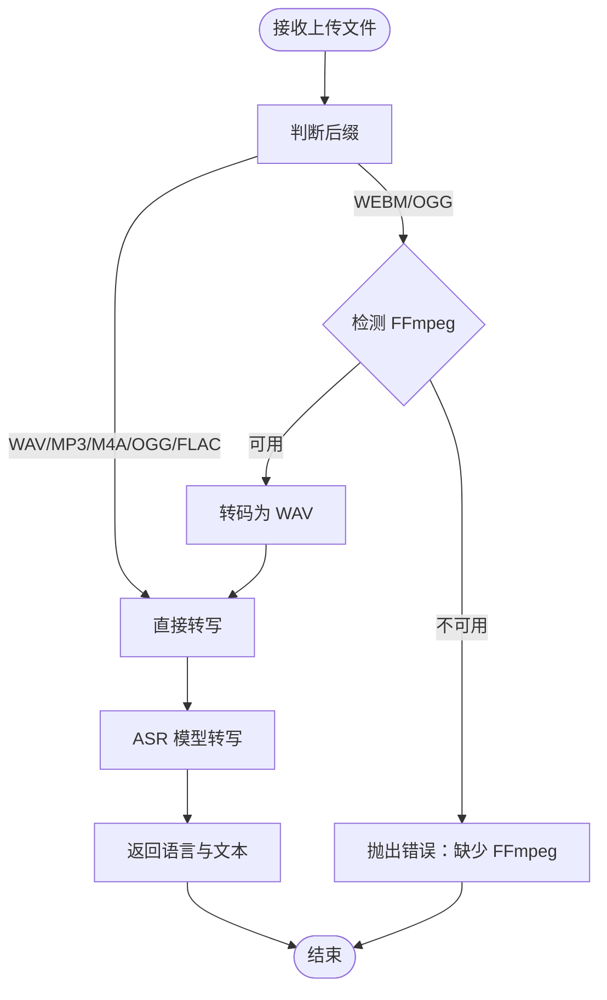

**图表来源**
- [server.py:367-425](file://server.py#L367-L425)

**章节来源**
- [server.py:367-425](file://server.py#L367-L425)

### TTS 接口与实时播报
- 整段 TTS：DashScope MultiModalConversation，返回音频 URL 或 base64
- 实时 TTS：DashScope 实时 WebSocket，边收边播，支持首包延迟统计
- 音频播放：优先流式播放（ffplay/mpv），否则下载后 pygame 播放

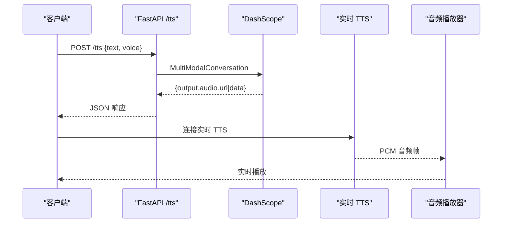

**图表来源**
- [server.py:212-247](file://server.py#L212-L247)
- [qwen3stream.py:161-196](file://qwen3stream.py#L161-L196)
- [playvideo.py:35-91](file://playvideo.py#L35-L91)

**章节来源**
- [server.py:212-247](file://server.py#L212-L247)
- [qwen3stream.py:161-196](file://qwen3stream.py#L161-L196)
- [playvideo.py:35-91](file://playvideo.py#L35-L91)

### 字幕配音与变速
- 基于 Edge TTS 生成每句配音
- 使用 FFmpeg atempo 进行变速，尽量保持音高
- 按字幕时间戳拼接，句间插入静音

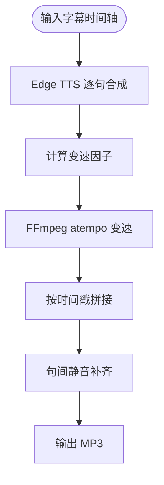

**图表来源**
- [edge_subtitle_voiceover.py:166-223](file://edge_subtitle_voiceover.py#L166-L223)

**章节来源**
- [edge_subtitle_voiceover.py:166-223](file://edge_subtitle_voiceover.py#L166-L223)

### 零拷贝事件流与回放
- ZMQ PUB/SUB：事件以 topic+payload 形式传输
- 回放脚本：按固定间隔逐行回放 NDJSON 事件
- 订阅日志：可选将收到的事件写入 NDJSON 文件

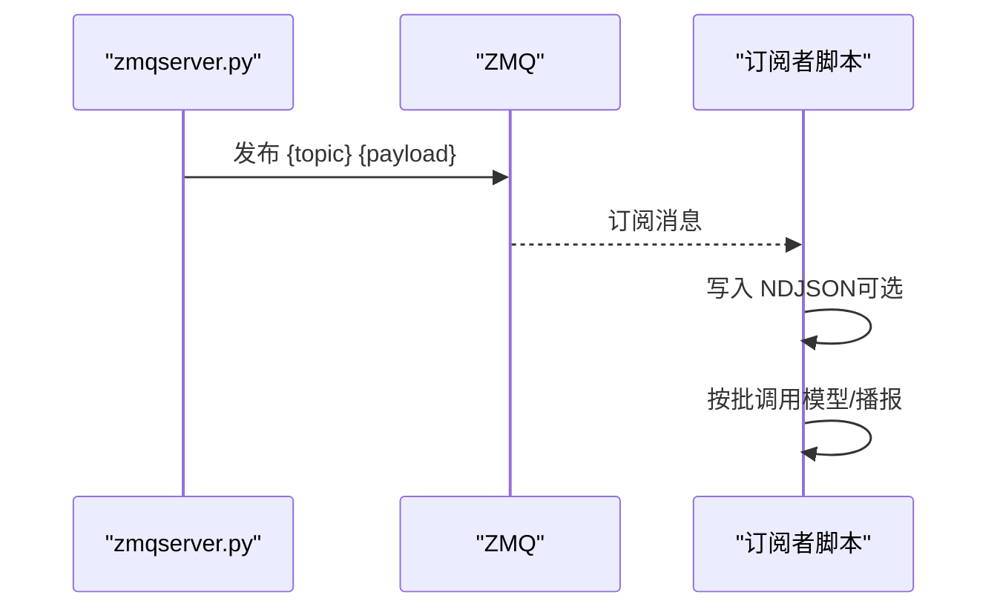

**图表来源**
- [zmqserver.py:11-68](file://zmqserver.py#L11-L68)
- [qwen-to-data4.py:852-899](file://qwen-to-data4.py#L852-L899)

**章节来源**
- [zmqserver.py:11-68](file://zmqserver.py#L11-L68)
- [qwen-to-data4.py:852-899](file://qwen-to-data4.py#L852-L899)

## ZMQ事件流监控

### 事件回放监控
- **回放延迟监控**：监控事件回放的延迟，包括消息发送间隔、处理延迟
- **回放完整性监控**：检查NDJSON文件的完整性，验证JSON格式正确性
- **回放缓存监控**：监控事件缓冲区大小，避免内存溢出

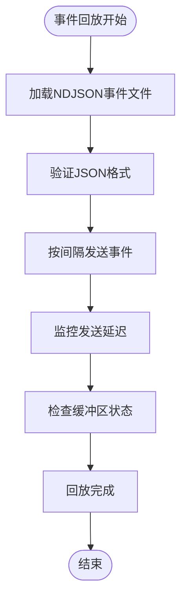

**图表来源**
- [zmqserver.py:29-57](file://zmqserver.py#L29-L57)

### 订阅日志监控
- **日志文件监控**：监控NDJSON日志文件的大小增长和写入频率
- **事件完整性监控**：检查事件ID唯一性，验证事件类型一致性
- **订阅质量监控**：监控订阅连接状态，检测消息丢失情况

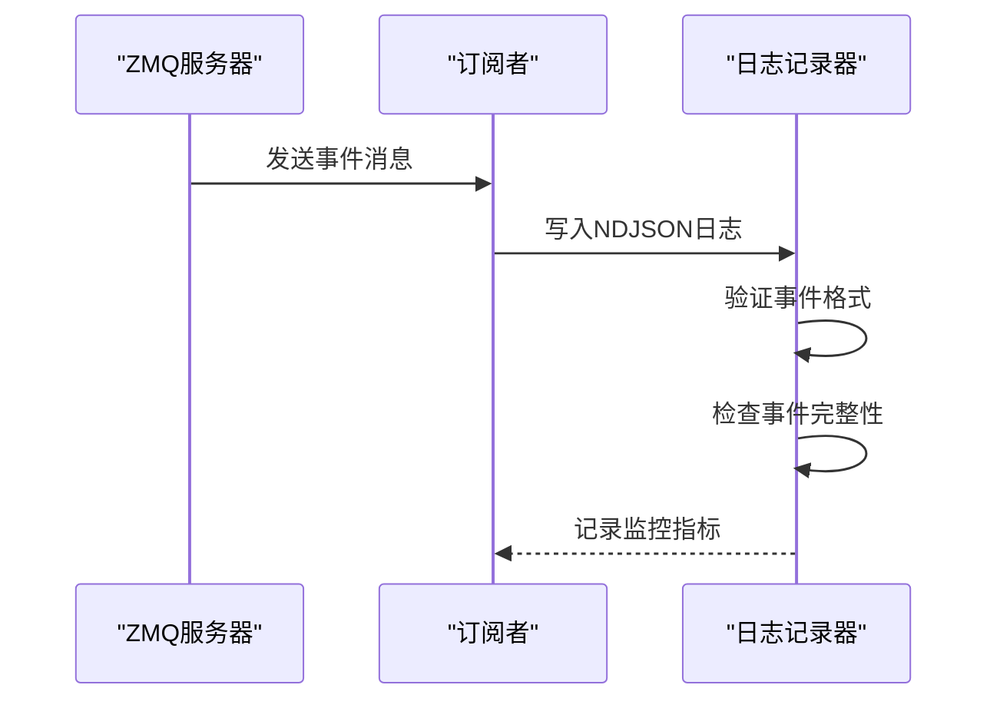

**图表来源**
- [zmqtest.py:27-41](file://zmqtest.py#L27-L41)
- [qwen-to-data4.py:956-966](file://qwen-to-data4.py#L956-L966)

### 事件处理监控
- **批量处理监控**：监控事件批量处理的吞吐量和延迟
- **模型调用监控**：跟踪LLM模型调用次数和响应时间
- **TTS集成监控**：监控实时TTS会话的建立和结束

**章节来源**
- [zmqserver.py:11-68](file://zmqserver.py#L11-L68)
- [zmqtest.py:1-46](file://zmqtest.py#L1-L46)
- [qwen-to-data4.py:927-1012](file://qwen-to-data4.py#L927-L1012)

## 视频音频同步监控

### 基于时间戳的同步机制
系统实现了基于time_seconds时间戳的精确视频音频同步机制，确保音频解说与视频画面的完美对齐。

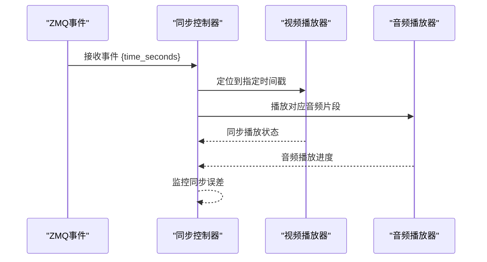

**图表来源**
- [qwen-to-data8.py:2043-2053](file://qwen-to-data8.py#L2043-L2053)
- [subtitle_player.html:447-463](file://subtitle_player.html#L447-L463)

### 同步精度监控
- **时间戳精度监控**：监控time_seconds字段的精度和一致性
- **同步误差监控**：测量视频与音频之间的同步误差
- **首播延迟监控**：跟踪从事件到达到底播开始的延迟

### 视频播放监控
- **播放状态监控**：监控视频播放的开始、暂停、结束状态
- **定位准确性监控**：验证视频定位到time_seconds的准确性
- **播放质量监控**：监控视频播放的流畅性和稳定性

**章节来源**
- [qwen-to-data8.py:2043-2053](file://qwen-to-data8.py#L2043-L2053)
- [subtitle_player.html:436-463](file://subtitle_player.html#L436-L463)

## 依赖分析
- 运行时依赖：FastAPI、Uvicorn、PyTorch、Qwen-ASR、DashScope、edge-tts、pydub、FFmpeg、python-dotenv、pyzmq
- 关键耦合点：
  - ASR 模型加载与设备选择（CUDA/ CPU）
  - FFmpeg 路径解析与转码
  - DashScope API Key 与地域配置
  - WebSocket 与实时 TTS 的并发与资源释放
  - **新增** ZMQ事件流的网络通信与消息传递
  - **新增** 视频音频同步的时间戳处理机制

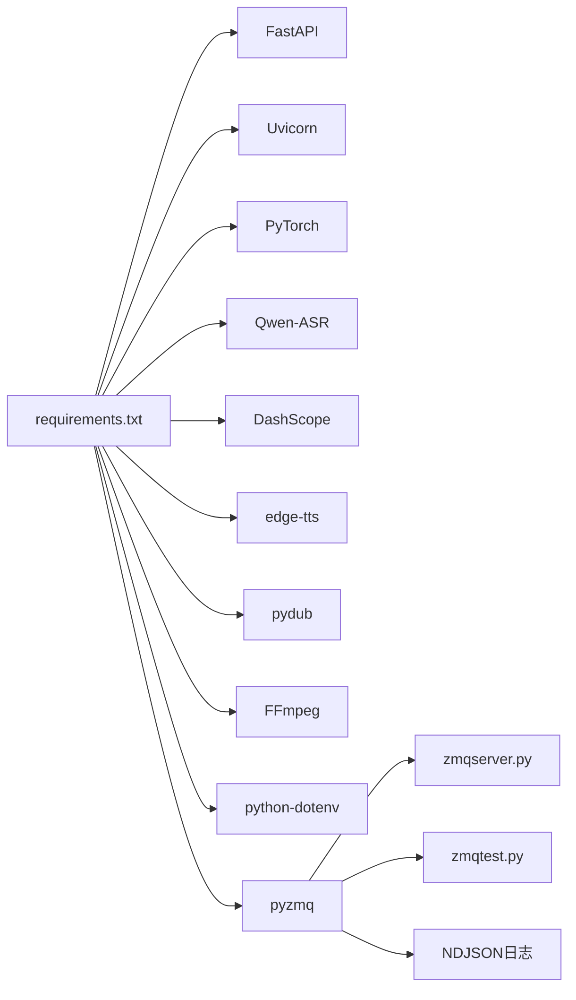

**图表来源**
- [requirements.txt:1-13](file://requirements.txt#L1-L13)

**章节来源**
- [requirements.txt:1-13](file://requirements.txt#L1-L13)

## 性能考虑
- 设备与精度
  - CUDA 可用时使用 bf16，否则使用 fp32
  - 设备选择影响推理吞吐与显存占用
- 推理批大小
  - ASR 最大推理批大小限制为 32，可根据显存调整
- 网络与 I/O
  - FFmpeg 转码与音频拼接为 I/O 密集操作，建议使用高性能磁盘与合适的缓冲
  - **新增** ZMQ事件流的网络带宽和延迟优化
- 实时 TTS
  - 首包延迟与会话关闭等待时间可调，避免阻塞后续播报
- WebSocket
  - 解码间隔与滑动窗口决定实时性与稳定性的平衡
- **新增** 事件流处理
  - 回放间隔和批量处理大小影响事件处理延迟
  - NDJSON文件写入的I/O性能监控

**章节来源**
- [server.py:78-95](file://server.py#L78-L95)
- [server.py:136-137](file://server.py#L136-L137)
- [qwen3stream.py:161-196](file://qwen3stream.py#L161-L196)
- [qwen-to-data4.py:837-843](file://qwen-to-data4.py#L837-L843)
- [zmqserver.py:21](file://zmqserver.py#L21)

## 故障排查指南
- FFmpeg 缺失或路径问题
  - 现象：上传 WEBM/OGG 报格式不识别或找不到 ffmpeg
  - 处理：设置 FFMPEG_PATH 或将 ffmpeg 加入系统 PATH
- DashScope API Key 缺失或地域不一致
  - 现象：/tts 报错
  - 处理：检查 .env 中 DASHSCOPE_API_KEY，确认地域与 URL 一致
- 模型加载超时
  - 现象：连接 huggingface.co 超时
  - 处理：配置 ASR_MODEL_PATH 指向本地完整权重目录
- WebSocket 实时播报"播一半就停"
  - 现象：实时 TTS 会话未及时结束导致阻塞
  - 处理：调整实时 TTS finish 等待时间，避免过短截断尾音或过长阻塞
- **新增** ZMQ事件流问题
  - 现象：事件回放失败或订阅不到消息
  - 处理：检查ZMQ绑定地址、topic配置，验证NDJSON文件格式
- **新增** 视频音频不同步
  - 现象：音频与视频播放不同步
  - 处理：检查time_seconds时间戳精度，验证视频定位准确性

**章节来源**
- [README.md:194-204](file://README.md#L194-L204)
- [server.py:394-410](file://server.py#L394-L410)

## 结论
本指南提供了从指标采集、监控集成、日志管理到告警规则与性能优化的全栈方案。**更新** 本次更新重点加强了ZMQ事件流系统的监控能力，包括事件回放延迟、订阅日志完整性、基于时间戳的视频音频同步精度等关键指标的监控。建议在生产环境中结合 Prometheus/Grafana 实施统一监控，并针对 ASR 推理、TTS 与实时播报的关键路径建立 SLI/SLO，配合自动化告警与容量规划，确保系统稳定与用户体验。

## 附录

### 关键性能指标与采集建议
- CPU 使用率
  - 采集：系统级 CPU 使用率、Python 进程 CPU 使用率
  - 建议：关注 ASR 推理阶段的 CPU 占用峰值
- 内存占用
  - 采集：系统内存与进程 RSS/VSZ
  - 建议：监控 ASR 模型加载与推理过程的内存波动
- GPU 显存使用情况
  - 采集：nvidia-smi 显存占用、PyTorch 分配统计
  - 建议：关注 CUDA 设备上的显存峰值与碎片化
- 网络延迟
  - 采集：DashScope API 延迟、WebSocket 延迟、FFmpeg 转码耗时
  - 建议：记录首包延迟与会话关闭等待时间
- **新增** ZMQ事件流延迟
  - 采集：事件回放延迟、订阅消息延迟、NDJSON写入延迟
  - 建议：监控事件处理的端到端延迟和批量处理吞吐量
- **新增** 视频音频同步精度
  - 采集：time_seconds时间戳精度、同步误差、首播延迟
  - 建议：监控视频定位准确性和音频播放流畅性

### Prometheus 监控集成方案
- Exporter 选择
  - Node Exporter：系统 CPU/内存/磁盘/网络
  - nvidia_gpu_exporter：GPU 显存与利用率
  - 自定义 Exporter：采集 ASR/TTS 推理耗时与错误计数
  - **新增** ZMQ监控：事件回放延迟、订阅连接状态
  - **新增** 同步监控：视频音频同步误差、时间戳精度
- 指标命名
  - 服务可用性：up{job="qwen-asr-backend"}
  - 响应时间：histogram_quantile(0.95, sum by(le, endpoint) (rate(http_request_duration_seconds_bucket[5m])))
  - 错误率：rate(http_request_total{status=~"5.."}[5m])
  - **新增** 事件流指标：zmq_event_delay_seconds、zmq_subscription_status
  - **新增** 同步指标：video_audio_sync_error_seconds、timestamp_accuracy_ratio

### Grafana 仪表板配置思路
- 面板建议
  - 系统负载：CPU 使用率、内存使用、磁盘 I/O
  - GPU 资源：显存使用、显存分配、GPU 利用率
  - 业务指标：ASR 推理耗时分布、TTS 成功率与平均时延、实时 TTS 首包延迟
  - **新增** 事件流面板：事件回放延迟、订阅连接状态、NDJSON写入性能
  - **新增** 同步面板：视频音频同步误差、时间戳精度、首播延迟
  - 日志聚合：按错误类型与接口维度统计

### 日志收集与分析策略
- 访问日志
  - 采集：Uvicorn access_log，按天轮转
  - 分类：按接口、状态码、响应时间分桶
- 错误日志
  - 采集：ASR 转码失败、TTS 请求失败、WebSocket 异常
  - 分类：按错误类型与上游依赖（FFmpeg/DashScope）归类
- 业务日志
  - 采集：ZMQ 事件订阅日志（NDJSON）、实时播报会话元数据
  - 分析：事件到达时延、播报时延、会话完成率
  - **新增** 事件流日志：事件回放状态、订阅质量、同步误差
  - **新增** 同步日志：视频定位准确性、音频播放状态

### 健康检查端点与自检机制
- 健康检查：GET / 返回服务状态
- 自检：启动时加载模型与依赖，失败快速暴露
- 探活：容器编排中使用 HTTP 探针访问 /，结合就绪探针避免流量导入
- **新增** 事件流自检：检查ZMQ连接状态、NDJSON文件可写性
- **新增** 同步自检：验证time_seconds时间戳处理、视频播放器可用性

**章节来源**
- [server.py:199-201](file://server.py#L199-L201)
- [server.py:434-451](file://server.py#L434-L451)

### 告警规则配置
- 服务可用性
  - up == 0 或 5xx 比例过高
- 响应时间阈值
  - /transcribe 与 /tts 的 p95/p99 延迟超过阈值
- 异常检测
  - ASR 转码失败率、TTS 请求失败率、WebSocket 断连率
  - **新增** 事件流异常：ZMQ连接失败、NDJSON写入错误、事件处理超时
  - **新增** 同步异常：视频定位失败、音频播放中断、同步误差过大
- 实时播报
  - 实时 TTS 会话等待超时比例、首包延迟异常
- **新增** 事件流告警
  - 事件回放延迟超过阈值、订阅消息丢失率过高
  - NDJSON文件增长异常、事件格式验证失败
- **新增** 同步告警
  - 视频音频同步误差超过阈值、time_seconds时间戳异常
  - 首播延迟超过阈值、视频定位准确性下降

### 性能基准测试与容量规划
- 基准测试
  - ASR：不同采样率、通道数、批大小下的吞吐与延迟
  - TTS：整段与实时 TTS 的首包延迟与稳定帧率
  - I/O：FFmpeg 转码与音频拼接的吞吐与 CPU 占用
  - **新增** 事件流基准：事件回放延迟、批量处理吞吐量、NDJSON写入性能
  - **新增** 同步基准：time_seconds时间戳精度、视频音频同步误差、首播延迟
- 容量规划
  - 基于峰值 CPU/显存与网络带宽，预留安全余量
  - 根据 SLA 设定并发上限与排队策略，避免过载
  - **新增** 事件流容量：ZMQ连接数、事件缓冲区大小、NDJSON存储空间
  - **新增** 同步容量：视频播放器资源、音频播放队列长度、时间戳处理能力