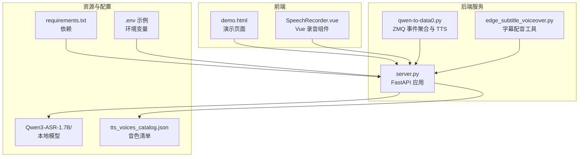
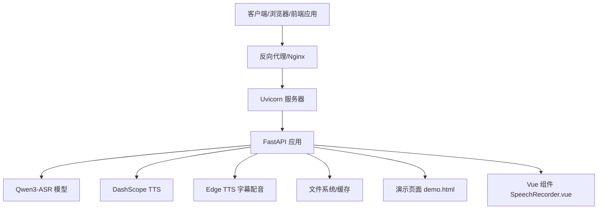
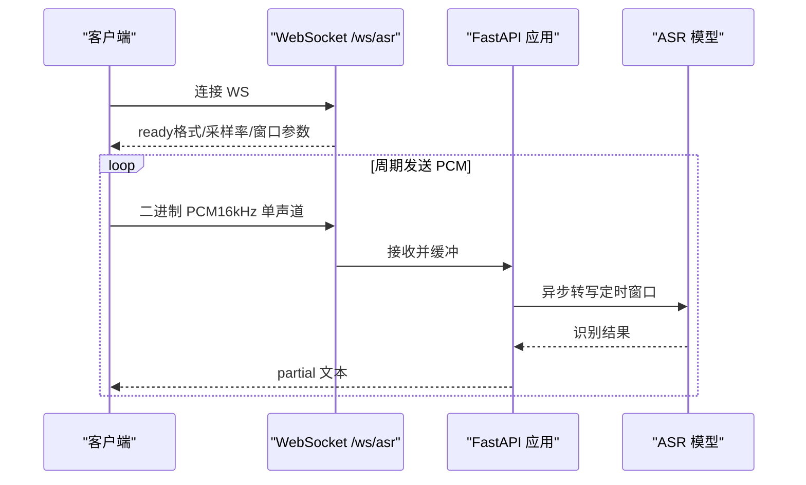
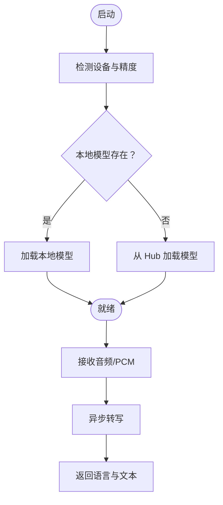
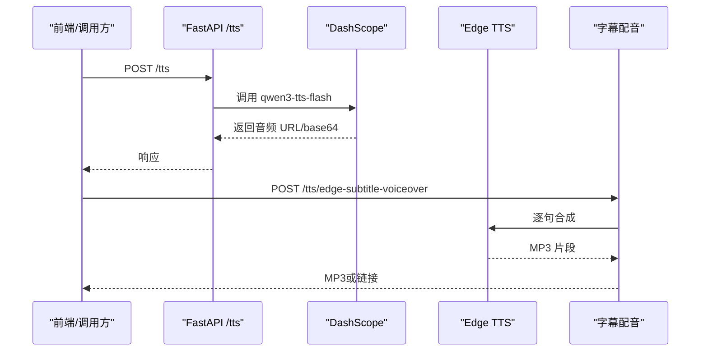
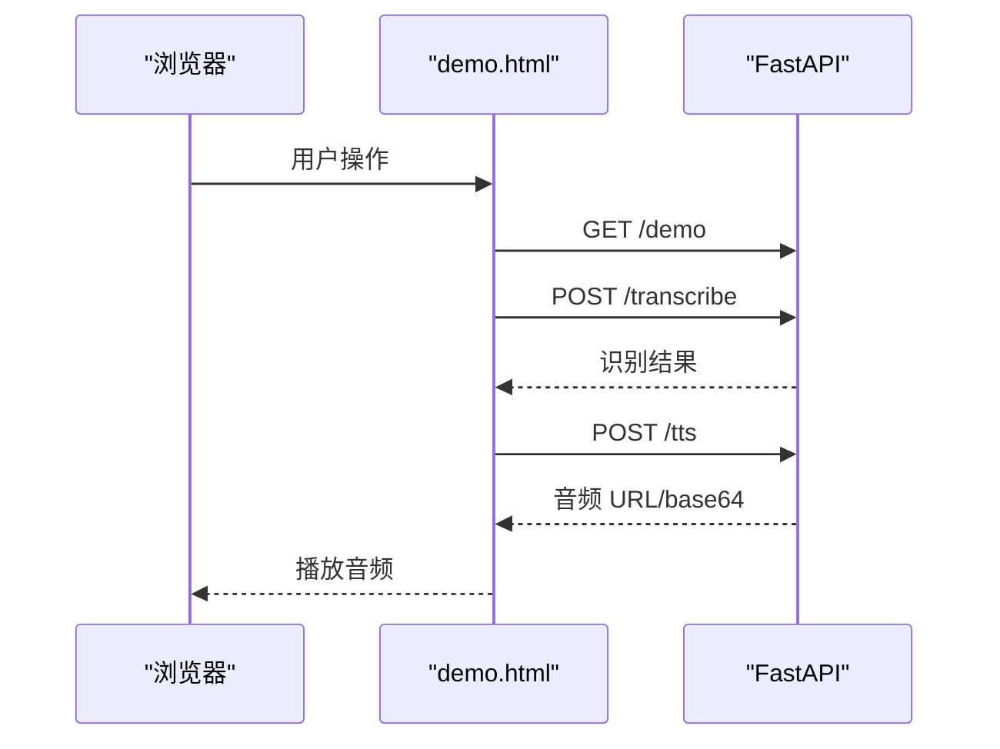
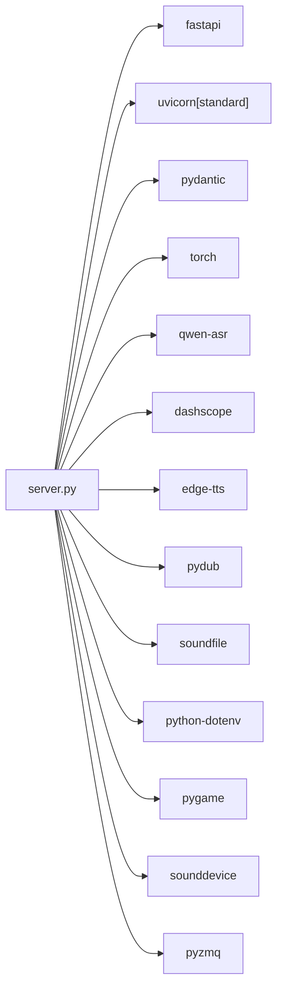

# 部署与运维

<cite>
**本文引用的文件**
- [README.md](file://README.md)
- [requirements.txt](file://requirements.txt)
- [server.py](file://server.py)
- [demo.html](file://demo.html)
- [SpeechRecorder.vue](file://SpeechRecorder.vue)
- [edge_subtitle_voiceover.py](file://edge_subtitle_voiceover.py)
- [qwen-to-data0.py](file://qwen-to-data0.py)
- [tts_voices_catalog.json](file://tts_voices_catalog.json)
- [index.py](file://index.py)
</cite>

## 目录
1. [简介](#简介)
2. [项目结构](#项目结构)
3. [核心组件](#核心组件)
4. [架构总览](#架构总览)
5. [详细组件分析](#详细组件分析)
6. [依赖分析](#依赖分析)
7. [性能考虑](#性能考虑)
8. [故障排除指南](#故障排除指南)
9. [结论](#结论)
10. [附录](#附录)

## 简介
本指南面向生产环境的部署与运维，围绕基于 FastAPI 的语音识别与语音合成服务，提供从服务器环境准备、依赖安装、性能调优，到容器化与 Kubernetes 部署策略、负载均衡与反向代理、SSL 证书配置、监控与日志、错误追踪与性能分析、故障排除、备份恢复与安全加固，以及自动化部署与 CI/CD 集成的全流程实践。

## 项目结构
- 后端服务：FastAPI 应用，提供健康检查、文件上传识别、WebSocket 实时识别、TTS 调用、字幕配音等接口。
- 前端演示：静态 HTML 页面与 Vue 组件，用于本地演示与前端集成参考。
- 辅助脚本：包含本地 ASR 测试、ZMQ 事件聚合与 TTS 播报、Edge TTS 字幕配音等工具脚本。
- 配置与依赖：requirements.txt、.env 示例、ASR 模型目录、TTS 音色清单等。

**图表来源**
- [server.py](file://server.py)
- [demo.html](file://demo.html)
- [SpeechRecorder.vue](file://SpeechRecorder.vue)
- [edge_subtitle_voiceover.py](file://edge_subtitle_voiceover.py)
- [qwen-to-data0.py](file://qwen-to-data0.py)
- [requirements.txt](file://requirements.txt)
- [tts_voices_catalog.json](file://tts_voices_catalog.json)

**章节来源**
- [README.md](file://README.md)
- [server.py](file://server.py)
- [requirements.txt](file://requirements.txt)

## 核心组件
- FastAPI 应用与路由
  - 健康检查：GET /
  - 演示页：GET /demo
  - 文件上传识别：POST /transcribe
  - WebSocket 实时识别：/ws/asr
  - TTS 接口：POST /tts、GET /tts/voices、GET /tts/edge-voices、POST /tts/edge-subtitle-voiceover、POST /tts/edge-subtitle-voiceover/link、GET /tts/edge-voiceover-files/{file_id}
- ASR 模型加载与推理
  - 本地模型路径优先，否则回退至 Hugging Face Hub
  - CUDA 可用时使用 GPU，否则回退 CPU
- TTS 与字幕配音
  - DashScope TTS 调用
  - Edge TTS 字幕配音与变速对齐
- 前端演示与组件
  - demo.html 展示上传识别、实时识别、TTS 播放
  - SpeechRecorder.vue 提供 Vue 集成示例

**章节来源**
- [server.py](file://server.py)
- [README.md](file://README.md)
- [demo.html](file://demo.html)
- [SpeechRecorder.vue](file://SpeechRecorder.vue)
- [tts_voices_catalog.json](file://tts_voices_catalog.json)

## 架构总览
后端采用 Uvicorn 承载的 FastAPI，结合本地 ASR 模型与云端 TTS 服务，提供完整的语音能力。前端通过 HTTP 与 WebSocket 与后端交互，演示页面与 Vue 组件分别展示不同接入方式。

**图表来源**
- [server.py](file://server.py)
- [demo.html](file://demo.html)
- [SpeechRecorder.vue](file://SpeechRecorder.vue)

## 详细组件分析

### FastAPI 应用与路由
- 健康检查：返回服务运行状态
- 演示页：返回 demo.html
- 文件上传识别：支持多种音频格式，必要时通过 FFmpeg 转码为 WAV
- WebSocket 实时识别：接收 16kHz 单声道 PCM，周期性识别并推送 partial 文本
- TTS：调用 DashScope qwen3-tts-flash，返回音频 URL 或 base64
- 字幕配音：按时间轴对齐，支持变速与静音填充，输出 MP3
- 音色列表：提供 DashScope 与 Edge 的音色清单查询

**图表来源**
- [server.py](file://server.py)

**章节来源**
- [server.py](file://server.py)

### ASR 模型加载与推理
- 设备选择：GPU（CUDA）优先，否则 CPU
- 模型来源：本地目录优先，否则 Hugging Face Hub
- 推理控制：最大窗口秒数、解码间隔、并发锁保护
- 转码：WebM/Ogg 等格式通过 FFmpeg 转 WAV

**图表来源**
- [server.py](file://server.py)

**章节来源**
- [server.py](file://server.py)

### TTS 与字幕配音
- DashScope TTS：统一调用入口，返回结构化响应
- Edge 字幕配音：按字幕时间轴生成 MP3，支持变速与静音对齐
- 音色清单：集中维护，便于前端选择

**图表来源**
- [server.py](file://server.py)
- [edge_subtitle_voiceover.py](file://edge_subtitle_voiceover.py)

**章节来源**
- [server.py](file://server.py)
- [edge_subtitle_voiceover.py](file://edge_subtitle_voiceover.py)
- [tts_voices_catalog.json](file://tts_voices_catalog.json)

### 前端演示与组件
- demo.html：展示麦克风授权、实时识别、上传识别、TTS 播放
- SpeechRecorder.vue：Vue 组件示例，POST /transcribe 并展示结果

**图表来源**
- [demo.html](file://demo.html)
- [server.py](file://server.py)

**章节来源**
- [demo.html](file://demo.html)
- [SpeechRecorder.vue](file://SpeechRecorder.vue)
- [server.py](file://server.py)

## 依赖分析
- 主要依赖：FastAPI、Uvicorn、Pydantic、torch、qwen-asr、dashscope、edge-tts、pydub、soundfile、python-dotenv、pygame、sounddevice、pyzmq
- 环境变量：DASHSCOPE_API_KEY、ASR_MODEL_PATH、FFMPEG_PATH、UVICORN_*、WebSocket 参数等
- 模型与资源：Qwen3-ASR-1.7B 本地权重目录、tts_voices_catalog.json

**图表来源**
- [requirements.txt](file://requirements.txt)
- [server.py](file://server.py)

**章节来源**
- [requirements.txt](file://requirements.txt)
- [server.py](file://server.py)

## 性能考虑
- 设备与精度
  - GPU（CUDA）优先，dtype/bfloat16 降低显存占用
  - CPU 回退策略确保可用性
- 推理参数
  - 最大窗口秒数与解码间隔影响实时性与准确度平衡
  - 并发锁保护避免模型争用
- I/O 与转码
  - WebM/Ogg 等格式通过 FFmpeg 转 WAV，避免解码器限制
  - 临时文件及时清理，减少磁盘压力
- 服务端优化
  - Uvicorn 进程数与工作线程数根据 CPU 核心数与 GPU 利用率调整
  - 日志级别与访问日志开关按环境切换
- 前端体验
  - 实时识别采用滑动窗口+周期性识别，兼顾延迟与准确度
  - TTS 播放优先 URL，其次 base64，避免大体积数据传输

**章节来源**
- [server.py](file://server.py)
- [README.md](file://README.md)

## 故障排除指南
- Hugging Face 连接超时
  - 配置本地 ASR 模型目录，确保包含完整权重
- TorchVision/Transformers 版本不兼容
  - 锁定与 qwen-asr 匹配的 transformers 版本
- 缺少 DashScope API Key
  - 检查 .env 中 DASHSCOPE_API_KEY，确认地域一致
- WebM/OGG 解码失败
  - 安装 FFmpeg；在 .env 中设置 FFMPEG_PATH 指向 ffmpeg.exe
- CORS 与跨域
  - 默认允许所有来源，生产环境建议收紧
- WebSocket 连接与实时识别
  - 确认客户端发送 16kHz 单声道 PCM，服务端解码参数一致

**章节来源**
- [README.md](file://README.md)
- [server.py](file://server.py)

## 结论
本指南提供了从服务器准备、依赖安装、性能调优到容器化与 K8s 部署、负载均衡与 SSL、监控与日志、故障排除与安全加固的完整实践路径。结合 FastAPI 的高性能与 ASR/TTS 能力，可在生产环境中稳定提供语音识别与合成服务。

## 附录

### 生产环境部署配置清单
- 服务器环境
  - 操作系统：Linux（推荐 Ubuntu/CentOS）
  - Python：3.10+，建议使用虚拟环境
  - GPU：NVIDIA CUDA（可选，提升推理性能）
- 依赖安装
  - pip install -r requirements.txt
  - 安装 FFmpeg（apt/yum 安装或手动配置 FFMPEG_PATH）
- 模型与资源
  - 准备 Qwen3-ASR-1.7B 本地权重目录
  - 准备 tts_voices_catalog.json
- 环境变量
  - DASHSCOPE_API_KEY：阿里百炼 API Key
  - ASR_MODEL_PATH：本地 ASR 模型目录
  - FFMPEG_PATH：ffmpeg.exe 绝对路径（Windows）
  - UVICORN_HOST/PORT/LOG_LEVEL/RELOAD/ACCESS_LOG/PROXY_HEADERS：Uvicorn 运行参数
  - ASR_WS_DECODE_INTERVAL_S/ASR_WS_MAX_WINDOW_S：WebSocket 实时识别参数

**章节来源**
- [README.md](file://README.md)
- [requirements.txt](file://requirements.txt)
- [server.py](file://server.py)

### Docker 容器化部署方案
- 基础镜像
  - python:3.10-slim 或 nvidia/cuda:12.1.1-runtime-ubuntu22.04（GPU）
- 安装步骤
  - 复制 requirements.txt 至镜像
  - pip install -r requirements.txt
  - 复制项目代码与模型目录
  - 安装 FFmpeg
- 启动命令
  - uvicorn server:app --host 0.0.0.0 --port 8000
- 端口映射
  - 8000/tcp 对外暴露
- 环境变量注入
  - 通过 docker run -e 注入 .env 中的关键变量
- 挂载卷
  - 模型目录、缓存目录、日志目录挂载至宿主机持久化存储

**章节来源**
- [requirements.txt](file://requirements.txt)
- [server.py](file://server.py)

### Kubernetes 集群部署策略
- Deployment
  - replicas：根据流量与资源需求设置副本数
  - readiness/liveness 探针：基于 / 健康检查
  - 资源限制：requests/limits 控制 CPU/内存
- Service
  - ClusterIP/NodePort/LoadBalancer：按集群类型选择
- ConfigMap
  - 环境变量（除敏感信息外）放入 ConfigMap
- Secret
  - DASHSCOPE_API_KEY 等敏感信息放入 Secret
- PersistentVolume
  - 模型目录与缓存目录挂载 PV/PVC
- HPA
  - 根据 CPU/内存或自定义指标自动扩缩容

**章节来源**
- [server.py](file://server.py)

### 负载均衡、反向代理与 SSL
- Nginx
  - 反向代理至 Uvicorn 实例
  - gzip/ssl 启用，压缩与加密传输
  - 限流与连接数限制
- SSL 证书
  - Let’s Encrypt 自动签发与续期
  - 强制 HTTPS 重定向
- WebSocket
  - Nginx 配置升级协议，支持 /ws/asr

**章节来源**
- [server.py](file://server.py)
- [demo.html](file://demo.html)

### 监控指标与告警
- 指标
  - CPU 使用率、内存占用、网络吞吐、请求速率、错误率、P95/P99 延迟
  - ASR 推理耗时、TTS 调用耗时、WebSocket 连接数
- 工具
  - Prometheus + Grafana
  - OpenTelemetry（APM）
- 告警
  - 基于阈值与趋势的告警策略

**章节来源**
- [server.py](file://server.py)

### 日志管理、错误追踪与性能分析
- 日志
  - Uvicorn 访问日志与应用日志分离
  - 结构化日志（JSON），便于 ELK/Fluentd 收集
- 错误追踪
  - Sentry/OpenTelemetry 分布式追踪
- 性能分析
  - Py-Spy/Strace/Perf 等工具定位热点
  - ASR/TTS 调用链路分析

**章节来源**
- [server.py](file://server.py)

### 故障排除与备份恢复
- 常见问题
  - 模型加载失败：检查 ASR_MODEL_PATH 与权限
  - FFmpeg 缺失：安装并配置 FFMPEG_PATH
  - TTS 失败：检查 DASHSCOPE_API_KEY 与网络连通
- 备份
  - 定期备份模型目录、缓存目录、数据库（如有）
- 恢复
  - 快速回滚至上一个稳定镜像/版本
  - 恢复备份后验证服务健康检查

**章节来源**
- [README.md](file://README.md)
- [server.py](file://server.py)

### 安全加固措施
- 网络
  - 仅开放必要端口，防火墙策略最小化
  - 反向代理层启用 WAF
- 认证与授权
  - API Key 管理与轮换
  - CORS 严格限制来源
- 数据
  - 传输加密（TLS），静态数据加密（可选）
  - 临时文件与缓存定期清理
- 运维
  - 定期更新依赖与系统补丁
  - 审计日志与变更记录

**章节来源**
- [server.py](file://server.py)

### 自动化部署与 CI/CD
- CI
  - 代码检查、单元测试、依赖扫描
- CD
  - Docker 镜像构建与推送
  - Helm/Kustomize 部署至 K8s
  - 蓝绿/金丝雀发布策略
- 回滚
  - 自动回滚至上一个健康版本

**章节来源**
- [requirements.txt](file://requirements.txt)
- [server.py](file://server.py)