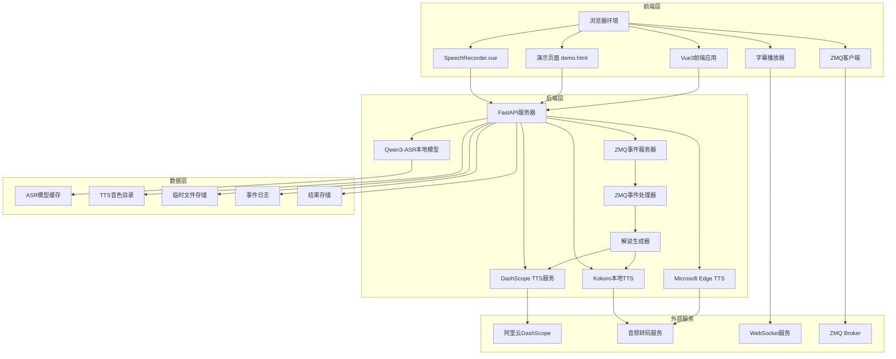
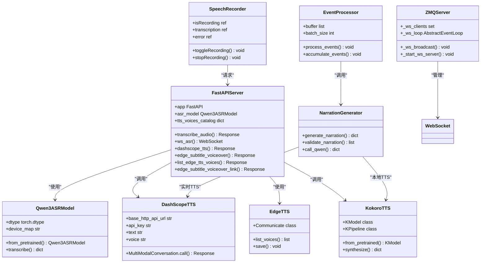
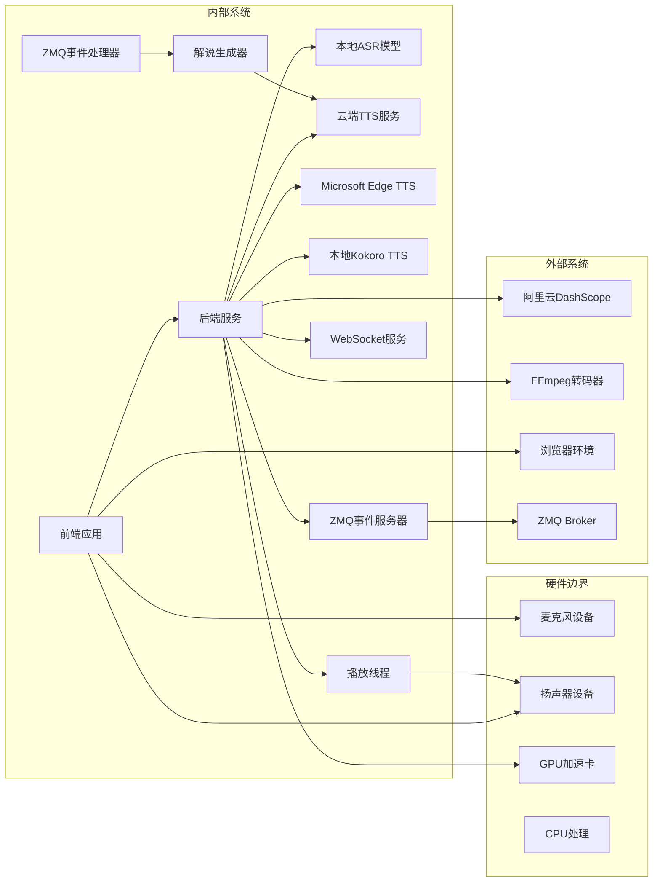
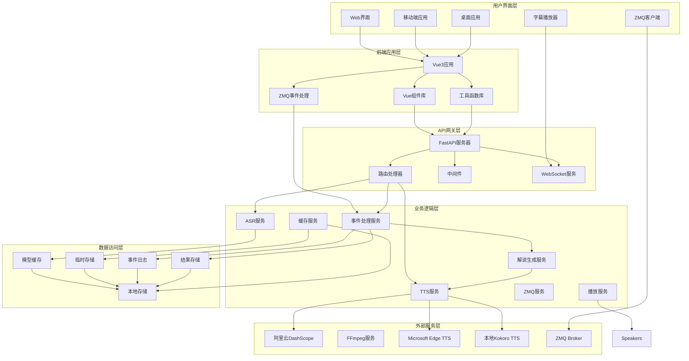
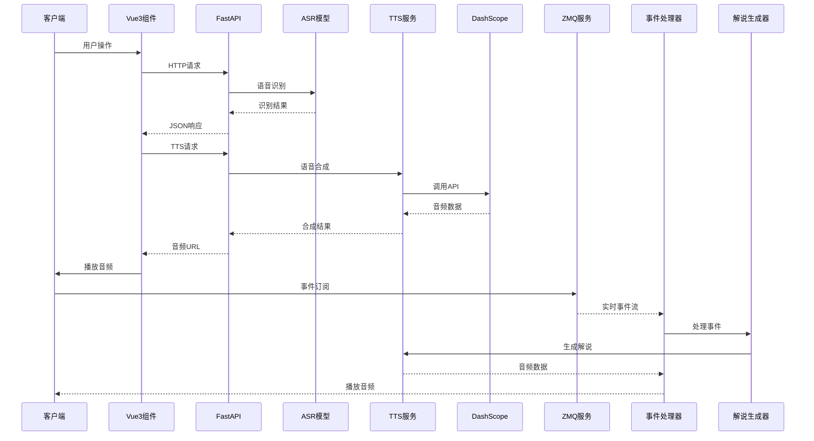
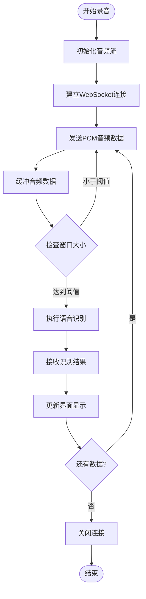
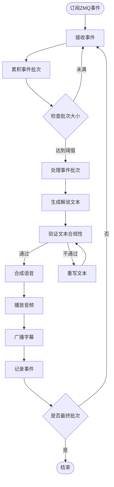
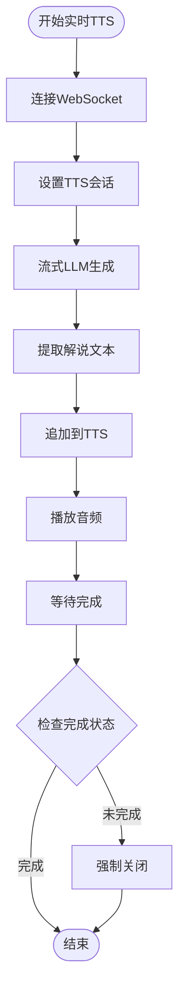

# 项目概述

<cite>
**本文档引用的文件**
- [README.md](file://README.md)
- [requirements.txt](file://requirements.txt)
- [server.py](file://server.py)
- [SpeechRecorder.vue](file://SpeechRecorder.vue)
- [demo.html](file://demo.html)
- [index.py](file://index.py)
- [ttstest.py](file://ttstest.py)
- [tts_voices_catalog.json](file://tts_voices_catalog.json)
- [subtitles.json](file://subtitles.json)
- [qwen-to-data7.py](file://qwen-to-data7.py)
- [zmq_events.jsonl](file://zmq_events.jsonl)
- [zmqserver.py](file://zmqserver.py)
</cite>

## 更新摘要
**变更内容**
- 更新了README文档的格式化改进和新增示例
- 修正了ZMQ赛事解说流程的实现细节，确保与实际代码保持一致
- 新增了ZMQ事件处理和实时TTS合成的详细说明
- 更新了核心应用代码架构变更
- 增强了技术架构和API说明
- 完善了多后端TTS支持说明

## 目录
1. [项目简介](#项目简介)
2. [核心目标](#核心目标)
3. [主要功能特性](#主要功能特性)
4. [技术架构](#技术架构)
5. [项目结构](#项目结构)
6. [技术栈选择](#技术栈选择)
7. [系统边界](#系统边界)
8. [应用场景](#应用场景)
9. [目标用户群体](#目标用户群体)
10. [价值主张](#价值主张)
11. [整体架构图](#整体架构图)
12. [组件关系说明](#组件关系说明)
13. [故障排除指南](#故障排除指南)
14. [总结](#总结)

## 项目简介

Vue3Speech是一个基于Vue3前端组件和FastAPI后端服务的完整语音识别与语音合成解决方案。该项目实现了从本地语音识别到云端语音合成的全流程语音处理能力，支持实时流式识别、批量音频识别、以及多种语音合成模式。

项目采用现代化的技术栈组合，结合了Vue3的组件化开发优势和FastAPI的高性能后端服务，为开发者提供了开箱即用的语音处理工具集。**最新版本**增加了ZMQ赛事解说功能，支持实时事件流处理和多后端TTS合成，实现了从ZMQ事件流到自动解说的完整工作流程。

## 核心目标

Vue3Speech项目的核心目标是为开发者提供一个完整、易用、高性能的语音处理解决方案，具体包括：

- **统一的语音处理平台**：整合语音识别、语音合成、实时流式处理等功能
- **跨平台兼容性**：支持Web浏览器、桌面应用等多种前端环境
- **高性能处理**：利用本地ASR模型和云端TTS服务实现快速响应
- **易于集成**：提供标准化的API接口和Vue3组件，便于第三方项目集成
- **灵活部署**：支持本地部署和云端部署两种模式
- **实时事件处理**：支持ZMQ实时事件流处理和自动解说生成
- **多后端TTS支持**：支持实时WebSocket TTS、云端HTTP TTS和本地Kokoro TTS

## 主要功能特性

### 语音识别功能
- **批量识别**：支持WAV、MP3、M4A、OGG、WEBM、FLAC等多种音频格式的批量识别
- **实时流式识别**：通过WebSocket实现准实时语音流式识别，支持16kHz单声道PCM音频
- **本地模型支持**：集成Qwen3-ASR-1.7B本地语音识别模型，支持GPU加速

### 语音合成功能
- **云端TTS**：集成阿里云DashScope Qwen3 TTS服务，支持多种音色和语言
- **字幕配音**：支持基于时间轴的字幕同步配音生成
- **音色管理**：提供完整的音色目录管理和动态查询功能
- **多后端支持**：支持DashScope、Kokoro本地TTS和实时TTS三种后端

### 前端集成功能
- **Vue3组件**：提供可复用的SpeechRecorder.vue录音组件
- **演示页面**：内置完整的功能演示页面，支持实时识别和TTS播放
- **跨域支持**：默认启用CORS中间件，便于前后端分离开发

### ZMQ赛事解说功能
- **实时事件处理**：支持ZMQ PUB/SUB协议的实时事件流处理
- **自动解说生成**：基于事件流自动生成比赛解说文本
- **多后端TTS**：支持实时TTS、DashScope TTS和本地Kokoro TTS
- **可视化播放**：提供WebSocket字幕播放器和实时字幕显示
- **事件累积处理**：支持按批次累积ZMQ事件，批量生成解说
- **实时TTS合成**：支持边生成边播放的实时语音合成

## 技术架构

### 整体架构设计

**图表来源**
- [server.py:67-452](file://server.py#L67-L452)
- [SpeechRecorder.vue:1-90](file://SpeechRecorder.vue#L1-L90)
- [demo.html:1-685](file://demo.html#L1-L685)
- [qwen-to-data7.py:87-152](file://qwen-to-data7.py#L87-L152)

### 核心组件架构

**图表来源**
- [server.py:88-95](file://server.py#L88-L95)
- [server.py:212-247](file://server.py#L212-L247)
- [SpeechRecorder.vue:11-77](file://SpeechRecorder.vue#L11-L77)
- [qwen-to-data7.py:57-85](file://qwen-to-data7.py#L57-L85)

## 项目结构

### 文件组织结构

```mermaid
graph TD
Vue3Speech[Vue3Speech项目根目录]
subgraph "核心服务文件"
server_py[server.py]
index_py[index.py]
ttstest_py[ttstest.py]
qwen_to_data7[qwen-to-data7.py]
end
subgraph "前端组件"
speech_recorder[SpeechRecorder.vue]
demo_html[demo.html]
subtitle_player[subtitle_player.html]
end
subgraph "配置文件"
requirements_txt[requirements.txt]
env[.env]
tts_voices[tts_voices_catalog.json]
subtitles[subtitles.json]
jsonschema[jsonschema.json]
end
subgraph "ASR模型"
qwen_asr[Qwen3-ASR-1.7B/]
end
subgraph "ZMQ相关文件"
zmq_files[zmq*.py]
event_logs[event logs]
zmq_events[zmq_events.jsonl]
end
subgraph "辅助工具"
edge_voiceover[edge_subtitle_voiceover.py]
kokoserver[kokoserver.py]
test_files[qwen-to-data*.py]
end
subgraph "缓存目录"
edge_cache[edge_voiceover_cache/]
temp_clips[temp_clips/]
kokoro_output[kokoro_output/]
end
Vue3Speech --> server_py
Vue3Speech --> speech_recorder
Vue3Speech --> demo_html
Vue3Speech --> subtitle_player
Vue3Speech --> requirements_txt
Vue3Speech --> qwen_asr
Vue3Speech --> qwen_to_data7
Vue3Speech --> edge_voiceover
Vue3Speech --> kokoserver
Vue3Speech --> edge_cache
Vue3Speech --> temp_clips
Vue3Speech --> kokoro_output
Vue3Speech --> zmq_events
```

**图表来源**
- [README.md:5-19](file://README.md#L5-L19)
- [requirements.txt:1-13](file://requirements.txt#L1-L13)

### 目录结构说明

- **server.py**：FastAPI主服务器，包含所有API端点和业务逻辑
- **SpeechRecorder.vue**：Vue3录音组件，可直接集成到Vue3项目中
- **demo.html**：完整的功能演示页面，展示所有语音处理功能
- **subtitle_player.html**：WebSocket字幕播放器，用于ZMQ赛事解说
- **Qwen3-ASR-1.7B/**：本地语音识别模型目录，包含完整的权重文件
- **edge_voiceover_cache/**：Edge TTS配音缓存目录
- **temp_clips/**：临时音频片段存储目录
- **kokoro_output/**：Kokoro本地TTS输出目录
- **qwen-to-data7.py**：ZMQ赛事解说主程序，支持多后端TTS，包含完整的事件处理和实时TTS合成逻辑
- **zmq_events.jsonl**：示例ZMQ事件数据文件，包含比赛事件的JSONL格式数据
- **zmqserver.py**：ZMQ事件发布服务器，用于测试和演示

## 技术栈选择

### 后端技术栈

| 技术组件 | 版本/用途 | 选择理由 |
|---------|----------|----------|
| FastAPI | 最新稳定版 | 高性能异步框架，自动生成API文档 |
| uvicorn | 标准版 | 生产级ASGI服务器，支持异步处理 |
| torch | 最新版本 | GPU加速深度学习推理 |
| qwen-asr | 1.7B模型 | 高精度中文语音识别 |
| dashscope | 最新版本 | 阿里云官方SDK，稳定可靠 |
| python-dotenv | 最新版本 | 环境变量管理 |
| edge-tts | 最新版本 | 微软Edge TTS服务客户端 |
| pyzmq | 最新版本 | 实时事件处理 |
| websockets | 最新版本 | WebSocket服务支持 |
| sounddevice | 实时音频 | 本地音频设备访问 |
| numpy | 数值计算 | 音频处理和矩阵运算 |
| soundfile | 音频文件 | WAV文件读写 |

### 前端技术栈

| 技术组件 | 版本/用途 | 选择理由 |
|---------|----------|----------|
| Vue3 | 最新稳定版 | 组件化开发，响应式数据绑定 |
| TypeScript | 可选 | 类型安全，提升开发体验 |
| Webpack/Vite | 构建工具 | 现代化构建流程 |
| TailwindCSS | 样式框架 | 原子化CSS，快速样式开发 |

### 辅助技术栈

| 技术组件 | 版本/用途 | 选择理由 |
|---------|----------|----------|
| kokoro | 82M模型 | 高质量本地语音合成 |
| FFmpeg | 音频转码 | 多格式音频支持 |
| pygame | 音频播放 | 跨平台音频播放 |
| huggingface_hub | 模型下载 | Hugging Face模型管理 |

## 系统边界

### 外部依赖边界

**图表来源**
- [server.py:12-23](file://server.py#L12-L23)
- [requirements.txt:1-13](file://requirements.txt#L1-L13)
- [qwen-to-data7.py:57-85](file://qwen-to-data7.py#L57-L85)

### API边界定义

| API端点 | 方法 | 功能描述 | 认证要求 |
|---------|------|----------|----------|
| `/` | GET | 健康检查 | 无 |
| `/demo` | GET | 演示页面 | 无 |
| `/transcribe` | POST | 音频识别 | 无 |
| `/ws/asr` | WebSocket | 实时语音识别 | 无 |
| `/tts` | POST | 语音合成 | DashScope API Key |
| `/tts/voices` | GET | 音色列表查询 | 无 |
| `/tts/edge-voices` | GET | Edge TTS音色查询 | 无 |
| `/tts/edge-subtitle-voiceover` | POST | 字幕配音生成 | 无 |
| `/tts/edge-subtitle-voiceover/link` | POST | 配音链接生成 | 无 |
| `/tts/kokoro` | POST | Kokoro本地TTS | 无 |
| `/ws/events` | WebSocket | 事件流服务 | 无 |
| `/ws/narration` | WebSocket | 解说文本服务 | 无 |
| `/ws/subtitle` | WebSocket | 字幕服务 | 无 |

## 应用场景

### 教育领域
- **在线课堂**：实时语音转文字，支持课堂记录和字幕生成
- **语言学习**：语音识别练习，发音纠正和评估
- **远程教育**：录播课程的自动字幕生成

### 媒体制作
- **视频制作**：字幕同步配音，提高制作效率
- **播客制作**：音频转文字，内容整理和索引
- **新闻播报**：实时语音识别，快速生成新闻稿

### 企业应用
- **会议记录**：会议语音转文字，自动生成会议纪要
- **客服系统**：语音客服，智能问答和记录
- **培训材料**：员工培训音频的字幕生成

### 无障碍服务
- **听障人士**：语音转文字，提高信息获取能力
- **视障人士**：文字转语音，增强阅读体验
- **多语言支持**：跨语言交流辅助工具

### 赛事直播
- **实时解说**：基于ZMQ事件流的自动比赛解说
- **多语言支持**：支持多种语言的实时翻译和合成
- **字幕同步**：实时字幕生成和播放
- **事件追踪**：实时追踪比赛事件并生成相应解说

## 目标用户群体

### 技术开发者
- **前端开发者**：需要集成语音功能的Web应用
- **后端开发者**：需要语音处理API的服务端开发
- **AI工程师**：需要语音识别和合成的机器学习项目
- **系统架构师**：需要构建实时事件处理系统的架构师

### 内容创作者
- **视频制作者**：需要字幕和配音的视频内容
- **播客制作人**：需要音频转文字和内容整理
- **教育培训者**：需要语音转文字的教学材料
- **直播主播**：需要实时字幕和解说功能

### 企业用户
- **教育机构**：在线教育平台和学习管理系统
- **媒体公司**：内容制作和分发平台
- **科技公司**：需要语音功能的产品和服务
- **赛事组织**：需要实时解说和字幕服务

### 个人用户
- **内容消费者**：需要无障碍访问的音频内容
- **学习者**：需要语言学习辅助工具
- **创意工作者**：需要语音创意工具的应用
- **赛事观众**：需要实时解说和多语言支持

## 价值主张

### 对开发者的价值
- **降低开发成本**：提供完整的语音处理解决方案，减少重复开发
- **提升开发效率**：标准化的API接口和组件，加速产品迭代
- **保证技术质量**：基于成熟的开源技术和最佳实践
- **支持实时处理**：提供ZMQ实时事件处理能力，满足实时应用需求

### 对企业用户的价值
- **提高用户体验**：提供自然流畅的语音交互体验
- **增强产品功能**：语音识别和合成功能提升产品竞争力
- **降低运营成本**：自动化语音处理减少人工成本
- **支持多场景应用**：从教育到赛事直播的全方位解决方案

### 对内容创作者的价值
- **提高创作效率**：自动化语音处理工具提升内容生产速度
- **扩大受众范围**：多语言支持和无障碍功能扩大内容覆盖面
- **增强内容质量**：专业的语音处理工具提升内容质量
- **支持实时直播**：提供实时字幕和解说功能

## 整体架构图

**图表来源**
- [server.py:67-452](file://server.py#L67-L452)
- [SpeechRecorder.vue:1-90](file://SpeechRecorder.vue#L1-L90)
- [demo.html:1-685](file://demo.html#L1-L685)
- [qwen-to-data7.py:87-152](file://qwen-to-data7.py#L87-L152)

## 组件关系说明

### 核心组件交互流程

**图表来源**
- [server.py:367-425](file://server.py#L367-L425)
- [server.py:212-247](file://server.py#L212-L247)
- [qwen-to-data7.py:57-85](file://qwen-to-data7.py#L57-L85)

### 实时识别流程

**图表来源**
- [server.py:124-197](file://server.py#L124-L197)

### ZMQ赛事解说流程

**图表来源**
- [qwen-to-data7.py:288-487](file://qwen-to-data7.py#L288-L487)

### 实时TTS合成流程

**图表来源**
- [qwen-to-data7.py:1280-1394](file://qwen-to-data7.py#L1280-L1394)

## 故障排除指南

### 常见问题及解决方案

| 问题类型 | 症状描述 | 解决方案 |
|---------|----------|----------|
| ASR模型加载失败 | 启动时报错，无法加载Qwen3-ASR模型 | 配置ASR_MODEL_PATH环境变量，确保模型文件完整 |
| DashScope API Key缺失 | /tts接口返回400错误 | 在.env文件中配置DASHSCOPE_API_KEY |
| FFmpeg转码失败 | .webm/.ogg文件无法识别 | 安装FFmpeg并配置FFMPEG_PATH环境变量 |
| WebSocket连接失败 | 实时识别无法建立连接 | 检查防火墙设置和网络连接 |
| CUDA内存不足 | GPU推理报OOM错误 | 降低max_inference_batch_size参数 |
| ZMQ连接失败 | 赛事解说无法接收事件 | 检查ZMQ Broker地址和端口配置 |
| TTS后端选择错误 | 语音合成失败 | 检查TTS后端配置和依赖安装 |
| WebSocket字幕播放失败 | 字幕无法显示 | 检查WebSocket服务和浏览器兼容性 |
| 实时TTS超时 | 播放卡住或中断 | 调整--realtime-tts-finish-wait参数 |
| 播放队列积压 | 音频延迟增加 | 优化TTS后端或调整语速设置 |

### 性能优化建议

- **模型优化**：根据硬件配置调整max_inference_batch_size参数
- **缓存策略**：合理配置模型和音频文件缓存
- **并发控制**：限制同时进行的语音处理任务数量
- **资源监控**：定期检查GPU/CPU使用情况和内存占用
- **ZMQ优化**：合理设置批次大小和事件处理频率
- **TTS优化**：根据场景选择合适的TTS后端和参数
- **实时TTS优化**：调整等待时间和超时设置，平衡延迟和稳定性

## 总结

Vue3Speech项目通过精心设计的技术架构和完善的组件体系，为现代语音处理应用提供了完整的解决方案。**最新版本**不仅具备强大的技术实力，更重要的是增加了实时事件处理能力，支持从ZMQ事件流到自动解说的完整流程。

### 主要优势

1. **技术先进性**：采用最新的Vue3和FastAPI技术栈，确保系统的现代化和高性能
2. **功能完整性**：涵盖语音识别、语音合成、实时流式处理等核心功能
3. **实时处理能力**：新增ZMQ实时事件处理，支持自动解说生成
4. **多后端支持**：支持DashScope、Edge TTS和Kokoro本地TTS三种后端
5. **易于集成**：提供标准化的API接口和Vue3组件，降低集成成本
6. **部署灵活**：支持本地部署和云端部署，适应不同应用场景需求
7. **实时TTS支持**：支持边生成边播放的实时语音合成，提供流畅的用户体验

### 发展前景

随着人工智能技术的不断发展，Vue3Speech项目将继续演进，为用户提供更加智能化、个性化的语音处理服务。项目团队将持续优化性能，扩展功能，完善生态，为构建更好的语音应用生态系统贡献力量。

**最新版本**特别增强了实时事件处理能力，为赛事直播、实时字幕等应用场景提供了强有力的技术支撑。通过本项目，开发者可以快速构建高质量的语音处理应用，为用户创造更好的语音交互体验，推动语音技术在各个领域的广泛应用。

项目的核心创新在于将ZMQ实时事件处理与AI语音合成技术相结合，实现了从事件检测到语音播报的完整自动化流程。这种架构不仅提高了处理效率，还为未来的扩展和定制提供了良好的基础。